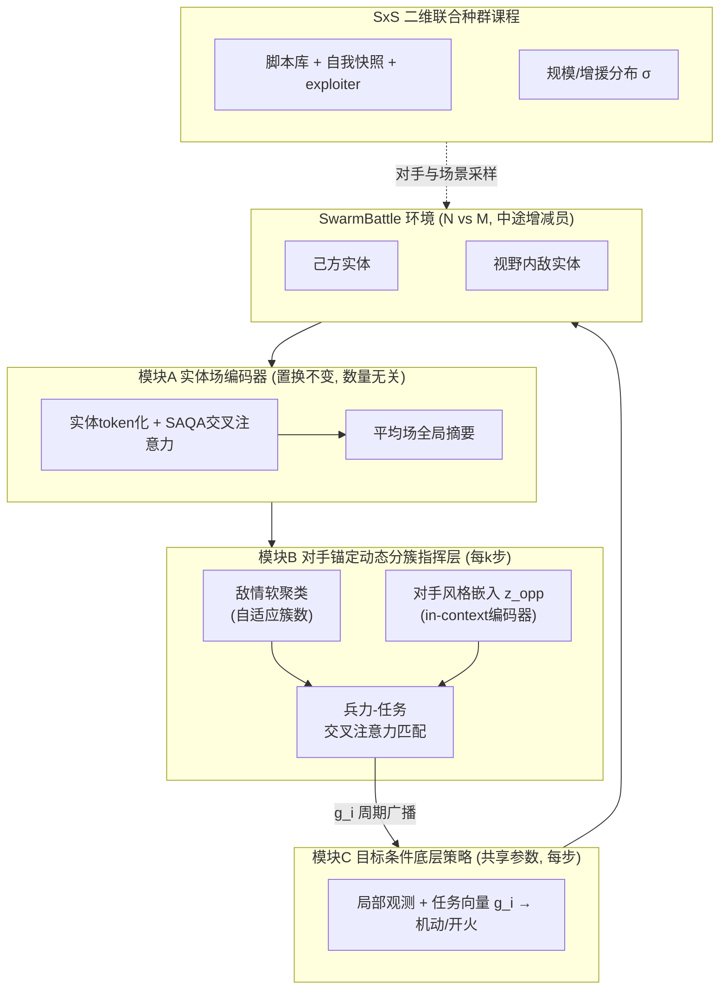

# 研究方案：SAGA — 集群对抗中规模无关的动态分组分簇与双重零样本泛化

> **版本注记（2026-07-20）**：本文档为初版研究方案，方向与叙事仍然有效；但细节以后续文档为准——网络与训练细节以 `06_网络与训练系统设计规格.md` 为准（如 K_max=8、token 20 维）、排期以 `07_技术路线图.md` 为准、实验协议以 `paper/03/05` 为准（如 MF-MAPPO 已降级为可选基线）。冲突处一律以新文档覆盖本文档。

**方法代号**：SAGA（**S**cale-**A**gnostic **G**rouping and **A**daptation for adversarial swarm engagements）
**目标会议**：ICLR 2027（预计摘要截稿 2026-09 中旬，全文截稿 2026-09 下旬）
**配套文档**：`01_文献调研与研究现状.md`（研究现状与空白定位）、`03_预期结果与风险.md`

---

## 1. 问题聚焦

### 1.1 概括性描述（论文叙事层）

在两个智能体集群的对抗博弈中，一方的作战效能取决于两个耦合的决策层次：**宏观上**如何把己方兵力动态地划分为若干任务簇（分组分簇、目标分配、兵力再平衡），**微观上**每个小规模任务簇如何执行底层交战（机动、火力协同）。现有方法在这两个层次上都存在根本性的"绑定"缺陷：

- **规模绑定**：策略网络结构或分组机制与训练时的双方数量绑定，双方兵力一旦超出训练分布——尤其是**对抗中途增援或减员**——策略立即失效；
- **对手绑定**：策略通过与固定脚本或镜像自身的自博弈训练，过拟合到单一对手风格，面对更笨、更聪明、性格迥异或使用奇招的对手时表现脆弱。

我们把这两个缺陷统一提炼为一个科学问题：

> **能否学习一个单一的分层集群对抗策略，使其对"双方规模（含对抗中途的动态增减员）"与"对手策略风格"实现联合的零样本泛化（dual zero-shot generalization）？**

我们的核心主张是：这两种泛化不是两个独立问题，而是同一个表征问题的两面——只要高层分组决策以**置换不变、数量无关**的方式直接锚定在"对手集群的实时结构"（对手在哪里、怎么分布、什么风格）之上，而不是锚定在固定的编号、固定的簇数或固定的对手模型上，规模泛化与对手泛化就能同时涌现。

### 1.2 具体运行环境与场景（可复现层）

论文中所有主张在以下明确定义的环境中验证（避免审稿人质疑"场景含糊"）：

**主环境 SwarmBattle（自研，JAX/GPU 向量化，SMAX 风格）**

- **物理**：二维连续平面（可选周期边界），每架单位为质点运动学模型（位置、速度、朝向），离散-连续混合动作：{转向角速度、加速度} × {是否开火、选择目标}。
- **交战规则**：单位具有生命值、射程、冷却、伤害、视野半径；进入射程且视线内方可攻击；生命值归零即被移除。
- **兵力设定**：红方 N 个单位对蓝方 M 个单位，N, M ∈ [4, 64] 独立采样，N ≠ M（非对称是常态）；训练时只见 N, M ∈ [4, 16]，测试外推到 64+。
- **动态增减员**：每局以泊松过程随机触发"增援事件"（一批新单位从边界进入任一方）与天然减员（被击落），策略必须在**同一 episode 内**无缝接纳新队友/应对新敌人。
- **部分可观测**：每个单位只能观测视野半径内的实体特征（相对位置、速度、朝向、血量、类型属性向量）；队内通信建模为高层指挥信息的周期性广播（每 k 步一次），符合带宽受限的现实约束。
- **异构类型（附加轴）**：单位类型由连续属性向量（速度上限、射程、血量、伤害）参数化，而非离散类别，天然支持"换型号"的属性外推评测。
- **胜负**：歼灭对方或时限内剩余兵力加权占优。

**公开基准评测轴（回应"自研环境"质疑）**：同一网络架构（不改参数结构）复用于两个公认开源基准——**MAgent2 battle**（PettingZoo 生态，大规模离散两队对抗）与 **MPE simple_tag**（连续追捕-逃跑）——证明方法不是为自研环境定制。SMAC/SMACv2 因依赖 StarCraft II 引擎（慢、不支持双方受控自博弈）不直接使用，但 SMAX 沿用其单位设定，叙事上等价。**第二环境**：Gigastep（NeurIPS 2023）对抗场景，用于千级规模压力测试；**对照基准**：MFEnv（对比 MF-MAPPO 时使用）。

**选择理由**：JAX 向量化使单卡即可完成种群课程训练（SMAX 报告比 SMAC 快 3-4 个数量级）；自研主环境保证对"规模分布、增援过程、对手脚本库"的完全控制——这三者正是我们评测协议的核心变量，现有环境均不完整支持。原型阶段已在本机 `gpu_py_310`（RTX 3060）打通 SwarmBattle/MPE/MAgent2 统一适配层与训练-回放全流程（`prototype/`）。

### 1.3 明确不做什么（容量控制）

- 不做 3D 高保真飞行动力学（JSBSim 类）——ICLR 关心方法学而非保真度；
- 不做通信协议学习、不做真实机群部署；
- LLM 驱动的机型适应/战术推理仅作为 Future Work 讨论，不进入贡献声明；
- 异构机型适应只做"属性向量外推"这一低成本版本，作为第五个实验轴，篇幅受限时可移入附录。

---

## 2. 研究价值

1. **问题价值**：集群对抗是 MARL 最具现实牵引力的场景之一，而"对手数量任意 + 中途增减员 + 对手风格任意"恰好是实战部署与实验室训练之间最大的分布鸿沟。现有应用文献（空战 HRL 系列）全部回避了这一鸿沟（见调研报告 §6）。
2. **方法学价值（对 ICLR 的贡献）**：
   - 提出**对手锚定的动态分簇**机制——簇的数量与语义由对手实时结构决定，而非超参数，这是"可学习分组"文献（目前仅合作场景、固定 K）没有的；
   - 提出**规模 × 风格联合种群课程**——首次把"跨规模课程"与"对手种群多样性"统一为一个二维自动课程，并给出轻量化实现（避免完整 PSRO 的算力灾难）；
   - 提出**双重零样本泛化评测协议**（含中途增减员协议），本身可成为社区基准。
3. **时机价值**：MF-MAPPO（ICLR 2026 投稿）证明社区正在关注大规模竞争团队博弈，但平均场路线抹掉了分组这一中观结构；SPECTra/CPE 证明数量无关架构成熟但只用于合作任务。两条线的交汇点尚空着，且所需部件成熟度都足够高——可行性与新颖性的比值处于最佳窗口。

---

## 3. 方法设计

SAGA = 三个模块 + 一个训练课程。总体为 CTDE 分层架构。

### 3.1 模块 A：实体场编码器（Entity-Field Encoder，规模无关的表征底座）

- 所有实体（己方存活单位、视野内敌方单位、增援中单位）统一编码为特征 token：`[相对状态, 属性向量, 阵营, 血量, ...]`；
- 共享 MLP 嵌入 + SAQA 式交叉注意力（每个决策者只作为 query，复杂度 O(nd)），聚合为该决策者的态势嵌入；
- 同时维护**队级平均场摘要**（双方兵力密度的直方图/软统计量），借用平均场思想作为廉价的全局上下文，但不替代实体级信息。
- **数学性质**：整个编码对实体置换不变、对实体数量无关 → 网络参数量与 N、M 完全解耦，这是规模泛化的必要条件。

### 3.2 模块 B：对手锚定的动态分簇指挥层（Opponent-Anchored Dynamic Clustering Commander）

每 k 步（如 k=8）运行一次，产出每个己方单位的任务向量。三步：

1. **敌情结构化**：对视野内敌实体做可微软聚类（注意力式 slot 分配，slot 数上限 K_max，实际激活簇数由数据决定——空 slot 自动退化），得到若干"敌簇描述子"（质心、规模、速度、类型构成、威胁度）；
2. **对手风格嵌入**：一个 in-context 编码器（GRU/Transformer over 最近 T 步的队级交战统计：对方压上速度、集中度、开火倾向、重组频率）输出风格向量 z_opp，**不监督、端到端**，条件化后续分配（这是 OEOM/IOM 思想第一次被提升到集群级）；
3. **兵力-任务匹配**：己方单位嵌入与"任务 slot"（每个敌簇派生交战/牵制/包抄任务 + 少量自由任务如预备队）做交叉注意力软分配，输出每单位的**目标条件向量** g_i =（任务类型嵌入, 目标簇描述子, 局部队友摘要）。

**关键设计声明**：簇数、任务数、分配全部是对手结构的函数 → 对手来多少人、怎么分布，任务结构自动同构变化；我方增援单位进场即被编码器接纳并在下个指挥周期获得任务。**规模泛化与对手响应因此由同一机制承担。**

### 3.3 模块 C：目标条件化底层交战策略（Goal-Conditioned Micro Policy）

- 所有单位共享参数；输入 = 局部观测的实体编码 + 自身任务向量 g_i；输出机动与开火动作；
- 每步执行、无需通信（g_i 在两次广播间保持），天然满足 decentralized execution；
- 用任务达成塑形（如"分配目标簇的血量下降/牵制成功"）+ 全局胜负稀疏奖励训练，双层通过 MAPPO 风格共享 critic 联合优化（critic 使用置换不变全局态势编码，规模无关）。

### 3.4 训练课程：规模 × 风格二维联合种群课程（SxS Curriculum）

二维采样空间：**规模轴** σ =（N, M, 增援率, 减员倾向）；**风格轴** π_opp ∈ 对手池。

对手池三成分（轻量化联赛，刻意避开完整 PSRO）：
1. **脚本库**（~12 个参数化脚本：贪心追击、集火、保守放风筝、包抄、诱饵、蜂拥、消极逃避……脚本参数连续随机化 → "笨"到"有章法"的连续谱，同时是评测的 held-out 来源）；
2. **历史自我快照**（prioritized fictitious self-play，按胜率优先采样打不过的旧自己 → 提供"聪明"对手与非传递性覆盖）；
3. **周期性利用者（exploiter）**：定期冻结主策略，从头训练一个专门克制它的对手加入池中（AlphaStar 思想的最小可行版，每次训练只需主策略 5-10% 的算力）。

课程调度：对（σ, π_opp）格子维护胜率表，按"学习前沿"优先采样（胜率接近 50% 的格子信息量最大，regret 式 UED 思想的离散简化）。

### 3.5 与最近邻工作的区分（预写 rebuttal）

| 近邻 | 区别 |
|---|---|
| MF-MAPPO | 平均场抹掉分组结构，无中观分簇，无风格泛化评测；我们把平均场仅用作全局摘要 |
| SPECTra / CPE | 仅合作任务的数量无关架构；无对抗、无分组决策、无对手池 |
| HRL-grouping (2501.06554) | 合作场景静态最优分组、固定候选组结构；我们是对抗驱动、簇数自适应、随态势重组 |
| OEOM / QOM | 单体小博弈的对手建模；我们做集群级风格嵌入且与分组决策耦合 |
| AHDRL_LRS | 高层注意力仅做目标选择（每机选一个敌机），非分簇结构；无对手泛化、无中途增减员 |
| AlphaStar | 单一巨型策略、无显式分组、算力不可复现；我们给出学术算力可行的最小联赛 |

---

## 4. 实验设计与评测协议

### 4.1 双重零样本泛化矩阵（主实验）

训练域：N, M ∈ [4,16]，对手 = 训练池。测试全部零样本（不微调）：

| 轴 | 测试条件 |
|---|---|
| S1 规模内插/外推 | 8v8 → 24v24 → 48v48 → 64v64；非对称 8v24、48v16 |
| S2 动态增减员 | 中途增援（敌方 / 己方 / 双方）、突发大规模减员（模拟遭伏击损失 50%） |
| G1 未见脚本 | held-out 脚本 + held-out 参数区间（含"极笨"与"奇招"型：自杀冲锋、假撤退诱伏、蜂群分裂） |
| G2 未见学习型对手 | 独立种子训练的 MAPPO/MF-MAPPO 对手、专门针对最终策略新训的 exploiter（≈可利用度下界） |
| S×G 交叉 | 未见规模 × 未见对手同时施加（论文题眼图：热力图矩阵） |
| H 属性外推（附加） | 敌方单位属性向量外推（更快/更远射程/更厚血 =「换重载机型」） |

**指标**：胜率与兵力交换比（主）、对 exploiter 的最差表现（鲁棒性/可利用度代理）、增援事件后的恢复时间（适应速度）、簇结构与敌结构的对齐度（互信息，可解释性分析）。

### 4.2 基线

MAPPO（共享参数扁平策略）/ MF-MAPPO / SPECTra 式数量无关扁平策略（隔离"分层分组"的增益）/ 固定 K 分组分层（隔离"对手锚定动态簇"的增益）/ 纯自博弈 SAGA（隔离"种群课程"的增益）/ 启发式上界脚本。

### 4.3 消融

(a) 去掉对手风格嵌入 z_opp；(b) 固定簇数 K；(c) 去掉 exploiter 成分；(d) 去掉规模课程（固定 8v8 训练）；(e) 指挥周期 k 的敏感性；(f) 去掉平均场摘要。每项对应论文一个 claim。

### 4.4 分析实验（ICLR 加分项）

- 簇分配的可视化案例研究：敌分兵 → 我自动分兵；敌增援 → 我预备队自动转向；
- z_opp 的 t-SNE：不同风格脚本在嵌入空间自动分离（无监督涌现的对手识别）;
- 规模外推曲线：性能随 N 增长的衰减斜率 vs 基线（论文第二张主图）。

---

## 5. 算力与可行性估算

- 单局 64v64 SwarmBattle（JAX）预计 >10⁵ steps/s/卡（SMAX 同量级）；总训练预算 ≈ 3×10⁹ 环境步/主策略 + 6 个 exploiter × 3×10⁸ 步 ≈ 单张 A100 两周，或 4090 一个月——学术算力可行；
- 所有基线共享同一环境与编码器实现，工程量集中在环境（约 2 周）与指挥层（约 1.5 周）。

---

## 6. 时间线（至 ICLR 2027 截稿，约 9 周）

| 周 | 里程碑 |
|---|---|
| W1-2 | SwarmBattle JAX 环境 + 脚本库 + 渲染；扁平 MAPPO 基线打通 |
| W3-4 | 模块 A/C（数量无关扁平版）+ 规模课程 → 先拿到 S1/S2 阳性结果（保底贡献） |
| W5-6 | 模块 B 动态分簇 + z_opp + 完整 SxS 课程 + exploiter 流水线 |
| W7 | 全量矩阵实验 + 消融（并行跑）；Gigastep 压力测试 |
| W8 | 分析实验、可视化、写作 |
| W9 | 打磨、内部评审、提交（摘要先行） |

**降级预案**：若 W6 动态分簇不稳定，退守"数量无关分层 + SxS 课程 + 双重零样本协议"作为主贡献（仍然成立）；若时间不足，砍掉 H 轴与 Gigastep。若整体延误，备选投递 ICML 2027（1 月截稿）。

---

## 7. 预期论文骨架

- **暂定标题**：*Dual Zero-Shot Generalization in Adversarial Swarms via Opponent-Anchored Dynamic Grouping*
- **摘要逻辑**：集群对抗部署时规模与对手皆不可知 → 现有方法双重绑定 → 提出对手锚定动态分簇 + 规模×风格联合课程 → 在训练域 4-16 单位、单一对手池的条件下，零样本泛化到 64+ 单位、中途增减员、未见风格与新训 exploiter → 双重泛化源于同一表征原理。
- 主图 1：架构图；主图 2：S×G 泛化热力图；主图 3：规模外推曲线；主图 4：簇结构可视化案例。

架构总览（mermaid）：

