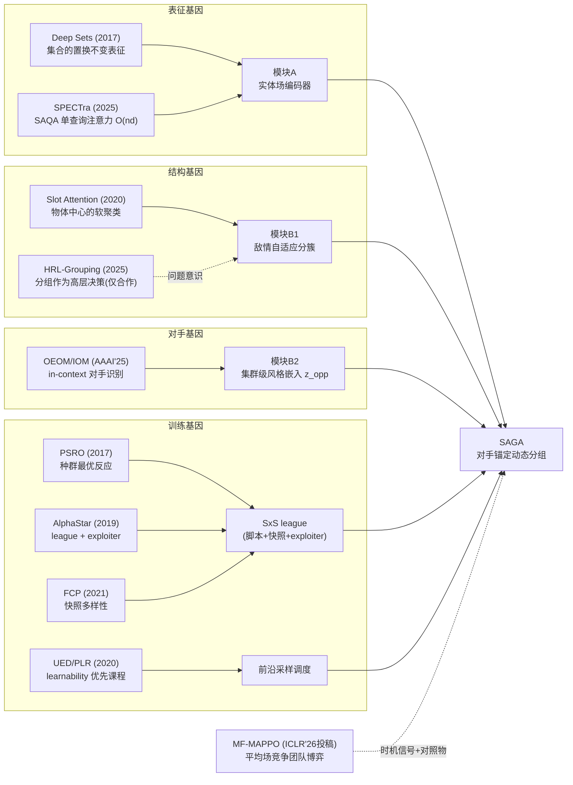

# 论文源流与领域地图（快速入行指南）

**目的**：说清三件事——本论文从哪些文献长出来（源流）、它在领域里值什么钱（价值定位）、这个领域的研究版图长什么样（综述地图）——让你两周内从"知道我们要做什么"到"能独立推进工作"。

---

## 1. 本论文的思想源流：每个部件的"基因"来自哪里

SAGA 不是凭空发明，它的每个部件都嫁接自一条成熟研究线；**创新在嫁接方式与问题框架**。理解这张谱系图 = 理解整篇论文：

**三句话说清创新在哪**（准备好随时向任何人复述）：
1. 前人把"网络参数与数量解耦"（SPECTra/CPE）做好了，但**决策结构**（分几组、谁打谁）仍锚定己方与固定超参——我们把分组决策锚定到**对手的实时结构**上，这是新的；
2. 前人把"对手多样性训练"（PSRO/AlphaStar）做好了，但都在固定规模；把"跨规模课程"与"对手种群"做成**联合二维课程**是新的；
3. 把"规模泛化"与"对手泛化"统一成**一个可评测的联合问题**（双重零样本矩阵 + 中途增减员协议），这个问题框架本身是新的。

**论文的直接源头**（工作从哪来的）：你提出的原始需求是"集群对抗中可扩展+可泛化的分组分簇与底层作战"。文献调研（`docs/01`）发现五条线各自成熟但交汇点是空白；本论文就是对这个交汇点的占位——用最小的新部件组合（嫁接）+ 最大的评测创新（协议）来占。

## 2. 领域版图：五条主线的现状、必读与我们的关系

> 详细综述见 `docs/01_文献调研与研究现状.md`；这里是"入行导航版"——每条线一句话现状 + 必读 3 篇以内 + 与我们的关系。

### 线 1：可扩展/数量无关 MARL 架构
- **现状一句话**：置换不变实体编码（Deep Sets/注意力/Set Transformer）已是标准答案，验证场景几乎全是合作任务（SMACv2/GRF），竞争博弈里"双方规模都变"没人做。
- **必读**：Zaheer et al. *Deep Sets* (NeurIPS'17)（只读 §2-3 的构造）；SPECTra (arXiv:2503.11726)（读 SAQA 与课程部分）；SMACv2 (NeurIPS'23 D&B)（读评测设计思想）。
- **与我们**：模块 A 的直接技术来源；我们的规模轴评测是它们的自然下一步。

### 线 2：平均场与大种群竞争博弈
- **现状一句话**：平均场把千级智能体变得可训练，代价是抹掉个体与小组结构；MF-MAPPO（ICLR'26 投稿）证明社区正在关注"大规模竞争团队"。
- **必读**：Yang et al. *Mean Field MARL* (ICML'18)（读问题设定即可）；MF-MAPPO (arXiv:2504.21164)（读实验设定与 MFEnv）。
- **与我们**：既是时机信号（问题热了），又是最重要的"对照物"（我们保留他们抹掉的中观结构）。

### 线 3：种群自博弈、PSRO 与 league
- **现状一句话**：对手过拟合的公认解是种群训练，完整 PSRO 算力不可及，2024-2026 的趋势是轻量化（JBR 的样本复用、UPD 的生成式伙伴、生成式出题者课程）。
- **必读**：Lanctot et al. *PSRO* (NeurIPS'17)（读框架不读理论）；AlphaStar (Nature'19)（读 league 设计段落）；UPD (arXiv:2508.06336)（读"无种群"思想）。
- **与我们**：SxS league 是"最小可行 league"，站在这条线的轻量化趋势上。

### 线 4：对手建模与 in-context 适应
- **现状一句话**：从显式贝叶斯类型（QOM）走向 in-context 无监督识别（OEOM/IOM），但全部停留在小博弈、单对手；"集群级对手行为建模"没人做。
- **必读**：OEOM (AAAI'25)（读 motivation 与 IOM 方法）；QOM (NeurIPS'25)（可选，读类型化思想）。
- **与我们**：z_opp 是把这条线提升到团队尺度的尝试，且嵌入的消费者从"单体响应"变成"分组决策"。

### 线 5：分层 MARL 与集群对抗应用
- **现状一句话**：应用论文多（空战/多机对抗，主要在期刊），方法学薄弱——分组靠启发式、对手是固定脚本、规模最多 6→20 迁移；ICLR 级别的抽象没人做。
- **必读**：AHDRL_LRS (Sci China'25)（读它做到哪，明确我们的增量）；HRL-Grouping (arXiv:2501.06554)（读分组的形式化）。
- **与我们**：这条线是"应用需求的证据"，也是必须在 Related Work 里划清界限的最近邻。

### 版图总结（一张图记住自己的位置）

| | 固定规模 | 变规模 |
|---|---|---|
| **固定/镜像对手** | 传统 MARL（MAPPO 等） | 线 1（合作）、线 2（平均场） |
| **多样对手** | 线 3（PSRO/league）、线 4（对手建模） | **← 本论文（空白区）** |

## 3. 价值定位（对不同听众的说法）

- **对审稿人**：首个把规模与对手两轴统一成可测协议的工作 + 可证伪的"对手锚定假设" + 学术算力可复现的最小 league；
- **对导师/答辩**：解决集群对抗从实验室到部署之间最大的两个分布鸿沟，理论（等变/稳定性/覆盖界）-方法-协议三位一体；
- **对工程界**：一个 checkpoint 应对任意规模与任意对手、免在线训练、CPU 可推理、指令可审计——部署契约见 `docs/05`。

## 4. 两周入行路径（按天）

**第 1-2 天：建立全局观**
- 读 `docs/10`（本文）→ `paper/01_introduction.md` → `paper/03_problem_formulation.md`（后两者是论文之魂，读到能复述"三句话创新"与"对手锚定假设"）；
- 跑 `prototype/run_smoke_test.py` 与 `viewer/replay.html`，直观感受环境与回放。

**第 3-5 天：吃透方法与理论**
- 读 `paper/04_method.md` 对照 `prototype/saga/` 代码（encoder→commander→agent 的顺序）；
- 读 `paper/08_theory.md`，重点命题 3 与 4 的假设（这是答辩时最可能被问的）；
- 跑 `prototype/test_clustering_p0.py`，理解 L_coh + 稀疏 warmup 的工艺。

**第 6-9 天：读外部必读文献（上面五条线共 ~10 篇，按线 1→3→4→5→2 顺序）**
- 每篇只读：摘要、方法图、实验设定——目标是能说出"它做到哪、没做到哪、我们接在哪"。

**第 10-14 天：进入执行**
- 读 `docs/06_网络与训练系统设计规格.md` 与 `docs/07_技术路线图.md`；
- 开始 W1 任务（JAX 环境迁移），对照规格文档 §4 验收清单工作。

## 5. 关键术语速查

| 术语 | 含义 | 出处 |
|---|---|---|
| 双重零样本泛化 | 规模×对手联合零样本迁移，矩阵 **G** | `paper/03` Def.1 |
| 对手锚定 (opponent-anchoring) | 分组结构=对手实时结构的函数 | `paper/03` §3.4 |
| S×G 矩阵 | 规模条件×对手条件的评测矩阵（论文主图2） | `paper/05` |
| SxS 课程 | scale×style 二维联合种群课程 | `paper/04` §4.4 |
| occupancy | slot 分到的实体质量，决定有效簇数 | `paper/04` §4.2 |
| z_opp | in-context 对手团队风格嵌入 | `paper/04` §4.2 |
| exploiter | 针对冻结主策略新训的克制对手（鲁棒性探针） | `paper/03` §3.3 |
| d_cover | 摘要空间中到训练支撑的最近 W1 距离 | `paper/08` F.4 |
| 恢复时间 | 增减员事件后优势趋势回归的时长 | `paper/03` Def.2 |
| league | 脚本+快照+exploiter 组成的对手池 | `paper/04` §4.4 |
