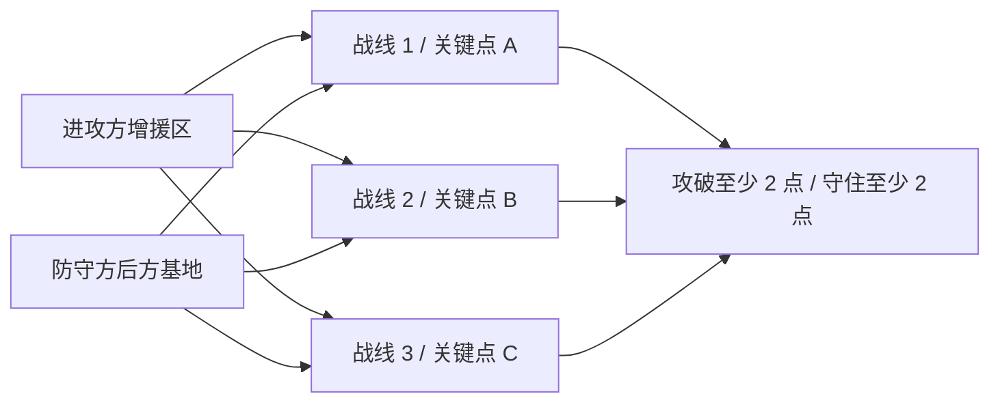

# 具体场景与问题定义

## 1. 三路关键资产攻防

首稿固定一个最小但不退化的场景：地图中有三个空间分离的关键点 (x_1,x_2,x_3)。进攻方在时限内攻破至少两个，防守方要守住至少两个；评估时交换红蓝角色，避免方法只对某一方有效。

- 进攻单位从地图边缘或前进基地进入；防守单位从关键点附近或后方基地进入。
- 双方起始各有约 6–10 个活动单位，允许同质首稿；异构速度、射程和生命值是扩展轴。
- 死亡会立即从活动集合移除单位；预先声明但时间/数量随机的增援波次会激活新单位。
- 每个关键点形成一条战线。至少三条战线才能产生“集中优势兵力还是分散守点”的真实宏观权衡；单目标会退化为全攻或全守。
- commander 看见论文协议允许的全局态势；下层个体只看局部实体、任务 token 和必要的队友信息。

这不是军事部署建议，而是用于研究多智能体动态资源分配的抽象仿真任务。

## 2. “分组”在这里的精确定义

上层动作不是先做几何聚类、再决定任务，而是直接把每个活动单位分配到一个宏观任务：

\[
g_t^k(i)\in \{(x_j,m):j\in\{1,2,3\},m\in\mathcal M_k\}\cup\{\text{reserve}\},
\]

其中 \(k\in\{R,B\}\) 表示一方，任务集合初版为：

- 进攻方：`assault`（突击目标）、`fix`（牵制目标）；
- 防守方：`hold`（固守目标）、`intercept`（拦截来袭）；
- 双方共有：`reserve`（待命/转场）。

被分到同一关键点的己方单位、出现在该点的敌方单位和资产目标共同构成局部子博弈。**因此任务分配天然定义了分组，不需要再优化一个没有任务意义的簇标签。** 若九种“关键点 × 任务”导致动作空间过大，P0 先只分关键点，局部任务由角色和点位状态确定。

## 3. 两个时间尺度

一个宏观周期包含 \(H\) 个低层控制步：

1. 读取活动单位、位置、血量、关键点状态、剩余时间和近期轨迹；
2. 双方 commander 同时提出分配 \(g_t^R,g_t^B\)；
3. 下层共享策略按任务 token 执行 \(H\) 步；
4. 处理伤亡、关键点变化和增援；
5. 每 \(H\) 步或在关键事件后重新规划。

事件触发集合首版只包含：`unit_death`、`reinforcement_arrival`、`asset_state_change`。这样能比较“每步重分、固定每 \(H\) 步、事件触发”三种策略，同时测量重编抖动。

## 4. 四阶段在具体场景中的职责

### 阶段 1：通用下层执行器

训练共享策略

\[
\pi_L(a_i\mid o_i^{\text{local}},m_i),
\]

覆盖 1–4 名队友、1–4 名对手、三类局部任务和一个训练对手池。它要在给定编组后尽力完成局部任务，但“任意数量、任意性格对手”是不可能验证的；论文只承诺预先规定的训练范围和 OOD 测试范围。主实验冻结同一个 checkpoint 给所有上层方法。

### 阶段 2：执行落地的战果模型

给定同一全局快照 \(s_t\)、双方完整候选分配、宏观时域和冻结下层版本，模型输出：

\[
p_\theta(y\mid s_t,g_t^R,g_t^B,\pi_L,H),
\]

其中 \(y\) 至少包含每条战线的任务成功、双方伤亡和解决耗时。模型不是从旧 commander 的日志被动拟合，而是克隆同一个仿真快照，主动执行多个候选分配，并对每个候选用共同随机数重复 rollout。

“能力边界”定义为在给定任务和对手分布下同时满足

\[
\operatorname{LCB}[P(\text{success})]\ge \tau,\qquad
\operatorname{E}[\text{loss}]\le \ell
\]

的态势—编组集合，而不是给智能体一个脱离任务的固定能力分数。

### 阶段 3：双边滚动分兵

双方各生成有限候选分配。战果模型对所有候选对构造短时域收益矩阵，并扣除转场/换组代价与不确定性惩罚；上层求一个正则化零和矩阵博弈或稳健 best response，执行一个宏观周期后重算。这里研究的是**资源分配对抗**，不是再做一次微观动作 RL。

### 阶段 4：可选共同适应

阶段 4 只允许最简单的交替更新：固定下层训练 commander；固定 commander 用 KL 约束微调下层；重新采集数据并刷新校准器。若一周内不能稳定提升 OOD 结果且不破坏校准，立即从主论文删除。

## 5. 形式化问题

令双方活动集合为 \(N_t^R,N_t^B\)，其基数在 episode 内随伤亡和增援变化。全局状态为 \(s_t\)，宏观分配为 \(g_t^R,g_t^B\)，固定下层和环境在 \(H\) 个微观步后诱导宏观转移：

\[
s_{t+1}\sim P_H(\cdot\mid s_t,g_t^R,g_t^B,\pi_L).
\]

团队回报由关键点状态、伤亡、任务进度和重分配代价构成。主场景采用对称零和标量回报，便于定义上层博弈；模型仍输出可解释的多维战果而不是只输出塑形 reward。

研究问题是：

> 在训练未见的兵力配比、增援时序和对手分兵策略上，使用经校准的执行战果分布，是否比手工效用、未校准 value、端到端上层策略更少高估危险编组，并带来更高的最终关键点任务成功率？

## 6. 三个可证伪假设

- **H1 预测层：**同态势干预数据和校准能降低选中方案的 Brier/NLL、false-safe 与相对 Monte Carlo oracle 的分配遗憾。
- **H2 决策层：**在相同下层与相同候选预算下，风险战果驱动的上层在未见兵力和增援事件后取得更高的关键点存活/攻破率，而不是只提高中间预测精度。
- **H3 对抗层：**面对历史快照、规则分配器和固定预算经验 best response，所提方法的最坏对手回报与事件后恢复速度优于单一对手训练和手工收益博弈。

任一假设没有被证据支持，就必须相应收缩贡献；不能用更漂亮的分组可视化替代任务结果。

## 7. 首稿明确不处理

- 真实武器系统、三维六自由度动力学和通信协议；
- 无界智能体数量；实现上使用最大槽位和 active mask，论文只测试明确范围；
- 完全不可观测对手类型的准确辨识；近期轨迹只作为可选条件，不单独声称对手建模贡献；
- 严格大规模 Nash/PSRO 收敛；只报告透明的矩阵求解和经验可利用度代理；
- 四阶段端到端可微联合训练。
