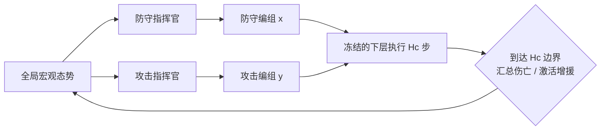

# 问题定义与创新边界

## 1. 明确场景

场景是一个**多目标点、双边集中指挥、下层分散执行的动态人口攻防博弈**：攻击方要在时限内摧毁任意一个关键目标，防守方必须让所有目标存活。双方单位会在战斗中死亡，并可在预先登记但时刻/规模随机的事件中获得少量增援。首篇采用固定控制周期：每隔 $H_c$ 个底层步，双方指挥官同时把边界时刻的有效单位重新分配到各目标或预备队。周期内的死亡立即影响微观执行，但不额外触发上层决策；增援也只在固定边界激活。下层单位只负责执行收到的任务。

这里研究的是**任务分配/编组**而非无监督聚类。单位被分配到同一目标后自然构成一个子群；若额外加入“分簇网络”，只会增加一个没有独立科学问题的模块。

## 2. 与标准研究范式的关系

它不是现成 benchmark 的标准任务名，但形式与主流模型兼容：

- 宏观层是具有同时动作的两人零和半马尔可夫/随机博弈；每个宏动作只承诺并执行 $H_c$ 步。
- 每一方有一个集中式 team commander，使用当时可用的全局实体集合；下层共享策略以局部观测和任务 token 分散执行。
- 每个宏步是一次带对抗外部性的多机器人任务分配；完整分区会影响各子任务价值，因此不能把小队价值独立相加。
- 轨迹内成员退出/加入属于 open-population 或 dynamic-roster 设定。为避免术语争议，论文标题优先写 **dynamic-population adversarial reallocation**，正文再解释“开放人口”。

## 3. 形式化

在宏观时刻 $t_k$，防守方有效单位集合为 $\mathcal D_k$，攻击方为 $\mathcal A_k$，目标集合为 $\mathcal G=\{g_1,\ldots,g_M\}$。环境事件可改变有效集合：

\[
\mathcal D_{k+1}=(\mathcal D_k\setminus L^D_k)\cup J^D_k,\qquad
\mathcal A_{k+1}=(\mathcal A_k\setminus L^A_k)\cup J^A_k,
\]

其中 $L$ 是战损，$J$ 是增援。主实验令 $J=\varnothing$，增援压力测试才令 $J\neq\varnothing$。这使主效应归因不再同时混入增援日程，同时保证接口确实支持加入与退出。

双方宏动作是完整任务分配：

\[
x_k:\mathcal D_k\rightarrow\mathcal G\cup\{\mathrm{reserve}\},\qquad
y_k:\mathcal A_k\rightarrow\mathcal G\cup\{\mathrm{reserve}\}.
\]

下层策略 $(\pi_D,\pi_A)$ 在整篇首稿中固定。对候选 $(x_k,y_k)$，双方只将这一组宏动作执行一个控制周期 $H_c$；若回合尚未终止，则从第二个周期起由固定、版本化且方法无关的 continuation rule $\kappa$ 接管双方宏分配，直到结果窗口

\[
H_o=K_oH_c,\qquad K_o=3\ \text{(默认)}.
\]

核心二元结果为

\[
Z_k^{H_o}=\mathbf 1\{\text{在 }[t_k,t_k+H_o]\text{ 内任一目标失守}\},
\]

结果模型估计

\[
p_\phi\!\left(Z_k^{H_o}=1\mid S_k,\operatorname{do}(x_k),\operatorname{do}(y_k),
\pi_D,\pi_A,\kappa,H_c,H_o\right).
\]

只有首个 $H_c$ 内的双边编组随候选改变，后续统一使用 $\kappa$；在线部署也只执行首个 $H_c$，然后以新态势重新规划。“同态势干预”意味着从可恢复的同一状态和同一外生随机带出发，只替换首个周期的 $(x_k,y_k)$。这一配对设计用于密集覆盖与方差缩减；除非明确给出结构因果模型语义，论文不使用更强的“个体反事实”措辞。

为避免 Claude 版的条件独立假设，主模型**直接预测 $Z_k^{H_o}$**，不再用 $\prod_m(1-p_m)$ 拼接整体胜率。目标级损伤、双方伤亡和耗时只作数据诊断，不增加预测头，也不进入 S3。

## 4. 信息假设

首篇采用最容易复现的版本：上层指挥官在宏观时刻看到双方单位和目标的当前物理状态，但看不到对方即将选择的分配；双方同时动作。下层单位只看局部实体。对手“未知”仅指：在双方下层策略与实体落地器均固定时，本步不能观察对方在**预注册有限 allocator 候选集**中实现的宏观分兵；它不指隐藏的新微观策略或对手人格。

未见下层对手策略若不提供历史或类型标签，单个快照无法识别其未来行为，因此**不作为首篇核心主张**。对手策略库用于训练覆盖和鲁棒性评测；真正的无标签对手辨识留给后续工作。

## 5. 研究问题与可证伪假设

**RQ：** 一个在随机候选上校准良好的结果模型，被指挥官用于比较多个有限双边编组后是否仍保持经验可靠；若不保持，同态势配对干预、selector-aware 训练/校准和经验保守修正能否降低独立测试上的真实决策遗憾？

对应三条假设：

- H1：普通模型在随机候选上的误差小，但在自身选中候选上的 false-safe 显著增加，即存在 selection gap。
- H2：同态势配对干预比相同预算的日志或非配对数据更有效地学习候选间排序。
- H3：selector-aware 训练/校准与经验保守修正若能降低离线遗憾，该改善应能在动态人口闭环中转化为更好的预注册有限对手池最坏收益，而不只是更好看的 NLL。

任何一条不成立，都必须收缩相应宣称；若 H1 与 H3 同时不成立，首篇核心故事不成立。

## 6. 核心创新与非创新

核心贡献不是某个新 Transformer，而是一个**面向双边动态编组的选择失效问题、配对干预数据协议和完整证据闭环**：

> 对双方完整编组的首个 $H_c$ 做同态势配对干预，再用公共 continuation $\kappa$ 生成 $H_o$ 二元失守标签；在冻结 OOF pilot 关注区域加权拟合，并以独立 Selector-Cal / Bound-Validate 校准和经验修正，最终只在 sealed Test 检验 selected false-safe 是否下降并带来低遗憾在线重编组。

| 组成 | 是否主创新 | 写法边界 |
|---|:--:|---|
| 参数共享实体集合执行器 | 否 | 复用 REFIL/UPDeT/MAPPO 思想并冻结 |
| 同态势双边完整编组数据 | 协议贡献 | CRN/随机干预本身不新；新意只能来自双边完整分区、共同 $\kappa$ 和选择失效问题的组合 |
| 交叉拟合、校准 + 决策排序 | 单独否 | 都有现成先例；只是实现 selector-aware 接口的标准组件 |
| 经验保守修正 + maximin | 单独否 | cluster bootstrap 和 LP 都是标准件；修正无逐点或最终决策保证，价值只能由独立测试证据支持 |
| 上下层联合优化 | 首篇否 | 移至第二篇，不能把普通交替训练包装成新贡献 |

## 7. 论文贡献应写成三条

1. 定义动态人口多目标攻防中的双边编组选择失效问题，检验随机候选准确不等于选择后经验可靠。
2. 提出一个可复现的双边配对干预数据协议：候选承诺 $H_c$，公共 $\kappa$ 展开至 $H_o$，并用 lineage 隔离的 selector-aware 训练、校准和经验修正生成保守风险分数。
3. 建立“预测—决策—闭环”证据链，检验上述协议是否在标准 maximin 求解器中减少 selected false-safe 与 decision regret，而不把标准校准、ranking 或 LP 包装成新算法。

不要把环境、实体注意力、温度缩放、ensemble、Hungarian、LP 或任务 token 分别列成创新点。

## 8. 适用边界

- 候选编组在首个 $H_c$ 内固定，结果窗口的后续部分一律使用版本化 $\kappa$；在线每 $H_c$ 重规划，不因周期内伤亡提前触发。
- 首篇最多三个目标、同质打击单位和计数级编组；实体级映射由 Hungarian/min-cost matching 完成。
- 保守修正是基于独立 lineage 的 cluster-bootstrap 经验分数，只能在与 Bound-Validate 相近的 roll-in/候选分布上讨论层内平均低估；截断和再次选择后均无逐候选或最终决策保证。
- 结果模型绑定冻结的下层策略版本；更换执行器必须重新采集或显式处理策略漂移。
- 自建环境结果必须由第二个公开仿真基座上的范围化新任务扩展和公平预算的强基线支撑，否则只能说明一个案例。
