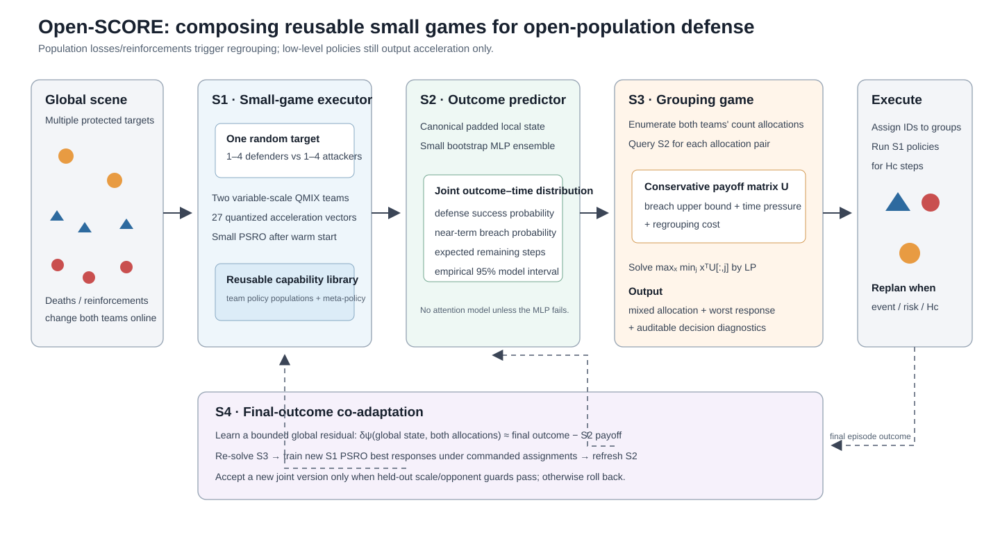
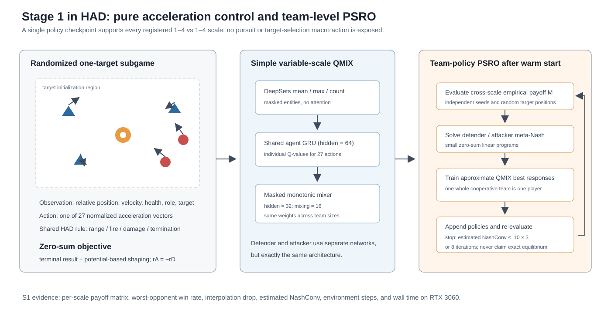

# Open-SCORE 方法简版

## 1. 方法主线

开放规模攻防的困难不是单个智能体不会移动，而是战损和增援同时改变了“局部能不能守住”和“全局该怎样分兵”。Open-SCORE 不直接让一个大网络从全局状态输出所有微动作，而是把问题分成可验证的四层：先学会小型单目标子博弈，再预测每种局部编组的结局，上层对双方分组求稳健策略，最后由整局胜负纠正局部模块。

## 2. S1：规模条件化的局部博弈执行器

每个子博弈只包含一个随机目标和双方各 1–4 名单位。防守方与攻击方分别采用参数共享的 QMIX 团队策略。每个智能体仅输出 27 个量化加速度之一；目标相对位置属于观测，不是动作宏。

普通 QMIX 的 mixer 绑定固定智能体槽位。本文让每个活跃智能体产生非负条件权重并做掩码平均，从而保持单调分解且不固定人数。网络仅使用 DeepSets mean/max、64维 GRU 和小型 mixer。

为了避免两方策略相互过拟合，warm-start 后运行小型 PSRO：在跨规模经验 payoff matrix 上求 meta-Nash，轮流用 QMIX 训练团队近似最佳响应。S1 输出的是版本化策略种群及元策略，而非对单个脚本有效的一条策略。

## 3. S2：简单的结局—时间预测

给定一个目标及预设敌我子群，按固定规则排序并 padding 成向量 $x$。小 MLP 预测“防守在第几个时间桶获胜、攻击在第几个时间桶突破、或超时”的联合分类分布。

该分布直接给出防守胜率、下一指挥周期失守率和预计剩余步数。五个 bootstrap MLP 提供经验 95% 模型区间。S2 的设计目标是准确、校准和便宜，不以复杂网络为贡献。

## 4. S3：实时双方分组博弈

在每个指挥时刻，上层分别生成敌我数量分配候选。对每个候选对，把各目标的局部子群送入 S2，获得失守概率上界和时间压力，从而构成防守收益矩阵 $U$。

防守方求解

$$
\max_x\min_j x^TU_{:,j},
$$

并从混合策略 $x$ 采样实际分组。攻击方可以求对偶元策略；若真实攻击策略未知，防守 maximin 仍表示对注册攻击候选的稳健响应。人口事件发生后立即重建候选和收益矩阵。

S3 第一版是可解释的 receding-horizon 博弈，而非又一个深度网络；高层 MAPPO 是判断“一步博弈是否过于短视”的 baseline。

## 5. S4：最终胜负共同适应

前三阶段可能分别正确却组合错误，例如局部胜率高的分组导致另一目标长期暴露。S4 用整局最终胜负训练一个小型全局残差 $\delta_\psi$，将 S3 收益改成

$$
U^{joint}=U^{S2}+\eta\delta_\psi(s,z^D,z^A).
$$

然后在新指挥分布上训练 S1 的 PSRO 最佳响应，重新采样刷新 S2，并用 held-out 规模最坏胜率决定接受还是回滚。该过程属于带守卫的交替强化学习，而不是 LLM 微调或不可审计的全链路反传。

## 6. 相对端到端方法的预期改进

Open-SCORE 不追求在一个固定 4v4 任务上击败所有端到端方法；它要证明的是：局部能力库和上层显式博弈在总规模变化、目标数变化、对手策略变化和局内人口事件下具有更好的组合泛化、最坏表现和可解释性。

若 Monolithic Variable-QMIX/MAPPO 在这些 OOD 条件下仍全面更强，则四阶段假设被否证，论文不应靠展示中间模块曲线维持结论。
