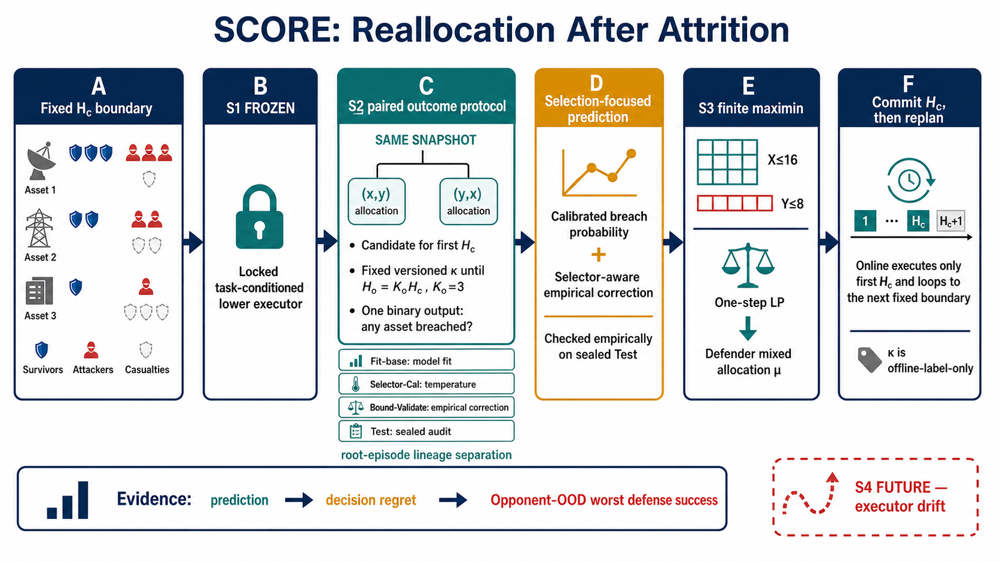
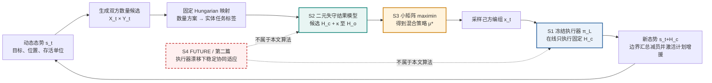
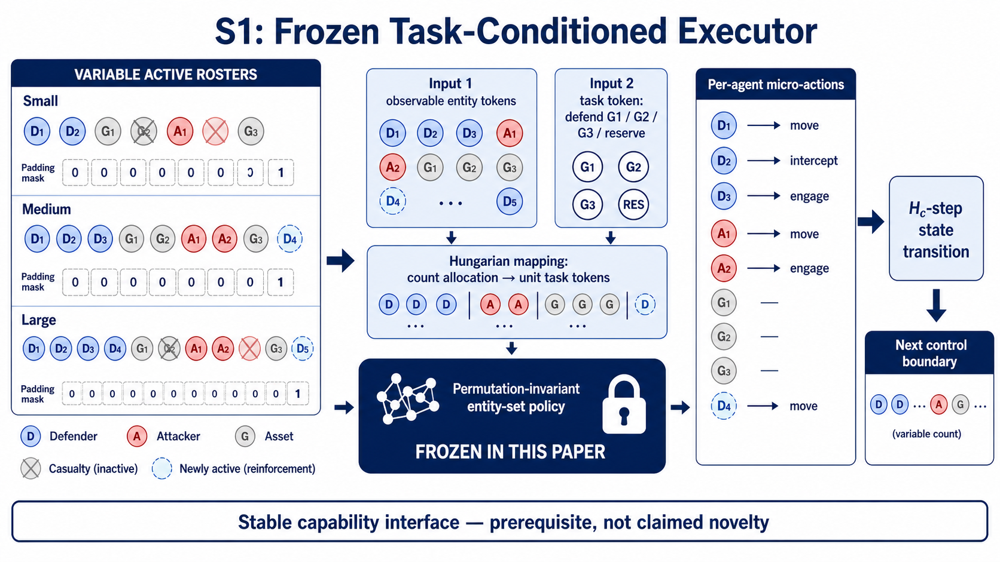
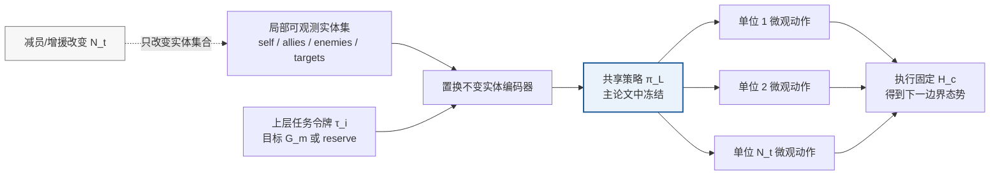
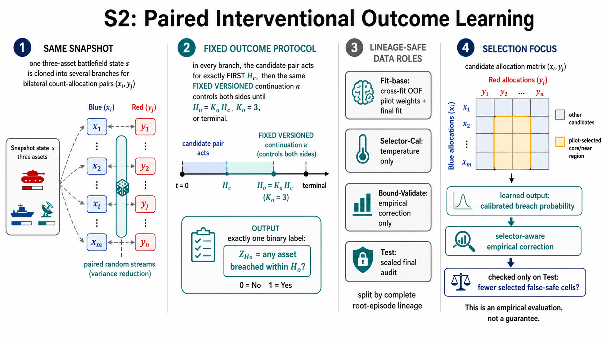
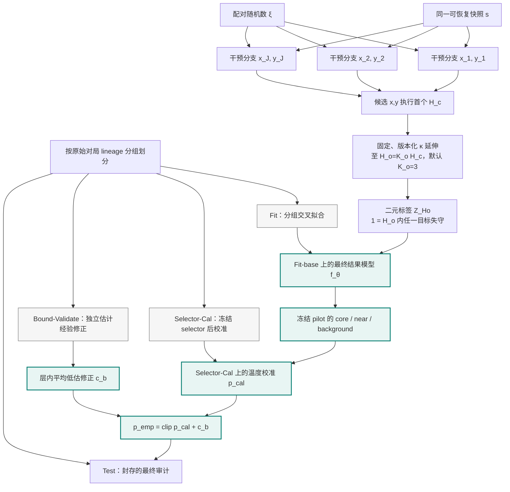
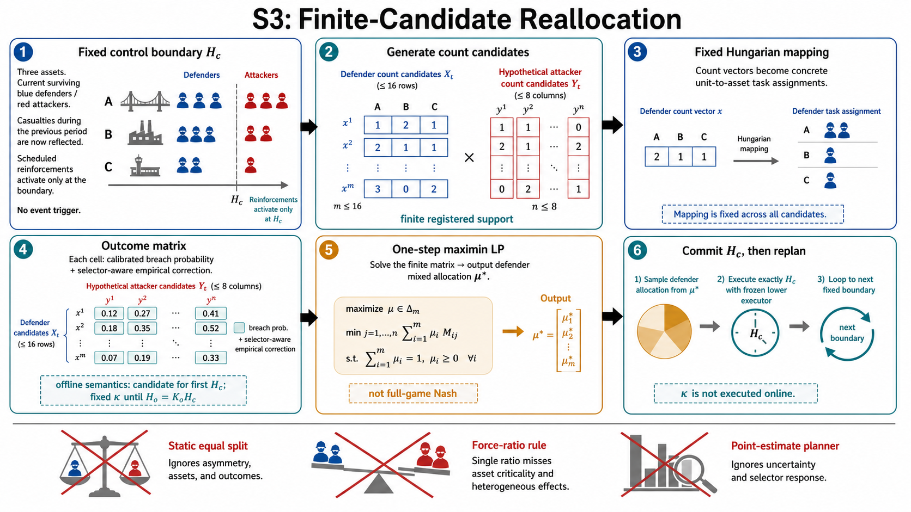
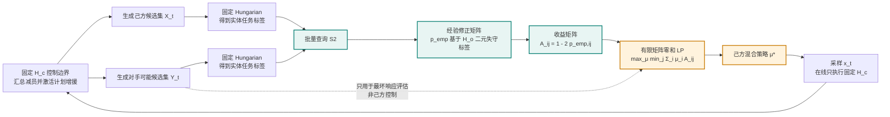
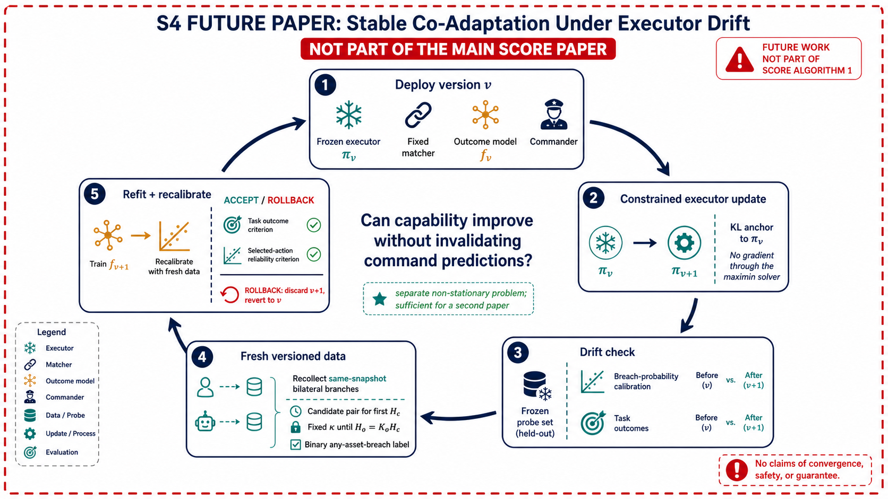
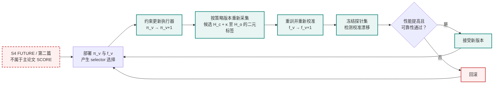

# SCORE 图表、可编辑草图与生成记录

> 本文件集中保存论文图的定位、可复现提示词与可编辑结构。技术定义以 [`03_方法简版.md`](03_方法简版.md) 和 [`04_方法实现规格与伪代码.md`](04_方法实现规格与伪代码.md) 为准；PNG 只用于讨论叙事与版式，不能代替最终论文矢量图。

## 1. 使用约定

- 五张 PNG 均由 **imagegen 全新生成**，生成时没有引用、上传或编辑任何输入图。
- 统一视觉模式为 **16:9、白底、科研信息图、扁平矢量概念风格**；蓝色表示防守/执行，红色表示进攻/风险，青色表示结果模型，橙色表示上层求解。
- 下面的提示词用于复现“信息结构与视觉意图”，不承诺像素级重现。生成模型可能改变英文标签、图标或排版。
- 当前主协议固定为：每隔控制周期 $H_c$ 在线重规划；离线结果标签先让候选 $(x,y)$ 执行首个 $H_c$，再由固定且版本化的 continuation rule $\kappa$ 延伸至 $H_o=K_oH_c$（默认 $K_o=3$）；主标签 $Z_{H_o}$ 是“窗口内是否有任一目标失守”的二元 mission-breach 标签。**没有事件触发的可变控制周期。**
- 五张 PNG 已于 **2026-08-28** 在协议冻结后重新生成：均使用固定 $H_c$、固定延续 $\kappa$、$H_o=K_oH_c$、单一二元失守标签与经验修正语义；旧版 `event trigger / first breached asset / risk bound` 图已被替换。
- PNG 是可视化参考，不是统计主张。图中的 empirical correction 只表示 pilot-selector-focused 层内的经验平均低估修正；是否减少 selected false-safe 必须由封存 Test 验证，且没有逐状态或最终决策保证。
- 投稿前应在 draw.io、Figma、Illustrator、Inkscape 或 LaTeX/TikZ 中按本文件的 Mermaid 结构**重新绘制为 PDF/SVG 矢量图**，统一字体、符号和线宽，并删除生成式图片中的装饰元素。

## 2. 图的用途与正文位置

| 图 | 核心用途 | 推荐正文位置 | 投稿处理 |
|---|---|---|---|
| 01 总图 | 一眼说明动态态势、冻结 S1、核心 S2+S3 及证据链 | Introduction 末页或 Method Overview | 重点矢量重绘 |
| 02 S1 | 交代可变规模、任务条件执行与冻结边界 | Preliminary / Problem Setup | 可缩为半栏 |
| 03 S2 | 展示同态势双边干预、结果分布与选择后可靠性 | Method: Outcome Model | 建议跨双栏 |
| 04 S3 | 展示固定控制周期、候选矩阵、maximin 与在线滚动重编组 | Method: Reallocation | 建议跨双栏 |
| 05 S4 | 说明执行器漂移为何是独立科学问题 | Discussion / Future Work | 不放主方法图 |

---

## 3. 图 01：SCORE 总体框架



**正文叙事。** 单次重规划从固定 $H_c$ 边界处的动态兵力态势出发：冻结的下层执行器 S1 提供稳定能力接口；S2 预测候选首个 $H_c$ 动作在共同 $\kappa$ 延伸至 $H_o=K_oH_c$ 后的二元任务失守风险，并修正选择后低估；S3 在小型风险矩阵上求单步 maximin，只在线提交首个 $H_c$，随后从新态势滚动重规划。S4 必须以虚线和 `FUTURE` 标识，不能让读者误以为它属于本文算法。

**当前 PNG 语义。** 图中已同时标出离线标签协议和在线执行协议；投稿矢量重绘时应继续保留四类 lineage 数据隔离及 S4 的虚线边界。

**精炼可复现提示词。**

```text
Create a clean 16:9 scientific flat-vector infographic on a white background titled
“SCORE: Trustworthy Reallocation Under Dynamic Populations”. Show a multi-target
attack-defense battlefield whose team sizes change after casualties or reinforcement.
Build a left-to-right pipeline with four color-coded blocks: S1 FROZEN EXECUTOR,
task-conditioned local control; S2 INTERVENTIONAL OUTCOME MODEL, same-snapshot
 bilateral assignment branches and a selection-calibrated binary mission-breach
 probability over an offline outcome horizon H_o = K_o H_c (default K_o = 3); S3
 RISK-AWARE REALLOCATION, a small payoff matrix and mixed-strategy maximin; and a red
 dashed S4 FUTURE CO-ADAPTATION box clearly outside the main algorithm. Loop the executed
 assignment back after one fixed online control period H_c, with no event-triggered
 duration. Indicate that offline labels execute candidate (x,y) for the first H_c and
 then use one fixed versioned continuation rule kappa until H_o, whereas deployment
 executes only H_c before rolling replanning. Add a bottom evidence strip with
prediction reliability, decision regret, and closed-loop mission outcome. Use navy,
teal, amber, and red, minimal military symbols, crisp arrows, no photorealism, no 3D,
no decorative clutter, publication-ready hierarchy, large readable English labels.
```

**可编辑结构图。**



---

## 4. 图 02：S1 冻结的任务条件执行器



**正文叙事。** S1 接收变长实体集合和上层任务令牌，在不同队友数、对手数和目标分配下执行微观动作；它是 SCORE 可被研究的前提，而不是论文创新。主实验中策略参数固定，避免 S2 的能力标签随训练漂移。

**当前 PNG 语义。** S1 只画到 `H_c-step state transition`，不承担 $H_o$ 结果预测；锁标记说明它是本文冻结的能力接口。

**精炼可复现提示词。**

```text
Create a 16:9 white-background scientific flat-vector diagram titled “S1 Frozen
Task-Conditioned Executor”. On the left, show small, medium, and large groups with blue
defenders, red attackers, gray assets, absent/dead slots, and newly active slots. In the
center, show variable-length entity inputs: self, allies, enemies, targets, and a task
token such as G1, G2, G3, or reserve. Feed them into one shared permutation-invariant
entity-set policy with a prominent lock icon and label “FROZEN FOR THE MAIN PAPER”. On
 the right, show per-agent local actions such as move, intercept, and engage, leading to
 a fixed H_c-step state transition, not a variable event-triggered duration and not the
 full offline label horizon. Add a bottom ribbon: variable roster → shared parameters
→ assignment-conditioned execution, and the caption “Prerequisite, not the claimed
novelty”. Use navy and pale blue with restrained red accents, crisp arrows, no
photorealism, readable English labels, publication-style spacing.
```

**可编辑结构图。**



---

## 5. 图 03：S2 选择校准的干预结果模型



**正文叙事。** 从同一可恢复快照复制多个分支，对双方首个数量编组 $(x,y)$ 做干预，并使用配对随机数运行冻结 S1：候选只作用于首个 $H_c$，之后由双方共享的固定、版本化 $\kappa$ 接管，直至 $H_o=K_oH_c$（默认 $K_o=3$）或任务终止。模型主输出仅为二元概率 $P(Z_{H_o}=1)$，其中 1 表示窗口内任一目标失守。Fit-base 分组交叉拟合产生 OOF pilot 权重；最终模型只在 Fit-base 训练；冻结后再由互不重叠的 Selector-Cal 与 Bound-Validate lineages 分别完成校准和经验修正。该流程只对准冻结 pilot 关注的候选区域，最终 SCORE 的实际访问分布只能在封存 Test 审计。

**当前 PNG 语义。** 图中只有一个二元 mission-breach 输出，并显式区分四类 lineage 数据角色；配对随机流仅标为降方差手段，没有被画成一般因果识别定理。

**精炼可复现提示词。**

```text
Create a wide 16:9 scientific flat-vector infographic titled “S2 Selection-Calibrated
Interventional Outcome Model”. Divide it into three clear panels. Left: one multi-asset
battlefield snapshot is cloned into several branches; each branch applies a different
 bilateral defender-attacker first assignment pair (x_i, y_j), uses the same random
 tape, executes that candidate for exactly H_c, and then applies one fixed versioned
 continuation rule kappa for both sides until H_o = K_o H_c, default K_o = 3, or terminal.
 Middle: a permutation-invariant full-partition encoder predicts one binary probability:
 whether any asset is breached within H_o. Do not use first-breached-asset, damage, or
 casualty distributions as main outputs; optional diagnostics must be visually
 subordinate. Right: contrast acceptable average calibration on random
candidates with selected-action calibration after the commander chooses candidates;
show group cross-fitting, fresh rollout labels, and an empirical conservative correction
for average underestimation within pilot-selector-focused strata. Emphasize “average accuracy
is not enough”. Use teal as the main color, navy/red for teams, amber for risk, white
background, crisp arrows, restrained icons, readable English labels, no photorealism.
```

**可编辑结构图。**



---

## 6. 图 04：S3 风险感知的双边重编组



**正文叙事。** 每个固定 $H_c$ 控制边界，双方分别生成一个可控的小候选集，通过固定 Hungarian 映射落到实体任务；周期内伤亡在下个边界汇总，预注册增援只在边界激活。S2 以离线 $H_o$ 标签语义批量填充保守风险矩阵，防守方在有限候选矩阵上求单步 maximin，采样己方编组后在线只提交 $H_c$，再从新态势滚动重规划。论文不采用事件触发的可变 option duration，也不声称求解原始连续动态博弈的纳什均衡。

**当前 PNG 语义。** 图中所有重规划都发生在固定 $H_c$ 边界；候选支持、固定映射、离线标签语义和“$\kappa$ 不在线执行”均已显式标出。

**精炼可复现提示词。**

```text
Create a 16:9 scientific flat-vector process diagram titled “S3 Risk-Aware Bilateral
 Reallocation”. Show five numbered stages from left to right: (1) one fixed control
 boundary every H_c steps, with no event-triggered variable duration; casualties are
 accumulated and scheduled reinforcement activates only at the boundary, (2) small
 count-vector candidate sets X for defenders and
Y for attackers, each mapped to concrete units, (3) a batched matrix filled by the
selection-calibrated outcome model using empirically corrected mission risk, (4) a
small zero-sum maximin linear program producing a defender mixed strategy, and (5)
 sampling the focal defender assignment, mapping it to assets, committing for exactly
 H_c, then rolling replanning from the new state. State that the matrix risk semantics
 come from the offline binary mission-breach horizon H_o = K_o H_c with fixed continuation
 kappa, but kappa is never executed online. Make the opponent candidates hypothetical
 worst responses rather than
actions controlled by the focal commander. Add a small crossed-out baseline strip for
static allocation, force-ratio rules, and pointwise argmax. Use amber for the solver,
blue for defenders, red for attackers, teal for the loop, white background, crisp
arrows, readable labels, no photorealism and no claim of a full-game Nash equilibrium.
```

**可编辑结构图。**



---

## 7. 图 05：S4 执行器漂移下的稳定协同适应



**正文叙事。** 该图只说明下一篇论文的问题：当执行器 $\pi_L$ 更新后，旧结果模型会失效，因此需要带版本的数据、约束更新、重新采集、重新校准、冻结探针集监测与回滚机制。重新采集仍沿用固定协议，即候选执行 $H_c$、固定 $\kappa$ 延伸到 $H_o=K_oH_c$ 并记录二元失守标签；它不得出现在本文 Algorithm 1、贡献列表或主实验中。

**当前 PNG 语义。** 红色虚线外框和两处 `NOT PART` 标记把 S4 与本文算法隔开；探针集同时检查闭环任务结果与 selected-action reliability，并沿用固定 $H_c/\kappa/H_o$ 数据协议。

**精炼可复现提示词。**

```text
Create a 16:9 scientific flat-vector concept figure with a red dashed outer border and
the title “S4 FUTURE PAPER: Stable Co-Adaptation Under Executor Drift”. Add a prominent
banner “NOT PART OF THE MAIN SCORE ALGORITHM”. Show a four-stage clockwise loop:
deploy the current frozen executor and outcome model through a commander; constrained
executor adaptation with a KL anchor and no end-to-end gradient through the solver;
 recollect fresh same-snapshot branches with policy-versioned data, always using the
 fixed protocol “candidate for H_c, fixed continuation kappa until H_o = K_o H_c, binary
 mission-breach label”; refit and recalibrate the outcome model for selected actions.
 At the bottom, use a frozen probe set to measure
calibration drift, then an accept-or-rollback gate. State the research question: can
reliability be maintained while both levels improve? Use navy and teal for the loop,
red only for warnings and rollback, amber for the outcome model, white background,
clear English labels, no photorealism, visually unmistakable as future work.
```

**可编辑结构图。**



---

## 8. 投稿重绘清单

1. 只保留正文会解释的变量：$s_t,x,y,H_c,H_o,K_o,\kappa,Z_{H_o},\hat p^{\mathrm{cal}},c_b,p^{\mathrm{emp}},\mu^*$；装饰性图标可全部删除。
2. 总图明确标注“**核心问题：选择后的假安全预测**”“S1 frozen”“S4 FUTURE / second paper”；不要把所有标准组件都包装成独立创新。
3. S2 图把 Fit、Selector-Cal、Bound-Validate 和 Test 的 lineage 隔离画清楚，避免给出逐点安全保证的视觉暗示。
4. S3 图强调只控制 focal side；对手候选用于有限集合上的最坏响应，不把双方混合策略都画成可同时操控的输出。
5. 所有图统一区分“离线标签窗口 $H_o=K_oH_c$”与“在线提交周期 $H_c$”，删除事件触发箭头；没有完成端到端测速前只写 **online**，不写 real-time。
6. 导出 PDF/SVG 前检查数学符号、字体嵌入、灰度可辨性和双栏缩放后的最小字号；PNG 仅保留在仓库中作为讨论参考。
