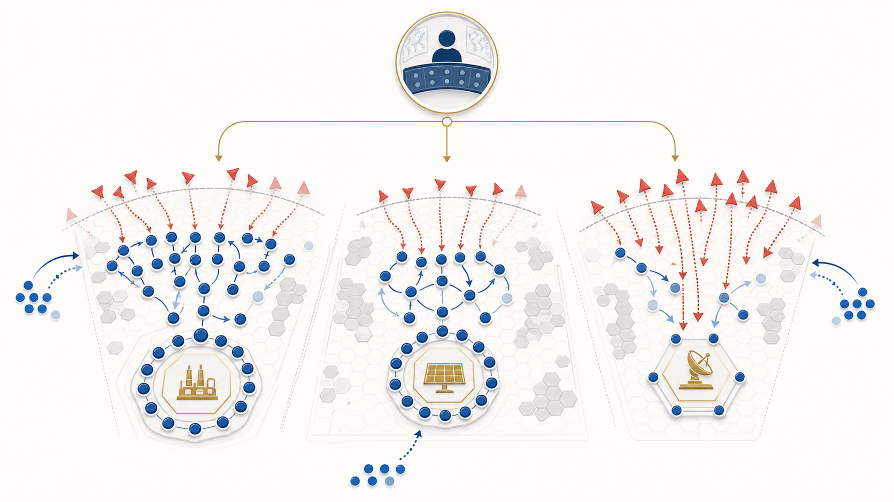
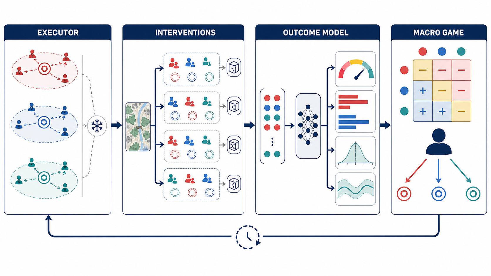

# 图表与生成说明

## 图 1：研究动机

建议图注：

> **Why macro reallocation is necessary.** Three spatially separated fronts create a global resource trade-off that independent low-level agents cannot resolve. Attrition and reinforcement invalidate a previously reasonable allocation, requiring the commander to redistribute active agents before an understaffed critical asset fails.

用途：Introduction 的动机图、开题汇报或方案讨论。左、中、右三路分别呈现兵力充足、接近平衡和危险不足的视觉差异，上方 commander 表示全局资源调度。

## 图 2：方法框架

建议图注：

> **COGAR overview.** A task-conditioned executor is frozen to define a stable capability interface. Multiple bilateral allocations are intervened on from the same cloned snapshot and rolled out with common random numbers. EGOM predicts calibrated distributions over task success, casualties, time, and uncertainty. A macro allocation game converts these outcomes into a risk-aware receding-horizon decision.

用途：Method 总览。四栏分别是执行器、同态势干预、战果模型和宏观博弈，底部回环表示事件触发的滚动规划。

## 可编辑版本

- 场景 Mermaid 源图在 [01 具体场景与问题定义](01_具体场景与问题定义.md)；
- 方法 Mermaid 源图在 [05 COGAR 方法框架](05_COGAR方法框架.md)。

正式投稿前建议根据最终实现用 Illustrator、Inkscape、Figma 或 TikZ 重绘成矢量图，并确保图例、颜色、字体、变量和论文公式完全一致。当前 PNG 是研究参考图，不应作为已经实现各模块的证据。

## 生成记录

- 生成日期：2026-08-27；
- 模式：imagegen 全新生成，无参考图片；
- 动机图提示重点：无文字、三条战线、红蓝抽象 agents、关键资产、伤亡淡化、增援箭头、宏观 commander、Nature/IEEE 风格；
- 方法图提示重点：四栏 EXECUTOR / INTERVENTIONS / OUTCOME MODEL / MACRO GAME、同快照分支、概率/伤亡/耗时/不确定性输出、收益矩阵和滚动回环；
- 原始生成文件保留在 Codex generated_images 目录，项目副本位于 docs/figures。

两张图均是抽象多智能体研究示意，不代表现实作战部署、武器系统或仿真真实性。
