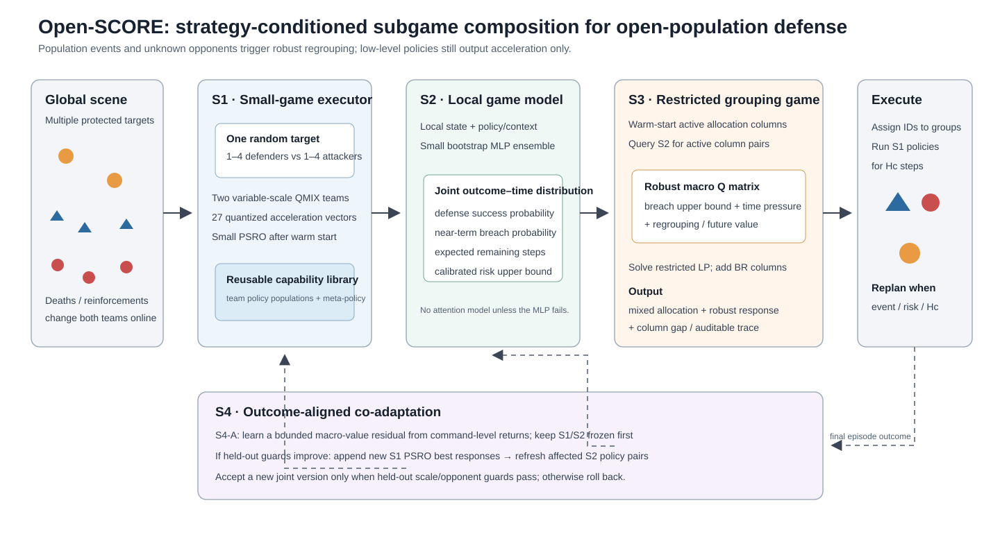
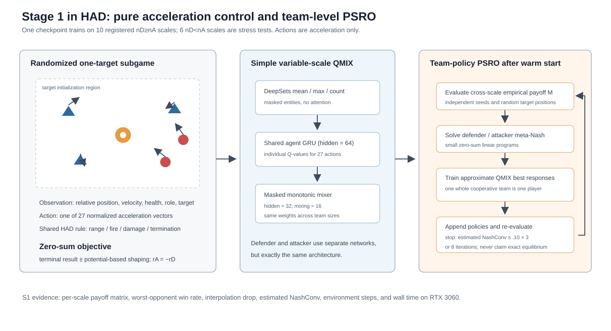
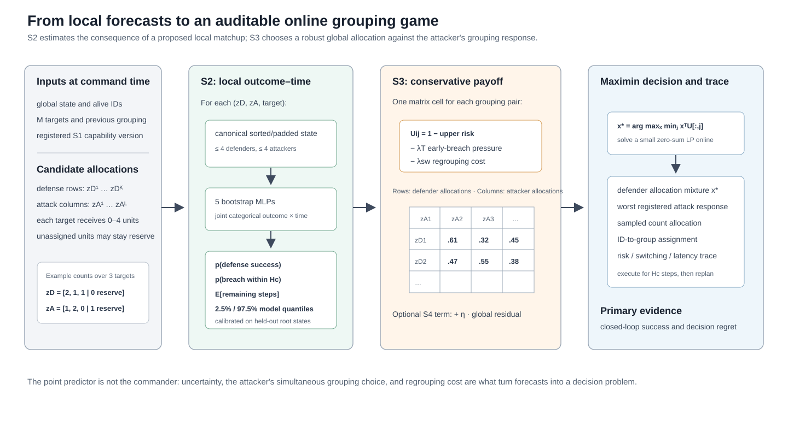

# Open-SCORE 方法简版

## 1. 方法主线

开放规模攻防的困难不是单个智能体不会移动，而是战损、增援和未知对手同时改变了“局部能不能守住”和“全局该怎样分兵”。Open-SCORE 不直接让一个大网络从全局状态输出所有微动作，而是把问题分成可验证的四阶段：先学会小型单目标子博弈，再预测特定局部编组与策略对的结局，上层对双方分组做受限随机博弈求解，最后由整局胜负纠正局部代理目标。

## 2. S1：规模条件化的局部博弈执行器

每个子博弈只包含一个随机目标和双方各 1–4 名单位。防守方与攻击方分别采用参数共享的 QMIX 团队策略。每个智能体仅输出 27 个量化加速度之一；目标相对位置属于观测，不是动作宏。

普通 QMIX 的 mixer 绑定固定智能体槽位。本文让每个活跃智能体产生非负条件权重并做掩码平均，从而保持单调分解且不固定人数。网络仅使用 DeepSets mean/max、64维 GRU 和小型 mixer。

为了避免两方策略相互过拟合，warm-start 后运行小型 PSRO：在跨规模经验 payoff matrix 上求 meta-Nash，轮流用 QMIX 训练团队近似最佳响应。S1 输出的是版本化策略种群及元策略，而非对单个脚本有效的一条策略。

## 3. S2：策略条件化的局部博弈模型

给定一个目标、预设敌我子群、S1 策略对或近期对手行为上下文，按固定规则排序并 padding 成向量 $x$。小 MLP 预测“防守在第几个时间桶获胜、攻击在第几个时间桶突破、或超时”的联合分类分布。同人数不同策略可能互相克制，因此策略条件不能被人数统计替代。

该分布直接给出防守胜率、下一指挥周期失守率和预计剩余步数。五个 bootstrap MLP 提供模型分歧，独立 calibration roots 用于构造和审计单侧风险上界。S2 的设计目标是准确、决策校准和便宜，不以复杂网络为贡献。若一步 S3 被证明确实短视，再增加下一宏观状态的存活数/粗位置预测头。

## 4. S3：受限动态双方分组博弈

在每个指挥时刻，上层分别生成少量敌我数量分配候选。对每个候选对，把各目标的局部子群和策略上下文送入 S2，获得失守概率上界和时间压力；可选的未来价值给出一个或数个后续指挥窗的影响，从而构成防守 $Q$ 矩阵。

防守方在对手后验附近的 ambiguity set $\mathcal Y_A(b_t)$ 上求解

$$
\max_x\min_{y\in\mathcal Y_A(b_t)}x^TQy,
$$

并从混合策略 $x$ 采样实际分组。识别可信时允许利用已观察到的对手偏好；检测到开集对手时，ambiguity set 扩大并退回对注册攻击候选的保守 maximin。人口事件发生后立即重建候选和收益矩阵。

个体级分组数随规模组合爆炸，故先枚举人数向量、再做最小费用个体匹配，并用双边 double oracle/列生成增加新的威胁分组。LP 只求当前受限矩阵；宏观状态转移和未来价值决定长期性。S3 第一版取 $L=1$，高层 MAPPO 与 $L=2/3$ 滚动是判断一步模型是否过于短视的 baseline/升级项。

## 5. S4：结果对齐的共同适应

前三阶段可能分别正确却组合错误，例如局部胜率高的分组导致另一目标长期暴露。S4-A 先冻结 S1/S2，用宏观 TD($\lambda$) 或从当前指挥时刻起的最终回报训练一个小型全局残差 $\delta_\psi$，将 S3 收益改成

$$
U^{joint}=U^{S2}+\eta\delta_\psi(s,z^D,z^A).
$$

只有该残差在 held-out guard grid 上改善最终最坏胜率，S4-B 才在新指挥分布上训练 S1 的 PSRO 最佳响应。新策略追加到种群而不是覆盖旧策略，受影响的 S2 策略对再增量采样。该过程属于带守卫的交替共同适应，不是 LLM 微调，也不要求穿过离散候选和 LP 做全链路反传。

在深度函数逼近、近似最佳响应和学习模型同时存在时，完整 S4 没有全局收敛保证。本文只要求每次受限 LP 到数值容差、报告 estimated oracle gap，并用新旧版本 cross-play 和置信下界决定接受或回滚。

## 6. 相对端到端方法的预期改进

Open-SCORE 不追求在一个固定 4v4 任务上击败所有端到端方法；它要证明的是：局部能力库、策略条件化局部博弈模型和上层显式受限博弈，在总规模变化、目标数变化、未知对手和局内人口事件下具有更好的组合泛化、最坏表现与决策可审计性。

若 Monolithic Variable-QMIX/MAPPO 在这些 OOD 条件下仍全面更强，则四阶段假设被否证，论文不应靠展示中间模块曲线维持结论。
