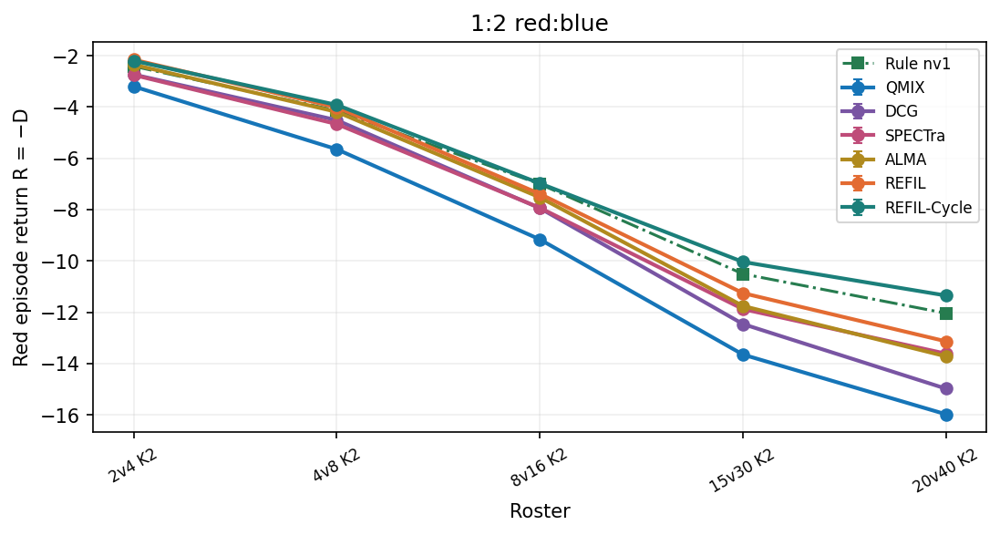
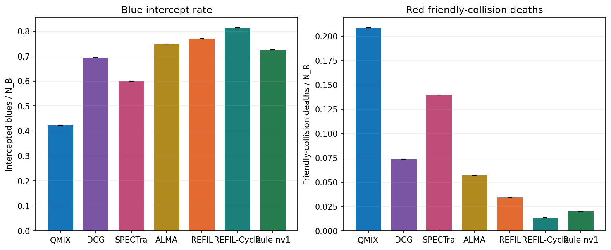
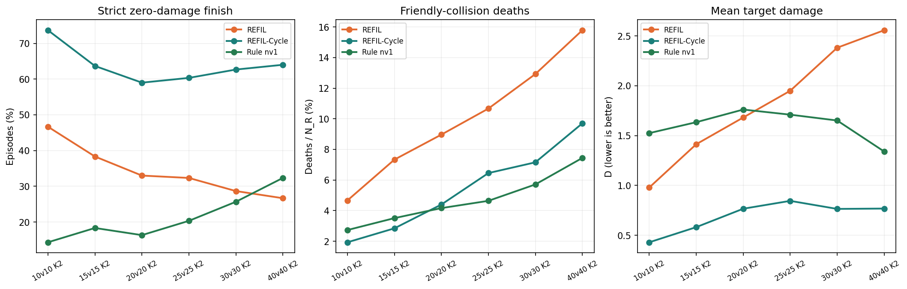
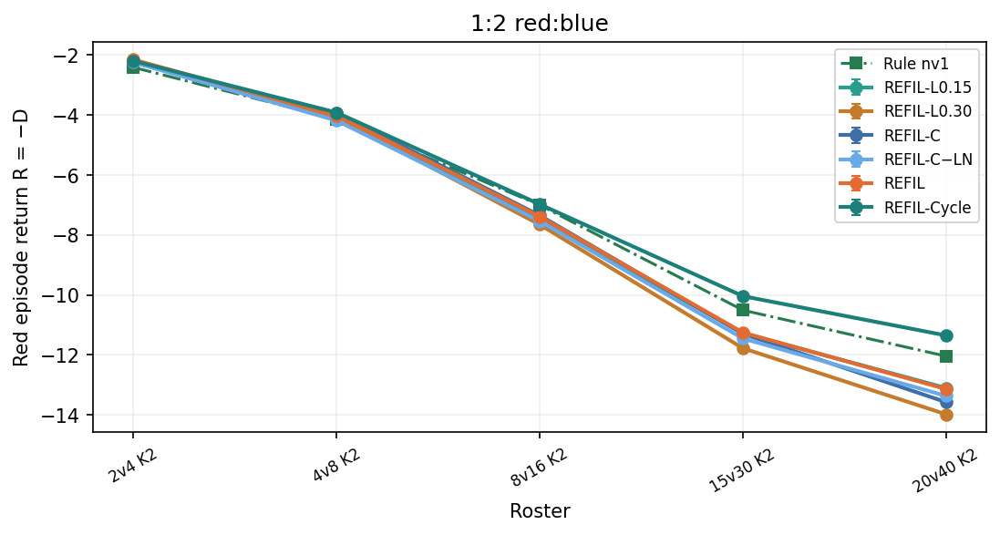

# 跨规模攻防泛化 main

更新时间：2026-09-17T01:14:44+08:00。本目录只归档论文主实验结果，不另开训练。主方法是 REFIL-Cycle（实验目录里的 REFIL-B / `refil_cycle`），对照原版 REFIL、QMIX-Atten、DCG、SPECTra、ALMA，以及规则与随机锚点；结构对照是距离分组 L0.15 / L0.30 和数量 FiLM（带 LN / 去 LN）。图和主表一律用 seed 0，与论文配对表一致。v3 基线的 seed 1/2 只留在 [data/episodes.csv](data/episodes.csv) 里，不画进主图。未完成的 REFIL-A / F / K4 不进入本目录。
数据来自 [main v3](../main_v3/实验报告.md)、[main v4](../main_v4/实验报告.md)、[main v5](../main_v5/实验报告.md)。协议不变：1M 物理步、池内 50 次验证、终评 23 个配置各 300 局，指标 $D$ 与 NDS。训练池 $N\in\{4,6,8,10\}$、$K\in\{1,2,3\}$；外推是等规模 10/15/20/25/30/40v、1:2 的 2v4/4v8/8v16/15v30/20v40，以及 10/15/20/30v 上的 K=4/6。循环臂训练时 $R\in\{1,2,3,4\}$，常规终评固定 $R=4$；另有等规模 1:1 上 $R=1,\ldots,6$ 的冻结深度扫描。图上不画随机。

## 结论

红方回报越高越好。训练池内随机约 $-5.28$，规则约 $-1.46$。已有 1M 验证回报的方法（seed 0）：QMIX $-3.82$；DCG $-2.06$；SPECTra $-2.83$；ALMA $-1.52$；REFIL $-0.60$；REFIL-Cycle $-0.25$。终评用 best，不是曲线最右端。
QMIX高于随机、低于规则；DCG高于随机、低于规则；SPECTra高于随机、低于规则；ALMA高于随机、低于规则；REFIL达到或超过规则；REFIL-Cycle达到或超过规则。
训练池内拦截率：规则 0.73，随机 0.28，QMIX 0.42，DCG 0.69，SPECTra 0.60，ALMA 0.75，REFIL 0.77，REFIL-Cycle 0.81。

## 分析

主对照只改全局信息怎么加工：REFIL-Cycle 在原 REFIL 路径旁加全实体共享循环，个体跨轮读取，残差进 GRU。QMIX / DCG / SPECTra / ALMA 是同一协议下的已有学习基线；距离分组和数量 FiLM 用来排除更简单的改动。终评 23 个配置里，REFIL-Cycle 的 $D$ 低于原 REFIL 的有 22 个，低于规则的有 23 个。
四类配置等权平均 $D$（越低越好）：
| 轴 | REFIL-Cycle D | REFIL D | QMIX D | DCG D | SPECTra D | ALMA D | 相对 REFIL 降幅 |
|---|---|---|---|---|---|---|---|
| 训练池内 | 0.3305 | 0.6657 | 3.7597 | 1.6531 | 2.5378 | 1.4341 | 50.36% |
| 等规模 | 0.6928 | 1.8273 | 6.6002 | 3.2888 | 4.3445 | 3.6535 | 62.09% |
| 1:2 | 6.8971 | 7.5899 | 9.5291 | 8.5275 | 8.1693 | 7.9094 | 9.13% |
| 目标外推 | 1.1539 | 2.2601 | 8.9386 | 4.3672 | 6.7050 | 4.2684 | 48.94% |

相对原 REFIL，池内、等规模、1:2、目标外推的平均损伤分别降低 50.36%、62.09%、9.13%、48.94%。40v40 K2 上 Cycle 的 $D$ 为 0.768，REFIL 为 2.557，规则为 1.3405。未优于原 REFIL 的配置：2v4 K2 2.196 vs 2.153。
1:2 线上的降幅明显小于等规模和目标数，说明兵力不足时循环只能减少漏防损伤，不能消除资源缺口。距离分组和单独数量 FiLM 的四类平均 $D$ 都高于原 REFIL，因此当前收益不能写成“知道人数”或“按距离分组”。
池内同队碰撞死亡占比：规则 0.020，REFIL 0.034，REFIL-Cycle 0.014。

## 训练曲线

纵轴是红方整局回报 $R=-D$。每 2 万步在池内 4 配置上贪心 100 局。学习方法都是 seed 0；REFIL 与四条基线复用 v3，REFIL-Cycle 来自 v5。循环臂的验证固定 $R=4$。点划线是规则。图上不画随机。

当前曲线上，REFIL-Cycle 首次超过规则池内平均回报约在 26 万步，原 REFIL 约在 58 万步。Cycle 的最优验证 $D$ 为 0.2536（1000000 步），REFIL 为 0.5878（920269 步）。验证与终评批次不同，前一组数字不当终评。

## 最终评估

best 模型，每配置 300 局，seed 0。三张图是等规模 1:1、红蓝 1:2、目标数扩充。图上只留规则锚点；随机仍在表中。

| 配置 | 轴 | 随机 D | 规则 D | QMIX D | DCG D | SPECTra D | ALMA D | REFIL D | REFIL-Cycle D |
|---|---|---|---|---|---|---|---|---|---|
| 4v4 K2 | 训练池内 | 3.2220 | 1.1531 | 2.560 | 1.062 | 1.681 | 0.829 | 0.360 | 0.235 |
| 6v6 K2 | 训练池内 | 4.5503 | 1.3331 | 3.376 | 1.506 | 2.106 | 1.212 | 0.580 | 0.258 |
| 8v8 K2 | 训练池内 | 5.7461 | 1.4293 | 3.937 | 1.659 | 2.667 | 1.568 | 0.605 | 0.327 |
| 10v10 K3 | 训练池内 | 7.6034 | 1.9341 | 5.165 | 2.385 | 3.697 | 2.127 | 1.118 | 0.502 |
| 10v10 K2 | 等规模 | 6.4427 | 1.5252 | 4.383 | 1.994 | 3.128 | 1.868 | 0.980 | 0.430 |
| 15v15 K2 | 等规模 | 8.5340 | 1.6346 | 5.529 | 2.783 | 3.691 | 2.549 | 1.414 | 0.582 |
| 20v20 K2 | 等规模 | 10.4198 | 1.7615 | 6.465 | 3.215 | 4.255 | 3.171 | 1.682 | 0.767 |
| 25v25 K2 | 等规模 | 11.8713 | 1.7102 | 6.917 | 3.644 | 4.582 | 3.956 | 1.950 | 0.845 |
| 30v30 K2 | 等规模 | 13.3796 | 1.6516 | 7.671 | 3.659 | 4.966 | 4.421 | 2.382 | 0.765 |
| 40v40 K2 | 等规模 | 15.6423 | 1.3405 | 8.637 | 4.438 | 5.445 | 5.955 | 2.557 | 0.768 |
| 2v4 K2 | 1:2 | 3.8324 | 2.4111 | 3.196 | 2.731 | 2.751 | 2.348 | 2.153 | 2.196 |
| 4v8 K2 | 1:2 | 6.8170 | 4.1372 | 5.647 | 4.512 | 4.664 | 4.189 | 4.013 | 3.918 |
| 8v16 K2 | 1:2 | 11.6272 | 7.0049 | 9.163 | 7.945 | 7.931 | 7.525 | 7.387 | 6.978 |
| 15v30 K2 | 1:2 | 17.2523 | 10.5098 | 13.655 | 12.464 | 11.881 | 11.760 | 11.257 | 10.041 |
| 20v40 K2 | 1:2 | 21.2913 | 12.0435 | 15.985 | 14.985 | 13.619 | 13.725 | 13.139 | 11.352 |
| 10v10 K4 | 目标外推 | 8.1708 | 2.2271 | 6.048 | 2.679 | 4.057 | 2.428 | 1.271 | 0.690 |
| 10v10 K6 | 目标外推 | 10.0892 | 2.9133 | 7.210 | 3.267 | 5.009 | 2.767 | 1.438 | 0.739 |
| 15v15 K4 | 目标外推 | 10.8758 | 2.3953 | 7.563 | 3.762 | 5.400 | 3.271 | 1.642 | 0.865 |
| 15v15 K6 | 目标外推 | 13.1273 | 3.0755 | 8.955 | 4.152 | 6.926 | 3.783 | 2.023 | 1.026 |
| 20v20 K4 | 目标外推 | 13.2383 | 2.6079 | 8.049 | 4.330 | 6.497 | 4.156 | 2.337 | 1.085 |
| 20v20 K6 | 目标外推 | 15.9305 | 3.2901 | 10.725 | 4.973 | 7.835 | 4.962 | 2.733 | 1.499 |
| 30v30 K4 | 目标外推 | 16.9090 | 2.2192 | 10.021 | 5.174 | 7.650 | 5.583 | 3.074 | 1.445 |
| 30v30 K6 | 目标外推 | 20.8863 | 3.0635 | 12.937 | 6.600 | 10.265 | 7.197 | 3.563 | 1.883 |

| 配置 | 轴 | QMIX NDS | DCG NDS | SPECTra NDS | ALMA NDS | REFIL NDS | REFIL-Cycle NDS |
|---|---|---|---|---|---|---|---|
| 4v4 K2 | 训练池内 | 0.320 | 1.044 | 0.745 | 1.157 | 1.384 | 1.444 |
| 6v6 K2 | 训练池内 | 0.365 | 0.946 | 0.760 | 1.038 | 1.234 | 1.334 |
| 8v8 K2 | 训练池内 | 0.419 | 0.947 | 0.713 | 0.968 | 1.191 | 1.255 |
| 10v10 K3 | 训练池内 | 0.430 | 0.920 | 0.689 | 0.966 | 1.144 | 1.253 |
| 10v10 K2 | 等规模 | 0.419 | 0.905 | 0.674 | 0.930 | 1.111 | 1.223 |
| 15v15 K2 | 等规模 | 0.436 | 0.834 | 0.702 | 0.868 | 1.032 | 1.153 |
| 20v20 K2 | 等规模 | 0.457 | 0.832 | 0.712 | 0.837 | 1.009 | 1.115 |
| 25v25 K2 | 等规模 | 0.488 | 0.810 | 0.717 | 0.779 | 0.976 | 1.085 |
| 30v30 K2 | 等规模 | 0.487 | 0.829 | 0.717 | 0.764 | 0.938 | 1.076 |
| 40v40 K2 | 等规模 | 0.490 | 0.783 | 0.713 | 0.677 | 0.915 | 1.040 |
| 2v4 K2 | 1:2 | 0.448 | 0.775 | 0.761 | 1.044 | 1.182 | 1.151 |
| 4v8 K2 | 1:2 | 0.437 | 0.860 | 0.804 | 0.981 | 1.046 | 1.082 |
| 8v16 K2 | 1:2 | 0.533 | 0.797 | 0.800 | 0.887 | 0.917 | 1.006 |
| 15v30 K2 | 1:2 | 0.533 | 0.710 | 0.797 | 0.815 | 0.889 | 1.069 |
| 20v40 K2 | 1:2 | 0.574 | 0.682 | 0.830 | 0.818 | 0.881 | 1.075 |
| 10v10 K4 | 目标外推 | 0.357 | 0.924 | 0.692 | 0.966 | 1.161 | 1.259 |
| 10v10 K6 | 目标外推 | 0.401 | 0.951 | 0.708 | 1.020 | 1.206 | 1.303 |
| 15v15 K4 | 目标外推 | 0.391 | 0.839 | 0.646 | 0.897 | 1.089 | 1.180 |
| 15v15 K6 | 目标外推 | 0.415 | 0.893 | 0.617 | 0.930 | 1.105 | 1.204 |
| 20v20 K4 | 目标外推 | 0.488 | 0.838 | 0.634 | 0.854 | 1.025 | 1.143 |
| 20v20 K6 | 目标外推 | 0.412 | 0.867 | 0.640 | 0.868 | 1.044 | 1.142 |
| 30v30 K4 | 目标外推 | 0.469 | 0.799 | 0.630 | 0.771 | 0.942 | 1.053 |
| 30v30 K6 | 目标外推 | 0.446 | 0.802 | 0.596 | 0.768 | 0.972 | 1.066 |

## 循环轮数（等规模 1:1）

同一 REFIL-Cycle best 检查点，只改执行轮数 $R=1,\ldots,6$；等规模 10/15/20/25/30/40v K2，每格 300 局。$R=4$ 复用终评。训练见过 1–4 轮；5、6 轮是训练深度以外的执行。

REFIL-Cycle 扫描 10800/10800 局；已满 300 局的 1:1 配置：$R=1$ 6/6，$R=2$ 6/6，$R=3$ 6/6，$R=4$ 6/6，$R=5$ 6/6，$R=6$ 6/6。

REFIL-Cycle：行是循环轮数，列是 1:1 规模，格子为平均 $D$。

| $R$ | 10v10 K2 | 15v15 K2 | 20v20 K2 | 25v25 K2 | 30v30 K2 | 40v40 K2 | 六配置平均 |
|---|---|---|---|---|---|---|---|
| $R=1$ | 0.4991 | 0.6440 | 0.7744 | 0.8424 | 0.8483 | 0.8150 | 0.7372 |
| $R=2$ | 0.4012 | 0.5933 | 0.8291 | 0.8440 | 0.8553 | 0.8546 | 0.7296 |
| $R=3$ | 0.4090 | 0.5846 | 0.7233 | 0.7516 | 0.8860 | 0.8196 | 0.6957 |
| $R=4$ | 0.4300 | 0.5818 | 0.7666 | 0.8454 | 0.7647 | 0.7683 | 0.6928 |
| $R=5$ | 0.4395 | 0.5746 | 0.7802 | 0.8654 | 0.7862 | 0.7613 | 0.7012 |
| $R=6$ | 0.4395 | 0.5746 | 0.7801 | 0.8587 | 0.7862 | 0.7613 | 0.7001 |

各规模上 $D$ 最低的循环轮数；并列时取更小的 $R$。

| 规模 | 最优 $R$ | 该格 $D$ | 并列 |
|---|---|---|---|
| 10v10 K2 | 2 | 0.4012 | — |
| 15v15 K2 | 5 | 0.5746 | 6 |
| 20v20 K2 | 3 | 0.7233 | — |
| 25v25 K2 | 3 | 0.7516 | — |
| 30v30 K2 | 4 | 0.7647 | — |
| 40v40 K2 | 5 | 0.7613 | 6 |

$R=1$ 到 $R=4$，六配置平均 $D$ 从 0.7372 降到 0.6928，相对减少 6.02%。即便只跑 $R=1$，等规模平均仍低于原 REFIL 的 1.8273。最佳轮数不随规模单调增加；3–4 轮已进入较好区间，5、6 轮没有整体再降。

## 行为诊断

与训练曲线相同的 4 个训练池配置。左图：蓝方被拦下的比例。右图：红方死于同队碰撞的人数占比。当前为 seed 0。图上不画随机。

## 等规模可靠性

严格完成定义为自然结束、蓝方剩余为 0 且 $D<10^{-9}$。下图只看等规模 K2、seed 0 各 300 局。较低平均损伤和最高严格完成率、最低碰撞率不是同一件事。

| 规模 | REFIL 严格完成 | Cycle 严格完成 | 规则严格完成 | REFIL 碰撞死亡 | Cycle 碰撞死亡 | 规则碰撞死亡 |
|---|---|---|---|---|---|---|
| 10v10 K2 | 46.67% | 73.67% | 14.33% | 4.67% | 1.93% | 2.73% |
| 15v15 K2 | 38.33% | 63.67% | 18.33% | 7.33% | 2.84% | 3.51% |
| 20v20 K2 | 33.00% | 59.00% | 16.33% | 8.97% | 4.40% | 4.17% |
| 25v25 K2 | 32.33% | 60.33% | 20.33% | 10.67% | 6.45% | 4.64% |
| 30v30 K2 | 28.67% | 62.67% | 25.67% | 12.92% | 7.16% | 5.71% |
| 40v40 K2 | 26.67% | 64.00% | 32.33% | 15.78% | 9.70% | 7.44% |

## 结构对照

距离分组只改 REFIL 想象分组的距离偏置；数量臂只加 $\phi_2$ FiLM。它们和 REFIL-Cycle 不是同一组改动，只用来判断更简单的结构是否已经够用。图上学习方法仍是 seed 0。

| 轴 | REFIL-L0.15 D | REFIL-L0.30 D | REFIL-C D | REFIL-C−LN D | REFIL D | REFIL-Cycle D |
|---|---|---|---|---|---|---|
| 训练池内 | 1.0887 | 1.2682 | 0.8399 | 1.1335 | 0.6657 | 0.3305 |
| 等规模 | 2.3676 | 3.4638 | 2.2913 | 2.7750 | 1.8273 | 0.6928 |
| 1:2 | 7.6468 | 7.9400 | 7.6799 | 7.7574 | 7.5899 | 6.8971 |
| 目标外推 | 3.0970 | 4.3744 | 3.0419 | 3.6965 | 2.2601 | 1.1539 |

23 个配置上 $D$ 低于原 REFIL 的次数：REFIL-L0.15 1/23，REFIL-L0.30 0/23，REFIL-C 3/23，REFIL-C−LN 0/23，REFIL-Cycle 22/23。L0.30 普遍差于 L0.15，两者都差于原 REFIL；带 LN 的数量臂只有少数配置更好，去 LN 后没有配置更好。因此当前主结果支持的是整套循环结构，而不是单独的数量条件或这一种距离分组。

## 数据来源

| 方法 | 来源目录 | 种子 | 用途 |
|---|---|---|---|
| REFIL-Cycle | main_v5 | 0 | 终评 23×300；等规模深度扫描 $R=1..6$ |
| REFIL | main_v3 | 0（主表）；1–2 在数据中 | 正式对照母体 |
| QMIX / DCG / SPECTra | main_v3 | 0（主表）；1–2 在数据中 | 已有学习基线 |
| ALMA | main_v3 | 0 | 全场低层适配 |
| Rule nv1 / Random | main_v3 锚点 | 环境种子 9000–9299 | 与算法无关 |
| REFIL-L0.15 / L0.30 / C | main_v4 | 0 | 结构对照 |
| REFIL-C−LN | main_v5 | 0 | 去 LN 的数量 FiLM，对照图归本目录 |

## 原始数据

[episodes.csv](data/episodes.csv) 是逐局记录，含验证、终评、锚点和 Cycle 的深度扫描；[learning.csv](data/learning.csv) 是训练 loss；[final_summary.csv](data/final_summary.csv) 是终评每配置的 $D$、NDS、拦截、碰撞和严格完成率。原始训练目录仍是结果出处：v3 / v4 / v5。本目录不放权重。
