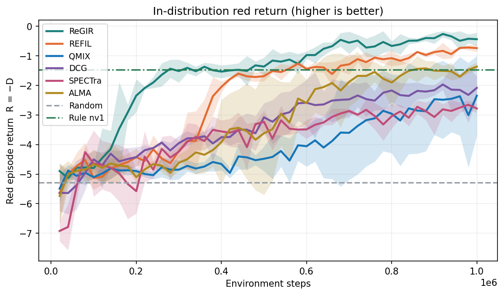
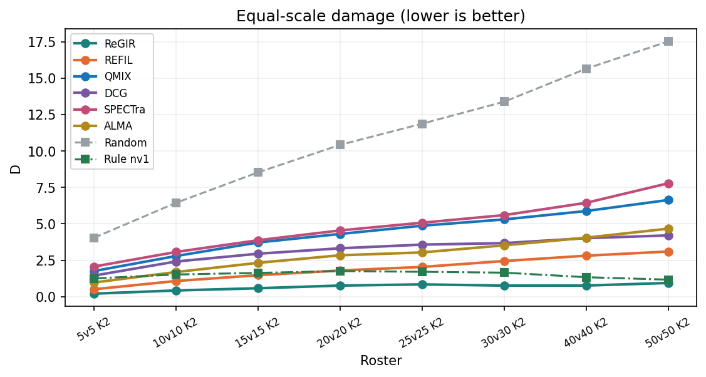
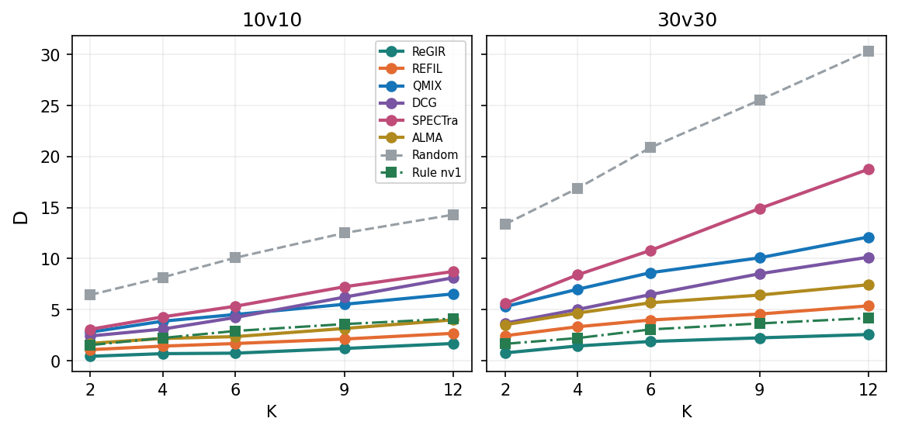
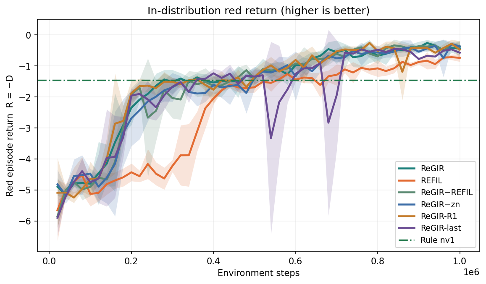
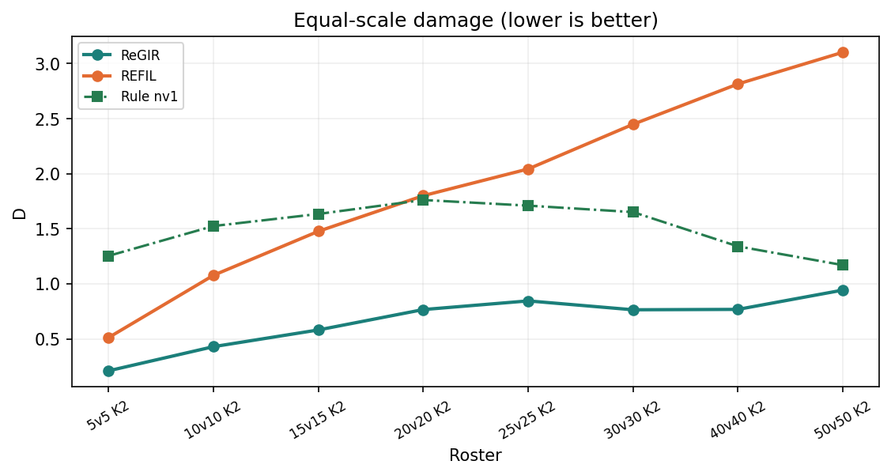
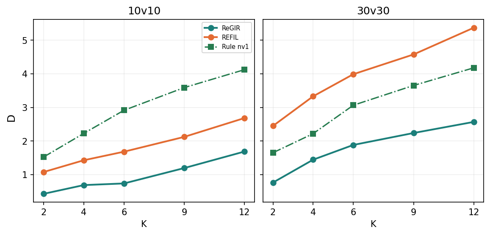
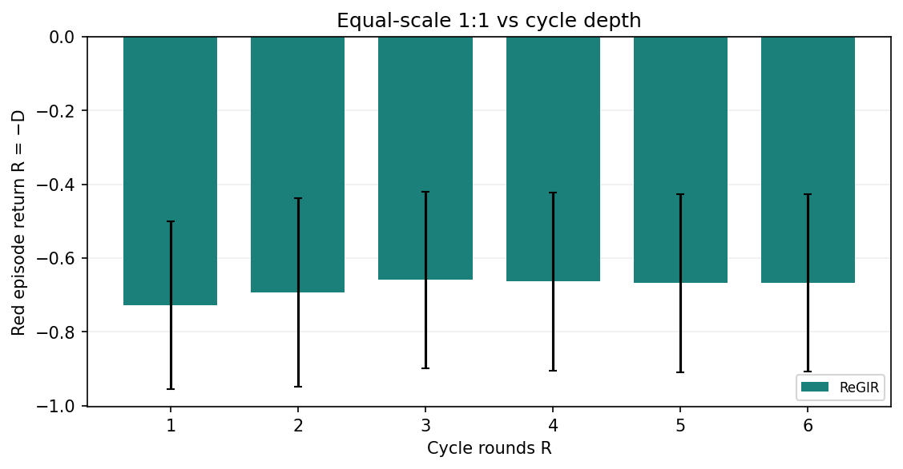
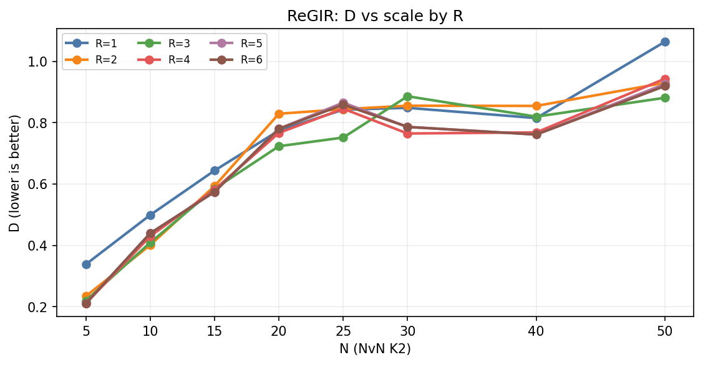
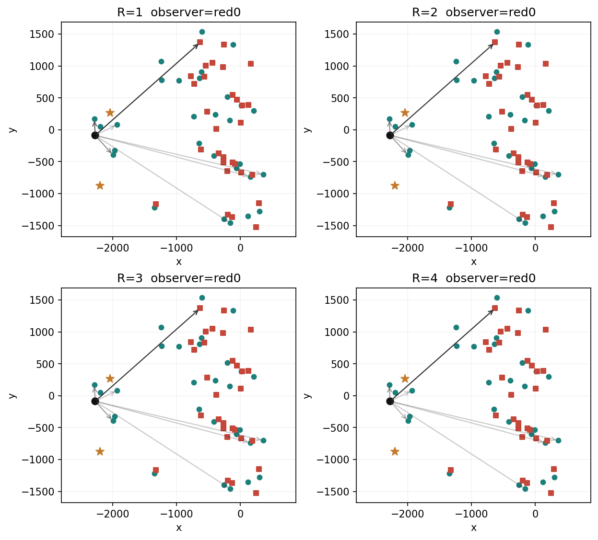
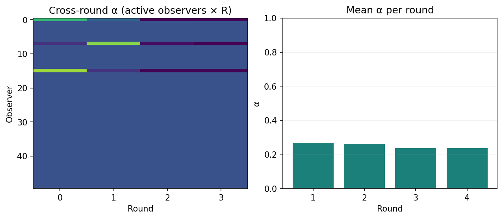

# 跨规模攻防泛化 main

更新时间：2026-09-20T12:55+08:00。主方法 **ReGIR**（代码键 `regir`）。训练只见 $N\in\{4,6,8,10\}$、$K\le 3$；终评 24 配置各 300 局贪心。主指标是漏防伤害 $D$（越低越好）；对照和外推另报规则归一化 NDS（0=随机，1=规则，大于 1 优于规则）。

下面按实验分章。图在同目录 `figures/`。若 Cursor 预览不渲染，直接打开那些 png。

未满 300 局的格带 `n=`；终评种子不足 3 个带 `s=`。档案臂、1:2 旧局、未完成训练和过期中途终评不进均值。

---

## 一、对照实验

对照回答假设 H1：只在 $N\in\{4,6,8,10\}$、$K\le 3$ 上训练，冻结后零样本部署，ReGIR 的漏防 $D$ 是否低于母体 REFIL、其他学习方法和规则。

怎么看：纵轴 $D$ 越低红方越好。NDS 把同一配置上的随机当作 0、规则当作 1。`s=` 是计入均值的终评种子数，少于 3 不能当多种子结论。

当前等规模排序（平均 $D$）：ReGIR 0.664（NDS 1.13，**仅 seed 0**）→ REFIL 1.910（1.01）→ ALMA 2.891 → DCG 3.202 → QMIX 4.410 → SPECTra 4.808。规则同轴约 1.506。ReGIR seed 1/2 的终评写在训练中途的 checkpoint 上，未计入。

### 训练曲线

池内 4 配置、每 2 万步贪心 100 局，纵轴是红方回报 $R=-D$（越高越好）。阴影是已有训练种子的标准差。点划线是规则，虚线是随机。终评用 `best.pt`，不是曲线最右端。

### 等规模外推

横轴是 1:1 编队（5 到 50 人，$K=2$）。5v5 是插值；15–50 人是外推。这是 H1 跨规模部分的主证据。

### 目标数外推

左 10v10、右 30v30，横轴 $K=2,4,6,9,12$。训练最多见过 $K=3$。10v10 K12 上红方极度不够分目标，$D$ 会很高；比较的是方法之间的差距。

### 三类平均

| 方法 | 池内 | 等规模 | 目标 |
|---|---|---|---|
| ReGIR | 0.330 (1.32) s=1 | 0.664 (1.13) s=1 | 1.410 (1.17) s=1 |
| REFIL | 0.780 (1.21) | 1.910 (1.01) | 2.888 (1.05) |
| QMIX | 2.334 (0.78) | 4.410 (0.71) | 6.775 (0.72) |
| DCG | 1.903 (0.90) | 3.202 (0.83) | 5.915 (0.78) |
| SPECTra | 2.574 (0.71) | 4.808 (0.66) | 8.856 (0.58) |
| ALMA | 1.278 (1.08) s=2 | 2.891 (0.89) s=2 | 4.182 (0.94) s=2 |
| Rule nv1 | 1.462 | 1.506 | 3.111 |

关键配置：

| 方法 | 5v5 K2 | 10v10 K2 | 30v30 K2 | 50v50 K2 | 10v10 K12 | 30v30 K12 |
|---|---|---|---|---|---|---|
| ReGIR | 0.211 (1.37) s=1 | 0.430 (1.22) s=1 | 0.765 (1.08) s=1 | 0.943 (1.01) s=1 | 1.687 (1.24) s=1 | 2.568 (1.06) s=1 |
| REFIL | 0.513 (1.27) | 1.078 (1.09) | 2.449 (0.93) | 3.102 (0.88) | 2.683 (1.14) | 5.368 (0.95) |
| QMIX | 1.762 (0.82) | 2.793 (0.74) | 5.303 (0.69) | 6.636 (0.67) | 6.545 (0.76) | 12.125 (0.70) |
| DCG | 1.451 (0.93) | 2.416 (0.82) | 3.677 (0.83) | 4.207 (0.81) | 8.134 (0.61) | 10.142 (0.77) |
| SPECTra | 2.071 (0.71) | 3.070 (0.69) | 5.599 (0.66) | 7.782 (0.60) | 8.744 (0.55) | 18.765 (0.44) |
| ALMA | 0.975 (1.10) s=2 | 1.694 (0.97) s=2 | 3.528 (0.84) s=2 | 4.669 (0.79) s=2 | 4.003 (1.01) s=2 | 7.445 (0.88) s=2 |
| Rule nv1 | 1.254 | 1.525 | 1.652 | 1.170 | 4.121 | 4.176 |

---

## 二、消融实验

消融回答假设 H2：把 ReGIR 相对 REFIL 的增益拆成四个可独立关掉的部件。ReGIR 与 REFIL 复用对照，不另训。

- **ReGIR**：全模型，其余臂的参照
- **REFIL**：去掉整条全局循环旁路 → 循环整体有没有用
- **ReGIR−REFIL**：去掉原 REFIL 实体注意力和想象分组 → 循环能否单独工作
- **ReGIR−zn**：关掉数量编码注入 → 是不是换皮的数量条件
- **ReGIR-R1**：训练和终评都固定 $R=1$ → 主收益是不是多轮
- **ReGIR-last**：只读最后一轮 → 跨轮表征库有没有独立贡献

四个变体**不是没做评估**。它们大多已经跑过 24×300 终评，但 `best.pt` 一出现就开跑，checkpoint 停在十几万到四十万步（和 ReGIR seed 1/2 同类）。那些局的 $D$ 会到 5–16，不能进均值，否则消融会看起来全面崩盘。等规模/目标图因此只画已对齐的 ReGIR / REFIL。池内验证 $D$ 来自训练曲线最右端，可以看，不能当外推。

### 终评对齐

| 方法 | seed | 训练步数 | 已有终评 | 终评局 | 池内验证 D | 进均值 |
|---|---|---|---|---|---|---|
| ReGIR−REFIL | 0 | 891350 training | best@200277 | 7200 | 0.305 @880073 | 训练未完，不进表 |
| ReGIR−REFIL | 1 | 1000000 | best@220096 | 4584 | 0.245 @1000000 | 过期，不进表 |
| ReGIR−REFIL | 2 | 1000000 | best@220238 | 531 | 0.489 @1000000 | 过期，不进表 |
| ReGIR−zn | 0 | 1000000 | best@100076 | 7200 | 0.467 @1000000 | 过期，不进表 |
| ReGIR−zn | 1 | 1000000 | best@240302 | 7200 | 0.348 @1000000 | 过期，不进表 |
| ReGIR−zn | 2 | 1000040 | best@440138 | 7200 | 0.295 @1000040 | 过期，不进表 |
| ReGIR-R1 | 0 | 1000000 | best@180274 | 7200 | 0.796 @1000000 | 过期，不进表 |
| ReGIR-R1 | 1 | 1000000 | best@280240 | 7200 | 0.317 @1000000 | 过期，不进表 |
| ReGIR-R1 | 2 | 1000000 | best@20006 | 7200 | 0.311 @1000000 | 过期，不进表 |
| ReGIR-last | 0 | 709562 training | best@20341 | 7200 | 3.188 @700197 | 训练未完，不进表 |
| ReGIR-last | 1 | 1000000 | best@20013 | 7200 | 0.574 @1000000 | 过期，不进表 |
| ReGIR-last | 2 | 649220 training | best@80060 | 7200 | 1.007 @640020 | 训练未完，不进表 |

要进官方外推表，必须在 1M `best.pt` 上重跑终评。当前 eval 会话已经停了；上次停在 `regir_norefil` seed 2 的旧标签 `best@220238`（531/7200），不是 1M 重评。

### 消融训练曲线

### 消融等规模与目标数

某条臂若整段高于全模型，关掉的那一部件就有贡献。现在四条消融臂没有可用终评，所以这两张图只有 ReGIR / REFIL / 规则。

### 消融三类平均

只含最终权重上对齐过的终评。ReGIR / REFIL 与对照章同源。

| 方法 | 池内 | 等规模 | 目标 |
|---|---|---|---|
| ReGIR | 0.330 (1.32) s=1 | 0.664 (1.13) s=1 | 1.410 (1.17) s=1 |
| REFIL | 0.780 (1.21) | 1.910 (1.01) | 2.888 (1.05) |
| ReGIR−REFIL | — | — | — |
| ReGIR−zn | — | — | — |
| ReGIR-R1 | — | — | — |
| ReGIR-last | — | — | — |

---

## 三、机制评估

### 循环轮数

只改冻结 ReGIR 的执行 $R$，检验 H5。主对照终评固定 $R=4$。当前 1:1 八个规模上平均 $D$ 最低的是 $R=3$（0.659），$R=4$ 为 0.664，各 $R$ 几乎重叠，不能写成「规模越大越要加深」。

| $R$ | 5v5 K2 | 10v10 K2 | 15v15 K2 | 20v20 K2 | 25v25 K2 | 30v30 K2 | 40v40 K2 | 50v50 K2 |
|---|---|---|---|---|---|---|---|---|
| $R=1$ | 0.3384 | 0.4991 | 0.6440 | 0.7744 | 0.8424 | 0.8483 | 0.8150 | 1.0639 |
| $R=2$ | 0.2346 | 0.4012 | 0.5933 | 0.8291 | 0.8440 | 0.8553 | 0.8546 | 0.9300 |
| $R=3$ | 0.2199 | 0.4090 | 0.5846 | 0.7233 | 0.7516 | 0.8860 | 0.8196 | 0.8812 |
| $R=4$ | 0.2109 | 0.4300 | 0.5818 | 0.7666 | 0.8454 | 0.7647 | 0.7683 | 0.9433 |
| $R=5$ | 0.2109 | 0.4395 | 0.5746 | 0.7802 | 0.8654 | 0.7862 | 0.7613 | 0.9261 |
| $R=6$ | 0.2109 | 0.4395 | 0.5746 | 0.7801 | 0.8587 | 0.7862 | 0.7613 | 0.9194 |

### 一局注意力与跨轮读取

冻结 ReGIR seed 0、30v30 K2、环境种子 9000、第 25 步。检验 H3（后轮是否盯住威胁）和 H4（个体是否读取不同轮）。平均 $\alpha$：$R=1$ 0.27，$R=2$ 0.26，$R=3$ 0.24，$R=4$ 0.24，没有塌到最后一轮。

青点红方、方块蓝方、星号目标；箭头从同一名红方观察者指向该轮权重最高的实体。

---

## 图文件

都在 `Open-SCORE/outputs/main/figures/`：

| 文件 | 内容 |
|---|---|
| `learning.png` | 对照训练曲线 |
| `scale_equal.png` | 对照等规模外推 |
| `scale_targets.png` | 对照目标数外推 |
| `ablation_learning.png` | 消融训练曲线 |
| `ablation_equal.png` | 消融等规模 |
| `ablation_targets.png` | 消融目标数 |
| `cycle_depth.png` | 机制：回报随 R |
| `cycle_depth_scale.png` | 机制：D × 规模 × R |
| `mechanism_attention.png` | 机制：四轮注意力 |
| `mechanism_alpha.png` | 机制：跨轮 α |
