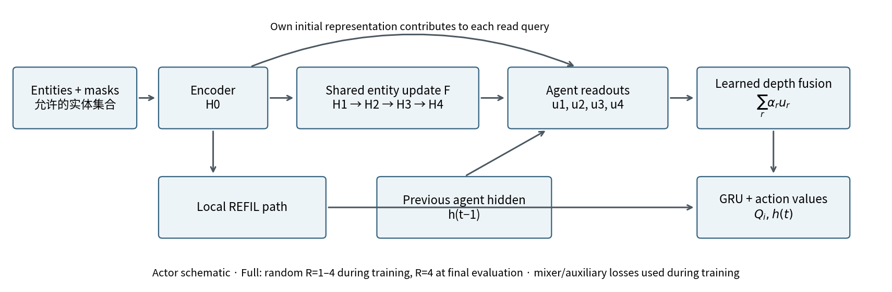
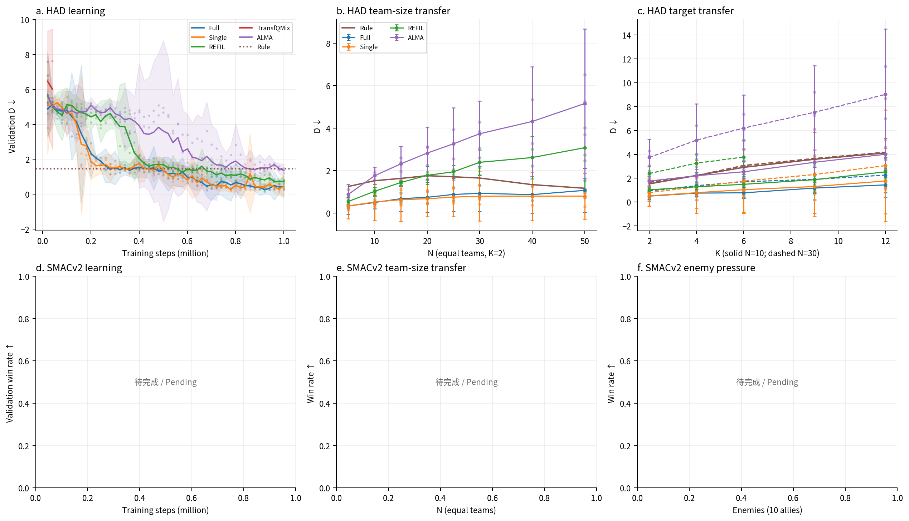
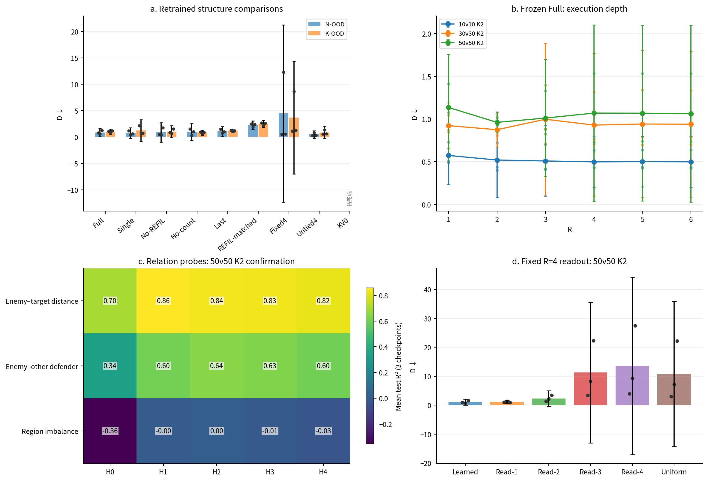

# main0921：跨规模泛化与循环机制

更新时间：2026-09-22T04:02:16+08:00。唯一正式报告；正文与附录共用同一数据源。
当前三种子完整正式格：**230/392**。合格 final 权重身份：**33/57**。本页展示已有结果与明确缺口，不把计划任务写成结论。

## 正文

### 数据口径与展示安排

HAD 的 D 越低越好；SMACv2 的 battle_won 胜率越高越好。所有训练种子固定为0、1、2。正式格必须匹配 inventory 中已验证的 final 权重身份和实际预算，且每种子完成规定随机流的300个唯一回合。HAD使用9000–9299，SMACv2使用110000–110299。缺种子或缺回合的正式均值显示 —；局数和已有种子值留在附录。

统计顺序：每种子每配置求回合均值 → 固定配置等权 → 三个训练种子等权。± 为95% t区间半宽（df=2，t=4.30265273）；散点为三个种子值，不能当作独立回合样本。规则只有一组公共场景结果，没有虚构三个训练种子或跨种子误差条。R²保留负值；未定义值显示 —。

| 位置 / ID | 问题与固定展示 | 轴 / 指标与不确定性 | 数据源 / 完成条件 |
|---|---|---|---|
| 正文 图1 | Full结构；共享更新与逐轮读取 | 结构图，无结果数值 | 当前方法实现；不是机制实验证据 |
| 正文 图2a/d | HAD与SMAC训练内学习 | 训练步→D/胜率；三seed均值和95% t带 | episodes.csv/train_eval；每点100/128局×3seed |
| 正文 图2b/e | 等人数外推 | N→D/胜率；95% t、seed点 | episodes.csv/final_eval；每格300×3 |
| 正文 图2c/f | HAD目标数／SMAC敌人数压力 | K或敌人数→D/胜率；95% t、seed点 | 同一final；10v10交叉点复用 |
| 正文 图3a | 重训结构对照 | 方法→N-OOD/K-OOD D；95% t、seed点 | 正式终评固定分组；不隐藏无收益的变体 |
| 正文 图3b | 同一Full增加执行轮数 | R=1–6，N=10/30/50；D、95% t | depth_eval；R4复用final |
| 正文 图3c | 后轮的关系可读性 | 50v50 K2确认集；3标签×H0–H4 R² | probe/results.csv；每格3个checkpoint |
| 正文 图3d | 固定四轮下改变读取 | 50v50 K2；六读出D、95% t、seed点 | readout_eval；Learned复用final |
| 正文 表1 | 核心算法在不同泛化轴的表现 | HAD四分组D；SMAC四关键格胜率 | 完整配置集合×3seed；禁止局数加权 |
| 正文 表2 | 参数与计算成本 | 八方法actor/训练总参数、10/50全队时延 | timing.csv实际身份；逐seed中位数/IQR/p95 |
| 附录 A–F | 全部格、种子、机制与控制、来源和失败 | 不按结果筛选；缺口与排除原因 | 同源完整表；保留负结果和全部登记臂 |

### 图1：方法结构



共享块重复更新实体工作区；每轮结果分别被个体读取，再融合进入策略。图示不声称已经证明压缩、收敛或语义分工。
[PDF](figures/fig1_architecture.pdf) · [PNG](figures/fig1_architecture.png)

### 图2：两域主比较



上排HAD、下排SMACv2。HAD登记的方法为Full、Single、REFIL、TransfQMix、ALMA及规则；只有完整格形成曲线。完整算法表见表1和附录。HAD N=5是插值，N=10属于训练范围；目标轴实线N=10、虚线N=30。SMAC N=5是插值，10是训练边界，12/15/20为人数外推；固定己方10的敌人数变化同时改变兵力比。缺完整三种子的数据不连成趋势。
[PDF](figures/fig2_comparison.pdf) · [PNG](figures/fig2_comparison.png)

### 表1：核心算法

HAD：分组严格互斥；训练范围支持点和人数插值另列于附录。

| 方法 | ID | N-OOD | K-OOD | 联合 OOD |
|---|---|---|---|---|
| Full | 0.419 ± 0.383 | 0.861 ± 0.794 | 1.036 ± 0.463 | 1.477 ± 1.091 |
| Single | 0.429 ± 0.693 | 0.742 ± 0.983 | 1.225 ± 2.046 | 1.674 ± 2.643 |
| REFIL | 0.715 ± 0.121 | 2.209 ± 0.689 | 1.796 ± 0.756 | — |
| QMIX-Atten | 2.318 ± 3.554 | — | — | — |
| DCG | 2.028 ± 1.086 | 5.021 ± 6.602 | 5.839 ± 4.770 | 8.092 ± 9.710 |
| SPECTra | 2.662 ± 0.174 | 6.455 ± 3.485 | 6.933 ± 1.664 | 11.184 ± 0.873 |
| ALMA | 1.326 ± 0.480 | 3.605 ± 1.844 | 3.022 ± 0.854 | 5.375 ± 2.574 |
| TransfQMix | — | — | — | — |
| REFIL-matched | 0.914 ± 0.411 | 2.269 ± 0.776 | 2.493 ± 0.695 | 4.170 ± 1.888 |
| Rule | 1.462（共同参照） | 1.545（共同参照） | 3.212（共同参照） | 3.060（共同参照） |

SMACv2：胜率。

| 方法 | 10v10 | 15v15 | 20v20 | 10v15 |
|---|---|---|---|---|
| Full | — | — | — | — |
| Single | — | — | — | — |
| REFIL | — | — | — | — |
| TransfQMix | — | — | — | — |

### 图3：循环机制



重训、同权重执行深度、同状态关系探针和固定计算读出回答不同问题，不能互相替代。Read-4是冻结Full的干预，Last是重新训练的方法；Read-1仅在登记等价核查通过后复用M1。图3c颜色显示三checkpoint平均R²，完整种子值、95% t区间及随机初始化/置乱标签控制见附录D。
[PDF](figures/fig3_mechanism.pdf) · [PNG](figures/fig3_mechanism.png)

### 表2：参数与全队决策成本

中位数 [p25, p75] 与p95均来自实际时延记录，逐seed保留；—表示尚无合格测量。全部48格使用experiment.json登记的同一物理GPU（0或1），float32（关闭TF32）、batch=1全队，50次预热后200次同步计时。各模型从同一公共真实动作前缀重建各自h_prev，每次计时前恢复；计入actor张量编码，不计环境、状态重建、动作解码或mixer。训练总参数为在线可训练actor+mixer，不含target复制。配置表示初始物理队伍数；实际设备型号、当时其他计算进程显存占用、状态编号、时刻、存活数及共同padding见附录E。

| 方法 | actor 参数 | 训练总参数 | 设备 | N=10 ms/全队决策 | N=50 ms/全队决策 |
|---|---|---|---|---|---|
| REFIL | — | — | — | s0: —<br>s1: —<br>s2: — | s0: —<br>s1: —<br>s2: — |
| REFIL-matched | — | — | — | s0: —<br>s1: —<br>s2: — | s0: —<br>s1: —<br>s2: — |
| Single | — | — | — | s0: —<br>s1: —<br>s2: — | s0: —<br>s1: —<br>s2: — |
| Full | — | — | — | s0: —<br>s1: —<br>s2: — | s0: —<br>s1: —<br>s2: — |
| Fixed4 | — | — | — | s0: —<br>s1: —<br>s2: — | s0: —<br>s1: —<br>s2: — |
| Untied4 | — | — | — | s0: —<br>s1: —<br>s2: — | s0: —<br>s1: —<br>s2: — |
| KV0 | — | — | — | s0: —<br>s1: —<br>s2: — | s0: —<br>s1: —<br>s2: — |
| TransfQMix | — | — | — | s0: —<br>s1: —<br>s2: — | s0: —<br>s1: —<br>s2: — |

## 附录

### A. HAD全部24配置与15个学习方法

每格为三seed均值 ± 95% t半宽；方括号依次为seed0、seed1、seed2。不完整格保留已完成种子值，并显示三个种子的有效局数；这些值不进入正式均值。Rule和Random是同一场景库的单组共同参照。

#### A.1 ID（4配置）

| 方法 | 4v4 K2 | 6v6 K2 | 8v8 K2 | 10v10 K3 |
|---|---|---|---|---|
| Full | 0.276 ± 0.175 [0.235; 0.236; 0.358] | 0.351 ± 0.332 [0.258; 0.292; 0.504] | 0.430 ± 0.372 [0.327; 0.361; 0.602] | 0.617 ± 0.664 [0.502; 0.426; 0.922] |
| REFIL | 0.409 ± 0.273 [0.293; 0.424; 0.511] | 0.616 ± 0.072 [0.594; 0.605; 0.649] | 0.783 ± 0.126 [0.813; 0.725; 0.812] | 1.053 ± 0.140 [1.043; 1.002; 1.114] |
| QMIX-Atten | 1.518 ± 2.528 [2.667; 0.731; 1.156] | 2.008 ± 3.049 [3.351; 0.945; 1.726] | 2.430 ± 3.788 [4.067; 1.050; 2.174] | 3.315 ± 4.886 [5.397; 1.488; 3.060] |
| DCG | 1.256 ± 0.770 [1.282; 1.552; 0.933] | 1.724 ± 0.796 [1.689; 2.061; 1.423] | 2.078 ± 0.922 [1.898; 2.506; 1.832] | 3.055 ± 1.918 [2.804; 3.921; 2.439] |
| SPECTra | 1.729 ± 0.288 [1.796; 1.595; 1.796] | 2.330 ± 0.343 [2.478; 2.205; 2.306] | 2.756 ± 0.037 [2.769; 2.739; 2.759] | 3.834 ± 0.143 [3.891; 3.836; 3.776] |
| ALMA | 0.744 ± 0.614 [1.020; 0.669; 0.543] | 1.083 ± 0.365 [1.208; 0.921; 1.121] | 1.418 ± 0.600 [1.696; 1.259; 1.299] | 2.058 ± 0.590 [2.227; 1.787; 2.161] |
| No-REFIL | 0.151 ± 0.101 [0.122; 0.133; 0.197] | 0.236 ± 0.291 [0.161; 0.178; 0.371] | 0.352 ± 0.544 [0.237; 0.216; 0.605] | 0.586 ± 0.752 [0.450; 0.375; 0.933] |
| No-count | 0.192 ± 0.079 [0.182; 0.166; 0.228] | 0.302 ± 0.180 [0.307; 0.227; 0.372] | 0.348 ± 0.199 [0.427; 0.267; 0.351] | 0.522 ± 0.335 [0.526; 0.384; 0.654] |
| Single | 0.273 ± 0.477 [0.478; 0.097; 0.245] | 0.358 ± 0.466 [0.559; 0.187; 0.328] | 0.421 ± 0.703 [0.743; 0.212; 0.308] | 0.664 ± 1.175 [1.210; 0.410; 0.373] |
| Last | 0.367 ± 0.035 [0.373; 0.378; 0.351] | 0.544 ± 0.110 [0.498; 0.586; 0.550] | 0.636 ± 0.172 [0.569; 0.631; 0.707] | 0.962 ± 0.236 [0.965; 0.865; 1.055] |
| REFIL-matched | 0.479 ± 0.390 [0.395; 0.383; 0.660] | 0.774 ± 0.359 [0.670; 0.713; 0.939] | 0.992 ± 0.390 [0.952; 0.859; 1.165] | 1.412 ± 0.556 [1.402; 1.194; 1.641] |
| TransfQMix | — [—; —; —] n(0/1/2)=0/0/0; quota=300 | — [—; —; —] n(0/1/2)=0/0/0; quota=300 | — [—; —; —] n(0/1/2)=0/0/0; quota=300 | — [—; —; —] n(0/1/2)=0/0/0; quota=300 |
| Fixed4 | — [—; —; —] n(0/1/2)=0/0/0; quota=300 | — [—; —; —] n(0/1/2)=0/0/0; quota=300 | — [—; —; —] n(0/1/2)=0/0/0; quota=300 | — [—; —; —] n(0/1/2)=0/0/0; quota=300 |
| Untied4 | — [—; —; —] n(0/1/2)=0/0/0; quota=300 | — [—; —; —] n(0/1/2)=0/0/0; quota=300 | — [—; —; —] n(0/1/2)=0/0/0; quota=300 | — [—; —; —] n(0/1/2)=0/0/0; quota=300 |
| KV0 | — [—; —; —] n(0/1/2)=0/0/0; quota=300 | — [—; —; —] n(0/1/2)=0/0/0; quota=300 | — [—; —; —] n(0/1/2)=0/0/0; quota=300 | — [—; —; —] n(0/1/2)=0/0/0; quota=300 |
| Rule | 1.153（共同参照） | 1.333（共同参照） | 1.429（共同参照） | 1.934（共同参照） |
| Random | 3.222（共同参照） | 4.550（共同参照） | 5.746（共同参照） | 7.603（共同参照） |

#### A.2 训练范围支持点（1配置）

| 方法 | 10v10 K2 |
|---|---|
| Full | 0.499 ± 0.295 [0.430; 0.431; 0.636] |
| REFIL | 1.027 ± 0.181 [1.047; 0.946; 1.087] |
| QMIX-Atten | — [—; 1.215; 2.619] n(0/1/2)=0/300/300; quota=300 |
| DCG | 2.525 ± 1.430 [2.241; 3.188; 2.146] |
| SPECTra | 3.248 ± 0.540 [3.209; 3.482; 3.053] |
| ALMA | 1.760 ± 0.419 [1.918; 1.583; 1.779] |
| No-REFIL | 0.447 ± 0.416 [0.392; 0.314; 0.635] |
| No-count | 0.456 ± 0.287 [0.480; 0.330; 0.557] |
| Single | 0.520 ± 0.850 [0.914; 0.301; 0.345] |
| Last | 0.767 ± 0.196 [0.703; 0.742; 0.855] |
| REFIL-matched | 1.244 ± 0.279 [1.237; 1.136; 1.360] |
| TransfQMix | — [—; —; —] n(0/1/2)=0/0/0; quota=300 |
| Fixed4 | — [—; —; —] n(0/1/2)=0/0/0; quota=300 |
| Untied4 | — [—; —; —] n(0/1/2)=0/0/0; quota=300 |
| KV0 | — [—; —; —] n(0/1/2)=0/0/0; quota=300 |
| Rule | 1.525（共同参照） |
| Random | 6.443（共同参照） |

#### A.3 人数插值（1配置）

| 方法 | 5v5 K2 |
|---|---|
| Full | 0.335 ± 0.397 [0.211; 0.278; 0.515] |
| REFIL | 0.548 ± 0.190 [0.478; 0.535; 0.629] |
| QMIX-Atten | — [—; 0.838; 1.526] n(0/1/2)=0/300/300; quota=300 |
| DCG | 1.520 ± 0.815 [1.433; 1.883; 1.245] |
| SPECTra | 2.122 ± 0.049 [2.127; 2.140; 2.101] |
| ALMA | 0.884 ± 0.474 [1.103; 0.792; 0.757] |
| No-REFIL | 0.217 ± 0.300 [0.143; 0.151; 0.356] |
| No-count | 0.259 ± 0.048 [0.258; 0.240; 0.279] |
| Single | 0.338 ± 0.601 [0.609; 0.143; 0.262] |
| Last | 0.460 ± 0.066 [0.470; 0.480; 0.430] |
| REFIL-matched | 0.686 ± 0.364 [0.647; 0.564; 0.848] |
| TransfQMix | — [—; —; —] n(0/1/2)=0/0/0; quota=300 |
| Fixed4 | — [—; —; —] n(0/1/2)=0/0/0; quota=300 |
| Untied4 | — [—; —; —] n(0/1/2)=0/0/0; quota=300 |
| KV0 | — [—; —; —] n(0/1/2)=0/0/0; quota=300 |
| Rule | 1.254（共同参照） |
| Random | 4.046（共同参照） |

#### A.4 N-OOD（6配置）

| 方法 | 15v15 K2 | 20v20 K2 | 25v25 K2 | 30v30 K2 | 40v40 K2 | 50v50 K2 |
|---|---|---|---|---|---|---|
| Full | 0.678 ± 0.586 [0.582; 0.506; 0.947] | 0.743 ± 0.709 [0.767; 0.446; 1.015] | 0.878 ± 0.792 [0.845; 0.576; 1.212] | 0.930 ± 0.839 [0.765; 0.706; 1.318] | 0.870 ± 0.869 [0.768; 0.582; 1.259] | 1.070 ± 1.034 [0.943; 0.732; 1.535] |
| REFIL | 1.442 ± 0.129 [1.501; 1.418; 1.406] | 1.778 ± 0.425 [1.803; 1.935; 1.596] | 1.946 ± 0.308 [2.052; 1.976; 1.810] | 2.393 ± 0.584 [2.421; 2.613; 2.145] | 2.617 ± 0.995 [2.613; 3.020; 2.219] | 3.080 ± 2.041 [2.746; 4.016; 2.478] |
| QMIX-Atten | — [—; 1.470; 3.458] n(0/1/2)=0/300/300; quota=300 | — [—; 1.772; 4.004] n(0/1/2)=0/300/300; quota=300 | — [—; 2.260; 4.721] n(0/1/2)=0/300/300; quota=300 | — [—; 2.280; 5.035] n(0/1/2)=0/300/300; quota=300 | — [—; 2.637; 5.387] n(0/1/2)=0/300/300; quota=300 | — [—; 3.047; 5.846] n(0/1/2)=0/300/300; quota=300 |
| DCG | 3.204 ± 2.438 [2.680; 4.336; 2.596] | 3.965 ± 4.099 [2.981; 5.870; 3.043] | 4.539 ± 5.293 [3.004; 6.972; 3.641] | 5.345 ± 7.415 [3.283; 8.768; 3.984] | 6.051 ± 9.361 [3.120; 10.301; 4.731] | 7.025 ± 11.126 [3.587; 12.090; 5.398] |
| SPECTra | 4.151 ± 1.065 [3.733; 4.589; 4.131] | 4.861 ± 1.714 [4.121; 5.486; 4.975] | 5.914 ± 2.960 [4.911; 7.231; 5.601] | 6.642 ± 3.447 [5.444; 8.163; 6.320] | 7.840 ± 4.887 [6.244; 10.038; 7.239] | 9.322 ± 6.957 [6.877; 12.378; 8.711] |
| ALMA | 2.321 ± 0.821 [2.613; 1.962; 2.388] | 2.828 ± 1.227 [3.100; 2.258; 3.126] | 3.264 ± 1.702 [3.295; 2.564; 3.933] | 3.740 ± 1.541 [3.860; 3.068; 4.291] | 4.318 ± 2.584 [4.324; 3.274; 5.355] | 5.162 ± 3.519 [5.250; 3.704; 6.533] |
| No-REFIL | 0.618 ± 0.949 [0.403; 0.392; 1.059] | 0.765 ± 1.170 [0.527; 0.461; 1.308] | 0.835 ± 1.628 [0.487; 0.427; 1.591] | 0.941 ± 2.101 [0.557; 0.355; 1.910] | 0.960 ± 2.230 [0.501; 0.384; 1.994] | 1.206 ± 2.967 [0.608; 0.430; 2.582] |
| No-count | 0.583 ± 0.499 [0.651; 0.357; 0.741] | 0.693 ± 0.894 [0.963; 0.285; 0.833] | 0.822 ± 1.213 [1.243; 0.287; 0.937] | 1.005 ± 1.691 [1.645; 0.290; 1.080] | 1.160 ± 2.417 [2.127; 0.182; 1.170] | 1.409 ± 3.080 [2.679; 0.201; 1.349] |
| Single | 0.632 ± 1.024 [1.107; 0.416; 0.372] | 0.675 ± 0.849 [1.070; 0.475; 0.481] | 0.753 ± 0.913 [1.168; 0.471; 0.618] | 0.794 ± 1.158 [1.318; 0.426; 0.639] | 0.800 ± 1.143 [1.281; 0.365; 0.753] | 0.799 ± 1.079 [1.136; 0.309; 0.953] |
| Last | 0.996 ± 0.366 [1.057; 0.828; 1.103] | 1.036 ± 0.550 [1.219; 0.790; 1.099] | 1.105 ± 0.622 [1.368; 0.870; 1.076] | 1.166 ± 1.031 [1.611; 0.789; 1.099] | 1.006 ± 1.442 [1.667; 0.577; 0.776] | 1.148 ± 1.726 [1.936; 0.625; 0.882] |
| REFIL-matched | 1.577 ± 0.463 [1.659; 1.364; 1.708] | 1.887 ± 0.468 [1.884; 1.700; 2.077] | 2.204 ± 0.700 [2.396; 1.881; 2.336] | 2.483 ± 0.732 [2.764; 2.177; 2.507] | 2.650 ± 1.318 [3.112; 2.071; 2.766] | 2.811 ± 1.157 [3.185; 2.289; 2.959] |
| TransfQMix | — [—; —; —] n(0/1/2)=0/0/0; quota=300 | — [—; —; —] n(0/1/2)=0/0/0; quota=300 | — [—; —; —] n(0/1/2)=0/0/0; quota=300 | — [—; —; —] n(0/1/2)=0/0/0; quota=300 | — [—; —; —] n(0/1/2)=0/0/0; quota=300 | — [—; —; —] n(0/1/2)=0/0/0; quota=300 |
| Fixed4 | — [—; —; —] n(0/1/2)=0/0/0; quota=300 | — [—; —; —] n(0/1/2)=0/0/0; quota=300 | — [—; —; —] n(0/1/2)=0/0/0; quota=300 | — [—; —; —] n(0/1/2)=0/0/0; quota=300 | — [—; —; —] n(0/1/2)=0/0/0; quota=300 | — [—; —; —] n(0/1/2)=0/0/0; quota=300 |
| Untied4 | — [—; —; —] n(0/1/2)=0/0/0; quota=300 | — [—; —; —] n(0/1/2)=0/0/0; quota=300 | — [—; —; —] n(0/1/2)=0/0/0; quota=300 | — [—; —; —] n(0/1/2)=0/0/0; quota=300 | — [—; —; —] n(0/1/2)=0/0/0; quota=300 | — [—; —; —] n(0/1/2)=0/0/0; quota=300 |
| KV0 | — [—; —; —] n(0/1/2)=0/0/0; quota=300 | — [—; —; —] n(0/1/2)=0/0/0; quota=300 | — [—; —; —] n(0/1/2)=0/0/0; quota=300 | — [—; —; —] n(0/1/2)=0/0/0; quota=300 | — [—; —; —] n(0/1/2)=0/0/0; quota=300 | — [—; —; —] n(0/1/2)=0/0/0; quota=300 |
| Rule | 1.635（共同参照） | 1.762（共同参照） | 1.710（共同参照） | 1.652（共同参照） | 1.340（共同参照） | 1.170（共同参照） |
| Random | 8.534（共同参照） | 10.420（共同参照） | 11.871（共同参照） | 13.380（共同参照） | 15.642（共同参照） | 17.516（共同参照） |

#### A.5 K-OOD（4配置）

| 方法 | 10v10 K4 | 10v10 K6 | 10v10 K9 | 10v10 K12 |
|---|---|---|---|---|
| Full | 0.754 ± 0.559 [0.690; 0.568; 1.004] | 0.776 ± 0.467 [0.739; 0.610; 0.980] | 1.175 ± 0.440 [1.196; 0.988; 1.341] | 1.441 ± 0.649 [1.686; 1.166; 1.470] |
| REFIL | 1.283 ± 0.237 [1.182; 1.297; 1.372] | 1.490 ± 0.638 [1.263; 1.438; 1.768] | 1.878 ± 1.022 [1.433; 1.955; 2.245] | 2.534 ± 1.187 [1.988; 2.734; 2.879] |
| QMIX-Atten | — [—; 1.652; 3.534] n(0/1/2)=0/300/300; quota=300 | — [—; 2.246; 3.957] n(0/1/2)=0/300/300; quota=300 | — [—; 3.212; 4.844] n(0/1/2)=0/300/300; quota=300 | — [—; 3.986; 5.864] n(0/1/2)=0/300/300; quota=300 |
| DCG | 3.587 ± 2.552 [3.150; 4.760; 2.851] | 4.700 ± 3.706 [3.700; 6.415; 3.986] | 6.406 ± 5.824 [4.368; 8.968; 5.883] | 8.661 ± 7.544 [5.595; 11.668; 8.719] |
| SPECTra | 4.540 ± 0.526 [4.362; 4.484; 4.775] | 5.836 ± 0.658 [5.840; 5.569; 6.099] | 7.804 ± 2.563 [7.745; 6.803; 8.863] | 9.552 ± 3.068 [9.117; 8.593; 10.946] |
| ALMA | 2.209 ± 0.540 [2.422; 1.988; 2.216] | 2.540 ± 0.542 [2.766; 2.331; 2.523] | 3.336 ± 1.041 [3.801; 2.987; 3.220] | 4.004 ± 1.348 [4.628; 3.645; 3.739] |
| No-REFIL | 0.622 ± 0.724 [0.556; 0.370; 0.941] | 0.801 ± 1.207 [0.654; 0.405; 1.343] | 1.083 ± 1.121 [0.841; 0.805; 1.604] | 1.604 ± 1.550 [1.298; 1.193; 2.322] |
| No-count | — [—; 0.454; 0.584] n(0/1/2)=274/300/300; quota=300 | — [—; 0.533; 0.730] n(0/1/2)=0/300/300; quota=300 | — [—; 0.502; 1.019] n(0/1/2)=0/300/300; quota=300 | — [—; 0.929; 1.314] n(0/1/2)=0/300/300; quota=300 |
| Single | 0.785 ± 1.291 [1.386; 0.494; 0.477] | 1.040 ± 1.912 [1.926; 0.544; 0.649] | 1.305 ± 2.245 [2.340; 0.901; 0.673] | 1.770 ± 2.760 [3.046; 1.249; 1.016] |
| Last | 0.938 ± 0.221 [0.957; 0.841; 1.016] | 1.033 ± 0.365 [1.191; 0.900; 1.008] | 1.260 ± 0.386 [1.432; 1.130; 1.219] | 1.516 ± 0.472 [1.717; 1.340; 1.490] |
| REFIL-matched | 1.703 ± 0.610 [1.858; 1.420; 1.831] | 2.205 ± 0.622 [2.355; 1.916; 2.344] | 2.733 ± 0.825 [2.974; 2.354; 2.872] | 3.329 ± 0.734 [3.572; 3.000; 3.414] |
| TransfQMix | — [—; —; —] n(0/1/2)=0/0/0; quota=300 | — [—; —; —] n(0/1/2)=0/0/0; quota=300 | — [—; —; —] n(0/1/2)=0/0/0; quota=300 | — [—; —; —] n(0/1/2)=0/0/0; quota=300 |
| Fixed4 | — [—; —; —] n(0/1/2)=0/0/0; quota=300 | — [—; —; —] n(0/1/2)=0/0/0; quota=300 | — [—; —; —] n(0/1/2)=0/0/0; quota=300 | — [—; —; —] n(0/1/2)=0/0/0; quota=300 |
| Untied4 | — [—; —; —] n(0/1/2)=0/0/0; quota=300 | — [—; —; —] n(0/1/2)=0/0/0; quota=300 | — [—; —; —] n(0/1/2)=0/0/0; quota=300 | — [—; —; —] n(0/1/2)=0/0/0; quota=300 |
| KV0 | — [—; —; —] n(0/1/2)=0/0/0; quota=300 | — [—; —; —] n(0/1/2)=0/0/0; quota=300 | — [—; —; —] n(0/1/2)=0/0/0; quota=300 | — [—; —; —] n(0/1/2)=0/0/0; quota=300 |
| Rule | 2.227（共同参照） | 2.913（共同参照） | 3.588（共同参照） | 4.121（共同参照） |
| Random | 8.171（共同参照） | 10.089（共同参照） | 12.514（共同参照） | 14.311（共同参照） |

#### A.6 联合 OOD（8配置）

| 方法 | 15v15 K4 | 15v15 K6 | 20v20 K4 | 20v20 K6 | 30v30 K4 | 30v30 K6 | 30v30 K9 | 30v30 K12 |
|---|---|---|---|---|---|---|---|---|
| Full | 0.960 ± 0.823 [0.865; 0.687; 1.329] | 1.113 ± 0.768 [1.026; 0.857; 1.457] | 1.097 ± 0.934 [1.085; 0.727; 1.478] | 1.407 ± 0.759 [1.499; 1.066; 1.656] | 1.374 ± 0.907 [1.445; 0.979; 1.699] | 1.704 ± 1.284 [1.883; 1.121; 2.107] | 1.903 ± 1.701 [2.238; 1.116; 2.357] | 2.260 ± 1.820 [2.568; 1.424; 2.789] |
| REFIL | 1.839 ± 0.357 [1.673; 1.920; 1.924] | 2.117 ± 0.639 [1.857; 2.123; 2.371] | 2.425 ± 0.372 [2.429; 2.573; 2.273] | 2.817 ± 0.129 [2.870; 2.815; 2.766] | 3.259 ± 0.781 [3.237; 3.584; 2.956] | 3.778 ± 1.422 [3.465; 4.439; 3.431] | — [—; 5.168; 5.124] n(0/1/2)=192/300/300; quota=300 | — [—; 6.255; 5.651] n(0/1/2)=0/300/300; quota=300 |
| QMIX-Atten | — [—; 2.196; 4.535] n(0/1/2)=0/300/300; quota=300 | — [—; 2.943; 5.339] n(0/1/2)=0/300/300; quota=300 | — [—; 2.477; 5.362] n(0/1/2)=0/300/300; quota=300 | — [—; 2.999; 6.343] n(0/1/2)=0/300/300; quota=300 | — [—; 3.217; 6.998] n(0/1/2)=0/300/300; quota=300 | — [—; 3.858; 8.234] n(0/1/2)=0/300/300; quota=300 | — [—; 4.972; 9.267] n(0/1/2)=0/300/300; quota=300 | — [—; 5.843; 11.439] n(0/1/2)=0/300/300; quota=300 |
| DCG | 4.570 ± 3.902 [3.611; 6.383; 3.717] | 5.893 ± 5.783 [4.483; 8.580; 4.616] | 5.419 ± 5.550 [4.032; 7.996; 4.230] | 6.949 ± 7.491 [5.039; 10.425; 5.382] | 7.059 ± 9.015 [4.572; 11.224; 5.382] | 8.628 ± 10.538 [5.765; 13.502; 6.619] | 11.694 ± 16.446 [7.152; 19.290; 8.639] | 14.525 ± 18.990 [9.321; 23.302; 10.953] |
| SPECTra | 6.049 ± 0.339 [6.066; 6.177; 5.905] | 7.681 ± 0.959 [7.742; 7.268; 8.033] | 7.380 ± 0.939 [6.986; 7.741; 7.414] | 9.589 ± 1.039 [9.704; 9.125; 9.937] | 9.616 ± 3.037 [8.433; 10.874; 9.539] | 12.103 ± 1.590 [11.529; 12.793; 11.988] | 16.428 ± 3.524 [16.908; 14.831; 17.544] | 20.624 ± 5.461 [21.653; 18.100; 22.120] |
| ALMA | 3.061 ± 0.830 [3.208; 2.678; 3.296] | 3.631 ± 1.522 [3.889; 2.932; 4.073] | 3.879 ± 1.479 [3.947; 3.252; 4.437] | 4.484 ± 1.798 [4.500; 3.752; 5.200] | 5.189 ± 3.057 [5.186; 3.960; 6.421] | 6.203 ± 2.774 [6.075; 5.156; 7.378] | 7.528 ± 3.911 [7.269; 6.099; 9.215] | 9.025 ± 5.487 [8.691; 7.003; 11.382] |
| No-REFIL | 0.841 ± 1.426 [0.613; 0.416; 1.494] | 1.081 ± 1.616 [0.814; 0.607; 1.823] | 1.084 ± 1.858 [0.834; 0.494; 1.925] | 1.303 ± 2.701 [0.862; 0.506; 2.542] | 1.342 ± 2.739 [0.920; 0.513; 2.593] | 1.607 ± 3.599 [1.011; 0.552; 3.259] | 1.903 ± 3.627 [1.348; 0.802; 3.559] | 2.612 ± 4.132 [2.065; 1.291; 4.480] |
| No-count | — [—; 0.515; 0.809] n(0/1/2)=0/300/300; quota=300 | — [—; 0.509; 1.000] n(0/1/2)=0/300/300; quota=300 | — [—; 0.489; 1.110] n(0/1/2)=0/300/300; quota=300 | — [—; 0.657; 1.355] n(0/1/2)=0/300/300; quota=300 | — [—; 0.489; 1.349] n(0/1/2)=0/300/300; quota=300 | — [—; 0.546; 1.963] n(0/1/2)=0/300/300; quota=300 | — [—; 0.493; 1.880] n(0/1/2)=0/300/300; quota=300 | — [—; 0.770; 2.341] n(0/1/2)=0/300/300; quota=300 |
| Single | 1.006 ± 1.528 [1.711; 0.580; 0.726] | 1.283 ± 2.388 [2.394; 0.719; 0.738] | 1.164 ± 1.831 [2.015; 0.740; 0.736] | 1.543 ± 2.348 [2.634; 1.016; 0.978] | 1.272 ± 2.211 [2.294; 0.666; 0.856] | 1.755 ± 2.691 [2.989; 0.959; 1.317] | 2.310 ± 3.519 [3.926; 1.285; 1.718] | 3.057 ± 4.676 [5.214; 1.748; 2.209] |
| Last | 1.200 ± 0.289 [1.291; 1.069; 1.240] | 1.381 ± 0.454 [1.538; 1.180; 1.425] | 1.494 ± 0.653 [1.744; 1.219; 1.518] | 1.698 ± 0.686 [1.925; 1.391; 1.778] | 1.730 ± 0.953 [2.118; 1.351; 1.720] | 2.006 ± 1.558 [2.642; 1.387; 1.989] | 2.188 ± 1.244 [2.727; 1.736; 2.103] | 2.663 ± 1.583 [3.321; 2.049; 2.619] |
| REFIL-matched | 2.248 ± 0.450 [2.428; 2.065; 2.252] | 2.779 ± 1.272 [3.332; 2.321; 2.684] | 2.917 ± 0.648 [3.138; 2.629; 2.985] | 3.588 ± 1.054 [3.928; 3.112; 3.722] | 3.523 ± 1.376 [4.007; 2.919; 3.642] | 4.868 ± 1.930 [5.571; 4.034; 4.999] | 5.790 ± 3.516 [7.399; 4.738; 5.233] | 7.643 ± 5.428 [10.153; 6.165; 6.611] |
| TransfQMix | — [—; —; —] n(0/1/2)=0/0/0; quota=300 | — [—; —; —] n(0/1/2)=0/0/0; quota=300 | — [—; —; —] n(0/1/2)=0/0/0; quota=300 | — [—; —; —] n(0/1/2)=0/0/0; quota=300 | — [—; —; —] n(0/1/2)=0/0/0; quota=300 | — [—; —; —] n(0/1/2)=0/0/0; quota=300 | — [—; —; —] n(0/1/2)=0/0/0; quota=300 | — [—; —; —] n(0/1/2)=0/0/0; quota=300 |
| Fixed4 | — [—; —; —] n(0/1/2)=0/0/0; quota=300 | — [—; —; —] n(0/1/2)=0/0/0; quota=300 | — [—; —; —] n(0/1/2)=0/0/0; quota=300 | — [—; —; —] n(0/1/2)=0/0/0; quota=300 | — [—; —; —] n(0/1/2)=0/0/0; quota=300 | — [—; —; —] n(0/1/2)=0/0/0; quota=300 | — [—; —; —] n(0/1/2)=0/0/0; quota=300 | — [—; —; —] n(0/1/2)=0/0/0; quota=300 |
| Untied4 | — [—; —; —] n(0/1/2)=0/0/0; quota=300 | — [—; —; —] n(0/1/2)=0/0/0; quota=300 | — [—; —; —] n(0/1/2)=0/0/0; quota=300 | — [—; —; —] n(0/1/2)=0/0/0; quota=300 | — [—; —; —] n(0/1/2)=0/0/0; quota=300 | — [—; —; —] n(0/1/2)=0/0/0; quota=300 | — [—; —; —] n(0/1/2)=0/0/0; quota=300 | — [—; —; —] n(0/1/2)=0/0/0; quota=300 |
| KV0 | — [—; —; —] n(0/1/2)=0/0/0; quota=300 | — [—; —; —] n(0/1/2)=0/0/0; quota=300 | — [—; —; —] n(0/1/2)=0/0/0; quota=300 | — [—; —; —] n(0/1/2)=0/0/0; quota=300 | — [—; —; —] n(0/1/2)=0/0/0; quota=300 | — [—; —; —] n(0/1/2)=0/0/0; quota=300 | — [—; —; —] n(0/1/2)=0/0/0; quota=300 | — [—; —; —] n(0/1/2)=0/0/0; quota=300 |
| Rule | 2.395（共同参照） | 3.075（共同参照） | 2.608（共同参照） | 3.290（共同参照） | 2.219（共同参照） | 3.063（共同参照） | 3.652（共同参照） | 4.176（共同参照） |
| Random | 10.876（共同参照） | 13.127（共同参照） | 13.238（共同参照） | 15.931（共同参照） | 16.909（共同参照） | 20.886（共同参照） | 25.530（共同参照） | 30.353（共同参照） |

### B. SMACv2全部8配置与4个方法

10v10在两条展示轴交叉，但正式唯一配置和统计局数只计一次。每格记法同附录A。

#### B. 等人数

| 方法 | 5v5 | 10v10 | 12v12 | 15v15 | 20v20 |
|---|---|---|---|---|---|
| Full | — [—; —; —] n(0/1/2)=0/0/0; quota=300 | — [—; —; —] n(0/1/2)=0/0/0; quota=300 | — [—; —; —] n(0/1/2)=0/0/0; quota=300 | — [—; —; —] n(0/1/2)=0/0/0; quota=300 | — [—; —; —] n(0/1/2)=0/0/0; quota=300 |
| Single | — [—; —; —] n(0/1/2)=0/0/0; quota=300 | — [—; —; —] n(0/1/2)=0/0/0; quota=300 | — [—; —; —] n(0/1/2)=0/0/0; quota=300 | — [—; —; —] n(0/1/2)=0/0/0; quota=300 | — [—; —; —] n(0/1/2)=0/0/0; quota=300 |
| REFIL | — [—; —; —] n(0/1/2)=0/0/0; quota=300 | — [—; —; —] n(0/1/2)=0/0/0; quota=300 | — [—; —; —] n(0/1/2)=0/0/0; quota=300 | — [—; —; —] n(0/1/2)=0/0/0; quota=300 | — [—; —; —] n(0/1/2)=0/0/0; quota=300 |
| TransfQMix | — [—; —; —] n(0/1/2)=0/0/0; quota=300 | — [—; —; —] n(0/1/2)=0/0/0; quota=300 | — [—; —; —] n(0/1/2)=0/0/0; quota=300 | — [—; —; —] n(0/1/2)=0/0/0; quota=300 | — [—; —; —] n(0/1/2)=0/0/0; quota=300 |

#### B. 固定己方10

| 方法 | 10v11 | 10v12 | 10v15 |
|---|---|---|---|
| Full | — [—; —; —] n(0/1/2)=0/0/0; quota=300 | — [—; —; —] n(0/1/2)=0/0/0; quota=300 | — [—; —; —] n(0/1/2)=0/0/0; quota=300 |
| Single | — [—; —; —] n(0/1/2)=0/0/0; quota=300 | — [—; —; —] n(0/1/2)=0/0/0; quota=300 | — [—; —; —] n(0/1/2)=0/0/0; quota=300 |
| REFIL | — [—; —; —] n(0/1/2)=0/0/0; quota=300 | — [—; —; —] n(0/1/2)=0/0/0; quota=300 | — [—; —; —] n(0/1/2)=0/0/0; quota=300 |
| TransfQMix | — [—; —; —] n(0/1/2)=0/0/0; quota=300 | — [—; —; —] n(0/1/2)=0/0/0; quota=300 | — [—; —; —] n(0/1/2)=0/0/0; quota=300 |

### C. 全部执行深度与固定计算读出

主执行轮数始终R4，不依据外推结果选择深度；所有登记点保留，包含降低表现的深度或干预。

| M1执行轮数 | 10v10 K2 | 30v30 K2 | 50v50 K2 |
|---|---|---|---|
| R1 | 0.574 ± 0.338 [0.499; 0.492; 0.731] | 0.923 ± 0.267 [0.848; 1.046; 0.875] | 1.136 ± 0.624 [1.077; 1.412; 0.920] |
| R2 | 0.521 ± 0.439 [0.401; 0.437; 0.724] | 0.876 ± 0.202 [0.855; 0.806; 0.965] | — [—; 1.019; 0.933] n(0/1/2)=216/300/300; quota=300 |
| R3 | — [—; —; 0.701] n(0/1/2)=0/113/300; quota=300 | — [—; —; —] n(0/1/2)=0/0/7; quota=300 | — [—; —; —] n(0/1/2)=0/0/0; quota=300 |
| R4 | 0.499 ± 0.295 [0.430; 0.431; 0.636] | 0.930 ± 0.839 [0.765; 0.706; 1.318] | 1.070 ± 1.034 [0.943; 0.732; 1.535] |
| R5 | — [—; —; —] n(0/1/2)=0/0/0; quota=300 | — [—; —; —] n(0/1/2)=0/0/0; quota=300 | — [—; —; —] n(0/1/2)=0/0/0; quota=300 |
| R6 | — [—; —; —] n(0/1/2)=0/0/0; quota=300 | — [—; —; —] n(0/1/2)=0/0/0; quota=300 | — [—; —; —] n(0/1/2)=0/0/0; quota=300 |

Single从头训练R1的对应格，用于与Full同权重R1/R4并列辨别训练与执行效应。

| 方法 | 10v10 K2 | 30v30 K2 | 50v50 K2 |
|---|---|---|---|
| Single | 0.520 ± 0.850 [0.914; 0.301; 0.345] | 0.794 ± 1.158 [1.318; 0.426; 0.639] | 0.799 ± 1.079 [1.136; 0.309; 0.953] |

| M2读出 | 10v10 K2 | 50v50 K2 | 30v30 K12 |
|---|---|---|---|
| learned | 0.499 ± 0.295 [0.430; 0.431; 0.636] | 1.070 ± 1.034 [0.943; 0.732; 1.535] | 2.260 ± 1.820 [2.568; 1.424; 2.789] |
| read1 | 0.574 ± 0.338 [0.499; 0.492; 0.731] | 1.136 ± 0.624 [1.077; 1.412; 0.920] | — [—; —; —] n(0/1/2)=0/0/0; quota=300 |
| read2 | — [—; —; —] n(0/1/2)=0/0/0; quota=300 | — [—; —; —] n(0/1/2)=0/0/0; quota=300 | — [—; —; —] n(0/1/2)=0/0/0; quota=300 |
| read3 | — [—; —; —] n(0/1/2)=0/0/0; quota=300 | — [—; —; —] n(0/1/2)=0/0/0; quota=300 | — [—; —; —] n(0/1/2)=0/0/0; quota=300 |
| read4 | — [—; —; —] n(0/1/2)=0/0/0; quota=300 | — [—; —; —] n(0/1/2)=0/0/0; quota=300 | — [—; —; —] n(0/1/2)=0/0/0; quota=300 |
| uniform | — [—; —; —] n(0/1/2)=0/0/0; quota=300 | — [—; —; —] n(0/1/2)=0/0/0; quota=300 | — [—; —; —] n(0/1/2)=0/0/0; quota=300 |

Read-1等价复用登记：**已验证**。Learned复用相同final场景；R4复用相同final场景；复用不复制回合或扩大样本量。

### D. 关系探针与必要控制

公共状态集固定为5配置×100条轨迹；Full seed0与REFIL seed0各贡献一半。三Full checkpoint分别重建同一前缀并拟合probe，不把隐空间合并。H0为输入控制；random_init与shuffled_labels分别控制随机特征和标签记忆。标准化和ridge强度只由ID训练/验证确定，OOD确认集不参与选择。保留负R²；近零方差或标签无定义不填零。

| 配置 | 预登记拆分 | 每checkpoint的报告矩阵 | 状态 |
|---|---|---|---|
| 10v10 K2 | id_test | 3标签 × H0–H4 × 3控制；seeds0/1/2 | 待完成 |
| 10v10 K3 | id_test | 3标签 × H0–H4 × 3控制；seeds0/1/2 | 待完成 |
| 30v30 K2 | ood_explore | 3标签 × H0–H4 × 3控制；seeds0/1/2 | 待完成 |
| 30v30 K2 | ood_confirm | 3标签 × H0–H4 × 3控制；seeds0/1/2 | 待完成 |
| 50v50 K2 | ood_explore | 3标签 × H0–H4 × 3控制；seeds0/1/2 | 待完成 |
| 50v50 K2 | ood_confirm | 3标签 × H0–H4 × 3控制；seeds0/1/2 | 待完成 |
| 30v30 K12 | ood_explore | 3标签 × H0–H4 × 3控制；seeds0/1/2 | 待完成 |
| 30v30 K12 | ood_confirm | 3标签 × H0–H4 × 3控制；seeds0/1/2 | 待完成 |

### E. 协议、来源和实现边界

原始逐局：[episodes.csv](episodes.csv)；训练指标：[learning.csv](learning.csv)；进度：[progress.csv](progress.csv)；权重资格与任务清单：[inventory.json](inventory.json)；冻结协议：[experiment.json](experiment.json)。这些是同一实验根下的原始数据，不另造第二套汇总CSV。

HAD训练只见N∈{4,6,8,10}、K∈{1,2,3}，预算1M物理步；每20k步验证4配置×25局。SMACv2为4M联合环境决策步，每100k步验证4规模×32局；并行环境的步数累加，不乘智能体数。正式选用完成预算的final，best只保留为训练内验证最优档案。

| 字段 | 登记值 |
|---|---|
| profile | "main0921" |
| seeds | [0, 1, 2] |
| sources | {"transfqmix_commit": "2ef0a0726f1f186097b4b560509ceb5a801fdafe", "dependency_lock_had": "requirements.had.lock.txt"} |
| resources | {"gpu_ids": [0, 1], "gpu_train_max": 4, "gpu_reserve_gib": 8, "gpu_peak_multiplier": 1.25, "cpu_total_max": 4, "cpu_final_max": 4, "cpu_mechanism_max": 4, "smac_cpu_max": 4, "had_workers": 8, "smac_workers": 4, "gpu_per_card_max": 2, "gpu_selection": "spread_across_eligible_cards_then_available_memory; SMAC_considers_utilization", "oom_retries": 3, "oom_backoff_seconds": [60, 120, 240], "workspace": "/data3/dell/Saileron", "runtime_cache": ".cache", "runtime_tmp": "tmp", "smac_gpu_train_max": 4, "smac_gpu_per_card_max": 2, "smac_next_gpu_utilization_max": 90, "bootstrap_admission": "accepted full natural episode GPU peak scaled by native sequence limit; idle physical card only; provisional until live PID resources, not worst-case memory proof"} |

M4测量条件（仅保留匹配当前final身份的登记值；总参数指在线可训练actor+mixer，排除target复制）：

| 方法 | seed | 配置 | 实际测量条件 |
|---|---|---|---|
| — | — | — | 公共状态库或登记物理GPU上的正式测量待完成 |

来源与迁入补丁记录（以登记值为准）：

```json
[
  {
    "method": "regir",
    "seed": 0,
    "t_env": 1000000,
    "checkpoint_id": "b817b949ab93410bbf190bcea9ca4483",
    "version": "main",
    "checkpoint": "regir/train/seed_0/final.pt",
    "normalization": "copied final"
  },
  {
    "method": "regir",
    "seed": 1,
    "t_env": 1000000,
    "checkpoint_id": "e7aef562b6434239996cd7ecaf56f548",
    "version": "main",
    "checkpoint": "regir/train/seed_1/final.pt",
    "normalization": "copied final"
  },
  {
    "method": "regir",
    "seed": 2,
    "t_env": 1000000,
    "checkpoint_id": "92c7fda6d9af429bbdb7760ee0142e49",
    "version": "main",
    "checkpoint": "regir/train/seed_2/final.pt",
    "normalization": "copied final"
  },
  {
    "method": "refil",
    "seed": 0,
    "t_env": 1000000,
    "checkpoint_id": "8437bce5209e4a92add0b18b10171e7b",
    "version": "main",
    "checkpoint": "refil/train/seed_0/latest.pt",
    "normalization": "completed latest to final"
  },
  {
    "method": "refil",
    "seed": 1,
    "t_env": 1000000,
    "checkpoint_id": "92d90971bb874c75bd1c4f77f9bfe268",
    "version": "main",
    "checkpoint": "refil/train/seed_1/final.pt",
    "normalization": "copied final"
  },
  {
    "method": "refil",
    "seed": 2,
    "t_env": 1000000,
    "checkpoint_id": "7ea826c2179f463885c7893dba9687af",
    "version": "main",
    "checkpoint": "refil/train/seed_2/final.pt",
    "normalization": "copied final"
  },
  {
    "method": "b2_qmix_atten",
    "seed": 0,
    "t_env": 1000000,
    "checkpoint_id": "7c6a03bb5b234b4d9cf78e82b49f14e0",
    "version": "main",
    "checkpoint": "b2_qmix_atten/train/seed_0/latest.pt",
    "normalization": "completed latest to final"
  },
  {
    "method": "b2_qmix_atten",
    "seed": 1,
    "t_env": 1000000,
    "checkpoint_id": "b845741854d24b5fa23e86d2c1d9113d",
    "version": "main",
    "checkpoint": "b2_qmix_atten/train/seed_1/final.pt",
    "normalization": "copied final"
  },
  {
    "method": "b2_qmix_atten",
    "seed": 2,
    "t_env": 1000000,
    "checkpoint_id": "0bee87e082924244a6ddf96016eac02f",
    "version": "main",
    "checkpoint": "b2_qmix_atten/train/seed_2/final.pt",
    "normalization": "copied final"
  },
  {
    "method": "dcg",
    "seed": 0,
    "t_env": 1000000,
    "checkpoint_id": "f77b760225934887b4539f2a98e69d28",
    "version": "main",
    "checkpoint": "dcg/train/seed_0/final.pt",
    "normalization": "copied final"
  },
  {
    "method": "dcg",
    "seed": 1,
    "t_env": 1000000,
    "checkpoint_id": "0a94180eb9624fa4be99e1aa60a36b9f",
    "version": "main",
    "checkpoint": "dcg/train/seed_1/final.pt",
    "normalization": "copied final"
  },
  {
    "method": "dcg",
    "seed": 2,
    "t_env": 1000000,
    "checkpoint_id": "db7315cc100e406e815e7667e91bb694",
    "version": "main",
    "checkpoint": "dcg/train/seed_2/final.pt",
    "normalization": "copied final"
  },
  {
    "method": "spectra",
    "seed": 0,
    "t_env": 1000000,
    "checkpoint_id": "53e7f877dd9548a784e6d7376b42b7e2",
    "version": "main",
    "checkpoint": "spectra/train/seed_0/final.pt",
    "normalization": "copied final"
  },
  {
    "method": "spectra",
    "seed": 1,
    "t_env": 1000000,
    "checkpoint_id": "c3769d11d2bd4250838f8bdaa29cf3a2",
    "version": "main",
    "checkpoint": "spectra/train/seed_1/final.pt",
    "normalization": "copied final"
  },
  {
    "method": "spectra",
    "seed": 2,
    "t_env": 1000000,
    "checkpoint_id": "84ab91a1215f4d83afa8921d9054905d",
    "version": "main",
    "checkpoint": "spectra/train/seed_2/final.pt",
    "normalization": "copied final"
  },
  {
    "method": "alma",
    "seed": 0,
    "t_env": 1000000,
    "checkpoint_id": "b649c32be10f45dd9f58b56c9ee7541b",
    "version": "main",
    "checkpoint": "alma/train/seed_0/final.pt",
    "normalization": "copied final"
  },
  {
    "method": "alma",
    "seed": 1,
    "t_env": 1000007,
    "checkpoint_id": "bef1d569c3d1481eb943218335bc1a2d",
    "version": "main",
    "checkpoint": "alma/train/seed_1/final.pt",
    "normalization": "copied final"
  },
  {
    "method": "alma",
    "seed": 2,
    "t_env": 1000000,
    "checkpoint_id": "ec7ba92b0aff4edc84da0193569d67b7",
    "version": "main",
    "checkpoint": "alma/train/seed_2/final.pt",
    "normalization": "copied final"
  },
  {
    "method": "regir_norefil",
    "seed": 0,
    "t_env": 1000000,
    "checkpoint_id": "052590256058427fa26d4d6261edee25",
    "version": "main",
    "checkpoint": "regir_norefil/train/seed_0/final.pt",
    "normalization": "copied final"
  },
  {
    "method": "regir_norefil",
    "seed": 1,
    "t_env": 1000000,
    "checkpoint_id": "27722a2879f74c2693a92b693643aa22",
    "version": "main",
    "checkpoint": "regir_norefil/train/seed_1/final.pt",
    "normalization": "copied final"
  },
  {
    "method": "regir_norefil",
    "seed": 2,
    "t_env": 1000000,
    "checkpoint_id": "71455d3e1b704e38a85a01e5b76e98ef",
    "version": "main",
    "checkpoint": "regir_norefil/train/seed_2/final.pt",
    "normalization": "copied final"
  },
  {
    "method": "regir_nocount",
    "seed": 0,
    "t_env": 1000000,
    "checkpoint_id": "e3863ff9866d4bd4b9a4227e31df424d",
    "version": "main",
    "checkpoint": "regir_nocount/train/seed_0/final.pt",
    "normalization": "copied final"
  },
  {
    "method": "regir_nocount",
    "seed": 1,
    "t_env": 1000000,
    "checkpoint_id": "4343f851504a4f7f94fabf5ee84e5e03",
    "version": "main",
    "checkpoint": "regir_nocount/train/seed_1/final.pt",
    "normalization": "copied final"
  },
  {
    "method": "regir_nocount",
    "seed": 2,
    "t_env": 1000040,
    "checkpoint_id": "ca257488e04b41cbb0dea7edb8f773a0",
    "version": "main",
    "checkpoint": "regir_nocount/train/seed_2/final.pt",
    "normalization": "copied final"
  },
  {
    "method": "regir_r1",
    "seed": 0,
    "t_env": 1000000,
    "checkpoint_id": "555c636f09e0495b83e2b07aafec5201",
    "version": "main",
    "checkpoint": "regir_r1/train/seed_0/final.pt",
    "normalization": "copied final"
  },
  {
    "method": "regir_r1",
    "seed": 1,
    "t_env": 1000000,
    "checkpoint_id": "c2919c87489c4c329e3aa71171d25d85",
    "version": "main",
    "checkpoint": "regir_r1/train/seed_1/final.pt",
    "normalization": "copied final"
  },
  {
    "method": "regir_r1",
    "seed": 2,
    "t_env": 1000000,
    "checkpoint_id": "950f7af3c197442d8c5e68f204f8adae",
    "version": "main",
    "checkpoint": "regir_r1/train/seed_2/final.pt",
    "normalization": "copied final"
  },
  {
    "method": "regir_last",
    "seed": 0,
    "t_env": 1000000,
    "checkpoint_id": "b034f55b35434ef5970b3fe380a2e6a6",
    "version": "main",
    "checkpoint": "regir_last/train/seed_0/final.pt",
    "normalization": "copied final"
  },
  {
    "method": "regir_last",
    "seed": 1,
    "t_env": 1000000,
    "checkpoint_id": "efa9dff6d1484916ace22e0f2eaf2216",
    "version": "main",
    "checkpoint": "regir_last/train/seed_1/final.pt",
    "normalization": "copied final"
  },
  {
    "method": "regir_last",
    "seed": 2,
    "t_env": 1000000,
    "checkpoint_id": "eb844bcfdda34e7fa8491fe826fc02ed",
    "version": "main",
    "checkpoint": "regir_last/train/seed_2/final.pt",
    "normalization": "copied final"
  },
  {
    "method": "refil_matched",
    "seed": 0,
    "t_env": 1000000,
    "checkpoint_id": "986e65ea27a84ab0aab149048c9e097b",
    "version": "main",
    "checkpoint": "refil_matched/train/seed_0/final.pt",
    "normalization": "copied final"
  },
  {
    "method": "refil_matched",
    "seed": 1,
    "t_env": 1000000,
    "checkpoint_id": "704a7ee2f9a1417693c1f81797e39c22",
    "version": "main",
    "checkpoint": "refil_matched/train/seed_1/final.pt",
    "normalization": "copied final"
  },
  {
    "method": "refil_matched",
    "seed": 2,
    "t_env": 1000000,
    "checkpoint_id": "e33d205e725c4bfd88fbdb3159ca8828",
    "version": "main",
    "checkpoint": "refil_matched/train/seed_2/final.pt",
    "normalization": "copied final"
  }
]
```

| 已有合格终评来源 | 记录数（实际回合按唯一键去重） |
|---|---|
| main | 219563 |
| main0921 | 14039 |

| 环境 | 方法 | seed | final实际步数 | artifact ID | 来源权重 |
|---|---|---|---|---|---|
| had | Full | 0 | 1000000 | b817b949ab93410bbf190bcea9ca4483 | Open-SCORE/outputs/main0921/regir/train/seed_0/final.pt |
| had | Full | 1 | 1000000 | e7aef562b6434239996cd7ecaf56f548 | Open-SCORE/outputs/main0921/regir/train/seed_1/final.pt |
| had | Full | 2 | 1000000 | 92c7fda6d9af429bbdb7760ee0142e49 | Open-SCORE/outputs/main0921/regir/train/seed_2/final.pt |
| had | REFIL | 0 | 1000000 | 8437bce5209e4a92add0b18b10171e7b | Open-SCORE/outputs/main0921/refil/train/seed_0/final.pt |
| had | REFIL | 1 | 1000000 | 92d90971bb874c75bd1c4f77f9bfe268 | Open-SCORE/outputs/main0921/refil/train/seed_1/final.pt |
| had | REFIL | 2 | 1000000 | 7ea826c2179f463885c7893dba9687af | Open-SCORE/outputs/main0921/refil/train/seed_2/final.pt |
| had | QMIX-Atten | 0 | 1000000 | 7c6a03bb5b234b4d9cf78e82b49f14e0 | Open-SCORE/outputs/main0921/b2_qmix_atten/train/seed_0/final.pt |
| had | QMIX-Atten | 1 | 1000000 | b845741854d24b5fa23e86d2c1d9113d | Open-SCORE/outputs/main0921/b2_qmix_atten/train/seed_1/final.pt |
| had | QMIX-Atten | 2 | 1000000 | 0bee87e082924244a6ddf96016eac02f | Open-SCORE/outputs/main0921/b2_qmix_atten/train/seed_2/final.pt |
| had | DCG | 0 | 1000000 | f77b760225934887b4539f2a98e69d28 | Open-SCORE/outputs/main0921/dcg/train/seed_0/final.pt |
| had | DCG | 1 | 1000000 | 0a94180eb9624fa4be99e1aa60a36b9f | Open-SCORE/outputs/main0921/dcg/train/seed_1/final.pt |
| had | DCG | 2 | 1000000 | db7315cc100e406e815e7667e91bb694 | Open-SCORE/outputs/main0921/dcg/train/seed_2/final.pt |
| had | SPECTra | 0 | 1000000 | 53e7f877dd9548a784e6d7376b42b7e2 | Open-SCORE/outputs/main0921/spectra/train/seed_0/final.pt |
| had | SPECTra | 1 | 1000000 | c3769d11d2bd4250838f8bdaa29cf3a2 | Open-SCORE/outputs/main0921/spectra/train/seed_1/final.pt |
| had | SPECTra | 2 | 1000000 | 84ab91a1215f4d83afa8921d9054905d | Open-SCORE/outputs/main0921/spectra/train/seed_2/final.pt |
| had | ALMA | 0 | 1000000 | b649c32be10f45dd9f58b56c9ee7541b | Open-SCORE/outputs/main0921/alma/train/seed_0/final.pt |
| had | ALMA | 1 | 1000007 | bef1d569c3d1481eb943218335bc1a2d | Open-SCORE/outputs/main0921/alma/train/seed_1/final.pt |
| had | ALMA | 2 | 1000000 | ec7ba92b0aff4edc84da0193569d67b7 | Open-SCORE/outputs/main0921/alma/train/seed_2/final.pt |
| had | No-REFIL | 0 | 1000000 | 052590256058427fa26d4d6261edee25 | Open-SCORE/outputs/main0921/regir_norefil/train/seed_0/final.pt |
| had | No-REFIL | 1 | 1000000 | 27722a2879f74c2693a92b693643aa22 | Open-SCORE/outputs/main0921/regir_norefil/train/seed_1/final.pt |
| had | No-REFIL | 2 | 1000000 | 71455d3e1b704e38a85a01e5b76e98ef | Open-SCORE/outputs/main0921/regir_norefil/train/seed_2/final.pt |
| had | No-count | 0 | 1000000 | e3863ff9866d4bd4b9a4227e31df424d | Open-SCORE/outputs/main0921/regir_nocount/train/seed_0/final.pt |
| had | No-count | 1 | 1000000 | 4343f851504a4f7f94fabf5ee84e5e03 | Open-SCORE/outputs/main0921/regir_nocount/train/seed_1/final.pt |
| had | No-count | 2 | 1000040 | ca257488e04b41cbb0dea7edb8f773a0 | Open-SCORE/outputs/main0921/regir_nocount/train/seed_2/final.pt |
| had | Single | 0 | 1000000 | 555c636f09e0495b83e2b07aafec5201 | Open-SCORE/outputs/main0921/regir_r1/train/seed_0/final.pt |
| had | Single | 1 | 1000000 | c2919c87489c4c329e3aa71171d25d85 | Open-SCORE/outputs/main0921/regir_r1/train/seed_1/final.pt |
| had | Single | 2 | 1000000 | 950f7af3c197442d8c5e68f204f8adae | Open-SCORE/outputs/main0921/regir_r1/train/seed_2/final.pt |
| had | Last | 0 | 1000000 | b034f55b35434ef5970b3fe380a2e6a6 | Open-SCORE/outputs/main0921/regir_last/train/seed_0/final.pt |
| had | Last | 1 | 1000000 | efa9dff6d1484916ace22e0f2eaf2216 | Open-SCORE/outputs/main0921/regir_last/train/seed_1/final.pt |
| had | Last | 2 | 1000000 | eb844bcfdda34e7fa8491fe826fc02ed | Open-SCORE/outputs/main0921/regir_last/train/seed_2/final.pt |
| had | REFIL-matched | 0 | 1000000 | 986e65ea27a84ab0aab149048c9e097b | Open-SCORE/outputs/main0921/refil_matched/train/seed_0/final.pt |
| had | REFIL-matched | 1 | 1000000 | 704a7ee2f9a1417693c1f81797e39c22 | Open-SCORE/outputs/main0921/refil_matched/train/seed_1/final.pt |
| had | REFIL-matched | 2 | 1000000 | e33d205e725c4bfd88fbdb3159ca8828 | Open-SCORE/outputs/main0921/refil_matched/train/seed_2/final.pt |
| had | TransfQMix | 0 | — | — | — |
| had | TransfQMix | 1 | — | — | — |
| had | TransfQMix | 2 | — | — | — |
| had | Fixed4 | 0 | — | — | — |
| had | Fixed4 | 1 | — | — | — |
| had | Fixed4 | 2 | — | — | — |
| had | Untied4 | 0 | — | — | — |
| had | Untied4 | 1 | — | — | — |
| had | Untied4 | 2 | — | — | — |
| had | KV0 | 0 | — | — | — |
| had | KV0 | 1 | — | — | — |
| had | KV0 | 2 | — | — | — |
| smacv2 | Full | 0 | — | — | — |
| smacv2 | Full | 1 | — | — | — |
| smacv2 | Full | 2 | — | — | — |
| smacv2 | Single | 0 | — | — | — |
| smacv2 | Single | 1 | — | — | — |
| smacv2 | Single | 2 | — | — | — |
| smacv2 | REFIL | 0 | — | — | — |
| smacv2 | REFIL | 1 | — | — | — |
| smacv2 | REFIL | 2 | — | — | — |
| smacv2 | TransfQMix | 0 | — | — | — |
| smacv2 | TransfQMix | 1 | — | — | — |
| smacv2 | TransfQMix | 2 | — | — | — |

### F. 当前缺口、失败、冲突与排除

运行上限：HAD与SMAC训练均每卡最多2个进程，两卡最多4个，仍须通过显存准入，SMAC还检查目标卡利用率；CPU终评与机制合计4个任务。HAD优先，CPU按终评→深度→读出→探针排序；HAD和M4完成后进入SMAC。报告每5分钟自动刷新，阶段结束再刷新。统一恢复使用`bash Open-SCORE/outputs/main0921/run_all.sh resume`。实时任务数、已完成/剩余量及条件ETA可通过`train.py --profile main0921 --stage status --output Open-SCORE/outputs/main0921`查看。该面板默认精简，--details显示完整明细；只读查看，关闭面板不会停止训练。具体时间依据与区间见[实验计划](实验计划.md)，smoke与受控恢复证据归并在[implementation_acceptance.json](implementation_acceptance.json)。

任务状态来自本版本inventory；completed文字本身不能使结果进入统计。计入与否仍由权重身份、配置、随机流、完整回合和三种子规则决定。

| 任务 | 环境 | 方法 | seed | 状态 | 完成/总量 | 详情 |
|---|---|---|---|---|---|---|
| train.had.regir.s0 | had | regir | 0 | complete | 1000000/1000000 | qualified final |
| eval.final.had.regir.s0 | had | regir | 0 | complete | 7200/7200 | frozen final |
| eval.depth.had.regir.s0 | had | regir | 0 | pending | 2616/5400 | frozen final |
| eval.readout.had.regir.s0 | had | regir | 0 | waiting | 1500/5400 | reuse completed depth arms first |
| train.had.regir.s1 | had | regir | 1 | complete | 1000000/1000000 | qualified final |
| eval.final.had.regir.s1 | had | regir | 1 | complete | 7200/7200 | frozen final |
| eval.depth.had.regir.s1 | had | regir | 1 | pending | 2813/5400 | frozen final |
| eval.readout.had.regir.s1 | had | regir | 1 | waiting | 1500/5400 | reuse completed depth arms first |
| train.had.regir.s2 | had | regir | 2 | complete | 1000000/1000000 | qualified final |
| eval.final.had.regir.s2 | had | regir | 2 | complete | 7200/7200 | frozen final |
| eval.depth.had.regir.s2 | had | regir | 2 | pending | 3007/5400 | frozen final |
| eval.readout.had.regir.s2 | had | regir | 2 | waiting | 1500/5400 | reuse completed depth arms first |
| train.had.refil.s0 | had | refil | 0 | complete | 1000000/1000000 | qualified final |
| eval.final.had.refil.s0 | had | refil | 0 | pending | 6792/7200 | frozen final |
| train.had.refil.s1 | had | refil | 1 | complete | 1000000/1000000 | qualified final |
| eval.final.had.refil.s1 | had | refil | 1 | complete | 7200/7200 | frozen final |
| train.had.refil.s2 | had | refil | 2 | complete | 1000000/1000000 | qualified final |
| eval.final.had.refil.s2 | had | refil | 2 | complete | 7200/7200 | frozen final |
| train.had.b2_qmix_atten.s0 | had | b2_qmix_atten | 0 | complete | 1000000/1000000 | qualified final |
| eval.final.had.b2_qmix_atten.s0 | had | b2_qmix_atten | 0 | pending | 1200/7200 | frozen final |
| train.had.b2_qmix_atten.s1 | had | b2_qmix_atten | 1 | complete | 1000000/1000000 | qualified final |
| eval.final.had.b2_qmix_atten.s1 | had | b2_qmix_atten | 1 | complete | 7200/7200 | frozen final |
| train.had.b2_qmix_atten.s2 | had | b2_qmix_atten | 2 | complete | 1000000/1000000 | qualified final |
| eval.final.had.b2_qmix_atten.s2 | had | b2_qmix_atten | 2 | complete | 7200/7200 | frozen final |
| train.had.dcg.s0 | had | dcg | 0 | complete | 1000000/1000000 | qualified final |
| eval.final.had.dcg.s0 | had | dcg | 0 | complete | 7200/7200 | frozen final |
| train.had.dcg.s1 | had | dcg | 1 | complete | 1000000/1000000 | qualified final |
| eval.final.had.dcg.s1 | had | dcg | 1 | complete | 7200/7200 | frozen final |
| train.had.dcg.s2 | had | dcg | 2 | complete | 1000000/1000000 | qualified final |
| eval.final.had.dcg.s2 | had | dcg | 2 | complete | 7200/7200 | frozen final |
| train.had.spectra.s0 | had | spectra | 0 | complete | 1000000/1000000 | qualified final |
| eval.final.had.spectra.s0 | had | spectra | 0 | complete | 7200/7200 | frozen final |
| train.had.spectra.s1 | had | spectra | 1 | complete | 1000000/1000000 | qualified final |
| eval.final.had.spectra.s1 | had | spectra | 1 | complete | 7200/7200 | frozen final |
| train.had.spectra.s2 | had | spectra | 2 | complete | 1000000/1000000 | qualified final |
| eval.final.had.spectra.s2 | had | spectra | 2 | complete | 7200/7200 | frozen final |
| train.had.alma.s0 | had | alma | 0 | complete | 1000000/1000000 | qualified final |
| eval.final.had.alma.s0 | had | alma | 0 | complete | 7200/7200 | frozen final |
| train.had.alma.s1 | had | alma | 1 | complete | 1000007/1000000 | qualified final |
| eval.final.had.alma.s1 | had | alma | 1 | complete | 7200/7200 | frozen final |
| train.had.alma.s2 | had | alma | 2 | complete | 1000000/1000000 | qualified final |
| eval.final.had.alma.s2 | had | alma | 2 | complete | 7200/7200 | frozen final |
| train.had.regir_norefil.s0 | had | regir_norefil | 0 | complete | 1000000/1000000 | qualified final |
| eval.final.had.regir_norefil.s0 | had | regir_norefil | 0 | complete | 7200/7200 | frozen final |
| train.had.regir_norefil.s1 | had | regir_norefil | 1 | complete | 1000000/1000000 | qualified final |
| eval.final.had.regir_norefil.s1 | had | regir_norefil | 1 | complete | 7200/7200 | frozen final |
| train.had.regir_norefil.s2 | had | regir_norefil | 2 | complete | 1000000/1000000 | qualified final |
| eval.final.had.regir_norefil.s2 | had | regir_norefil | 2 | complete | 7200/7200 | frozen final |
| train.had.regir_nocount.s0 | had | regir_nocount | 0 | complete | 1000000/1000000 | qualified final |
| eval.final.had.regir_nocount.s0 | had | regir_nocount | 0 | pending | 3874/7200 | frozen final |
| train.had.regir_nocount.s1 | had | regir_nocount | 1 | complete | 1000000/1000000 | qualified final |
| eval.final.had.regir_nocount.s1 | had | regir_nocount | 1 | complete | 7200/7200 | frozen final |
| train.had.regir_nocount.s2 | had | regir_nocount | 2 | complete | 1000040/1000000 | qualified final |
| eval.final.had.regir_nocount.s2 | had | regir_nocount | 2 | complete | 7200/7200 | frozen final |
| train.had.regir_r1.s0 | had | regir_r1 | 0 | complete | 1000000/1000000 | qualified final |
| eval.final.had.regir_r1.s0 | had | regir_r1 | 0 | complete | 7200/7200 | frozen final |
| train.had.regir_r1.s1 | had | regir_r1 | 1 | complete | 1000000/1000000 | qualified final |
| eval.final.had.regir_r1.s1 | had | regir_r1 | 1 | complete | 7200/7200 | frozen final |
| train.had.regir_r1.s2 | had | regir_r1 | 2 | complete | 1000000/1000000 | qualified final |
| eval.final.had.regir_r1.s2 | had | regir_r1 | 2 | complete | 7200/7200 | frozen final |
| train.had.regir_last.s0 | had | regir_last | 0 | complete | 1000000/1000000 | qualified final |
| eval.final.had.regir_last.s0 | had | regir_last | 0 | complete | 7200/7200 | frozen final |
| train.had.regir_last.s1 | had | regir_last | 1 | complete | 1000000/1000000 | qualified final |
| eval.final.had.regir_last.s1 | had | regir_last | 1 | complete | 7200/7200 | frozen final |
| train.had.regir_last.s2 | had | regir_last | 2 | complete | 1000000/1000000 | qualified final |
| eval.final.had.regir_last.s2 | had | regir_last | 2 | complete | 7200/7200 | frozen final |
| train.had.refil_matched.s0 | had | refil_matched | 0 | complete | 1000000/1000000 | qualified final |
| eval.final.had.refil_matched.s0 | had | refil_matched | 0 | complete | 7200/7200 | frozen final |
| train.had.refil_matched.s1 | had | refil_matched | 1 | complete | 1000000/1000000 | qualified final |
| eval.final.had.refil_matched.s1 | had | refil_matched | 1 | complete | 7200/7200 | frozen final |
| train.had.refil_matched.s2 | had | refil_matched | 2 | complete | 1000000/1000000 | qualified final |
| eval.final.had.refil_matched.s2 | had | refil_matched | 2 | complete | 7200/7200 | frozen final |
| train.had.transfqmix.s0 | had | transfqmix | 0 | pending | 0/1000000 | final checkpoint not yet available |
| eval.final.had.transfqmix.s0 | had | transfqmix | 0 | waiting | 0/7200 | final checkpoint not yet available |
| train.had.transfqmix.s1 | had | transfqmix | 1 | pending | 0/1000000 | final checkpoint not yet available |
| eval.final.had.transfqmix.s1 | had | transfqmix | 1 | waiting | 0/7200 | final checkpoint not yet available |
| train.had.transfqmix.s2 | had | transfqmix | 2 | pending | 0/1000000 | final checkpoint not yet available |
| eval.final.had.transfqmix.s2 | had | transfqmix | 2 | waiting | 0/7200 | final checkpoint not yet available |
| train.had.regir_fixed4.s0 | had | regir_fixed4 | 0 | pending | 0/1000000 | final checkpoint not yet available |
| eval.final.had.regir_fixed4.s0 | had | regir_fixed4 | 0 | waiting | 0/7200 | final checkpoint not yet available |
| train.had.regir_fixed4.s1 | had | regir_fixed4 | 1 | pending | 0/1000000 | final checkpoint not yet available |
| eval.final.had.regir_fixed4.s1 | had | regir_fixed4 | 1 | waiting | 0/7200 | final checkpoint not yet available |
| train.had.regir_fixed4.s2 | had | regir_fixed4 | 2 | pending | 0/1000000 | final checkpoint not yet available |
| eval.final.had.regir_fixed4.s2 | had | regir_fixed4 | 2 | waiting | 0/7200 | final checkpoint not yet available |
| train.had.regir_untied4.s0 | had | regir_untied4 | 0 | pending | 0/1000000 | final checkpoint not yet available |
| eval.final.had.regir_untied4.s0 | had | regir_untied4 | 0 | waiting | 0/7200 | final checkpoint not yet available |
| train.had.regir_untied4.s1 | had | regir_untied4 | 1 | pending | 0/1000000 | final checkpoint not yet available |
| eval.final.had.regir_untied4.s1 | had | regir_untied4 | 1 | waiting | 0/7200 | final checkpoint not yet available |
| train.had.regir_untied4.s2 | had | regir_untied4 | 2 | pending | 0/1000000 | final checkpoint not yet available |
| eval.final.had.regir_untied4.s2 | had | regir_untied4 | 2 | waiting | 0/7200 | final checkpoint not yet available |
| train.had.regir_kv0.s0 | had | regir_kv0 | 0 | pending | 0/1000000 | final checkpoint not yet available |
| eval.final.had.regir_kv0.s0 | had | regir_kv0 | 0 | waiting | 0/7200 | final checkpoint not yet available |
| train.had.regir_kv0.s1 | had | regir_kv0 | 1 | pending | 0/1000000 | final checkpoint not yet available |
| eval.final.had.regir_kv0.s1 | had | regir_kv0 | 1 | waiting | 0/7200 | final checkpoint not yet available |
| train.had.regir_kv0.s2 | had | regir_kv0 | 2 | pending | 0/1000000 | final checkpoint not yet available |
| eval.final.had.regir_kv0.s2 | had | regir_kv0 | 2 | waiting | 0/7200 | final checkpoint not yet available |
| eval.probe.had.regir.s0 | had | regir | 0 | pending | 0/1 | fixed common states, seed-specific probes |
| eval.probe.had.regir.s1 | had | regir | 1 | waiting | 0/1 | fixed common states, seed-specific probes |
| eval.probe.had.regir.s2 | had | regir | 2 | waiting | 0/1 | fixed common states, seed-specific probes |
| eval.timing.had.all | had | None | None | waiting | 0/48 | one registered GPU; common state bank |
| train.smacv2.regir.s0 | smacv2 | regir | 0 | pending | 0/4000000 | final checkpoint not yet available |
| eval.final.smacv2.regir.s0 | smacv2 | regir | 0 | waiting | 0/2400 | final checkpoint not yet available |
| train.smacv2.regir.s1 | smacv2 | regir | 1 | pending | 0/4000000 | final checkpoint not yet available |
| eval.final.smacv2.regir.s1 | smacv2 | regir | 1 | waiting | 0/2400 | final checkpoint not yet available |
| train.smacv2.regir.s2 | smacv2 | regir | 2 | pending | 0/4000000 | final checkpoint not yet available |
| eval.final.smacv2.regir.s2 | smacv2 | regir | 2 | waiting | 0/2400 | final checkpoint not yet available |
| train.smacv2.regir_r1.s0 | smacv2 | regir_r1 | 0 | pending | 0/4000000 | final checkpoint not yet available |
| eval.final.smacv2.regir_r1.s0 | smacv2 | regir_r1 | 0 | waiting | 0/2400 | final checkpoint not yet available |
| train.smacv2.regir_r1.s1 | smacv2 | regir_r1 | 1 | pending | 0/4000000 | final checkpoint not yet available |
| eval.final.smacv2.regir_r1.s1 | smacv2 | regir_r1 | 1 | waiting | 0/2400 | final checkpoint not yet available |
| train.smacv2.regir_r1.s2 | smacv2 | regir_r1 | 2 | pending | 0/4000000 | final checkpoint not yet available |
| eval.final.smacv2.regir_r1.s2 | smacv2 | regir_r1 | 2 | waiting | 0/2400 | final checkpoint not yet available |
| train.smacv2.refil.s0 | smacv2 | refil | 0 | pending | 0/4000000 | final checkpoint not yet available |
| eval.final.smacv2.refil.s0 | smacv2 | refil | 0 | waiting | 0/2400 | final checkpoint not yet available |
| train.smacv2.refil.s1 | smacv2 | refil | 1 | pending | 0/4000000 | final checkpoint not yet available |
| eval.final.smacv2.refil.s1 | smacv2 | refil | 1 | waiting | 0/2400 | final checkpoint not yet available |
| train.smacv2.refil.s2 | smacv2 | refil | 2 | pending | 0/4000000 | final checkpoint not yet available |
| eval.final.smacv2.refil.s2 | smacv2 | refil | 2 | waiting | 0/2400 | final checkpoint not yet available |
| train.smacv2.transfqmix.s0 | smacv2 | transfqmix | 0 | pending | 0/4000000 | final checkpoint not yet available |
| eval.final.smacv2.transfqmix.s0 | smacv2 | transfqmix | 0 | waiting | 0/2400 | final checkpoint not yet available |
| train.smacv2.transfqmix.s1 | smacv2 | transfqmix | 1 | pending | 0/4000000 | final checkpoint not yet available |
| eval.final.smacv2.transfqmix.s1 | smacv2 | transfqmix | 1 | waiting | 0/2400 | final checkpoint not yet available |
| train.smacv2.transfqmix.s2 | smacv2 | transfqmix | 2 | pending | 0/4000000 | final checkpoint not yet available |
| eval.final.smacv2.transfqmix.s2 | smacv2 | transfqmix | 2 | waiting | 0/2400 | final checkpoint not yet available |

| 排除原因 | 读取到的记录数 |
|---|---|
| 本次读取未发现排除记录 | 0 |

同一唯一回合出现不同指标的冲突格：**0**；冲突格不进入统计。

以下为各已记录阶段最后的失败/暂停历史，包含迁入历史；不覆盖上方inventory当前任务状态。

| 时间 | 环境 | 方法 | seed | 阶段/实验臂 | 已记录状态 | 原因/进度 |
|---|---|---|---|---|---|---|
| 2026-09-12T07:56:35+00:00 | had | spectra | 2 | 旧记录未标阶段 | failed | OSError: [Errno 36] Resource deadlock avoided |
| 2026-09-15T10:35:16+00:00 | had | regir | 0 | 旧记录未标阶段 | failed | OutOfMemoryError: CUDA out of memory. Tried to allocate 12.00 MiB. GPU 0 has a total capacity of 15.92 GiB of which 0 bytes is free. Of the allocated memory 28.93 GiB is allocated by PyTorch, and 1.25 GiB is reserved by PyTorch but unallocated. If reserved but unallocated memory is large try setting PYTORCH_CUDA_ALLOC_CONF=expandable_segments:True to avoid fragmentation.  See documentation for Memory Management  (https://docs.pytorch.org/docs/stable/notes/cuda.html#optimizing-memory-usage-with-pytorch-cuda-alloc-conf) |
| 2026-09-18T09:47:50+00:00 | had | regir | 1 | 旧记录未标阶段 | failed | PermissionError: [Errno 13] Permission denied |
| 2026-09-21T05:20:32+00:00 | had | regir_nocount | 0 | final_eval | stopped | t_env=1000000 completed=3563 |
| 2026-09-21T19:39:30+00:00 | had | refil | 0 | final | stopped | t_env=1000000 completed=6792 |
| 2026-09-21T18:02:41+00:00 | had | regir | 0 | readout:read1 | stopped | t_env=1000000 completed=902 |
| 2026-09-21T19:39:37+00:00 | had | transfqmix | 0 | had | stopped | t_env=70763 completed=— |
| 2026-09-21T18:39:26+00:00 | had | b2_qmix_atten | 0 | final | stopped | t_env=1000000 completed=1200 |
| 2026-09-21T18:39:26+00:00 | had | regir_nocount | 0 | final | stopped | t_env=1000000 completed=3874 |
| 2026-09-21T19:39:35+00:00 | had | transfqmix | 1 | had | stopped | t_env=157758 completed=— |
| 2026-09-21T19:39:33+00:00 | had | transfqmix | 2 | had | stopped | t_env=60109 completed=— |
| 2026-09-21T19:39:32+00:00 | had | regir | 0 | depth:R2 | stopped | t_env=1000000 completed=2616 |
| 2026-09-21T19:39:30+00:00 | had | regir | 2 | depth:R3 | stopped | t_env=1000000 completed=3007 |
| 2026-09-21T19:39:31+00:00 | had | regir | 1 | depth:R3 | stopped | t_env=1000000 completed=2813 |
