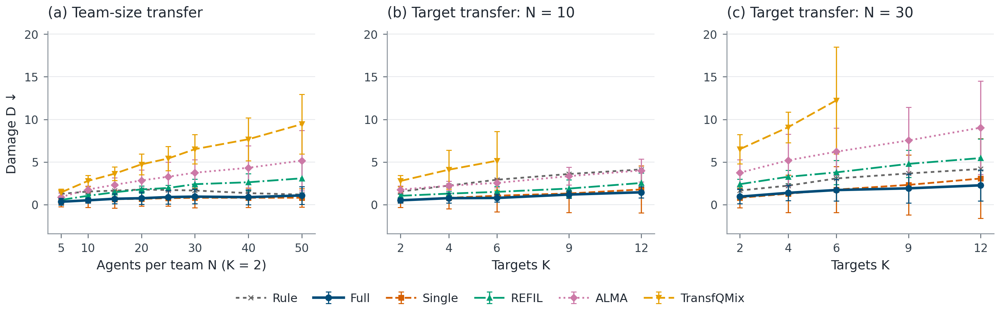
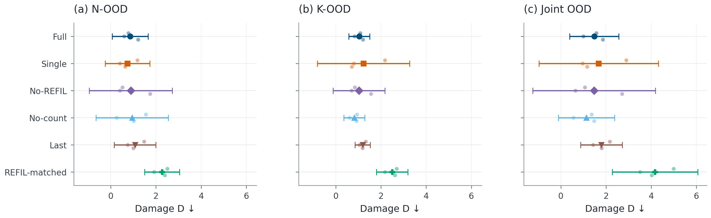
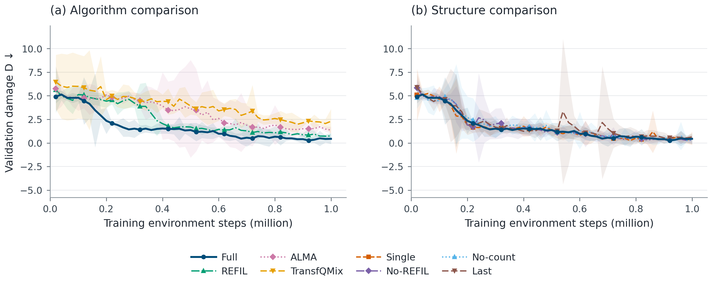
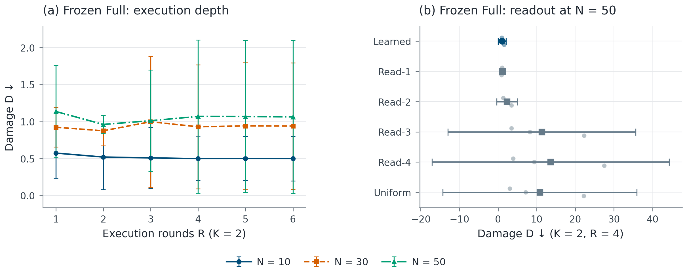
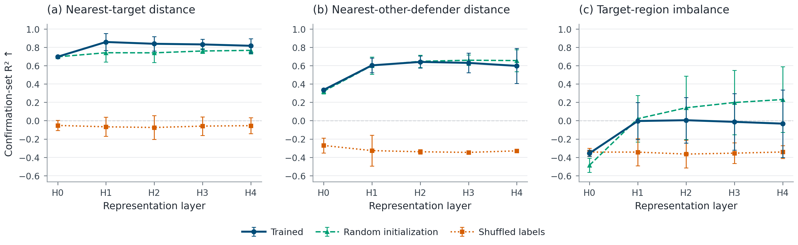

# 正文

## 1. 实验设置

我们考察策略仅在小规模任务上训练后，能否直接泛化至更多智能体、更多保护目标以及二者同时增加的场景，并通过结构消融与冻结模型干预分析循环表征的作用。当前已完成的实验来自 HAD 协同防御环境：红方智能体拦截按固定规则行动的蓝方攻击机，以减小保护目标的整局累计损伤 $D$；该指标越低越好。

训练时，双方人数相等，$N\in\{4,6,8,10\}$，目标数 $K\in\{1,2,3\}$，二者独立均匀采样。每次训练使用 $10^6$ 个环境物理步，测试冻结最终模型，人数最多扩展至 $50\mathrm{v}50$，目标数最多扩展至 12。测试分为分布内（ID）、人数外推（N-OOD）、目标数外推（K-OOD）和联合外推四组；$5\mathrm{v}5$ 属于人数插值，$10\mathrm{v}10,K=2$ 属于训练支持，两者均不计入 OOD 汇总。

比较方法包括 REFIL、QMIX-Atten、DCG、SPECTra、ALMA、TransfQMix 和规则策略。本文方法记为 Full，训练深度在 1–4 轮间采样，正式测试固定为 4 轮；Single 为从头训练的一轮版本，REFIL-matched 为容量匹配对照。学习方法均使用三个训练种子，每个种子、每个测试配置评估 300 局。表格报告跨种子均值及 95% $t$ 置信区间半宽，分组内配置等权；缺少完整三种子评估的结果记为“—”。

## 2. 跨规模泛化

表 1 汇总各方法在四类测试分布上的表现。Full 相对 REFIL 的分组平均损伤分别降低 41.5%、61.0%、42.3% 和 55.3%。这四组中，Full 在三个对应训练种子上的损伤也均低于 REFIL，说明性能改善不仅来自单个种子的较好结果。人数外推中的差距最为突出：Full 的平均损伤为 0.861，REFIL 为 2.209。

**表 1｜HAD 主比较。** $D$ 越低越好；加粗表示本表学习方法中各列最低的平均损伤，不代表统计显著性。† 为同一公共场景集上的规则参照，不具有训练种子置信区间。

| 方法 | ID | 人数外推 | 目标数外推 | 联合外推 |
|---|---|---|---|---|
| Full | **0.419 ± 0.383** | 0.861 ± 0.794 | **1.036 ± 0.463** | **1.477 ± 1.091** |
| Single | 0.429 ± 0.693 | **0.742 ± 0.983** | 1.225 ± 2.046 | 1.674 ± 2.643 |
| REFIL | 0.715 ± 0.121 | 2.209 ± 0.689 | 1.796 ± 0.756 | 3.308 ± 0.753 |
| QMIX-Atten | 2.318 ± 3.554 | 5.139 ± 7.729 | 5.009 ± 6.202 | 7.415 ± 9.862 |
| DCG | 2.028 ± 1.086 | 5.021 ± 6.602 | 5.839 ± 4.770 | 8.092 ± 9.710 |
| SPECTra | 2.662 ± 0.174 | 6.455 ± 3.485 | 6.933 ± 1.664 | 11.184 ± 0.873 |
| ALMA | 1.326 ± 0.480 | 3.605 ± 1.844 | 3.022 ± 0.854 | 5.375 ± 2.574 |
| TransfQMix | 2.157 ± 0.584 | 6.226 ± 1.760 | — | — |
| REFIL-matched | 0.914 ± 0.411 | 2.269 ± 0.776 | 2.493 ± 0.695 | 4.170 ± 1.888 |
| Rule | 1.462† | 1.545† | 3.212† | 3.060† |

**图 1｜人数与目标数变化下的泛化表现。** (a) 固定 $K=2$ 改变双方人数；(b–c) 分别固定双方人数为 10 和 30，改变目标数。曲线为三个训练种子的均值，误差线为 95% $t$ 置信区间；Rule 仅显示公共参照均值。$N=5$ 为人数插值，$N=10,K=2$ 为训练支持；缺失配置处断开曲线 [矢量 PDF](figures/paper_generalization.pdf)。

图 1 表明，随着人数或目标数增加，Full 的损伤整体保持在 REFIL 与 ALMA 之下；容量匹配的 REFIL 也未消除表 1 中的差距。不过，循环版本并未在所有外推轴上优于 Single：Single 的人数外推损伤为 0.742，低于 Full 的 0.861。Full 在 ID、目标数外推和联合外推上的均值较低，但这些比较仍存在明显种子差异，不能据此断言多轮训练稳定优于单轮训练。

## 3. 结构消融

为区分循环结构、局部分支和数量条件的贡献，我们比较 Single、No-REFIL、No-count 与 Last。No-REFIL 同时去掉原 REFIL 局部注意力路径和想象分组训练；No-count 取消循环查询中的数量编码注入；Last 在训练和测试时均只保留最后一轮读出。上述变体均独立训练，结果见图 2。

**图 2｜不同泛化轴上的结构消融。** 点与横向误差线表示分组均值及 95% $t$ 置信区间，小点表示三个训练种子。三个面板分别对应人数、目标数和联合外推 [矢量 PDF](figures/paper_ablation.pdf)。

Last 在人数、目标数和联合外推上的损伤分别为 1.076、1.187 和 1.795，均高于 Full，与保留跨轮读出有助于当前任务的解释一致。另一方面，No-REFIL 的部分分组均值与 Full 相近，表明现有实验不能确立该局部分支及想象分组训练的必要性，且这一消融同时改变了两个因素。

数量编码也未表现出一致收益。No-count 在目标数和联合外推上的损伤分别为 0.819 和 1.132，低于 Full 的 1.036 和 1.477，且三个对应训练种子均呈现这一方向。因而，当前性能优势应归于整体方法在本实验协议下的表现，不能解释为每个组件都提供了独立且稳定的增益。附录 C–D 进一步分析执行深度、读出干预及关系可读性。

# 附录

## A. 评估协议与统计口径

**表 A1｜HAD 测试配置。** 各分组互不重叠，共 24 个配置；表 1 汇总其中四个主要分组。

| 分组 | 配置（双方人数相等） | 配置数 |
|---|---|---|
| ID | $N=4,6,8$ 时 $K=2$；$N=10$ 时 $K=3$ | 4 |
| 训练支持 | $N=10,K=2$ | 1 |
| 人数插值 | $N=5,K=2$ | 1 |
| 人数外推 | $N=15,20,25,30,40,50$，$K=2$ | 6 |
| 目标数外推 | $N=10$，$K=4,6,9,12$ | 4 |
| 联合外推 | $N=15,20,30$ 与 $K=4,6$ 的组合；另加 $N=30,K=9,12$ | 8 |

终评仅使用达到训练预算的最终模型，不依据外推表现选取检查点。各方法共享 300 个评估场景种子（9000–9299），训练种子为 0、1、2。对每个训练种子，先计算每个配置的回合平均损伤，再对该分组内配置等权平均，最后跨三个训练种子计算均值。95% 区间半宽为 $4.30265\,s/\sqrt{3}$，其中 $s$ 为三个种子汇总值的样本标准差；不将评估回合视为独立训练重复。对称区间可能跨过零，图中保留其完整范围。

Full 的循环表征维度为 64，注意力头数为 4，前馈层宽度为 128；经验池包含 5000 个回合，批大小为 32，学习率为 $5\times10^{-4}$，折扣因子为 0.99。比较方法保留各自登记的网络与优化设置，不假定相同训练步数等价于相同计算成本。

本次整理时间为 2026-09-22 16:57 CST。数值来自本实验目录中的[评估记录](episodes.csv)、[探针结果](probe/results.csv)和[实验配置](experiment.json)，仅纳入与已登记最终模型匹配、场景配额完整的结果。

## B. 学习过程与种子差异

**图 A1｜训练期间的分布内验证。** 左图比较 Full 与主要学习基线，右图比较结构变体。每个验证点在四个 ID 配置上各评估 25 局；曲线与阴影为三个训练种子的均值及 95% $t$ 置信区间，未作平滑 [矢量 PDF](figures/paper_learning.pdf)。

为便于区分总体均值与训练随机性，表 A2 列出 Full、Single 与 REFIL 的逐种子分组结果。Full 相比 Single 的四组结果均呈现相同分化：种子 0 更好，而种子 1、2 更差。因此，主表中部分均值优势并不意味着优势在所有训练重复中成立。

**表 A2｜逐训练种子的平均损伤。** 每个数值已在对应分组内对配置等权平均。

| 方法 | 种子 | ID | 人数外推 | 目标数外推 | 联合外推 |
|---|---|---|---|---|---|
| Full | 0 | 0.330 | 0.778 | 1.078 | 1.576 |
| Full | 1 | 0.329 | 0.591 | 0.833 | 0.997 |
| Full | 2 | 0.596 | 1.214 | 1.199 | 1.859 |
| Single | 0 | 0.747 | 1.180 | 2.174 | 2.897 |
| Single | 1 | 0.227 | 0.410 | 0.797 | 0.964 |
| Single | 2 | 0.314 | 0.636 | 0.704 | 1.160 |
| REFIL | 0 | 0.686 | 2.189 | 1.467 | 3.003 |
| REFIL | 1 | 0.689 | 2.496 | 1.856 | 3.610 |
| REFIL | 2 | 0.772 | 1.942 | 2.066 | 3.312 |

## C. 执行深度与读出干预

冻结同一个 Full 模型，仅改变推理轮数，可将执行计算量的影响与重训效应分开。图 A2(a) 中，$30\mathrm{v}30$ 和 $50\mathrm{v}50$ 的平均损伤均在两轮时最低，超过四轮后也未观察到持续改善。例如，$50\mathrm{v}50,K=2$ 下，两轮与四轮的平均损伤分别为 0.962 和 1.070。这些结果不支持“规模越大便需要更多循环轮数”的单调解释；正文仍按预先设定的四轮模型报告。

**图 A2｜冻结 Full 的执行深度与读出干预。** (a) 同一最终模型在 1–6 轮下的表现；(b) 固定计算四轮，在 $50\mathrm{v}50,K=2$ 下替换读出方式。误差表示三个训练种子的 95% $t$ 置信区间。Read-4 是冻结后的干预，不同于图 2 中重新训练的 Last [矢量 PDF](figures/paper_mechanism.pdf)。

**表 A3｜固定四轮时的读出干预。** Learned 使用原学习权重，Read-$r$ 只读取第 $r$ 轮，Uniform 对四轮读出等权平均。

| 读出方式 | $10\mathrm{v}10,K=2$ | $50\mathrm{v}50,K=2$ | $30\mathrm{v}30,K=12$ |
|---|---|---|---|
| Learned | 0.499 ± 0.295 | 1.070 ± 1.034 | 2.260 ± 1.820 |
| Read-1 | 0.574 ± 0.338 | 1.136 ± 0.624 | 2.544 ± 2.026 |
| Read-2 | 1.565 ± 2.192 | 2.320 ± 2.680 | 5.976 ± 5.693 |
| Read-3 | 4.313 ± 6.366 | 11.319 ± 24.318 | 19.039 ± 36.223 |
| Read-4 | 5.242 ± 5.249 | 13.590 ± 30.669 | 21.045 ± 35.858 |
| Uniform | 4.332 ± 6.453 | 10.786 ± 25.125 | 19.631 ± 38.565 |

Learned 在三个配置上的平均损伤均低于其他读出方式；仅使用较晚轮次或改用均匀权重时，部分种子的性能下降很大。这说明已训策略依赖其学习到的读取方式。但冻结干预也改变了策略头接收的输入分布，因而不能据此断言晚轮表示本身无效，或将性能下降直接解释为轮次间的因果分工。四轮和 Learned 复用相同正式评估；Read-1 与一轮执行只在已验证等价的相交场景中复用，不增加样本量。

## D. 关系可读性与控制实验

关系探针使用五个配置的 500 条公共轨迹，Full 和 REFIL 各提供一半。对三个 Full 最终模型分别重建相同状态历史，在 $H_0$–$H_4$ 上拟合岭回归，针对观察者可见敌人，预测其到最近可见目标的距离、到除观察者外最近可见防守者的距离，以及最近目标分区内可见敌我数量的归一化差值 $(n_B-n_R)/(n_B+n_R)$（防守者计数排除观察者）。ID 数据按场景划分为拟合、验证和测试集，标准化与正则强度仅依据 ID 拟合及验证集确定；OOD 确认集不参与选择，并同时报告随机初始化和置乱训练标签控制。

**图 A3｜$50\mathrm{v}50,K=2$ 确认集上的关系探针。** 三个面板依次为目标距离、其他防守者距离及目标分区人数不平衡。曲线为三个模型的平均测试 $R^2$，误差线为 95% $t$ 置信区间；负值按原值保留。随机初始化网络和置乱标签使用相同数据划分与拟合流程 [矢量 PDF](figures/paper_probes.pdf)。

目标距离的可读性从 $H_0$ 的 0.697 上升至 $H_1$ 的 0.858，但随后下降至 $H_4$ 的 0.817，并未随轮次持续增强。其他防守者距离的 $H_4$ 得分为 0.597，随机初始化控制为 0.655；人数不平衡的 $H_4$ 得分为 −0.032，随机初始化控制反而达到 0.231。因此，当前结果支持部分几何信息可从循环表征中线性读取，尚不能证明晚轮持续形成更强、或专属于训练所得策略的关系表征。

## E. 结果覆盖范围

当前 11 个 HAD 学习方法已完成全部 24 个配置的三种子终评。TransfQMix 完成 20/24 个配置；任一配置缺少完整三种子评估时，该分组均值不予报告。Fixed4、Untied4、KV0 尚无完整三种子终评结果。SMACv2 尚无完整正式结果，本文结论限于 HAD。参数与时延比较尚无合格测量，因此不作计算效率优于基线的结论。
