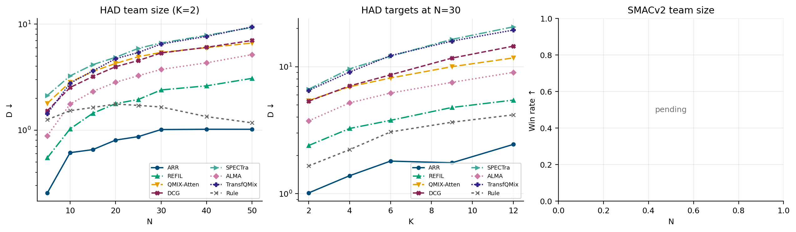
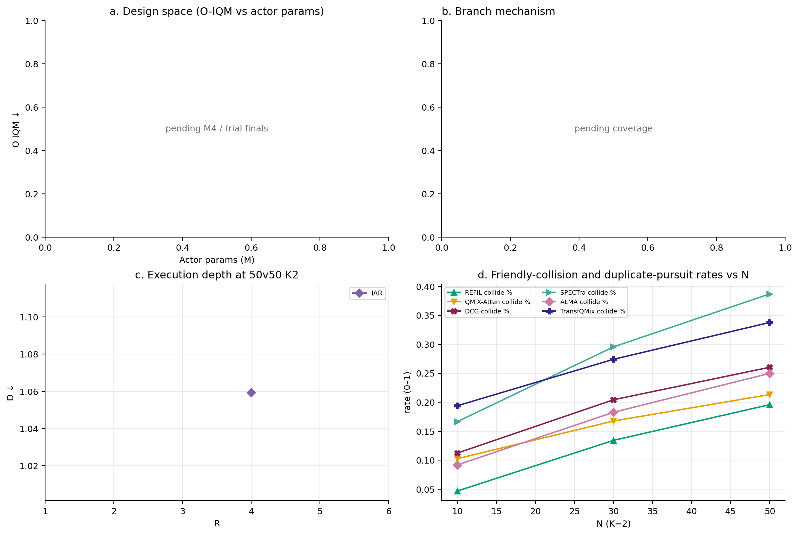
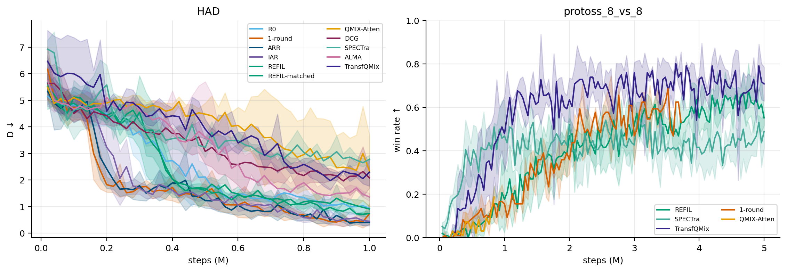
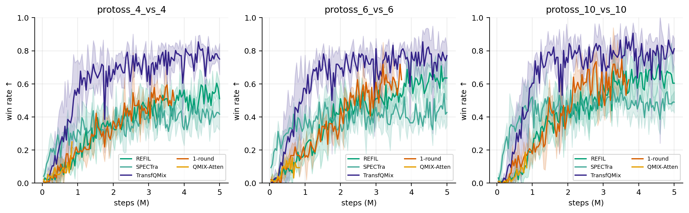

# main0923：试训、闸门与机制报告（2026-10-06T21:24:20+08:00）

主方法：A。唯一正式报告；正文与附录共用同一数据源。正式格必须匹配 inventory / 磁盘 final 的 checkpoint_id 与 t_env，且每种子完成规定随机流的全部回合（HAD 9000–9299 共 300 局；SMACv2 110000–110299；闸门/重复追击/意图干预为前 100 局）。

统计顺序：每种子每配置求回合均值 → 组内配置等权 → 跨种子 IQM（5 种子去掉两端各 1 个，与闸门 `branch_gate.iqm` 相同；3 种子即均值）。区间为分层 bootstrap 10,000 次（种子与组内配置有放回重采样，种子 20260924）的 2.5/97.5 分位。附录另给均值 ± 95% t 与逐种子值。Rule 是同一场景库的单组共同参照，没有虚构训练种子。

导入基线四组 IQM（3 种子即均值）与 main0921 表 1 三位小数一致。

## 1. 试训与闸门

判定文件时间：2026-09-27T15:58:28+0800；方式：manual；选择：未定。

| 级别 | O-IQM | 失败 | 种子数 |
|---|---|---|---|
| R0 | 2.866 | 2 | 3 |
| C | 2.031 | 1 | 5 |
| A | 1.240 | 0 | 5 |
| B | 1.160 | 0 | 5 |

理由：

- 地基检查未通过：C 没有显著优于 R0（二阶关系是关键的主线不成立），必须人工决策
- R0 失败 2/3：已标出

已放行分支：`A`，mode=user。

## 图1：方法结构

REFIL 宿主为灰色，关系模块为彩色。图示不是机制实验的证据，不含数值结果。
[PDF](figures/fig1_architecture.pdf) · [PNG](figures/fig1_architecture.png)

## 表1：主比较

HAD：IQM [bootstrap 2.5%, 97.5%]。相对 REFIL 的逐种子胜负只比较双方都完整的重叠种子（通常 0–2），比较量为三个 OOD 组的等权平均 $O$。SMAC 为胜率 IQM。参数来自合格 M4 行。

| 方法 | ID | N-OOD | K-OOD | 联合 OOD | 相对 REFIL $O$ | actor/训练参数 | SMAC 10/15/20/10v15 |
|---|---|---|---|---|---|---|---|
| ARR | 0.394 [0.255, 0.616] | 0.908 [0.511, 1.793] | 1.179 [0.745, 1.545] | 1.529 [0.972, 2.071] | 3/3 | 175754/465162 | — / — / — / — |
| REFIL | 0.715 [0.489, 0.951] | 2.209 [1.759, 2.795] | 1.796 [1.319, 2.410] | 3.308 [2.502, 4.263] | — | 102025/391433 | 0.648 [0.613, 0.667] / 0.574 [0.540, 0.603] / 0.443 [0.373, 0.483] / 0.000 [0.000, 0.000] |
| QMIX-Atten | 2.318 [1.053, 3.871] | 5.139 [2.320, 8.322] | 5.009 [2.773, 7.637] | 7.415 [3.656, 11.567] | 0/3 | — | — / — / — / — |
| DCG | 2.028 [1.372, 2.907] | 5.021 [3.082, 8.170] | 5.839 [3.655, 8.729] | 8.092 [4.875, 13.020] | 0/3 | — | — / — / — / — |
| SPECTra | 2.662 [1.950, 3.495] | 6.455 [4.871, 8.689] | 6.933 [5.076, 8.952] | 11.184 [8.234, 14.756] | 0/3 | — | 0.449 [0.423, 0.467] / 0.378 [0.320, 0.423] / 0.283 [0.200, 0.357] / 0.000 [0.000, 0.000] |
| ALMA | 1.326 [0.844, 1.849] | 3.605 [2.683, 4.740] | 3.022 [2.314, 3.837] | 5.375 [3.921, 7.190] | 0/3 | — | — / — / — / — |
| TransfQMix | 2.157 [1.369, 3.048] | 6.226 [4.700, 8.030] | 6.128 [4.140, 8.823] | 10.597 [7.238, 15.470] | 0/3 | 50441/100618 | 0.770 [0.740, 0.817] / 0.741 [0.677, 0.793] / 0.697 [0.607, 0.770] / 0.000 [0.000, 0.000] |
| REFIL-matched | 0.914 [0.554, 1.290] | 2.269 [1.827, 2.734] | 2.493 [1.831, 3.138] | 4.170 [2.998, 5.750] | 1/3 | 176393/465801 | — / — / — / — |
| Rule | 1.462（共同参照） | 1.545（共同参照） | 3.212（共同参照） | 3.060（共同参照） | — | — | — |

## 图2：规模曲线

HAD 用对数纵轴，只画完整方法的 IQM 均值；缺格断开，不插值。SMACv2 胜率在 0–1，用线性轴。配色全文统一。
[PDF](figures/fig2_scale.pdf) · [PNG](figures/fig2_scale.png)

## 表2：关系阶梯与消融

阶梯始终为 R0 → C → A → B，到已选定的主方法为止（未选定时列全阶梯，缺格为 —）。50v50 K2 的相撞率是红方碰撞死亡 / $N_R$（与规划文档一致），重复追击是 `dup_pursuit_frac`；缺字段不填零。

| 方法 | ID | N-OOD | K-OOD | 联合 OOD | 50v50 相撞率 | 50v50 重复追击 |
|---|---|---|---|---|---|---|
| R0 | 0.992 [0.558, 1.523] | 2.659 [1.833, 3.665] | 2.174 [1.320, 3.053] | 3.765 [2.281, 5.434] | 18.3% [15.8%, 20.1%] | 37.5% [34.2%, 42.6%] |
| C / 1-round | 0.617 [0.353, 1.312] | 2.159 [0.767, 3.671] | 1.366 [0.957, 2.461] | 2.569 [1.274, 4.152] | 17.6% [13.0%, 22.2%] | 36.6% [32.0%, 42.4%] |
| A / ARR | 0.394 [0.255, 0.616] | 0.908 [0.511, 1.793] | 1.179 [0.745, 1.545] | 1.529 [0.972, 2.071] | 12.3% [9.5%, 21.1%] | 40.5% [30.5%, 46.4%] |
| ARR-NoMem | 0.471 [0.278, 0.707] | 0.770 [0.486, 1.201] | 1.242 [0.760, 1.868] | 1.384 [0.874, 1.966] | 12.2% [12.1%, 12.3%] | 45.2% [44.8%, 45.5%] |
| ARR-NoREFIL | 0.734 [0.351, 1.299] | 2.215 [0.964, 4.372] | 1.875 [0.824, 3.601] | 2.658 [1.248, 4.765] | 17.7% [11.9%, 24.2%] | 43.7% [34.2%, 49.6%] |
| ARR-Fixed4 | 0.495 [0.346, 0.719] | 0.859 [0.673, 1.083] | 1.403 [0.825, 2.336] | 1.695 [0.924, 3.001] | 8.9% [7.8%, 10.2%] | 49.1% [46.9%, 50.5%] |
| Tied-Fixed4 | 0.443 [0.251, 0.658] | 1.953 [0.997, 3.297] | 1.332 [0.909, 1.908] | 2.700 [1.652, 3.939] | 16.9% [11.7%, 25.6%] | 37.7% [36.3%, 39.8%] |
| ARR-NoCount | 0.537 [0.324, 0.827] | 0.950 [0.396, 1.616] | 1.060 [0.674, 1.423] | 1.613 [0.705, 2.562] | 12.7% [8.1%, 15.8%] | 38.8% [36.5%, 42.4%] |

导入基线在同一 50v50 K2 终评上的协同指标（缺 `dup_pursuit_frac` 不填零）：

| 方法 | 50v50 相撞率 | 50v50 重复追击 |
|---|---|---|
| REFIL | 19.6% [16.1%, 23.5%] | — |
| REFIL-matched | 17.8% [14.3%, 22.6%] | — |
| QMIX-Atten | 21.3% [16.9%, 26.3%] | — |
| DCG | 26.0% [18.1%, 35.4%] | — |
| SPECTra | 38.7% [37.0%, 40.4%] | — |
| ALMA | 25.0% [22.0%, 30.0%] | — |
| TransfQMix | 33.8% [30.1%, 39.4%] | — |
| Rule | 8.7%（共同参照） | — |

## 图3：机制

(a) 设计空间点图需合格 M4 参数与 O-IQM；(b) 随分支切换：A 为 K/V 漂移，B 为意图准确率，C/未选为覆盖探针；(c) 执行深度；(d) 相撞率与重复追击率随 N。任一面板缺完整数据时标为待完成，不画占位曲线。
[PDF](figures/fig3_mechanism.pdf) · [PNG](figures/fig3_mechanism.png)

## 2. 学习曲线

训练中每隔一段步数会对四个验证场景各跑前向评估；正文只看 `protoss_8_vs_8`。SMAC 纵轴是训练中验证胜率 `battle_won`，与正式指标相同。其余验证场景的同口径曲线见附录 B。每个验证点：该场景 32 局齐了的种子算均值 ±1 标准差；1 个种子时带宽为 0。
[PDF](figures/fig_learning.pdf) · [PNG](figures/fig_learning.png)

## 3. 成本 M4

仅保留匹配当前 final 身份、登记物理 GPU、float32、200 次同步计时的行。

| 方法 | actor 参数 | 训练总参数 | N=10 ms/决策 | N=50 ms/决策 |
|---|---|---|---|---|
| REFIL | 102025 | 391433 | s0: 1.046 [1.036, 6.888]; p95=7.129 s1: 1.054 [1.039, 6.888]; p95=7.111 s2: 1.174 [1.047, 6.877]; p95=7.107 | s0: 1.063 [1.046, 6.897]; p95=7.088 s1: 1.050 [1.041, 6.902]; p95=7.111 s2: 1.246 [1.046, 6.912]; p95=7.126 |
| REFIL-matched | 176393 | 465801 | s0: 1.930 [1.319, 6.927]; p95=7.131 s1: 6.917 [1.749, 7.038]; p95=7.143 s2: 3.134 [1.347, 7.016]; p95=7.154 | s0: 1.215 [1.066, 6.922]; p95=7.140 s1: 4.757 [1.763, 7.046]; p95=7.265 s2: 1.071 [1.057, 1.213]; p95=7.097 |
| R0 | 175754 | 465162 | s0: 11.706 [3.801, 11.967]; p95=12.083 s1: 3.346 [2.630, 11.783]; p95=12.050 s2: 6.454 [2.508, 11.782]; p95=12.100 | s0: 3.745 [2.399, 11.777]; p95=12.106 s1: 8.388 [2.953, 11.910]; p95=12.113 s2: 2.253 [2.126, 11.753]; p95=12.081 |
| 1-round | 175754 | 465162 | s0: 11.829 [5.252, 12.133]; p95=14.014 s1: 11.812 [4.661, 12.072]; p95=12.281 s2: 11.217 [3.912, 12.059]; p95=12.228 | s0: 4.372 [2.743, 11.881]; p95=12.212 s1: 7.983 [2.791, 12.025]; p95=12.221 s2: 10.560 [3.480, 12.043]; p95=12.261 |
| ARR | 175754 | 465162 | s0: 8.869 [3.983, 12.053]; p95=12.215 s1: 11.826 [4.417, 12.141]; p95=12.388 s2: 8.904 [4.120, 12.078]; p95=12.346 | s0: 8.749 [3.033, 12.025]; p95=12.266 s1: 8.635 [3.914, 12.038]; p95=12.342 s2: 2.587 [2.505, 11.870]; p95=12.213 |
| IAR | 176915 | 466323 | s0: 12.241 [5.105, 14.725]; p95=15.264 s1: 13.337 [7.392, 15.030]; p95=15.226 s2: 12.861 [6.436, 14.975]; p95=15.183 | s0: 6.483 [4.270, 12.725]; p95=14.820 s1: 9.993 [4.731, 12.918]; p95=15.141 s2: 13.449 [7.927, 15.053]; p95=15.228 |
| Looped | 175754 | 465162 | s0: 12.627 [6.095, 14.670]; p95=15.103 s1: 12.617 [6.092, 14.668]; p95=15.070 s2: 12.432 [5.327, 12.763]; p95=14.774 | s0: 12.459 [4.756, 12.756]; p95=14.773 s1: 12.470 [5.178, 12.779]; p95=14.919 s2: 12.468 [5.402, 12.816]; p95=15.047 |
| Untied4 | 281738 | 571146 | s0: 11.934 [5.348, 14.635]; p95=15.046 s1: 12.600 [5.951, 14.637]; p95=15.046 s2: 6.717 [3.856, 12.598]; p95=12.789 | s0: 12.585 [6.108, 14.718]; p95=15.129 s1: 12.584 [6.048, 13.710]; p95=15.092 s2: 10.286 [3.785, 12.673]; p95=12.828 |
| TransfQMix | 50441 | 100618 | s0: 1.186 [0.923, 4.829]; p95=4.947 s1: 1.085 [0.925, 4.859]; p95=4.978 s2: 4.225 [1.188, 4.899]; p95=4.998 | s0: 1.066 [0.924, 4.832]; p95=4.964 s1: 0.933 [0.920, 4.859]; p95=4.985 s2: 1.113 [0.921, 4.888]; p95=4.986 |

## 4. 探针文件

- `probe/coverage.csv`：已有；完成标记 27/27
- `probe/dynamics.csv`：已有；完成标记 22/22
- `probe/deep_rounds.csv`：已有；完成标记 14/14
- `probe/global_results.csv`：已有；完成标记 16/16
- `probe/readout_attention.csv`：已有；完成标记 13/13
- `probe/intent.csv`：已有；完成标记 5/5

## 附录 A. HAD 全部配置 × 方法

每格：IQM [bootstrap]；mean ± 95% t（与 main0921 同口径）；方括号为逐种子组均值。不完整格保留已有种子值与有效局数，这些值不进入正式 IQM。

### A.1 ID

| 方法 | 4v4 K2 | 6v6 K2 | 8v8 K2 | 10v10 K3 |
|---|---|---|---|---|
| REFIL | 0.409 [0.293, 0.511]; mean 0.409 ± 0.273 [0.293; 0.424; 0.511] | 0.616 [0.594, 0.649]; mean 0.616 ± 0.072 [0.594; 0.605; 0.649] | 0.783 [0.725, 0.813]; mean 0.783 ± 0.126 [0.813; 0.725; 0.812] | 1.053 [1.002, 1.114]; mean 1.053 ± 0.140 [1.043; 1.002; 1.114] |
| REFIL-matched | 0.479 [0.383, 0.660]; mean 0.479 ± 0.390 [0.395; 0.383; 0.660] | 0.774 [0.670, 0.939]; mean 0.774 ± 0.359 [0.670; 0.713; 0.939] | 0.992 [0.859, 1.165]; mean 0.992 ± 0.390 [0.952; 0.859; 1.165] | 1.412 [1.194, 1.641]; mean 1.412 ± 0.556 [1.402; 1.194; 1.641] |
| QMIX-Atten | 1.518 [0.731, 2.667]; mean 1.518 ± 2.528 [2.667; 0.731; 1.156] | 2.008 [0.945, 3.351]; mean 2.008 ± 3.049 [3.351; 0.945; 1.726] | 2.430 [1.050, 4.067]; mean 2.430 ± 3.788 [4.067; 1.050; 2.174] | 3.315 [1.488, 5.397]; mean 3.315 ± 4.886 [5.397; 1.488; 3.060] |
| DCG | 1.256 [0.933, 1.552]; mean 1.256 ± 0.770 [1.282; 1.552; 0.933] | 1.724 [1.423, 2.061]; mean 1.724 ± 0.796 [1.689; 2.061; 1.423] | 2.078 [1.832, 2.506]; mean 2.078 ± 0.922 [1.898; 2.506; 1.832] | 3.055 [2.439, 3.921]; mean 3.055 ± 1.918 [2.804; 3.921; 2.439] |
| SPECTra | 1.729 [1.595, 1.796]; mean 1.729 ± 0.288 [1.796; 1.595; 1.796] | 2.330 [2.205, 2.478]; mean 2.330 ± 0.343 [2.478; 2.205; 2.306] | 2.756 [2.739, 2.769]; mean 2.756 ± 0.037 [2.769; 2.739; 2.759] | 3.834 [3.776, 3.891]; mean 3.834 ± 0.143 [3.891; 3.836; 3.776] |
| ALMA | 0.744 [0.543, 1.020]; mean 0.744 ± 0.614 [1.020; 0.669; 0.543] | 1.083 [0.921, 1.208]; mean 1.083 ± 0.365 [1.208; 0.921; 1.121] | 1.418 [1.259, 1.696]; mean 1.418 ± 0.600 [1.696; 1.259; 1.299] | 2.058 [1.787, 2.227]; mean 2.058 ± 0.590 [2.227; 1.787; 2.161] |
| TransfQMix | 1.163 [0.905, 1.293]; mean 1.163 ± 0.556 [0.905; 1.291; 1.293] | 1.753 [1.596, 1.925]; mean 1.753 ± 0.410 [1.596; 1.925; 1.738] | 2.282 [2.073, 2.578]; mean 2.282 ± 0.655 [2.073; 2.578; 2.195] | 3.429 [3.062, 3.710]; mean 3.429 ± 0.826 [3.062; 3.710; 3.514] |
| IAR | 0.308 [0.174, 0.445]; mean 0.308 ± 0.159 [0.468; 0.224; 0.149; 0.397; 0.303] | 0.352 [0.250, 0.505]; mean 0.360 ± 0.163 [0.497; 0.237; 0.282; 0.508; 0.277] | 0.471 [0.337, 0.604]; mean 0.468 ± 0.159 [0.575; 0.443; 0.309; 0.618; 0.395] | 0.703 [0.543, 0.879]; mean 0.708 ± 0.200 [0.778; 0.703; 0.501; 0.930; 0.627] |
| ARR | 0.225 [0.200, 0.384]; mean 0.265 ± 0.131 [0.202; 0.226; 0.198; 0.249; 0.451] | 0.309 [0.272, 0.451]; mean 0.338 ± 0.118 [0.365; 0.278; 0.269; 0.282; 0.493] | 0.354 [0.332, 0.518]; mean 0.395 ± 0.135 [0.381; 0.327; 0.341; 0.341; 0.586] | 0.685 [0.477, 0.790]; mean 0.654 ± 0.192 [0.799; 0.600; 0.416; 0.683; 0.773] |
| 1-round | 0.375 [0.273, 0.706]; mean 0.442 ± 0.282 [0.482; 0.819; 0.354; 0.265; 0.289] | 0.490 [0.303, 1.111]; mean 0.614 ± 0.535 [0.648; 1.342; 0.424; 0.254; 0.399] | 0.661 [0.407, 1.480]; mean 0.820 ± 0.694 [0.978; 1.731; 0.560; 0.387; 0.445] | 0.943 [0.657, 1.885]; mean 1.137 ± 0.800 [1.240; 2.208; 0.915; 0.649; 0.673] |
| R0 | 0.526 [0.344, 0.676]; mean 0.526 ± 0.418 [0.676; 0.558; 0.344] | 0.845 [0.448, 1.122]; mean 0.845 ± 0.875 [1.122; 0.965; 0.448] | 1.061 [0.595, 1.433]; mean 1.061 ± 1.060 [1.433; 1.153; 0.595] | 1.537 [1.033, 1.945]; mean 1.537 ± 1.150 [1.945; 1.632; 1.033] |
| Looped | 0.173 [0.128, 0.222]; mean 0.173 ± 0.118 [0.222; 0.168; 0.128] | 0.266 [0.157, 0.410]; mean 0.266 ± 0.324 [0.410; 0.157; 0.232] | 0.284 [0.167, 0.396]; mean 0.284 ± 0.285 [0.396; 0.167; 0.289] | 0.497 [0.350, 0.752]; mean 0.497 ± 0.550 [0.752; 0.350; 0.391] |
| Untied4 | 0.247 [0.128, 0.361]; mean 0.247 ± 0.289 [0.253; 0.128; 0.361] | 0.300 [0.205, 0.432]; mean 0.300 ± 0.293 [0.263; 0.205; 0.432] | 0.383 [0.282, 0.581]; mean 0.383 ± 0.424 [0.288; 0.282; 0.581] | 0.601 [0.448, 0.890]; mean 0.601 ± 0.621 [0.466; 0.448; 0.890] |
| 1-round-NoMem | — [—; —; —] n(0/1/2)=0/0/0; quota=300 | — [—; —; —] n(0/1/2)=0/0/0; quota=300 | — [—; —; —] n(0/1/2)=0/0/0; quota=300 | — [—; —; —] n(0/1/2)=0/0/0; quota=300 |
| 1-round-NoREFIL | — [—; —; —] n(0/1/2)=0/0/0; quota=300 | — [—; —; —] n(0/1/2)=0/0/0; quota=300 | — [—; —; —] n(0/1/2)=0/0/0; quota=300 | — [—; —; —] n(0/1/2)=0/0/0; quota=300 |
| 1-round-NoCount | — [—; —; —] n(0/1/2)=0/0/0; quota=300 | — [—; —; —] n(0/1/2)=0/0/0; quota=300 | — [—; —; —] n(0/1/2)=0/0/0; quota=300 | — [—; —; —] n(0/1/2)=0/0/0; quota=300 |
| ARR-NoMem | 0.295 [0.161, 0.369]; mean 0.295 ± 0.289 [0.355; 0.161; 0.369] | 0.441 [0.265, 0.655]; mean 0.441 ± 0.491 [0.655; 0.265; 0.404] | 0.460 [0.298, 0.653]; mean 0.460 ± 0.446 [0.653; 0.298; 0.428] | 0.690 [0.513, 0.997]; mean 0.690 ± 0.663 [0.997; 0.559; 0.513] |
| ARR-NoREFIL | 0.396 [0.229, 0.685]; mean 0.396 ± 0.625 [0.685; 0.229; 0.273] | 0.628 [0.348, 1.102]; mean 0.628 ± 1.025 [1.102; 0.433; 0.348] | 0.819 [0.496, 1.422]; mean 0.819 ± 1.297 [1.422; 0.540; 0.496] | 1.093 [0.512, 1.897]; mean 1.093 ± 1.786 [1.897; 0.870; 0.512] |
| ARR-Fixed4 | 0.316 [0.241, 0.405]; mean 0.316 ± 0.205 [0.302; 0.241; 0.405] | 0.406 [0.343, 0.443]; mean 0.406 ± 0.136 [0.443; 0.343; 0.432] | 0.499 [0.398, 0.627]; mean 0.499 ± 0.292 [0.627; 0.470; 0.398] | 0.759 [0.599, 1.007]; mean 0.759 ± 0.540 [1.007; 0.673; 0.599] |
| Tied-Fixed4 | 0.246 [0.129, 0.380]; mean 0.246 ± 0.313 [0.129; 0.229; 0.380] | 0.348 [0.243, 0.418]; mean 0.348 ± 0.229 [0.243; 0.382; 0.418] | 0.446 [0.315, 0.545]; mean 0.446 ± 0.294 [0.315; 0.545; 0.477] | 0.732 [0.626, 0.842]; mean 0.732 ± 0.268 [0.626; 0.842; 0.730] |
| ARR-NoCount | 0.357 [0.235, 0.515]; mean 0.357 ± 0.356 [0.321; 0.235; 0.515] | 0.488 [0.305, 0.779]; mean 0.488 ± 0.633 [0.380; 0.305; 0.779] | 0.543 [0.405, 0.779]; mean 0.543 ± 0.512 [0.444; 0.405; 0.779] | 0.761 [0.487, 1.201]; mean 0.761 ± 0.957 [0.487; 0.594; 1.201] |
| IAR-NoAux | — [—; —; —] n(0/1/2)=0/0/0; quota=300 | — [—; —; —] n(0/1/2)=0/0/0; quota=300 | — [—; —; —] n(0/1/2)=0/0/0; quota=300 | — [—; —; —] n(0/1/2)=0/0/0; quota=300 |
| IAR-NoMem | — [—; —; —] n(0/1/2)=0/0/0; quota=300 | — [—; —; —] n(0/1/2)=0/0/0; quota=300 | — [—; —; —] n(0/1/2)=0/0/0; quota=300 | — [—; —; —] n(0/1/2)=0/0/0; quota=300 |
| IAR-Looped | — [—; —; —] n(0/1/2)=0/0/0; quota=300 | — [—; —; —] n(0/1/2)=0/0/0; quota=300 | — [—; —; —] n(0/1/2)=0/0/0; quota=300 | — [—; —; —] n(0/1/2)=0/0/0; quota=300 |
| IAR-NoREFIL | — [—; —; —] n(0/1/2)=0/0/0; quota=300 | — [—; —; —] n(0/1/2)=0/0/0; quota=300 | — [—; —; —] n(0/1/2)=0/0/0; quota=300 | — [—; —; —] n(0/1/2)=0/0/0; quota=300 |
| Rule | 1.153（共同参照） | 1.333（共同参照） | 1.429（共同参照） | 1.934（共同参照） |

### A.2 训练范围支持点

| 方法 | 10v10 K2 |
|---|---|
| REFIL | 1.027 [0.946, 1.087]; mean 1.027 ± 0.181 [1.047; 0.946; 1.087] |
| REFIL-matched | 1.244 [1.136, 1.360]; mean 1.244 ± 0.279 [1.237; 1.136; 1.360] |
| QMIX-Atten | 2.834 [1.215, 4.667]; mean 2.834 ± 4.311 [4.667; 1.215; 2.619] |
| DCG | 2.525 [2.146, 3.188]; mean 2.525 ± 1.430 [2.241; 3.188; 2.146] |
| SPECTra | 3.248 [3.053, 3.482]; mean 3.248 ± 0.540 [3.209; 3.482; 3.053] |
| ALMA | 1.760 [1.583, 1.918]; mean 1.760 ± 0.419 [1.918; 1.583; 1.779] |
| TransfQMix | 2.770 [2.489, 3.006]; mean 2.770 ± 0.650 [2.489; 3.006; 2.815] |
| IAR | 0.546 [0.472, 0.746]; mean 0.583 ± 0.182 [0.578; 0.527; 0.444; 0.830; 0.534] |
| ARR | 0.612 [0.473, 0.658]; mean 0.584 ± 0.120 [0.613; 0.568; 0.425; 0.655; 0.660] |
| 1-round | 0.819 [0.450, 1.669]; mean 0.955 ± 0.763 [1.133; 1.938; 0.731; 0.377; 0.595] |
| R0 | 1.375 [0.860, 1.781]; mean 1.375 ± 1.168 [1.781; 1.485; 0.860] |
| Looped | 0.433 [0.332, 0.618]; mean 0.433 ± 0.399 [0.618; 0.332; 0.348] |
| Untied4 | 0.458 [0.356, 0.600]; mean 0.458 ± 0.315 [0.418; 0.356; 0.600] |
| 1-round-NoMem | — [—; —; —] n(0/1/2)=0/0/0; quota=300 |
| 1-round-NoREFIL | — [—; —; —] n(0/1/2)=0/0/0; quota=300 |
| 1-round-NoCount | — [—; —; —] n(0/1/2)=0/0/0; quota=300 |
| ARR-NoMem | 0.523 [0.386, 0.732]; mean 0.523 ± 0.457 [0.732; 0.386; 0.451] |
| ARR-NoREFIL | 1.005 [0.577, 1.802]; mean 1.005 ± 1.717 [1.802; 0.635; 0.577] |
| ARR-Fixed4 | 0.628 [0.550, 0.756]; mean 0.628 ± 0.279 [0.756; 0.550; 0.578] |
| Tied-Fixed4 | 0.612 [0.501, 0.744]; mean 0.612 ± 0.306 [0.501; 0.744; 0.590] |
| ARR-NoCount | 0.641 [0.425, 1.028]; mean 0.641 ± 0.835 [0.425; 0.470; 1.028] |
| IAR-NoAux | — [—; —; —] n(0/1/2)=0/0/0; quota=300 |
| IAR-NoMem | — [—; —; —] n(0/1/2)=0/0/0; quota=300 |
| IAR-Looped | — [—; —; —] n(0/1/2)=0/0/0; quota=300 |
| IAR-NoREFIL | — [—; —; —] n(0/1/2)=0/0/0; quota=300 |
| Rule | 1.525（共同参照） |

### A.3 人数插值

| 方法 | 5v5 K2 |
|---|---|
| REFIL | 0.548 [0.478, 0.629]; mean 0.548 ± 0.190 [0.478; 0.535; 0.629] |
| REFIL-matched | 0.686 [0.564, 0.848]; mean 0.686 ± 0.364 [0.647; 0.564; 0.848] |
| QMIX-Atten | 1.791 [0.838, 3.008]; mean 1.791 ± 2.756 [3.008; 0.838; 1.526] |
| DCG | 1.520 [1.245, 1.883]; mean 1.520 ± 0.815 [1.433; 1.883; 1.245] |
| SPECTra | 2.122 [2.101, 2.140]; mean 2.122 ± 0.049 [2.127; 2.140; 2.101] |
| ALMA | 0.884 [0.757, 1.103]; mean 0.884 ± 0.474 [1.103; 0.792; 0.757] |
| TransfQMix | 1.431 [1.275, 1.600]; mean 1.431 ± 0.405 [1.275; 1.419; 1.600] |
| IAR | 0.355 [0.252, 0.507]; mean 0.364 ± 0.162 [0.510; 0.295; 0.269; 0.500; 0.244] |
| ARR | 0.255 [0.226, 0.396]; mean 0.288 ± 0.118 [0.229; 0.253; 0.224; 0.283; 0.453] |
| 1-round | 0.426 [0.313, 0.862]; mean 0.519 ± 0.376 [0.504; 1.041; 0.387; 0.277; 0.387] |
| R0 | 0.748 [0.446, 0.979]; mean 0.748 ± 0.679 [0.979; 0.819; 0.446] |
| Looped | 0.201 [0.154, 0.278]; mean 0.201 ± 0.167 [0.278; 0.171; 0.154] |
| Untied4 | 0.288 [0.146, 0.421]; mean 0.288 ± 0.342 [0.297; 0.146; 0.421] |
| 1-round-NoMem | — [—; —; —] n(0/1/2)=0/0/0; quota=300 |
| 1-round-NoREFIL | — [—; —; —] n(0/1/2)=0/0/0; quota=300 |
| 1-round-NoCount | — [—; —; —] n(0/1/2)=0/0/0; quota=300 |
| ARR-NoMem | 0.391 [0.216, 0.497]; mean 0.391 ± 0.379 [0.461; 0.216; 0.497] |
| ARR-NoREFIL | 0.486 [0.263, 0.839]; mean 0.486 ± 0.769 [0.839; 0.356; 0.263] |
| ARR-Fixed4 | 0.380 [0.312, 0.432]; mean 0.380 ± 0.153 [0.432; 0.312; 0.395] |
| Tied-Fixed4 | 0.316 [0.161, 0.446]; mean 0.316 ± 0.358 [0.161; 0.342; 0.446] |
| ARR-NoCount | 0.421 [0.243, 0.657]; mean 0.421 ± 0.529 [0.364; 0.243; 0.657] |
| IAR-NoAux | — [—; —; —] n(0/1/2)=0/0/0; quota=300 |
| IAR-NoMem | — [—; —; —] n(0/1/2)=0/0/0; quota=300 |
| IAR-Looped | — [—; —; —] n(0/1/2)=0/0/0; quota=300 |
| IAR-NoREFIL | — [—; —; —] n(0/1/2)=0/0/0; quota=300 |
| Rule | 1.254（共同参照） |

### A.4 N-OOD

| 方法 | 15v15 K2 | 20v20 K2 | 25v25 K2 | 30v30 K2 | 40v40 K2 | 50v50 K2 |
|---|---|---|---|---|---|---|
| REFIL | 1.442 [1.406, 1.501]; mean 1.442 ± 0.129 [1.501; 1.418; 1.406] | 1.778 [1.596, 1.935]; mean 1.778 ± 0.425 [1.803; 1.935; 1.596] | 1.946 [1.810, 2.052]; mean 1.946 ± 0.308 [2.052; 1.976; 1.810] | 2.393 [2.145, 2.613]; mean 2.393 ± 0.584 [2.421; 2.613; 2.145] | 2.617 [2.219, 3.020]; mean 2.617 ± 0.995 [2.613; 3.020; 2.219] | 3.080 [2.478, 4.016]; mean 3.080 ± 2.041 [2.746; 4.016; 2.478] |
| REFIL-matched | 1.577 [1.364, 1.708]; mean 1.577 ± 0.463 [1.659; 1.364; 1.708] | 1.887 [1.700, 2.077]; mean 1.887 ± 0.468 [1.884; 1.700; 2.077] | 2.204 [1.881, 2.396]; mean 2.204 ± 0.700 [2.396; 1.881; 2.336] | 2.483 [2.177, 2.764]; mean 2.483 ± 0.732 [2.764; 2.177; 2.507] | 2.650 [2.071, 3.112]; mean 2.650 ± 1.318 [3.112; 2.071; 2.766] | 2.811 [2.289, 3.185]; mean 2.811 ± 1.157 [3.185; 2.289; 2.959] |
| QMIX-Atten | 3.577 [1.470, 5.802]; mean 3.577 ± 5.386 [5.802; 1.470; 3.458] | 4.262 [1.772, 7.009]; mean 4.262 ± 6.528 [7.009; 1.772; 4.004] | 4.929 [2.260, 7.807]; mean 4.929 ± 6.904 [7.807; 2.260; 4.721] | 5.416 [2.280, 8.933]; mean 5.416 ± 8.304 [8.933; 2.280; 5.035] | 6.007 [2.637, 9.995]; mean 6.007 ± 9.236 [9.995; 2.637; 5.387] | 6.641 [3.047, 11.030]; mean 6.641 ± 10.061 [11.030; 3.047; 5.846] |
| DCG | 3.204 [2.596, 4.336]; mean 3.204 ± 2.438 [2.680; 4.336; 2.596] | 3.965 [2.981, 5.870]; mean 3.965 ± 4.099 [2.981; 5.870; 3.043] | 4.539 [3.004, 6.972]; mean 4.539 ± 5.293 [3.004; 6.972; 3.641] | 5.345 [3.283, 8.768]; mean 5.345 ± 7.415 [3.283; 8.768; 3.984] | 6.051 [3.120, 10.301]; mean 6.051 ± 9.361 [3.120; 10.301; 4.731] | 7.025 [3.587, 12.090]; mean 7.025 ± 11.126 [3.587; 12.090; 5.398] |
| SPECTra | 4.151 [3.733, 4.589]; mean 4.151 ± 1.065 [3.733; 4.589; 4.131] | 4.861 [4.121, 5.486]; mean 4.861 ± 1.714 [4.121; 5.486; 4.975] | 5.914 [4.911, 7.231]; mean 5.914 ± 2.960 [4.911; 7.231; 5.601] | 6.642 [5.444, 8.163]; mean 6.642 ± 3.447 [5.444; 8.163; 6.320] | 7.840 [6.244, 10.038]; mean 7.840 ± 4.887 [6.244; 10.038; 7.239] | 9.322 [6.877, 12.378]; mean 9.322 ± 6.957 [6.877; 12.378; 8.711] |
| ALMA | 2.321 [1.962, 2.613]; mean 2.321 ± 0.821 [2.613; 1.962; 2.388] | 2.828 [2.258, 3.126]; mean 2.828 ± 1.227 [3.100; 2.258; 3.126] | 3.264 [2.564, 3.933]; mean 3.264 ± 1.702 [3.295; 2.564; 3.933] | 3.740 [3.068, 4.291]; mean 3.740 ± 1.541 [3.860; 3.068; 4.291] | 4.318 [3.274, 5.355]; mean 4.318 ± 2.584 [4.324; 3.274; 5.355] | 5.162 [3.704, 6.533]; mean 5.162 ± 3.519 [5.250; 3.704; 6.533] |
| TransfQMix | 3.625 [3.401, 3.997]; mean 3.625 ± 0.806 [3.401; 3.997; 3.477] | 4.718 [4.226, 5.214]; mean 4.718 ± 1.227 [4.715; 5.214; 4.226] | 5.406 [4.750, 5.824]; mean 5.406 ± 1.429 [5.644; 5.824; 4.750] | 6.502 [5.708, 6.973]; mean 6.502 ± 1.719 [6.826; 6.973; 5.708] | 7.665 [6.494, 8.365]; mean 7.665 ± 2.535 [8.136; 8.365; 6.494] | 9.441 [7.842, 10.473]; mean 9.441 ± 3.488 [10.473; 10.007; 7.842] |
| IAR | 0.673 [0.602, 0.996]; mean 0.749 ± 0.275 [0.674; 0.718; 0.590; 1.135; 0.626] | 0.642 [0.578, 1.025]; mean 0.738 ± 0.328 [0.648; 0.612; 0.561; 1.205; 0.665] | 0.800 [0.712, 1.135]; mean 0.868 ± 0.280 [0.738; 0.734; 0.701; 1.237; 0.930] | 0.922 [0.728, 1.242]; mean 0.956 ± 0.319 [0.889; 0.659; 1.012; 1.357; 0.864] | 0.878 [0.601, 1.354]; mean 0.933 ± 0.470 [0.826; 0.502; 0.798; 1.526; 1.010] | 1.059 [0.629, 1.410]; mean 1.026 ± 0.471 [0.920; 0.484; 0.969; 1.470; 1.289] |
| ARR | 0.654 [0.517, 0.858]; mean 0.673 ± 0.206 [0.922; 0.583; 0.483; 0.730; 0.649] | 0.804 [0.515, 0.970]; mean 0.772 ± 0.278 [0.979; 0.606; 0.470; 0.951; 0.856] | 0.868 [0.562, 1.400]; mean 0.948 ± 0.522 [1.019; 0.591; 0.548; 1.590; 0.993] | 1.012 [0.501, 1.656]; mean 1.039 ± 0.691 [1.371; 0.784; 0.360; 1.798; 0.881] | 1.018 [0.435, 2.463]; mean 1.271 ± 1.286 [1.448; 0.647; 0.329; 2.970; 0.960] | 1.018 [0.434, 3.272]; mean 1.518 ± 1.909 [1.510; 0.534; 0.383; 4.154; 1.010] |
| 1-round | 1.128 [0.604, 2.142]; mean 1.272 ± 0.939 [1.603; 2.412; 1.099; 0.566; 0.682] | 1.575 [0.715, 2.741]; mean 1.663 ± 1.222 [2.423; 2.900; 1.536; 0.690; 0.767] | 1.793 [0.791, 3.088]; mean 1.881 ± 1.386 [2.745; 3.259; 1.794; 0.766; 0.839] | 2.185 [0.774, 3.387]; mean 2.132 ± 1.601 [3.354; 3.403; 2.283; 0.702; 0.918] | 2.651 [0.778, 4.609]; mean 2.703 ± 2.316 [4.842; 4.142; 2.921; 0.722; 0.889] | 3.070 [0.816, 5.060]; mean 3.054 ± 2.574 [5.381; 4.418; 3.700; 0.678; 1.092] |
| R0 | 1.765 [1.183, 2.300]; mean 1.765 ± 1.391 [2.300; 1.812; 1.183] | 2.084 [1.468, 2.745]; mean 2.084 ± 1.589 [2.745; 2.040; 1.468] | 2.523 [1.698, 3.472]; mean 2.523 ± 2.219 [3.472; 2.400; 1.698] | 2.831 [2.180, 3.738]; mean 2.831 ± 2.011 [3.738; 2.576; 2.180] | 3.211 [2.303, 4.399]; mean 3.211 ± 2.672 [4.399; 2.931; 2.303] | 3.538 [2.674, 4.878]; mean 3.538 ± 2.923 [4.878; 3.062; 2.674] |
| Looped | 0.528 [0.340, 0.857]; mean 0.528 ± 0.710 [0.857; 0.340; 0.387] | 0.669 [0.388, 1.183]; mean 0.669 ± 1.107 [1.183; 0.388; 0.435] | 0.702 [0.402, 1.249]; mean 0.702 ± 1.179 [1.249; 0.455; 0.402] | 0.795 [0.445, 1.411]; mean 0.795 ± 1.329 [1.411; 0.445; 0.529] | 0.871 [0.466, 1.621]; mean 0.871 ± 1.615 [1.621; 0.525; 0.466] | 0.904 [0.374, 1.871]; mean 0.904 ± 2.083 [1.871; 0.466; 0.374] |
| Untied4 | 0.538 [0.370, 0.742]; mean 0.538 ± 0.469 [0.501; 0.370; 0.742] | 0.661 [0.573, 0.814]; mean 0.661 ± 0.330 [0.597; 0.573; 0.814] | 0.688 [0.563, 0.784]; mean 0.688 ± 0.282 [0.784; 0.563; 0.717] | 0.825 [0.593, 1.010]; mean 0.825 ± 0.528 [1.010; 0.593; 0.872] | 0.703 [0.534, 0.938]; mean 0.703 ± 0.522 [0.938; 0.534; 0.637] | 0.789 [0.620, 1.010]; mean 0.789 ± 0.497 [1.010; 0.620; 0.737] |
| 1-round-NoMem | — [—; —; —] n(0/1/2)=0/0/0; quota=300 | — [—; —; —] n(0/1/2)=0/0/0; quota=300 | — [—; —; —] n(0/1/2)=0/0/0; quota=300 | — [—; —; —] n(0/1/2)=0/0/0; quota=300 | — [—; —; —] n(0/1/2)=0/0/0; quota=300 | — [—; —; —] n(0/1/2)=0/0/0; quota=300 |
| 1-round-NoREFIL | — [—; —; —] n(0/1/2)=0/0/0; quota=300 | — [—; —; —] n(0/1/2)=0/0/0; quota=300 | — [—; —; —] n(0/1/2)=0/0/0; quota=300 | — [—; —; —] n(0/1/2)=0/0/0; quota=300 | — [—; —; —] n(0/1/2)=0/0/0; quota=300 | — [—; —; —] n(0/1/2)=0/0/0; quota=300 |
| 1-round-NoCount | — [—; —; —] n(0/1/2)=0/0/0; quota=300 | — [—; —; —] n(0/1/2)=0/0/0; quota=300 | — [—; —; —] n(0/1/2)=0/0/0; quota=300 | — [—; —; —] n(0/1/2)=0/0/0; quota=300 | — [—; —; —] n(0/1/2)=0/0/0; quota=300 | — [—; —; —] n(0/1/2)=0/0/0; quota=300 |
| ARR-NoMem | 0.672 [0.397, 1.034]; mean 0.672 ± 0.814 [1.034; 0.397; 0.585] | 0.750 [0.453, 1.234]; mean 0.750 ± 1.051 [1.234; 0.453; 0.562] | 0.776 [0.536, 1.174]; mean 0.776 ± 0.862 [1.174; 0.536; 0.618] | 0.808 [0.470, 1.353]; mean 0.808 ± 1.184 [1.353; 0.470; 0.601] | 0.798 [0.519, 1.202]; mean 0.798 ± 0.890 [1.202; 0.519; 0.674] | 0.815 [0.504, 1.301]; mean 0.815 ± 1.060 [1.301; 0.504; 0.639] |
| ARR-NoREFIL | 1.379 [0.806, 2.411]; mean 1.379 ± 2.225 [2.411; 0.918; 0.806] | 1.657 [0.837, 3.097]; mean 1.657 ± 3.108 [3.097; 1.037; 0.837] | 1.984 [1.006, 3.688]; mean 1.984 ± 3.679 [3.688; 1.258; 1.006] | 2.345 [0.994, 4.784]; mean 2.345 ± 5.259 [4.784; 1.256; 0.994] | 2.709 [1.092, 5.782]; mean 2.709 ± 6.615 [5.782; 1.253; 1.092] | 3.219 [1.080, 7.122]; mean 3.219 ± 8.410 [7.122; 1.455; 1.080] |
| ARR-Fixed4 | 0.736 [0.630, 0.882]; mean 0.736 ± 0.325 [0.882; 0.630; 0.695] | 0.838 [0.724, 1.014]; mean 0.838 ± 0.384 [1.014; 0.775; 0.724] | 0.826 [0.666, 0.994]; mean 0.826 ± 0.408 [0.994; 0.819; 0.666] | 0.878 [0.698, 1.076]; mean 0.878 ± 0.471 [1.076; 0.862; 0.698] | 0.915 [0.643, 1.265]; mean 0.915 ± 0.790 [1.265; 0.836; 0.643] | 0.960 [0.580, 1.269]; mean 0.960 ± 0.870 [1.269; 1.030; 0.580] |
| Tied-Fixed4 | 0.877 [0.571, 1.130]; mean 0.877 ± 0.703 [0.571; 1.130; 0.930] | 1.268 [0.831, 1.777]; mean 1.268 ± 1.185 [0.831; 1.777; 1.197] | 1.646 [0.899, 2.459]; mean 1.646 ± 1.943 [0.899; 2.459; 1.578] | 2.026 [1.099, 2.983]; mean 2.026 ± 2.341 [1.099; 2.983; 1.995] | 2.657 [1.126, 4.290]; mean 2.657 ± 3.937 [1.126; 4.290; 2.554] | 3.247 [1.430, 5.411]; mean 3.247 ± 5.001 [1.430; 5.411; 2.899] |
| ARR-NoCount | 0.847 [0.470, 1.477]; mean 0.847 ± 1.364 [0.470; 0.593; 1.477] | 0.865 [0.455, 1.482]; mean 0.865 ± 1.350 [0.455; 0.658; 1.482] | 0.876 [0.332, 1.609]; mean 0.876 ± 1.636 [0.332; 0.689; 1.609] | 1.018 [0.434, 1.692]; mean 1.018 ± 1.575 [0.434; 0.930; 1.692] | 1.002 [0.267, 1.772]; mean 1.002 ± 1.871 [0.267; 0.967; 1.772] | 1.092 [0.339, 1.748]; mean 1.092 ± 1.763 [0.339; 1.188; 1.748] |
| IAR-NoAux | — [—; —; —] n(0/1/2)=0/0/0; quota=300 | — [—; —; —] n(0/1/2)=0/0/0; quota=300 | — [—; —; —] n(0/1/2)=0/0/0; quota=300 | — [—; —; —] n(0/1/2)=0/0/0; quota=300 | — [—; —; —] n(0/1/2)=0/0/0; quota=300 | — [—; —; —] n(0/1/2)=0/0/0; quota=300 |
| IAR-NoMem | — [—; —; —] n(0/1/2)=0/0/0; quota=300 | — [—; —; —] n(0/1/2)=0/0/0; quota=300 | — [—; —; —] n(0/1/2)=0/0/0; quota=300 | — [—; —; —] n(0/1/2)=0/0/0; quota=300 | — [—; —; —] n(0/1/2)=0/0/0; quota=300 | — [—; —; —] n(0/1/2)=0/0/0; quota=300 |
| IAR-Looped | — [—; —; —] n(0/1/2)=0/0/0; quota=300 | — [—; —; —] n(0/1/2)=0/0/0; quota=300 | — [—; —; —] n(0/1/2)=0/0/0; quota=300 | — [—; —; —] n(0/1/2)=0/0/0; quota=300 | — [—; —; —] n(0/1/2)=0/0/0; quota=300 | — [—; —; —] n(0/1/2)=0/0/0; quota=300 |
| IAR-NoREFIL | — [—; —; —] n(0/1/2)=0/0/0; quota=300 | — [—; —; —] n(0/1/2)=0/0/0; quota=300 | — [—; —; —] n(0/1/2)=0/0/0; quota=300 | — [—; —; —] n(0/1/2)=0/0/0; quota=300 | — [—; —; —] n(0/1/2)=0/0/0; quota=300 | — [—; —; —] n(0/1/2)=0/0/0; quota=300 |
| Rule | 1.635（共同参照） | 1.762（共同参照） | 1.710（共同参照） | 1.652（共同参照） | 1.340（共同参照） | 1.170（共同参照） |

### A.5 K-OOD

| 方法 | 10v10 K4 | 10v10 K6 | 10v10 K9 | 10v10 K12 |
|---|---|---|---|---|
| REFIL | 1.283 [1.182, 1.372]; mean 1.283 ± 0.237 [1.182; 1.297; 1.372] | 1.490 [1.263, 1.768]; mean 1.490 ± 0.638 [1.263; 1.438; 1.768] | 1.878 [1.433, 2.245]; mean 1.878 ± 1.022 [1.433; 1.955; 2.245] | 2.534 [1.988, 2.879]; mean 2.534 ± 1.187 [1.988; 2.734; 2.879] |
| REFIL-matched | 1.703 [1.420, 1.858]; mean 1.703 ± 0.610 [1.858; 1.420; 1.831] | 2.205 [1.916, 2.355]; mean 2.205 ± 0.622 [2.355; 1.916; 2.344] | 2.733 [2.354, 2.974]; mean 2.733 ± 0.825 [2.974; 2.354; 2.872] | 3.329 [3.000, 3.572]; mean 3.329 ± 0.734 [3.572; 3.000; 3.414] |
| QMIX-Atten | 3.689 [1.652, 5.881]; mean 3.689 ± 5.264 [5.881; 1.652; 3.534] | 4.309 [2.246, 6.724]; mean 4.309 ± 5.613 [6.724; 2.246; 3.957] | 5.492 [3.212, 8.418]; mean 5.492 ± 6.615 [8.418; 3.212; 4.844] | 6.547 [3.986, 9.790]; mean 6.547 ± 7.358 [9.790; 3.986; 5.864] |
| DCG | 3.587 [2.851, 4.760]; mean 3.587 ± 2.552 [3.150; 4.760; 2.851] | 4.700 [3.700, 6.415]; mean 4.700 ± 3.706 [3.700; 6.415; 3.986] | 6.406 [4.368, 8.968]; mean 6.406 ± 5.824 [4.368; 8.968; 5.883] | 8.661 [5.595, 11.668]; mean 8.661 ± 7.544 [5.595; 11.668; 8.719] |
| SPECTra | 4.540 [4.362, 4.775]; mean 4.540 ± 0.526 [4.362; 4.484; 4.775] | 5.836 [5.569, 6.099]; mean 5.836 ± 0.658 [5.840; 5.569; 6.099] | 7.804 [6.803, 8.863]; mean 7.804 ± 2.563 [7.745; 6.803; 8.863] | 9.552 [8.593, 10.946]; mean 9.552 ± 3.068 [9.117; 8.593; 10.946] |
| ALMA | 2.209 [1.988, 2.422]; mean 2.209 ± 0.540 [2.422; 1.988; 2.216] | 2.540 [2.331, 2.766]; mean 2.540 ± 0.542 [2.766; 2.331; 2.523] | 3.336 [2.987, 3.801]; mean 3.336 ± 1.041 [3.801; 2.987; 3.220] | 4.004 [3.645, 4.628]; mean 4.004 ± 1.348 [4.628; 3.645; 3.739] |
| TransfQMix | 4.090 [3.280, 5.084]; mean 4.090 ± 2.275 [3.280; 5.084; 3.906] | 5.141 [4.030, 6.692]; mean 5.141 ± 3.439 [4.030; 6.692; 4.700] | 6.830 [5.170, 9.266]; mean 6.830 ± 5.355 [5.170; 9.266; 6.053] | 8.453 [6.317, 11.677]; mean 8.453 ± 7.057 [6.317; 11.677; 7.364] |
| IAR | 0.725 [0.553, 1.043]; mean 0.766 ± 0.314 [0.783; 0.694; 0.482; 1.172; 0.696] | 0.992 [0.774, 1.434]; mean 1.056 ± 0.405 [1.200; 0.954; 0.751; 1.551; 0.822] | 1.345 [0.920, 2.078]; mean 1.450 ± 0.711 [1.626; 1.465; 0.945; 2.305; 0.907] | 1.922 [1.229, 2.782]; mean 1.999 ± 0.950 [2.192; 2.333; 1.240; 3.007; 1.224] |
| ARR | 0.753 [0.560, 0.841]; mean 0.721 ± 0.176 [0.819; 0.694; 0.494; 0.745; 0.852] | 0.871 [0.695, 0.969]; mean 0.849 ± 0.167 [0.925; 0.886; 0.642; 0.802; 0.992] | 1.335 [0.885, 1.428]; mean 1.234 ± 0.370 [1.200; 1.410; 0.728; 1.395; 1.437] | 1.648 [1.295, 1.896]; mean 1.615 ± 0.391 [1.630; 1.638; 1.127; 2.007; 1.674] |
| 1-round | 1.055 [0.776, 1.967]; mean 1.239 ± 0.803 [1.208; 2.346; 0.995; 0.682; 0.962] | 1.090 [0.928, 2.343]; mean 1.404 ± 1.014 [1.381; 2.824; 0.933; 0.957; 0.926] | 1.467 [1.128, 2.624]; mean 1.703 ± 0.979 [1.830; 3.021; 1.371; 1.092; 1.200] | 1.861 [1.260, 3.065]; mean 2.021 ± 1.122 [2.326; 3.435; 1.655; 1.090; 1.600] |
| R0 | 1.688 [0.958, 2.182]; mean 1.688 ± 1.603 [2.182; 1.925; 0.958] | 1.830 [1.042, 2.457]; mean 1.830 ± 1.791 [2.457; 1.992; 1.042] | 2.342 [1.444, 3.106]; mean 2.342 ± 2.084 [3.106; 2.475; 1.444] | 2.837 [1.761, 3.772]; mean 2.837 ± 2.515 [3.772; 2.978; 1.761] |
| Looped | 0.476 [0.338, 0.710]; mean 0.476 ± 0.507 [0.710; 0.338; 0.380] | 0.599 [0.441, 0.833]; mean 0.599 ± 0.515 [0.833; 0.522; 0.441] | 0.737 [0.385, 0.977]; mean 0.737 ± 0.774 [0.977; 0.849; 0.385] | 0.969 [0.562, 1.282]; mean 0.969 ± 0.917 [1.282; 1.064; 0.562] |
| Untied4 | 0.671 [0.413, 0.920]; mean 0.671 ± 0.630 [0.679; 0.413; 0.920] | 0.866 [0.581, 1.340]; mean 0.866 ± 1.025 [0.678; 0.581; 1.340] | 1.247 [0.703, 2.104]; mean 1.247 ± 1.866 [0.934; 0.703; 2.104] | 1.681 [0.872, 2.911]; mean 1.681 ± 2.690 [1.260; 0.872; 2.911] |
| 1-round-NoMem | — [—; —; —] n(0/1/2)=0/0/0; quota=300 | — [—; —; —] n(0/1/2)=0/0/0; quota=300 | — [—; —; —] n(0/1/2)=0/0/0; quota=300 | — [—; —; —] n(0/1/2)=0/0/0; quota=300 |
| 1-round-NoREFIL | — [—; —; —] n(0/1/2)=0/0/0; quota=300 | — [—; —; —] n(0/1/2)=0/0/0; quota=300 | — [—; —; —] n(0/1/2)=0/0/0; quota=300 | — [—; —; —] n(0/1/2)=0/0/0; quota=300 |
| 1-round-NoCount | — [—; —; —] n(0/1/2)=0/0/0; quota=300 | — [—; —; —] n(0/1/2)=0/0/0; quota=300 | — [—; —; —] n(0/1/2)=0/0/0; quota=300 | — [—; —; —] n(0/1/2)=0/0/0; quota=300 |
| ARR-NoMem | 0.729 [0.557, 1.021]; mean 0.729 ± 0.631 [1.021; 0.608; 0.557] | 1.025 [0.752, 1.449]; mean 1.025 ± 0.923 [1.449; 0.876; 0.752] | 1.406 [1.045, 1.966]; mean 1.406 ± 1.221 [1.966; 1.207; 1.045] | 1.807 [1.266, 2.502]; mean 1.807 ± 1.570 [2.502; 1.654; 1.266] |
| ARR-NoREFIL | 1.281 [0.708, 2.278]; mean 1.281 ± 2.153 [2.278; 0.856; 0.708] | 1.405 [0.672, 2.599]; mean 1.405 ± 2.591 [2.599; 0.944; 0.672] | 2.054 [0.941, 3.916]; mean 2.054 ± 4.032 [3.916; 1.304; 0.941] | 2.761 [1.013, 5.331]; mean 2.761 ± 5.646 [5.331; 1.939; 1.013] |
| ARR-Fixed4 | 0.887 [0.624, 1.231]; mean 0.887 ± 0.774 [1.231; 0.807; 0.624] | 1.174 [0.841, 1.824]; mean 1.174 ± 1.399 [1.824; 0.857; 0.841] | 1.498 [0.976, 2.455]; mean 1.498 ± 2.062 [2.455; 0.976; 1.063] | 2.054 [1.277, 3.426]; mean 2.054 ± 2.960 [3.426; 1.277; 1.459] |
| Tied-Fixed4 | 0.855 [0.677, 0.953]; mean 0.855 ± 0.383 [0.677; 0.953; 0.935] | 1.118 [0.949, 1.272]; mean 1.118 ± 0.403 [0.949; 1.272; 1.133] | 1.482 [1.060, 1.957]; mean 1.482 ± 1.120 [1.060; 1.957; 1.428] | 1.873 [1.223, 2.540]; mean 1.873 ± 1.637 [1.223; 2.540; 1.855] |
| ARR-NoCount | 0.852 [0.560, 1.355]; mean 0.852 ± 1.086 [0.560; 0.642; 1.355] | 1.006 [0.701, 1.309]; mean 1.006 ± 0.755 [0.701; 1.007; 1.309] | 1.077 [0.731, 1.274]; mean 1.077 ± 0.747 [0.731; 1.274; 1.226] | 1.303 [0.702, 1.931]; mean 1.303 ± 1.527 [0.702; 1.931; 1.276] |
| IAR-NoAux | — [—; —; —] n(0/1/2)=0/0/0; quota=300 | — [—; —; —] n(0/1/2)=0/0/0; quota=300 | — [—; —; —] n(0/1/2)=0/0/0; quota=300 | — [—; —; —] n(0/1/2)=0/0/0; quota=300 |
| IAR-NoMem | — [—; —; —] n(0/1/2)=0/0/0; quota=300 | — [—; —; —] n(0/1/2)=0/0/0; quota=300 | — [—; —; —] n(0/1/2)=0/0/0; quota=300 | — [—; —; —] n(0/1/2)=0/0/0; quota=300 |
| IAR-Looped | — [—; —; —] n(0/1/2)=0/0/0; quota=300 | — [—; —; —] n(0/1/2)=0/0/0; quota=300 | — [—; —; —] n(0/1/2)=0/0/0; quota=300 | — [—; —; —] n(0/1/2)=0/0/0; quota=300 |
| IAR-NoREFIL | — [—; —; —] n(0/1/2)=0/0/0; quota=300 | — [—; —; —] n(0/1/2)=0/0/0; quota=300 | — [—; —; —] n(0/1/2)=0/0/0; quota=300 | — [—; —; —] n(0/1/2)=0/0/0; quota=300 |
| Rule | 2.227（共同参照） | 2.913（共同参照） | 3.588（共同参照） | 4.121（共同参照） |

### A.6 联合 OOD

| 方法 | 15v15 K4 | 15v15 K6 | 20v20 K4 | 20v20 K6 | 30v30 K4 | 30v30 K6 | 30v30 K9 | 30v30 K12 |
|---|---|---|---|---|---|---|---|---|
| REFIL | 1.839 [1.673, 1.924]; mean 1.839 ± 0.357 [1.673; 1.920; 1.924] | 2.117 [1.857, 2.371]; mean 2.117 ± 0.639 [1.857; 2.123; 2.371] | 2.425 [2.273, 2.573]; mean 2.425 ± 0.372 [2.429; 2.573; 2.273] | 2.817 [2.766, 2.870]; mean 2.817 ± 0.129 [2.870; 2.815; 2.766] | 3.259 [2.956, 3.584]; mean 3.259 ± 0.781 [3.237; 3.584; 2.956] | 3.778 [3.431, 4.439]; mean 3.778 ± 1.422 [3.465; 4.439; 3.431] | 4.775 [4.033, 5.168]; mean 4.775 ± 1.597 [4.033; 5.168; 5.124] | 5.457 [4.464, 6.255]; mean 5.457 ± 2.263 [4.464; 6.255; 5.651] |
| REFIL-matched | 2.248 [2.065, 2.428]; mean 2.248 ± 0.450 [2.428; 2.065; 2.252] | 2.779 [2.321, 3.332]; mean 2.779 ± 1.272 [3.332; 2.321; 2.684] | 2.917 [2.629, 3.138]; mean 2.917 ± 0.648 [3.138; 2.629; 2.985] | 3.588 [3.112, 3.928]; mean 3.588 ± 1.054 [3.928; 3.112; 3.722] | 3.523 [2.919, 4.007]; mean 3.523 ± 1.376 [4.007; 2.919; 3.642] | 4.868 [4.034, 5.571]; mean 4.868 ± 1.930 [5.571; 4.034; 4.999] | 5.790 [4.738, 7.399]; mean 5.790 ± 3.516 [7.399; 4.738; 5.233] | 7.643 [6.165, 10.153]; mean 7.643 ± 5.428 [10.153; 6.165; 6.611] |
| QMIX-Atten | 4.717 [2.196, 7.420]; mean 4.717 ± 6.499 [7.420; 2.196; 4.535] | 5.744 [2.943, 8.951]; mean 5.744 ± 7.513 [8.951; 2.943; 5.339] | 5.377 [2.477, 8.291]; mean 5.377 ± 7.221 [8.291; 2.477; 5.362] | 6.638 [2.999, 10.574]; mean 6.638 ± 9.430 [10.574; 2.999; 6.343] | 6.953 [3.217, 10.644]; mean 6.953 ± 9.225 [10.644; 3.217; 6.998] | 8.151 [3.858, 12.360]; mean 8.151 ± 10.561 [12.360; 3.858; 8.234] | 10.011 [4.972, 15.793]; mean 10.011 ± 13.534 [15.793; 4.972; 9.267] | 11.732 [5.843, 17.915]; mean 11.732 ± 15.008 [17.915; 5.843; 11.439] |
| DCG | 4.570 [3.611, 6.383]; mean 4.570 ± 3.902 [3.611; 6.383; 3.717] | 5.893 [4.483, 8.580]; mean 5.893 ± 5.783 [4.483; 8.580; 4.616] | 5.419 [4.032, 7.996]; mean 5.419 ± 5.550 [4.032; 7.996; 4.230] | 6.949 [5.039, 10.425]; mean 6.949 ± 7.491 [5.039; 10.425; 5.382] | 7.059 [4.572, 11.224]; mean 7.059 ± 9.015 [4.572; 11.224; 5.382] | 8.628 [5.765, 13.502]; mean 8.628 ± 10.538 [5.765; 13.502; 6.619] | 11.694 [7.152, 19.290]; mean 11.694 ± 16.446 [7.152; 19.290; 8.639] | 14.525 [9.321, 23.302]; mean 14.525 ± 18.990 [9.321; 23.302; 10.953] |
| SPECTra | 6.049 [5.905, 6.177]; mean 6.049 ± 0.339 [6.066; 6.177; 5.905] | 7.681 [7.268, 8.033]; mean 7.681 ± 0.959 [7.742; 7.268; 8.033] | 7.380 [6.986, 7.741]; mean 7.380 ± 0.939 [6.986; 7.741; 7.414] | 9.589 [9.125, 9.937]; mean 9.589 ± 1.039 [9.704; 9.125; 9.937] | 9.616 [8.433, 10.874]; mean 9.616 ± 3.037 [8.433; 10.874; 9.539] | 12.103 [11.529, 12.793]; mean 12.103 ± 1.590 [11.529; 12.793; 11.988] | 16.428 [14.831, 17.544]; mean 16.428 ± 3.524 [16.908; 14.831; 17.544] | 20.624 [18.100, 22.120]; mean 20.624 ± 5.461 [21.653; 18.100; 22.120] |
| ALMA | 3.061 [2.678, 3.296]; mean 3.061 ± 0.830 [3.208; 2.678; 3.296] | 3.631 [2.932, 4.073]; mean 3.631 ± 1.522 [3.889; 2.932; 4.073] | 3.879 [3.252, 4.437]; mean 3.879 ± 1.479 [3.947; 3.252; 4.437] | 4.484 [3.752, 5.200]; mean 4.484 ± 1.798 [4.500; 3.752; 5.200] | 5.189 [3.960, 6.421]; mean 5.189 ± 3.057 [5.186; 3.960; 6.421] | 6.203 [5.156, 7.378]; mean 6.203 ± 2.774 [6.075; 5.156; 7.378] | 7.528 [6.099, 9.215]; mean 7.528 ± 3.911 [7.269; 6.099; 9.215] | 9.025 [7.003, 11.382]; mean 9.025 ± 5.487 [8.691; 7.003; 11.382] |
| TransfQMix | 5.468 [4.675, 6.604]; mean 5.468 ± 2.507 [4.675; 6.604; 5.125] | 7.146 [5.771, 9.287]; mean 7.146 ± 4.668 [5.771; 9.287; 6.381] | 6.790 [5.905, 8.075]; mean 6.790 ± 2.828 [5.905; 8.075; 6.391] | 8.693 [6.852, 11.486]; mean 8.693 ± 6.110 [6.852; 11.486; 7.740] | 9.073 [8.625, 9.906]; mean 9.073 ± 1.793 [8.625; 9.906; 8.689] | 12.228 [10.463, 15.122]; mean 12.228 ± 6.275 [10.463; 15.122; 11.100] | 15.921 [12.785, 21.662]; mean 15.921 ± 12.367 [12.785; 21.662; 13.317] | 19.452 [14.502, 28.214]; mean 19.452 ± 18.903 [14.502; 28.214; 15.641] |
| IAR | 0.842 [0.743, 1.340]; mean 0.962 ± 0.430 [0.845; 0.807; 0.711; 1.572; 0.876] | 1.205 [1.084, 1.616]; mean 1.293 ± 0.367 [1.212; 1.161; 1.242; 1.803; 1.045] | 1.074 [0.894, 1.598]; mean 1.174 ± 0.460 [0.851; 0.980; 1.042; 1.797; 1.201] | 1.406 [1.288, 1.985]; mean 1.545 ± 0.498 [1.456; 1.412; 1.350; 2.250; 1.257] | 1.190 [0.966, 1.780]; mean 1.307 ± 0.531 [1.014; 0.941; 1.296; 2.022; 1.260] | 1.655 [1.511, 2.417]; mean 1.839 ± 0.631 [1.506; 1.522; 1.807; 2.722; 1.636] | 2.038 [1.818, 3.120]; mean 2.303 ± 0.920 [1.800; 2.098; 2.160; 3.600; 1.856] | 2.875 [2.434, 3.799]; mean 3.018 ± 0.847 [2.860; 3.187; 2.361; 4.106; 2.579] |
| ARR | 0.981 [0.772, 1.116]; mean 0.959 ± 0.206 [1.096; 0.860; 0.728; 0.987; 1.125] | 1.127 [0.835, 1.296]; mean 1.088 ± 0.298 [1.360; 1.105; 0.701; 1.169; 1.107] | 1.280 [0.787, 1.420]; mean 1.180 ± 0.414 [1.427; 1.087; 0.636; 1.407; 1.345] | 1.451 [0.992, 1.735]; mean 1.402 ± 0.447 [1.785; 1.235; 0.871; 1.636; 1.481] | 1.383 [0.777, 1.815]; mean 1.331 ± 0.627 [1.805; 0.962; 0.684; 1.820; 1.382] | 1.803 [0.957, 2.143]; mean 1.664 ± 0.749 [2.213; 1.480; 0.696; 1.929; 2.001] | 1.750 [1.132, 2.616]; mean 1.836 ± 0.894 [2.819; 1.172; 1.112; 1.868; 2.209] | 2.442 [1.369, 3.136]; mean 2.332 ± 1.064 [3.287; 2.010; 1.049; 2.483; 2.834] |
| 1-round | 1.458 [0.904, 2.713]; mean 1.652 ± 1.122 [2.104; 3.017; 1.292; 0.867; 0.979] | 1.604 [1.051, 3.003]; mean 1.844 ± 1.226 [2.191; 3.409; 1.468; 1.000; 1.153] | 1.917 [1.136, 3.173]; mean 2.071 ± 1.232 [2.504; 3.508; 2.032; 1.213; 1.097] | 2.196 [1.284, 3.573]; mean 2.357 ± 1.389 [2.881; 3.918; 2.411; 1.279; 1.296] | 2.833 [1.166, 4.249]; mean 2.813 ± 1.890 [3.795; 4.475; 3.389; 1.092; 1.314] | 2.950 [1.358, 4.681]; mean 3.051 ± 2.029 [3.891; 5.076; 3.540; 1.327; 1.419] | 3.470 [1.511, 5.071]; mean 3.447 ± 2.220 [4.475; 5.370; 4.312; 1.455; 1.624] | 4.164 [2.082, 5.625]; mean 4.038 ± 2.186 [5.335; 5.771; 4.770; 1.929; 2.387] |
| R0 | 2.351 [1.489, 3.109]; mean 2.351 ± 2.024 [3.109; 2.456; 1.489] | 2.595 [1.515, 3.579]; mean 2.595 ± 2.572 [3.579; 2.691; 1.515] | 2.853 [1.708, 3.959]; mean 2.853 ± 2.798 [3.959; 2.893; 1.708] | 3.372 [2.084, 4.795]; mean 3.372 ± 3.380 [4.795; 3.236; 2.084] | 3.786 [2.412, 5.016]; mean 3.786 ± 3.249 [5.016; 3.931; 2.412] | 4.352 [2.867, 6.118]; mean 4.352 ± 4.082 [6.118; 4.073; 2.867] | 5.006 [2.870, 7.008]; mean 5.006 ± 5.148 [7.008; 5.140; 2.870] | 5.807 [3.423, 8.002]; mean 5.807 ± 5.702 [8.002; 5.994; 3.423] |
| Looped | 0.713 [0.432, 1.044]; mean 0.713 ± 0.768 [1.044; 0.662; 0.432] | 0.840 [0.606, 1.161]; mean 0.840 ± 0.715 [1.161; 0.752; 0.606] | 0.891 [0.595, 1.418]; mean 0.891 ± 1.136 [1.418; 0.661; 0.595] | 1.106 [0.709, 1.789]; mean 1.106 ± 1.475 [1.789; 0.821; 0.709] | 1.133 [0.677, 1.945]; mean 1.133 ± 1.751 [1.945; 0.778; 0.677] | 1.394 [0.704, 2.517]; mean 1.394 ± 2.436 [2.517; 0.962; 0.704] | 1.310 [0.611, 2.334]; mean 1.310 ± 2.250 [2.334; 0.987; 0.611] | 1.655 [0.754, 2.771]; mean 1.655 ± 2.548 [2.771; 1.440; 0.754] |
| Untied4 | 0.870 [0.729, 1.016]; mean 0.870 ± 0.356 [0.866; 0.729; 1.016] | 1.114 [0.841, 1.487]; mean 1.114 ± 0.831 [1.015; 0.841; 1.487] | 1.052 [0.976, 1.154]; mean 1.052 ± 0.228 [1.026; 0.976; 1.154] | 1.365 [1.013, 1.912]; mean 1.365 ± 1.193 [1.171; 1.013; 1.912] | 1.190 [0.943, 1.451]; mean 1.190 ± 0.632 [1.177; 0.943; 1.451] | 1.623 [1.034, 2.160]; mean 1.623 ± 1.402 [1.674; 1.034; 2.160] | 2.328 [1.236, 3.977]; mean 2.328 ± 3.610 [1.770; 1.236; 3.977] | 3.245 [1.736, 5.613]; mean 3.245 ± 5.157 [2.387; 1.736; 5.613] |
| 1-round-NoMem | — [—; —; —] n(0/1/2)=0/0/0; quota=300 | — [—; —; —] n(0/1/2)=0/0/0; quota=300 | — [—; —; —] n(0/1/2)=0/0/0; quota=300 | — [—; —; —] n(0/1/2)=0/0/0; quota=300 | — [—; —; —] n(0/1/2)=0/0/0; quota=300 | — [—; —; —] n(0/1/2)=0/0/0; quota=300 | — [—; —; —] n(0/1/2)=0/0/0; quota=300 | — [—; —; —] n(0/1/2)=0/0/0; quota=300 |
| 1-round-NoREFIL | — [—; —; —] n(0/1/2)=0/0/0; quota=300 | — [—; —; —] n(0/1/2)=0/0/0; quota=300 | — [—; —; —] n(0/1/2)=0/0/0; quota=300 | — [—; —; —] n(0/1/2)=0/0/0; quota=300 | — [—; —; —] n(0/1/2)=0/0/0; quota=300 | — [—; —; —] n(0/1/2)=0/0/0; quota=300 | — [—; —; —] n(0/1/2)=0/0/0; quota=300 | — [—; —; —] n(0/1/2)=0/0/0; quota=300 |
| 1-round-NoCount | — [—; —; —] n(0/1/2)=0/0/0; quota=300 | — [—; —; —] n(0/1/2)=0/0/0; quota=300 | — [—; —; —] n(0/1/2)=0/0/0; quota=300 | — [—; —; —] n(0/1/2)=0/0/0; quota=300 | — [—; —; —] n(0/1/2)=0/0/0; quota=300 | — [—; —; —] n(0/1/2)=0/0/0; quota=300 | — [—; —; —] n(0/1/2)=0/0/0; quota=300 | — [—; —; —] n(0/1/2)=0/0/0; quota=300 |
| ARR-NoMem | 0.914 [0.694, 1.339]; mean 0.914 ± 0.915 [1.339; 0.708; 0.694] | 1.252 [0.772, 1.741]; mean 1.252 ± 1.204 [1.741; 1.242; 0.772] | 1.074 [0.770, 1.617]; mean 1.074 ± 1.171 [1.617; 0.770; 0.835] | 1.347 [0.925, 1.862]; mean 1.347 ± 1.181 [1.862; 1.253; 0.925] | 1.211 [0.847, 1.932]; mean 1.211 ± 1.551 [1.932; 0.847; 0.854] | 1.411 [0.769, 2.135]; mean 1.411 ± 1.706 [2.135; 1.330; 0.769] | 1.714 [1.040, 2.272]; mean 1.714 ± 1.550 [2.272; 1.831; 1.040] | 2.150 [1.227, 2.654]; mean 2.150 ± 1.989 [2.654; 2.569; 1.227] |
| ARR-NoREFIL | 1.504 [0.794, 2.697]; mean 1.504 ± 2.582 [2.697; 1.020; 0.794] | 1.909 [1.019, 3.567]; mean 1.909 ± 3.570 [3.567; 1.141; 1.019] | 2.108 [1.067, 3.687]; mean 2.108 ± 3.453 [3.687; 1.571; 1.067] | 2.316 [1.156, 4.166]; mean 2.316 ± 4.022 [4.166; 1.628; 1.156] | 2.617 [1.377, 4.523]; mean 2.617 ± 4.161 [4.523; 1.952; 1.377] | 3.002 [1.508, 5.619]; mean 3.002 ± 5.648 [5.619; 1.880; 1.508] | 3.415 [1.550, 6.615]; mean 3.415 ± 6.916 [6.615; 2.080; 1.550] | 4.393 [1.833, 8.514]; mean 4.393 ± 8.951 [8.514; 2.833; 1.833] |
| ARR-Fixed4 | 1.063 [0.769, 1.563]; mean 1.063 ± 1.080 [1.563; 0.858; 0.769] | 1.350 [0.826, 2.293]; mean 1.350 ± 2.033 [2.293; 0.929; 0.826] | 1.246 [0.912, 1.871]; mean 1.246 ± 1.345 [1.871; 0.955; 0.912] | 1.587 [0.940, 2.766]; mean 1.587 ± 2.539 [2.766; 1.056; 0.940] | 1.305 [0.754, 2.200]; mean 1.305 ± 1.944 [2.200; 0.960; 0.754] | 1.798 [1.010, 3.154]; mean 1.798 ± 2.929 [3.154; 1.231; 1.010] | 2.268 [1.129, 4.544]; mean 2.268 ± 4.896 [4.544; 1.132; 1.129] | 2.941 [1.517, 5.686]; mean 2.941 ± 5.905 [5.686; 1.517; 1.621] |
| Tied-Fixed4 | 1.361 [1.031, 1.544]; mean 1.361 ± 0.711 [1.031; 1.544; 1.509] | 1.575 [1.205, 1.793]; mean 1.575 ± 0.800 [1.205; 1.793; 1.726] | 1.764 [1.327, 1.995]; mean 1.764 ± 0.941 [1.327; 1.995; 1.970] | 2.214 [1.596, 2.596]; mean 2.214 ± 1.343 [1.596; 2.596; 2.451] | 2.748 [1.613, 3.352]; mean 2.748 ± 2.444 [1.613; 3.352; 3.278] | 3.320 [1.955, 4.072]; mean 3.320 ± 2.943 [1.955; 4.072; 3.935] | 3.752 [2.063, 4.617]; mean 3.752 ± 3.636 [2.063; 4.578; 4.617] | 4.865 [2.739, 6.084]; mean 4.865 ± 4.590 [2.739; 6.084; 5.771] |
| ARR-NoCount | 1.065 [0.672, 1.726]; mean 1.065 ± 1.431 [0.672; 0.797; 1.726] | 1.214 [0.660, 1.882]; mean 1.214 ± 1.537 [0.660; 1.101; 1.882] | 1.256 [0.589, 2.304]; mean 1.256 ± 2.281 [0.589; 0.877; 2.304] | 1.517 [0.817, 2.483]; mean 1.517 ± 2.147 [0.817; 1.251; 2.483] | 1.441 [0.616, 2.696]; mean 1.441 ± 2.744 [0.616; 1.011; 2.696] | 1.814 [0.753, 2.907]; mean 1.814 ± 2.677 [0.753; 1.781; 2.907] | 1.950 [0.467, 3.077]; mean 1.950 ± 3.330 [0.467; 2.305; 3.077] | 2.649 [0.930, 3.782]; mean 2.649 ± 3.760 [0.930; 3.782; 3.235] |
| IAR-NoAux | — [—; —; —] n(0/1/2)=0/0/0; quota=300 | — [—; —; —] n(0/1/2)=0/0/0; quota=300 | — [—; —; —] n(0/1/2)=0/0/0; quota=300 | — [—; —; —] n(0/1/2)=0/0/0; quota=300 | — [—; —; —] n(0/1/2)=0/0/0; quota=300 | — [—; —; —] n(0/1/2)=0/0/0; quota=300 | — [—; —; —] n(0/1/2)=0/0/0; quota=300 | — [—; —; —] n(0/1/2)=0/0/0; quota=300 |
| IAR-NoMem | — [—; —; —] n(0/1/2)=0/0/0; quota=300 | — [—; —; —] n(0/1/2)=0/0/0; quota=300 | — [—; —; —] n(0/1/2)=0/0/0; quota=300 | — [—; —; —] n(0/1/2)=0/0/0; quota=300 | — [—; —; —] n(0/1/2)=0/0/0; quota=300 | — [—; —; —] n(0/1/2)=0/0/0; quota=300 | — [—; —; —] n(0/1/2)=0/0/0; quota=300 | — [—; —; —] n(0/1/2)=0/0/0; quota=300 |
| IAR-Looped | — [—; —; —] n(0/1/2)=0/0/0; quota=300 | — [—; —; —] n(0/1/2)=0/0/0; quota=300 | — [—; —; —] n(0/1/2)=0/0/0; quota=300 | — [—; —; —] n(0/1/2)=0/0/0; quota=300 | — [—; —; —] n(0/1/2)=0/0/0; quota=300 | — [—; —; —] n(0/1/2)=0/0/0; quota=300 | — [—; —; —] n(0/1/2)=0/0/0; quota=300 | — [—; —; —] n(0/1/2)=0/0/0; quota=300 |
| IAR-NoREFIL | — [—; —; —] n(0/1/2)=0/0/0; quota=300 | — [—; —; —] n(0/1/2)=0/0/0; quota=300 | — [—; —; —] n(0/1/2)=0/0/0; quota=300 | — [—; —; —] n(0/1/2)=0/0/0; quota=300 | — [—; —; —] n(0/1/2)=0/0/0; quota=300 | — [—; —; —] n(0/1/2)=0/0/0; quota=300 | — [—; —; —] n(0/1/2)=0/0/0; quota=300 | — [—; —; —] n(0/1/2)=0/0/0; quota=300 |
| Rule | 2.395（共同参照） | 3.075（共同参照） | 2.608（共同参照） | 3.290（共同参照） | 2.219（共同参照） | 3.063（共同参照） | 3.652（共同参照） | 4.176（共同参照） |

### A.x 旧协议 no-SG（附录对照，不进正文）

导入行标注 `protocol=no_sg`，无本目录权重；仅当 300 局场景齐全时给均值。

| 方法 | ID | N-OOD | K-OOD | 联合 OOD |
|---|---|---|---|---|
| Full (no-SG) | 0.419 [0.330; 0.329; 0.596] | 0.861 [0.778; 0.591; 1.214] | 1.036 [1.078; 0.833; 1.199] | 1.477 [1.576; 0.997; 1.859] |
| Single (no-SG) | 0.429 [0.747; 0.227; 0.314] | 0.742 [1.180; 0.410; 0.636] | 1.225 [2.174; 0.797; 0.704] | 1.674 [2.897; 0.964; 1.160] |
| KV0 (no-SG) | 0.526 [0.330; 0.889; 0.359] | 1.076 [0.362; 2.403; 0.464] | 1.326 [1.179; 2.062; 0.738] | 1.690 [0.861; 3.385; 0.823] |
| Fixed4 (no-SG) | 1.520 [0.321; 3.753; 0.484] | 4.461 [0.523; 12.281; 0.580] | 3.664 [1.141; 8.633; 1.217] | 6.974 [1.885; 17.326; 1.711] |
| Untied4 (no-SG) | 0.321 [0.162; 0.411; 0.390] | 0.486 [0.292; 0.817; 0.349] | 0.860 [0.569; 1.375; 0.635] | 1.165 [0.584; 2.088; 0.822] |
| Last (no-SG) | 0.627 [0.601; 0.615; 0.666] | 1.076 [1.476; 0.746; 1.006] | 1.187 [1.324; 1.053; 1.183] | 1.795 [2.163; 1.423; 1.799] |
| No-count (no-SG) | 0.341 [0.361; 0.261; 0.401] | 0.945 [1.551; 0.267; 1.018] | 0.819 [0.940; 0.605; 0.912] | 1.132 [1.360; 0.559; 1.476] |
| No-REFIL (no-SG) | 0.331 [0.242; 0.225; 0.527] | 0.887 [0.514; 0.408; 1.741] | 1.028 [0.837; 0.693; 1.553] | 1.472 [1.058; 0.648; 2.709] |

## 附录 B. SMACv2（8 配置）

与正文同一套训练中验证胜率 `battle_won`；此处为 protoss_4_vs_4、protoss_6_vs_6、protoss_10_vs_10。正文主看 `protoss_8_vs_8`。正式外推评估仍用胜率，见下表。
[PDF](figures/fig_learning_smac_appendix.pdf) · [PNG](figures/fig_learning_smac_appendix.png)

| 方法 | 5v5 | 10v10 | 12v12 | 15v15 | 20v20 | 10v11 | 10v12 | 10v15 |
|---|---|---|---|---|---|---|---|---|
| REFIL | 0.578 [0.557, 0.597]; mean 0.578 ± 0.050 [0.557; 0.597; 0.580] | 0.648 [0.613, 0.667]; mean 0.648 ± 0.074 [0.667; 0.613; 0.663] | 0.608 [0.563, 0.643]; mean 0.608 ± 0.101 [0.563; 0.617; 0.643] | 0.574 [0.540, 0.603]; mean 0.574 ± 0.080 [0.580; 0.540; 0.603] | 0.443 [0.373, 0.483]; mean 0.443 ± 0.151 [0.473; 0.373; 0.483] | 0.210 [0.167, 0.257]; mean 0.210 ± 0.112 [0.167; 0.207; 0.257] | 0.049 [0.030, 0.073]; mean 0.049 ± 0.055 [0.030; 0.043; 0.073] | 0.000 [0.000, 0.000]; mean 0.000 ± 0.000 [0.000; 0.000; 0.000] |
| SPECTra | 0.382 [0.317, 0.450]; mean 0.382 ± 0.166 [0.317; 0.450; 0.380] | 0.449 [0.423, 0.467]; mean 0.449 ± 0.056 [0.467; 0.457; 0.423] | 0.429 [0.393, 0.450]; mean 0.429 ± 0.077 [0.393; 0.450; 0.443] | 0.378 [0.320, 0.423]; mean 0.378 ± 0.131 [0.320; 0.423; 0.390] | 0.283 [0.200, 0.357]; mean 0.283 ± 0.196 [0.200; 0.357; 0.293] | 0.122 [0.080, 0.167]; mean 0.122 ± 0.108 [0.080; 0.167; 0.120] | 0.026 [0.017, 0.033]; mean 0.026 ± 0.021 [0.027; 0.033; 0.017] | 0.000 [0.000, 0.000]; mean 0.000 ± 0.000 [0.000; 0.000; 0.000] |
| TransfQMix | 0.743 [0.727, 0.773]; mean 0.743 ± 0.065 [0.727; 0.730; 0.773] | 0.770 [0.740, 0.817]; mean 0.770 ± 0.102 [0.740; 0.753; 0.817] | 0.770 [0.743, 0.797]; mean 0.770 ± 0.066 [0.743; 0.770; 0.797] | 0.741 [0.677, 0.793]; mean 0.741 ± 0.147 [0.677; 0.753; 0.793] | 0.697 [0.607, 0.770]; mean 0.697 ± 0.206 [0.607; 0.713; 0.770] | 0.307 [0.267, 0.330]; mean 0.307 ± 0.086 [0.323; 0.267; 0.330] | 0.076 [0.053, 0.090]; mean 0.076 ± 0.049 [0.083; 0.053; 0.090] | 0.000 [0.000, 0.000]; mean 0.000 ± 0.000 [0.000; 0.000; 0.000] |
| 1-round | — [—; —; —] n(0/1/2)=0/0/0; quota=300 | — [—; —; —] n(0/1/2)=0/0/0; quota=300 | — [—; —; —] n(0/1/2)=0/0/0; quota=300 | — [—; —; —] n(0/1/2)=0/0/0; quota=300 | — [—; —; —] n(0/1/2)=0/0/0; quota=300 | — [—; —; —] n(0/1/2)=0/0/0; quota=300 | — [—; —; —] n(0/1/2)=0/0/0; quota=300 | — [—; —; —] n(0/1/2)=0/0/0; quota=300 |
| QMIX-Atten | — [—; —; —] n(0/1/2)=0/0/0; quota=300 | — [—; —; —] n(0/1/2)=0/0/0; quota=300 | — [—; —; —] n(0/1/2)=0/0/0; quota=300 | — [—; —; —] n(0/1/2)=0/0/0; quota=300 | — [—; —; —] n(0/1/2)=0/0/0; quota=300 | — [—; —; —] n(0/1/2)=0/0/0; quota=300 | — [—; —; —] n(0/1/2)=0/0/0; quota=300 | — [—; —; —] n(0/1/2)=0/0/0; quota=300 |
| ARR | — [—; —; —] n(0/1/2)=0/0/0; quota=300 | — [—; —; —] n(0/1/2)=0/0/0; quota=300 | — [—; —; —] n(0/1/2)=0/0/0; quota=300 | — [—; —; —] n(0/1/2)=0/0/0; quota=300 | — [—; —; —] n(0/1/2)=0/0/0; quota=300 | — [—; —; —] n(0/1/2)=0/0/0; quota=300 | — [—; —; —] n(0/1/2)=0/0/0; quota=300 | — [—; —; —] n(0/1/2)=0/0/0; quota=300 |
| Looped | — [—; —; —] n(0/1/2)=0/0/0; quota=300 | — [—; —; —] n(0/1/2)=0/0/0; quota=300 | — [—; —; —] n(0/1/2)=0/0/0; quota=300 | — [—; —; —] n(0/1/2)=0/0/0; quota=300 | — [—; —; —] n(0/1/2)=0/0/0; quota=300 | — [—; —; —] n(0/1/2)=0/0/0; quota=300 | — [—; —; —] n(0/1/2)=0/0/0; quota=300 | — [—; —; —] n(0/1/2)=0/0/0; quota=300 |
| IAR | — [—; —; —] n(0/1/2)=0/0/0; quota=300 | — [—; —; —] n(0/1/2)=0/0/0; quota=300 | — [—; —; —] n(0/1/2)=0/0/0; quota=300 | — [—; —; —] n(0/1/2)=0/0/0; quota=300 | — [—; —; —] n(0/1/2)=0/0/0; quota=300 | — [—; —; —] n(0/1/2)=0/0/0; quota=300 | — [—; —; —] n(0/1/2)=0/0/0; quota=300 | — [—; —; —] n(0/1/2)=0/0/0; quota=300 |

## 附录 C. 执行深度、读出、意图干预、重复追击

### ARR 执行深度

| R | 10v10 K2 | 30v30 K2 | 50v50 K2 |
|---|---|---|---|
| R1 | 0.512 [0.426, 0.604]; mean 0.514 ± 0.112 [0.497; 0.526; 0.391; 0.514; 0.643] | 0.978 [0.563, 1.501]; mean 1.009 ± 0.555 [1.275; 0.698; 0.496; 1.614; 0.961] | 1.100 [0.366, 2.215]; mean 1.210 ± 1.109 [1.590; 0.651; 0.223; 2.528; 1.060] |
| R2 | 0.592 [0.427, 0.683]; mean 0.567 ± 0.160 [0.695; 0.558; 0.362; 0.561; 0.657] | 0.983 [0.591, 1.664]; mean 1.062 ± 0.651 [1.292; 0.756; 0.509; 1.850; 0.902] | 1.102 [0.437, 3.024]; mean 1.483 ± 1.678 [1.584; 0.582; 0.364; 3.744; 1.140] |
| R3 | 0.606 [0.466, 0.657]; mean 0.579 ± 0.123 [0.597; 0.566; 0.416; 0.658; 0.655] | 1.023 [0.652, 1.537]; mean 1.053 ± 0.533 [1.353; 0.826; 0.566; 1.630; 0.891] | 1.050 [0.378, 3.061]; mean 1.447 ± 1.740 [1.606; 0.539; 0.297; 3.789; 1.004] |
| R4 | 0.612 [0.473, 0.658]; mean 0.584 ± 0.120 [0.613; 0.568; 0.425; 0.655; 0.660] | 1.012 [0.501, 1.656]; mean 1.039 ± 0.691 [1.371; 0.784; 0.360; 1.798; 0.881] | 1.018 [0.434, 3.272]; mean 1.518 ± 1.909 [1.510; 0.534; 0.383; 4.154; 1.010] |
| R5 | 0.607 [0.466, 0.655]; mean 0.580 ± 0.122 [0.613; 0.565; 0.417; 0.645; 0.661] | 0.989 [0.593, 1.590]; mean 1.039 ± 0.600 [1.322; 0.772; 0.503; 1.724; 0.874] | 1.011 [0.394, 3.245]; mean 1.495 ± 1.908 [1.486; 0.542; 0.320; 4.125; 1.005] |
| R6 | 0.606 [0.463, 0.651]; mean 0.578 ± 0.123 [0.625; 0.561; 0.414; 0.630; 0.661] | 0.946 [0.600, 1.547]; mean 1.012 ± 0.577 [1.227; 0.772; 0.514; 1.707; 0.840] | 0.995 [0.421, 3.109]; mean 1.452 ± 1.793 [1.494; 0.542; 0.361; 3.916; 0.950] |

### IAR 执行深度

| R | 10v10 K2 | 30v30 K2 | 50v50 K2 |
|---|---|---|---|
| R1 | 0.573 [0.501, 0.735]; mean 0.598 ± 0.147 [0.629; 0.538; 0.482; 0.788; 0.552] | 0.890 [0.713, 1.248]; mean 0.945 ± 0.343 [0.827; 0.657; 0.949; 1.397; 0.894] | 1.211 [0.548, 1.373]; mean 1.066 ± 0.551 [1.005; 0.319; 1.264; 1.363; 1.379] |
| R2 | 0.538 [0.456, 0.730]; mean 0.569 ± 0.173 [0.602; 0.517; 0.437; 0.794; 0.495] | 0.940 [0.762, 1.281]; mean 0.989 ± 0.342 [0.913; 0.686; 0.945; 1.441; 0.962] | 1.114 [0.546, 1.389]; mean 1.022 ± 0.524 [0.932; 0.353; 1.075; 1.416; 1.335] |
| R3 | 0.536 [0.449, 0.768]; mean 0.578 ± 0.208 [0.588; 0.504; 0.422; 0.857; 0.517] | 0.917 [0.726, 1.327]; mean 0.982 ± 0.402 [0.901; 0.639; 0.904; 1.518; 0.947] | 1.051 [0.617, 1.461]; mean 1.046 ± 0.519 [0.934; 0.458; 1.077; 1.622; 1.140] |
| R4 | 0.546 [0.472, 0.746]; mean 0.583 ± 0.182 [0.578; 0.527; 0.444; 0.830; 0.534] | 0.922 [0.728, 1.242]; mean 0.956 ± 0.319 [0.889; 0.659; 1.012; 1.357; 0.864] | 1.059 [0.629, 1.410]; mean 1.026 ± 0.471 [0.920; 0.484; 0.969; 1.470; 1.289] |
| R5 | 0.547 [0.451, 0.744]; mean 0.576 ± 0.189 [0.582; 0.532; 0.413; 0.826; 0.528] | 0.893 [0.708, 1.278]; mean 0.952 ± 0.374 [0.888; 0.634; 0.932; 1.450; 0.858] | 1.087 [0.640, 1.400]; mean 1.044 ± 0.464 [0.970; 0.475; 1.062; 1.485; 1.230] |
| R6 | 0.546 [0.458, 0.749]; mean 0.579 ± 0.189 [0.585; 0.526; 0.424; 0.831; 0.528] | 0.864 [0.688, 1.283]; mean 0.937 ± 0.398 [0.897; 0.615; 0.834; 1.475; 0.861] | 1.063 [0.656, 1.440]; mean 1.048 ± 0.476 [0.998; 0.502; 0.965; 1.548; 1.226] |

### Looped 执行深度

| R | 10v10 K2 | 30v30 K2 | 50v50 K2 |
|---|---|---|---|
| R1 | 0.401 [0.300, 0.502]; mean 0.401 ± 0.250 [0.502; 0.300; 0.400] | 0.763 [0.608, 0.895]; mean 0.763 ± 0.359 [0.895; 0.608; 0.785] | 0.934 [0.830, 1.101]; mean 0.934 ± 0.363 [0.830; 1.101; 0.871] |
| R2 | 0.417 [0.295, 0.592]; mean 0.417 ± 0.386 [0.592; 0.295; 0.365] | 0.770 [0.413, 1.283]; mean 0.770 ± 1.131 [1.283; 0.413; 0.614] | 0.953 [0.511, 1.774]; mean 0.953 ± 1.768 [1.774; 0.574; 0.511] |
| R3 | 0.428 [0.280, 0.634]; mean 0.428 ± 0.457 [0.634; 0.280; 0.370] | 0.841 [0.449, 1.524]; mean 0.841 ± 1.475 [1.524; 0.449; 0.551] | 0.917 [0.424, 1.866]; mean 0.917 ± 2.041 [1.866; 0.424; 0.462] |
| R4 | 0.433 [0.332, 0.618]; mean 0.433 ± 0.399 [0.618; 0.332; 0.348] | 0.795 [0.445, 1.411]; mean 0.795 ± 1.329 [1.411; 0.445; 0.529] | 0.904 [0.374, 1.871]; mean 0.904 ± 2.083 [1.871; 0.466; 0.374] |
| R5 | 0.426 [0.301, 0.619]; mean 0.426 ± 0.422 [0.619; 0.301; 0.357] | 0.794 [0.442, 1.408]; mean 0.794 ± 1.325 [1.408; 0.442; 0.533] | 0.898 [0.405, 1.857]; mean 0.898 ± 2.064 [1.857; 0.431; 0.405] |
| R6 | 0.426 [0.301, 0.619]; mean 0.426 ± 0.422 [0.619; 0.301; 0.357] | 0.787 [0.431, 1.401]; mean 0.787 ± 1.327 [1.401; 0.431; 0.530] | 0.895 [0.402, 1.858]; mean 0.895 ± 2.072 [1.858; 0.425; 0.402] |

### ARR-Fixed4 执行深度

| R | 10v10 K2 | 30v30 K2 | 50v50 K2 |
|---|---|---|---|
| R1 | 4.498 [2.657, 6.056]; mean 4.498 ± 4.266 [4.780; 6.056; 2.657] | 9.143 [5.109, 14.896]; mean 9.143 ± 12.705 [7.425; 14.896; 5.109] | 12.290 [6.425, 21.377]; mean 12.290 ± 19.822 [9.069; 21.377; 6.425] |
| R2 | 0.737 [0.683, 0.819]; mean 0.737 ± 0.180 [0.819; 0.708; 0.683] | 1.127 [0.962, 1.280]; mean 1.127 ± 0.395 [1.138; 1.280; 0.962] | 1.242 [0.901, 1.584]; mean 1.242 ± 0.848 [1.242; 1.584; 0.901] |
| R3 | 0.618 [0.536, 0.743]; mean 0.618 ± 0.273 [0.743; 0.536; 0.576] | 0.904 [0.804, 1.090]; mean 0.904 ± 0.401 [1.090; 0.819; 0.804] | 0.911 [0.614, 1.131]; mean 0.911 ± 0.664 [1.131; 0.987; 0.614] |
| R4 | 0.628 [0.550, 0.756]; mean 0.628 ± 0.279 [0.756; 0.550; 0.578] | 0.878 [0.698, 1.076]; mean 0.878 ± 0.471 [1.076; 0.862; 0.698] | 0.960 [0.580, 1.269]; mean 0.960 ± 0.870 [1.269; 1.030; 0.580] |
| R5 | 0.644 [0.486, 0.807]; mean 0.644 ± 0.398 [0.807; 0.486; 0.640] | 0.878 [0.710, 1.049]; mean 0.878 ± 0.421 [1.049; 0.874; 0.710] | 0.867 [0.427, 1.286]; mean 0.867 ± 1.068 [1.286; 0.888; 0.427] |
| R6 | 0.639 [0.503, 0.840]; mean 0.639 ± 0.440 [0.840; 0.503; 0.575] | 0.888 [0.646, 1.105]; mean 0.888 ± 0.573 [1.105; 0.913; 0.646] | 0.912 [0.555, 1.273]; mean 0.912 ± 0.892 [1.273; 0.908; 0.555] |

### Untied4 执行深度

| R | 10v10 K2 | 30v30 K2 | 50v50 K2 |
|---|---|---|---|
| R1 | 6.419 [5.333, 7.770]; mean 6.419 ± 3.079 [7.770; 6.153; 5.333] | 12.837 [8.863, 18.665]; mean 12.837 ± 12.811 [18.665; 10.982; 8.863] | 17.265 [11.943, 26.054]; mean 17.265 ± 19.048 [26.054; 13.797; 11.943] |
| R2 | 5.414 [3.930, 6.466]; mean 5.414 ± 3.284 [6.466; 5.846; 3.930] | 11.179 [7.726, 16.238]; mean 11.179 ± 11.123 [16.238; 9.571; 7.726] | 15.542 [10.946, 23.502]; mean 15.542 ± 17.194 [23.502; 12.176; 10.946] |
| R3 | 0.727 [0.465, 1.188]; mean 0.727 ± 0.996 [1.188; 0.465; 0.527] | 2.519 [0.816, 5.857]; mean 2.519 ± 7.182 [5.857; 0.885; 0.816] | 4.428 [0.996, 10.977]; mean 4.428 ± 14.094 [10.977; 1.312; 0.996] |
| R4 | 0.458 [0.356, 0.600]; mean 0.458 ± 0.315 [0.418; 0.356; 0.600] | 0.825 [0.593, 1.010]; mean 0.825 ± 0.528 [1.010; 0.593; 0.872] | 0.789 [0.620, 1.010]; mean 0.789 ± 0.497 [1.010; 0.620; 0.737] |

| 读出 | 50v50 K2 | 30v30 K12 |
|---|---|---|
| learned | 1.018 [0.434, 3.272]; mean 1.518 ± 1.909 [1.510; 0.534; 0.383; 4.154; 1.010] | 2.442 [1.369, 3.136]; mean 2.332 ± 1.064 [3.287; 2.010; 1.049; 2.483; 2.834] |
| read1 | 1.100 [0.366, 2.224]; mean 1.213 ± 1.115 [1.590; 0.651; 0.223; 2.541; 1.060] | 2.449 [1.585, 3.184]; mean 2.415 ± 0.954 [3.393; 2.086; 1.335; 2.495; 2.767] |
| read2 | 8.271 [4.769, 15.150]; mean 9.192 ± 6.457 [17.399; 7.352; 10.652; 6.808; 3.750] | 13.260 [7.794, 19.669]; mean 13.394 ± 7.335 [19.761; 11.773; 19.487; 8.522; 7.430] |
| read3 | 11.852 [8.012, 21.089]; mean 13.151 ± 8.441 [22.405; 8.653; 18.459; 8.443; 7.797] | 22.090 [15.211, 29.993]; mean 22.418 ± 8.832 [25.026; 18.948; 32.477; 22.295; 13.343] |
| read4 | 14.357 [10.056, 21.508]; mean 15.262 ± 7.132 [24.351; 8.889; 15.821; 12.389; 14.861] | 26.596 [20.135, 33.024]; mean 26.601 ± 7.605 [34.566; 18.653; 29.939; 26.751; 23.099] |
| uniform | 10.355 [4.632, 19.495]; mean 11.406 ± 8.940 [22.039; 10.611; 14.407; 6.047; 3.925] | 19.997 [10.339, 28.404]; mean 19.358 ± 10.883 [29.234; 17.353; 26.745; 15.895; 7.562] |

| 干预 | 10v10 K2 | 30v30 K2 | 50v50 K2 |
|---|---|---|---|
| uniform | 0.580 [0.432, 0.773]; mean 0.594 ± 0.215 [0.605; 0.583; 0.373; 0.856; 0.551] | 1.062 [0.962, 1.551]; mean 1.182 ± 0.418 [0.956; 0.973; 1.113; 1.770; 1.099] | 1.064 [0.619, 1.478]; mean 1.041 ± 0.519 [0.931; 0.470; 0.917; 1.544; 1.346] |
| shuffle | 0.535 [0.468, 0.763]; mean 0.585 ± 0.197 [0.549; 0.578; 0.478; 0.855; 0.463] | 1.153 [0.979, 1.365]; mean 1.165 ± 0.244 [1.174; 0.909; 1.119; 1.460; 1.164] | 1.047 [0.751, 1.495]; mean 1.094 ± 0.482 [1.056; 0.623; 1.077; 1.705; 1.008] |
| oracle | 0.619 [0.463, 0.831]; mean 0.635 ± 0.222 [0.609; 0.692; 0.415; 0.900; 0.557] | 1.029 [0.822, 1.533]; mean 1.119 ± 0.466 [1.103; 0.756; 1.033; 1.748; 0.953] | 1.174 [0.579, 1.417]; mean 1.066 ± 0.530 [0.992; 0.373; 1.146; 1.384; 1.434] |

导入基线 `arm=dup`（每格 100 局）重复追击：

| 方法 | 10v10 K2 | 30v30 K2 | 50v50 K2 |
|---|---|---|---|
| REFIL | 13.0% [11.5%, 14.8%]; mean 13.0% ± 4.2% [14.8%; 12.6%; 11.5%] | 28.2% [27.5%, 28.7%]; mean 28.2% ± 1.6% [28.7%; 28.5%; 27.5%] | 35.5% [34.5%, 37.0%]; mean 35.5% ± 3.3% [37.0%; 34.5%; 34.9%] |
| REFIL-matched | 12.9% [11.7%, 14.3%]; mean 12.9% ± 3.3% [12.5%; 11.7%; 14.3%] | 31.0% [28.3%, 32.4%]; mean 31.0% ± 5.8% [28.3%; 32.2%; 32.4%] | 39.0% [36.8%, 40.7%]; mean 39.0% ± 5.1% [36.8%; 40.7%; 39.7%] |
| QMIX-Atten | 13.0% [9.3%, 17.0%]; mean 13.0% ± 9.6% [9.3%; 12.6%; 17.0%] | 30.1% [25.6%, 35.0%]; mean 30.1% ± 11.8% [25.6%; 29.7%; 35.0%] | 37.2% [34.7%, 39.8%]; mean 37.2% ± 6.3% [34.7%; 37.1%; 39.8%] |
| DCG | 13.9% [13.2%, 15.3%]; mean 13.9% ± 2.9% [15.3%; 13.3%; 13.2%] | 27.2% [21.5%, 32.3%]; mean 27.2% ± 13.4% [32.3%; 21.5%; 27.9%] | 35.9% [29.5%, 43.4%]; mean 35.9% ± 17.5% [43.4%; 29.5%; 34.9%] |
| SPECTra | 10.2% [9.0%, 11.9%]; mean 10.2% ± 3.9% [11.9%; 9.7%; 9.0%] | 21.3% [18.7%, 22.8%]; mean 21.3% ± 5.6% [22.8%; 22.4%; 18.7%] | 26.6% [24.1%, 27.8%]; mean 26.6% ± 5.3% [27.8%; 27.8%; 24.1%] |
| ALMA | 13.1% [12.3%, 13.6%]; mean 13.1% ± 1.8% [13.5%; 13.6%; 12.3%] | 26.7% [24.2%, 28.0%]; mean 26.7% ± 5.4% [28.0%; 27.8%; 24.2%] | 33.5% [29.4%, 36.0%]; mean 33.5% ± 8.9% [36.0%; 35.1%; 29.4%] |
| TransfQMix | 13.0% [8.4%, 16.3%]; mean 13.0% ± 10.2% [16.3%; 8.4%; 14.4%] | 25.1% [20.6%, 29.5%]; mean 25.1% ± 11.1% [25.2%; 20.6%; 29.5%] | 30.1% [25.9%, 37.8%]; mean 30.1% ± 16.5% [26.7%; 25.9%; 37.8%] |

## 附录 D. 失败、尖峰、排除与来源

失败判据：最终验证 D>1.0 或 50 万步验证 D>3.0。

| 环境 | 方法 | seed | 训练失败 | 尖峰 | 最大梯度 | intent_loss | artifact | t_env |
|---|---|---|---|---|---|---|---|---|
| had | REFIL | 0 | 否 | — | — | — | 8437bce5209e4a92add0b18b10171e7b | 1000000 |
| had | REFIL | 1 | 否 | — | — | — | 92d90971bb874c75bd1c4f77f9bfe268 | 1000000 |
| had | REFIL | 2 | 否 | — | — | — | 7ea826c2179f463885c7893dba9687af | 1000000 |
| had | REFIL-matched | 0 | 否 | — | — | — | 986e65ea27a84ab0aab149048c9e097b | 1000000 |
| had | REFIL-matched | 1 | 否 | — | — | — | 704a7ee2f9a1417693c1f81797e39c22 | 1000000 |
| had | REFIL-matched | 2 | 否 | — | — | — | e33d205e725c4bfd88fbdb3159ca8828 | 1000000 |
| had | QMIX-Atten | 0 | 失败 | — | — | — | 7c6a03bb5b234b4d9cf78e82b49f14e0 | 1000000 |
| had | QMIX-Atten | 1 | 失败 | — | — | — | b845741854d24b5fa23e86d2c1d9113d | 1000000 |
| had | QMIX-Atten | 2 | 失败 | — | — | — | 0bee87e082924244a6ddf96016eac02f | 1000000 |
| had | DCG | 0 | 失败 | — | — | — | f77b760225934887b4539f2a98e69d28 | 1000000 |
| had | DCG | 1 | 失败 | — | — | — | 0a94180eb9624fa4be99e1aa60a36b9f | 1000000 |
| had | DCG | 2 | 失败 | — | — | — | db7315cc100e406e815e7667e91bb694 | 1000000 |
| had | SPECTra | 0 | 失败 | — | — | — | 53e7f877dd9548a784e6d7376b42b7e2 | 1000000 |
| had | SPECTra | 1 | 失败 | — | — | — | c3769d11d2bd4250838f8bdaa29cf3a2 | 1000000 |
| had | SPECTra | 2 | 失败 | — | — | — | 84ab91a1215f4d83afa8921d9054905d | 1000000 |
| had | ALMA | 0 | 失败 | — | — | — | b649c32be10f45dd9f58b56c9ee7541b | 1000000 |
| had | ALMA | 1 | 失败 | — | — | — | bef1d569c3d1481eb943218335bc1a2d | 1000007 |
| had | ALMA | 2 | 失败 | — | — | — | ec7ba92b0aff4edc84da0193569d67b7 | 1000000 |
| had | TransfQMix | 0 | 失败 | — | — | — | ba6ad0aad4844160892a1bc20a57e682 | 1000000 |
| had | TransfQMix | 1 | 失败 | — | — | — | 55ae92a6386a4ba3919d33fb1966e070 | 1000000 |
| had | TransfQMix | 2 | 失败 | — | — | — | 0a9f5fd11b1f4f0daaccc0e617fc3290 | 1000000 |
| had | IAR | 0 | 否 | 0 | 1.317 | 1.253 | 3643f38df64c4bec86fa44da07eb30df | 1000000 |
| had | IAR | 1 | 否 | 0 | 1.572 | 1.335 | 1101c6d199424c33bd05f19518992204 | 1000000 |
| had | IAR | 2 | 否 | 0 | 1.586 | 1.276 | 2c80ab907fd94c66827cd18f6dde276e | 1000000 |
| had | IAR | 3 | 否 | 0 | 1.710 | 1.231 | 6849597fa38a4db2b02e58db08d8d66e | 1000000 |
| had | IAR | 4 | 否 | 0 | 1.169 | 1.386 | 69d39c88f64b41c09d65836f8928b8ed | 1000000 |
| had | ARR | 0 | 否 | 0 | 1.516 | — | b11572296b844c57a7f2b473c6a4ef70 | 1000000 |
| had | ARR | 1 | 否 | 0 | 2.251 | — | 908434267ac0480f97d79e50e2c7feb9 | 1000000 |
| had | ARR | 2 | 否 | 0 | 1.680 | — | a4319df9e16e44ea95ab8d798a6a0bb3 | 1000000 |
| had | ARR | 3 | 否 | 0 | 1.596 | — | f817f2229b0646a9ac7591f08453d737 | 1000000 |
| had | ARR | 4 | 否 | 0 | 1.689 | — | 76c727fc421846f7a9b6c0aa5e6be49e | 1000000 |
| had | 1-round | 0 | 否 | 0 | 1.817 | — | e39ccc11409c4d2e952921831e0c0ea5 | 1000000 |
| had | 1-round | 1 | 失败 | 0 | 2.313 | — | 3545e383bd8946349fae565e468ff974 | 1000000 |
| had | 1-round | 2 | 否 | 0 | 2.046 | — | 24be2bc767ab4aca86f557118cbb56c3 | 1000040 |
| had | 1-round | 3 | 否 | 0 | 2.560 | — | fc8fe20bbeb14c9cad1e43407f1ac007 | 1000000 |
| had | 1-round | 4 | 否 | 0 | 1.374 | — | 0e3e260515cf40b7af74ff2cbd72d446 | 1000000 |
| had | R0 | 0 | 失败 | 0 | 1.209 | — | 1be45dd1612a46cbbf76dabb3b5b2626 | 1000000 |
| had | R0 | 1 | 失败 | 0 | 1.563 | — | 74003bb35ef04467bbd5e9b09a1032a0 | 1000000 |
| had | R0 | 2 | 否 | 0 | 1.511 | — | f22ef358d1364be781a0d370ff8cda52 | 1000000 |
| had | Looped | 0 | 否 | 0 | 2.421 | — | 9b98aae5d6ca47729c6aa7485ac5e0a3 | 1000000 |
| had | Looped | 1 | 否 | 0 | 1.689 | — | b13d80bc67074713a867206fc5c4d22d | 1000000 |
| had | Looped | 2 | 否 | 0 | 2.500 | — | a04d80d2f7f9416bb7b1a5347a64eb69 | 1000000 |
| had | Untied4 | 0 | 否 | 0 | 1.655 | — | 0dfd9f4beffe41c1a5c1f5f82c34e1b8 | 1000000 |
| had | Untied4 | 1 | 否 | 0 | 1.209 | — | b72dcb511f9d41d1a99406d29804a4f9 | 1000000 |
| had | Untied4 | 2 | 否 | 0 | 1.618 | — | 33a073af9f194d3f81644025e5c39111 | 1000000 |
| had | 1-round-NoMem | 0 | 验证未齐 | — | — | — | — | — |
| had | 1-round-NoMem | 1 | 验证未齐 | — | — | — | — | — |
| had | 1-round-NoMem | 2 | 验证未齐 | — | — | — | — | — |
| had | 1-round-NoREFIL | 0 | 验证未齐 | — | — | — | — | — |
| had | 1-round-NoREFIL | 1 | 验证未齐 | — | — | — | — | — |
| had | 1-round-NoREFIL | 2 | 验证未齐 | — | — | — | — | — |
| had | 1-round-NoCount | 0 | 验证未齐 | — | — | — | — | — |
| had | 1-round-NoCount | 1 | 验证未齐 | — | — | — | — | — |
| had | 1-round-NoCount | 2 | 验证未齐 | — | — | — | — | — |
| had | ARR-NoMem | 0 | 否 | 0 | 1.300 | — | c851a8c1803845eaa0aedb385feb07e1 | 1000000 |
| had | ARR-NoMem | 1 | 否 | 0 | 2.657 | — | b894d5aefd9440cebba259638e5e40f4 | 1000000 |
| had | ARR-NoMem | 2 | 否 | 0 | 1.781 | — | a796e01795b3412bad6303cc8d82db10 | 1000000 |
| had | ARR-NoREFIL | 0 | 失败 | 0 | 1.550 | — | fe10d7173f864647999e25327717535f | 1000000 |
| had | ARR-NoREFIL | 1 | 否 | 0 | 2.240 | — | d7e21d8b7b1d40749c93d1c6faf7c6c1 | 1000000 |
| had | ARR-NoREFIL | 2 | 否 | 0 | 2.171 | — | 6e26b7bb22c84a318e49d9337f2cdb03 | 1000000 |
| had | ARR-Fixed4 | 0 | 否 | 1 | 2.796 | — | 4a4793f06e7d41339431f0afac0ef99f | 1000000 |
| had | ARR-Fixed4 | 1 | 否 | 0 | 1.446 | — | 663519c5f8b44ff3b280dcb9881463a5 | 1000000 |
| had | ARR-Fixed4 | 2 | 否 | 0 | 1.487 | — | 7378e26b06654b22a38800c0f265d800 | 1000003 |
| had | Tied-Fixed4 | 0 | 否 | 0 | 2.654 | — | 8eeaefbbdad74626bb2a7ef43f6ca920 | 1000000 |
| had | Tied-Fixed4 | 1 | 否 | 0 | 2.673 | — | a994886e563340ef8d99ba18ea4be43d | 1000000 |
| had | Tied-Fixed4 | 2 | 否 | 0 | 1.798 | — | e4c87c009b2645e284a723ee743c0210 | 1000000 |
| had | ARR-NoCount | 0 | 否 | 0 | 3.268 | — | 6833eb8b6dde4c7e8c3ca5f6b597a7c4 | 1000000 |
| had | ARR-NoCount | 1 | 否 | 0 | 1.350 | — | 0af81b73b97644cda72ed95b8412fc3f | 1000000 |
| had | ARR-NoCount | 2 | 否 | 0 | 2.023 | — | c73bb2714fa0487cb4b3082166a144d4 | 1000000 |
| had | IAR-NoAux | 0 | 验证未齐 | — | — | — | — | — |
| had | IAR-NoAux | 1 | 验证未齐 | — | — | — | — | — |
| had | IAR-NoAux | 2 | 验证未齐 | — | — | — | — | — |
| had | IAR-NoMem | 0 | 验证未齐 | — | — | — | — | — |
| had | IAR-NoMem | 1 | 验证未齐 | — | — | — | — | — |
| had | IAR-NoMem | 2 | 验证未齐 | — | — | — | — | — |
| had | IAR-Looped | 0 | 验证未齐 | — | — | — | — | — |
| had | IAR-Looped | 1 | 验证未齐 | — | — | — | — | — |
| had | IAR-Looped | 2 | 验证未齐 | — | — | — | — | — |
| had | IAR-NoREFIL | 0 | 验证未齐 | — | — | — | — | — |
| had | IAR-NoREFIL | 1 | 验证未齐 | — | — | — | — | — |
| had | IAR-NoREFIL | 2 | 验证未齐 | — | — | — | — | — |
| smacv2 | REFIL | 0 | 验证未齐 | 40 | 29.774 | — | 2903cf441a014f94aed4837b1703caea | 5000000 |
| smacv2 | REFIL | 1 | 验证未齐 | 22 | 15.470 | — | fad9a6c6573144d2959fbff234045403 | 5000000 |
| smacv2 | REFIL | 2 | 验证未齐 | 12 | 12.268 | — | 82a40b848df54d85bf182fa129e52e3f | 5000000 |
| smacv2 | SPECTra | 0 | 验证未齐 | 24 | 15.366 | — | 415ce92a401f42c58ce8f91806b4e2d7 | 5000000 |
| smacv2 | SPECTra | 1 | 验证未齐 | 17 | 265.733 | — | 67e0acf1c7e64ca7b802d58c09a434a1 | 5000000 |
| smacv2 | SPECTra | 2 | 验证未齐 | 21 | 12.433 | — | 3153540c0a404a4da0f964efcddf8e54 | 5000000 |
| smacv2 | TransfQMix | 0 | 验证未齐 | 10968 | 22293.021 | — | 1cd7c208713345bca16736ea31c890d3 | 5000000 |
| smacv2 | TransfQMix | 1 | 验证未齐 | 1236 | 3279155968.000 | — | 5bb02c683c2747419a54601c13f59f24 | 5000000 |
| smacv2 | TransfQMix | 2 | 验证未齐 | 3223 | 28146.766 | — | fb91e3d5d21d4e2890ecf2bda316b459 | 5000000 |
| smacv2 | 1-round | 0 | 验证未齐 | 38 | 13.790 | — | — | — |
| smacv2 | 1-round | 1 | 验证未齐 | 51 | 15.589 | — | — | — |
| smacv2 | 1-round | 2 | 验证未齐 | 18 | 14.204 | — | — | — |
| smacv2 | QMIX-Atten | 0 | 验证未齐 | 4 | 11.855 | — | — | — |
| smacv2 | QMIX-Atten | 1 | 验证未齐 | 2 | 12.734 | — | — | — |
| smacv2 | QMIX-Atten | 2 | 验证未齐 | 1 | 5.929 | — | — | — |
| smacv2 | ARR | 0 | 验证未齐 | — | — | — | — | — |
| smacv2 | ARR | 1 | 验证未齐 | — | — | — | — | — |
| smacv2 | ARR | 2 | 验证未齐 | — | — | — | — | — |
| smacv2 | Looped | 0 | 验证未齐 | — | — | — | — | — |
| smacv2 | Looped | 1 | 验证未齐 | — | — | — | — | — |
| smacv2 | Looped | 2 | 验证未齐 | — | — | — | — | — |
| smacv2 | IAR | 0 | 验证未齐 | — | — | — | — | — |
| smacv2 | IAR | 1 | 验证未齐 | — | — | — | — | — |
| smacv2 | IAR | 2 | 验证未齐 | — | — | — | — | — |

| 排除原因 | 记录数 |
|---|---|
| 本次读取未发现排除 | 0 |

| 缺字段（有限值才计数；导入行缺 dup 属预期） | 记录数 |
|---|---|
| dup_pursuit_frac | 443400 |
| return | 90000 |

冲突格：**0**。

| 来源 | 行数 |
|---|---|
| main0921 | 324000 |
| main0923 | 452300 |

任务状态来自当前 inventory；`completed` 文字本身不能使结果进入统计。

| 任务 | 环境 | 方法 | seed | 状态 | 完成/总量 |
|---|---|---|---|---|---|
| train.had.refil.s0 | had | refil | 0 | complete | 1000000/1000000 |
| train.had.refil.s1 | had | refil | 1 | complete | 1000000/1000000 |
| train.had.refil.s2 | had | refil | 2 | complete | 1000000/1000000 |
| train.had.refil_matched.s0 | had | refil_matched | 0 | complete | 1000000/1000000 |
| train.had.refil_matched.s1 | had | refil_matched | 1 | complete | 1000000/1000000 |
| train.had.refil_matched.s2 | had | refil_matched | 2 | complete | 1000000/1000000 |
| train.had.b2_qmix_atten.s0 | had | b2_qmix_atten | 0 | complete | 1000000/1000000 |
| train.had.b2_qmix_atten.s1 | had | b2_qmix_atten | 1 | complete | 1000000/1000000 |
| train.had.b2_qmix_atten.s2 | had | b2_qmix_atten | 2 | complete | 1000000/1000000 |
| train.had.dcg.s0 | had | dcg | 0 | complete | 1000000/1000000 |
| train.had.dcg.s1 | had | dcg | 1 | complete | 1000000/1000000 |
| train.had.dcg.s2 | had | dcg | 2 | complete | 1000000/1000000 |
| train.had.spectra.s0 | had | spectra | 0 | complete | 1000000/1000000 |
| train.had.spectra.s1 | had | spectra | 1 | complete | 1000000/1000000 |
| train.had.spectra.s2 | had | spectra | 2 | complete | 1000000/1000000 |
| train.had.alma.s0 | had | alma | 0 | complete | 1000000/1000000 |
| train.had.alma.s1 | had | alma | 1 | complete | 1000007/1000000 |
| train.had.alma.s2 | had | alma | 2 | complete | 1000000/1000000 |
| train.had.transfqmix.s0 | had | transfqmix | 0 | complete | 1000000/1000000 |
| train.had.transfqmix.s1 | had | transfqmix | 1 | complete | 1000000/1000000 |
| train.had.transfqmix.s2 | had | transfqmix | 2 | complete | 1000000/1000000 |
| train.had.regir_kv0_intent_sg.s0 | had | regir_kv0_intent_sg | 0 | complete | 1000000/1000000 |
| train.had.regir_kv0_intent_sg.s1 | had | regir_kv0_intent_sg | 1 | complete | 1000000/1000000 |
| train.had.regir_kv0_intent_sg.s2 | had | regir_kv0_intent_sg | 2 | complete | 1000000/1000000 |
| train.had.regir_kv0_intent_sg.s3 | had | regir_kv0_intent_sg | 3 | complete | 1000000/1000000 |
| train.had.regir_kv0_intent_sg.s4 | had | regir_kv0_intent_sg | 4 | complete | 1000000/1000000 |
| train.had.regir_kv0_sg.s0 | had | regir_kv0_sg | 0 | complete | 1000000/1000000 |
| train.had.regir_kv0_sg.s1 | had | regir_kv0_sg | 1 | complete | 1000000/1000000 |
| train.had.regir_kv0_sg.s2 | had | regir_kv0_sg | 2 | complete | 1000000/1000000 |
| train.had.regir_kv0_sg.s3 | had | regir_kv0_sg | 3 | complete | 1000000/1000000 |
| train.had.regir_kv0_sg.s4 | had | regir_kv0_sg | 4 | complete | 1000000/1000000 |
| train.had.regir_r1_sg.s0 | had | regir_r1_sg | 0 | complete | 1000000/1000000 |
| train.had.regir_r1_sg.s1 | had | regir_r1_sg | 1 | complete | 1000000/1000000 |
| train.had.regir_r1_sg.s2 | had | regir_r1_sg | 2 | complete | 1000040/1000000 |
| train.had.regir_r1_sg.s3 | had | regir_r1_sg | 3 | complete | 1000000/1000000 |
| train.had.regir_r1_sg.s4 | had | regir_r1_sg | 4 | complete | 1000000/1000000 |
| train.had.regir_r0_sg.s0 | had | regir_r0_sg | 0 | complete | 1000000/1000000 |
| train.had.regir_r0_sg.s1 | had | regir_r0_sg | 1 | complete | 1000000/1000000 |
| train.had.regir_r0_sg.s2 | had | regir_r0_sg | 2 | complete | 1000000/1000000 |
| train.had.regir_sg.s0 | had | regir_sg | 0 | complete | 1000000/1000000 |
| train.had.regir_sg.s1 | had | regir_sg | 1 | complete | 1000000/1000000 |
| train.had.regir_sg.s2 | had | regir_sg | 2 | complete | 1000000/1000000 |
| train.had.regir_untied4_sg.s0 | had | regir_untied4_sg | 0 | complete | 1000000/1000000 |
| train.had.regir_untied4_sg.s1 | had | regir_untied4_sg | 1 | complete | 1000000/1000000 |
| train.had.regir_untied4_sg.s2 | had | regir_untied4_sg | 2 | complete | 1000000/1000000 |
| train.had.regir_r1_nomem.s0 | had | regir_r1_nomem | 0 | pending | 0/1000000 |
| train.had.regir_r1_nomem.s1 | had | regir_r1_nomem | 1 | pending | 0/1000000 |
| train.had.regir_r1_nomem.s2 | had | regir_r1_nomem | 2 | pending | 0/1000000 |
| train.had.regir_r1_norefil_sg.s0 | had | regir_r1_norefil_sg | 0 | pending | 0/1000000 |
| train.had.regir_r1_norefil_sg.s1 | had | regir_r1_norefil_sg | 1 | pending | 0/1000000 |
| train.had.regir_r1_norefil_sg.s2 | had | regir_r1_norefil_sg | 2 | pending | 0/1000000 |
| train.had.regir_r1_nocount_sg.s0 | had | regir_r1_nocount_sg | 0 | pending | 0/1000000 |
| train.had.regir_r1_nocount_sg.s1 | had | regir_r1_nocount_sg | 1 | pending | 0/1000000 |
| train.had.regir_r1_nocount_sg.s2 | had | regir_r1_nocount_sg | 2 | pending | 0/1000000 |
| train.had.regir_kv0_nomem.s0 | had | regir_kv0_nomem | 0 | complete | 1000000/1000000 |
| train.had.regir_kv0_nomem.s1 | had | regir_kv0_nomem | 1 | complete | 1000000/1000000 |
| train.had.regir_kv0_nomem.s2 | had | regir_kv0_nomem | 2 | complete | 1000000/1000000 |
| train.had.regir_kv0_norefil_sg.s0 | had | regir_kv0_norefil_sg | 0 | complete | 1000000/1000000 |
| train.had.regir_kv0_norefil_sg.s1 | had | regir_kv0_norefil_sg | 1 | complete | 1000000/1000000 |
| train.had.regir_kv0_norefil_sg.s2 | had | regir_kv0_norefil_sg | 2 | complete | 1000000/1000000 |
| train.had.regir_kv0_fixed4_sg.s0 | had | regir_kv0_fixed4_sg | 0 | complete | 1000000/1000000 |
| train.had.regir_kv0_fixed4_sg.s1 | had | regir_kv0_fixed4_sg | 1 | complete | 1000000/1000000 |
| train.had.regir_kv0_fixed4_sg.s2 | had | regir_kv0_fixed4_sg | 2 | complete | 1000003/1000000 |
| train.had.regir_fixed4_sg.s0 | had | regir_fixed4_sg | 0 | complete | 1000000/1000000 |
| train.had.regir_fixed4_sg.s1 | had | regir_fixed4_sg | 1 | complete | 1000000/1000000 |
| train.had.regir_fixed4_sg.s2 | had | regir_fixed4_sg | 2 | complete | 1000000/1000000 |
| train.had.regir_kv0_nocount_sg.s0 | had | regir_kv0_nocount_sg | 0 | complete | 1000000/1000000 |
| train.had.regir_kv0_nocount_sg.s1 | had | regir_kv0_nocount_sg | 1 | complete | 1000000/1000000 |
| train.had.regir_kv0_nocount_sg.s2 | had | regir_kv0_nocount_sg | 2 | complete | 1000000/1000000 |
| train.had.regir_kv0_intent_noaux_sg.s0 | had | regir_kv0_intent_noaux_sg | 0 | pending | 0/1000000 |
| train.had.regir_kv0_intent_noaux_sg.s1 | had | regir_kv0_intent_noaux_sg | 1 | pending | 0/1000000 |
| train.had.regir_kv0_intent_noaux_sg.s2 | had | regir_kv0_intent_noaux_sg | 2 | pending | 0/1000000 |
| train.had.regir_kv0_intent_nomem.s0 | had | regir_kv0_intent_nomem | 0 | pending | 0/1000000 |
| train.had.regir_kv0_intent_nomem.s1 | had | regir_kv0_intent_nomem | 1 | pending | 0/1000000 |
| train.had.regir_kv0_intent_nomem.s2 | had | regir_kv0_intent_nomem | 2 | pending | 0/1000000 |
| train.had.regir_intent_sg.s0 | had | regir_intent_sg | 0 | pending | 0/1000000 |
| train.had.regir_intent_sg.s1 | had | regir_intent_sg | 1 | pending | 0/1000000 |
| train.had.regir_intent_sg.s2 | had | regir_intent_sg | 2 | pending | 0/1000000 |
| train.had.regir_kv0_intent_norefil_sg.s0 | had | regir_kv0_intent_norefil_sg | 0 | pending | 0/1000000 |
| train.had.regir_kv0_intent_norefil_sg.s1 | had | regir_kv0_intent_norefil_sg | 1 | pending | 0/1000000 |
| train.had.regir_kv0_intent_norefil_sg.s2 | had | regir_kv0_intent_norefil_sg | 2 | pending | 0/1000000 |
| eval.final.had.regir_kv0_intent_sg.s0 | had | regir_kv0_intent_sg | 0 | complete | 7200/7200 |
| eval.final.had.regir_kv0_intent_sg.s1 | had | regir_kv0_intent_sg | 1 | complete | 7200/7200 |
| eval.final.had.regir_kv0_intent_sg.s2 | had | regir_kv0_intent_sg | 2 | complete | 7200/7200 |
| eval.final.had.regir_kv0_intent_sg.s3 | had | regir_kv0_intent_sg | 3 | complete | 7200/7200 |
| eval.final.had.regir_kv0_intent_sg.s4 | had | regir_kv0_intent_sg | 4 | complete | 7200/7200 |
| eval.final.had.regir_kv0_sg.s0 | had | regir_kv0_sg | 0 | complete | 7200/7200 |
| eval.final.had.regir_kv0_sg.s1 | had | regir_kv0_sg | 1 | complete | 7200/7200 |
| eval.final.had.regir_kv0_sg.s2 | had | regir_kv0_sg | 2 | complete | 7200/7200 |
| eval.final.had.regir_kv0_sg.s3 | had | regir_kv0_sg | 3 | complete | 7200/7200 |
| eval.final.had.regir_kv0_sg.s4 | had | regir_kv0_sg | 4 | complete | 7200/7200 |
| eval.final.had.regir_r1_sg.s0 | had | regir_r1_sg | 0 | complete | 7200/7200 |
| eval.final.had.regir_r1_sg.s1 | had | regir_r1_sg | 1 | complete | 7200/7200 |
| eval.final.had.regir_r1_sg.s2 | had | regir_r1_sg | 2 | complete | 7200/7200 |
| eval.final.had.regir_r1_sg.s3 | had | regir_r1_sg | 3 | complete | 7200/7200 |
| eval.final.had.regir_r1_sg.s4 | had | regir_r1_sg | 4 | complete | 7200/7200 |
| eval.final.had.regir_r0_sg.s0 | had | regir_r0_sg | 0 | complete | 7200/7200 |
| eval.final.had.regir_r0_sg.s1 | had | regir_r0_sg | 1 | complete | 7200/7200 |
| eval.final.had.regir_r0_sg.s2 | had | regir_r0_sg | 2 | complete | 7200/7200 |
| eval.final.had.regir_sg.s0 | had | regir_sg | 0 | complete | 7200/7200 |
| eval.final.had.regir_sg.s1 | had | regir_sg | 1 | complete | 7200/7200 |
| eval.final.had.regir_sg.s2 | had | regir_sg | 2 | complete | 7200/7200 |
| eval.final.had.regir_untied4_sg.s0 | had | regir_untied4_sg | 0 | complete | 7200/7200 |
| eval.final.had.regir_untied4_sg.s1 | had | regir_untied4_sg | 1 | complete | 7200/7200 |
| eval.final.had.regir_untied4_sg.s2 | had | regir_untied4_sg | 2 | complete | 7200/7200 |
| eval.final.had.regir_r1_nomem.s0 | had | regir_r1_nomem | 0 | waiting | 0/7200 |
| eval.final.had.regir_r1_nomem.s1 | had | regir_r1_nomem | 1 | waiting | 0/7200 |
| eval.final.had.regir_r1_nomem.s2 | had | regir_r1_nomem | 2 | waiting | 0/7200 |
| eval.final.had.regir_r1_norefil_sg.s0 | had | regir_r1_norefil_sg | 0 | waiting | 0/7200 |
| eval.final.had.regir_r1_norefil_sg.s1 | had | regir_r1_norefil_sg | 1 | waiting | 0/7200 |
| eval.final.had.regir_r1_norefil_sg.s2 | had | regir_r1_norefil_sg | 2 | waiting | 0/7200 |
| eval.final.had.regir_r1_nocount_sg.s0 | had | regir_r1_nocount_sg | 0 | waiting | 0/7200 |
| eval.final.had.regir_r1_nocount_sg.s1 | had | regir_r1_nocount_sg | 1 | waiting | 0/7200 |
| eval.final.had.regir_r1_nocount_sg.s2 | had | regir_r1_nocount_sg | 2 | waiting | 0/7200 |
| eval.final.had.regir_kv0_nomem.s0 | had | regir_kv0_nomem | 0 | complete | 7200/7200 |
| eval.final.had.regir_kv0_nomem.s1 | had | regir_kv0_nomem | 1 | complete | 7200/7200 |
| eval.final.had.regir_kv0_nomem.s2 | had | regir_kv0_nomem | 2 | complete | 7200/7200 |
| eval.final.had.regir_kv0_norefil_sg.s0 | had | regir_kv0_norefil_sg | 0 | complete | 7200/7200 |
| eval.final.had.regir_kv0_norefil_sg.s1 | had | regir_kv0_norefil_sg | 1 | complete | 7200/7200 |
| eval.final.had.regir_kv0_norefil_sg.s2 | had | regir_kv0_norefil_sg | 2 | complete | 7200/7200 |
| eval.final.had.regir_kv0_fixed4_sg.s0 | had | regir_kv0_fixed4_sg | 0 | complete | 7200/7200 |
| eval.final.had.regir_kv0_fixed4_sg.s1 | had | regir_kv0_fixed4_sg | 1 | complete | 7200/7200 |
| eval.final.had.regir_kv0_fixed4_sg.s2 | had | regir_kv0_fixed4_sg | 2 | complete | 7200/7200 |
| eval.final.had.regir_fixed4_sg.s0 | had | regir_fixed4_sg | 0 | complete | 7200/7200 |
| eval.final.had.regir_fixed4_sg.s1 | had | regir_fixed4_sg | 1 | complete | 7200/7200 |
| eval.final.had.regir_fixed4_sg.s2 | had | regir_fixed4_sg | 2 | complete | 7200/7200 |
| eval.final.had.regir_kv0_nocount_sg.s0 | had | regir_kv0_nocount_sg | 0 | complete | 7200/7200 |
| eval.final.had.regir_kv0_nocount_sg.s1 | had | regir_kv0_nocount_sg | 1 | complete | 7200/7200 |
| eval.final.had.regir_kv0_nocount_sg.s2 | had | regir_kv0_nocount_sg | 2 | complete | 7200/7200 |
| eval.final.had.regir_kv0_intent_noaux_sg.s0 | had | regir_kv0_intent_noaux_sg | 0 | waiting | 0/7200 |
| eval.final.had.regir_kv0_intent_noaux_sg.s1 | had | regir_kv0_intent_noaux_sg | 1 | waiting | 0/7200 |
| eval.final.had.regir_kv0_intent_noaux_sg.s2 | had | regir_kv0_intent_noaux_sg | 2 | waiting | 0/7200 |
| eval.final.had.regir_kv0_intent_nomem.s0 | had | regir_kv0_intent_nomem | 0 | waiting | 0/7200 |
| eval.final.had.regir_kv0_intent_nomem.s1 | had | regir_kv0_intent_nomem | 1 | waiting | 0/7200 |
| eval.final.had.regir_kv0_intent_nomem.s2 | had | regir_kv0_intent_nomem | 2 | waiting | 0/7200 |
| eval.final.had.regir_intent_sg.s0 | had | regir_intent_sg | 0 | waiting | 0/7200 |
| eval.final.had.regir_intent_sg.s1 | had | regir_intent_sg | 1 | waiting | 0/7200 |
| eval.final.had.regir_intent_sg.s2 | had | regir_intent_sg | 2 | waiting | 0/7200 |
| eval.final.had.regir_kv0_intent_norefil_sg.s0 | had | regir_kv0_intent_norefil_sg | 0 | waiting | 0/7200 |
| eval.final.had.regir_kv0_intent_norefil_sg.s1 | had | regir_kv0_intent_norefil_sg | 1 | waiting | 0/7200 |
| eval.final.had.regir_kv0_intent_norefil_sg.s2 | had | regir_kv0_intent_norefil_sg | 2 | waiting | 0/7200 |
| eval.gate_depth.had.regir_kv0_sg.s0 | had | regir_kv0_sg | 0 | complete | 200/200 |
| eval.gate_depth.had.regir_kv0_sg.s1 | had | regir_kv0_sg | 1 | complete | 200/200 |
| eval.gate_depth.had.regir_kv0_sg.s2 | had | regir_kv0_sg | 2 | complete | 200/200 |
| eval.gate_depth.had.regir_kv0_sg.s3 | had | regir_kv0_sg | 3 | complete | 200/200 |
| eval.gate_depth.had.regir_kv0_sg.s4 | had | regir_kv0_sg | 4 | complete | 200/200 |
| eval.gate_depth.had.regir_kv0_intent_sg.s0 | had | regir_kv0_intent_sg | 0 | complete | 200/200 |
| eval.gate_depth.had.regir_kv0_intent_sg.s1 | had | regir_kv0_intent_sg | 1 | complete | 200/200 |
| eval.gate_depth.had.regir_kv0_intent_sg.s2 | had | regir_kv0_intent_sg | 2 | complete | 200/200 |
| eval.gate_depth.had.regir_kv0_intent_sg.s3 | had | regir_kv0_intent_sg | 3 | complete | 200/200 |
| eval.gate_depth.had.regir_kv0_intent_sg.s4 | had | regir_kv0_intent_sg | 4 | complete | 200/200 |
| eval.dup.had.refil.s0 | had | refil | 0 | complete | 300/300 |
| eval.dup.had.refil.s1 | had | refil | 1 | complete | 300/300 |
| eval.dup.had.refil.s2 | had | refil | 2 | complete | 300/300 |
| eval.dup.had.refil_matched.s0 | had | refil_matched | 0 | complete | 300/300 |
| eval.dup.had.refil_matched.s1 | had | refil_matched | 1 | complete | 300/300 |
| eval.dup.had.refil_matched.s2 | had | refil_matched | 2 | complete | 300/300 |
| eval.dup.had.b2_qmix_atten.s0 | had | b2_qmix_atten | 0 | complete | 300/300 |
| eval.dup.had.b2_qmix_atten.s1 | had | b2_qmix_atten | 1 | complete | 300/300 |
| eval.dup.had.b2_qmix_atten.s2 | had | b2_qmix_atten | 2 | complete | 300/300 |
| eval.dup.had.dcg.s0 | had | dcg | 0 | complete | 300/300 |
| eval.dup.had.dcg.s1 | had | dcg | 1 | complete | 300/300 |
| eval.dup.had.dcg.s2 | had | dcg | 2 | complete | 300/300 |
| eval.dup.had.spectra.s0 | had | spectra | 0 | complete | 300/300 |
| eval.dup.had.spectra.s1 | had | spectra | 1 | complete | 300/300 |
| eval.dup.had.spectra.s2 | had | spectra | 2 | complete | 300/300 |
| eval.dup.had.alma.s0 | had | alma | 0 | complete | 300/300 |
| eval.dup.had.alma.s1 | had | alma | 1 | complete | 300/300 |
| eval.dup.had.alma.s2 | had | alma | 2 | complete | 300/300 |
| eval.dup.had.transfqmix.s0 | had | transfqmix | 0 | complete | 300/300 |
| eval.dup.had.transfqmix.s1 | had | transfqmix | 1 | complete | 300/300 |
| eval.dup.had.transfqmix.s2 | had | transfqmix | 2 | complete | 300/300 |
| eval.coverage.had.regir_r0_sg.s0 | had | regir_r0_sg | 0 | complete | 1/1 |
| eval.coverage.had.regir_r0_sg.s1 | had | regir_r0_sg | 1 | complete | 1/1 |
| eval.coverage.had.regir_r0_sg.s2 | had | regir_r0_sg | 2 | complete | 1/1 |
| eval.coverage.had.regir_r1_sg.s0 | had | regir_r1_sg | 0 | complete | 1/1 |
| eval.coverage.had.regir_r1_sg.s1 | had | regir_r1_sg | 1 | complete | 1/1 |
| eval.coverage.had.regir_r1_sg.s2 | had | regir_r1_sg | 2 | complete | 1/1 |
| eval.coverage.had.regir_r1_sg.s3 | had | regir_r1_sg | 3 | complete | 1/1 |
| eval.coverage.had.regir_r1_sg.s4 | had | regir_r1_sg | 4 | complete | 1/1 |
| eval.coverage.had.regir_kv0_sg.s0 | had | regir_kv0_sg | 0 | complete | 1/1 |
| eval.coverage.had.regir_kv0_sg.s1 | had | regir_kv0_sg | 1 | complete | 1/1 |
| eval.coverage.had.regir_kv0_sg.s2 | had | regir_kv0_sg | 2 | complete | 1/1 |
| eval.coverage.had.regir_kv0_sg.s3 | had | regir_kv0_sg | 3 | complete | 1/1 |
| eval.coverage.had.regir_kv0_sg.s4 | had | regir_kv0_sg | 4 | complete | 1/1 |
| eval.coverage.had.regir_kv0_intent_sg.s0 | had | regir_kv0_intent_sg | 0 | complete | 1/1 |
| eval.coverage.had.regir_kv0_intent_sg.s1 | had | regir_kv0_intent_sg | 1 | complete | 1/1 |
| eval.coverage.had.regir_kv0_intent_sg.s2 | had | regir_kv0_intent_sg | 2 | complete | 1/1 |
| eval.coverage.had.regir_kv0_intent_sg.s3 | had | regir_kv0_intent_sg | 3 | complete | 1/1 |
| eval.coverage.had.regir_kv0_intent_sg.s4 | had | regir_kv0_intent_sg | 4 | complete | 1/1 |
| eval.coverage.had.regir_sg.s0 | had | regir_sg | 0 | complete | 1/1 |
| eval.coverage.had.regir_sg.s1 | had | regir_sg | 1 | complete | 1/1 |
| eval.coverage.had.regir_sg.s2 | had | regir_sg | 2 | complete | 1/1 |
| eval.coverage.had.regir_untied4_sg.s0 | had | regir_untied4_sg | 0 | complete | 1/1 |
| eval.coverage.had.regir_untied4_sg.s1 | had | regir_untied4_sg | 1 | complete | 1/1 |
| eval.coverage.had.regir_untied4_sg.s2 | had | regir_untied4_sg | 2 | complete | 1/1 |
| eval.coverage.had.refil.s0 | had | refil | 0 | complete | 1/1 |
| eval.coverage.had.refil.s1 | had | refil | 1 | complete | 1/1 |
| eval.coverage.had.refil.s2 | had | refil | 2 | complete | 1/1 |
| eval.global_probe.had.regir_r1_sg.s0 | had | regir_r1_sg | 0 | pending | 0/1 |
| eval.global_probe.had.regir_r1_sg.s1 | had | regir_r1_sg | 1 | pending | 0/1 |
| eval.global_probe.had.regir_r1_sg.s2 | had | regir_r1_sg | 2 | pending | 0/1 |
| eval.global_probe.had.regir_r1_sg.s3 | had | regir_r1_sg | 3 | pending | 0/1 |
| eval.global_probe.had.regir_r1_sg.s4 | had | regir_r1_sg | 4 | pending | 0/1 |
| eval.global_probe.had.regir_kv0_sg.s0 | had | regir_kv0_sg | 0 | complete | 1/1 |
| eval.global_probe.had.regir_kv0_sg.s1 | had | regir_kv0_sg | 1 | complete | 1/1 |
| eval.global_probe.had.regir_kv0_sg.s2 | had | regir_kv0_sg | 2 | complete | 1/1 |
| eval.global_probe.had.regir_kv0_sg.s3 | had | regir_kv0_sg | 3 | complete | 1/1 |
| eval.global_probe.had.regir_kv0_sg.s4 | had | regir_kv0_sg | 4 | complete | 1/1 |
| eval.global_probe.had.regir_sg.s0 | had | regir_sg | 0 | complete | 1/1 |
| eval.global_probe.had.regir_sg.s1 | had | regir_sg | 1 | complete | 1/1 |
| eval.global_probe.had.regir_sg.s2 | had | regir_sg | 2 | complete | 1/1 |
| eval.readout_attention.had.regir_r1_sg.s0 | had | regir_r1_sg | 0 | pending | 0/1 |
| eval.readout_attention.had.regir_r1_sg.s1 | had | regir_r1_sg | 1 | pending | 0/1 |
| eval.readout_attention.had.regir_r1_sg.s2 | had | regir_r1_sg | 2 | pending | 0/1 |
| eval.readout_attention.had.regir_r1_sg.s3 | had | regir_r1_sg | 3 | pending | 0/1 |
| eval.readout_attention.had.regir_r1_sg.s4 | had | regir_r1_sg | 4 | pending | 0/1 |
| eval.readout_attention.had.regir_r0_sg.s0 | had | regir_r0_sg | 0 | pending | 0/1 |
| eval.readout_attention.had.regir_r0_sg.s1 | had | regir_r0_sg | 1 | pending | 0/1 |
| eval.readout_attention.had.regir_r0_sg.s2 | had | regir_r0_sg | 2 | pending | 0/1 |
| eval.readout_attention.had.regir_kv0_sg.s0 | had | regir_kv0_sg | 0 | pending | 0/1 |
| eval.readout_attention.had.regir_kv0_sg.s1 | had | regir_kv0_sg | 1 | pending | 0/1 |
| eval.readout_attention.had.regir_kv0_sg.s2 | had | regir_kv0_sg | 2 | pending | 0/1 |
| eval.readout_attention.had.regir_kv0_sg.s3 | had | regir_kv0_sg | 3 | pending | 0/1 |
| eval.readout_attention.had.regir_kv0_sg.s4 | had | regir_kv0_sg | 4 | pending | 0/1 |
| eval.depth.had.regir_kv0_sg.s0 | had | regir_kv0_sg | 0 | complete | 5400/5400 |
| eval.depth.had.regir_kv0_sg.s1 | had | regir_kv0_sg | 1 | complete | 5400/5400 |
| eval.depth.had.regir_kv0_sg.s2 | had | regir_kv0_sg | 2 | complete | 5400/5400 |
| eval.depth.had.regir_kv0_sg.s3 | had | regir_kv0_sg | 3 | complete | 5400/5400 |
| eval.depth.had.regir_kv0_sg.s4 | had | regir_kv0_sg | 4 | complete | 5400/5400 |
| eval.depth.had.regir_sg.s0 | had | regir_sg | 0 | complete | 5400/5400 |
| eval.depth.had.regir_sg.s1 | had | regir_sg | 1 | complete | 5400/5400 |
| eval.depth.had.regir_sg.s2 | had | regir_sg | 2 | complete | 5400/5400 |
| eval.depth.had.regir_kv0_fixed4_sg.s0 | had | regir_kv0_fixed4_sg | 0 | complete | 5400/5400 |
| eval.depth.had.regir_kv0_fixed4_sg.s1 | had | regir_kv0_fixed4_sg | 1 | complete | 5400/5400 |
| eval.depth.had.regir_kv0_fixed4_sg.s2 | had | regir_kv0_fixed4_sg | 2 | complete | 5400/5400 |
| eval.depth.had.regir_untied4_sg.s0 | had | regir_untied4_sg | 0 | complete | 3600/3600 |
| eval.depth.had.regir_untied4_sg.s1 | had | regir_untied4_sg | 1 | complete | 3600/3600 |
| eval.depth.had.regir_untied4_sg.s2 | had | regir_untied4_sg | 2 | complete | 3600/3600 |
| eval.readout.had.regir_kv0_sg.s0 | had | regir_kv0_sg | 0 | complete | 3600/3600 |
| eval.readout.had.regir_kv0_sg.s1 | had | regir_kv0_sg | 1 | complete | 3600/3600 |
| eval.readout.had.regir_kv0_sg.s2 | had | regir_kv0_sg | 2 | complete | 3600/3600 |
| eval.readout.had.regir_kv0_sg.s3 | had | regir_kv0_sg | 3 | complete | 3600/3600 |
| eval.readout.had.regir_kv0_sg.s4 | had | regir_kv0_sg | 4 | complete | 3600/3600 |
| eval.readout.had.regir_sg.s0 | had | regir_sg | 0 | complete | 3600/3600 |
| eval.readout.had.regir_sg.s1 | had | regir_sg | 1 | complete | 3600/3600 |
| eval.readout.had.regir_sg.s2 | had | regir_sg | 2 | complete | 3600/3600 |
| eval.r1deploy.had.regir_kv0_sg.s0 | had | regir_kv0_sg | 0 | complete | 7200/7200 |
| eval.r1deploy.had.regir_kv0_sg.s1 | had | regir_kv0_sg | 1 | complete | 7200/7200 |
| eval.r1deploy.had.regir_kv0_sg.s2 | had | regir_kv0_sg | 2 | complete | 7200/7200 |
| eval.r1deploy.had.regir_kv0_sg.s3 | had | regir_kv0_sg | 3 | complete | 7200/7200 |
| eval.r1deploy.had.regir_kv0_sg.s4 | had | regir_kv0_sg | 4 | complete | 7200/7200 |
| eval.dynamics.had.regir_kv0_sg.s0 | had | regir_kv0_sg | 0 | complete | 1/1 |
| eval.dynamics.had.regir_kv0_sg.s1 | had | regir_kv0_sg | 1 | complete | 1/1 |
| eval.dynamics.had.regir_kv0_sg.s2 | had | regir_kv0_sg | 2 | complete | 1/1 |
| eval.dynamics.had.regir_kv0_sg.s3 | had | regir_kv0_sg | 3 | complete | 1/1 |
| eval.dynamics.had.regir_kv0_sg.s4 | had | regir_kv0_sg | 4 | complete | 1/1 |
| eval.dynamics.had.regir_sg.s0 | had | regir_sg | 0 | complete | 1/1 |
| eval.dynamics.had.regir_sg.s1 | had | regir_sg | 1 | complete | 1/1 |
| eval.dynamics.had.regir_sg.s2 | had | regir_sg | 2 | complete | 1/1 |
| eval.dynamics.had.regir_untied4_sg.s0 | had | regir_untied4_sg | 0 | complete | 1/1 |
| eval.dynamics.had.regir_untied4_sg.s1 | had | regir_untied4_sg | 1 | complete | 1/1 |
| eval.dynamics.had.regir_untied4_sg.s2 | had | regir_untied4_sg | 2 | complete | 1/1 |
| eval.dynamics.had.regir_kv0_fixed4_sg.s0 | had | regir_kv0_fixed4_sg | 0 | complete | 1/1 |
| eval.dynamics.had.regir_kv0_fixed4_sg.s1 | had | regir_kv0_fixed4_sg | 1 | complete | 1/1 |
| eval.dynamics.had.regir_kv0_fixed4_sg.s2 | had | regir_kv0_fixed4_sg | 2 | complete | 1/1 |
| eval.dynamics.had.regir_fixed4_sg.s0 | had | regir_fixed4_sg | 0 | complete | 1/1 |
| eval.dynamics.had.regir_fixed4_sg.s1 | had | regir_fixed4_sg | 1 | complete | 1/1 |
| eval.dynamics.had.regir_fixed4_sg.s2 | had | regir_fixed4_sg | 2 | complete | 1/1 |
| eval.deep_rounds.had.regir_kv0_sg.s0 | had | regir_kv0_sg | 0 | complete | 1/1 |
| eval.deep_rounds.had.regir_kv0_sg.s1 | had | regir_kv0_sg | 1 | complete | 1/1 |
| eval.deep_rounds.had.regir_kv0_sg.s2 | had | regir_kv0_sg | 2 | complete | 1/1 |
| eval.deep_rounds.had.regir_kv0_sg.s3 | had | regir_kv0_sg | 3 | complete | 1/1 |
| eval.deep_rounds.had.regir_kv0_sg.s4 | had | regir_kv0_sg | 4 | complete | 1/1 |
| eval.deep_rounds.had.regir_sg.s0 | had | regir_sg | 0 | complete | 1/1 |
| eval.deep_rounds.had.regir_sg.s1 | had | regir_sg | 1 | complete | 1/1 |
| eval.deep_rounds.had.regir_sg.s2 | had | regir_sg | 2 | complete | 1/1 |
| eval.deep_rounds.had.regir_kv0_fixed4_sg.s0 | had | regir_kv0_fixed4_sg | 0 | complete | 1/1 |
| eval.deep_rounds.had.regir_kv0_fixed4_sg.s1 | had | regir_kv0_fixed4_sg | 1 | complete | 1/1 |
| eval.deep_rounds.had.regir_kv0_fixed4_sg.s2 | had | regir_kv0_fixed4_sg | 2 | complete | 1/1 |
| eval.deep_rounds.had.regir_fixed4_sg.s0 | had | regir_fixed4_sg | 0 | complete | 1/1 |
| eval.deep_rounds.had.regir_fixed4_sg.s1 | had | regir_fixed4_sg | 1 | complete | 1/1 |
| eval.deep_rounds.had.regir_fixed4_sg.s2 | had | regir_fixed4_sg | 2 | complete | 1/1 |
| eval.global_probe.had.regir_untied4_sg.s0 | had | regir_untied4_sg | 0 | complete | 1/1 |
| eval.global_probe.had.regir_untied4_sg.s1 | had | regir_untied4_sg | 1 | complete | 1/1 |
| eval.global_probe.had.regir_untied4_sg.s2 | had | regir_untied4_sg | 2 | complete | 1/1 |
| eval.depth.had.regir_kv0_intent_sg.s0 | had | regir_kv0_intent_sg | 0 | pending | 1100/5400 |
| eval.depth.had.regir_kv0_intent_sg.s1 | had | regir_kv0_intent_sg | 1 | pending | 1100/5400 |
| eval.depth.had.regir_kv0_intent_sg.s2 | had | regir_kv0_intent_sg | 2 | pending | 1100/5400 |
| eval.depth.had.regir_kv0_intent_sg.s3 | had | regir_kv0_intent_sg | 3 | pending | 1100/5400 |
| eval.depth.had.regir_kv0_intent_sg.s4 | had | regir_kv0_intent_sg | 4 | pending | 1100/5400 |
| eval.intent_intervention.had.regir_kv0_intent_sg.s0 | had | regir_kv0_intent_sg | 0 | pending | 0/900 |
| eval.intent_intervention.had.regir_kv0_intent_sg.s1 | had | regir_kv0_intent_sg | 1 | pending | 0/900 |
| eval.intent_intervention.had.regir_kv0_intent_sg.s2 | had | regir_kv0_intent_sg | 2 | pending | 0/900 |
| eval.intent_intervention.had.regir_kv0_intent_sg.s3 | had | regir_kv0_intent_sg | 3 | pending | 0/900 |
| eval.intent_intervention.had.regir_kv0_intent_sg.s4 | had | regir_kv0_intent_sg | 4 | pending | 0/900 |
| eval.dynamics.had.regir_kv0_intent_sg.s0 | had | regir_kv0_intent_sg | 0 | pending | 0/1 |
| eval.dynamics.had.regir_kv0_intent_sg.s1 | had | regir_kv0_intent_sg | 1 | pending | 0/1 |
| eval.dynamics.had.regir_kv0_intent_sg.s2 | had | regir_kv0_intent_sg | 2 | pending | 0/1 |
| eval.dynamics.had.regir_kv0_intent_sg.s3 | had | regir_kv0_intent_sg | 3 | pending | 0/1 |
| eval.dynamics.had.regir_kv0_intent_sg.s4 | had | regir_kv0_intent_sg | 4 | pending | 0/1 |
| eval.intent_accuracy.had.regir_kv0_intent_sg.s0 | had | regir_kv0_intent_sg | 0 | pending | 0/1 |
| eval.intent_accuracy.had.regir_kv0_intent_sg.s1 | had | regir_kv0_intent_sg | 1 | pending | 0/1 |
| eval.intent_accuracy.had.regir_kv0_intent_sg.s2 | had | regir_kv0_intent_sg | 2 | pending | 0/1 |
| eval.intent_accuracy.had.regir_kv0_intent_sg.s3 | had | regir_kv0_intent_sg | 3 | pending | 0/1 |
| eval.intent_accuracy.had.regir_kv0_intent_sg.s4 | had | regir_kv0_intent_sg | 4 | pending | 0/1 |
| eval.timing.had.cost.s0 | had | refil | 0 | complete | 60/60 |
| train.smacv2.refil.s0 | smacv2 | refil | 0 | complete | 5000000/5000000 |
| train.smacv2.refil.s1 | smacv2 | refil | 1 | complete | 5000000/5000000 |
| train.smacv2.refil.s2 | smacv2 | refil | 2 | complete | 5000000/5000000 |
| train.smacv2.spectra.s0 | smacv2 | spectra | 0 | complete | 5000000/5000000 |
| train.smacv2.spectra.s1 | smacv2 | spectra | 1 | complete | 5000000/5000000 |
| train.smacv2.spectra.s2 | smacv2 | spectra | 2 | complete | 5000000/5000000 |
| train.smacv2.transfqmix.s0 | smacv2 | transfqmix | 0 | pending | 0/5000000 |
| train.smacv2.transfqmix.s1 | smacv2 | transfqmix | 1 | pending | 0/5000000 |
| train.smacv2.transfqmix.s2 | smacv2 | transfqmix | 2 | pending | 0/5000000 |
| train.smacv2.regir_r1_sg.s0 | smacv2 | regir_r1_sg | 0 | pending | 0/5000000 |
| train.smacv2.regir_r1_sg.s1 | smacv2 | regir_r1_sg | 1 | pending | 0/5000000 |
| train.smacv2.regir_r1_sg.s2 | smacv2 | regir_r1_sg | 2 | pending | 0/5000000 |
| train.smacv2.b2_qmix_atten.s0 | smacv2 | b2_qmix_atten | 0 | pending | 0/5000000 |
| train.smacv2.b2_qmix_atten.s1 | smacv2 | b2_qmix_atten | 1 | pending | 0/5000000 |
| train.smacv2.b2_qmix_atten.s2 | smacv2 | b2_qmix_atten | 2 | pending | 0/5000000 |
| train.smacv2.regir_kv0_sg.s0 | smacv2 | regir_kv0_sg | 0 | pending | 0/5000000 |
| train.smacv2.regir_kv0_sg.s1 | smacv2 | regir_kv0_sg | 1 | pending | 0/5000000 |
| train.smacv2.regir_kv0_sg.s2 | smacv2 | regir_kv0_sg | 2 | pending | 0/5000000 |
| train.smacv2.regir_sg.s0 | smacv2 | regir_sg | 0 | pending | 0/5000000 |
| train.smacv2.regir_sg.s1 | smacv2 | regir_sg | 1 | pending | 0/5000000 |
| train.smacv2.regir_sg.s2 | smacv2 | regir_sg | 2 | pending | 0/5000000 |
| train.smacv2.regir_kv0_intent_sg.s0 | smacv2 | regir_kv0_intent_sg | 0 | pending | 0/5000000 |
| train.smacv2.regir_kv0_intent_sg.s1 | smacv2 | regir_kv0_intent_sg | 1 | pending | 0/5000000 |
| train.smacv2.regir_kv0_intent_sg.s2 | smacv2 | regir_kv0_intent_sg | 2 | pending | 0/5000000 |
| eval.final.smacv2.refil.s0 | smacv2 | refil | 0 | pending | 0/2400 |
| eval.final.smacv2.refil.s1 | smacv2 | refil | 1 | pending | 0/2400 |
| eval.final.smacv2.refil.s2 | smacv2 | refil | 2 | pending | 0/2400 |
| eval.final.smacv2.spectra.s0 | smacv2 | spectra | 0 | pending | 0/2400 |
| eval.final.smacv2.spectra.s1 | smacv2 | spectra | 1 | pending | 0/2400 |
| eval.final.smacv2.spectra.s2 | smacv2 | spectra | 2 | pending | 0/2400 |
| eval.final.smacv2.transfqmix.s0 | smacv2 | transfqmix | 0 | waiting | 0/2400 |
| eval.final.smacv2.transfqmix.s1 | smacv2 | transfqmix | 1 | waiting | 0/2400 |
| eval.final.smacv2.transfqmix.s2 | smacv2 | transfqmix | 2 | waiting | 0/2400 |
| eval.final.smacv2.regir_r1_sg.s0 | smacv2 | regir_r1_sg | 0 | waiting | 0/2400 |
| eval.final.smacv2.regir_r1_sg.s1 | smacv2 | regir_r1_sg | 1 | waiting | 0/2400 |
| eval.final.smacv2.regir_r1_sg.s2 | smacv2 | regir_r1_sg | 2 | waiting | 0/2400 |
| eval.final.smacv2.b2_qmix_atten.s0 | smacv2 | b2_qmix_atten | 0 | waiting | 0/2400 |
| eval.final.smacv2.b2_qmix_atten.s1 | smacv2 | b2_qmix_atten | 1 | waiting | 0/2400 |
| eval.final.smacv2.b2_qmix_atten.s2 | smacv2 | b2_qmix_atten | 2 | waiting | 0/2400 |
| eval.final.smacv2.regir_kv0_sg.s0 | smacv2 | regir_kv0_sg | 0 | waiting | 0/2400 |
| eval.final.smacv2.regir_kv0_sg.s1 | smacv2 | regir_kv0_sg | 1 | waiting | 0/2400 |
| eval.final.smacv2.regir_kv0_sg.s2 | smacv2 | regir_kv0_sg | 2 | waiting | 0/2400 |
| eval.final.smacv2.regir_sg.s0 | smacv2 | regir_sg | 0 | waiting | 0/2400 |
| eval.final.smacv2.regir_sg.s1 | smacv2 | regir_sg | 1 | waiting | 0/2400 |
| eval.final.smacv2.regir_sg.s2 | smacv2 | regir_sg | 2 | waiting | 0/2400 |
| eval.final.smacv2.regir_kv0_intent_sg.s0 | smacv2 | regir_kv0_intent_sg | 0 | waiting | 0/2400 |
| eval.final.smacv2.regir_kv0_intent_sg.s1 | smacv2 | regir_kv0_intent_sg | 1 | waiting | 0/2400 |
| eval.final.smacv2.regir_kv0_intent_sg.s2 | smacv2 | regir_kv0_intent_sg | 2 | waiting | 0/2400 |
| eval.depth.smacv2.regir_kv0_sg.s0 | smacv2 | regir_kv0_sg | 0 | waiting | 0/900 |
| eval.depth.smacv2.regir_kv0_sg.s1 | smacv2 | regir_kv0_sg | 1 | waiting | 0/900 |
| eval.depth.smacv2.regir_kv0_sg.s2 | smacv2 | regir_kv0_sg | 2 | waiting | 0/900 |
| eval.depth.smacv2.regir_kv0_intent_sg.s0 | smacv2 | regir_kv0_intent_sg | 0 | waiting | 0/900 |
| eval.depth.smacv2.regir_kv0_intent_sg.s1 | smacv2 | regir_kv0_intent_sg | 1 | waiting | 0/900 |
| eval.depth.smacv2.regir_kv0_intent_sg.s2 | smacv2 | regir_kv0_intent_sg | 2 | waiting | 0/900 |

原始逐局：[episodes.csv](episodes.csv)；训练：[learning.csv](learning.csv)；进度：[progress.csv](progress.csv)；时延：[timing.csv](timing.csv)；机器可读汇总：[aggregates.json](aggregates.json)；冻结协议：[experiment.json](experiment.json)。不另造第二套汇总 CSV。
