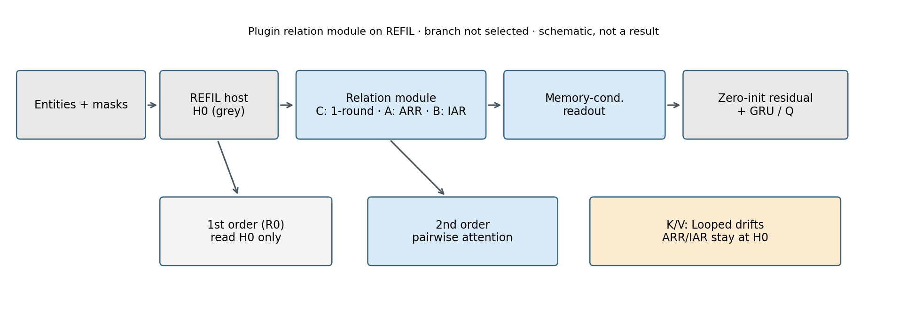
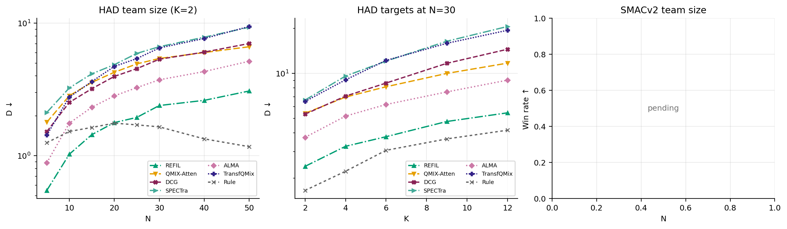
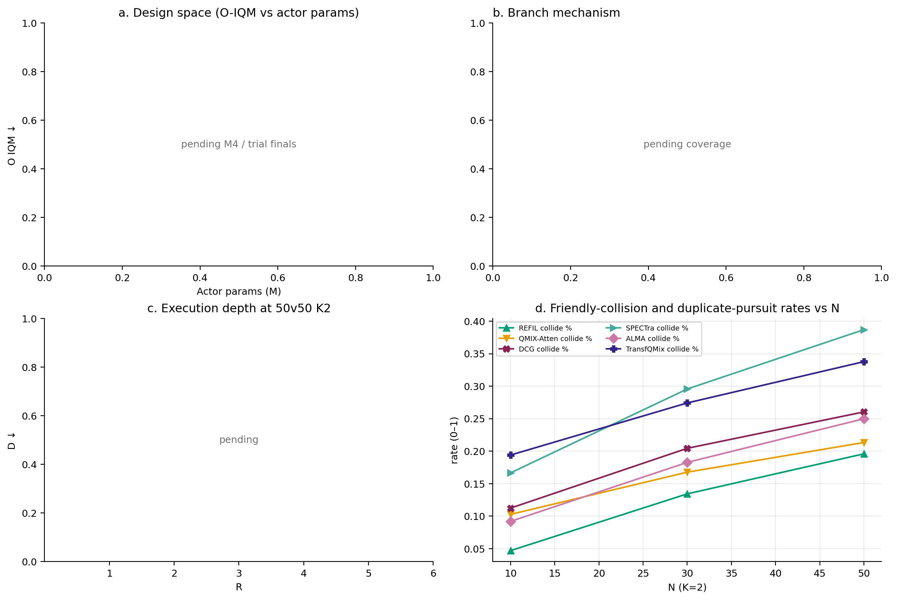

# main0923 论文版（2026-09-24T04:12:27+08:00）

3 图 2 表。主统计量为组内等权后的跨种子 IQM 与分层 bootstrap 95% 区间。缺完整种子的方法不连成曲线；格内显示 —，不插值。

导入基线四组 IQM（3 种子即均值）与 main0921 表 1 三位小数一致。

### 图 1

REFIL 宿主为灰色，关系模块为彩色。图示不是机制实验的证据，不含数值结果。
[PDF](figures/paper_fig1_architecture.pdf) · [PNG](figures/paper_fig1_architecture.png)

### 表 1

HAD：IQM [bootstrap 2.5%, 97.5%]。相对 REFIL 的逐种子胜负只比较双方都完整的重叠种子（通常 0–2），比较量为三个 OOD 组的等权平均 $O$。SMAC 为胜率 IQM。参数来自合格 M4 行。

| 方法 | ID | N-OOD | K-OOD | 联合 OOD | 相对 REFIL $O$ | actor/训练参数 | SMAC 10/15/20/10v15 |
|---|---|---|---|---|---|---|---|
| R0 | — | — | — | — | — | — | — / — / — / — |
| 1-round | — | — | — | — | — | — | — / — / — / — |
| ARR | — | — | — | — | — | — | — / — / — / — |
| IAR | — | — | — | — | — | — | — / — / — / — |
| REFIL | 0.715 [0.489, 0.951] | 2.209 [1.759, 2.795] | 1.796 [1.319, 2.410] | 3.308 [2.502, 4.263] | — | — | — / — / — / — |
| QMIX-Atten | 2.318 [1.053, 3.871] | 5.139 [2.320, 8.322] | 5.009 [2.773, 7.637] | 7.415 [3.656, 11.567] | 0/3 | — | — / — / — / — |
| DCG | 2.028 [1.372, 2.907] | 5.021 [3.082, 8.170] | 5.839 [3.655, 8.729] | 8.092 [4.875, 13.020] | 0/3 | — | — / — / — / — |
| SPECTra | 2.662 [1.950, 3.495] | 6.455 [4.871, 8.689] | 6.933 [5.076, 8.952] | 11.184 [8.234, 14.756] | 0/3 | — | — / — / — / — |
| ALMA | 1.326 [0.844, 1.849] | 3.605 [2.683, 4.740] | 3.022 [2.314, 3.837] | 5.375 [3.921, 7.190] | 0/3 | — | — / — / — / — |
| TransfQMix | 2.157 [1.369, 3.048] | 6.226 [4.700, 8.030] | 6.128 [4.140, 8.823] | 10.597 [7.238, 15.470] | 0/3 | — | — / — / — / — |
| REFIL-matched | 0.914 [0.554, 1.290] | 2.269 [1.827, 2.734] | 2.493 [1.831, 3.138] | 4.170 [2.998, 5.750] | 1/3 | — | — / — / — / — |
| Rule | 1.462（共同参照） | 1.545（共同参照） | 3.212（共同参照） | 3.060（共同参照） | — | — | — |

### 图 2

HAD 用对数纵轴，只画完整方法的 IQM 均值；缺格断开，不插值。SMACv2 胜率在 0–1，用线性轴。配色全文统一。
[PDF](figures/paper_fig2_scale.pdf) · [PNG](figures/paper_fig2_scale.png)

### 表 2

阶梯始终为 R0 → C → A → B，到已选定的主方法为止（未选定时列全阶梯，缺格为 —）。50v50 K2 的相撞率是红方碰撞死亡 / $N_R$（与规划文档一致），重复追击是 `dup_pursuit_frac`；缺字段不填零。

| 方法 | ID | N-OOD | K-OOD | 联合 OOD | 50v50 相撞率 | 50v50 重复追击 |
|---|---|---|---|---|---|---|
| R0 | — | — | — | — | — | — |
| C / 1-round | — | — | — | — | — | — |
| A / ARR | — | — | — | — | — | — |
| B / IAR | — | — | — | — | — | — |

导入基线在同一 50v50 K2 终评上的协同指标（缺 `dup_pursuit_frac` 不填零）：

| 方法 | 50v50 相撞率 | 50v50 重复追击 |
|---|---|---|
| REFIL | 19.6% [16.1%, 23.5%] | — |
| REFIL-matched | 17.8% [14.3%, 22.6%] | — |
| QMIX-Atten | 21.3% [16.9%, 26.3%] | — |
| DCG | 26.0% [18.1%, 35.4%] | — |
| SPECTra | 38.7% [37.0%, 40.4%] | — |
| ALMA | 25.0% [22.0%, 30.0%] | — |
| TransfQMix | 33.8% [30.1%, 39.4%] | — |
| Rule | 8.7%（共同参照） | — |

### 图 3

(a) 设计空间点图需合格 M4 参数与 O-IQM；(b) 随分支切换：A 为 K/V 漂移，B 为意图准确率，C/未选为覆盖探针；(c) 执行深度；(d) 相撞率与重复追击率随 N。任一面板缺完整数据时标为待完成，不画占位曲线。
[PDF](figures/paper_fig3_mechanism.pdf) · [PNG](figures/paper_fig3_mechanism.png)
