# main1009：五种循环方法的结果与故事验证

更新：2026-10-09。D 为目标伤害，越低越好。本报告合并训练验证、离线机制诊断和后续正式评估。

## 交付时结论与完成状态

本节记录本机交付时的研究判断。另一机器生成的新原生结果与完成资格，以后面的自动协议章节和 summary.json 为准；这里的候选优先级不替代 ID 冻结选型。

**新模型确实使用了循环反馈，但额外循环的回报价值与按需加深的价值尚未验证。五个方法必须按各自的故事判断，不能仅按终点奖励或反馈切断后的变化比例排名。**

M2 的双向反馈最贴近最初的关系精炼动机：单独固定反向 K/V 后，实体状态与动作都改变；其训练验证终点也最好，但相对旧 NoMem 的优势不稳定。M3 的低成本读取故事、M4 的实体状态整合故事各有对应证据。M1/M5 的机制同样被使用，现有回报支撑较弱。这是解释重点，不替代冻结的 ID 方法选择规则。

| 工作 | 实际状态 | 能回答的问题 |
|---|---|---|
| 五方法 × 三种子，1M 训练 | 15/15 完成，75,000 条验证记录 | 可训练性、终点与学习过程 |
| 实验 A：深度与反馈切断 | 8,100 个 final observer 快照完成 | 模型是否使用循环及反馈 |
| 实验 B：best/final 配对 | M3/M4 seed 1，共 120 个 best 快照完成 | 终点退化是否伴随统一循环失效 |
| 原生校准、选择、深度评估 | 校准曾启动，因本机两小时边界中断；部分记录保留，未冻结 | 固定深度真实回报、候选与阈值 |
| 自适应、随机预算、反事实、确认 | 尚无结果 | 按需计算与困难状态深轮收益 |

前述离线诊断没有新增训练、优化器更新或环境对局。已从本机 SkyHAD 历史提交 cf26fd4 恢复原 HAD 临时源码，成功导入核对 2.1.0/r7 协议，不安装依赖、不改变物理接口。

用户随后授权完整机制判断和外推评估，并最终明确全部对局在另一台多 GPU 机器执行。本机任务已停止：保留 241 场校准、985/4,860 场原生机制记录，没有冻结选型或阈值，不再在本机继续。原生矩阵为五方法、三个训练种子、六配置各十场，fixed1/2/3/4 加七个专属切断条件。六配置为 `(4,4,2)`、`(10,10,3)`、`(10,10,12)`、`(30,30,2)`、`(50,50,2)`、`(30,30,12)`，覆盖 ID/K/N/Joint 的初步外推；它不替代 24 配置各 300 场正式评估。完整校准、选型、机制、正式外推与反事实均由另一台机器恢复执行。下方自动章节按实际 `loop_records.jsonl` 更新，不把部分运行描述为完成。

## 训练结果与不确定性

每任务完成 50 个验证点，每点四个 ID 配置、各 25 场。场景 9500–9599 在训练中重复使用，75,000 条记录不是独立场景样本。下表“±”为三个训练种子的样本标准差；末五点用于描述波动，不用于替换正式 final。

| 方法 | 最终 D | 末五点平均 D | 全 50 点平均 D |
|---|---:|---:|---:|
| M1：query feedback | 0.5180 ± 0.2450 | 0.5509 | 1.9181 |
| M2：bidirectional | **0.3522 ± 0.0856** | 0.4159 | 1.7128 |
| M3：requery | 0.3938 ± 0.2517 | 0.3763 | 1.5644 |
| M4：entity GRU | 0.4020 ± 0.1304 | **0.3687** | **1.5172** |
| M5：slot GRU | 0.5192 ± 0.1236 | 0.4284 | 1.6144 |
| 0928 NoMem LEAF | 0.3728 ± 0.0662 | 0.6290 | 1.7615 |
| REFIL | 0.7381 ± 0.1225 | 0.7913 | 2.4626 |
| TransfQMix | 2.2962 ± 0.5236 | 2.2340 | 3.9315 |

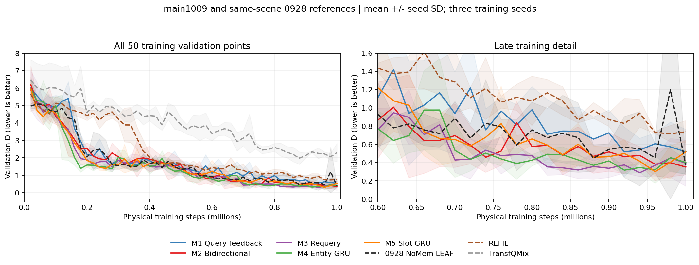

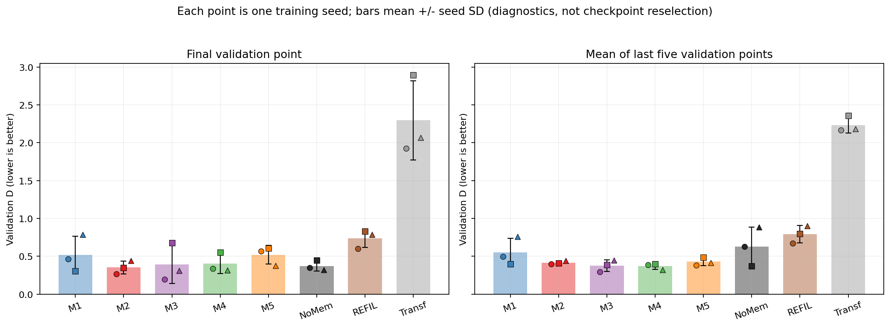

| 方法 | seed 0 最终 D | seed 1 最终 D | seed 2 最终 D |
|---|---:|---:|---:|
| M1 | 0.4653 | 0.3037 | 0.7851 |
| M2 | 0.2684 | 0.3486 | 0.4395 |
| M3 | 0.1947 | 0.6767 | 0.3100 |
| M4 | 0.3388 | 0.5519 | 0.3153 |
| M5 | 0.5704 | 0.6091 | 0.3782 |
| 0928 NoMem | 0.3478 | 0.4479 | 0.3227 |

M2 相对旧 NoMem 最终平均 D 下降 0.0206，约 5.5%。同种子配对改善为 +0.0794、+0.0992、−0.1169；三个训练种子的配对 t 区间约 [−0.2761,+0.3172]。条件于已有三个权重、按 100 个场景聚类的 bootstrap 区间为 [−0.0776,+0.1188]。均跨零，不能宣称稳定超越；场景区间不涵盖全部训练随机性。

M3/M4 的末段和全程表现值得保留。M3 seed 1 第 43 点 D 为 0.2211，终点为 0.6767；M4 seed 1 第 48 点为 0.2283，终点为 0.5519。训练代码先保存 best 权重、再更新进度中的 best_score/best_t_env，因此 best 文件内进度字段仍可能是上一次最优值。这里依据权重实际 t_env 与对应验证记录解释，不能把该滞后的元数据当作保存权重的验证 D。

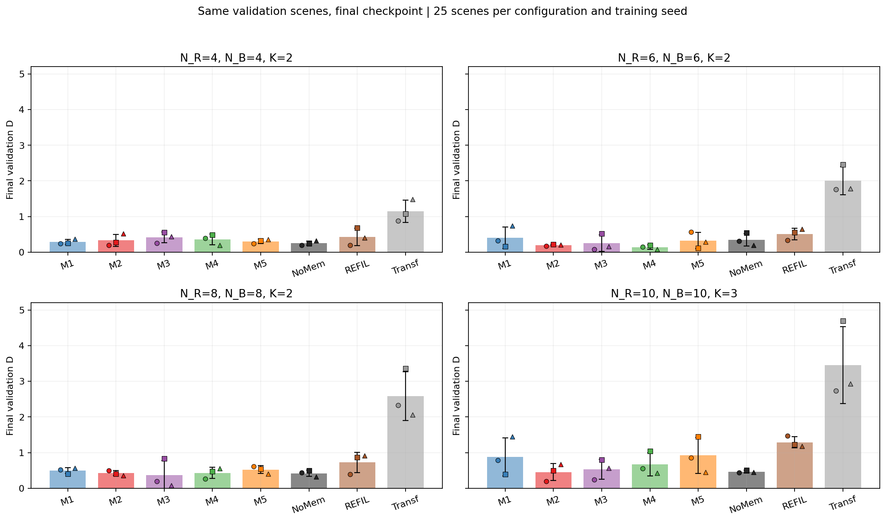

M2 相对旧 NoMem 最大改善在 `(6,6,2)`，`(4,4,2)` 反而恶化，`(8,8,2)` 接近；没有随规模增加的简单收益趋势。新旧场景池、对手和预算匹配，但旧元数据缺明确 HAD 版本，正式跨方法结论仍需同环境重评旧权重。新验证记录无重复，学习记录未发现 NaN/Inf。统计与场景配对见 [validation_analysis.json](had/validation_analysis.json)。

## 离线实验的语义与统计单位

实验 A 使用旧 LEAF standard 的 90 条完整轨迹：三个旧行为种子、三个配置、各十个场景。15 个新 final 权重处理同样物理前缀，取步数 0/5/10 的前两个存活 observer，每权重 540 个快照，共 8,100 个。实验 B 为 M3/M4 seed 1 的 best 各增加 60 个配对快照。

新模型从零 hidden 开始，以自身 fixed4 重算历史，上一动作使用保存轨迹真实动作。当前所有深度与切断条件从同一进入 hidden 出发，结束只提交原始 fixed4 状态一次。不复用旧模型 hidden，不把旧回报当成新模型回报。因此这是共享旧行为状态分布上的冻结策略敏感性实验，不是新模型闭环回报测试。

observer、步数与旧行为种子是重复测量；按配置加场景聚类，主矩阵有 30 个场景簇，三个新训练种子分别保存。条件 bootstrap 不能把 8,100 个快照当独立样本。诊断重构与原 fixed4 的最大误差为 Q=4.05e−6、hidden=2.65e−6；8,220 条 observer 记录无重复、无非有限值。原始记录 [mechanism_records.jsonl](had/mechanism_records.jsonl)，分种子与分配置汇总 [mechanism_analysis.json](had/mechanism_analysis.json)。

## 深度诊断：改变决策不等于改善决策

| 方法 | 一轮与四轮动作不同 | 二轮与四轮动作不同 | 三轮与四轮动作不同 | 二轮与四轮 hidden 相对差 |
|---|---:|---:|---:|---:|
| M1 | 35.00% | 22.65% | 11.23% | 0.2606 |
| M2 | 39.51% | 27.90% | 13.83% | 0.2500 |
| M3 | 14.69% | 6.17% | 2.53% | 0.0753 |
| M4 | 40.74% | 26.11% | 13.95% | 0.2812 |
| M5 | 23.27% | 12.35% | 5.80% | 0.1143 |

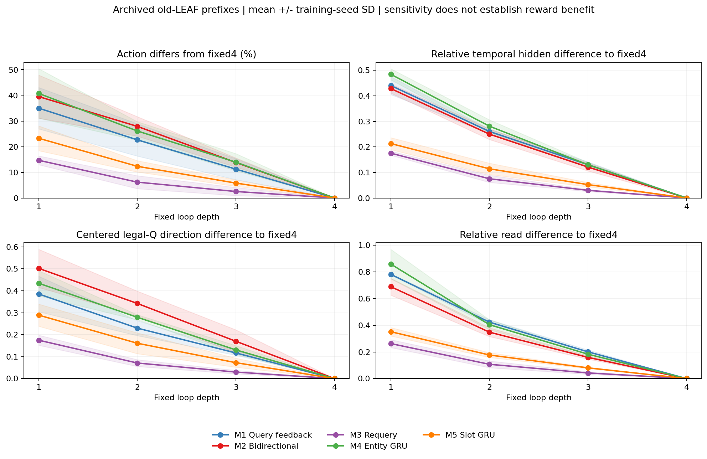

M1/M2/M4 二轮与四轮仍有较多差异，额外轮次并非完全重复计算。M3 更早产生相似决策，但 query 门与位移没有消失。四轮对自身的零差异是恒等关系，不能证明收敛；深浅动作相同也不代表提交 hidden 相同。

## 五种故事对应的反馈切断

切断保留原计算调用，只覆盖指定通路。合法中心化 Q 单位方向变化排除共同偏置，hidden 差描述状态变化，均不等于奖励。

| 方法与切断 | 动作改变 | Q 方向变化 | 时序 hidden 相对差 | 循环 memory 相对差 |
|---|---:|---:|---:|---:|
| M1：计算 query 更新后覆盖为上一轮 query | 13.64% | 0.1537 | 0.1961 | 0.0000 |
| M2：冻结 query 更新 | 21.79% | 0.2495 | 0.2139 | 0.2241 |
| M2：仅将反向 K/V 中 query 固定为初始 b0 | **15.19%** | 0.1789 | 0.1523 | **0.2241** |
| M3：冻结 query 更新 | 14.69% | 0.1749 | 0.1756 | 0.0000 |
| M4：entity GRU hidden 使用初始实体状态 | **57.16%** | 0.6455 | 0.6557 | 0.9315 |
| M5：slot GRU hidden 使用初始 slots | 25.62% | 0.3201 | 0.2268 | 0.5820 |
| M5：竞争归一化改为每 slot 独立实体归一化 | **30.25%** | 0.4109 | 0.3803 | 0.6137 |

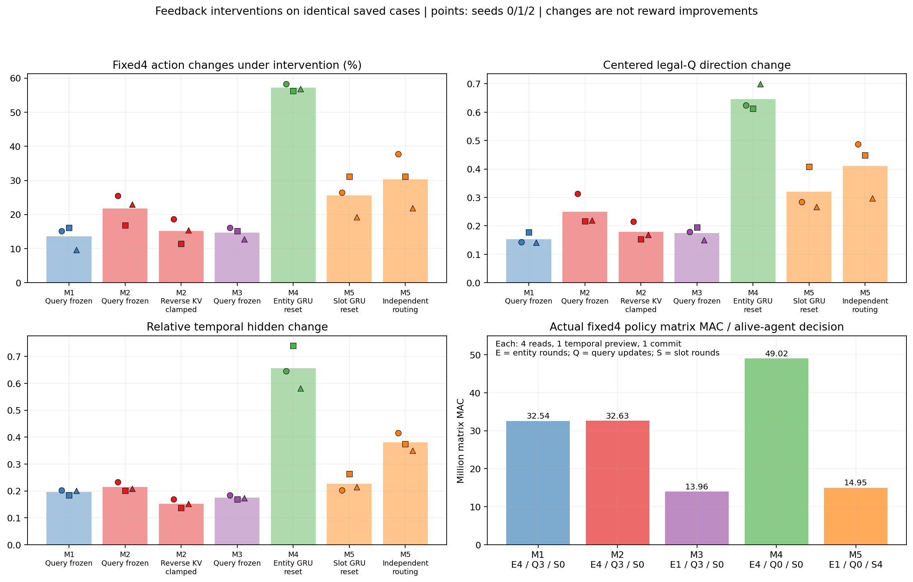

M2 专属反向切断保留 reader query 正常更新，直接对应读后反向改变实体。query 冻结同时影响后续反向通路，不能用 21.79%−15.19% 当作另一方向的独立贡献。M4/M5 hidden 重置保留当前注意力消息，消息仍依赖上一轮状态，只隔离 GRU 的直接承接。M5 独立归一化保持 K/V、GRU 和 FFN，不是从头训练的普通 cross-attention 对照。切断可能产生分布外破坏，不能以敏感性大小排名算法质量。

### M1：读取引导的私有 query 修正

故事为“本轮读取更新下一轮 query，使后续读取依赖已获上下文”。冻结 query 改变 13.64% 动作，机制对应成立；实体 memory 不依赖私有 query，零差异是预期。最终 D=0.5180、种子波动大。若正式结果仅支持一轮到二轮，应讲有限步修正。暂作单向反馈参考。

### M2：观察者条件的双向关系精炼

故事为“query 读取上下文，再通过反向 K/V 改变下一轮实体表示，形成闭环”。专属切断同时改变实体、读取与动作，五者中最贴近原动机；query 只属于当前 observer，不是跨智能体通信。终点优势不稳定，建议优先验证 M2，不能宣布已赢。需看二轮到四轮真实收益、物理竞争更高时的加深收益，以及自适应对同 MAC 随机深度的优势。

### M3：固定上下文上的低成本迭代读取

故事为“上下文编码一次，query 反复读取缓存 K/V，低成本修正决策”。冻结 query 改变 14.69% 动作，但三轮与四轮仅 2.53% 不同，更接近有限步修正及提前稳定。完整 fixed4 每决策矩阵 MAC=13.96M，约为 M1 的 42.9%。这证明结构成本优势，尚不证明同回报优势。若浅出口保持回报，可主打效率；若困难状态有二轮到四轮收益，再讲按需加深。query 位移不等于深轮奖励价值。

### M4：实体状态的逐轮证据整合

故事为“共享 GRU 承接实体状态与注意力消息，逐轮整合关系证据”。重置直接承接改变 57.16% 动作，三个训练种子均敏感，学习全程和末五点 D 也最好。代价为每决策 49.02M MAC，五者最高，且 final 存在退化。主线必须证明深轮收益足以支持成本，不能以更大 hidden 差或 best 替换 final 代替奖励证据。

### M5：竞争式 slots 的迭代聚合

故事为“有限 slots 竞争吸收实体信息，通过 slot GRU 逐轮整合”。状态承接与竞争规则分别改变 25.62%/30.25% 动作，两项专属机制都被使用。

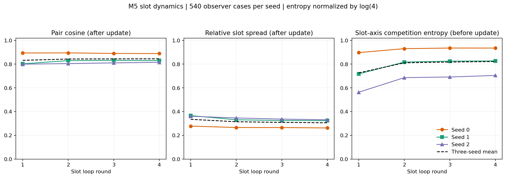

终轮 slots 平均 cosine=0.845、中心化相对 spread=0.306，更新前竞争熵=0.822（按 log4 归一化），三个训练种子熵为 0.936/0.827/0.705。首轮到末轮竞争熵由 0.726 升至 0.822，spread 由 0.335 降至 0.306，不支持“逐轮分工越来越尖锐”。非零表示差异不等于物理角色或目标分工，也不能排除功能冗余。熵来自更新前，几何来自更新后，不能误作同一时刻的因果关系。fixed4 MAC=14.95M 有成本优势，但最终 D=0.5192，三个种子均未超过对应旧 NoMem，暂不优先。前置实体编码仍含全连接注意力，不能宣称整个模型随实体数线性扩展。

## 计算成本与终点退化

MAC 来自真实完整 fixed4 policy，每方法同样 21,117 个存活智能体决策、50 agent/112 entity padding，包含局部编码和一次最终时序 head，不含诊断多出口 preview。仅计矩阵乘加，不是全部 FLOPs、延迟或对局耗时。

| 方法 | fixed4 MAC / 决策 | 每决策循环调用 |
|---|---:|---|
| M1 | 32.54M | 实体处理 4、读取 4、query 更新 3 |
| M2 | 32.63M | 实体处理 4、读取 4、query 更新 3 |
| M3 | 13.96M | 实体处理 1、读取 4、query 更新 3 |
| M4 | 49.02M | 实体 GRU 4、读取 4 |
| M5 | 14.95M | 实体处理 1、slot 轮次 4、读取 4 |

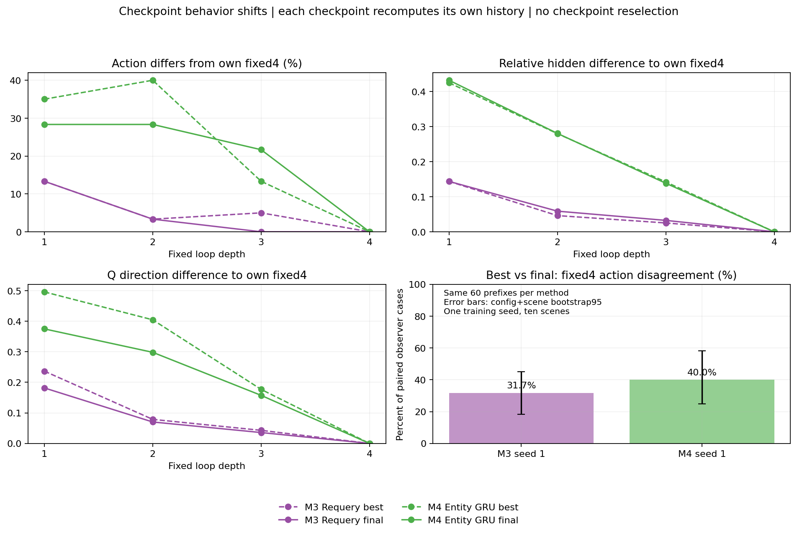

best/final 同 60 个快照四轮动作差：M3=31.67%，M4=40.00%；十场景聚类条件区间分别为 [18.33%,45.00%]、[25.00%,58.33%]。M3 二轮与四轮动作差在 best/final 均为 3.33%；M4 从 40.00% 降为 28.33%，但三轮与四轮差从 13.33% 升到 21.67%。没有统一“循环失效导致退化”的模式。各 checkpoint 重算自己的历史，差异包含权重及自身历史；不能据此指定原因或触发训练扫描。

## 故事匹配与正式验证

| 方法 | 已有对应证据 | 核心缺口 | 当前定位 |
|---|---|---|---|
| M1 | query 反馈改变读取与动作 | 稳定回报收益，尤其二轮后 | 单向反馈参考 |
| M2 | 独立反向通路改变实体与动作；终点有候选优势 | 深轮奖励与自适应针对性 | **原始动机首要候选** |
| M3 | query 循环被使用、计算明显更低 | 同回报省算、困难状态加深价值 | **效率故事首要候选** |
| M4 | 实体承接强依赖、学习过程较好 | 成本对应价值、final 稳定性 | **状态整合首要候选** |
| M5 | 竞争及 slot 承接均被使用，未完全塌缩 | 回报优势与物理分组解释 | 公开保留，暂不优先 |

每轮全连接注意力已经接触所有观测实体，不能讲“更多轮才能看到更远实体”。共同待验证解释是：**读取或聚合更新本步内部状态，再处理实体关系和竞争，需要继续修正的决策获得更多计算。**

循环关系状态有 [Recurrent Relational Networks](https://arxiv.org/abs/1711.08028) 的先例；潜在状态迭代读取可参照 [Perceiver](https://arxiv.org/abs/2103.03206)；竞争式 slots 与 GRU 来自 [Slot Attention](https://arxiv.org/abs/2006.15055) 的设计思想。文献支持可检验设计，不保证 HAD 奖励改善。共享参数、门控、slots 本身不能单独当作创新性结论。

相对 [Set Transformer](https://arxiv.org/abs/1810.00825) 与 [TransfQMix](https://arxiv.org/abs/2301.05334)，区别应落在本步反馈如何改变下一轮计算、哪些状态值得继续计算，而非笼统声称处理实体集合。Set Transformer 同预算训练与单轮从头训练对照仍缺失；同权重浅出口不能替代它们。本轮不新增训练。

先执行冻结校准 21,600 场、独立 ID 选择 36,000 场；之后反事实可前移，以尽早判断二轮到四轮的单决策总效应，再完成正式固定深度、旧基线重评、自适应/随机及确认。只按预定 ID 协议锁方法与阈值，不用 OOD 重排，不增加配额。操作说明见[现有指南](../../../docs/LEAF_main1009_循环候选与远端指南.md)。

反事实只改变一个 observer 当前深度，其他及未来均四轮；动作和提交 hidden 同时改变，尾段 D 差是本次深度选择的总效应。运行器新增读取已有缓存的 Q、动作及 hidden 差异，不增加 forward 或环境步。物理指标区分 physical_alive_count 与 observed_entity_count；旧 visible_count 保留兼容，实际接近物理存活数，观测仍保留 target slots。物理竞争、距离与威胁在同 N/K、快照步数内分层；Q 不稳定不能充当独立难度指标。

| 命题 | 当前结论 | 正式阶段的证据要求 |
|---|---|---|
| 反馈被模型使用 | **支持**，五种方法各有对应切断 | 与回报联合解释，敏感性不等于奖励贡献 |
| 额外循环有回报价值 | **证据不足** | 固定深度及原生反事实，尤其 D2−D4、跨种子一致性 |
| 深度分配具有针对性 | **证据不足** | 困难物理状态加深收益更大；自适应优于同实际 MAC 随机 |

原 qualified 的“容差内省 MAC”只支持部署效率，不自动证明按需分配。深轮及针对性均成立，可讲“反馈循环关系精炼与按需计算”；只有深轮收益，聚焦精炼；只有一轮到二轮收益，聚焦有限步修正；深轮无可靠收益，原循环动机未验证，性能解释回到上下文处理与 NoMem。五方法全结果公开。

<!-- leaf1009_loop_candidates_v2 -->

## 五个循环候选：正式协议与实际记录

训练预算为每方法 1M 物理步，种子 0/1/2。正式 checkpoint 为 final；校准、选择、正式评估和确认使用独立场景。
以下仅列实际数据；冻结阈值只使用 ID 校准池。随机深度独立于当前状态，按实际 MAC 计数匹配，无法匹配时明确标识。

episode_wall_seconds 记录正常对局的墙钟耗时，包含环境与诊断开销，不代表纯网络推理测速；没有额外性能探测或对局配额。

| 方法 | 保留 final checkpoint 文件 | 记录数 |
|---|---:|---:|
| regir_loop_nomem | 3/3（文件存在，完成资格以训练进度为准） | 1128 |
| regir_bidirectional_nomem | 3/3（文件存在，完成资格以训练进度为准） | 98 |
| regir_requery_nomem | 3/3（文件存在，完成资格以训练进度为准） | 0 |
| regir_entitygru_nomem | 3/3（文件存在，完成资格以训练进度为准） | 0 |
| regir_slotgru_nomem | 3/3（文件存在，完成资格以训练进度为准） | 0 |

结果按 method、split、arm、checkpoint、config、seed 汇总；缺额数据保留为部分结果。
完整配置级数据见 [loop_summary.csv](loop_summary.csv)，逐场景计算与回报见 [loop_records.jsonl](loop_records.jsonl)。

| Split | 方法 | Arm | Checkpoint | 配置 | 已完成种子 | 配置等权奖励均值 | MAC 均值 |
|---|---|---|---|---|---:|---:|

### 原生奖励机制与初步外推

已完成 985/4860 个完整 episode；全部完成=False。仅使用三个冻结 final 权重，每配置十个配对物理场景。六配置外推用于机制判断，不能代替正式 24 配置、每配置 300 场的外推比较或 ID 方法选择。
以下差值均以 D 为单位：深度收益为 D浅−D四，反馈损失为 D切断−D正常四轮。配置等权、训练种子分别公开；t95 使用三个种子均值（df=2），另提供按配置分层、同场景联合三个权重的 2000 次聚类 bootstrap95。正差代表四轮或正常反馈更好。
支持要求完整配额、均值至少达到 δ=max(0.01,0.02×参考D)、两个区间下界均大于零、至少两个种子为正且第三个不显著反向。宽区间保留为证据不足。
| 方法 | 原生记录 | R1→R4 | R2→R4 | 反馈奖励证据 | R2非劣且节省MAC |
|---|---:|---|---|---|---|
| M1 | 887/900 | 证据不足 | 证据不足 | query_update_frozen: 证据不足 | 证据不足 |
| M2 | 98/1080 | 证据不足 | 证据不足 | query_update_frozen: 证据不足; reverse_kv_clamp: 证据不足 | 证据不足 |
| M3 | 0/900 | 证据不足 | 证据不足 | query_update_frozen: 证据不足 | 证据不足 |
| M4 | 0/900 | 证据不足 | 证据不足 | entity_gru_hidden_reset: 证据不足 | 证据不足 |
| M5 | 0/1080 | 证据不足 | 证据不足 | slot_gru_hidden_reset: 证据不足; slot_competition_removed: 证据不足 | 证据不足 |

| 方法 | 配对比较 | 配置覆盖 | 差值均值±seed SD | seed 0/1/2 | seed t95 | 场景聚类95 |
|---|---|---:|---:|---|---|---|
| M1 | R1_to_R4 | 5/6 | +0.5428±0.4936 | -0.0188/+0.7393/+0.9078 | [-0.6834, +1.7690] | [+0.2505, +0.8610] |
| M1 | R2_to_R4 | 5/6 | -0.2819±0.3648 | -0.4569/+0.1374/-0.5262 | [-1.1880, +0.6242] | [-0.5356, -0.0089] |
| M1 | R3_to_R4 | 5/6 | -0.2096±0.3776 | +0.1702/-0.2141/-0.5849 | [-1.1475, +0.7283] | [-0.5254, +0.0889] |
| M1 | R1_to_R2 | 5/6 | +0.8247±0.5341 | +0.4380/+0.6020/+1.4341 | [-0.5020, +2.1514] | [+0.5187, +1.1396] |
| M1 | query_update_frozen | 5/6 | +0.0954±0.3487 | +0.4909/-0.0370/-0.1678 | [-0.7710, +0.9617] | [-0.2776, +0.4445] |

M2 的 reverse_kv_clamp 单独检验反向 query→实体通路；不能用两个切断差值相减拆分贡献。M4/M5 hidden reset 仅去掉直接状态承接，保留迭代注意力/路由。M5 competition removed 检验当前竞争归一化，不能自动证明对象分组。
实际 matrix MAC/decision 来自完整在线策略的矩阵调用；尾段长度和存活状态可能随策略改变，MAC 不代表纯推理速度。全局状态反馈敏感性不能替代奖励贡献。自适应按需计算仍需正式 adaptive 对预算匹配 random 与单决策反事实。
完整配置、种子和路径统计保存在 [summary.json](summary.json) 的 native_mechanism_analysis。

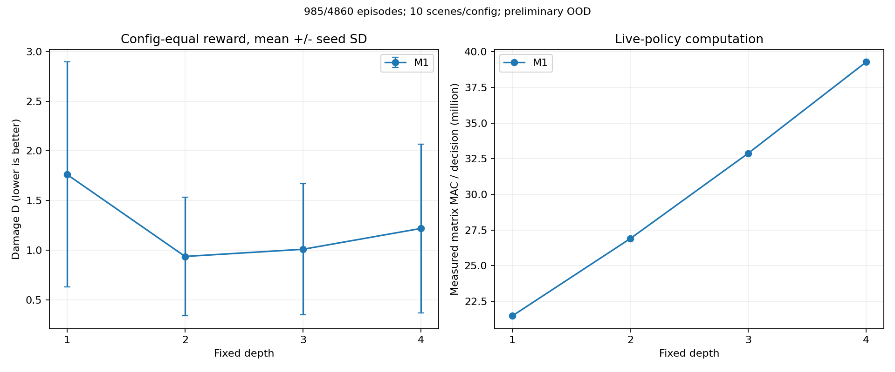

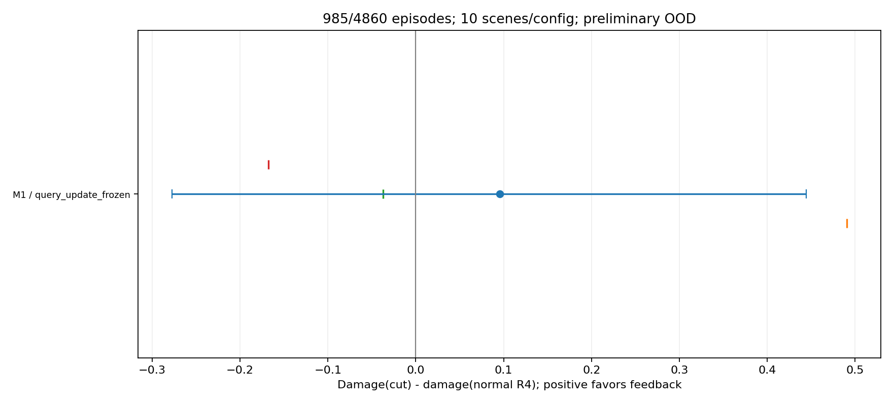

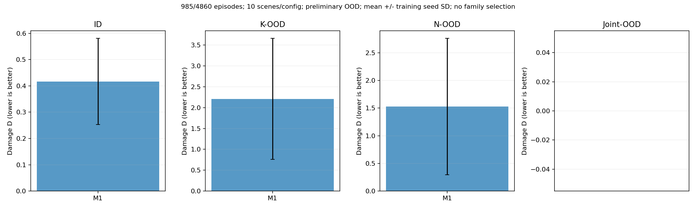

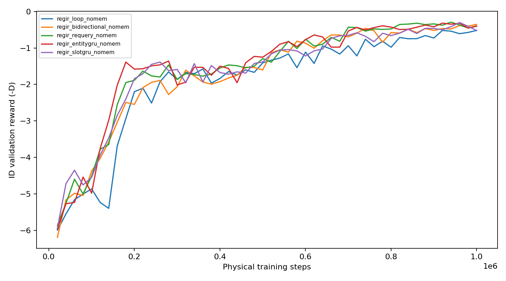

停机的价值由 adaptive 对 fixed4 的真实回报与计算节省、以及对实际预算匹配 random 的优势判断。
counterfactual 单决策收益只提供归因证据；decision stability 和动作一致性不直接证明回报收益。无合格方法时保留 performance best 并标记 loop_unverified。
