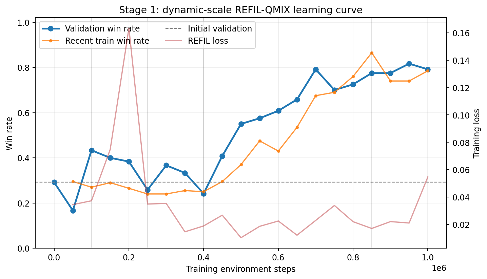
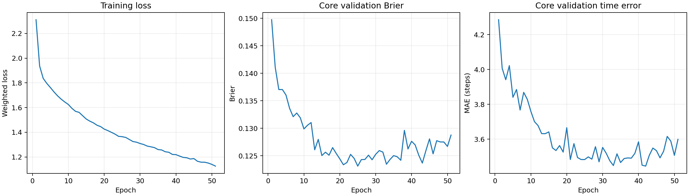

# Open-SCORE 第一轮 Stage 1 / Stage 2 完整实验报告

> 合并生成时间：`2026-09-01T17:58:22+08:00`
> 第一轮结论：**通过**
> Stage 1：**通过**；Stage 2最终版：**通过**
> 本文是第一轮唯一正式报告。原胜率二分类器属于先导实现，以下Stage 2结果均以补全后的“胜率+剩余时间”联合模型为准。

## 1. 第一轮到底完成了什么

Stage 1在HAD中只训练Red防御方，Blue固定为`rush`或`split_rush`规则策略。一套REFIL-QMIX（HAD适配）权重用100万环境步学习动态人数决策。Stage 1冻结后，Stage 2从其推演轨迹采集全局态势，用一个不限制实体数量的Deep Sets网络同时预测Red最终胜率和距离胜利/失败还剩多少步。

因此第一轮的最终交付不是两轮实验，而是一条连续流程：`动态规模策略训练 → 冻结策略测试 → 扩展规模压力测试 → 胜率/剩余时间监督学习 → 统一评估与报告`。

## 2. Stage 1：动态规模决策策略

- 算法：`REFIL-QMIX-HAD-adaptation`，参数量 `302,749`。
- 训练种子：`20260831`；环境步 `1,000,123`；完成 `41,072` 局；用时 `15.06` 小时。
- Validation由初始 29.2% 提升到最佳 81.7%；最佳点位于 `950,120` 步。
- 最佳权重在1200局全新种子Test中的胜率为 **82.08%**，平均零和收益 `0.6417`。

### 2.1 课程规模独立测试

| 规模 | rush | split_rush | 合并胜率 | 95%区间 | 局数 |
|---|---:|---:|---:|---:|---:|
| 2v1 | 93.0% | 91.0% | 92.0% | 87.4%–95.0% | 200 |
| 3v1 | 95.0% | 96.0% | 95.5% | 91.7%–97.6% | 200 |
| 3v2 | 74.0% | 66.0% | 70.0% | 63.3%–75.9% | 200 |
| 4v1 | 96.0% | 97.0% | 96.5% | 93.0%–98.3% | 200 |
| 4v2 | 88.0% | 80.0% | 84.0% | 78.3%–88.4% | 200 |
| 4v3 | 55.0% | 54.0% | 54.5% | 47.6%–61.3% | 200 |

### 2.2 冻结策略的训练外人数压力测试

这些测试不继续训练或调参，每个规模对两类规则对手各100局。它们是第一轮追加的泛化证据，但仍是单训练种子、事后选定规模。

| 训练外规模 | rush | split_rush | 合并胜率 | 95%区间 | 局数 |
|---|---:|---:|---:|---:|---:|
| 2v2 | 56.0% | 44.0% | 50.0% | 43.1%–56.9% | 200 |
| 3v3 | 41.0% | 36.0% | 38.5% | 32.0%–45.4% | 200 |
| 5v2 | 83.0% | 80.0% | 81.5% | 75.5%–86.3% | 200 |
| 5v3 | 62.0% | 67.0% | 64.5% | 57.7%–70.8% | 200 |
| 6v3 | 73.0% | 69.0% | 71.0% | 64.4%–76.8% | 200 |

### 2.3 Stage 1验收

| 门槛 | 结果 |
|---|---:|
| 至少100万环境步 | 通过 |
| 六种课程规模均参与训练 | 通过 |
| 最佳验证胜率比初始至少提高0.15 | 通过 |
| 至少五种规模提高 | 通过 |
| 最佳权重完成1200局独立评估 | 通过 |

## 3. Stage 2最终版：任意规模胜率与剩余时间评估器

Stage 2最终数据共 `10,020` 局、`50,826` 个态势。核心规模2v1至4v4使用每局1.0训练权重；5至6人扩展规模使用0.25低权重；5v1、6v3和7v3权重为0，完全不进入训练或选模。这样优先保护常用小规模效果，同时检验更大人数的接口与零样本泛化。

### 3.1 输入、输出与方法

输入由目标状态8维、任意行数Red实体表、任意行数Blue实体表和上下文5维组成。每个实体9维，包含相对位置、相对速度、生命值、存活与存在标记。批内只临时补齐到该批最大人数，并用mask排除补位，因此没有业务人数上限。

网络采用[Deep Sets](https://papers.nips.cc/paper/2017/hash/f22e4747da1aa27e363d86d40ff442fe-Abstract.html)共享实体编码，并借鉴[DeepHit](https://ojs.aaai.org/index.php/AAAI/article/view/11842)的离散竞争风险思想输出20个联合概率：10个Red在各时间段获胜的概率和10个Blue获胜概率，每段5步。由此同时得到Red胜率、预计剩余步数、Red胜时剩余步数和Blue胜时剩余步数。本项目只是借鉴DeepHit式联合分布目标，不声称逐行复现DeepHit。

模型参数量 `58,708`；最佳epoch `33`，运行 `51` 个epoch后提前停止；温度校准参数 `1.273`；保存后重载最大预测差 `0`。

### 3.2 总体测试结果

| 测试范围 | 局数 | Brier↓ | AUC↑ | 剩余时间MAE↓ | 条件胜负时间MAE↓ |
|---|---:|---:|---:|---:|---:|
| 核心规模Test | 1,080 | 0.1127 | 0.9107 | 3.47步 | 3.13步 |
| 低权重扩展Test | 288 | 0.1634 | 0.8475 | 3.93步 | 3.69步 |
| 完全留出规模 | 900 | 0.1134 | 0.8576 | 3.25步 | 3.06步 |

核心固定胜率基线Brier为 `0.2210`，模型为 `0.1127`；固定中位时间基线MAE为 `7.11` 步，模型为 `3.47` 步。核心分规模初始胜率平均绝对误差为 `3.71%`。

### 3.3 所有规模的胜率与时间

| 规模 | 数据角色 | 局数 | 真实Red胜率 | 预测Red胜率 | 胜率误差 | 时间MAE | Red胜时MAE | Blue胜时MAE |
|---|---|---:|---:|---:|---:|---:|---:|---:|
| 2v1 | 核心 | 120 | 94.8% | 96.6% | 1.8% | 2.28步 | 1.80 | 1.87 |
| 2v2 | 核心 | 120 | 52.0% | 56.2% | 4.1% | 4.27步 | 4.15 | 3.50 |
| 3v1 | 核心 | 120 | 98.5% | 97.3% | 1.2% | 2.23步 | 2.09 | 2.81 |
| 3v2 | 核心 | 120 | 78.3% | 71.6% | 6.7% | 4.43步 | 3.72 | 3.93 |
| 3v3 | 核心 | 120 | 34.1% | 42.3% | 8.1% | 3.88步 | 3.91 | 3.59 |
| 4v1 | 核心 | 120 | 97.9% | 97.4% | 0.4% | 2.31步 | 1.97 | 4.53 |
| 4v2 | 核心 | 120 | 85.3% | 81.0% | 4.3% | 3.81步 | 3.53 | 2.60 |
| 4v3 | 核心 | 120 | 55.5% | 57.3% | 1.8% | 3.66步 | 3.84 | 2.97 |
| 4v4 | 核心 | 120 | 24.8% | 29.8% | 5.0% | 4.37步 | 5.22 | 3.71 |
| 5v1 | 完全留出 | 300 | 98.7% | 97.3% | 1.5% | 2.51步 | 2.38 | 2.52 |
| 5v2 | 低权重 | 36 | 78.0% | 84.3% | 6.3% | 3.97步 | 3.95 | 2.74 |
| 5v3 | 低权重 | 36 | 74.0% | 71.1% | 2.8% | 2.99步 | 2.91 | 3.16 |
| 5v4 | 低权重 | 36 | 37.3% | 40.8% | 3.6% | 4.64步 | 6.47 | 3.41 |
| 5v5 | 低权重 | 36 | 13.5% | 23.7% | 10.1% | 4.62步 | 5.17 | 4.39 |
| 6v2 | 低权重 | 36 | 79.9% | 87.8% | 7.8% | 3.80步 | 3.47 | 2.29 |
| 6v3 | 完全留出 | 300 | 66.2% | 74.6% | 8.4% | 3.77步 | 3.58 | 3.29 |
| 6v4 | 低权重 | 36 | 34.3% | 52.8% | 18.4% | 3.79步 | 3.80 | 3.74 |
| 6v5 | 低权重 | 36 | 18.7% | 28.7% | 9.9% | 3.31步 | 3.17 | 2.77 |
| 6v6 | 低权重 | 36 | 17.0% | 17.0% | 0.0% | 4.31步 | 5.55 | 3.41 |
| 7v3 | 完全留出 | 300 | 80.0% | 79.5% | 0.5% | 3.48步 | 3.48 | 2.79 |

### 3.4 Stage 2最终验收

| 门槛 | 结果 |
|---|---:|
| 核心Brier | 通过 |
| 核心AUC | 通过 |
| 核心剩余时间MAE | 通过 |
| 核心分规模胜率误差 | 通过 |
| 四项全部满足 | **通过** |

## 4. 第一轮最终价值与限制

1. 得到一套单权重、动态人数的REFIL-QMIX Red策略，并完成100万步训练与独立Test。
2. 冻结策略可直接运行训练外人数；均衡对抗仍更困难，不能把单种子压力测试当作算法优越性证明。
3. 得到一个不设固定人数上限的Stage 2联合评估器，核心Test AUC、概率误差和剩余时间误差均通过门槛。
4. 5v1、6v3、7v3完全留出；其中6v3胜率误差较大。低权重6v4误差也明显，是后续扩充数据或比较Set Transformer的重点。
5. 当前仍只有一个Stage 1训练种子和两类规则对手；跨种子稳定性、学习型Blue对手以及S3/S4不属于第一轮结论。

## 5. 第一轮唯一结果入口

- `stage1/summary.json`与`stage1/training_curves.csv`：Stage 1训练证据。
- `evaluation/`与`evaluation_unseen_scales/`：冻结策略正式与压力测试。
- `stage2/final/data/dataset_manifest.json`：Stage 2最终数据规模、权重与哈希。
- `stage2/final/model/dynamic_outcome_time_model.pt`：Stage 2最终模型。
- `stage2/final/model/metrics.json`：全部指标和分规模结果。
- `stage2/final/figures/`：Stage 2最终图表。
- `results_index.json`：第一轮正式与先导产物的路径、大小和SHA256索引。
- `stage2/preliminary/`：旧胜率二分类先导产物，仅供审计，不用于本报告结论。

Stage 1检查点SHA256：`15e861b770e9339f530386ebc6674d020686b1771697aa7aa8fff4c74ed6e355`。Stage 2数据SHA256：`1518ac6b14995a25c474dd354cb82ee3310968f417ba26760e24495ff9b65692`。Stage 2模型SHA256：`631871dbae6220a9981b089dd8557dfc90eb7468268e8d3067a57675c80f700b`。
