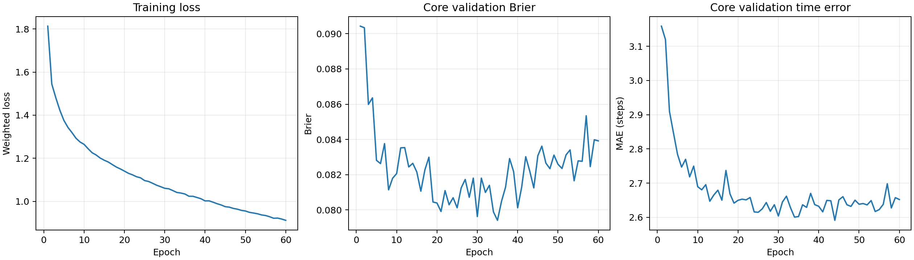

# s1_s2 实验报告

本报告合并该版本主要结果与局限。不同运行和开局不混合统计胜率。所有原始数据、配置、历史详细分析已归并到各方法的 data.sqlite，不再外置每次验证的重复报告。

## 2026-08-31—2026-09-01：S1 局部策略与 S2 局部评价器

**问题与方法。**先学习单目标局部交战，再学习预测其成功率和剩余终局时间。红方底层为 REFIL-QMIX 学习策略，蓝方为规则策略；S2 数据中的红方策略冻结。

| 项目 | 实际记录 |
|---|---|
| S1 训练 | 1,000,123 步 |
| S1 独立测试 | 1,200 局，成功率约 82.1% |
| S2 数据 | 19,200 局、101,366 个状态 |
| S2 概率预测 | Brier 0.0757、ECE 0.0073 |
| S2 剩余时间预测 | MAE 2.69 个物理步 |

**结论与限制。**S2 在其原分布有局部预测能力。数据为单目标、双方各 1～4 人，没有完整重新编组反事实；不能据此声称能够评价新规则底层、双目标和 32 人任务。困难人数配比误差更大，总体平均不能代表全部情形。

证据：历史 S1/S2 报告。历史模型只用于明确标注的迁移对照。

## s1_s2_report.md

# S1 / S2 historical results

Excerpt from Git f1cdc06, S1/S2 only. These are historical results, not v3 results.

S1 training curve | S1 scale win rates

## Stage1：冻结局部控制器

REFIL-QMIX-HAD adaptation，单训练种子 `20260831`，1,000,123 环境步。验证胜率 29.2% → 81.7%；独立测试 1,200 局，总胜率 82.1%。

| 局部规模 | rush | split_rush |
|---|---:|---:|
| 2v1 | 93.0% | 91.0% |
| 3v1 | 95.0% | 96.0% |
| 3v2 | 74.0% | 66.0% |
| 4v1 | 96.0% | 97.0% |
| 4v2 | 88.0% | 80.0% |
| 4v3 | 55.0% | 54.0% |

训练外规模的事后压力测试（没有微调）：

| 规模 | rush | split_rush | 合并胜率 |
|---|---:|---:|---:|
| 2v2 | 56.0% | 44.0% | 50.0% |
| 3v3 | 41.0% | 36.0% | 38.5% |
| 5v2 | 83.0% | 80.0% | 81.5% |
| 5v3 | 62.0% | 67.0% | 64.5% |
| 6v3 | 73.0% | 69.0% | 71.0% |

5v2/5v3/6v3 仅为历史泛化证据，不进入本轮 4v4 上层动作域。现存 Stage1 没有同协议其他算法对照，因此只报告内部训练与规模分析，不虚构算法优势。原已删除的泛化原始证据从 Git 历史恢复，来源见 manifest。

## Stage2：冻结的联合胜负与时间模型

正式数据共 19,200 局、101,366 个状态，覆盖全部 1–4 × 1–4 配比；按局划分，保留本地 JSONL，不重新采集或训练 Stage2。

| 方法/测试切片 | Brier↓ | ECE↓ | 时间 MAE（步）↓ |
|---|---:|---:|---:|
| 联合模型：全部状态 | 0.0757 | 0.0073 | 2.69 |
| 联合模型：初始状态 | 0.0839 | 0.0183 | 3.24 |
| 联合模型：轨迹状态 | 0.0733 | 0.0083 | 2.53 |
| 训练集常数胜率 / 中位时间基线 | 0.2425 | — | 6.90 |

Stage2 的概率与时间误差是本阶段的必要指标，不受 Stage3 正文四类指标限制。总体校准不能替代困难配比或新分组反事实上的校准。

| 困难单元（按 Brier 降序） | Brier↓ | ECE↓ | 时间 MAE↓ |
|---|---:|---:|---:|
| 2v2 | 0.2479 | 0.1002 | 4.47 |
| 4v3 | 0.2387 | 0.0866 | 3.95 |
| 3v3 | 0.2019 | 0.0427 | 3.80 |
| 3v2 | 0.1720 | 0.1154 | 4.86 |

[Stage2 训练曲线]

[Stage2 校准]

## 保留图片

