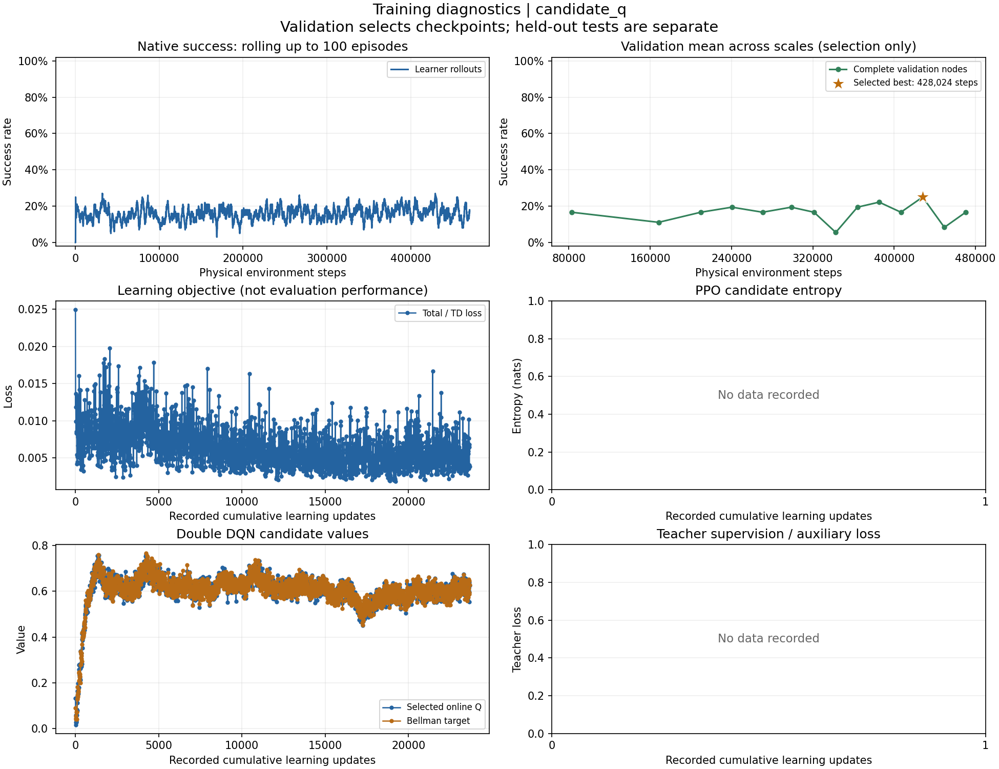
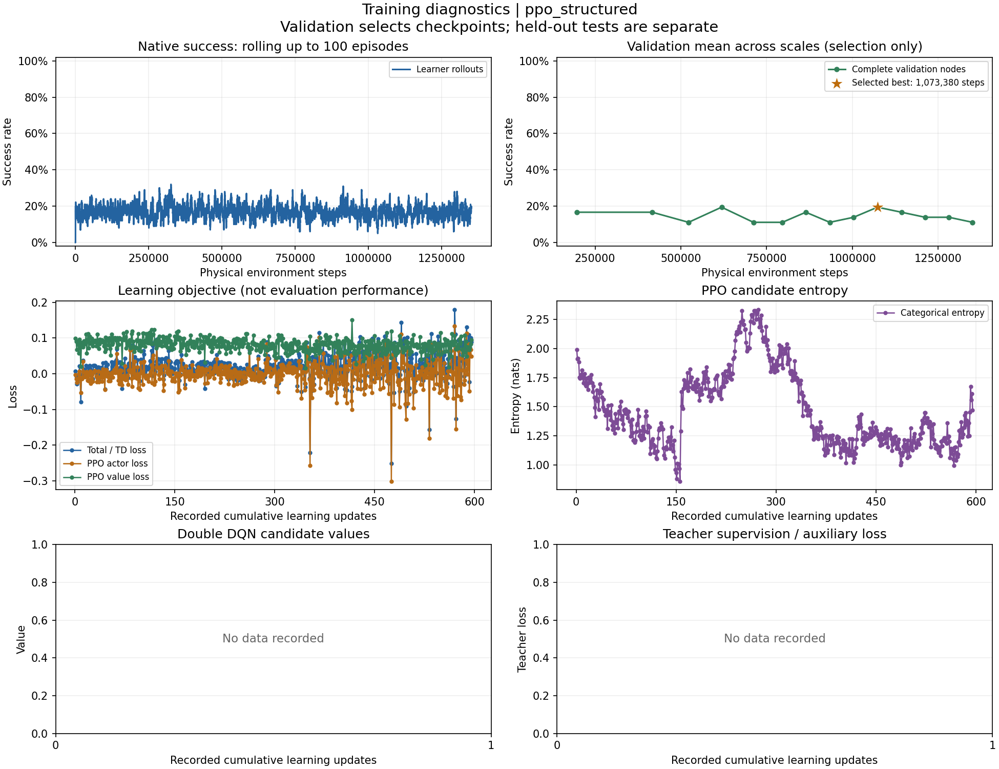
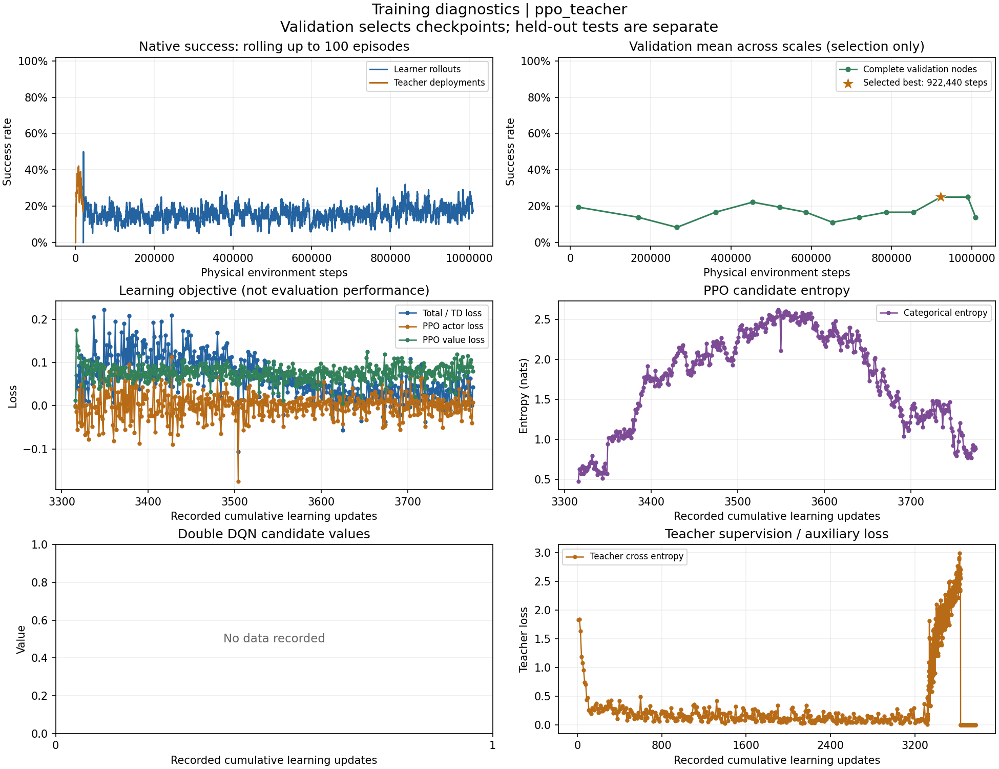

# v3 实验报告

本报告合并该版本主要结果与局限。不同运行和开局不混合统计胜率。所有原始数据、配置、历史详细分析已归并到各方法的 data.sqlite，不再外置每次验证的重复报告。

## 2026-09-06：v3 较长时间学习路线比较

每条路线约 7 小时；以下主表使用验证集选出的 `best` 检查点。

| 路线 | 真实训练步 | 正式成功/500 局 |
|---|---:|---:|
| PPO | 1,350,564 | 83/500（16.6%） |
| 教师初始化 PPO | 1,009,218；另有教师模拟 375,780 步 | 84/500（16.8%） |
| Q 学习 | 470,433 | 90/500（18.0%） |
| 同协议紧凑规则上层 | 不适用 | 98/500（19.6%） |

**结果。**更长训练仍没有超过同协议规则对照。三路线未使用 S2，不能用该结果否定 S2 的作用。v3 与 v4 的下层执行器不同，不能将规则胜率 19.6% 与 2.6% 的差异称为同协议算法退化。

证据：v3 正式组合报告。


## portfolio_report.md

# 已知对手动态分组：整夜三路线实验汇总

运行状态：**complete**；共同训练种子：20260906。
三条路线是三种候选方案，不是三个独立训练随机种子。
每路计划训练时间上限 7 小时；实际训练预算分别记录，不统一截断到最慢路线的步数。
训练时间包含该路线的教师采样和训练内验证；教师模拟步数单列，不冒充在线环境训练步数。

| 路线 | 状态 | 在线训练步数 | 教师模拟步数 | 实际训练时间（小时） | 实际训练时间（秒） | 原始结果 |
|---|---|---:|---:|---:|---:|---|
| 结构化候选 PPO `ppo_structured` | complete | 1350564 | 0 | 7.0076 | 25227.31 | 结果 JSON |
| 模拟教师热启动 PPO `ppo_teacher` | complete | 1009218 | 375780 | 7.0093 | 25233.39 | 结果 JSON |
| 候选动作 Double DQN `candidate_q` | complete | 470433 | 0 | 7.0145 | 25252.30 | 结果 JSON |

## 配对测试结果

各表只使用对应路线已有的 evaluation.table；没有完整配对时不填 0，也不计算成功率。
首选检查点为验证集选出的 best；若某规模没有 best 评估，则展示该规模已有的 latest 作为参考。
latest 同时保留展示，以便检查后期训练是否退化；不使用最终测试集重新挑选训练检查点。
相对差值是相同规模、相同已完成配对回合数下，相对于 compact_rule 的成功率百分点差。

### 结构化候选 PPO（ppo_structured）

本路线完整评估报告

完整配对：500/500；评估完成标记：True。

| 规模 | 方法 / 检查点 | 成功数 / 局数 | 成功率 | 相对紧凑规则（百分点） |
|---:|---|---:|---:|---:|
| 8v8 | best（验证集选优）；参考检查点 | 10 / 100 | 10.00% | -12.00 |
| 8v8 | latest（最终检查点） | 15 / 100 | 15.00% | -7.00 |
| 8v8 | 静态规则 static | 16 / 100 | 16.00% | -6.00 |
| 8v8 | 紧凑均衡规则 compact_rule | 22 / 100 | 22.00% | +0.00 |
| 8v8 | 动态威胁规则 dynamic_rule | 13 / 100 | 13.00% | -9.00 |
| 8v8 | 全后备 all_reserve | 7 / 100 | 7.00% | -15.00 |
| 12v12 | best（验证集选优）；参考检查点 | 27 / 100 | 27.00% | +10.00 |
| 12v12 | latest（最终检查点） | 15 / 100 | 15.00% | -2.00 |
| 12v12 | 静态规则 static | 16 / 100 | 16.00% | -1.00 |
| 12v12 | 紧凑均衡规则 compact_rule | 17 / 100 | 17.00% | +0.00 |
| 12v12 | 动态威胁规则 dynamic_rule | 18 / 100 | 18.00% | +1.00 |
| 12v12 | 全后备 all_reserve | 3 / 100 | 3.00% | -14.00 |
| 16v16 | best（验证集选优）；参考检查点 | 15 / 100 | 15.00% | -4.00 |
| 16v16 | latest（最终检查点） | 21 / 100 | 21.00% | +2.00 |
| 16v16 | 静态规则 static | 12 / 100 | 12.00% | -7.00 |
| 16v16 | 紧凑均衡规则 compact_rule | 19 / 100 | 19.00% | +0.00 |
| 16v16 | 动态威胁规则 dynamic_rule | 15 / 100 | 15.00% | -4.00 |
| 16v16 | 全后备 all_reserve | 6 / 100 | 6.00% | -13.00 |
| 24v24 | best（验证集选优）；参考检查点 | 13 / 100 | 13.00% | -6.00 |
| 24v24 | latest（最终检查点） | 10 / 100 | 10.00% | -9.00 |
| 24v24 | 静态规则 static | 21 / 100 | 21.00% | +2.00 |
| 24v24 | 紧凑均衡规则 compact_rule | 19 / 100 | 19.00% | +0.00 |
| 24v24 | 动态威胁规则 dynamic_rule | 17 / 100 | 17.00% | -2.00 |
| 24v24 | 全后备 all_reserve | 4 / 100 | 4.00% | -15.00 |
| 32v32 | best（验证集选优）；参考检查点 | 18 / 100 | 18.00% | -3.00 |
| 32v32 | latest（最终检查点） | 12 / 100 | 12.00% | -9.00 |
| 32v32 | 静态规则 static | 18 / 100 | 18.00% | -3.00 |
| 32v32 | 紧凑均衡规则 compact_rule | 21 / 100 | 21.00% | +0.00 |
| 32v32 | 动态威胁规则 dynamic_rule | 17 / 100 | 17.00% | -4.00 |
| 32v32 | 全后备 all_reserve | 5 / 100 | 5.00% | -16.00 |

### 模拟教师热启动 PPO（ppo_teacher）

本路线完整评估报告

完整配对：500/500；评估完成标记：True。

| 规模 | 方法 / 检查点 | 成功数 / 局数 | 成功率 | 相对紧凑规则（百分点） |
|---:|---|---:|---:|---:|
| 8v8 | best（验证集选优）；参考检查点 | 14 / 100 | 14.00% | -8.00 |
| 8v8 | latest（最终检查点） | 15 / 100 | 15.00% | -7.00 |
| 8v8 | 静态规则 static | 16 / 100 | 16.00% | -6.00 |
| 8v8 | 紧凑均衡规则 compact_rule | 22 / 100 | 22.00% | +0.00 |
| 8v8 | 动态威胁规则 dynamic_rule | 13 / 100 | 13.00% | -9.00 |
| 8v8 | 全后备 all_reserve | 7 / 100 | 7.00% | -15.00 |
| 12v12 | best（验证集选优）；参考检查点 | 14 / 100 | 14.00% | -3.00 |
| 12v12 | latest（最终检查点） | 17 / 100 | 17.00% | +0.00 |
| 12v12 | 静态规则 static | 16 / 100 | 16.00% | -1.00 |
| 12v12 | 紧凑均衡规则 compact_rule | 17 / 100 | 17.00% | +0.00 |
| 12v12 | 动态威胁规则 dynamic_rule | 18 / 100 | 18.00% | +1.00 |
| 12v12 | 全后备 all_reserve | 3 / 100 | 3.00% | -14.00 |
| 16v16 | best（验证集选优）；参考检查点 | 14 / 100 | 14.00% | -5.00 |
| 16v16 | latest（最终检查点） | 12 / 100 | 12.00% | -7.00 |
| 16v16 | 静态规则 static | 12 / 100 | 12.00% | -7.00 |
| 16v16 | 紧凑均衡规则 compact_rule | 19 / 100 | 19.00% | +0.00 |
| 16v16 | 动态威胁规则 dynamic_rule | 15 / 100 | 15.00% | -4.00 |
| 16v16 | 全后备 all_reserve | 6 / 100 | 6.00% | -13.00 |
| 24v24 | best（验证集选优）；参考检查点 | 24 / 100 | 24.00% | +5.00 |
| 24v24 | latest（最终检查点） | 15 / 100 | 15.00% | -4.00 |
| 24v24 | 静态规则 static | 21 / 100 | 21.00% | +2.00 |
| 24v24 | 紧凑均衡规则 compact_rule | 19 / 100 | 19.00% | +0.00 |
| 24v24 | 动态威胁规则 dynamic_rule | 17 / 100 | 17.00% | -2.00 |
| 24v24 | 全后备 all_reserve | 4 / 100 | 4.00% | -15.00 |
| 32v32 | best（验证集选优）；参考检查点 | 18 / 100 | 18.00% | -3.00 |
| 32v32 | latest（最终检查点） | 18 / 100 | 18.00% | -3.00 |
| 32v32 | 静态规则 static | 18 / 100 | 18.00% | -3.00 |
| 32v32 | 紧凑均衡规则 compact_rule | 21 / 100 | 21.00% | +0.00 |
| 32v32 | 动态威胁规则 dynamic_rule | 17 / 100 | 17.00% | -4.00 |
| 32v32 | 全后备 all_reserve | 5 / 100 | 5.00% | -16.00 |

### 候选动作 Double DQN（candidate_q）

本路线完整评估报告

完整配对：500/500；评估完成标记：True。

| 规模 | 方法 / 检查点 | 成功数 / 局数 | 成功率 | 相对紧凑规则（百分点） |
|---:|---|---:|---:|---:|
| 8v8 | best（验证集选优）；参考检查点 | 19 / 100 | 19.00% | -3.00 |
| 8v8 | latest（最终检查点） | 10 / 100 | 10.00% | -12.00 |
| 8v8 | 静态规则 static | 16 / 100 | 16.00% | -6.00 |
| 8v8 | 紧凑均衡规则 compact_rule | 22 / 100 | 22.00% | +0.00 |
| 8v8 | 动态威胁规则 dynamic_rule | 13 / 100 | 13.00% | -9.00 |
| 8v8 | 全后备 all_reserve | 7 / 100 | 7.00% | -15.00 |
| 12v12 | best（验证集选优）；参考检查点 | 18 / 100 | 18.00% | +1.00 |
| 12v12 | latest（最终检查点） | 12 / 100 | 12.00% | -5.00 |
| 12v12 | 静态规则 static | 16 / 100 | 16.00% | -1.00 |
| 12v12 | 紧凑均衡规则 compact_rule | 17 / 100 | 17.00% | +0.00 |
| 12v12 | 动态威胁规则 dynamic_rule | 18 / 100 | 18.00% | +1.00 |
| 12v12 | 全后备 all_reserve | 3 / 100 | 3.00% | -14.00 |
| 16v16 | best（验证集选优）；参考检查点 | 21 / 100 | 21.00% | +2.00 |
| 16v16 | latest（最终检查点） | 17 / 100 | 17.00% | -2.00 |
| 16v16 | 静态规则 static | 12 / 100 | 12.00% | -7.00 |
| 16v16 | 紧凑均衡规则 compact_rule | 19 / 100 | 19.00% | +0.00 |
| 16v16 | 动态威胁规则 dynamic_rule | 15 / 100 | 15.00% | -4.00 |
| 16v16 | 全后备 all_reserve | 6 / 100 | 6.00% | -13.00 |
| 24v24 | best（验证集选优）；参考检查点 | 18 / 100 | 18.00% | -1.00 |
| 24v24 | latest（最终检查点） | 8 / 100 | 8.00% | -11.00 |
| 24v24 | 静态规则 static | 21 / 100 | 21.00% | +2.00 |
| 24v24 | 紧凑均衡规则 compact_rule | 19 / 100 | 19.00% | +0.00 |
| 24v24 | 动态威胁规则 dynamic_rule | 17 / 100 | 17.00% | -2.00 |
| 24v24 | 全后备 all_reserve | 4 / 100 | 4.00% | -15.00 |
| 32v32 | best（验证集选优）；参考检查点 | 14 / 100 | 14.00% | -7.00 |
| 32v32 | latest（最终检查点） | 14 / 100 | 14.00% | -7.00 |
| 32v32 | 静态规则 static | 18 / 100 | 18.00% | -3.00 |
| 32v32 | 紧凑均衡规则 compact_rule | 21 / 100 | 21.00% | +0.00 |
| 32v32 | 动态威胁规则 dynamic_rule | 17 / 100 | 17.00% | -4.00 |
| 32v32 | 全后备 all_reserve | 5 / 100 | 5.00% | -16.00 |

## 如何解释这些结果

完成运行不等于证明方法有效。本次测试可用于观察方案差异；若测试均值有高低，也不能据此宣称跨种子可靠优势。
best 由独立验证集选取。此报告不会按测试结果自动部署或替换模型。
同时检查成功数、规则对照、后备比例、组大小和单人比例；详细行为与决策耗时见 CSV 和各路线报告。

日志：`logs/<route>.log`；实时状态：`progress.json` 与 `<route>/progress.json`。
恢复时使用相同指令和输出目录并加 `--resume`；改变源码、冻结资产或实验配置时需要新输出目录。


## failure_analysis_v3.md

# v3 前置诊断：环境与冻结下层输入的迁移问题

检查日期：2026-09-06。本文件记录本轮失败的环境和冻结执行器证据；PPO 优化、训练预算及三路线夜训方案另见对应方案文件。

## 结论与证据边界

这一轮低成功率不能只归结为 PPO 不适用，或者十万步训练不够。**在完全不训练上层、不更新下层权重的条件下，仅修正冻结下层一个超出训练范围的计数输入，规则分组的成功率就出现了明显改善。** 这给出了一个应当先处理的具体迁移问题。

本次最有信息量的对照保留全部 Blue 实体观测，只将下层 `self_obs[..., 8]` 的 `log1p(当前存活 Blue 数)` 饱和到 `log1p(3)`。同一批 70 个开局、三个规模中，纯规则紧凑分组的成功数由 **1 / 1 / 0** 变为 **17 / 13 / 16**。上层仍然看到真实敌方人数、位置、速度和生命值，物理世界也保留全部敌方。

这些是**执行器输入适配的诊断结果**，不是学习型动态分组算法的最终结果。适配后成功率仍不高，不能据此保证今晚 PPO 或 Q 学习一定成功，也不能宣称已经测得任务的最优胜率上限。后续必须在统一适配协议下重新训练并评估所有路线和规则基线。

## 冻结下层实际训练过什么

直接读取 `assets/frozen/lcl.pt` 的 `extra` 元数据得到：

| 项目 | 实际记录 |
| --- | --- |
| 架构 | `REFIL-QMIX-HAD-v1` |
| 训练方 | Red |
| 选中检查点的环境步 | 950,120 |
| 训练回合 | 38,688 |
| 训练规模 | 2v1、3v1、3v2、4v1、4v2、4v3 |
| 已知下层对手 | `rush`、`split_rush` |
| 当时选优验证 | 120 局，平均胜率 81.7% |

81.7% 来自**单目标、Red 人数占优、每格仅 10 局**的检查点选优验证，并非当前 8v8 / 12v12 / 16v16 的能力证明。原 Stage1 环境还明确拒绝 Red 人数不大于 Blue 的注册训练规模，理由是开火者自毁。当前任务是等人数、双目标防守、Blue 会按已知规则集中攻击，确实更困难。

冻结检查点 SHA256 已重新核对：

```text
15e861b770e9339f530386ebc6674d020686b1771697aa7aa8fff4c74ed6e355
```

原 v2 每个 Red 小组最多 4 人，但下层输入含全部存活 Blue；初始即会收到 4v8、4v12、4v16 等未训练过的局部输入。上层生成的单人组也不在下层原始训练规模内。网络允许变长输入，只能证明形状可接受，不能证明该分布上的策略行为可靠。

对 Stage1 与 Stage3 的编码做了逐字段源码比对：目标相对位置、生命值、角色、剩余时域及实体关系字段沿用相同编码。**未发现目标坐标编码错位的证据。** 一个确定发生分布外变化的字段是下层 `self_obs[..., 8]`：训练时最多 `log(4)`，当前初始则为 `log(9)`、`log(13)`、`log(17)`。后面的计数消融直接检验了这一变化。

## 当前物理任务为何难

- 每局最多 50 个物理步。任一目标被毁立即判 Red 失败；全部 Blue 被消灭，或 50 步结束时目标仍完好，判 Red 成功。
- Blue 最高速度 300，Red 250；加速度上限分别 36 和 30。错过早期拦截后，Red 不一定能追上 Blue。
- 攻击范围为 500，范围内攻击强度为 10，目标初始生命仅 1.2；一次有效攻击即可毁掉目标。攻击由原 HAD 规则决定，学习策略仅输出加速度。双方攻击者开火后自毁。
- 原上层只取得最终成功的 0/1 回报。目标健康几乎是“完好/被毁”，许多失败轨迹在首次目标破坏时便终止；不能把目标健康变化想当然地当成丰富的中间学习信号。

原输入下，紧凑规则的失败并非主要表现为 Red 已全部消耗：100 局均值中，8v8 / 12v12 / 16v16 的终局剩余 Red 为 **4.50 / 6.77 / 9.21**，剩余 Blue 为 **3.95 / 6.16 / 9.03**，平均仅约 24～25 步即结束。大量兵力仍活着，却未能及时保护所有目标。

另外实现了三种简单人工下层拦截器作为诊断，使用最近敌人追击、匈牙利匹配追击、带速度补偿的匹配拦截，物理规则不变。每种每规模 50 局，胜率范围为 0%～6%。这没有证明任务不可解，也没有找到可以直接取代冻结下层的高胜率手写答案。它们只用于诊断，不加入新方法的学习结果。

## 配对检查与规模确认

第一轮筛查使用 `76100000..76100029`，每格 30 局，3 个规模 × 2 种下层输入 × 5 种规则分组，共 900 次完整环境运行。

规则包括：原 `static`、全后备队、动态均衡紧凑分组、按威胁分配的紧凑分组、按威胁分配的双人组。均衡紧凑分组具体为：先用匈牙利匹配将 Red 按距离分到等容量目标槽，再在每个目标内按空间邻近构成最多 4 人的小组，每次上层事件重新计算。所有规则没有学习参数。

原全部 Blue 输入下，`static` 和均衡紧凑分组三个规模均为 0/30；全后备队分别为 2/30、2/30、3/30。只调整分组规则尚未明显救起原执行器输入协议。

随后对均衡紧凑规则扩展到 `76100000..76100099`，每格 100 局：

| 下层输入 | 8v8 成功数 | 12v12 成功数 | 16v16 成功数 |
| --- | ---: | ---: | ---: |
| `full`：全部 Blue + 实际 Blue 计数 | 1/100 | 1/100 | 0/100 |
| `nearest3`：最近 3 个 Blue + 相应计数 | 18/100 | 11/100 | 19/100 |
| `nearest_support`：最近 min(3, max(1, 组人数−1)) 个 Blue | 17/100 | 13/100 | 15/100 |

`nearest_support` 没有稳定优于固定 3 个邻近敌人。所有过滤方案仍在完整物理世界执行；未观测的 Blue 仍移动、攻击和破坏目标。

**这 100 局包含筛查时的前 30 局，不能把两轮当作独立重复。** 单独看新增的 70 个开局，`full` 成功数为 1 / 1 / 0，`nearest3` 为 15 / 7 / 13，改进方向仍然存在。这是开发诊断样本，不用于最终夜训模型选优后的无偏效果声明。

## 关键消融：实体数还是显式计数特征

只做最近敌人过滤，会同时改变注意力输入实体集合和显式计数，不能区分是哪部分起作用。于是对 `76100030..76100099` 的相同 70 个开局，进一步拆分这两个因素：

| Blue 实体 token | 下层显式 Blue 计数 | 8v8 成功数 | 12v12 成功数 | 16v16 成功数 |
| --- | --- | ---: | ---: | ---: |
| 全部 | 实际计数，原协议 | 1/70 | 1/70 | 0/70 |
| 最近 3 个 | 所选局部计数 | 15/70 | 7/70 | 13/70 |
| **全部** | **仅饱和到 3，`count_clip3`** | **17/70** | **13/70** | **16/70** |
| 最近 3 个 | 恢复实际全局 Blue 计数 | 2/70 | 2/70 | 0/70 |

前两行来自上一轮已有运行；后两行新增 420 次环境运行。不能把重复使用的开局计作新增独立验证。该对照支持更具体的判断：**显式敌人数输入超出冻结策略训练范围，是本轮执行退化的重要贡献因素。** 保留全部实体、仅饱和计数也能改善，说明目前没有必要把问题笼统归于“注意力看不了这么多敌人”或“网络参数量太少”。本试验没有排除其他分布差异及全局任务难度的作用。

一个辅助现象是初始动作分布：前 30 个开局中，原全 Blue 输入下三个规模的下层初始动作均只覆盖 4 个动作编号；`nearest3` 覆盖 16～17 个编号。这本身不能证明策略好坏，但与输入消融一起说明冻结策略的响应发生了实质变化。

## v3 接口与公平性

独立新增 `src/open_score/overnight/environment.py`，不修改原 v2 环境或结果文件：

```python
from open_score.overnight.environment import make_env

env = make_env(
    red=8, blue=8, opponent="reactive", max_steps=50,
    executor_scope="count_clip3", device="cpu",
)
```

`count_clip3` **仅对传给冻结下层的 `self_obs[..., 8]` 做饱和预处理**。其他 Blue 实体 token、上层 `DecisionState.blue`、物理实体、已知对手规则、所有目标、行动原语和 50 步时限均保留。冻结模型参数未更新。实际适配由只读转发的 adapter view 完成，不给原物理 adapter 打补丁，不更改环境随机流。

接口保留 `full`、`nearest3`、`nearest_support` 以便复核。新夜训方案应显式使用 `count_clip3`，并对三条学习路线及全部新基线统一应用该协议；原 v2 结果继续标为 `full`。**不能把跨协议改善记作新分组算法单独带来的改善。** 如果要研究原始全部计数协议下的能力，应单独重新训练/适配下层，不能用当前输入变换的结果替代。

`tests/test_overnight_environment.py` 的 11 项测试验证了：

- `full` 与原环境的真实状态转移完全相同；
- `count_clip3` 中下层仍收到全部 Blue token，且原 adapter 返回的真实计数字段未被改写；上层 Blue 实体记录保持完整；
- 冻结权重不变，所有参数 `requires_grad=False`；
- 8 / 12 / 16 规模可运行真实转移并精确 snapshot 重放；
- 被最近邻输入过滤的 Blue 仍在物理世界移动，甚至可以毁掉目标。

## 原始记录与复现

所有诊断均在 `outputs/overnight_audit/`，CPU 单线程，原冻结权重，`reactive` 已知对手，50 步物理时限。没有以改变终止规则或降低 Blue 数量换取成功率。

| 文件 | 内容 |
| --- | --- |
| `execution.json` | 首轮 900 次完整运行，30 开局筛查 |
| `compact_confirmation.json` | 900 次完整运行，100 开局规模确认，含与首轮重复样本 |
| `count_ablation.json` | 420 次新增运行，显式计数与实体集合消融 |
| `rule_executor.json` | 450 次人工下层拦截诊断 |
| `initial_actions.json` | 初始下层动作、方向与分布 |
| `failure_audit_summary.json` | 冻结检查点元数据及上述结果汇总 |

对应脚本也保存在相同目录。复现主要检查：

```powershell
& 'D:\Software\Anaconda\envs\torch310\python.exe' outputs/overnight_audit/audit_execution.py --episodes 100 --policies compact --observations all nearest3 support --output outputs/overnight_audit/compact_confirmation.json
& 'D:\Software\Anaconda\envs\torch310\python.exe' outputs/overnight_audit/audit_count_ablation.py
& 'D:\Software\Anaconda\envs\torch310\python.exe' -m pytest tests/test_overnight_environment.py
```

`audit_execution.py` 的诊断选项名 `support` 对应正式接口 `nearest_support`。诊断运行会覆盖其指定的诊断输出文件，应保留原记录后再复现；它们不会触碰既有训练模型或原 v2 结果目录。


## 保留图片






