# v5 六方法实验最终总结

整理日期：2026-09-07。训练与正式评估于 2026-09-07 17:25:52（北京时间）结束；14/14 个实验臂均完成，共 21,000 局正式执行。用户已明确结束本轮，不再追加训练、评估或诊断。

本文是本轮唯一最终总结；包含各方法训练/验证曲线、胜率图、完整数值表及诊断结论。图片与必要数据保留在本实验目录下，报告直接引用，不为各方法或阶段另建报告。没有为撰写本文重新运行实验。

## 最终结论

**本轮尚未获得“无需在线访问真实模拟器的新学习方法，能够可靠改善动态分组”的证据。**

- rollout 的 58.80% 和 MCTS-DPW 的 62.00% 是真实模拟器辅助决策条件下的实测胜率。它们在每个决策点复制当前环境，反复模拟候选的后果，享有精确的环境转移模型和大量额外计算。不能把这两个数作为已学会动态分组、低成本部署或学习方法优越性的证据。此前将它们直接概括为“两种方法有效”，没有充分突出这一条件，现予以修正。
- 候选 PPO 14.93%、AR-PPO 18.27%、ExIt 学生 17.60%，均未提供明确优于规则 17.40% 的证据。
- BRIDGE 分组 DQN 为 21.00%，比规则高 3.60 个百分点，但保守配对区间跨 0；不能宣布有效。同目标身份归属固定的诊断中，学习分组与每目标大组几乎相同。
- BCE 14.07%、ADV 10.13%、ADV-gated 12.80%；全局价值评价未转化为有效决策，ADV 和 gated 在本次配对评估中低于规则。
- 公共迁移对照冻结 B1 为 23.87%，相对规则有正收益证据；它属于已有的人数收益表与分配基线，不是本轮新学习成果。其等人数子集为 10/500（2.00%），低于规则的 16/500（3.20%），优势主要来自较易和中等配比，不能据此声称复杂动态分组问题已解决。

这是一轮完成了固定训练和正式评估、但未证明新学习方法有效的实验。所有结论限于一个训练种子；不把单次环境配对区间当作跨训练种子的稳健性。

### 如何解释真实模拟器规划

rollout/MCTS 使用与被评估环境相同的转移机制，避免了学习世界模型的建模误差，属于具有真实模型访问权限的规划参照。真实环境本身仍是随机的；有限模拟分支仍有采样误差，树搜索也不是精确最优解。因此这些结果既不是严格性能上界，也不能仅凭胜率高判定数据伪造。

当前代码将分支随机流与真实执行随机流分开；配对分支在候选之间复用随机条件，并不是把即将发生的真实未来随机结果直接交给决策器。本次未新增完整的信息泄露审计。关键限制在于部署时可反复调用精确模拟器的假设以及巨大计算成本，不能把它和只做神经网络推理的策略视为相同资源条件。

正式测试阶段，rollout 额外模拟 14,059,129 个物理步，MCTS 额外模拟 13,023,674 个物理步，各自实际环境执行只有约 3.3 万步；模拟量约为实际步数的 420 倍和 404 倍。这些收益只能说明在理想模型和高计算预算下存在可利用的决策空间，不能单独证明收益来自组划分，而非人数分配、成员身份选择或重规划。

## 研究问题与共同协议

在已知 reactive 对手、共享规则底层下，比较真实规划、策略学习和价值学习如何动态分组与分配兵力。
训练种子 20260907；两个目标；最多 50 个物理步；每 5 步及非终止伤亡事件重新决策；原生终局奖励、gamma=1，合法后备，无四人上限。
15 个规模配比等权混合：红方 8、12、16、24、32 人，蓝/红比例 1/2、3/4、1。固定验证每配比 10 局，正式测试每配比 100 局。
只描述本次训练种子与测试开局；不宣称跨训练种子稳健。主表使用预先指定的末期模型；验证最优权重不替代末期测试。

## 实际执行范围与版本

本轮采用已冻结的 q=0.5 预算：PPO 两臂各约 500,000 物理步；ExIt 4 轮，每轮 150 个状态；BRIDGE 150 快照、1,200 构造回合；T6 600 训练状态、300 验证状态，40 epoch。共同规则初始化为 300 完整回合，PPO/ExIt 固定 5 epoch。

训练根种子为 20260907，开局、对手、模拟分支、固定验证和正式测试派生独立种子；不是在一个固定开局上重复训练。所有主要臂按最终模型完成正式评估，验证最优权重仅为补充，不根据正式结果挑选模型。

调度器记录的起止时间为 2026-09-06 20:40:11 至 2026-09-07 17:25:54，历时 20 小时 45 分 43 秒，包含并行运行及中途工程整理，不等于各方法独占设备的训练时间。最后主报告写于 17:25:52。设备为 i7-14700KF、约 32 GB 内存、RTX 5070 Ti 16 GB；GPU 用于学习更新，环境和分支模拟依赖 CPU。

方法冻结提交为 b3ef7d3（v5.1）；数据与运行工程整理提交为 9fb9494（v5.2），物理实验协议仍为 known-rule-mixed-v5.1。中途 AR-PPO 在 292,606 步保存恢复点，恢复后完成剩余配额。工程迁移未改变算法、奖励、训练种子或目标步数。

未完成的额外候选诊断、搜索预算比较及独立串行部署延迟测量已按用户要求取消；本文保留已完成部分，不能表述为原全部诊断计划完成。随后用户要求结束本轮、只保留本最终总结。

| 任务 | 实际完成量 | 优化更新 |
| --- | --- | --- |
| 候选 PPO | 500,007 物理步，19,958 回合 | actor 2,827；critic 7,024；另 BC 135 |
| AR-PPO | 500,037 物理步，20,051 回合 | actor 291；critic 6,856；另 BC 135 |
| ExIt | 4 轮，600 教师状态；280 改进教师、320 基准模仿状态 | 蒸馏 760；初始化 BC 1,055 |
| BRIDGE | 150 快照，1,200 构造回合，12,417 内部转移 | 预热 127 转移后 TD 更新 12,290 |
| BCE / ADV | 共用 600 训练、300 验证状态，各 40 epoch | 各 1,520 |

actor/critic 次数是实际发生的参数更新次数；两者不同，不等同于采样量。AR 物理步与候选臂相近，但实际 actor 更新明显更少，属于解释训练停滞时需要保留的事实，不凭该计数单独判断因果。

## 正式测试总表

未完成的臂保留实际分子分母，未运行不记为零；混合难度总胜率不能直接与 v4 等人数结果比较。

| 方法 | 固定检查点 | 成功/局数 | 胜率 | 覆盖 | 比规则差（百分点） | 保守95%配对区间 | 判定 |
| --- | --- | --- | --- | --- | --- | --- | --- |
| 真实 rollout（模型参照） | latest | 882/1500 | 58.80% | 完整 | +41.40 | [+37.73, +44.85] | 仅支持真实模拟器辅助规划收益 |
| MCTS-DPW（模型参照） | latest | 930/1500 | 62.00% | 完整 | +44.60 | [+40.92, +48.05] | 仅支持真实模拟器辅助规划收益 |
| 候选 PPO | latest | 224/1500 | 14.93% | 完整 | -2.47 | [-6.11, +1.19] | 未观察到正胜率差 |
| AR-PPO | latest | 274/1500 | 18.27% | 完整 | +0.87 | [-2.90, +4.63] | 正差值尚不确定 |
| ExIt 学生 | latest | 264/1500 | 17.60% | 完整 | +0.20 | [-1.73, +2.13] | 正差值尚不确定 |
| BRIDGE 分组 DQN | final_construction | 315/1500 | 21.00% | 完整 | +3.60 | [-0.11, +7.29] | 正差值尚不确定 |
| BCE 价值 | final_epoch | 211/1500 | 14.07% | 完整 | -3.33 | [-7.00, +0.35] | 未观察到正胜率差 |
| ADV 价值 | final_epoch | 152/1500 | 10.13% | 完整 | -7.27 | [-10.86, -3.64] | 未观察到正胜率差 |
| ADV-gated | final_epoch | 192/1500 | 12.80% | 完整 | -4.60 | [-7.98, -1.19] | 未观察到正胜率差 |
| 规则上层 | frozen | 261/1500 | 17.40% | 完整 | +0.00 | 不适用（自身对照） | 公共参照 |
| 每目标大组 | frozen | 287/1500 | 19.13% | 完整 | +1.73 | [-1.93, +5.38] | 正差值尚不确定 |
| 同归属单体组 | frozen | 219/1500 | 14.60% | 完整 | -2.80 | [-6.29, +0.70] | 未观察到正胜率差 |
| 冻结 v4 B1 | frozen | 358/1500 | 23.87% | 完整 | +6.47 | [+2.62, +10.28] | 本次单种子有正收益证据 |
| 冻结 v4 B3 | frozen | 46/1500 | 3.07% | 完整 | -14.33 | [-17.28, -11.31] | 未观察到正胜率差 |

配对按相同回合族；区间由两个 97.5% Clopper–Pearson 区间经 Bonferroni 组合。该区间不包含训练种子之间的变异。

公共对照的胜率和规模曲线如下；六类方法的对应图放在本文各方法章节。图中 Wilson 区间表示单臂胜率的不确定性，与上表“相对规则差值”的配对区间含义不同。

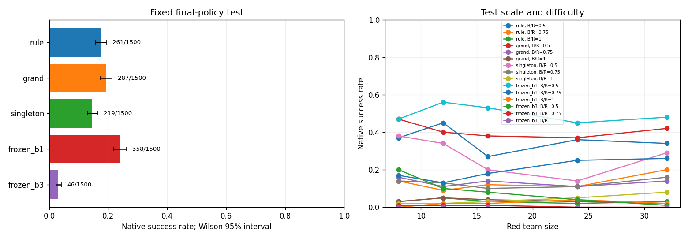

## 分难度与规模

| 方法 | 较易 | 中等 | 等人数 |
| --- | --- | --- | --- |
| 真实 rollout | 429/500（85.80%） | 307/500（61.40%） | 146/500（29.20%） |
| MCTS-DPW | 446/500（89.20%） | 332/500（66.40%） | 152/500（30.40%） |
| 候选 PPO | 139/500（27.80%） | 70/500（14.00%） | 15/500（3.00%） |
| AR-PPO | 184/500（36.80%） | 79/500（15.80%） | 11/500（2.20%） |
| ExIt 学生 | 189/500（37.80%） | 62/500（12.40%） | 13/500（2.60%） |
| BRIDGE 分组 DQN | 221/500（44.20%） | 77/500（15.40%） | 17/500（3.40%） |
| BCE 价值 | 138/500（27.60%） | 56/500（11.20%） | 17/500（3.40%） |
| ADV 价值 | 88/500（17.60%） | 45/500（9.00%） | 19/500（3.80%） |
| ADV-gated | 110/500（22.00%） | 63/500（12.60%） | 19/500（3.80%） |
| 规则上层 | 179/500（35.80%） | 66/500（13.20%） | 16/500（3.20%） |
| 每目标大组 | 204/500（40.80%） | 66/500（13.20%） | 17/500（3.40%） |
| 同归属单体组 | 135/500（27.00%） | 64/500（12.80%） | 20/500（4.00%） |
| 冻结 v4 B1 | 249/500（49.80%） | 99/500（19.80%） | 10/500（2.00%） |
| 冻结 v4 B3 | 43/500（8.60%） | 3/500（0.60%） | 0/500（0.00%） |

| 方法 | 8v4 | 8v6 | 8v8 | 12v6 | 12v9 | 12v12 | 16v8 | 16v12 | 16v16 | 24v12 | 24v18 | 24v24 | 32v16 | 32v24 | 32v32 |
| --- | --- | --- | --- | --- | --- | --- | --- | --- | --- | --- | --- | --- | --- | --- | --- |
| 真实 rollout | 80/100 | 62/100 | 24/100 | 85/100 | 59/100 | 23/100 | 85/100 | 57/100 | 30/100 | 87/100 | 64/100 | 29/100 | 92/100 | 65/100 | 40/100 |
| MCTS-DPW | 84/100 | 64/100 | 21/100 | 86/100 | 61/100 | 32/100 | 94/100 | 59/100 | 25/100 | 90/100 | 74/100 | 31/100 | 92/100 | 74/100 | 43/100 |
| 候选 PPO | 17/100 | 5/100 | 4/100 | 24/100 | 16/100 | 2/100 | 26/100 | 10/100 | 1/100 | 33/100 | 22/100 | 5/100 | 39/100 | 17/100 | 3/100 |
| AR-PPO | 38/100 | 18/100 | 4/100 | 38/100 | 12/100 | 0/100 | 34/100 | 19/100 | 2/100 | 29/100 | 11/100 | 1/100 | 45/100 | 19/100 | 4/100 |
| ExIt 学生 | 41/100 | 17/100 | 2/100 | 47/100 | 9/100 | 2/100 | 28/100 | 9/100 | 4/100 | 36/100 | 11/100 | 3/100 | 37/100 | 16/100 | 2/100 |
| BRIDGE 分组 DQN | 48/100 | 16/100 | 1/100 | 42/100 | 13/100 | 4/100 | 44/100 | 15/100 | 4/100 | 38/100 | 12/100 | 3/100 | 49/100 | 21/100 | 5/100 |
| BCE 价值 | 27/100 | 13/100 | 3/100 | 28/100 | 9/100 | 2/100 | 16/100 | 7/100 | 2/100 | 27/100 | 7/100 | 2/100 | 40/100 | 20/100 | 8/100 |
| ADV 价值 | 13/100 | 6/100 | 1/100 | 11/100 | 9/100 | 2/100 | 24/100 | 6/100 | 3/100 | 13/100 | 9/100 | 7/100 | 27/100 | 15/100 | 6/100 |
| ADV-gated | 18/100 | 13/100 | 3/100 | 15/100 | 13/100 | 2/100 | 22/100 | 5/100 | 3/100 | 20/100 | 10/100 | 5/100 | 35/100 | 22/100 | 6/100 |
| 规则上层 | 37/100 | 14/100 | 3/100 | 45/100 | 9/100 | 5/100 | 27/100 | 12/100 | 3/100 | 36/100 | 11/100 | 2/100 | 34/100 | 20/100 | 3/100 |
| 每目标大组 | 47/100 | 16/100 | 3/100 | 40/100 | 11/100 | 5/100 | 38/100 | 14/100 | 4/100 | 37/100 | 11/100 | 3/100 | 42/100 | 14/100 | 2/100 |
| 同归属单体组 | 38/100 | 14/100 | 2/100 | 34/100 | 13/100 | 2/100 | 20/100 | 10/100 | 3/100 | 14/100 | 11/100 | 5/100 | 29/100 | 16/100 | 8/100 |
| 冻结 v4 B1 | 47/100 | 17/100 | 0/100 | 56/100 | 13/100 | 2/100 | 53/100 | 18/100 | 2/100 | 45/100 | 25/100 | 4/100 | 48/100 | 26/100 | 2/100 |
| 冻结 v4 B3 | 20/100 | 1/100 | 0/100 | 10/100 | 1/100 | 0/100 | 8/100 | 1/100 | 0/100 | 4/100 | 0/100 | 0/100 | 1/100 | 0/100 | 0/100 |

## 六路线方法、训练过程与结果

每条路线在本文内给出方法、参数、训练/验证图、正式胜率及已完成诊断；图表与数值表共同保留，全部属于同一份实验报告。

本轮是已有机制在当前环境的迁移与重实现；没有完整运行原论文环境，不声称原作者实验的逐项复现。

### T1：真实终局 rollout

真实终局模拟能否发现并选择更好的编组？
执行状态：complete；阶段：`complete`。

实际参数：`{"candidates": 8, "branches": 8, "control_episodes": 30}`。

候选先执行一个事件，再由规则续行到原生终局；平局优先规则。属于 rollout 策略改进的场景适配。

**真实 rollout**：正式成功 882/1500（58.80%）；仅为高成本真实模型规划参照，不属于已学习策略的成功证据。

已经完成的独立诊断，按状态集分开报告；未完成部分已取消：

| 方法/状态集 | 状态数 | 方案－规则复核均值 | 教师－方法复核均值 | 状态排序准确率均值 |
| --- | --- | --- | --- | --- |
| T1_rollout/onpolicy_diagnostic | 30 | 0.0677 | 未记录 | 未记录 |
| grand/diagnostic | 120 | 0.0125 | 未记录 | 未记录 |
| singletons/diagnostic | 120 | 0.0029 | 未记录 | 未记录 |
| pairs/diagnostic | 120 | -0.0003 | 未记录 | 未记录 |
| rule/diagnostic | 120 | 0.0000 | 未记录 | 未记录 |
| selection_teacher/diagnostic | 120 | 0.0742 | 未记录 | 未记录 |
| rollout_budget_4/diagnostic | 120 | 0.0560 | 未记录 | 未记录 |
| rollout_budget_8/diagnostic | 120 | 0.0688 | 未记录 | 未记录 |
| rollout_budget_16/diagnostic | 120 | 0.0742 | 未记录 | 未记录 |
| rollout/diagnostic | 120 | 0.0685 | 未记录 | 未记录 |
| frozen_b3/diagnostic | 120 | -0.0266 | 未记录 | 未记录 |
| singletons/same_assignment_grouping | 120 | 未记录 | 未记录 | 未记录 |
| pairs/same_assignment_grouping | 120 | 未记录 | 未记录 | 未记录 |
| rule/same_assignment_grouping | 120 | 未记录 | 未记录 | 未记录 |

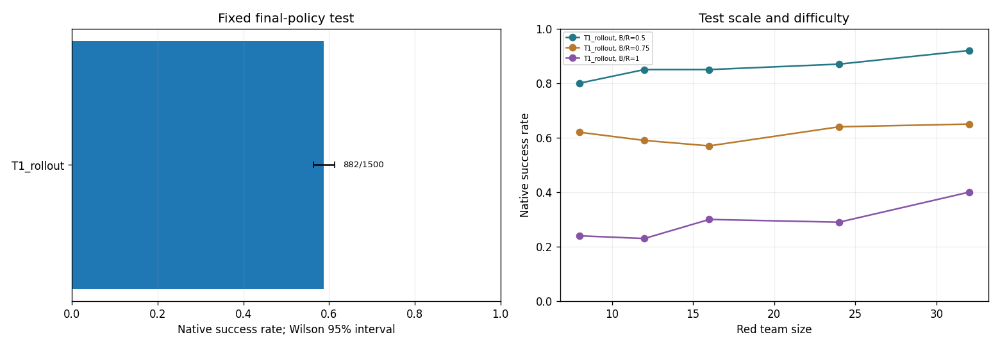

### T2：MCTS-DPW

多事件树搜索能否改善决策？
执行状态：complete；阶段：`complete`。

实际参数：`{"iterations": 64, "depth": 3, "k_action": 1.5, "alpha_action": 0.5, "k_state": 1.0, "alpha_state": 0.5, "exploration": 1.0}`。

完整编组为动作，双渐进扩展处理动作和随机后继；叶节点用规则终局续行。规划收益须结合模拟成本解释。

**MCTS-DPW**：正式成功 930/1500（62.00%）；仅为高成本真实模型规划参照，不属于已学习策略的成功证据。

已经完成的独立诊断，按状态集分开报告；未完成部分已取消：

| 方法/状态集 | 状态数 | 方案－规则复核均值 | 教师－方法复核均值 | 状态排序准确率均值 |
| --- | --- | --- | --- | --- |
| T2_mcts_dpw/onpolicy_diagnostic | 10 | 0.1812 | 未记录 | 未记录 |

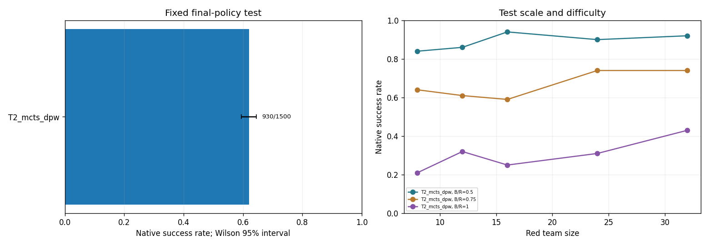

### T3：候选 PPO 与 AR-PPO

直接策略能否学到有效的候选选择或完整编组？
执行状态：complete；阶段：`complete`。

实际参数：`{"steps": 500000, "rollout": 1024, "batch_size": 128, "epochs": 4, "learning_rate": 0.0003, "gae_lambda": 0.95, "clip": 0.2, "max_gradient_norm": 0.5, "target_kl": 0.03, "entropy_start": 0.02, "entropy_end": 0.005, "candidates": 32, "validation_fractions": [0.0, 0.1, 0.25, 0.5, 0.75, 1.0]}`。

独立 actor/critic；编码器 {"hidden_dim": 128, "layers": 2, "heads": 4}；规则初始化 300 回合、5 epoch。候选 PPO 学习选择；AR 逐成员构造规范编组，按整个事件的联合概率裁剪。AR 熵正则为平均条件熵，候选臂为候选分布熵。

**候选 PPO**：正式成功 224/1500（14.93%）；未观察到正胜率差。

最近训练记录：累计物理步 500007；窗口原生胜率 23.00%。

| 检查点 | 验证成功/局数 | 较易 | 中等 | 等人数 | 完整 |
| --- | --- | --- | --- | --- | --- |
| step_0 | 30/150（20.00%） | 40.00% | 16.00% | 4.00% | 是 |
| step_50065 | 27/150（18.00%） | 36.00% | 16.00% | 2.00% | 是 |
| step_125576 | 34/150（22.67%） | 44.00% | 20.00% | 4.00% | 是 |
| step_250197 | 29/150（19.33%） | 46.00% | 8.00% | 4.00% | 是 |
| step_375834 | 24/150（16.00%） | 36.00% | 8.00% | 4.00% | 是 |
| step_500007 | 20/150（13.33%） | 26.00% | 10.00% | 4.00% | 是 |

**AR-PPO**：正式成功 274/1500（18.27%）；正差值尚不确定。

最近训练记录：累计物理步 500037；窗口原生胜率 17.00%。

| 检查点 | 验证成功/局数 | 较易 | 中等 | 等人数 | 完整 |
| --- | --- | --- | --- | --- | --- |
| step_0 | 34/150（22.67%） | 46.00% | 16.00% | 6.00% | 是 |
| step_50479 | 20/150（13.33%） | 26.00% | 12.00% | 2.00% | 是 |
| step_127149 | 20/150（13.33%） | 24.00% | 14.00% | 2.00% | 是 |
| step_252237 | 26/150（17.33%） | 34.00% | 16.00% | 2.00% | 是 |
| step_375795 | 7/150（4.67%） | 12.00% | 2.00% | 0.00% | 是 |
| step_500037 | 27/150（18.00%） | 38.00% | 12.00% | 4.00% | 是 |

已经完成的独立诊断，按状态集分开报告；未完成部分已取消：

| 方法/状态集 | 状态数 | 方案－规则复核均值 | 教师－方法复核均值 | 状态排序准确率均值 |
| --- | --- | --- | --- | --- |
| t3_candidate/diagnostic | 120 | -0.0117 | 0.1383 | 未记录 |

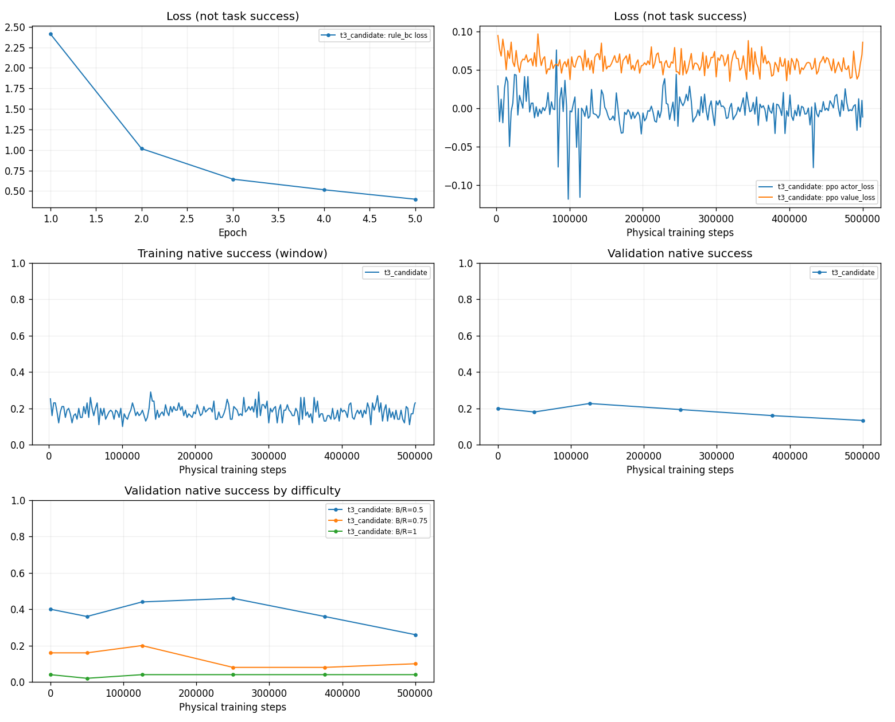

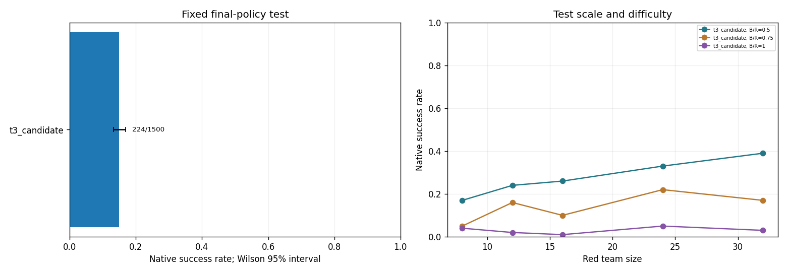

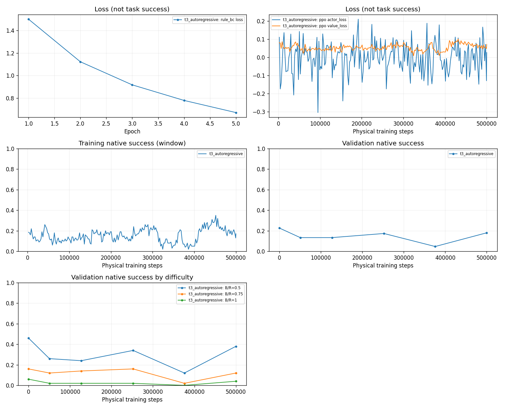

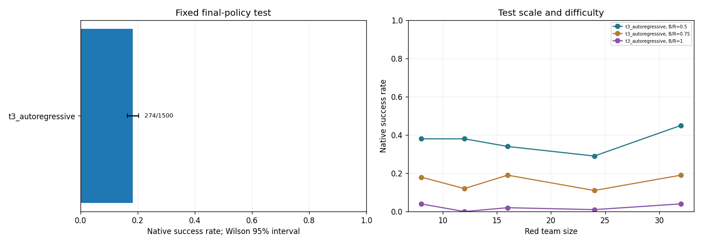

### T4：ExIt 风格策略迭代

模拟教师的收益能否迁移到学生？
执行状态：complete；阶段：`complete`。

实际参数：`{"rounds": 4, "states_per_round": 150, "candidates": 8, "branches": 8, "epochs": 10, "batch_size": 16, "learning_rate": 0.0003}`。

每轮用当前学生访问状态产生 rollout 教师，再蒸馏 10 epoch；属于 ExIt 风格适配。教师经验最优没有超过学生或全部平局时采用基准模仿。下表使用学生完整固定验证集；教师子集不能替代完整学生验证。

**ExIt 学生**：正式成功 264/1500（17.60%）；正差值尚不确定。

最近训练记录：轮次 4；epoch 10；窗口原生胜率 尚无数据。

| 检查点 | 验证成功/局数 | 较易 | 中等 | 等人数 | 完整 |
| --- | --- | --- | --- | --- | --- |
| round_1 | 26/150（17.33%） | 36.00% | 12.00% | 4.00% | 是 |
| round_2 | 33/150（22.00%） | 42.00% | 16.00% | 8.00% | 是 |
| round_3 | 30/150（20.00%） | 42.00% | 14.00% | 4.00% | 是 |
| round_4 | 29/150（19.33%） | 38.00% | 16.00% | 4.00% | 是 |

| 轮次 | 相同开局数 | 教师成功 | 学生成功 |
| --- | --- | --- | --- |
| 1 | 30 | 16 | 3 |
| 2 | 30 | 19 | 6 |
| 3 | 30 | 20 | 4 |
| 4 | 30 | 19 | 4 |

已经完成的独立诊断，按状态集分开报告；未完成部分已取消：

| 方法/状态集 | 状态数 | 方案－规则复核均值 | 教师－方法复核均值 | 状态排序准确率均值 |
| --- | --- | --- | --- | --- |
| t4_exit/diagnostic | 120 | 0.0036 | 0.0857 | 未记录 |
| t4_exit/onpolicy_diagnostic | 30 | 0.0000 | 0.0688 | 未记录 |
| t4_teacher/teacher_verification | 120 | 未记录 | 未记录 | 未记录 |

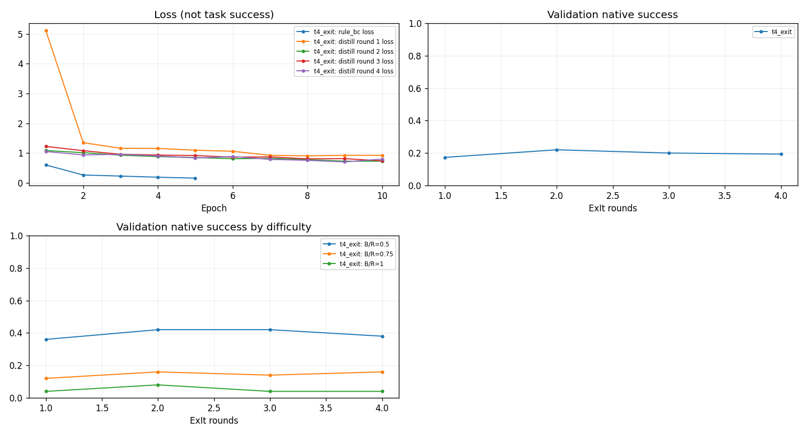

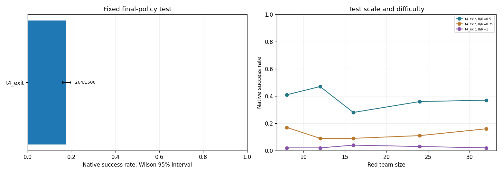

### T5：BRIDGE 分组 DQN

固定目标与身份归属后，学习合并是否有效？
执行状态：complete；阶段：`complete`。

实际参数：`{"states": 150, "episodes": 1200, "branches": 4, "batch_size": 128, "buffer_size": 10000, "target_interval": 100, "learning_rate": 0.0003, "max_gradient_norm": 40.0, "epsilon_steps": 10000, "epsilon_end": 0.01}`。

规则固定目标、身份归属和后备；DQN 学习同目标内 merge＋STOP，奖励为固定配对终局势差。保留 BRIDGE 上层机制，学习率采用当前场景的 3e-4。

**BRIDGE 分组 DQN**：正式成功 315/1500（21.00%）；正差值尚不确定。

最近训练记录：构造回合 1200；窗口原生胜率 尚无数据。

| 检查点 | 验证成功/局数 | 较易 | 中等 | 等人数 | 完整 |
| --- | --- | --- | --- | --- | --- |
| construction_300 | 35/150（23.33%） | 46.00% | 16.00% | 8.00% | 是 |
| construction_600 | 36/150（24.00%） | 48.00% | 18.00% | 6.00% | 是 |
| construction_900 | 32/150（21.33%） | 44.00% | 14.00% | 6.00% | 是 |
| construction_1200 | 36/150（24.00%） | 50.00% | 14.00% | 8.00% | 是 |

同归属划分的已完成配对终局诊断（不是正式在线胜率）：

| 划分 | 记录状态 | 平均续行成功率 | 相对大组均值 |
| --- | --- | --- | --- |
| rule | 120 | 0.2107 | -0.0065 |
| grand | 120 | 0.2172 | 0.0000 |
| singletons | 120 | 0.2109 | -0.0063 |
| learned | 120 | 0.2169 | -0.0003 |

已经完成的独立诊断，按状态集分开报告；未完成部分已取消：

| 方法/状态集 | 状态数 | 方案－规则复核均值 | 教师－方法复核均值 | 状态排序准确率均值 |
| --- | --- | --- | --- | --- |
| t5_bridge_grouping/diagnostic | 120 | 0.0063 | 0.0857 | 未记录 |
| t5_bridge_grouping/onpolicy_diagnostic | 30 | 0.0531 | 0.0958 | 未记录 |

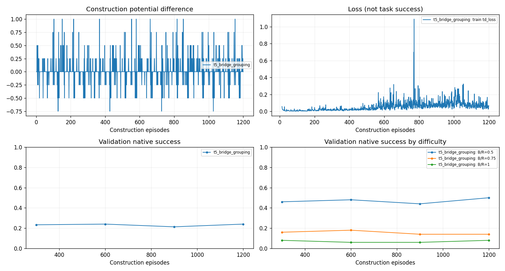

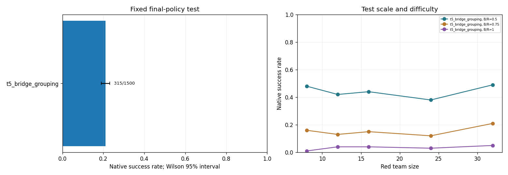

### T6：配对价值学习

配对优势监督和规则门控是否改善方案选择？
执行状态：complete；阶段：`complete`。

实际参数：`{"train_states": 600, "validation_states": 300, "candidates": 8, "branches": 16, "epochs": 40, "batch_size": 16, "learning_rate": 0.0003, "search_budget": 64, "thresholds": [0.0, 0.005, 0.01, 0.02]}`。

BCE 学习绝对成功概率；ADV 学习相对规则的配对优势，两者共享数据、搜索与规则锚点。ADV-gated 共用 ADV 权重，由验证集选择阈值，不宣称 SPIBB 算法复现或安全保证。
已选阈值：0.02；其验证成绩参与选择，不是独立测试。

标签来自同一状态下的配对终局分支：当前候选执行一个指挥事件后由规则续行。BCE 使用候选成功率软标签及二元交叉熵；ADV 使用候选相对规则的配对平均成功差、tanh 输出及 MSE。没有额外候选排序损失。两者同一初始网络、Adam 3e-4、梯度范数上限 10，每批先对同状态候选平均再对状态平均，保留末批。

| 数据集 | 状态数 | 候选数 | 全零状态 | 全部候选平局 | 非平局状态 |
| --- | --- | --- | --- | --- | --- |
| 训练 | 600 | 4,770 | 264（44.00%） | 299（49.83%） | 301（50.17%） |
| 验证 | 300 | 2,350 | 116（38.67%） | 140（46.67%） | 160（53.33%） |

全零属于全部平局的子集，不能将这些列相加；训练中另有 35 个非零但全部候选平局的状态。候选经合法化和去重后可能不足 8 个。

**BCE 价值**：正式成功 211/1500（14.07%）；未观察到正胜率差。

最近训练记录：epoch 40；窗口原生胜率 尚无数据。

| epoch | Brier | ECE | 配对MSE | 排序准确率 | 候选损失 | 全零/状态 | 非平局/状态 |
| --- | --- | --- | --- | --- | --- | --- | --- |
| 1 | 0.0970 | 0.0312 | 0.0323 | 0.5208 | 0.1019 | 116/300 | 160/300 |
| 2 | 0.0916 | 0.0791 | 0.0321 | 0.5067 | 0.1008 | 116/300 | 160/300 |
| 3 | 0.0796 | 0.0406 | 0.0329 | 0.5056 | 0.1004 | 116/300 | 160/300 |
| 4 | 0.0765 | 0.0484 | 0.0327 | 0.4915 | 0.1019 | 116/300 | 160/300 |
| 5 | 0.0743 | 0.0433 | 0.0325 | 0.5053 | 0.1060 | 116/300 | 160/300 |
| 6 | 0.0723 | 0.0201 | 0.0324 | 0.5141 | 0.1071 | 116/300 | 160/300 |
| 7 | 0.0764 | 0.0614 | 0.0324 | 0.5166 | 0.1004 | 116/300 | 160/300 |
| 8 | 0.0732 | 0.0182 | 0.0323 | 0.5215 | 0.0983 | 116/300 | 160/300 |
| 9 | 0.0819 | 0.0829 | 0.0324 | 0.4958 | 0.0942 | 116/300 | 160/300 |
| 10 | 0.0714 | 0.0169 | 0.0323 | 0.4961 | 0.0990 | 116/300 | 160/300 |
| 11 | 0.0714 | 0.0083 | 0.0322 | 0.4961 | 0.0990 | 116/300 | 160/300 |
| 12 | 0.0747 | 0.0402 | 0.0321 | 0.5046 | 0.1027 | 116/300 | 160/300 |
| 13 | 0.0758 | 0.0476 | 0.0324 | 0.4873 | 0.1058 | 116/300 | 160/300 |
| 14 | 0.0758 | 0.0506 | 0.0315 | 0.4993 | 0.0910 | 116/300 | 160/300 |
| 15 | 0.0815 | 0.0598 | 0.0322 | 0.4862 | 0.1121 | 116/300 | 160/300 |
| 16 | 0.0832 | 0.0818 | 0.0320 | 0.5060 | 0.0946 | 116/300 | 160/300 |
| 17 | 0.0731 | 0.0293 | 0.0322 | 0.4898 | 0.0985 | 116/300 | 160/300 |
| 18 | 0.0770 | 0.0518 | 0.0324 | 0.4958 | 0.1044 | 116/300 | 160/300 |
| 19 | 0.0757 | 0.0182 | 0.0322 | 0.4926 | 0.1119 | 116/300 | 160/300 |
| 20 | 0.0790 | 0.0508 | 0.0324 | 0.4961 | 0.0975 | 116/300 | 160/300 |
| 21 | 0.0816 | 0.0833 | 0.0323 | 0.4866 | 0.1104 | 116/300 | 160/300 |
| 22 | 0.0920 | 0.1030 | 0.0322 | 0.4965 | 0.1044 | 116/300 | 160/300 |
| 23 | 0.0795 | 0.0503 | 0.0322 | 0.4788 | 0.1081 | 116/300 | 160/300 |
| 24 | 0.0846 | 0.0835 | 0.0323 | 0.4735 | 0.1167 | 116/300 | 160/300 |
| 25 | 0.0801 | 0.0373 | 0.0317 | 0.4922 | 0.0927 | 116/300 | 160/300 |
| 26 | 0.0859 | 0.0815 | 0.0325 | 0.4838 | 0.1092 | 116/300 | 160/300 |
| 27 | 0.0808 | 0.0700 | 0.0317 | 0.5018 | 0.1042 | 116/300 | 160/300 |
| 28 | 0.0814 | 0.0581 | 0.0319 | 0.5060 | 0.1075 | 116/300 | 160/300 |
| 29 | 0.0807 | 0.0446 | 0.0331 | 0.4855 | 0.1085 | 116/300 | 160/300 |
| 30 | 0.0888 | 0.0740 | 0.0339 | 0.4933 | 0.1046 | 116/300 | 160/300 |
| 31 | 0.0849 | 0.0832 | 0.0332 | 0.5042 | 0.1052 | 116/300 | 160/300 |
| 32 | 0.0832 | 0.0680 | 0.0321 | 0.4901 | 0.1054 | 116/300 | 160/300 |
| 33 | 0.0854 | 0.0924 | 0.0331 | 0.4954 | 0.1085 | 116/300 | 160/300 |
| 34 | 0.0874 | 0.0865 | 0.0322 | 0.4951 | 0.1056 | 116/300 | 160/300 |
| 35 | 0.0916 | 0.0785 | 0.0340 | 0.5056 | 0.1071 | 116/300 | 160/300 |
| 36 | 0.0797 | 0.0641 | 0.0324 | 0.5007 | 0.1021 | 116/300 | 160/300 |
| 37 | 0.0852 | 0.0585 | 0.0338 | 0.4968 | 0.1023 | 116/300 | 160/300 |
| 38 | 0.0888 | 0.0758 | 0.0347 | 0.5007 | 0.1019 | 116/300 | 160/300 |
| 39 | 0.1021 | 0.0845 | 0.0388 | 0.4982 | 0.1031 | 116/300 | 160/300 |
| 40 | 0.0914 | 0.0632 | 0.0381 | 0.5025 | 0.1002 | 116/300 | 160/300 |

以上为留出状态的预测和排序指标；不是环境胜率。ADV 没有绝对概率时不填 Brier/ECE。

**ADV 价值**：正式成功 152/1500（10.13%）；未观察到正胜率差。

最近训练记录：epoch 40；窗口原生胜率 尚无数据。

| epoch | Brier | ECE | 配对MSE | 排序准确率 | 候选损失 | 全零/状态 | 非平局/状态 |
| --- | --- | --- | --- | --- | --- | --- | --- |
| 1 | 未记录 | 未记录 | 0.0333 | 0.4880 | 0.1083 | 116/300 | 160/300 |
| 2 | 未记录 | 未记录 | 0.0337 | 0.4785 | 0.1060 | 116/300 | 160/300 |
| 3 | 未记录 | 未记录 | 0.0332 | 0.4792 | 0.1113 | 116/300 | 160/300 |
| 4 | 未记录 | 未记录 | 0.0340 | 0.4993 | 0.1113 | 116/300 | 160/300 |
| 5 | 未记录 | 未记录 | 0.0333 | 0.4954 | 0.1087 | 116/300 | 160/300 |
| 6 | 未记录 | 未记录 | 0.0326 | 0.4884 | 0.1133 | 116/300 | 160/300 |
| 7 | 未记录 | 未记录 | 0.0327 | 0.4802 | 0.1083 | 116/300 | 160/300 |
| 8 | 未记录 | 未记录 | 0.0328 | 0.4778 | 0.1092 | 116/300 | 160/300 |
| 9 | 未记录 | 未记录 | 0.0332 | 0.4979 | 0.1127 | 116/300 | 160/300 |
| 10 | 未记录 | 未记录 | 0.0328 | 0.4704 | 0.1158 | 116/300 | 160/300 |
| 11 | 未记录 | 未记录 | 0.0326 | 0.4742 | 0.1113 | 116/300 | 160/300 |
| 12 | 未记录 | 未记录 | 0.0329 | 0.4929 | 0.1129 | 116/300 | 160/300 |
| 13 | 未记录 | 未记录 | 0.0333 | 0.4929 | 0.1127 | 116/300 | 160/300 |
| 14 | 未记录 | 未记录 | 0.0328 | 0.4813 | 0.1131 | 116/300 | 160/300 |
| 15 | 未记录 | 未记录 | 0.0328 | 0.5046 | 0.1054 | 116/300 | 160/300 |
| 16 | 未记录 | 未记录 | 0.0333 | 0.4855 | 0.1035 | 116/300 | 160/300 |
| 17 | 未记录 | 未记录 | 0.0336 | 0.5004 | 0.1110 | 116/300 | 160/300 |
| 18 | 未记录 | 未记录 | 0.0330 | 0.4809 | 0.1138 | 116/300 | 160/300 |
| 19 | 未记录 | 未记录 | 0.0328 | 0.4841 | 0.1079 | 116/300 | 160/300 |
| 20 | 未记录 | 未记录 | 0.0328 | 0.4817 | 0.1135 | 116/300 | 160/300 |
| 21 | 未记录 | 未记录 | 0.0329 | 0.4979 | 0.1090 | 116/300 | 160/300 |
| 22 | 未记录 | 未记录 | 0.0330 | 0.4965 | 0.1056 | 116/300 | 160/300 |
| 23 | 未记录 | 未记录 | 0.0327 | 0.5109 | 0.1052 | 116/300 | 160/300 |
| 24 | 未记录 | 未记录 | 0.0332 | 0.4880 | 0.1152 | 116/300 | 160/300 |
| 25 | 未记录 | 未记录 | 0.0339 | 0.5127 | 0.1044 | 116/300 | 160/300 |
| 26 | 未记录 | 未记录 | 0.0336 | 0.5014 | 0.1071 | 116/300 | 160/300 |
| 27 | 未记录 | 未记录 | 0.0325 | 0.4919 | 0.1090 | 116/300 | 160/300 |
| 28 | 未记录 | 未记录 | 0.0333 | 0.5021 | 0.1073 | 116/300 | 160/300 |
| 29 | 未记录 | 未记录 | 0.0334 | 0.4880 | 0.1077 | 116/300 | 160/300 |
| 30 | 未记录 | 未记录 | 0.0327 | 0.5095 | 0.1065 | 116/300 | 160/300 |
| 31 | 未记录 | 未记录 | 0.0332 | 0.5092 | 0.1046 | 116/300 | 160/300 |
| 32 | 未记录 | 未记录 | 0.0327 | 0.5078 | 0.1077 | 116/300 | 160/300 |
| 33 | 未记录 | 未记录 | 0.0336 | 0.4919 | 0.1123 | 116/300 | 160/300 |
| 34 | 未记录 | 未记录 | 0.0328 | 0.4901 | 0.1125 | 116/300 | 160/300 |
| 35 | 未记录 | 未记录 | 0.0330 | 0.4993 | 0.1033 | 116/300 | 160/300 |
| 36 | 未记录 | 未记录 | 0.0329 | 0.5102 | 0.1087 | 116/300 | 160/300 |
| 37 | 未记录 | 未记录 | 0.0328 | 0.4936 | 0.1008 | 116/300 | 160/300 |
| 38 | 未记录 | 未记录 | 0.0332 | 0.4968 | 0.1031 | 116/300 | 160/300 |
| 39 | 未记录 | 未记录 | 0.0330 | 0.5088 | 0.1075 | 116/300 | 160/300 |
| 40 | 未记录 | 未记录 | 0.0331 | 0.5060 | 0.1029 | 116/300 | 160/300 |

以上为留出状态的预测和排序指标；不是环境胜率。ADV 没有绝对概率时不填 Brier/ECE。

**ADV-gated**：正式成功 192/1500（12.80%）；未观察到正胜率差。

| 检查点 | 验证成功/局数 | 较易 | 中等 | 等人数 | 完整 |
| --- | --- | --- | --- | --- | --- |
| selected_gate | 25/150（16.67%） | 32.00% | 10.00% | 8.00% | 是 |

已经完成的独立诊断，按状态集分开报告；未完成部分已取消：

| 方法/状态集 | 状态数 | 方案－规则复核均值 | 教师－方法复核均值 | 状态排序准确率均值 |
| --- | --- | --- | --- | --- |
| t6_adv/diagnostic | 120 | -0.0039 | 0.1044 | 0.5157 |
| t6_adv/onpolicy_diagnostic | 30 | 0.0365 | 0.0833 | 0.5747 |
| t6_adv_gated/diagnostic | 120 | -0.0010 | 0.0935 | 0.5039 |
| t6_bce/diagnostic | 120 | 0.0130 | 0.0878 | 0.5340 |

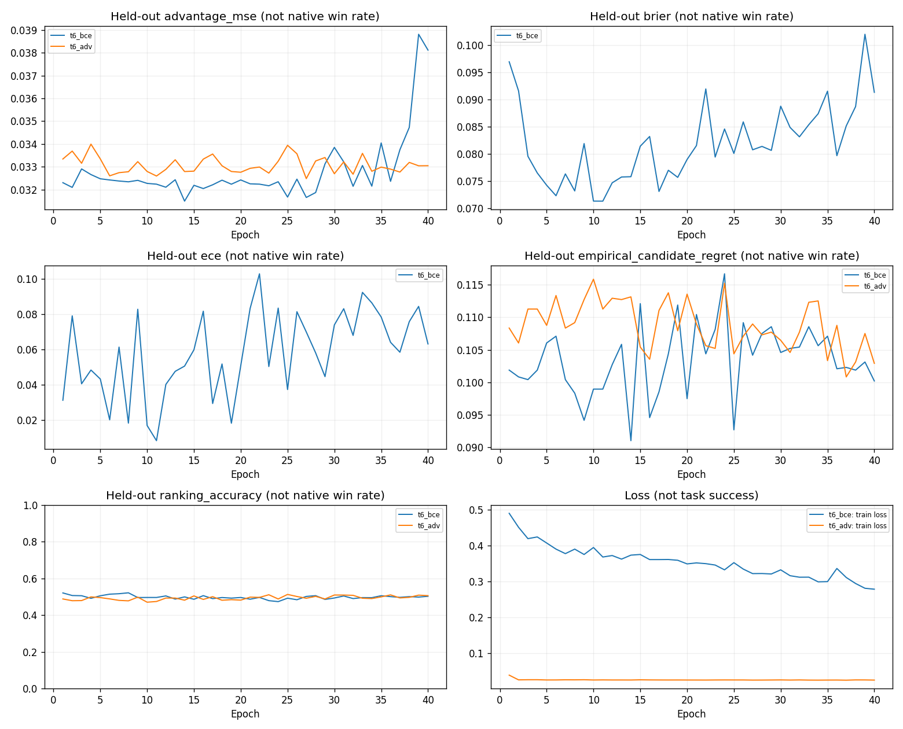

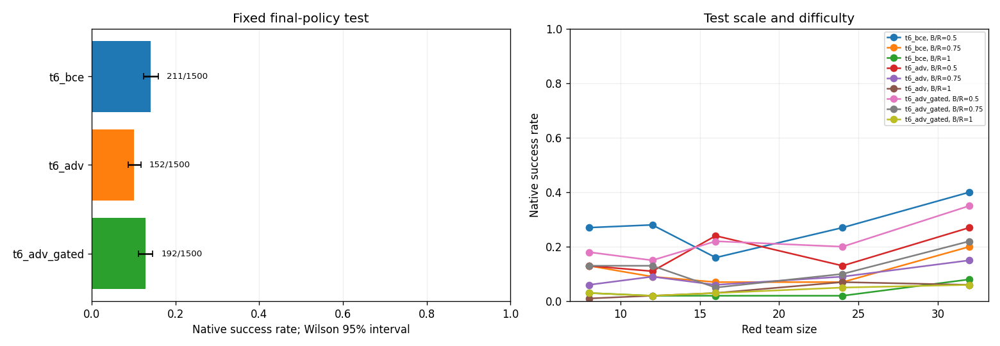

## 已记录成本与解释边界

下列时延是并行实验期间每回合决策中位数的平均，不是逐事件中位数，也不是独占部署基准。独立串行测量已取消，不据此作严格速度优劣结论。

| 方法 | 正式测试真实步 | 规划模拟步 | 回合中位延迟均值/ms | 全程未部署比例 | 后备暴露 |
| --- | --- | --- | --- | --- | --- |
| 真实 rollout | 33462 | 14059129 | 8574.8826 | 0.00% | 0.0724 |
| MCTS-DPW | 32211 | 13023674 | 9972.5535 | 0.00% | 0.0673 |
| 候选 PPO | 38184 | 0 | 11.2656 | 5.93% | 0.3163 |
| AR-PPO | 37144 | 0 | 7.4311 | 0.00% | 0.0000 |
| ExIt 学生 | 38007 | 0 | 7.4666 | 0.00% | 0.0006 |
| BRIDGE 分组 DQN | 36885 | 0 | 9.4211 | 0.00% | 0.0000 |
| BCE 价值 | 38760 | 0 | 69.3059 | 0.00% | 0.1965 |
| ADV 价值 | 39421 | 0 | 88.1771 | 0.00% | 0.2925 |
| ADV-gated | 38320 | 0 | 61.9243 | 0.00% | 0.0605 |
| 规则上层 | 38100 | 0 | 1.0659 | 0.00% | 0.0000 |
| 每目标大组 | 36999 | 0 | 0.8716 | 0.00% | 0.0000 |
| 同归属单体组 | 38805 | 0 | 1.1348 | 0.00% | 0.0000 |
| 冻结 v4 B1 | 37644 | 0 | 58.0667 | 0.00% | 0.3071 |
| 冻结 v4 B3 | 36655 | 0 | 56.2857 | 60.67% | 0.8543 |

损失下降、部署增加、预测校准更好都不能替代原生成功率证据。真实规划比学习路线好，说明模拟中存在可利用决策空间；不能仅凭这点区分表示、候选覆盖、标签噪声、优化或访问分布的影响。负结果和已完成的诊断同样保留。

以下成本从已有方法记录提取；共享数据只计一次，累计计数不逐行相加：

| 部分 | 物理步或模拟步 | 含义 |
| --- | ---: | --- |
| 两个 PPO 实际训练交互 | 1,000,044 | 实际环境训练步 |
| 公共规则初始化采集 | 7,621 | 共享一次 |
| ExIt 教师训练标签 | 636,247 | 额外终局模拟 |
| ExIt 教师独立复核 | 144,909 | 额外终局模拟 |
| ExIt 教师在线验证 120 局 | 1,102,417 | 决策中的规划模拟 |
| ExIt 学生访问状态采集 | 15,139 | 实际采集步 |
| BRIDGE 势值终局分支 | 894,360 | 额外终局模拟 |
| BRIDGE 快照采集 | 3,869 | 实际采集步 |
| T6 训练标签 | 1,234,104 | BCE/ADV 共享一次 |
| T6 留出标签 | 632,806 | BCE/ADV 共享一次 |

T4/T5/T6 的纯训练标签模拟合计 2,764,711 步，加入 T6 留出标签为 3,397,517 步。该数不包含全部诊断和在线规划测试，不能称为整轮总模拟成本。并行墙钟时间也不能直接累加为串行部署成本。

## 负结果的证据与原因边界

### 1. 直接策略没有形成稳定的学习趋势

候选 PPO 固定验证从初始化 30/150，经过中途最高 34/150，降至最终 20/150；AR-PPO 从初始化 34/150 到最终 27/150，中途最低 7/150。两臂都完成约 50 万物理步，曲线波动不构成稳定改善。可能涉及稀疏终局信号、长动作构造的信用分配和策略更新偏离规则初始化，但本轮没有通过独立消融确认各因素的因果贡献，不能断言只是步数不足或网络太小。

### 2. 模拟教师的能力没有被学生保留

ExIt 四轮的教师/学生配对 30 局分别为 16/3、19/6、20/4、19/4；最后一轮学生完整验证 29/150，正式结果 264/1500。教师使用真实模拟器，而学生只做策略推理，显著差距说明当前监督数据、表示及蒸馏流程没有把规划能力有效迁移到学生。不能把教师成绩计入学生成绩。

### 3. 全局价值模型没有学会可靠的同状态候选排序

第 40 epoch 的 BCE 排序准确率 50.25%，ADV 为 50.60%，都接近一半。BCE 的概率误差曾在早期下降，但最终 Brier 0.0914、ECE 0.0632；校准和总体误差不能替代候选排序。训练与验证数据均约一半状态具有非平局候选，说明数据并非全无区分信号，但有限分支标签、较多平局和当前表示仍可能限制学习。

64 次候选评分会把评价误差带入选择过程；ADV-gated 的门槛 0.02 虽在验证集选择，却没有在正式测试中超过规则。这支持“现有评价器不足以支撑有效搜索”的判断，不证明所有价值学习路线不可行。

### 4. 单独组划分的收益仍然有限

同目标归属固定的 120 状态诊断中，大组平均续行成功率为 0.2172，学习组为 0.2169，相差 -0.0003；正式 BRIDGE 比规则的 +3.60 个百分点仍有不确定性。规则归属与组内执行器下，细分和合并是否有稳定优势仍未建立。真实规划器的高分不能替代这一分组机制证据。

### 5. 混合难度增加了正样本，没有自动解决问题

较易配比确实能产生更多成功回合，但等人数子集中，候选 PPO 3.00%、AR-PPO 2.20%、ExIt 2.60%、BRIDGE 3.40%，规则为 3.20%。学习方法仍未显示一致提升。不能把加入简单任务后总胜率上升当作方法创新或训练成功。

本轮结论截至这些已有证据：新学习方法尚未验证有效；原生模拟器规划只作为理想模型参照；冻结 B1 的改进仅支持部分难度上的简单分配基线。当前实验已结束，不据此自动增加训练量或另开实验。
