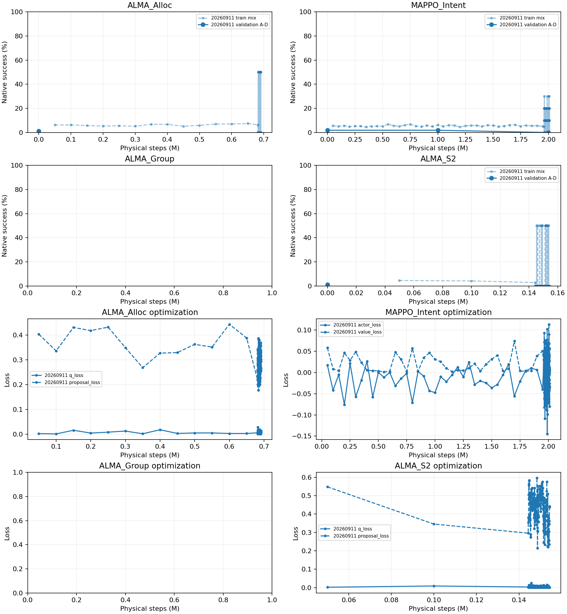
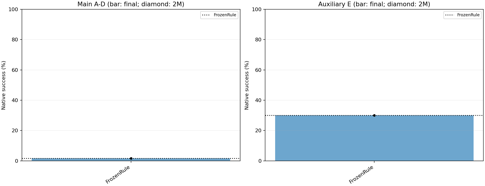
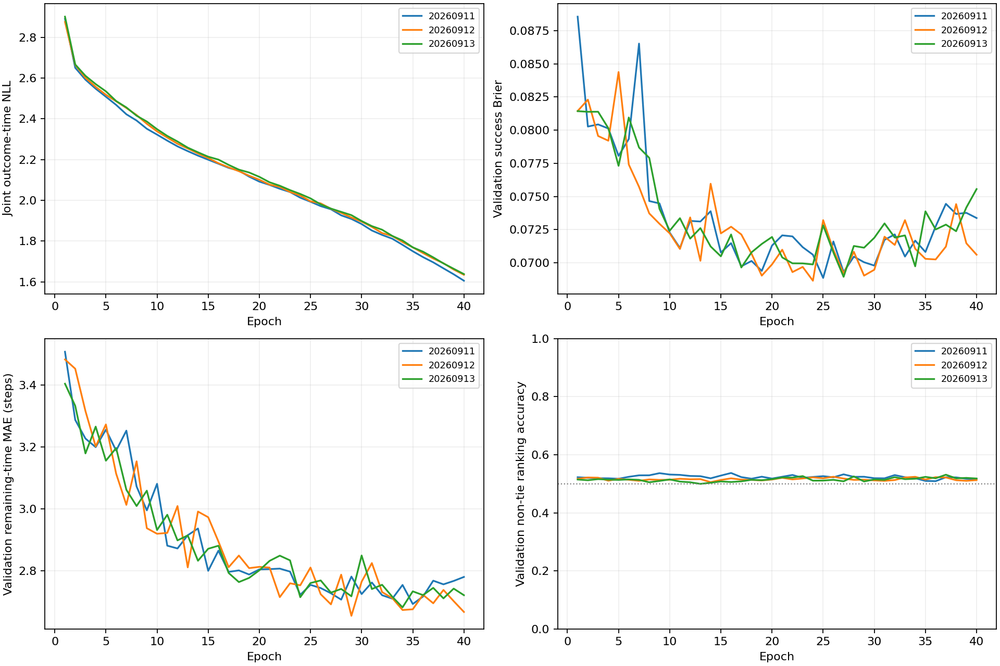

# v6 动态分组实验报告

更新时间：2026-09-08T15:58:44+08:00。

## 探索阶段终止记录

停止确认时间：**2026-09-08 16:00:19 +08:00**。按用户决定结束当前研究主线，调度器、3 个训练进程及 6 个采样子进程均已停止；不再继续原定预算。

| 方法（种子 20260911） | 已观测物理步 | 完整恢复点物理步 | 未进入恢复点的记录尾部 | 状态 |
|---|---:|---:|---:|---|
| ALMA_Alloc | 692,395 | 675,589 | 16,806 | 中止 |
| MAPPO_Intent | 2,014,683 | 2,009,408 | 5,275 | 中止；2M 正式评估已完成 |
| ALMA_S2（joint_v2） | 154,789 | 150,119 | 4,670 | 中止 |

数据与日志尾部保留；现有程序没有停机即时保存入口，完整恢复能力以上表检查点为限。恢复点含 learner、优化器、采样/回放状态及随机数状态；保留已有 best、2M 和 resume 权重，不把未完成作业标成 complete。其余未启动的方法/种子取消；S2 数据及三个初始化拟合、FrozenRule 评价保留完成状态。

正式评价共有 2,000 局执行：FrozenRule 1,000 局和 MAPPO_Intent 同种子 2M 检查点 1,000 局，共用 1,000 个开局族。六方法三种子完整比较未完成，不能将其写成全预算实验均已失败。下面为停机前最后一次自动报告（15:58:44）；最终归档将以停机后的数据库为准。

Git 探索 final 保存源码、配置与已跟踪报告/图片；被忽略的 SQLite、日志及输出权重继续原位保留，不属于该 Git 提交的备份范围。

## 研究问题与固定设计

在已知 reactive 对手、共享 rule_group_v1 底层和原生物理世界中，比较目标归属与同目标分组。每局最多50物理步，5步及非终止伤亡重新决策；不设组大小上限、后备配额或强制部署。

本轮使用独立新版had_env库。运行记录CORE_VERSION：had-workbench-1.0.0；PHYSICS_PROTOCOL：legacy-snapshot-order-boundary-fix-v1；来源：E:\Code\Open_Score_HAD_Workbench\had_env\__init__.py。

四个RL方法各训练三种子，每种子五场景合计5M物理步；2M和5M是同次训练的检查点。所有RL采用λ=0.5、γ=1蓝方生命损耗潜势，真实终局潜势归零；S2始终学习原生终局标签。

| 场景 | 红/蓝 | 目标数 | 汇总范围 |
|---|---:|---:|---|
| A | 10/10 | 2 | main |
| B | 10/10 | 3 | main |
| C | 20/20 | 2 | main |
| D | 20/20 | 3 | main |
| E | 10/6 | 2 | auxiliary |

## 总体效果

| 方法 | 主场景均值±种子标准差 | 辅助E | 完整种子 |
|---|---:|---:|---:|
| FrozenRule | 1.62% | 30.00% | 1/1 |
| BLOTTO_Count | 待完成 | 待完成 | 0/3 |
| BLOTTO_Group | 待完成 | 待完成 | 0/3 |
| ALMA_Alloc | 待完成 | 待完成 | 0/3 |
| MAPPO_Intent | 待完成 | 待完成 | 0/3 |
| ALMA_Group | 待完成 | 待完成 | 0/3 |
| ALMA_S2 | 待完成 | 待完成 | 0/3 |

上半部分：训练混合胜率（虚线，相邻显示点之间的成功数/回合数差；每种子最近200个采集块逐块显示，更早历史约50k步一个点）与主场景验证胜率（实线），两者分布不同，仅完整验证点计入实线。下半部分：实际Q/proposal或actor/critic训练损失。数据库保留全部原始记录，损失下降不等于任务有效。

最终模型及同次训练2M模型。黑点为已完成种子；未完成种子缺席，不能据部分结果宣称三种子优势。

当前S2版本joint_v2：共享数据上三个初始化的训练损失、胜率Brier、剩余时间MAE和非平局候选排序；只显示当前版本实际记录，旧二分类曲线不与重训拼接。损失或时间误差下降不等于在线方法有效。

## 首先比较：六方法相对规则是否有效

仅使用A–D主场景；先在每个开局族内对三个模型求差值均值，再按场景分层重采样开局族2000次。规则每个开局只运行一次，复用同一结果作参照。区间条件于已训练模型，不将模型重复执行当作独立开局；各区间为逐比较区间。

| 比较 | 差值（百分点） | 配对95%区间 |
|---|---:|---:|
| BLOTTO_Count−FrozenRule | 待完成 | 相同开局族的完整配对结果尚未齐备（规则每个开局只评一次） |
| BLOTTO_Group−FrozenRule | 待完成 | 相同开局族的完整配对结果尚未齐备（规则每个开局只评一次） |
| ALMA_Alloc−FrozenRule | 待完成 | 相同开局族的完整配对结果尚未齐备（规则每个开局只评一次） |
| MAPPO_Intent−FrozenRule | 待完成 | 相同开局族的完整配对结果尚未齐备（规则每个开局只评一次） |
| ALMA_Group−FrozenRule | 待完成 | 相同开局族的完整配对结果尚未齐备（规则每个开局只评一次） |
| ALMA_S2−FrozenRule | 待完成 | 相同开局族的完整配对结果尚未齐备（规则每个开局只评一次） |

## 其次比较：三项机制归因

仅使用A–D主场景；先在每个开局族内对三个模型求差值均值，再按场景分层重采样开局族2000次。规则每个开局只运行一次，复用同一结果作参照。区间条件于已训练模型，不将模型重复执行当作独立开局；各区间为逐比较区间。

| 比较 | 差值（百分点） | 配对95%区间 |
|---|---:|---:|
| BLOTTO_Group−BLOTTO_Count | 待完成 | 相同开局族的完整配对结果尚未齐备（规则每个开局只评一次） |
| ALMA_Group−ALMA_Alloc | 待完成 | 相同开局族的完整配对结果尚未齐备（规则每个开局只评一次） |
| ALMA_S2−ALMA_Group | 待完成 | 相同开局族的完整配对结果尚未齐备（规则每个开局只评一次） |

## FrozenRule

冻结规则上层参照，仅在共同正式开局上评价一次，不进行学习。

| 种子 | 检查点 | 场景 | 成功/局数 | 胜率 |
|---|---|---|---:|---:|
| 20260911 | final | A | 7/200 | 3.50% |
| 20260911 | final | B | 2/200 | 1.00% |
| 20260911 | final | C | 3/200 | 1.50% |
| 20260911 | final | D | 1/200 | 0.50% |
| 20260911 | final | E | 60/200 | 30.00% |

最终评价成本：24,853物理步、累计回合耗时113.3秒；每回合平均决策时延再取均值：0.63毫秒。并发累计耗时不等于墙钟完成时间。

最终评价行为（逐局均值）：sustained_all_reserve=0；reserve_exposure=0；reassignment_count=24.93；partition_changes_at_fixed_assignment=0.886；nonterminal_positive_shaping=0.3566；terminal_compensation=-0.3566；s2_scoring_rows=0；candidates_scored=0；失败局蓝方生命损耗=0.8085。

终止原因局数：blue_destroyed=73；targets_breached=927。

## BLOTTO_Count

本方法首先与FrozenRule比较（A–D，单个已完成种子的条件区间）：

| 模型种子 | 相对规则差值（百分点） | 配对95%区间 |
|---|---:|---:|
| 20260911 | 待完成 | 相同开局结果尚未齐备 |
| 20260912 | 待完成 | 相同开局结果尚未齐备 |
| 20260913 | 待完成 | 相同开局结果尚未齐备 |

配置：完整枚举人数和后备配置，按距离确定身份，冻结局部S2的对数概率求和；每个目标形成一个大组。

| 种子 | 检查点 | 场景 | 成功/局数 | 胜率 |
|---|---|---|---:|---:|
| — | — | — | 尚无正式评价记录 | — |

## BLOTTO_Group

本方法首先与FrozenRule比较（A–D，单个已完成种子的条件区间）：

| 模型种子 | 相对规则差值（百分点） | 配对95%区间 |
|---|---:|---:|
| 20260911 | 待完成 | 相同开局结果尚未齐备 |
| 20260912 | 待完成 | 相同开局结果尚未齐备 |
| 20260913 | 待完成 | 相同开局结果尚未齐备 |

配置：完整枚举人数和后备配置，按距离确定身份，冻结局部S2的对数概率求和；固定目标归属后评分64个不同完整分区。

| 种子 | 检查点 | 场景 | 成功/局数 | 胜率 |
|---|---|---|---:|---:|
| — | — | — | 尚无正式评价记录 | — |

## ALMA_Alloc

本方法首先与FrozenRule比较（A–D，单个已完成种子的条件区间）：

| 模型种子 | 相对规则差值（百分点） | 配对95%区间 |
|---|---:|---:|
| 20260911 | 待完成 | 相同开局结果尚未齐备 |
| 20260912 | 待完成 | 相同开局结果尚未齐备 |
| 20260913 | 待完成 | 相同开局结果尚未齐备 |

配置：AQL，32候选、每批64事件、每16新增事件一次Q/proposal更新；RMSprop学习率0.0005，回放5000完整回合。

| 种子 | 检查点 | 场景 | 成功/局数 | 胜率 |
|---|---|---|---:|---:|
| — | — | — | 尚无正式评价记录 | — |

实际训练进度：20260911: 691,309物理步，302282事件，28086回合。

| 种子 | 成功数/首次成功步 | 当前replay正例 | 连续无原生奖励回合 | 优化器step | TD RMSE | 最新速度(物理步/s) |
|---|---|---:|---:|---:|---:|---:|
| 20260911 | 1744/879 | 340 | 11 | 37740 | 0.1003 | 13.46 |

最后采集块学习指标：20260911: q_loss=0.0101, proposal_loss=0.2923, s2_rows=0.0000, internal_tokens=54048.0000, candidate_generated=4000.0000, candidate_scored=881.0000。

完整训练记录中的进程内存峰值：2.09 GiB；显存峰值：0.14 GiB（不是全机各并发进程同步总峰值）。

已记录完整训练回合原生/塑形总回报最大绝对差：0（28,086局）；正塑形反馈不作为原生成功计数。

## MAPPO_Intent

本方法首先与FrozenRule比较（A–D，单个已完成种子的条件区间）：

| 模型种子 | 相对规则差值（百分点） | 配对95%区间 |
|---|---:|---:|
| 20260911 | 待完成 | 相同开局结果尚未齐备 |
| 20260912 | 待完成 | 相同开局结果尚未齐备 |
| 20260913 | 待完成 | 相同开局结果尚未齐备 |

配置：每批10同版本完整回合、4epoch、5事件n-step、逐成员clip=0.2；Adam学习率0.0005。

| 种子 | 检查点 | 场景 | 成功/局数 | 胜率 |
|---|---|---|---:|---:|
| 20260911 | 2000000 | A | 7/200 | 3.50% |
| 20260911 | 2000000 | B | 4/200 | 2.00% |
| 20260911 | 2000000 | C | 6/200 | 3.00% |
| 20260911 | 2000000 | D | 4/200 | 2.00% |
| 20260911 | 2000000 | E | 43/200 | 21.50% |

实际训练进度：20260911: 2,011,432物理步，878031事件，80150回合。

| 种子 | 成功数/首次成功步 | 当前replay正例 | 连续无原生奖励回合 | 优化器step | TD RMSE | 最新速度(物理步/s) |
|---|---|---:|---:|---:|---:|---:|
| 20260911 | 4462/1413 | 不适用或未记录 | 20 | 64120 | 未记录 | 39.18 |

最后采集块学习指标：20260911: actor_loss=0.0113。

完整训练记录中的进程内存峰值：1.75 GiB；显存峰值：0.07 GiB（不是全机各并发进程同步总峰值）。

已记录完整训练回合原生/塑形总回报最大绝对差：0（80,150局）；正塑形反馈不作为原生成功计数。

## ALMA_Group

本方法首先与FrozenRule比较（A–D，单个已完成种子的条件区间）：

| 模型种子 | 相对规则差值（百分点） | 配对95%区间 |
|---|---:|---:|
| 20260911 | 待完成 | 相同开局结果尚未齐备 |
| 20260912 | 待完成 | 相同开局结果尚未齐备 |
| 20260913 | 待完成 | 相同开局结果尚未齐备 |

配置：AQL，32候选、每批64事件、每16新增事件一次Q/proposal更新；RMSprop学习率0.0005，回放5000完整回合。

| 种子 | 检查点 | 场景 | 成功/局数 | 胜率 |
|---|---|---|---:|---:|
| — | — | — | 尚无正式评价记录 | — |

## ALMA_S2

本方法首先与FrozenRule比较（A–D，单个已完成种子的条件区间）：

| 模型种子 | 相对规则差值（百分点） | 配对95%区间 |
|---|---:|---:|
| 20260911 | 待完成 | 相同开局结果尚未齐备 |
| 20260912 | 待完成 | 相同开局结果尚未齐备 |
| 20260913 | 待完成 | 相同开局结果尚未齐备 |

配置：AQL，32候选、每批64事件、每16新增事件一次Q/proposal更新；RMSprop学习率0.0005，回放5000完整回合。

| 种子 | 检查点 | 场景 | 成功/局数 | 胜率 |
|---|---|---|---:|---:|
| — | — | — | 尚无正式评价记录 | — |

实际训练进度：20260911: 154,350物理步，66315事件，6110回合。

| 种子 | 成功数/首次成功步 | 当前replay正例 | 连续无原生奖励回合 | 优化器step | TD RMSE | 最新速度(物理步/s) |
|---|---|---:|---:|---:|---:|---:|
| 20260911 | 238/138 | 188 | 25 | 8244 | 0.0224 | 5.22 |

最后采集块学习指标：20260911: q_loss=0.0005, proposal_loss=0.4376, s2_rows=1908.0000, internal_tokens=80031.0000, candidate_generated=3936.0000, candidate_scored=1651.0000。

完整训练记录中的进程内存峰值：2.15 GiB；显存峰值：0.21 GiB（不是全机各并发进程同步总峰值）。

已记录完整训练回合原生/塑形总回报最大绝对差：0（6,110局）；正塑形反馈不作为原生成功计数。

## S2能力评价与额外成本

当前评价器版本：`joint_v2`。

保留局部物理状态和候选分组关系，联合预测原生胜负与剩余结束物理步数；训练使用结局与时间联合负对数似然。G1/G2仍以成功概率边缘分布评分，搜索、人数枚举和目标归属逻辑不变，时间不作为额外惩罚或奖励。每个ALMA_S2种子待其新评价器完成并冻结后重新训练，旧训练记录不与本次曲线拼接。

旧二分类评价器与受其影响的训练记录、权重保留为binary_v1归档；以下训练曲线、留出指标及在线结果只计当前版本。增加独立局面和恢复时间监督是待验证的改进，不能提前承诺排序或在线胜率提升。

固定采样配额：12,000个独立母回合族（训练7,200、验证2,400、测试2,400）；每族最多3个状态，每状态最多8个不同候选。训练/验证/测试的每候选配对分支数为1/1/1。同一母回合族不跨划分，全部失败和全部成功状态均保留。

已落盘采样：12,000/12,000母回合族；状态34114，候选171425，非平局状态3985；母回合289163物理步、标签续行2680279模拟物理步。

| 数据划分 | 已完成母回合族 | 固定配额 |
|---|---:|---:|
| train | 7200 | 7200 |
| validation | 2400 | 2400 |
| test | 2400 | 2400 |

三个S2初始化共用同一份采样数据，不能重复计为三份独立数据。每个模型保留40轮配额；下表阶段来自最近一次落盘记录，不代替进程存活检查。

| 初始化 | 最近记录阶段 | 已完成epoch/配额 | 验证Brier | 验证时间MAE(步) | 验证非平局排序 |
|---|---|---:|---:|---:|---:|
| 20260911 | 已完成 | 40/40 | 0.0734 | 2.7809 | 0.5167 |
| 20260912 | 已完成 | 40/40 | 0.0706 | 2.6680 | 0.5127 |
| 20260913 | 已完成 | 40/40 | 0.0756 | 2.7221 | 0.5182 |

| 初始化 | 选中epoch | 测试Brier | ECE | 时间MAE(步) | 非平局排序 | 平局率 | 选择损失 | 全零/非平局/总状态 |
|---|---:|---:|---:|---:|---:|---:|---:|---|
| 20260911 | 25 | 0.0713 | 0.0104 | 2.7829 | 0.5220 | 0.9533 | 0.0528 | 4850/771/6807 |
| 20260912 | 24 | 0.0734 | 0.0152 | 2.8133 | 0.5267 | 0.9533 | 0.0520 | 4850/771/6807 |
| 20260913 | 27 | 0.0716 | 0.0201 | 2.7366 | 0.5020 | 0.9533 | 0.0521 | 4850/771/6807 |

| 初始化 | 成功条件时间MAE(步) | 失败条件时间MAE(步) | 测试联合NLL |
|---|---:|---:|---:|
| 20260911 | 2.4742 | 1.7393 | 2.2627 |
| 20260912 | 2.4803 | 1.7878 | 2.2896 |
| 20260913 | 2.2815 | 1.7227 | 2.2630 |

时间误差按实际终局标签评价；成功和失败分列，守满50步成功与快速失败不会被当作同一种结果。模型选择仍依据验证胜率Brier，测试集不用于选模型。

| S2初始化 | 局部规模 | 实际留出指标 |
|---|---|---|
| 20260911 | 0v0 | {"states":25,"brier":0.0,"nontie_ranking_accuracy":null,"tie_fraction":1.0,"selection_loss":0.0,"all_zero_states":0,"all_one_states":25,"non_tie_states":0,"time_mae":0.0,"joint_nll":0.0,"success_time_mae":0.0,"failure_time_mae":null} |
| 20260911 | 0v1 | {"states":133,"brier":0.01099058447215962,"nontie_ranking_accuracy":null,"tie_fraction":1.0,"selection_loss":0.0,"all_zero_states":132,"all_one_states":1,"non_tie_states":0,"time_mae":1.147766780081414,"joint_nll":1.5613174386483308,"success_time_mae":6.978715896606445,"failure_time_mae":0.9549001936479056} |
| 20260911 | 0v10 | {"states":28,"brier":4.31279847839015e-08,"nontie_ranking_accuracy":null,"tie_fraction":1.0,"selection_loss":0.0,"all_zero_states":28,"all_one_states":0,"non_tie_states":0,"time_mae":0.9105831238261439,"joint_nll":1.3323423339609513,"success_time_mae":null,"failure_time_mae":0.911225440209372} |
| 20260911 | 0v11 | {"states":8,"brier":8.374117963303681e-09,"nontie_ranking_accuracy":null,"tie_fraction":1.0,"selection_loss":0.0,"all_zero_states":8,"all_one_states":0,"non_tie_states":0,"time_mae":0.8091897543738871,"joint_nll":1.419695075820474,"success_time_mae":null,"failure_time_mae":0.8094999649945427} |
| 20260911 | 0v12 | {"states":8,"brier":1.694201272495374e-08,"nontie_ranking_accuracy":null,"tie_fraction":1.0,"selection_loss":0.0,"all_zero_states":8,"all_one_states":0,"non_tie_states":0,"time_mae":0.9681876103083294,"joint_nll":1.439611193206575,"success_time_mae":null,"failure_time_mae":0.9682509634229872} |
| 20260911 | 0v13 | {"states":6,"brier":3.126772511261686e-09,"nontie_ranking_accuracy":null,"tie_fraction":1.0,"selection_loss":0.0,"all_zero_states":6,"all_one_states":0,"non_tie_states":0,"time_mae":1.1751098999610312,"joint_nll":1.9484566175020657,"success_time_mae":null,"failure_time_mae":1.1749325165381799} |
| 20260911 | 0v14 | {"states":22,"brier":2.0085348766848033e-09,"nontie_ranking_accuracy":null,"tie_fraction":1.0,"selection_loss":0.0,"all_zero_states":22,"all_one_states":0,"non_tie_states":0,"time_mae":0.9634023075518399,"joint_nll":1.6743799888569373,"success_time_mae":null,"failure_time_mae":0.9631951010745505} |
| 20260911 | 0v15 | {"states":9,"brier":1.921370174023492e-09,"nontie_ranking_accuracy":null,"tie_fraction":1.0,"selection_loss":0.0,"all_zero_states":9,"all_one_states":0,"non_tie_states":0,"time_mae":1.1860552210556834,"joint_nll":2.2044624905837207,"success_time_mae":null,"failure_time_mae":1.1862440485703318} |
| 20260911 | 0v16 | {"states":6,"brier":8.933132861477236e-10,"nontie_ranking_accuracy":null,"tie_fraction":1.0,"selection_loss":0.0,"all_zero_states":6,"all_one_states":0,"non_tie_states":0,"time_mae":1.0179885534139779,"joint_nll":2.003942645513094,"success_time_mae":null,"failure_time_mae":1.0180246646587665} |
| 20260911 | 0v17 | {"states":7,"brier":4.036532646913797e-07,"nontie_ranking_accuracy":null,"tie_fraction":1.0,"selection_loss":0.0,"all_zero_states":7,"all_one_states":0,"non_tie_states":0,"time_mae":1.021970340183803,"joint_nll":1.5570632815361023,"success_time_mae":null,"failure_time_mae":1.0222530705588204} |
| 20260911 | 0v18 | {"states":4,"brier":6.049401134142007e-09,"nontie_ranking_accuracy":null,"tie_fraction":1.0,"selection_loss":0.0,"all_zero_states":4,"all_one_states":0,"non_tie_states":0,"time_mae":0.5982450544834137,"joint_nll":0.9572212025523185,"success_time_mae":null,"failure_time_mae":0.5976923406124115} |
| 20260911 | 0v19 | {"states":17,"brier":4.9850262615745255e-06,"nontie_ranking_accuracy":null,"tie_fraction":1.0,"selection_loss":0.0,"all_zero_states":17,"all_one_states":0,"non_tie_states":0,"time_mae":0.6378303798469335,"joint_nll":1.4038763159030194,"success_time_mae":null,"failure_time_mae":0.6417500392810719} |
| 20260911 | 0v2 | {"states":158,"brier":0.00614593141050831,"nontie_ranking_accuracy":null,"tie_fraction":1.0,"selection_loss":0.0,"all_zero_states":157,"all_one_states":1,"non_tie_states":0,"time_mae":1.28505978460719,"joint_nll":1.776658210857977,"success_time_mae":0.8355598449707031,"failure_time_mae":1.268725646419759} |
| 20260911 | 0v20 | {"states":8,"brier":1.913392970641862e-09,"nontie_ranking_accuracy":null,"tie_fraction":1.0,"selection_loss":0.0,"all_zero_states":8,"all_one_states":0,"non_tie_states":0,"time_mae":0.634893074631691,"joint_nll":1.4269724003970623,"success_time_mae":null,"failure_time_mae":0.6348963528871536} |
| 20260911 | 0v3 | {"states":127,"brier":2.331494097997542e-05,"nontie_ranking_accuracy":null,"tie_fraction":1.0,"selection_loss":0.0,"all_zero_states":127,"all_one_states":0,"non_tie_states":0,"time_mae":1.1492809484254085,"joint_nll":1.6454081300145673,"success_time_mae":null,"failure_time_mae":1.1457936012033216} |
| 20260911 | 0v4 | {"states":68,"brier":4.200719043783047e-06,"nontie_ranking_accuracy":null,"tie_fraction":1.0,"selection_loss":0.0,"all_zero_states":68,"all_one_states":0,"non_tie_states":0,"time_mae":1.0559188593988844,"joint_nll":1.644544557384825,"success_time_mae":null,"failure_time_mae":1.052633558494458} |
| 20260911 | 0v5 | {"states":62,"brier":2.0701847718894065e-05,"nontie_ranking_accuracy":null,"tie_fraction":1.0,"selection_loss":0.0,"all_zero_states":62,"all_one_states":0,"non_tie_states":0,"time_mae":1.3909315693286053,"joint_nll":1.906987832267157,"success_time_mae":null,"failure_time_mae":1.3911172974017254} |
| 20260911 | 0v6 | {"states":65,"brier":1.3393708638046779e-05,"nontie_ranking_accuracy":null,"tie_fraction":1.0,"selection_loss":0.0,"all_zero_states":65,"all_one_states":0,"non_tie_states":0,"time_mae":1.005831539630891,"joint_nll":1.5751664819779692,"success_time_mae":null,"failure_time_mae":1.0065327669257558} |
| 20260911 | 0v7 | {"states":46,"brier":1.6245047808119847e-05,"nontie_ranking_accuracy":null,"tie_fraction":1.0,"selection_loss":0.0,"all_zero_states":46,"all_one_states":0,"non_tie_states":0,"time_mae":1.4093960962797463,"joint_nll":2.0712920022638213,"success_time_mae":null,"failure_time_mae":1.4029183538336507} |
| 20260911 | 0v8 | {"states":33,"brier":9.69234049334619e-08,"nontie_ranking_accuracy":null,"tie_fraction":1.0,"selection_loss":0.0,"all_zero_states":33,"all_one_states":0,"non_tie_states":0,"time_mae":1.043885509732743,"joint_nll":1.628924351552842,"success_time_mae":null,"failure_time_mae":1.043821887231209} |
| 20260911 | 0v9 | {"states":47,"brier":2.553343474437688e-08,"nontie_ranking_accuracy":null,"tie_fraction":1.0,"selection_loss":0.0,"all_zero_states":47,"all_one_states":0,"non_tie_states":0,"time_mae":1.1613884526069718,"joint_nll":1.6823329516131467,"success_time_mae":null,"failure_time_mae":1.1609271752713908} |
| 20260911 | 10v0 | {"states":3,"brier":0.0,"nontie_ranking_accuracy":null,"tie_fraction":1.0,"selection_loss":0.0,"all_zero_states":0,"all_one_states":3,"non_tie_states":0,"time_mae":0.0,"joint_nll":0.0,"success_time_mae":0.0,"failure_time_mae":null} |
| 20260911 | 10v1 | {"states":65,"brier":0.03248404381581215,"nontie_ranking_accuracy":0.5800865800865801,"tie_fraction":0.9790057915057919,"selection_loss":0.013513513513513539,"all_zero_states":3,"all_one_states":57,"non_tie_states":5,"time_mae":2.3929933774712966,"joint_nll":2.266441132369883,"success_time_mae":1.6852194803178069,"failure_time_mae":3.217567554418591} |
| 20260911 | 10v10 | {"states":41,"brier":0.029255975727261473,"nontie_ranking_accuracy":0.32063492063492066,"tie_fraction":0.9696223316912971,"selection_loss":0.04597701149425287,"all_zero_states":38,"all_one_states":0,"non_tie_states":3,"time_mae":3.0298056479158064,"joint_nll":2.7227030047054956,"success_time_mae":19.68614361502907,"failure_time_mae":2.3732010235772294} |
| 20260911 | 10v11 | {"states":12,"brier":0.1743336021036553,"nontie_ranking_accuracy":0.17777777777777778,"tie_fraction":0.8898809523809523,"selection_loss":0.24999999999999997,"all_zero_states":8,"all_one_states":1,"non_tie_states":3,"time_mae":3.2571142216523494,"joint_nll":2.9566139380137124,"success_time_mae":1.1837611478917738,"failure_time_mae":1.7551829905449587} |
| 20260911 | 10v12 | {"states":6,"brier":0.0010279322837736023,"nontie_ranking_accuracy":null,"tie_fraction":1.0,"selection_loss":0.0,"all_zero_states":6,"all_one_states":0,"non_tie_states":0,"time_mae":2.0940538446108494,"joint_nll":2.306673725446065,"success_time_mae":null,"failure_time_mae":2.0103926857312517} |
| 20260911 | 10v13 | {"states":5,"brier":0.002523299377772344,"nontie_ranking_accuracy":null,"tie_fraction":1.0,"selection_loss":0.0,"all_zero_states":5,"all_one_states":0,"non_tie_states":0,"time_mae":1.2131863117218018,"joint_nll":1.8761812686920165,"success_time_mae":null,"failure_time_mae":0.921089220046997} |
| 20260911 | 10v14 | {"states":4,"brier":0.0009137614345773644,"nontie_ranking_accuracy":null,"tie_fraction":1.0,"selection_loss":0.0,"all_zero_states":4,"all_one_states":0,"non_tie_states":0,"time_mae":3.592587292194367,"joint_nll":2.8805371820926666,"success_time_mae":null,"failure_time_mae":3.4501105546951294} |
| 20260911 | 10v15 | {"states":1,"brier":3.5496952722688496e-07,"nontie_ranking_accuracy":null,"tie_fraction":1.0,"selection_loss":0.0,"all_zero_states":1,"all_one_states":0,"non_tie_states":0,"time_mae":0.7922589778900146,"joint_nll":2.4139835834503174,"success_time_mae":null,"failure_time_mae":0.7906222343444824} |
| 20260911 | 10v18 | {"states":1,"brier":2.1391033774321826e-05,"nontie_ranking_accuracy":null,"tie_fraction":1.0,"selection_loss":0.0,"all_zero_states":1,"all_one_states":0,"non_tie_states":0,"time_mae":0.9896774291992188,"joint_nll":1.946668028831482,"success_time_mae":null,"failure_time_mae":0.9922606945037843} |
| 20260911 | 10v19 | {"states":1,"brier":3.667882899493147e-07,"nontie_ranking_accuracy":null,"tie_fraction":1.0,"selection_loss":0.0,"all_zero_states":1,"all_one_states":0,"non_tie_states":0,"time_mae":1.1229097843170166,"joint_nll":2.167498826980591,"success_time_mae":null,"failure_time_mae":1.1201117038726807} |
| 20260911 | 10v2 | {"states":24,"brier":0.1115086147917527,"nontie_ranking_accuracy":0.6876984126984125,"tie_fraction":0.9117647058823529,"selection_loss":0.0392156862745098,"all_zero_states":4,"all_one_states":14,"non_tie_states":6,"time_mae":3.2920773601999462,"joint_nll":2.290409069435269,"success_time_mae":1.9825445043374288,"failure_time_mae":0.7500056416489357} |
| 20260911 | 10v20 | {"states":24,"brier":2.139679469693528e-06,"nontie_ranking_accuracy":null,"tie_fraction":1.0,"selection_loss":0.0,"all_zero_states":24,"all_one_states":0,"non_tie_states":0,"time_mae":2.346940551485334,"joint_nll":2.5061086294602375,"success_time_mae":null,"failure_time_mae":2.3470045157841266} |
| 20260911 | 10v3 | {"states":31,"brier":0.2157122629369584,"nontie_ranking_accuracy":0.4998139880952381,"tie_fraction":0.8027472527472527,"selection_loss":0.1846153846153846,"all_zero_states":4,"all_one_states":12,"non_tie_states":15,"time_mae":5.750056267701661,"joint_nll":3.0471160301795366,"success_time_mae":3.0470966947251483,"failure_time_mae":2.1180499512808666} |
| 20260911 | 10v4 | {"states":36,"brier":0.20096710052861713,"nontie_ranking_accuracy":0.551061776061776,"tie_fraction":0.7989926739926739,"selection_loss":0.20512820512820515,"all_zero_states":10,"all_one_states":8,"non_tie_states":18,"time_mae":6.251103665584174,"joint_nll":2.8508954246838893,"success_time_mae":3.301590272885727,"failure_time_mae":2.520735363627589} |
| 20260911 | 10v5 | {"states":49,"brier":0.22168136227260818,"nontie_ranking_accuracy":0.5473507712944332,"tie_fraction":0.7128987517337034,"selection_loss":0.31067961165048547,"all_zero_states":9,"all_one_states":6,"non_tie_states":34,"time_mae":6.571954507272221,"joint_nll":3.1059285182397356,"success_time_mae":3.8991234877170653,"failure_time_mae":2.671898362823346} |
| 20260911 | 10v6 | {"states":16,"brier":0.23630623283492933,"nontie_ranking_accuracy":0.47591991341991335,"tie_fraction":0.725108225108225,"selection_loss":0.30303030303030304,"all_zero_states":2,"all_one_states":3,"non_tie_states":11,"time_mae":6.057538198702263,"joint_nll":3.019069223692923,"success_time_mae":2.4425014665682023,"failure_time_mae":2.1582822961322328} |
| 20260911 | 10v7 | {"states":13,"brier":0.2436114563061531,"nontie_ranking_accuracy":0.37414965986394555,"tie_fraction":0.8516483516483517,"selection_loss":0.4615384615384615,"all_zero_states":5,"all_one_states":1,"non_tie_states":7,"time_mae":5.054240061686588,"joint_nll":3.4011597449962907,"success_time_mae":6.462286502122879,"failure_time_mae":2.232420470979479} |
| 20260911 | 10v8 | {"states":14,"brier":0.17974251758990586,"nontie_ranking_accuracy":0.49047619047619045,"tie_fraction":0.7857142857142856,"selection_loss":0.38709677419354843,"all_zero_states":7,"all_one_states":0,"non_tie_states":7,"time_mae":3.8144857345088834,"joint_nll":2.9034048818772846,"success_time_mae":1.3305195310841438,"failure_time_mae":2.042977842954126} |
| 20260911 | 10v9 | {"states":10,"brier":0.17902640492172134,"nontie_ranking_accuracy":0.35185185185185186,"tie_fraction":0.8061224489795918,"selection_loss":0.42857142857142855,"all_zero_states":6,"all_one_states":0,"non_tie_states":4,"time_mae":6.12266036442348,"joint_nll":3.584442138671875,"success_time_mae":10.4155502849155,"failure_time_mae":3.484421267653956} |
| 20260911 | 11v0 | {"states":1,"brier":0.0,"nontie_ranking_accuracy":null,"tie_fraction":1.0,"selection_loss":0.0,"all_zero_states":0,"all_one_states":1,"non_tie_states":0,"time_mae":0.0,"joint_nll":0.0,"success_time_mae":0.0,"failure_time_mae":null} |
| 20260911 | 11v1 | {"states":6,"brier":0.13821152717220608,"nontie_ranking_accuracy":0.5833333333333334,"tie_fraction":0.9285714285714285,"selection_loss":0.0,"all_zero_states":3,"all_one_states":2,"non_tie_states":1,"time_mae":2.3571973964571953,"joint_nll":1.8094026272495585,"success_time_mae":0.8177911572986178,"failure_time_mae":0.495787513256073} |
| 20260911 | 11v10 | {"states":4,"brier":0.16677007675488234,"nontie_ranking_accuracy":0.4,"tie_fraction":0.8214285714285714,"selection_loss":0.0,"all_zero_states":3,"all_one_states":0,"non_tie_states":1,"time_mae":3.7115939988030333,"joint_nll":2.809077951643202,"success_time_mae":0.6816560745239257,"failure_time_mae":2.0925688827246947} |
| 20260911 | 11v11 | {"states":28,"brier":0.03454163012179211,"nontie_ranking_accuracy":0.14285714285714285,"tie_fraction":0.9919354838709679,"selection_loss":0.03225806451612903,"all_zero_states":26,"all_one_states":1,"non_tie_states":1,"time_mae":2.3031227780926615,"joint_nll":2.555662708897744,"success_time_mae":17.3023583094279,"failure_time_mae":1.9597704101307116} |
| 20260911 | 11v12 | {"states":6,"brier":0.015346781878943781,"nontie_ranking_accuracy":null,"tie_fraction":1.0,"selection_loss":0.0,"all_zero_states":6,"all_one_states":0,"non_tie_states":0,"time_mae":2.2392742083622856,"joint_nll":2.4641500986539397,"success_time_mae":null,"failure_time_mae":1.9153021849118745} |
| 20260911 | 11v13 | {"states":8,"brier":0.01418837289924248,"nontie_ranking_accuracy":0.7142857142857143,"tie_fraction":0.96875,"selection_loss":0.125,"all_zero_states":7,"all_one_states":0,"non_tie_states":1,"time_mae":2.920972526073456,"joint_nll":2.753813818097115,"success_time_mae":15.856873512268068,"failure_time_mae":2.7666943716624424} |
| 20260911 | 11v14 | {"states":3,"brier":0.0013009744049273723,"nontie_ranking_accuracy":null,"tie_fraction":1.0,"selection_loss":0.0,"all_zero_states":3,"all_one_states":0,"non_tie_states":0,"time_mae":2.1876600186030073,"joint_nll":2.843602498372396,"success_time_mae":null,"failure_time_mae":2.457082430521647} |
| 20260911 | 11v15 | {"states":1,"brier":2.00246496715872e-05,"nontie_ranking_accuracy":null,"tie_fraction":1.0,"selection_loss":0.0,"all_zero_states":1,"all_one_states":0,"non_tie_states":0,"time_mae":2.59903621673584,"joint_nll":2.5385751724243164,"success_time_mae":null,"failure_time_mae":2.572535991668701} |
| 20260911 | 11v2 | {"states":9,"brier":0.06697270665280859,"nontie_ranking_accuracy":null,"tie_fraction":1.0,"selection_loss":0.0,"all_zero_states":1,"all_one_states":8,"non_tie_states":0,"time_mae":3.8950070691736114,"joint_nll":2.4883921146392822,"success_time_mae":1.8667986778651966,"failure_time_mae":5.688035249710083} |
| 20260911 | 11v3 | {"states":6,"brier":0.20561707029095566,"nontie_ranking_accuracy":0.3,"tie_fraction":0.8131868131868132,"selection_loss":0.15384615384615383,"all_zero_states":2,"all_one_states":2,"non_tie_states":2,"time_mae":3.4595029995991635,"joint_nll":2.9395791750687814,"success_time_mae":2.058005891997239,"failure_time_mae":2.65346386121667} |
| 20260911 | 11v4 | {"states":4,"brier":0.2307856602496422,"nontie_ranking_accuracy":0.7202380952380952,"tie_fraction":0.8303571428571428,"selection_loss":0.25,"all_zero_states":0,"all_one_states":2,"non_tie_states":2,"time_mae":6.842912733554839,"joint_nll":3.5964729189872737,"success_time_mae":4.759537677764893,"failure_time_mae":5.5965728759765625} |
| 20260911 | 11v5 | {"states":10,"brier":0.2734622873924337,"nontie_ranking_accuracy":0.58125,"tie_fraction":0.8945578231292517,"selection_loss":0.0,"all_zero_states":3,"all_one_states":5,"non_tie_states":2,"time_mae":7.513520615441459,"joint_nll":3.7162349791753857,"success_time_mae":4.1518975743707625,"failure_time_mae":5.206491101172663} |
| 20260911 | 11v6 | {"states":4,"brier":0.18441999041628623,"nontie_ranking_accuracy":0.28958333333333336,"tie_fraction":0.7232142857142858,"selection_loss":0.25,"all_zero_states":2,"all_one_states":0,"non_tie_states":2,"time_mae":5.083684474229813,"joint_nll":3.3000320792198186,"success_time_mae":6.165495055062431,"failure_time_mae":3.616450881958008} |
| 20260911 | 11v7 | {"states":3,"brier":0.021399086358982553,"nontie_ranking_accuracy":null,"tie_fraction":1.0,"selection_loss":0.0,"all_zero_states":3,"all_one_states":0,"non_tie_states":0,"time_mae":1.67117965221405,"joint_nll":2.39149558544159,"success_time_mae":null,"failure_time_mae":1.9760318199793498} |
| 20260911 | 11v8 | {"states":6,"brier":0.12354563380901963,"nontie_ranking_accuracy":0.5714285714285714,"tie_fraction":0.9615384615384616,"selection_loss":0.15384615384615383,"all_zero_states":4,"all_one_states":1,"non_tie_states":1,"time_mae":4.204386325982901,"joint_nll":2.6073051966153655,"success_time_mae":4.7335876888699,"failure_time_mae":1.3781203114709188} |
| 20260911 | 11v9 | {"states":2,"brier":0.35169680748900206,"nontie_ranking_accuracy":null,"tie_fraction":1.0,"selection_loss":0.0,"all_zero_states":1,"all_one_states":1,"non_tie_states":0,"time_mae":3.93314254283905,"joint_nll":2.8138416409492493,"success_time_mae":0.3803921937942505,"failure_time_mae":0.27820658683776855} |
| 20260911 | 12v1 | {"states":2,"brier":0.004154186068834712,"nontie_ranking_accuracy":null,"tie_fraction":1.0,"selection_loss":0.0,"all_zero_states":1,"all_one_states":1,"non_tie_states":0,"time_mae":1.8630596101284027,"joint_nll":1.714176654815674,"success_time_mae":1.9599773585796354,"failure_time_mae":0.8642058223485947} |
| 20260911 | 12v10 | {"states":1,"brier":0.5384274505882898,"nontie_ranking_accuracy":0.4,"tie_fraction":0.46428571428571436,"selection_loss":1.0,"all_zero_states":0,"all_one_states":0,"non_tie_states":1,"time_mae":5.936798572540283,"joint_nll":4.399372577667236,"success_time_mae":3.7551166534423825,"failure_time_mae":1.6039988199869792} |
| 20260911 | 12v11 | {"states":4,"brier":0.07666265035442224,"nontie_ranking_accuracy":0.0,"tie_fraction":0.875,"selection_loss":0.5,"all_zero_states":2,"all_one_states":0,"non_tie_states":2,"time_mae":2.814987897872925,"joint_nll":2.8773066997528076,"success_time_mae":2.9315013885498047,"failure_time_mae":2.6586386998494467} |
| 20260911 | 12v12 | {"states":31,"brier":0.017688921405172375,"nontie_ranking_accuracy":0.42857142857142855,"tie_fraction":0.9846153846153846,"selection_loss":0.061538461538461535,"all_zero_states":29,"all_one_states":0,"non_tie_states":2,"time_mae":3.1879805931678193,"joint_nll":2.9189191084641672,"success_time_mae":2.357344150543213,"failure_time_mae":3.0563528741052903} |
| 20260911 | 12v13 | {"states":7,"brier":0.038507099841341215,"nontie_ranking_accuracy":0.0,"tie_fraction":0.9387755102040816,"selection_loss":0.14285714285714285,"all_zero_states":6,"all_one_states":0,"non_tie_states":1,"time_mae":2.319909572601318,"joint_nll":2.3982181378773277,"success_time_mae":2.26137113571167,"failure_time_mae":1.376705452247902} |
| 20260911 | 12v14 | {"states":3,"brier":0.0682395277576504,"nontie_ranking_accuracy":0.25,"tie_fraction":0.8571428571428572,"selection_loss":0.33333333333333337,"all_zero_states":2,"all_one_states":0,"non_tie_states":1,"time_mae":3.969120264053345,"joint_nll":2.71370005607605,"success_time_mae":8.033825397491455,"failure_time_mae":3.3052959875626997} |
| 20260911 | 12v15 | {"states":3,"brier":0.00019189651553984955,"nontie_ranking_accuracy":null,"tie_fraction":1.0,"selection_loss":0.0,"all_zero_states":3,"all_one_states":0,"non_tie_states":0,"time_mae":2.458107153574626,"joint_nll":2.5482143561045327,"success_time_mae":null,"failure_time_mae":2.4308259487152104} |
| 20260911 | 12v16 | {"states":1,"brier":3.4607370254508974e-06,"nontie_ranking_accuracy":null,"tie_fraction":1.0,"selection_loss":0.0,"all_zero_states":1,"all_one_states":0,"non_tie_states":0,"time_mae":0.662366509437561,"joint_nll":1.6977653503417969,"success_time_mae":null,"failure_time_mae":0.6542375087738037} |
| 20260911 | 12v17 | {"states":3,"brier":0.16390034869065587,"nontie_ranking_accuracy":1.0,"tie_fraction":0.8095238095238096,"selection_loss":0.0,"all_zero_states":2,"all_one_states":0,"non_tie_states":1,"time_mae":2.8072480360666914,"joint_nll":3.9175209999084473,"success_time_mae":3.0289621353149414,"failure_time_mae":2.758181619644165} |
| 20260911 | 12v18 | {"states":1,"brier":6.879495017319415e-05,"nontie_ranking_accuracy":null,"tie_fraction":1.0,"selection_loss":0.0,"all_zero_states":1,"all_one_states":0,"non_tie_states":0,"time_mae":4.876402139663696,"joint_nll":4.061342239379883,"success_time_mae":null,"failure_time_mae":4.804644346237183} |
| 20260911 | 12v2 | {"states":4,"brier":0.022217677841468823,"nontie_ranking_accuracy":null,"tie_fraction":1.0,"selection_loss":0.0,"all_zero_states":1,"all_one_states":3,"non_tie_states":0,"time_mae":2.0567284971475597,"joint_nll":2.310414880514145,"success_time_mae":2.1219461858272552,"failure_time_mae":1.1906405687332153} |
| 20260911 | 12v3 | {"states":37,"brier":0.10589829630137221,"nontie_ranking_accuracy":0.42048611111111106,"tie_fraction":0.8868378812199037,"selection_loss":0.1573033707865169,"all_zero_states":2,"all_one_states":24,"non_tie_states":11,"time_mae":4.768686425150112,"joint_nll":2.414198532533111,"success_time_mae":2.097859824202069,"failure_time_mae":2.225761087735494} |
| 20260911 | 12v4 | {"states":3,"brier":0.11115780749498462,"nontie_ranking_accuracy":0.875,"tie_fraction":0.8095238095238095,"selection_loss":0.0,"all_zero_states":0,"all_one_states":2,"non_tie_states":1,"time_mae":5.835404833157857,"joint_nll":2.6355303923288984,"success_time_mae":3.595406246185304,"failure_time_mae":2.0635929107666016} |
| 20260911 | 12v5 | {"states":2,"brier":0.6449672177315839,"nontie_ranking_accuracy":null,"tie_fraction":1.0,"selection_loss":0.0,"all_zero_states":0,"all_one_states":2,"non_tie_states":0,"time_mae":11.38225519657135,"joint_nll":3.575993537902832,"success_time_mae":4.53608438372612,"failure_time_mae":null} |
| 20260911 | 12v6 | {"states":26,"brier":0.24892953482680003,"nontie_ranking_accuracy":0.49750000000000005,"tie_fraction":0.7762803234501346,"selection_loss":0.33962264150943394,"all_zero_states":6,"all_one_states":5,"non_tie_states":15,"time_mae":6.917846432271994,"joint_nll":3.2320652053041274,"success_time_mae":4.794320139017972,"failure_time_mae":2.710293446817706} |
| 20260911 | 12v8 | {"states":3,"brier":0.16495937313346004,"nontie_ranking_accuracy":0.6666666666666666,"tie_fraction":0.8571428571428572,"selection_loss":0.33333333333333337,"all_zero_states":2,"all_one_states":0,"non_tie_states":1,"time_mae":5.454123576482137,"joint_nll":2.864790757497152,"success_time_mae":0.621739387512207,"failure_time_mae":1.9025753628123891} |
| 20260911 | 12v9 | {"states":4,"brier":0.22761222610035878,"nontie_ranking_accuracy":0.7539682539682541,"tie_fraction":0.7936507936507936,"selection_loss":0.2222222222222222,"all_zero_states":1,"all_one_states":0,"non_tie_states":3,"time_mae":5.0964390701717805,"joint_nll":2.7739989492628307,"success_time_mae":1.9934944152832033,"failure_time_mae":1.229569251720722} |
| 20260911 | 13v0 | {"states":1,"brier":0.0,"nontie_ranking_accuracy":null,"tie_fraction":1.0,"selection_loss":0.0,"all_zero_states":0,"all_one_states":1,"non_tie_states":0,"time_mae":0.0,"joint_nll":0.0,"success_time_mae":0.0,"failure_time_mae":null} |
| 20260911 | 13v1 | {"states":3,"brier":0.003593906794947066,"nontie_ranking_accuracy":null,"tie_fraction":1.0,"selection_loss":0.0,"all_zero_states":1,"all_one_states":2,"non_tie_states":0,"time_mae":1.4776163796583812,"joint_nll":1.8564188877741497,"success_time_mae":1.3842886537313461,"failure_time_mae":0.9725271761417389} |
| 20260911 | 13v10 | {"states":7,"brier":0.12010761759977713,"nontie_ranking_accuracy":0.2857142857142857,"tie_fraction":0.9285714285714286,"selection_loss":0.2857142857142857,"all_zero_states":5,"all_one_states":0,"non_tie_states":2,"time_mae":3.829554183142526,"joint_nll":3.171386616570609,"success_time_mae":8.691887855529785,"failure_time_mae":2.421649544327347} |
| 20260911 | 13v11 | {"states":1,"brier":0.04070704797128191,"nontie_ranking_accuracy":null,"tie_fraction":1.0,"selection_loss":0.0,"all_zero_states":1,"all_one_states":0,"non_tie_states":0,"time_mae":6.522809267044067,"joint_nll":3.920898914337158,"success_time_mae":null,"failure_time_mae":4.391286849975586} |
| 20260911 | 13v12 | {"states":4,"brier":0.005782029436048319,"nontie_ranking_accuracy":null,"tie_fraction":1.0,"selection_loss":0.0,"all_zero_states":4,"all_one_states":0,"non_tie_states":0,"time_mae":1.4457425773143768,"joint_nll":2.4591272473335266,"success_time_mae":null,"failure_time_mae":1.3781482875347137} |
| 20260911 | 13v13 | {"states":31,"brier":0.0300815665265026,"nontie_ranking_accuracy":0.4095238095238095,"tie_fraction":0.9565934065934065,"selection_loss":0.10769230769230768,"all_zero_states":27,"all_one_states":0,"non_tie_states":4,"time_mae":2.753434302256657,"joint_nll":2.735940610445462,"success_time_mae":0.32031514094426083,"failure_time_mae":2.4980429323937536} |
| 20260911 | 13v14 | {"states":6,"brier":0.021248134812208597,"nontie_ranking_accuracy":0.7142857142857143,"tie_fraction":0.9583333333333334,"selection_loss":0.16666666666666666,"all_zero_states":5,"all_one_states":0,"non_tie_states":1,"time_mae":2.3437350988388057,"joint_nll":2.4923372268676753,"success_time_mae":1.234217643737793,"failure_time_mae":2.1842323465550195} |
| 20260911 | 13v15 | {"states":1,"brier":0.00026966901138628563,"nontie_ranking_accuracy":null,"tie_fraction":1.0,"selection_loss":0.0,"all_zero_states":1,"all_one_states":0,"non_tie_states":0,"time_mae":0.244714617729187,"joint_nll":1.793311357498169,"success_time_mae":null,"failure_time_mae":0.1937720775604248} |
| 20260911 | 13v16 | {"states":3,"brier":0.0019418040501369578,"nontie_ranking_accuracy":null,"tie_fraction":1.0,"selection_loss":0.0,"all_zero_states":3,"all_one_states":0,"non_tie_states":0,"time_mae":5.265735705693563,"joint_nll":3.8254009882609052,"success_time_mae":null,"failure_time_mae":5.093284606933594} |
| 20260911 | 13v17 | {"states":2,"brier":0.003821715952061039,"nontie_ranking_accuracy":null,"tie_fraction":1.0,"selection_loss":0.0,"all_zero_states":2,"all_one_states":0,"non_tie_states":0,"time_mae":2.0605835914611816,"joint_nll":2.42280113697052,"success_time_mae":null,"failure_time_mae":2.384722113609314} |
| 20260911 | 13v18 | {"states":5,"brier":0.00028649577204950473,"nontie_ranking_accuracy":null,"tie_fraction":1.0,"selection_loss":0.0,"all_zero_states":5,"all_one_states":0,"non_tie_states":0,"time_mae":2.1915541172027586,"joint_nll":2.4937721252441407,"success_time_mae":null,"failure_time_mae":2.2855376243591308} |
| 20260911 | 13v2 | {"states":4,"brier":0.06479124975595607,"nontie_ranking_accuracy":0.42857142857142855,"tie_fraction":0.875,"selection_loss":0.0,"all_zero_states":0,"all_one_states":2,"non_tie_states":2,"time_mae":2.538307197391987,"joint_nll":2.367965281009674,"success_time_mae":1.500084638595581,"failure_time_mae":0.982666015625} |
| 20260911 | 13v20 | {"states":1,"brier":1.3808268369617774e-05,"nontie_ranking_accuracy":null,"tie_fraction":1.0,"selection_loss":0.0,"all_zero_states":1,"all_one_states":0,"non_tie_states":0,"time_mae":2.20033860206604,"joint_nll":2.219912528991699,"success_time_mae":null,"failure_time_mae":2.217237949371338} |
| 20260911 | 13v3 | {"states":2,"brier":0.17141176638670963,"nontie_ranking_accuracy":0.6666666666666666,"tie_fraction":0.7321428571428571,"selection_loss":0.0,"all_zero_states":0,"all_one_states":1,"non_tie_states":1,"time_mae":4.410118639469147,"joint_nll":2.165308833122253,"success_time_mae":1.0584399916908958,"failure_time_mae":0.7516273498535156} |
| 20260911 | 13v4 | {"states":4,"brier":0.11607580365400925,"nontie_ranking_accuracy":0.42857142857142855,"tie_fraction":0.9375,"selection_loss":0.0,"all_zero_states":1,"all_one_states":2,"non_tie_states":1,"time_mae":3.500372916460037,"joint_nll":2.4179534912109375,"success_time_mae":1.478020419245181,"failure_time_mae":3.6373029285007052} |
| 20260911 | 13v5 | {"states":1,"brier":0.19753571225183386,"nontie_ranking_accuracy":null,"tie_fraction":1.0,"selection_loss":0.0,"all_zero_states":0,"all_one_states":1,"non_tie_states":0,"time_mae":5.643952131271362,"joint_nll":3.2940292358398438,"success_time_mae":2.217436909675598,"failure_time_mae":null} |
| 20260911 | 13v6 | {"states":12,"brier":0.2094163094401962,"nontie_ranking_accuracy":0.7351190476190476,"tie_fraction":0.8653846153846154,"selection_loss":0.07692307692307691,"all_zero_states":3,"all_one_states":4,"non_tie_states":5,"time_mae":6.046050644837892,"joint_nll":2.8644710228993344,"success_time_mae":3.12888015562029,"failure_time_mae":1.2509960999359955} |
| 20260911 | 13v7 | {"states":4,"brier":0.28160714665933695,"nontie_ranking_accuracy":0.8,"tie_fraction":0.8809523809523808,"selection_loss":0.0,"all_zero_states":2,"all_one_states":1,"non_tie_states":1,"time_mae":8.490592294269138,"joint_nll":3.6580906444125705,"success_time_mae":8.264405110303093,"failure_time_mae":2.3905806792409794} |
| 20260911 | 13v8 | {"states":1,"brier":0.2620034834166174,"nontie_ranking_accuracy":0.0,"tie_fraction":0.4285714285714286,"selection_loss":1.0,"all_zero_states":0,"all_one_states":0,"non_tie_states":1,"time_mae":11.48014235496521,"joint_nll":4.2799859046936035,"success_time_mae":1.4696016311645508,"failure_time_mae":9.648467540740967} |
| 20260911 | 13v9 | {"states":1,"brier":0.26639618551983835,"nontie_ranking_accuracy":0.8666666666666667,"tie_fraction":0.46428571428571436,"selection_loss":0.0,"all_zero_states":0,"all_one_states":0,"non_tie_states":1,"time_mae":6.826695442199707,"joint_nll":2.3599202632904053,"success_time_mae":1.734328269958496,"failure_time_mae":0.13928349812825522} |
| 20260911 | 14v0 | {"states":1,"brier":0.0,"nontie_ranking_accuracy":null,"tie_fraction":1.0,"selection_loss":0.0,"all_zero_states":0,"all_one_states":1,"non_tie_states":0,"time_mae":0.0,"joint_nll":0.0,"success_time_mae":0.0,"failure_time_mae":null} |
| 20260911 | 14v1 | {"states":13,"brier":0.12319959029540545,"nontie_ranking_accuracy":null,"tie_fraction":1.0,"selection_loss":0.0,"all_zero_states":4,"all_one_states":9,"non_tie_states":0,"time_mae":1.561392858072563,"joint_nll":2.2215250465604988,"success_time_mae":1.4976775489355387,"failure_time_mae":0.6498832739889622} |
| 20260911 | 14v10 | {"states":4,"brier":0.12563089689885765,"nontie_ranking_accuracy":0.7202380952380952,"tie_fraction":0.8303571428571428,"selection_loss":0.25,"all_zero_states":2,"all_one_states":0,"non_tie_states":2,"time_mae":5.366563081741334,"joint_nll":3.259040892124176,"success_time_mae":8.750272069658553,"failure_time_mae":2.967708740234375} |
| 20260911 | 14v11 | {"states":1,"brier":0.11285420727126241,"nontie_ranking_accuracy":0.2857142857142857,"tie_fraction":0.75,"selection_loss":1.0,"all_zero_states":0,"all_one_states":0,"non_tie_states":1,"time_mae":4.229539394378662,"joint_nll":2.9392075538635254,"success_time_mae":0.06762218475341797,"failure_time_mae":2.995767593383789} |
| 20260911 | 14v12 | {"states":2,"brier":0.07495432311566412,"nontie_ranking_accuracy":null,"tie_fraction":1.0,"selection_loss":0.0,"all_zero_states":2,"all_one_states":0,"non_tie_states":0,"time_mae":4.2703516483306885,"joint_nll":3.7441422939300533,"success_time_mae":null,"failure_time_mae":5.6255927085876465} |
| 20260911 | 14v13 | {"states":4,"brier":0.08093994589765728,"nontie_ranking_accuracy":0.16666666666666666,"tie_fraction":0.8928571428571428,"selection_loss":0.25,"all_zero_states":3,"all_one_states":0,"non_tie_states":1,"time_mae":4.582231670618057,"joint_nll":3.3536131381988525,"success_time_mae":22.267550945281982,"failure_time_mae":4.05977144241333} |
| 20260911 | 14v14 | {"states":27,"brier":0.04192147391349453,"nontie_ranking_accuracy":0.611111111111111,"tie_fraction":0.9604591836734694,"selection_loss":0.03571428571428571,"all_zero_states":24,"all_one_states":0,"non_tie_states":3,"time_mae":3.3474437168666293,"joint_nll":3.0233657274927412,"success_time_mae":13.455939398871527,"failure_time_mae":2.870972269634868} |
| 20260911 | 14v15 | {"states":10,"brier":0.014719150401587573,"nontie_ranking_accuracy":null,"tie_fraction":1.0,"selection_loss":0.0,"all_zero_states":10,"all_one_states":0,"non_tie_states":0,"time_mae":3.0541032552719107,"joint_nll":2.9151118993759155,"success_time_mae":null,"failure_time_mae":3.6635244369506834} |
| 20260911 | 14v16 | {"states":1,"brier":2.3219555364112712e-05,"nontie_ranking_accuracy":null,"tie_fraction":1.0,"selection_loss":0.0,"all_zero_states":1,"all_one_states":0,"non_tie_states":0,"time_mae":2.085554361343384,"joint_nll":2.4949851036071777,"success_time_mae":null,"failure_time_mae":2.052170991897583} |
| 20260911 | 14v18 | {"states":1,"brier":9.386073330973702e-05,"nontie_ranking_accuracy":null,"tie_fraction":1.0,"selection_loss":0.0,"all_zero_states":1,"all_one_states":0,"non_tie_states":0,"time_mae":5.015610694885254,"joint_nll":3.83095908164978,"success_time_mae":null,"failure_time_mae":4.942185878753662} |
| 20260911 | 14v19 | {"states":4,"brier":0.000617655775822168,"nontie_ranking_accuracy":null,"tie_fraction":1.0,"selection_loss":0.0,"all_zero_states":4,"all_one_states":0,"non_tie_states":0,"time_mae":1.6725839376449587,"joint_nll":2.4496533274650574,"success_time_mae":null,"failure_time_mae":1.7908496856689455} |
| 20260911 | 14v2 | {"states":3,"brier":0.21225275789779346,"nontie_ranking_accuracy":null,"tie_fraction":1.0,"selection_loss":0.0,"all_zero_states":1,"all_one_states":2,"non_tie_states":0,"time_mae":2.179238349199295,"joint_nll":2.6515712738037114,"success_time_mae":1.7577410340309145,"failure_time_mae":1.6682510375976562} |
| 20260911 | 14v20 | {"states":2,"brier":0.00015926676153820118,"nontie_ranking_accuracy":null,"tie_fraction":1.0,"selection_loss":0.0,"all_zero_states":2,"all_one_states":0,"non_tie_states":0,"time_mae":2.225698709487915,"joint_nll":2.322453022003174,"success_time_mae":null,"failure_time_mae":2.215452551841736} |
| 20260911 | 14v3 | {"states":3,"brier":0.1651639373794914,"nontie_ranking_accuracy":0.4464285714285714,"tie_fraction":0.7261904761904762,"selection_loss":0.0,"all_zero_states":0,"all_one_states":1,"non_tie_states":2,"time_mae":7.8761967817942296,"joint_nll":2.984013597170512,"success_time_mae":3.546167925784463,"failure_time_mae":11.042341995239257} |
| 20260911 | 14v4 | {"states":2,"brier":0.09801989349118068,"nontie_ranking_accuracy":1.0,"tie_fraction":0.875,"selection_loss":0.0,"all_zero_states":0,"all_one_states":1,"non_tie_states":1,"time_mae":5.004706770181656,"joint_nll":2.0829033255577087,"success_time_mae":2.658998171488444,"failure_time_mae":0.7857494354248047} |
| 20260911 | 14v5 | {"states":2,"brier":0.16521117410986577,"nontie_ranking_accuracy":null,"tie_fraction":1.0,"selection_loss":0.0,"all_zero_states":1,"all_one_states":1,"non_tie_states":0,"time_mae":5.348635792732239,"joint_nll":2.168173849582672,"success_time_mae":0.9515964984893799,"failure_time_mae":1.8857996463775635} |
| 20260911 | 14v6 | {"states":3,"brier":0.18616236645678125,"nontie_ranking_accuracy":0.375,"tie_fraction":0.8095238095238095,"selection_loss":0.33333333333333337,"all_zero_states":1,"all_one_states":1,"non_tie_states":1,"time_mae":5.508577982584636,"joint_nll":3.002740303675334,"success_time_mae":2.1464480559031167,"failure_time_mae":1.1932196617126465} |
| 20260911 | 14v7 | {"states":28,"brier":0.22520213196200115,"nontie_ranking_accuracy":0.6128422619047618,"tie_fraction":0.7041666666666667,"selection_loss":0.2833333333333333,"all_zero_states":4,"all_one_states":6,"non_tie_states":18,"time_mae":6.386709189414978,"joint_nll":3.1273410558700565,"success_time_mae":2.288250089159199,"failure_time_mae":3.1136181555853955} |
| 20260911 | 14v8 | {"states":3,"brier":0.20736755680164842,"nontie_ranking_accuracy":0.7333333333333334,"tie_fraction":0.739795918367347,"selection_loss":0.2857142857142857,"all_zero_states":1,"all_one_states":0,"non_tie_states":2,"time_mae":3.3225169863019666,"joint_nll":3.1552742549351285,"success_time_mae":1.7265940772162542,"failure_time_mae":2.886841144967586} |
| 20260911 | 14v9 | {"states":5,"brier":0.2605146740397634,"nontie_ranking_accuracy":0.5055555555555555,"tie_fraction":0.7214285714285714,"selection_loss":0.19999999999999998,"all_zero_states":1,"all_one_states":1,"non_tie_states":3,"time_mae":6.7954806804656975,"joint_nll":3.2721213340759276,"success_time_mae":2.5223136701081934,"failure_time_mae":2.8641513642810645} |
| 20260911 | 15v0 | {"states":1,"brier":0.0,"nontie_ranking_accuracy":null,"tie_fraction":1.0,"selection_loss":0.0,"all_zero_states":0,"all_one_states":1,"non_tie_states":0,"time_mae":0.0,"joint_nll":0.0,"success_time_mae":0.0,"failure_time_mae":null} |
| 20260911 | 15v1 | {"states":18,"brier":0.03149880045810585,"nontie_ranking_accuracy":0.5714285714285714,"tie_fraction":0.9430501930501931,"selection_loss":0.1081081081081081,"all_zero_states":0,"all_one_states":15,"non_tie_states":3,"time_mae":2.3013862878889655,"joint_nll":2.305611342997164,"success_time_mae":1.9879028223948199,"failure_time_mae":0.4817932976616754} |
| 20260911 | 15v10 | {"states":7,"brier":0.10009792746973825,"nontie_ranking_accuracy":0.3323412698412699,"tie_fraction":0.8333333333333334,"selection_loss":0.26666666666666666,"all_zero_states":4,"all_one_states":0,"non_tie_states":3,"time_mae":3.7596044381459555,"joint_nll":2.609168815612793,"success_time_mae":1.4212036999789153,"failure_time_mae":1.9740811172796753} |
| 20260911 | 15v11 | {"states":8,"brier":0.162892239694979,"nontie_ranking_accuracy":0.6738095238095237,"tie_fraction":0.8035714285714286,"selection_loss":0.125,"all_zero_states":3,"all_one_states":1,"non_tie_states":4,"time_mae":4.625668227672577,"joint_nll":2.9776936471462254,"success_time_mae":9.96298611164093,"failure_time_mae":1.6061059236526491} |
| 20260911 | 15v12 | {"states":8,"brier":0.2775824178064207,"nontie_ranking_accuracy":0.5885416666666666,"tie_fraction":0.7815126050420168,"selection_loss":0.11764705882352941,"all_zero_states":3,"all_one_states":1,"non_tie_states":4,"time_mae":5.977594347561106,"joint_nll":3.2750017362482406,"success_time_mae":4.802722197312575,"failure_time_mae":2.4204338845752535} |
| 20260911 | 15v13 | {"states":3,"brier":0.19437751239266865,"nontie_ranking_accuracy":0.375,"tie_fraction":0.8095238095238095,"selection_loss":0.33333333333333337,"all_zero_states":2,"all_one_states":0,"non_tie_states":1,"time_mae":2.959283868471782,"joint_nll":2.5773458480834965,"success_time_mae":1.485499382019043,"failure_time_mae":1.254452657699585} |
| 20260911 | 15v14 | {"states":5,"brier":0.0052251174670613345,"nontie_ranking_accuracy":null,"tie_fraction":1.0,"selection_loss":0.0,"all_zero_states":5,"all_one_states":0,"non_tie_states":0,"time_mae":2.8434671878814695,"joint_nll":2.8188133239746094,"success_time_mae":null,"failure_time_mae":2.6588784217834474} |
| 20260911 | 15v15 | {"states":33,"brier":0.021030695079573992,"nontie_ranking_accuracy":0.761904761904762,"tie_fraction":0.9788732394366197,"selection_loss":0.08450704225352113,"all_zero_states":30,"all_one_states":0,"non_tie_states":3,"time_mae":2.7795775188526632,"joint_nll":2.8628607937987423,"success_time_mae":4.480947176615397,"failure_time_mae":2.9362135612243434} |
| 20260911 | 15v16 | {"states":5,"brier":0.05226563264933354,"nontie_ranking_accuracy":0.08333333333333333,"tie_fraction":0.9142857142857143,"selection_loss":0.19999999999999998,"all_zero_states":4,"all_one_states":0,"non_tie_states":1,"time_mae":4.199394416809082,"joint_nll":3.3599716663360595,"success_time_mae":10.504304885864258,"failure_time_mae":3.897197773582057} |
| 20260911 | 15v17 | {"states":2,"brier":0.00059757033008368,"nontie_ranking_accuracy":null,"tie_fraction":1.0,"selection_loss":0.0,"all_zero_states":2,"all_one_states":0,"non_tie_states":0,"time_mae":2.310665726661682,"joint_nll":2.240234613418579,"success_time_mae":null,"failure_time_mae":2.476941704750061} |
| 20260911 | 15v2 | {"states":8,"brier":0.08568557663849224,"nontie_ranking_accuracy":0.5666666666666667,"tie_fraction":0.8660714285714286,"selection_loss":0.125,"all_zero_states":0,"all_one_states":6,"non_tie_states":2,"time_mae":3.5699123740196232,"joint_nll":2.269219279289246,"success_time_mae":1.680267518964307,"failure_time_mae":2.636094729105632} |
| 20260911 | 15v20 | {"states":22,"brier":0.00024886320191458693,"nontie_ranking_accuracy":null,"tie_fraction":1.0,"selection_loss":0.0,"all_zero_states":22,"all_one_states":0,"non_tie_states":0,"time_mae":1.8899793841622092,"joint_nll":2.3344976197589524,"success_time_mae":null,"failure_time_mae":1.8619958053935657} |
| 20260911 | 15v4 | {"states":2,"brier":0.22968107611656818,"nontie_ranking_accuracy":0.6,"tie_fraction":0.5178571428571429,"selection_loss":0.0,"all_zero_states":0,"all_one_states":0,"non_tie_states":2,"time_mae":5.069869339466096,"joint_nll":2.303560733795166,"success_time_mae":0.7872412421486595,"failure_time_mae":0.9054588317871095} |
| 20260911 | 15v5 | {"states":4,"brier":0.20710572335187935,"nontie_ranking_accuracy":0.21428571428571427,"tie_fraction":0.8035714285714286,"selection_loss":0.5,"all_zero_states":1,"all_one_states":1,"non_tie_states":2,"time_mae":4.0890679359436035,"joint_nll":2.4027847349643707,"success_time_mae":0.9090924263000488,"failure_time_mae":1.126069736480713} |
| 20260911 | 15v6 | {"states":7,"brier":0.292482137048729,"nontie_ranking_accuracy":0.7666666666666666,"tie_fraction":0.6122448979591837,"selection_loss":0.14285714285714285,"all_zero_states":0,"all_one_states":1,"non_tie_states":6,"time_mae":5.799808996064321,"joint_nll":3.119426999773298,"success_time_mae":1.0525002082188926,"failure_time_mae":2.678865849971771} |
| 20260911 | 15v7 | {"states":5,"brier":0.15840793193570013,"nontie_ranking_accuracy":0.2589285714285714,"tie_fraction":0.8506493506493507,"selection_loss":0.1818181818181818,"all_zero_states":1,"all_one_states":2,"non_tie_states":2,"time_mae":5.361700458960099,"joint_nll":2.487356272610751,"success_time_mae":2.1165329791881424,"failure_time_mae":1.851419224458582} |
| 20260911 | 15v8 | {"states":9,"brier":0.21523002907013392,"nontie_ranking_accuracy":0.5382440476190478,"tie_fraction":0.638888888888889,"selection_loss":0.4444444444444444,"all_zero_states":0,"all_one_states":1,"non_tie_states":8,"time_mae":5.572550813357035,"joint_nll":2.7983031537797713,"success_time_mae":1.4691568700278679,"failure_time_mae":2.1811620035479145} |
| 20260911 | 15v9 | {"states":9,"brier":0.29882649729136773,"nontie_ranking_accuracy":0.5132142857142858,"tie_fraction":0.7539682539682541,"selection_loss":0.2222222222222222,"all_zero_states":1,"all_one_states":3,"non_tie_states":5,"time_mae":7.246414621671041,"joint_nll":3.070070213741727,"success_time_mae":4.70483817837455,"failure_time_mae":1.1606198719569616} |
| 20260911 | 16v1 | {"states":4,"brier":0.12862231759323664,"nontie_ranking_accuracy":1.0,"tie_fraction":0.8928571428571428,"selection_loss":0.0,"all_zero_states":1,"all_one_states":2,"non_tie_states":1,"time_mae":0.5511425882577896,"joint_nll":1.1982325837016103,"success_time_mae":0.4133857621086969,"failure_time_mae":0.1489853348050799} |
| 20260911 | 16v10 | {"states":1,"brier":0.13009853571153474,"nontie_ranking_accuracy":null,"tie_fraction":1.0,"selection_loss":0.0,"all_zero_states":1,"all_one_states":0,"non_tie_states":0,"time_mae":7.880130052566527,"joint_nll":3.831318378448486,"success_time_mae":null,"failure_time_mae":4.896748781204224} |
| 20260911 | 16v11 | {"states":2,"brier":0.24902701941815789,"nontie_ranking_accuracy":0.7125,"tie_fraction":0.4464285714285715,"selection_loss":0.5,"all_zero_states":0,"all_one_states":0,"non_tie_states":2,"time_mae":5.629926562309265,"joint_nll":2.7001540660858154,"success_time_mae":2.2713218416486467,"failure_time_mae":1.0556168026394315} |
| 20260911 | 16v13 | {"states":1,"brier":0.005095190230752002,"nontie_ranking_accuracy":null,"tie_fraction":1.0,"selection_loss":0.0,"all_zero_states":1,"all_one_states":0,"non_tie_states":0,"time_mae":2.154919385910034,"joint_nll":2.5063633918762207,"success_time_mae":null,"failure_time_mae":2.4813742637634277} |
| 20260911 | 16v14 | {"states":3,"brier":0.040564771181529555,"nontie_ranking_accuracy":null,"tie_fraction":1.0,"selection_loss":0.0,"all_zero_states":3,"all_one_states":0,"non_tie_states":0,"time_mae":2.190494298934937,"joint_nll":2.4096207618713383,"success_time_mae":null,"failure_time_mae":1.6008727550506594} |
| 20260911 | 16v15 | {"states":1,"brier":0.008960425651721192,"nontie_ranking_accuracy":null,"tie_fraction":1.0,"selection_loss":0.0,"all_zero_states":1,"all_one_states":0,"non_tie_states":0,"time_mae":1.7753684520721438,"joint_nll":2.573685646057129,"success_time_mae":null,"failure_time_mae":2.6249780654907227} |
| 20260911 | 16v16 | {"states":36,"brier":0.03161982464234945,"nontie_ranking_accuracy":0.24047619047619045,"tie_fraction":0.9520547945205479,"selection_loss":0.136986301369863,"all_zero_states":31,"all_one_states":0,"non_tie_states":5,"time_mae":3.0854190310386755,"joint_nll":2.765402757958189,"success_time_mae":1.8960724936591258,"failure_time_mae":2.7893187957601913} |
| 20260911 | 16v17 | {"states":1,"brier":0.12223632485846142,"nontie_ranking_accuracy":0.2857142857142857,"tie_fraction":0.75,"selection_loss":1.0,"all_zero_states":0,"all_one_states":0,"non_tie_states":1,"time_mae":3.833693504333496,"joint_nll":3.723935127258301,"success_time_mae":19.335806846618652,"failure_time_mae":2.6614608764648438} |
| 20260911 | 16v2 | {"states":34,"brier":0.03354566329745123,"nontie_ranking_accuracy":0.5904761904761905,"tie_fraction":0.9473443223443222,"selection_loss":0.025641025641025644,"all_zero_states":0,"all_one_states":27,"non_tie_states":7,"time_mae":2.247542575383798,"joint_nll":2.1353962054619426,"success_time_mae":1.5297195899624019,"failure_time_mae":3.1450730211594524} |
| 20260911 | 16v20 | {"states":2,"brier":0.30056888817004207,"nontie_ranking_accuracy":0.4666666666666667,"tie_fraction":0.7321428571428571,"selection_loss":0.0,"all_zero_states":1,"all_one_states":0,"non_tie_states":1,"time_mae":3.7669973373413086,"joint_nll":3.357177734375,"success_time_mae":1.1954473495483398,"failure_time_mae":1.7696325128728696} |
| 20260911 | 16v3 | {"states":5,"brier":0.17286397080269128,"nontie_ranking_accuracy":0.613095238095238,"tie_fraction":0.7532467532467532,"selection_loss":0.1818181818181818,"all_zero_states":0,"all_one_states":1,"non_tie_states":4,"time_mae":4.957718534903092,"joint_nll":2.867631543766368,"success_time_mae":1.8867478510912727,"failure_time_mae":4.2030082702636715} |
| 20260911 | 16v6 | {"states":2,"brier":0.44761346397278423,"nontie_ranking_accuracy":0.7142857142857143,"tie_fraction":0.875,"selection_loss":0.5,"all_zero_states":1,"all_one_states":0,"non_tie_states":1,"time_mae":8.840557098388674,"joint_nll":3.587563395500183,"success_time_mae":1.6516199111938477,"failure_time_mae":1.67197265625} |
| 20260911 | 16v7 | {"states":4,"brier":0.28658090085729354,"nontie_ranking_accuracy":0.9166666666666666,"tie_fraction":0.8928571428571428,"selection_loss":0.0,"all_zero_states":2,"all_one_states":1,"non_tie_states":1,"time_mae":7.178052186965942,"joint_nll":3.883038341999055,"success_time_mae":4.72678143637521,"failure_time_mae":3.239199108547634} |
| 20260911 | 16v8 | {"states":25,"brier":0.23031568762284266,"nontie_ranking_accuracy":0.5307422969187674,"tie_fraction":0.7176549865229108,"selection_loss":0.20754716981132074,"all_zero_states":5,"all_one_states":4,"non_tie_states":16,"time_mae":7.0853607609586895,"joint_nll":3.0019555991550657,"success_time_mae":2.8906950101460493,"failure_time_mae":3.148694526858447} |
| 20260911 | 16v9 | {"states":5,"brier":0.24753924698143615,"nontie_ranking_accuracy":0.5535714285714286,"tie_fraction":0.7857142857142857,"selection_loss":0.39999999999999997,"all_zero_states":1,"all_one_states":1,"non_tie_states":3,"time_mae":5.471790218353272,"joint_nll":2.9669348239898676,"success_time_mae":1.6082285472324915,"failure_time_mae":2.574537937457745} |
| 20260911 | 17v0 | {"states":3,"brier":0.0,"nontie_ranking_accuracy":null,"tie_fraction":1.0,"selection_loss":0.0,"all_zero_states":0,"all_one_states":3,"non_tie_states":0,"time_mae":0.0,"joint_nll":0.0,"success_time_mae":0.0,"failure_time_mae":null} |
| 20260911 | 17v1 | {"states":2,"brier":0.0013404463392425736,"nontie_ranking_accuracy":null,"tie_fraction":1.0,"selection_loss":0.0,"all_zero_states":0,"all_one_states":2,"non_tie_states":0,"time_mae":1.1283620297908783,"joint_nll":1.9325124621391296,"success_time_mae":1.1302132904529572,"failure_time_mae":null} |
| 20260911 | 17v10 | {"states":5,"brier":0.27000202568563475,"nontie_ranking_accuracy":0.6666666666666667,"tie_fraction":0.8285714285714285,"selection_loss":0.0,"all_zero_states":2,"all_one_states":1,"non_tie_states":2,"time_mae":4.310411643981933,"joint_nll":3.043315362930298,"success_time_mae":1.0904461741447449,"failure_time_mae":2.716717561086019} |
| 20260911 | 17v11 | {"states":3,"brier":0.37262441323521805,"nontie_ranking_accuracy":0.08333333333333333,"tie_fraction":0.8571428571428572,"selection_loss":0.33333333333333337,"all_zero_states":1,"all_one_states":1,"non_tie_states":1,"time_mae":7.06772788365682,"joint_nll":3.601965665817261,"success_time_mae":5.085364546094622,"failure_time_mae":3.2361577987670898} |
| 20260911 | 17v12 | {"states":2,"brier":0.10215475560599754,"nontie_ranking_accuracy":0.25,"tie_fraction":0.7857142857142857,"selection_loss":0.5,"all_zero_states":1,"all_one_states":0,"non_tie_states":1,"time_mae":5.439256429672241,"joint_nll":3.181517362594604,"success_time_mae":2.541825771331787,"failure_time_mae":4.19229166848319} |
| 20260911 | 17v13 | {"states":1,"brier":0.19985708685774065,"nontie_ranking_accuracy":0.08333333333333333,"tie_fraction":0.5714285714285714,"selection_loss":1.0,"all_zero_states":0,"all_one_states":0,"non_tie_states":1,"time_mae":5.075727224349976,"joint_nll":3.086394786834717,"success_time_mae":5.349306583404541,"failure_time_mae":3.844186782836914} |
| 20260911 | 17v15 | {"states":2,"brier":0.2707548326860711,"nontie_ranking_accuracy":null,"tie_fraction":1.0,"selection_loss":0.0,"all_zero_states":1,"all_one_states":1,"non_tie_states":0,"time_mae":3.9953982830047603,"joint_nll":2.8340920209884644,"success_time_mae":2.329355001449585,"failure_time_mae":1.3962173461914062} |
| 20260911 | 17v16 | {"states":1,"brier":0.009697218153025641,"nontie_ranking_accuracy":null,"tie_fraction":1.0,"selection_loss":0.0,"all_zero_states":1,"all_one_states":0,"non_tie_states":0,"time_mae":4.661017179489136,"joint_nll":4.215301036834717,"success_time_mae":null,"failure_time_mae":5.579914331436157} |
| 20260911 | 17v17 | {"states":26,"brier":0.05979303735671634,"nontie_ranking_accuracy":0.5476190476190476,"tie_fraction":0.9259259259259259,"selection_loss":0.18518518518518517,"all_zero_states":20,"all_one_states":0,"non_tie_states":6,"time_mae":3.0884241881193946,"joint_nll":2.765654627923612,"success_time_mae":1.7394050870622908,"failure_time_mae":2.5272121051750562} |
| 20260911 | 17v18 | {"states":3,"brier":0.004997597952599779,"nontie_ranking_accuracy":null,"tie_fraction":1.0,"selection_loss":0.0,"all_zero_states":3,"all_one_states":0,"non_tie_states":0,"time_mae":2.989276783806937,"joint_nll":2.775044373103551,"success_time_mae":null,"failure_time_mae":2.839077506746565} |
| 20260911 | 17v2 | {"states":6,"brier":0.22795593232339934,"nontie_ranking_accuracy":0.8166666666666667,"tie_fraction":0.8392857142857142,"selection_loss":0.16666666666666666,"all_zero_states":1,"all_one_states":3,"non_tie_states":2,"time_mae":6.414431442817053,"joint_nll":3.4874721566836033,"success_time_mae":4.032164804863208,"failure_time_mae":1.6569778442382812} |
| 20260911 | 17v3 | {"states":1,"brier":0.011338250882944045,"nontie_ranking_accuracy":null,"tie_fraction":1.0,"selection_loss":0.0,"all_zero_states":0,"all_one_states":1,"non_tie_states":0,"time_mae":1.2006338834762573,"joint_nll":1.5744558572769165,"success_time_mae":0.6191316843032837,"failure_time_mae":null} |
| 20260911 | 17v5 | {"states":1,"brier":0.19614997937437018,"nontie_ranking_accuracy":0.8333333333333334,"tie_fraction":0.5714285714285714,"selection_loss":0.0,"all_zero_states":0,"all_one_states":0,"non_tie_states":1,"time_mae":6.083176136016846,"joint_nll":2.261380195617676,"success_time_mae":1.2609167098999023,"failure_time_mae":1.9634561538696287} |
| 20260911 | 17v6 | {"states":3,"brier":0.3988769164443335,"nontie_ranking_accuracy":0.5333333333333333,"tie_fraction":0.8214285714285715,"selection_loss":0.33333333333333337,"all_zero_states":2,"all_one_states":0,"non_tie_states":1,"time_mae":6.733875632286072,"joint_nll":3.2429878711700444,"success_time_mae":1.2082722981770835,"failure_time_mae":1.1655118124825614} |
| 20260911 | 17v7 | {"states":1,"brier":0.19639376009142218,"nontie_ranking_accuracy":0.4166666666666667,"tie_fraction":0.5714285714285714,"selection_loss":1.0,"all_zero_states":0,"all_one_states":0,"non_tie_states":1,"time_mae":3.614633321762085,"joint_nll":3.41041898727417,"success_time_mae":6.092168807983398,"failure_time_mae":2.1010999679565434} |
| 20260911 | 17v8 | {"states":12,"brier":0.25572406729515773,"nontie_ranking_accuracy":0.6488095238095238,"tie_fraction":0.7470238095238095,"selection_loss":0.3333333333333333,"all_zero_states":0,"all_one_states":5,"non_tie_states":7,"time_mae":6.332049667835234,"joint_nll":3.009065379699071,"success_time_mae":2.6331477805749692,"failure_time_mae":2.5084456082048088} |
| 20260911 | 17v9 | {"states":4,"brier":0.2757940903133388,"nontie_ranking_accuracy":0.3544973544973545,"tie_fraction":0.7103174603174602,"selection_loss":0.5555555555555556,"all_zero_states":0,"all_one_states":0,"non_tie_states":4,"time_mae":6.144648101594713,"joint_nll":3.1544291708204484,"success_time_mae":2.1573331181595963,"failure_time_mae":1.8328685760498047} |
| 20260911 | 18v1 | {"states":3,"brier":0.08228325960421638,"nontie_ranking_accuracy":0.5833333333333334,"tie_fraction":0.8571428571428572,"selection_loss":0.0,"all_zero_states":0,"all_one_states":2,"non_tie_states":1,"time_mae":3.2028912901878366,"joint_nll":2.1141695976257324,"success_time_mae":1.3507733670147983,"failure_time_mae":5.608098030090332} |
| 20260911 | 18v10 | {"states":5,"brier":0.21153890187859034,"nontie_ranking_accuracy":0.4166666666666667,"tie_fraction":0.7,"selection_loss":0.39999999999999997,"all_zero_states":2,"all_one_states":0,"non_tie_states":3,"time_mae":4.720398235321046,"joint_nll":3.1973017692565917,"success_time_mae":4.267563899358114,"failure_time_mae":3.3001552309308733} |
| 20260911 | 18v11 | {"states":3,"brier":0.12696448072482916,"nontie_ranking_accuracy":0.7857142857142857,"tie_fraction":0.8333333333333333,"selection_loss":0.33333333333333337,"all_zero_states":1,"all_one_states":0,"non_tie_states":2,"time_mae":4.2483930587768555,"joint_nll":2.579864501953125,"success_time_mae":0.8983864784240723,"failure_time_mae":2.1040217659690166} |
| 20260911 | 18v12 | {"states":1,"brier":0.4490130417087498,"nontie_ranking_accuracy":0.5714285714285714,"tie_fraction":0.75,"selection_loss":0.0,"all_zero_states":0,"all_one_states":0,"non_tie_states":1,"time_mae":7.721039772033691,"joint_nll":2.645430326461792,"success_time_mae":1.416545731680734,"failure_time_mae":1.8858909606933594} |
| 20260911 | 18v13 | {"states":2,"brier":0.1432047985781711,"nontie_ranking_accuracy":0.26666666666666666,"tie_fraction":0.7321428571428571,"selection_loss":0.5,"all_zero_states":1,"all_one_states":0,"non_tie_states":1,"time_mae":5.159303903579712,"joint_nll":3.159826397895813,"success_time_mae":1.949925740559896,"failure_time_mae":3.71150515629695} |
| 20260911 | 18v14 | {"states":1,"brier":0.38653184099364624,"nontie_ranking_accuracy":0.4666666666666667,"tie_fraction":0.46428571428571436,"selection_loss":0.0,"all_zero_states":0,"all_one_states":0,"non_tie_states":1,"time_mae":11.120813369750977,"joint_nll":3.729137897491455,"success_time_mae":4.706960296630859,"failure_time_mae":9.034645716349283} |
| 20260911 | 18v15 | {"states":3,"brier":0.08777175699717836,"nontie_ranking_accuracy":0.0,"tie_fraction":0.8571428571428572,"selection_loss":0.33333333333333337,"all_zero_states":2,"all_one_states":0,"non_tie_states":1,"time_mae":4.75858743985494,"joint_nll":3.606522719065348,"success_time_mae":15.878557205200195,"failure_time_mae":3.84291562167081} |
| 20260911 | 18v16 | {"states":1,"brier":0.6412840230409219,"nontie_ranking_accuracy":0.5833333333333334,"tie_fraction":0.5714285714285714,"selection_loss":0.0,"all_zero_states":0,"all_one_states":0,"non_tie_states":1,"time_mae":9.077709197998047,"joint_nll":4.152328968048096,"success_time_mae":4.2864251136779785,"failure_time_mae":2.4464426040649414} |
| 20260911 | 18v17 | {"states":1,"brier":0.005498955771602967,"nontie_ranking_accuracy":null,"tie_fraction":1.0,"selection_loss":0.0,"all_zero_states":1,"all_one_states":0,"non_tie_states":0,"time_mae":7.106236219406127,"joint_nll":5.695034980773926,"success_time_mae":null,"failure_time_mae":7.62621569633484} |
| 20260911 | 18v18 | {"states":29,"brier":0.021920362108284207,"nontie_ranking_accuracy":0.7000000000000001,"tie_fraction":0.9673123486682806,"selection_loss":0.0,"all_zero_states":27,"all_one_states":0,"non_tie_states":2,"time_mae":2.8979093624373617,"joint_nll":2.8247856366432313,"success_time_mae":2.7718082427978517,"failure_time_mae":2.7697613084471064} |
| 20260911 | 18v19 | {"states":9,"brier":0.024921854509309272,"nontie_ranking_accuracy":0.6666666666666666,"tie_fraction":0.9523809523809524,"selection_loss":0.0,"all_zero_states":8,"all_one_states":0,"non_tie_states":1,"time_mae":2.216547542148166,"joint_nll":2.416790035035875,"success_time_mae":3.748736381530762,"failure_time_mae":1.8732441220964704} |
| 20260911 | 18v2 | {"states":2,"brier":0.26908717569691265,"nontie_ranking_accuracy":0.59375,"tie_fraction":0.5892857142857143,"selection_loss":0.5,"all_zero_states":0,"all_one_states":0,"non_tie_states":2,"time_mae":6.268102377653122,"joint_nll":3.5629324913024902,"success_time_mae":2.883701887997714,"failure_time_mae":3.9346712112426756} |
| 20260911 | 18v3 | {"states":2,"brier":0.0026654120131619496,"nontie_ranking_accuracy":null,"tie_fraction":1.0,"selection_loss":0.0,"all_zero_states":0,"all_one_states":2,"non_tie_states":0,"time_mae":0.7245016694068908,"joint_nll":1.766338586807251,"success_time_mae":0.9398888647556304,"failure_time_mae":null} |
| 20260911 | 18v4 | {"states":2,"brier":0.01931973648238916,"nontie_ranking_accuracy":null,"tie_fraction":1.0,"selection_loss":0.0,"all_zero_states":0,"all_one_states":2,"non_tie_states":0,"time_mae":2.876054525375366,"joint_nll":1.8152835965156553,"success_time_mae":1.5164290666580202,"failure_time_mae":null} |
| 20260911 | 18v6 | {"states":1,"brier":0.07190309569674902,"nontie_ranking_accuracy":null,"tie_fraction":1.0,"selection_loss":0.0,"all_zero_states":0,"all_one_states":1,"non_tie_states":0,"time_mae":4.483889698982239,"joint_nll":1.4654946327209473,"success_time_mae":1.1653825044631958,"failure_time_mae":null} |
| 20260911 | 18v7 | {"states":3,"brier":0.31398307625309496,"nontie_ranking_accuracy":0.3333333333333333,"tie_fraction":0.7738095238095238,"selection_loss":0.33333333333333337,"all_zero_states":1,"all_one_states":0,"non_tie_states":2,"time_mae":6.415402650833129,"joint_nll":3.267838080724081,"success_time_mae":1.1046765191214425,"failure_time_mae":3.4043408562155326} |
| 20260911 | 18v8 | {"states":5,"brier":0.29279971962655565,"nontie_ranking_accuracy":0.5099567099567098,"tie_fraction":0.6396103896103895,"selection_loss":0.45454545454545453,"all_zero_states":0,"all_one_states":0,"non_tie_states":5,"time_mae":6.156971259550614,"joint_nll":2.7792632363059306,"success_time_mae":2.0703448078088593,"failure_time_mae":1.9802153187413372} |
| 20260911 | 18v9 | {"states":34,"brier":0.23636470126653025,"nontie_ranking_accuracy":0.5268990929705215,"tie_fraction":0.722689075630252,"selection_loss":0.2647058823529412,"all_zero_states":6,"all_one_states":7,"non_tie_states":21,"time_mae":6.7875211869969085,"joint_nll":2.9944343566894522,"success_time_mae":2.204813838005066,"failure_time_mae":3.1590577065944685} |
| 20260911 | 19v0 | {"states":1,"brier":0.0,"nontie_ranking_accuracy":null,"tie_fraction":1.0,"selection_loss":0.0,"all_zero_states":0,"all_one_states":1,"non_tie_states":0,"time_mae":0.0,"joint_nll":0.0,"success_time_mae":0.0,"failure_time_mae":null} |
| 20260911 | 19v1 | {"states":5,"brier":0.020220361855612004,"nontie_ranking_accuracy":0.7142857142857143,"tie_fraction":0.9583333333333334,"selection_loss":0.0,"all_zero_states":0,"all_one_states":4,"non_tie_states":1,"time_mae":1.857304595410824,"joint_nll":2.3559415241082506,"success_time_mae":1.5785212694330417,"failure_time_mae":1.9859056472778318} |
| 20260911 | 19v10 | {"states":4,"brier":0.23073839245407787,"nontie_ranking_accuracy":0.4611111111111112,"tie_fraction":0.6517857142857143,"selection_loss":0.5,"all_zero_states":1,"all_one_states":0,"non_tie_states":3,"time_mae":6.237083077430726,"joint_nll":3.1886021494865417,"success_time_mae":4.261921337672643,"failure_time_mae":2.165463562011719} |
| 20260911 | 19v11 | {"states":3,"brier":0.25675574876218615,"nontie_ranking_accuracy":0.5015873015873016,"tie_fraction":0.5595238095238095,"selection_loss":0.33333333333333337,"all_zero_states":0,"all_one_states":0,"non_tie_states":3,"time_mae":7.580317735671997,"joint_nll":4.658475240071615,"success_time_mae":5.458007307613598,"failure_time_mae":4.016717638288226} |
| 20260911 | 19v12 | {"states":2,"brier":0.19144335826349587,"nontie_ranking_accuracy":0.4553571428571429,"tie_fraction":0.5892857142857143,"selection_loss":0.5,"all_zero_states":0,"all_one_states":0,"non_tie_states":2,"time_mae":6.184608578681946,"joint_nll":3.2798310518264775,"success_time_mae":5.544045257568359,"failure_time_mae":3.3119080283425073} |
| 20260911 | 19v13 | {"states":1,"brier":0.31533035662236353,"nontie_ranking_accuracy":0.6666666666666666,"tie_fraction":0.46428571428571436,"selection_loss":0.0,"all_zero_states":0,"all_one_states":0,"non_tie_states":1,"time_mae":8.644272804260254,"joint_nll":3.7116336822509766,"success_time_mae":2.5709159851074217,"failure_time_mae":5.43113899230957} |
| 20260911 | 19v14 | {"states":12,"brier":0.18020989409315924,"nontie_ranking_accuracy":0.5043650793650793,"tie_fraction":0.7976190476190477,"selection_loss":0.24999999999999997,"all_zero_states":5,"all_one_states":1,"non_tie_states":6,"time_mae":5.027181684970854,"joint_nll":3.2015284498532615,"success_time_mae":2.8803541476909933,"failure_time_mae":3.763071387154716} |
| 20260911 | 19v15 | {"states":4,"brier":0.20507843361285777,"nontie_ranking_accuracy":0.6136904761904763,"tie_fraction":0.6607142857142858,"selection_loss":0.5,"all_zero_states":1,"all_one_states":0,"non_tie_states":3,"time_mae":3.919016122817993,"joint_nll":2.9221387505531307,"success_time_mae":1.4727805852890017,"failure_time_mae":2.6891854604085283} |
| 20260911 | 19v18 | {"states":2,"brier":0.16377248768771835,"nontie_ranking_accuracy":0.4,"tie_fraction":0.7321428571428571,"selection_loss":0.0,"all_zero_states":1,"all_one_states":0,"non_tie_states":1,"time_mae":3.364600419998169,"joint_nll":2.9234944581985474,"success_time_mae":1.6636527379353843,"failure_time_mae":1.9891182826115537} |
| 20260911 | 19v19 | {"states":21,"brier":0.019245127263680713,"nontie_ranking_accuracy":0.8,"tie_fraction":0.9761904761904763,"selection_loss":0.0,"all_zero_states":20,"all_one_states":0,"non_tie_states":1,"time_mae":3.5433366722530795,"joint_nll":2.973181703355577,"success_time_mae":9.569945653279625,"failure_time_mae":3.1655656308104088} |
| 20260911 | 19v2 | {"states":1,"brier":0.0001618229094004775,"nontie_ranking_accuracy":null,"tie_fraction":1.0,"selection_loss":0.0,"all_zero_states":0,"all_one_states":1,"non_tie_states":0,"time_mae":1.0649365186691284,"joint_nll":1.3824872970581055,"success_time_mae":0.8741517066955566,"failure_time_mae":null} |
| 20260911 | 19v20 | {"states":4,"brier":0.054034670887851625,"nontie_ranking_accuracy":0.5833333333333334,"tie_fraction":0.8928571428571428,"selection_loss":0.25,"all_zero_states":3,"all_one_states":0,"non_tie_states":1,"time_mae":3.8719853162765503,"joint_nll":3.2432629466056824,"success_time_mae":10.7301664352417,"failure_time_mae":3.40552412668864} |
| 20260911 | 19v3 | {"states":7,"brier":0.209525260322988,"nontie_ranking_accuracy":0.5783730158730158,"tie_fraction":0.7857142857142857,"selection_loss":0.13333333333333333,"all_zero_states":0,"all_one_states":3,"non_tie_states":4,"time_mae":5.5646750211715705,"joint_nll":3.74881903330485,"success_time_mae":2.208984565734863,"failure_time_mae":4.084911410013835} |
| 20260911 | 19v6 | {"states":2,"brier":0.3179318153283226,"nontie_ranking_accuracy":0.0,"tie_fraction":0.875,"selection_loss":0.5,"all_zero_states":1,"all_one_states":0,"non_tie_states":1,"time_mae":8.045914411544798,"joint_nll":3.740903258323669,"success_time_mae":0.5520432335989817,"failure_time_mae":4.050015555487739} |
| 20260911 | 19v7 | {"states":2,"brier":0.17880923613165733,"nontie_ranking_accuracy":1.0,"tie_fraction":0.7321428571428571,"selection_loss":0.0,"all_zero_states":0,"all_one_states":1,"non_tie_states":1,"time_mae":5.318029999732971,"joint_nll":2.5922614336013794,"success_time_mae":0.6746820970015093,"failure_time_mae":1.8522655487060546} |
| 20260911 | 19v8 | {"states":1,"brier":0.1873036110809252,"nontie_ranking_accuracy":null,"tie_fraction":1.0,"selection_loss":0.0,"all_zero_states":1,"all_one_states":0,"non_tie_states":0,"time_mae":5.262149095535278,"joint_nll":2.2829055786132812,"success_time_mae":null,"failure_time_mae":0.10274362564086914} |
| 20260911 | 19v9 | {"states":8,"brier":0.22235640262422823,"nontie_ranking_accuracy":0.4438095238095238,"tie_fraction":0.7647058823529412,"selection_loss":0.23529411764705882,"all_zero_states":1,"all_one_states":2,"non_tie_states":5,"time_mae":6.697322621065028,"joint_nll":2.7631711118361526,"success_time_mae":1.8641098638375597,"failure_time_mae":2.616611766815186} |
| 20260911 | 1v0 | {"states":16,"brier":0.0,"nontie_ranking_accuracy":null,"tie_fraction":1.0,"selection_loss":0.0,"all_zero_states":0,"all_one_states":16,"non_tie_states":0,"time_mae":0.0,"joint_nll":0.0,"success_time_mae":0.0,"failure_time_mae":null} |
| 20260911 | 1v1 | {"states":190,"brier":0.12759031284836456,"nontie_ranking_accuracy":null,"tie_fraction":1.0,"selection_loss":0.0,"all_zero_states":130,"all_one_states":60,"non_tie_states":0,"time_mae":3.068685399128655,"joint_nll":1.9322572769504933,"success_time_mae":2.6035596619952845,"failure_time_mae":0.8994811335030738} |
| 20260911 | 1v10 | {"states":60,"brier":1.1720416586328919e-08,"nontie_ranking_accuracy":null,"tie_fraction":1.0,"selection_loss":0.0,"all_zero_states":60,"all_one_states":0,"non_tie_states":0,"time_mae":1.3331461671798959,"joint_nll":1.940037596793403,"success_time_mae":null,"failure_time_mae":1.333177997952416} |
| 20260911 | 1v11 | {"states":19,"brier":3.0601626123956637e-09,"nontie_ranking_accuracy":null,"tie_fraction":1.0,"selection_loss":0.0,"all_zero_states":19,"all_one_states":0,"non_tie_states":0,"time_mae":0.8387378752231598,"joint_nll":1.6119857743382453,"success_time_mae":null,"failure_time_mae":0.8388158440589906} |
| 20260911 | 1v12 | {"states":5,"brier":6.753692732565165e-09,"nontie_ranking_accuracy":null,"tie_fraction":1.0,"selection_loss":0.0,"all_zero_states":5,"all_one_states":0,"non_tie_states":0,"time_mae":0.9800461855801669,"joint_nll":2.1727721257643267,"success_time_mae":null,"failure_time_mae":0.980432163585316} |
| 20260911 | 1v13 | {"states":6,"brier":1.3489105670830597e-08,"nontie_ranking_accuracy":null,"tie_fraction":1.0,"selection_loss":0.0,"all_zero_states":6,"all_one_states":0,"non_tie_states":0,"time_mae":1.7008441487948098,"joint_nll":1.6518579150239625,"success_time_mae":null,"failure_time_mae":1.7005559802055357} |
| 20260911 | 1v14 | {"states":4,"brier":5.818110674081021e-09,"nontie_ranking_accuracy":null,"tie_fraction":1.0,"selection_loss":0.0,"all_zero_states":4,"all_one_states":0,"non_tie_states":0,"time_mae":1.8404750823974612,"joint_nll":2.8342319130897526,"success_time_mae":null,"failure_time_mae":1.8407385349273686} |
| 20260911 | 1v15 | {"states":10,"brier":7.273689187528306e-09,"nontie_ranking_accuracy":null,"tie_fraction":1.0,"selection_loss":0.0,"all_zero_states":10,"all_one_states":0,"non_tie_states":0,"time_mae":1.379850841703869,"joint_nll":1.936527615501767,"success_time_mae":null,"failure_time_mae":1.3798510233561199} |
| 20260911 | 1v16 | {"states":3,"brier":1.3785661435598895e-09,"nontie_ranking_accuracy":null,"tie_fraction":1.0,"selection_loss":0.0,"all_zero_states":3,"all_one_states":0,"non_tie_states":0,"time_mae":0.4200380643208822,"joint_nll":1.1474576393763225,"success_time_mae":null,"failure_time_mae":0.4200433095296224} |
| 20260911 | 1v17 | {"states":13,"brier":2.0167337864402187e-10,"nontie_ranking_accuracy":null,"tie_fraction":1.0,"selection_loss":0.0,"all_zero_states":13,"all_one_states":0,"non_tie_states":0,"time_mae":1.2147014008627997,"joint_nll":1.4501641723844743,"success_time_mae":null,"failure_time_mae":1.2146794928444755} |
| 20260911 | 1v18 | {"states":2,"brier":1.3052320791673799e-09,"nontie_ranking_accuracy":null,"tie_fraction":1.0,"selection_loss":0.0,"all_zero_states":2,"all_one_states":0,"non_tie_states":0,"time_mae":0.4831972122192382,"joint_nll":2.163563632965088,"success_time_mae":null,"failure_time_mae":0.48309440612792964} |
| 20260911 | 1v2 | {"states":164,"brier":0.043576224829761236,"nontie_ranking_accuracy":null,"tie_fraction":1.0,"selection_loss":0.0,"all_zero_states":158,"all_one_states":6,"non_tie_states":0,"time_mae":2.2307197803017713,"joint_nll":1.960721567746875,"success_time_mae":3.8822316389817457,"failure_time_mae":1.5617661558471991} |
| 20260911 | 1v20 | {"states":29,"brier":9.3156317631015e-10,"nontie_ranking_accuracy":null,"tie_fraction":1.0,"selection_loss":0.0,"all_zero_states":29,"all_one_states":0,"non_tie_states":0,"time_mae":2.029293696085612,"joint_nll":2.4572180112202964,"success_time_mae":null,"failure_time_mae":2.0291862468870856} |
| 20260911 | 1v3 | {"states":147,"brier":0.0016471035553224627,"nontie_ranking_accuracy":null,"tie_fraction":1.0,"selection_loss":0.0,"all_zero_states":147,"all_one_states":0,"non_tie_states":0,"time_mae":1.5230227639598233,"joint_nll":1.8494288104436085,"success_time_mae":null,"failure_time_mae":1.5247011673065924} |
| 20260911 | 1v4 | {"states":123,"brier":0.0002635853537346984,"nontie_ranking_accuracy":null,"tie_fraction":1.0,"selection_loss":0.0,"all_zero_states":123,"all_one_states":0,"non_tie_states":0,"time_mae":1.4176841594102843,"joint_nll":1.9974141803489465,"success_time_mae":null,"failure_time_mae":1.4281843450125775} |
| 20260911 | 1v5 | {"states":90,"brier":1.5584717465071483e-05,"nontie_ranking_accuracy":null,"tie_fraction":1.0,"selection_loss":0.0,"all_zero_states":90,"all_one_states":0,"non_tie_states":0,"time_mae":1.0531831326023244,"joint_nll":1.6284888543749398,"success_time_mae":null,"failure_time_mae":1.053009775377091} |
| 20260911 | 1v6 | {"states":38,"brier":1.4952070084743658e-05,"nontie_ranking_accuracy":null,"tie_fraction":1.0,"selection_loss":0.0,"all_zero_states":38,"all_one_states":0,"non_tie_states":0,"time_mae":1.154193859041473,"joint_nll":1.5655424565444764,"success_time_mae":null,"failure_time_mae":1.1532588593753768} |
| 20260911 | 1v7 | {"states":44,"brier":3.659926483752103e-07,"nontie_ranking_accuracy":null,"tie_fraction":1.0,"selection_loss":0.0,"all_zero_states":44,"all_one_states":0,"non_tie_states":0,"time_mae":1.4354250470360554,"joint_nll":2.0603060381753107,"success_time_mae":null,"failure_time_mae":1.435611686863742} |
| 20260911 | 1v8 | {"states":24,"brier":3.0838236694495596e-07,"nontie_ranking_accuracy":null,"tie_fraction":1.0,"selection_loss":0.0,"all_zero_states":24,"all_one_states":0,"non_tie_states":0,"time_mae":1.180957602519615,"joint_nll":1.6746008700015498,"success_time_mae":null,"failure_time_mae":1.1814756019442687} |
| 20260911 | 1v9 | {"states":30,"brier":2.6662678516038592e-08,"nontie_ranking_accuracy":null,"tie_fraction":1.0,"selection_loss":0.0,"all_zero_states":30,"all_one_states":0,"non_tie_states":0,"time_mae":1.2419532791512908,"joint_nll":1.6752605516402446,"success_time_mae":null,"failure_time_mae":1.2416022859635898} |
| 20260911 | 20v1 | {"states":39,"brier":0.0033788293404719625,"nontie_ranking_accuracy":1.0,"tie_fraction":0.9936974789915967,"selection_loss":0.0,"all_zero_states":0,"all_one_states":38,"non_tie_states":1,"time_mae":1.5982526185131887,"joint_nll":1.9101276718267886,"success_time_mae":1.5138261516679588,"failure_time_mae":4.830699920654297} |
| 20260911 | 20v10 | {"states":30,"brier":0.24977972519564856,"nontie_ranking_accuracy":0.40116618075801747,"tie_fraction":0.7163865546218484,"selection_loss":0.45588235294117646,"all_zero_states":3,"all_one_states":5,"non_tie_states":22,"time_mae":6.73721979646122,"joint_nll":3.019753655966591,"success_time_mae":1.8891246562101405,"failure_time_mae":2.5789454498291033} |
| 20260911 | 20v11 | {"states":5,"brier":0.19607272753942237,"nontie_ranking_accuracy":0.7928571428571428,"tie_fraction":0.7428571428571429,"selection_loss":0.39999999999999997,"all_zero_states":1,"all_one_states":0,"non_tie_states":4,"time_mae":3.8919640064239505,"joint_nll":2.737325859069824,"success_time_mae":1.414988120396932,"failure_time_mae":2.403298377990723} |
| 20260911 | 20v12 | {"states":6,"brier":0.21859380432157843,"nontie_ranking_accuracy":0.6444444444444445,"tie_fraction":0.7440476190476191,"selection_loss":0.16666666666666666,"all_zero_states":2,"all_one_states":1,"non_tie_states":3,"time_mae":5.155975222587586,"joint_nll":3.3774724006652828,"success_time_mae":5.704077440149645,"failure_time_mae":2.262001652871409} |
| 20260911 | 20v13 | {"states":4,"brier":0.23133365055230526,"nontie_ranking_accuracy":0.7458333333333333,"tie_fraction":0.7142857142857143,"selection_loss":0.0,"all_zero_states":2,"all_one_states":0,"non_tie_states":2,"time_mae":4.754043075773452,"joint_nll":2.561424255371094,"success_time_mae":1.1395607789357505,"failure_time_mae":1.1212515433629355} |
| 20260911 | 20v14 | {"states":1,"brier":0.10311654588290498,"nontie_ranking_accuracy":null,"tie_fraction":1.0,"selection_loss":0.0,"all_zero_states":1,"all_one_states":0,"non_tie_states":0,"time_mae":4.952564239501953,"joint_nll":2.2783896923065186,"success_time_mae":null,"failure_time_mae":1.82926344871521} |
| 20260911 | 20v15 | {"states":23,"brier":0.19047912512886728,"nontie_ranking_accuracy":0.5385416666666666,"tie_fraction":0.7934782608695651,"selection_loss":0.30434782608695654,"all_zero_states":11,"all_one_states":0,"non_tie_states":12,"time_mae":5.000887300657187,"joint_nll":3.143757882325546,"success_time_mae":2.4417447459941006,"failure_time_mae":2.865638944837782} |
| 20260911 | 20v2 | {"states":4,"brier":0.001841559926834324,"nontie_ranking_accuracy":null,"tie_fraction":1.0,"selection_loss":0.0,"all_zero_states":0,"all_one_states":4,"non_tie_states":0,"time_mae":1.425913244485855,"joint_nll":1.9979957938194275,"success_time_mae":1.1746264845132828,"failure_time_mae":null} |
| 20260911 | 20v20 | {"states":21,"brier":0.016899700018996423,"nontie_ranking_accuracy":0.5714285714285714,"tie_fraction":0.9772727272727273,"selection_loss":0.0909090909090909,"all_zero_states":19,"all_one_states":0,"non_tie_states":2,"time_mae":2.514129996299743,"joint_nll":2.702406969937411,"success_time_mae":11.994383811950684,"failure_time_mae":2.1767787714114135} |
| 20260911 | 20v3 | {"states":1,"brier":5.3121808168743456e-05,"nontie_ranking_accuracy":null,"tie_fraction":1.0,"selection_loss":0.0,"all_zero_states":0,"all_one_states":1,"non_tie_states":0,"time_mae":6.597952306270599,"joint_nll":5.501893997192383,"success_time_mae":6.500546336174011,"failure_time_mae":null} |
| 20260911 | 20v4 | {"states":28,"brier":0.12053585874058048,"nontie_ranking_accuracy":0.437047619047619,"tie_fraction":0.8375576036866359,"selection_loss":0.14516129032258066,"all_zero_states":0,"all_one_states":16,"non_tie_states":12,"time_mae":4.638436636617107,"joint_nll":2.5776095563365566,"success_time_mae":2.304275841083167,"failure_time_mae":2.4634640746646457} |
| 20260911 | 20v5 | {"states":3,"brier":0.3193289472356513,"nontie_ranking_accuracy":0.6944444444444444,"tie_fraction":0.630952380952381,"selection_loss":0.33333333333333337,"all_zero_states":0,"all_one_states":0,"non_tie_states":3,"time_mae":5.424001971880595,"joint_nll":3.650521516799927,"success_time_mae":3.17978939643273,"failure_time_mae":4.113285238092596} |
| 20260911 | 20v6 | {"states":2,"brier":0.2785518184407281,"nontie_ranking_accuracy":0.64,"tie_fraction":0.5785714285714285,"selection_loss":0.0,"all_zero_states":0,"all_one_states":0,"non_tie_states":2,"time_mae":8.994167375564576,"joint_nll":3.154468870162964,"success_time_mae":4.639689901600714,"failure_time_mae":3.628393622005687} |
| 20260911 | 20v7 | {"states":4,"brier":0.22506301876725598,"nontie_ranking_accuracy":0.5884920634920635,"tie_fraction":0.6607142857142858,"selection_loss":0.25,"all_zero_states":0,"all_one_states":1,"non_tie_states":3,"time_mae":6.370922625064851,"joint_nll":2.5321639478206635,"success_time_mae":0.9273295005162556,"failure_time_mae":3.9405219554901123} |
| 20260911 | 20v8 | {"states":5,"brier":0.27693112045673096,"nontie_ranking_accuracy":0.4375,"tie_fraction":0.8961038961038961,"selection_loss":0.0,"all_zero_states":2,"all_one_states":2,"non_tie_states":1,"time_mae":6.29211373762651,"joint_nll":2.611959435723044,"success_time_mae":1.560434381167094,"failure_time_mae":0.7889829635620118} |
| 20260911 | 20v9 | {"states":8,"brier":0.28138077838228526,"nontie_ranking_accuracy":0.4361111111111111,"tie_fraction":0.674107142857143,"selection_loss":0.375,"all_zero_states":1,"all_one_states":1,"non_tie_states":6,"time_mae":6.335179001092911,"joint_nll":2.8620146811008453,"success_time_mae":0.9294112600931307,"failure_time_mae":2.6621293606965444} |
| 20260911 | 2v0 | {"states":22,"brier":0.0,"nontie_ranking_accuracy":null,"tie_fraction":1.0,"selection_loss":0.0,"all_zero_states":0,"all_one_states":22,"non_tie_states":0,"time_mae":0.0,"joint_nll":0.0,"success_time_mae":0.0,"failure_time_mae":null} |
| 20260911 | 2v1 | {"states":178,"brier":0.14013400905653464,"nontie_ranking_accuracy":0.2631578947368421,"tie_fraction":0.9510309278350513,"selection_loss":0.036082474226804086,"all_zero_states":104,"all_one_states":66,"non_tie_states":8,"time_mae":3.1844313485720668,"joint_nll":1.9922920751971056,"success_time_mae":2.4863874742490246,"failure_time_mae":0.9521094729042495} |
| 20260911 | 2v10 | {"states":15,"brier":1.4715346573797578e-08,"nontie_ranking_accuracy":null,"tie_fraction":1.0,"selection_loss":0.0,"all_zero_states":15,"all_one_states":0,"non_tie_states":0,"time_mae":1.2360931839793918,"joint_nll":1.7506916224956512,"success_time_mae":null,"failure_time_mae":1.2359606996178625} |
| 20260911 | 2v11 | {"states":4,"brier":2.125474217685374e-07,"nontie_ranking_accuracy":null,"tie_fraction":1.0,"selection_loss":0.0,"all_zero_states":4,"all_one_states":0,"non_tie_states":0,"time_mae":1.9224364757537842,"joint_nll":2.1572365164756775,"success_time_mae":null,"failure_time_mae":1.9228776693344116} |
| 20260911 | 2v12 | {"states":6,"brier":1.40495482515148e-09,"nontie_ranking_accuracy":null,"tie_fraction":1.0,"selection_loss":0.0,"all_zero_states":6,"all_one_states":0,"non_tie_states":0,"time_mae":1.265361467997233,"joint_nll":1.8289792339007056,"success_time_mae":null,"failure_time_mae":1.2652164300282795} |
| 20260911 | 2v13 | {"states":3,"brier":9.469803800074961e-08,"nontie_ranking_accuracy":null,"tie_fraction":1.0,"selection_loss":0.0,"all_zero_states":3,"all_one_states":0,"non_tie_states":0,"time_mae":1.0207481384277346,"joint_nll":1.490716020266215,"success_time_mae":null,"failure_time_mae":1.0195446014404297} |
| 20260911 | 2v14 | {"states":1,"brier":6.102761975053992e-10,"nontie_ranking_accuracy":null,"tie_fraction":1.0,"selection_loss":0.0,"all_zero_states":1,"all_one_states":0,"non_tie_states":0,"time_mae":0.21013641357421875,"joint_nll":1.759505033493042,"success_time_mae":null,"failure_time_mae":0.21017742156982422} |
| 20260911 | 2v15 | {"states":1,"brier":3.885522895348764e-09,"nontie_ranking_accuracy":null,"tie_fraction":1.0,"selection_loss":0.0,"all_zero_states":1,"all_one_states":0,"non_tie_states":0,"time_mae":2.424992561340332,"joint_nll":2.627476692199707,"success_time_mae":null,"failure_time_mae":2.425079822540283} |
| 20260911 | 2v16 | {"states":26,"brier":3.998400215126415e-08,"nontie_ranking_accuracy":null,"tie_fraction":1.0,"selection_loss":0.0,"all_zero_states":26,"all_one_states":0,"non_tie_states":0,"time_mae":1.743011474609375,"joint_nll":1.9804982841014858,"success_time_mae":null,"failure_time_mae":1.7431602137429372} |
| 20260911 | 2v18 | {"states":4,"brier":2.339062401423321e-10,"nontie_ranking_accuracy":null,"tie_fraction":1.0,"selection_loss":0.0,"all_zero_states":4,"all_one_states":0,"non_tie_states":0,"time_mae":1.7557262182235718,"joint_nll":3.00711926817894,"success_time_mae":null,"failure_time_mae":1.7557997703552244} |
| 20260911 | 2v19 | {"states":1,"brier":2.5579957510421082e-11,"nontie_ranking_accuracy":null,"tie_fraction":1.0,"selection_loss":0.0,"all_zero_states":1,"all_one_states":0,"non_tie_states":0,"time_mae":0.4537200927734375,"joint_nll":1.8391530513763428,"success_time_mae":null,"failure_time_mae":0.4538581371307373} |
| 20260911 | 2v2 | {"states":176,"brier":0.1030787490669937,"nontie_ranking_accuracy":1.0,"tie_fraction":0.994535519125683,"selection_loss":0.0,"all_zero_states":152,"all_one_states":23,"non_tie_states":1,"time_mae":2.654197758989907,"joint_nll":2.2917778075067057,"success_time_mae":2.4480756918589273,"failure_time_mae":1.593242519999307} |
| 20260911 | 2v3 | {"states":110,"brier":0.03213697734446073,"nontie_ranking_accuracy":null,"tie_fraction":1.0,"selection_loss":0.0,"all_zero_states":106,"all_one_states":4,"non_tie_states":0,"time_mae":1.9356022494980458,"joint_nll":1.9139986198363694,"success_time_mae":5.819798045688206,"failure_time_mae":1.3757507708337608} |
| 20260911 | 2v4 | {"states":118,"brier":0.01631791745491657,"nontie_ranking_accuracy":null,"tie_fraction":1.0,"selection_loss":0.0,"all_zero_states":116,"all_one_states":2,"non_tie_states":0,"time_mae":2.1378550788630637,"joint_nll":2.233241940145439,"success_time_mae":1.1601850986480713,"failure_time_mae":2.003116570562725} |
| 20260911 | 2v5 | {"states":57,"brier":5.2145558772074966e-05,"nontie_ranking_accuracy":null,"tie_fraction":1.0,"selection_loss":0.0,"all_zero_states":57,"all_one_states":0,"non_tie_states":0,"time_mae":1.5951706218719488,"joint_nll":2.111126190423966,"success_time_mae":null,"failure_time_mae":1.591165184020997} |
| 20260911 | 2v6 | {"states":43,"brier":1.569785824454243e-05,"nontie_ranking_accuracy":null,"tie_fraction":1.0,"selection_loss":0.0,"all_zero_states":43,"all_one_states":0,"non_tie_states":0,"time_mae":1.5990771631176555,"joint_nll":2.0807786670963413,"success_time_mae":null,"failure_time_mae":1.598163843154907} |
| 20260911 | 2v7 | {"states":26,"brier":4.031268600606418e-07,"nontie_ranking_accuracy":null,"tie_fraction":1.0,"selection_loss":0.0,"all_zero_states":26,"all_one_states":0,"non_tie_states":0,"time_mae":1.2434332132339476,"joint_nll":1.6789649421518495,"success_time_mae":null,"failure_time_mae":1.2437773834575307} |
| 20260911 | 2v8 | {"states":40,"brier":1.0138805714933496e-06,"nontie_ranking_accuracy":null,"tie_fraction":1.0,"selection_loss":0.0,"all_zero_states":40,"all_one_states":0,"non_tie_states":0,"time_mae":1.7072508888585232,"joint_nll":2.0434473760071254,"success_time_mae":null,"failure_time_mae":1.707003550870078} |
| 20260911 | 2v9 | {"states":14,"brier":1.3168240388422618e-06,"nontie_ranking_accuracy":null,"tie_fraction":1.0,"selection_loss":0.0,"all_zero_states":14,"all_one_states":0,"non_tie_states":0,"time_mae":0.8985814061658135,"joint_nll":1.7847056717708192,"success_time_mae":null,"failure_time_mae":0.9023629755809389} |
| 20260911 | 3v0 | {"states":25,"brier":0.0,"nontie_ranking_accuracy":null,"tie_fraction":1.0,"selection_loss":0.0,"all_zero_states":0,"all_one_states":25,"non_tie_states":0,"time_mae":0.0,"joint_nll":2.750983441046628e-09,"success_time_mae":0.0,"failure_time_mae":null} |
| 20260911 | 3v1 | {"states":121,"brier":0.0870041947502075,"nontie_ranking_accuracy":0.6190476190476191,"tie_fraction":0.9602888086642598,"selection_loss":0.010830324909747302,"all_zero_states":46,"all_one_states":66,"non_tie_states":9,"time_mae":3.103123880809828,"joint_nll":2.3424622518437452,"success_time_mae":2.7042924946944877,"failure_time_mae":0.7739735035071696} |
| 20260911 | 3v10 | {"states":8,"brier":8.543265652676995e-08,"nontie_ranking_accuracy":null,"tie_fraction":1.0,"selection_loss":0.0,"all_zero_states":8,"all_one_states":0,"non_tie_states":0,"time_mae":1.3596986532211306,"joint_nll":1.7150596901774406,"success_time_mae":null,"failure_time_mae":1.359276419878006} |
| 20260911 | 3v11 | {"states":6,"brier":5.469550221790707e-08,"nontie_ranking_accuracy":null,"tie_fraction":1.0,"selection_loss":0.0,"all_zero_states":6,"all_one_states":0,"non_tie_states":0,"time_mae":0.9615302085876465,"joint_nll":1.2113519509633381,"success_time_mae":null,"failure_time_mae":0.9613047917683919} |
| 20260911 | 3v12 | {"states":30,"brier":3.5290789254389515e-08,"nontie_ranking_accuracy":null,"tie_fraction":1.0,"selection_loss":0.0,"all_zero_states":30,"all_one_states":0,"non_tie_states":0,"time_mae":1.6881109934004526,"joint_nll":1.9971195062001545,"success_time_mae":null,"failure_time_mae":1.6878038254995194} |
| 20260911 | 3v13 | {"states":2,"brier":1.4610920750281184e-09,"nontie_ranking_accuracy":null,"tie_fraction":1.0,"selection_loss":0.0,"all_zero_states":2,"all_one_states":0,"non_tie_states":0,"time_mae":0.3063175201416016,"joint_nll":1.2551314830780027,"success_time_mae":null,"failure_time_mae":0.3063922882080078} |
| 20260911 | 3v14 | {"states":1,"brier":1.0724299174744399e-08,"nontie_ranking_accuracy":null,"tie_fraction":1.0,"selection_loss":0.0,"all_zero_states":1,"all_one_states":0,"non_tie_states":0,"time_mae":0.9028392791748047,"joint_nll":1.4577276706695557,"success_time_mae":null,"failure_time_mae":0.9039783477783204} |
| 20260911 | 3v15 | {"states":2,"brier":2.1492230539906616e-09,"nontie_ranking_accuracy":null,"tie_fraction":1.0,"selection_loss":0.0,"all_zero_states":2,"all_one_states":0,"non_tie_states":0,"time_mae":0.5488658905029297,"joint_nll":1.5929681062698364,"success_time_mae":null,"failure_time_mae":0.54874906539917} |
| 20260911 | 3v17 | {"states":1,"brier":1.1979409137290367e-09,"nontie_ranking_accuracy":null,"tie_fraction":1.0,"selection_loss":0.0,"all_zero_states":1,"all_one_states":0,"non_tie_states":0,"time_mae":0.7112932205200195,"joint_nll":1.3522851467132568,"success_time_mae":null,"failure_time_mae":0.7110786437988281} |
| 20260911 | 3v18 | {"states":2,"brier":3.0963307487669835e-09,"nontie_ranking_accuracy":null,"tie_fraction":1.0,"selection_loss":0.0,"all_zero_states":2,"all_one_states":0,"non_tie_states":0,"time_mae":1.5551462173461914,"joint_nll":1.2421523928642273,"success_time_mae":null,"failure_time_mae":1.5551949501037596} |
| 20260911 | 3v19 | {"states":4,"brier":2.345019623729327e-09,"nontie_ranking_accuracy":null,"tie_fraction":1.0,"selection_loss":0.0,"all_zero_states":4,"all_one_states":0,"non_tie_states":0,"time_mae":1.1906282186508177,"joint_nll":1.5154367983341217,"success_time_mae":null,"failure_time_mae":1.190559983253479} |
| 20260911 | 3v2 | {"states":91,"brier":0.17792732031212957,"nontie_ranking_accuracy":0.41975308641975306,"tie_fraction":0.9380000000000002,"selection_loss":0.06500000000000013,"all_zero_states":55,"all_one_states":23,"non_tie_states":13,"time_mae":5.02694056892396,"joint_nll":2.773095945194369,"success_time_mae":3.0922259745847427,"failure_time_mae":1.991613672891256} |
| 20260911 | 3v3 | {"states":86,"brier":0.12684184021736689,"nontie_ranking_accuracy":0.4739583333333333,"tie_fraction":0.9630434782608697,"selection_loss":0.010869565217391327,"all_zero_states":68,"all_one_states":12,"non_tie_states":6,"time_mae":3.4616195060636774,"joint_nll":2.466605721244026,"success_time_mae":2.818336125424034,"failure_time_mae":1.6040401785341052} |
| 20260911 | 3v4 | {"states":80,"brier":0.019237772137948538,"nontie_ranking_accuracy":0.375,"tie_fraction":0.9807228915662651,"selection_loss":0.03614457831325307,"all_zero_states":76,"all_one_states":0,"non_tie_states":4,"time_mae":2.1538442367530766,"joint_nll":2.3427227453654105,"success_time_mae":1.2995155879429412,"failure_time_mae":2.0066290153007915} |
| 20260911 | 3v5 | {"states":50,"brier":0.00270838117435671,"nontie_ranking_accuracy":null,"tie_fraction":1.0,"selection_loss":0.0,"all_zero_states":50,"all_one_states":0,"non_tie_states":0,"time_mae":1.5587235781881545,"joint_nll":1.8896070266901348,"success_time_mae":null,"failure_time_mae":1.458461031648848} |
| 20260911 | 3v6 | {"states":22,"brier":1.4074831639294095e-05,"nontie_ranking_accuracy":null,"tie_fraction":1.0,"selection_loss":0.0,"all_zero_states":22,"all_one_states":0,"non_tie_states":0,"time_mae":1.16668605043533,"joint_nll":1.3792289355967906,"success_time_mae":null,"failure_time_mae":1.1618575897622614} |
| 20260911 | 3v7 | {"states":15,"brier":5.439267544956792e-06,"nontie_ranking_accuracy":null,"tie_fraction":1.0,"selection_loss":0.0,"all_zero_states":15,"all_one_states":0,"non_tie_states":0,"time_mae":2.1350538346075245,"joint_nll":2.496084797766901,"success_time_mae":null,"failure_time_mae":2.128667986777521} |
| 20260911 | 3v8 | {"states":9,"brier":5.737415277129441e-05,"nontie_ranking_accuracy":null,"tie_fraction":1.0,"selection_loss":0.0,"all_zero_states":9,"all_one_states":0,"non_tie_states":0,"time_mae":1.573791461520725,"joint_nll":2.043679886394077,"success_time_mae":null,"failure_time_mae":1.5817573335435655} |
| 20260911 | 3v9 | {"states":16,"brier":0.00016535191696311042,"nontie_ranking_accuracy":null,"tie_fraction":1.0,"selection_loss":0.0,"all_zero_states":16,"all_one_states":0,"non_tie_states":0,"time_mae":1.4011051900046212,"joint_nll":2.0060307025909427,"success_time_mae":null,"failure_time_mae":1.392448066983904} |
| 20260911 | 4v0 | {"states":12,"brier":0.0,"nontie_ranking_accuracy":null,"tie_fraction":1.0,"selection_loss":0.0,"all_zero_states":0,"all_one_states":12,"non_tie_states":0,"time_mae":0.0,"joint_nll":2.5217345340094582e-08,"success_time_mae":0.0,"failure_time_mae":null} |
| 20260911 | 4v1 | {"states":119,"brier":0.13568551695273942,"nontie_ranking_accuracy":0.5912627551020407,"tie_fraction":0.9456873315363878,"selection_loss":0.0377358490566038,"all_zero_states":41,"all_one_states":66,"non_tie_states":12,"time_mae":3.218762036202091,"joint_nll":2.450478260809522,"success_time_mae":2.663788102779127,"failure_time_mae":0.9986872251384125} |
| 20260911 | 4v10 | {"states":14,"brier":6.556310413886564e-07,"nontie_ranking_accuracy":null,"tie_fraction":1.0,"selection_loss":0.0,"all_zero_states":14,"all_one_states":0,"non_tie_states":0,"time_mae":1.534767913407293,"joint_nll":1.7687145348252922,"success_time_mae":null,"failure_time_mae":1.5332789914361364} |
| 20260911 | 4v11 | {"states":1,"brier":5.666659292666108e-07,"nontie_ranking_accuracy":null,"tie_fraction":1.0,"selection_loss":0.0,"all_zero_states":1,"all_one_states":0,"non_tie_states":0,"time_mae":2.112243175506592,"joint_nll":2.6262192726135254,"success_time_mae":null,"failure_time_mae":2.1121633052825928} |
| 20260911 | 4v12 | {"states":8,"brier":8.161159446720318e-08,"nontie_ranking_accuracy":null,"tie_fraction":1.0,"selection_loss":0.0,"all_zero_states":8,"all_one_states":0,"non_tie_states":0,"time_mae":1.6518019661307333,"joint_nll":1.8174818456172945,"success_time_mae":null,"failure_time_mae":1.651717819273472} |
| 20260911 | 4v13 | {"states":4,"brier":7.613601159239134e-08,"nontie_ranking_accuracy":null,"tie_fraction":1.0,"selection_loss":0.0,"all_zero_states":4,"all_one_states":0,"non_tie_states":0,"time_mae":2.633536130189895,"joint_nll":2.641764760017395,"success_time_mae":null,"failure_time_mae":2.63305538892746} |
| 20260911 | 4v14 | {"states":2,"brier":1.0155423067676826e-08,"nontie_ranking_accuracy":null,"tie_fraction":1.0,"selection_loss":0.0,"all_zero_states":2,"all_one_states":0,"non_tie_states":0,"time_mae":1.034224033355713,"joint_nll":1.3794708251953123,"success_time_mae":null,"failure_time_mae":1.034235596656799} |
| 20260911 | 4v15 | {"states":3,"brier":4.1987647771070475e-10,"nontie_ranking_accuracy":null,"tie_fraction":1.0,"selection_loss":0.0,"all_zero_states":3,"all_one_states":0,"non_tie_states":0,"time_mae":2.5285736719767256,"joint_nll":2.4494967460632324,"success_time_mae":null,"failure_time_mae":2.5285265445709233} |
| 20260911 | 4v17 | {"states":1,"brier":4.768359489226456e-09,"nontie_ranking_accuracy":null,"tie_fraction":1.0,"selection_loss":0.0,"all_zero_states":1,"all_one_states":0,"non_tie_states":0,"time_mae":1.6897313594818115,"joint_nll":1.9843344688415527,"success_time_mae":null,"failure_time_mae":1.6892905235290527} |
| 20260911 | 4v2 | {"states":79,"brier":0.14212933824664079,"nontie_ranking_accuracy":0.6079365079365079,"tie_fraction":0.9501614205004039,"selection_loss":0.03389830508474582,"all_zero_states":39,"all_one_states":30,"non_tie_states":10,"time_mae":3.9677645985016117,"joint_nll":2.465779914778509,"success_time_mae":2.4809691758482053,"failure_time_mae":1.5854557201532016} |
| 20260911 | 4v20 | {"states":23,"brier":6.18682604485199e-09,"nontie_ranking_accuracy":null,"tie_fraction":1.0,"selection_loss":0.0,"all_zero_states":23,"all_one_states":0,"non_tie_states":0,"time_mae":1.4032042551040647,"joint_nll":2.158444201946258,"success_time_mae":null,"failure_time_mae":1.4031433010101315} |
| 20260911 | 4v3 | {"states":71,"brier":0.1544779617262206,"nontie_ranking_accuracy":0.5579656862745098,"tie_fraction":0.9152073732718895,"selection_loss":0.0967741935483872,"all_zero_states":48,"all_one_states":8,"non_tie_states":15,"time_mae":3.951828073878446,"joint_nll":2.4616806559024353,"success_time_mae":2.004207735819533,"failure_time_mae":1.7570301457000452} |
| 20260911 | 4v4 | {"states":68,"brier":0.07137345235151618,"nontie_ranking_accuracy":0.5496598639455782,"tie_fraction":0.960431654676259,"selection_loss":0.057553956834532426,"all_zero_states":59,"all_one_states":2,"non_tie_states":7,"time_mae":3.0671343715499666,"joint_nll":2.4780693431552385,"success_time_mae":4.339920105078281,"failure_time_mae":2.1256164243189013} |
| 20260911 | 4v5 | {"states":45,"brier":0.022525584351613885,"nontie_ranking_accuracy":0.7857142857142857,"tie_fraction":0.9772036474164134,"selection_loss":0.0,"all_zero_states":42,"all_one_states":0,"non_tie_states":3,"time_mae":1.903374481708446,"joint_nll":1.9333650190779503,"success_time_mae":3.044779936472575,"failure_time_mae":1.6549759926376761} |
| 20260911 | 4v6 | {"states":28,"brier":0.0005287037887456861,"nontie_ranking_accuracy":null,"tie_fraction":1.0,"selection_loss":0.0,"all_zero_states":28,"all_one_states":0,"non_tie_states":0,"time_mae":1.9026747989957615,"joint_nll":2.302075788126153,"success_time_mae":null,"failure_time_mae":1.9255858950190623} |
| 20260911 | 4v7 | {"states":12,"brier":0.00013164948826876896,"nontie_ranking_accuracy":null,"tie_fraction":1.0,"selection_loss":0.0,"all_zero_states":12,"all_one_states":0,"non_tie_states":0,"time_mae":2.3166779540479183,"joint_nll":2.4522089660167685,"success_time_mae":null,"failure_time_mae":2.2895203505953154} |
| 20260911 | 4v8 | {"states":16,"brier":0.00010138918200321602,"nontie_ranking_accuracy":null,"tie_fraction":1.0,"selection_loss":0.0,"all_zero_states":16,"all_one_states":0,"non_tie_states":0,"time_mae":2.0590570235953614,"joint_nll":2.5842969277325802,"success_time_mae":null,"failure_time_mae":2.083211327300352} |
| 20260911 | 4v9 | {"states":6,"brier":5.12049280652744e-06,"nontie_ranking_accuracy":null,"tie_fraction":1.0,"selection_loss":0.0,"all_zero_states":6,"all_one_states":0,"non_tie_states":0,"time_mae":1.3681435034825251,"joint_nll":1.888133617547842,"success_time_mae":null,"failure_time_mae":1.3628984815799272} |
| 20260911 | 5v0 | {"states":8,"brier":0.0,"nontie_ranking_accuracy":null,"tie_fraction":1.0,"selection_loss":0.0,"all_zero_states":0,"all_one_states":8,"non_tie_states":0,"time_mae":0.0,"joint_nll":1.8626450382086544e-09,"success_time_mae":0.0,"failure_time_mae":null} |
| 20260911 | 5v1 | {"states":95,"brier":0.08441683045471482,"nontie_ranking_accuracy":0.5086640211640211,"tie_fraction":0.9637826961770626,"selection_loss":0.018779342723004733,"all_zero_states":20,"all_one_states":67,"non_tie_states":8,"time_mae":3.308281404591508,"joint_nll":2.396125457936055,"success_time_mae":2.577296045799575,"failure_time_mae":1.2754219726045082} |
| 20260911 | 5v10 | {"states":34,"brier":9.760276617116204e-06,"nontie_ranking_accuracy":null,"tie_fraction":1.0,"selection_loss":0.0,"all_zero_states":34,"all_one_states":0,"non_tie_states":0,"time_mae":2.4275910282135014,"joint_nll":2.559094196955363,"success_time_mae":null,"failure_time_mae":2.4324206097920738} |
| 20260911 | 5v11 | {"states":17,"brier":4.2980361008578986e-05,"nontie_ranking_accuracy":null,"tie_fraction":1.0,"selection_loss":0.0,"all_zero_states":17,"all_one_states":0,"non_tie_states":0,"time_mae":1.7874304476906275,"joint_nll":2.2119620757944443,"success_time_mae":null,"failure_time_mae":1.7789461472455195} |
| 20260911 | 5v12 | {"states":7,"brier":2.6832119661162095e-06,"nontie_ranking_accuracy":null,"tie_fraction":1.0,"selection_loss":0.0,"all_zero_states":7,"all_one_states":0,"non_tie_states":0,"time_mae":1.964821163813273,"joint_nll":2.4151437282562256,"success_time_mae":null,"failure_time_mae":1.9590026855468747} |
| 20260911 | 5v13 | {"states":4,"brier":1.0475195175946708e-07,"nontie_ranking_accuracy":null,"tie_fraction":1.0,"selection_loss":0.0,"all_zero_states":4,"all_one_states":0,"non_tie_states":0,"time_mae":1.4877056777477264,"joint_nll":2.067485958337784,"success_time_mae":null,"failure_time_mae":1.4886200726032257} |
| 20260911 | 5v14 | {"states":4,"brier":5.419653313648617e-09,"nontie_ranking_accuracy":null,"tie_fraction":1.0,"selection_loss":0.0,"all_zero_states":4,"all_one_states":0,"non_tie_states":0,"time_mae":1.560971885919571,"joint_nll":1.6840504407882693,"success_time_mae":null,"failure_time_mae":1.560940593481064} |
| 20260911 | 5v15 | {"states":3,"brier":2.619015125685634e-09,"nontie_ranking_accuracy":null,"tie_fraction":1.0,"selection_loss":0.0,"all_zero_states":3,"all_one_states":0,"non_tie_states":0,"time_mae":1.9631008307139082,"joint_nll":1.868741532166799,"success_time_mae":null,"failure_time_mae":1.9631785154342651} |
| 20260911 | 5v18 | {"states":2,"brier":1.1575475487335017e-09,"nontie_ranking_accuracy":null,"tie_fraction":1.0,"selection_loss":0.0,"all_zero_states":2,"all_one_states":0,"non_tie_states":0,"time_mae":0.5471649169921875,"joint_nll":1.64182186126709,"success_time_mae":null,"failure_time_mae":0.5470553636550903} |
| 20260911 | 5v19 | {"states":1,"brier":5.089293787909601e-10,"nontie_ranking_accuracy":null,"tie_fraction":1.0,"selection_loss":0.0,"all_zero_states":1,"all_one_states":0,"non_tie_states":0,"time_mae":1.0062317848205566,"joint_nll":1.5332560539245605,"success_time_mae":null,"failure_time_mae":1.0061180591583252} |
| 20260911 | 5v2 | {"states":40,"brier":0.1832923519826677,"nontie_ranking_accuracy":0.7827380952380951,"tie_fraction":0.9529616724738675,"selection_loss":0.024390243902439022,"all_zero_states":27,"all_one_states":8,"non_tie_states":5,"time_mae":3.7717240967038212,"joint_nll":2.6062512354152956,"success_time_mae":1.7261570172432146,"failure_time_mae":1.717624639987946} |
| 20260911 | 5v20 | {"states":1,"brier":1.609268095498555e-09,"nontie_ranking_accuracy":null,"tie_fraction":1.0,"selection_loss":0.0,"all_zero_states":1,"all_one_states":0,"non_tie_states":0,"time_mae":0.2798464298248291,"joint_nll":1.1682542562484741,"success_time_mae":null,"failure_time_mae":0.2800140380859375} |
| 20260911 | 5v3 | {"states":31,"brier":0.14790246973413884,"nontie_ranking_accuracy":0.5350340136054422,"tie_fraction":0.9173469387755099,"selection_loss":0.0857142857142857,"all_zero_states":21,"all_one_states":3,"non_tie_states":7,"time_mae":4.4129645279475636,"joint_nll":2.8583290785551068,"success_time_mae":7.517497732284221,"failure_time_mae":1.848407604152041} |
| 20260911 | 5v4 | {"states":33,"brier":0.09648274913875762,"nontie_ranking_accuracy":0.691025641025641,"tie_fraction":0.9270623742454728,"selection_loss":0.05633802816901408,"all_zero_states":24,"all_one_states":3,"non_tie_states":6,"time_mae":3.880685962631669,"joint_nll":2.8788823955495593,"success_time_mae":1.7891263599637188,"failure_time_mae":2.371391586974598} |
| 20260911 | 5v5 | {"states":60,"brier":0.09336456896420729,"nontie_ranking_accuracy":0.5815873015873015,"tie_fraction":0.9540420819490588,"selection_loss":0.06976744186046517,"all_zero_states":50,"all_one_states":3,"non_tie_states":7,"time_mae":3.8453185059303503,"joint_nll":2.795971759992055,"success_time_mae":4.121818591047216,"failure_time_mae":2.727503936786156} |
| 20260911 | 5v6 | {"states":37,"brier":0.01854809259228502,"nontie_ranking_accuracy":0.4714285714285714,"tie_fraction":0.9684601113172542,"selection_loss":0.07792207792207792,"all_zero_states":34,"all_one_states":0,"non_tie_states":3,"time_mae":2.2506515341145663,"joint_nll":2.5639673316633553,"success_time_mae":8.97528886795044,"failure_time_mae":2.1343369890522483} |
| 20260911 | 5v7 | {"states":18,"brier":0.0003197709447184815,"nontie_ranking_accuracy":null,"tie_fraction":1.0,"selection_loss":0.0,"all_zero_states":18,"all_one_states":0,"non_tie_states":0,"time_mae":2.091914769765493,"joint_nll":2.0124298624090238,"success_time_mae":null,"failure_time_mae":2.073914283030742} |
| 20260911 | 5v8 | {"states":12,"brier":0.0005251863681299362,"nontie_ranking_accuracy":null,"tie_fraction":1.0,"selection_loss":0.0,"all_zero_states":12,"all_one_states":0,"non_tie_states":0,"time_mae":1.910692326724529,"joint_nll":2.0268899152676263,"success_time_mae":null,"failure_time_mae":1.919641939302285} |
| 20260911 | 5v9 | {"states":12,"brier":4.028153527255253e-05,"nontie_ranking_accuracy":null,"tie_fraction":1.0,"selection_loss":0.0,"all_zero_states":12,"all_one_states":0,"non_tie_states":0,"time_mae":1.4739190277953942,"joint_nll":1.8521521836519241,"success_time_mae":null,"failure_time_mae":1.4632463517288368} |
| 20260911 | 6v0 | {"states":6,"brier":0.0,"nontie_ranking_accuracy":null,"tie_fraction":1.0,"selection_loss":0.0,"all_zero_states":0,"all_one_states":6,"non_tie_states":0,"time_mae":0.0,"joint_nll":0.0,"success_time_mae":0.0,"failure_time_mae":null} |
| 20260911 | 6v1 | {"states":39,"brier":0.17076723031133212,"nontie_ranking_accuracy":0.7769230769230768,"tie_fraction":0.9214285714285716,"selection_loss":0.0,"all_zero_states":15,"all_one_states":18,"non_tie_states":6,"time_mae":3.19204994291067,"joint_nll":2.3970539133064452,"success_time_mae":3.130963924952916,"failure_time_mae":0.9696573972702026} |
| 20260911 | 6v10 | {"states":5,"brier":1.5506654886038123e-06,"nontie_ranking_accuracy":null,"tie_fraction":1.0,"selection_loss":0.0,"all_zero_states":5,"all_one_states":0,"non_tie_states":0,"time_mae":1.3741605311632157,"joint_nll":1.816595795750618,"success_time_mae":null,"failure_time_mae":1.3684487313032148} |
| 20260911 | 6v11 | {"states":2,"brier":1.1063915450851989e-06,"nontie_ranking_accuracy":null,"tie_fraction":1.0,"selection_loss":0.0,"all_zero_states":2,"all_one_states":0,"non_tie_states":0,"time_mae":3.187613844871521,"joint_nll":2.725514769554138,"success_time_mae":null,"failure_time_mae":3.18723464012146} |
| 20260911 | 6v12 | {"states":28,"brier":3.2919371517674635e-06,"nontie_ranking_accuracy":null,"tie_fraction":1.0,"selection_loss":0.0,"all_zero_states":28,"all_one_states":0,"non_tie_states":0,"time_mae":2.448763338185972,"joint_nll":2.469201657731654,"success_time_mae":null,"failure_time_mae":2.4503279540498366} |
| 20260911 | 6v13 | {"states":4,"brier":8.080676963110512e-08,"nontie_ranking_accuracy":null,"tie_fraction":1.0,"selection_loss":0.0,"all_zero_states":4,"all_one_states":0,"non_tie_states":0,"time_mae":2.70138880610466,"joint_nll":2.591519773006439,"success_time_mae":null,"failure_time_mae":2.701302707195282} |
| 20260911 | 6v14 | {"states":2,"brier":3.0967058521382866e-08,"nontie_ranking_accuracy":null,"tie_fraction":1.0,"selection_loss":0.0,"all_zero_states":2,"all_one_states":0,"non_tie_states":0,"time_mae":2.06903725862503,"joint_nll":1.9848133325576782,"success_time_mae":null,"failure_time_mae":2.069647252559662} |
| 20260911 | 6v15 | {"states":2,"brier":1.5380050139564748e-07,"nontie_ranking_accuracy":null,"tie_fraction":1.0,"selection_loss":0.0,"all_zero_states":2,"all_one_states":0,"non_tie_states":0,"time_mae":1.2522865533828735,"joint_nll":2.1199015974998474,"success_time_mae":null,"failure_time_mae":1.252553939819336} |
| 20260911 | 6v16 | {"states":3,"brier":4.605329259807018e-09,"nontie_ranking_accuracy":null,"tie_fraction":1.0,"selection_loss":0.0,"all_zero_states":3,"all_one_states":0,"non_tie_states":0,"time_mae":0.785490393638611,"joint_nll":1.8849852482477825,"success_time_mae":null,"failure_time_mae":0.7854474385579427} |
| 20260911 | 6v17 | {"states":1,"brier":9.619442626937124e-09,"nontie_ranking_accuracy":null,"tie_fraction":1.0,"selection_loss":0.0,"all_zero_states":1,"all_one_states":0,"non_tie_states":0,"time_mae":1.4889640808105469,"joint_nll":1.3802921772003174,"success_time_mae":null,"failure_time_mae":1.4890621900558472} |
| 20260911 | 6v18 | {"states":2,"brier":1.9060677836392106e-07,"nontie_ranking_accuracy":null,"tie_fraction":1.0,"selection_loss":0.0,"all_zero_states":2,"all_one_states":0,"non_tie_states":0,"time_mae":2.892141819000244,"joint_nll":2.4951121807098393,"success_time_mae":null,"failure_time_mae":2.8906134366989136} |
| 20260911 | 6v2 | {"states":29,"brier":0.14851962977808666,"nontie_ranking_accuracy":0.554945054945055,"tie_fraction":0.905357142857143,"selection_loss":0.11666666666666667,"all_zero_states":13,"all_one_states":10,"non_tie_states":6,"time_mae":3.4486052349209784,"joint_nll":2.131019549568494,"success_time_mae":2.176305660303088,"failure_time_mae":1.0265480345422093} |
| 20260911 | 6v3 | {"states":21,"brier":0.1525174133516005,"nontie_ranking_accuracy":0.2989583333333333,"tie_fraction":0.9123376623376623,"selection_loss":0.13636363636363635,"all_zero_states":13,"all_one_states":4,"non_tie_states":4,"time_mae":4.073763048784299,"joint_nll":2.556742170317606,"success_time_mae":9.239751245664513,"failure_time_mae":1.9235811178500832} |
| 20260911 | 6v4 | {"states":13,"brier":0.13918505778735413,"nontie_ranking_accuracy":0.6614583333333334,"tie_fraction":0.8465608465608467,"selection_loss":0.07407407407407407,"all_zero_states":9,"all_one_states":0,"non_tie_states":4,"time_mae":3.404098610083262,"joint_nll":2.8056099635583385,"success_time_mae":1.1223927021026612,"failure_time_mae":2.2589046304876153} |
| 20260911 | 6v5 | {"states":17,"brier":0.2724354637232524,"nontie_ranking_accuracy":0.3435897435897436,"tie_fraction":0.8680555555555556,"selection_loss":0.25,"all_zero_states":9,"all_one_states":2,"non_tie_states":6,"time_mae":4.83964221758975,"joint_nll":3.5084410475360026,"success_time_mae":6.791032447028405,"failure_time_mae":2.627189950793201} |
| 20260911 | 6v6 | {"states":50,"brier":0.09767696198282926,"nontie_ranking_accuracy":0.28354978354978355,"tie_fraction":0.962632275132275,"selection_loss":0.06481481481481481,"all_zero_states":42,"all_one_states":3,"non_tie_states":5,"time_mae":3.46671806882929,"joint_nll":3.035923557700934,"success_time_mae":5.605781886452122,"failure_time_mae":2.6340354899591207} |
| 20260911 | 6v7 | {"states":14,"brier":0.0005804448971227026,"nontie_ranking_accuracy":null,"tie_fraction":1.0,"selection_loss":0.0,"all_zero_states":14,"all_one_states":0,"non_tie_states":0,"time_mae":2.220711714455059,"joint_nll":2.2178611052887782,"success_time_mae":null,"failure_time_mae":2.1761431438582286} |
| 20260911 | 6v8 | {"states":6,"brier":8.418732447803868e-05,"nontie_ranking_accuracy":null,"tie_fraction":1.0,"selection_loss":0.0,"all_zero_states":6,"all_one_states":0,"non_tie_states":0,"time_mae":1.0047110120455425,"joint_nll":1.6281474232673647,"success_time_mae":null,"failure_time_mae":1.0122936964035032} |
| 20260911 | 6v9 | {"states":4,"brier":0.11245706180677263,"nontie_ranking_accuracy":0.5,"tie_fraction":0.8571428571428571,"selection_loss":0.0,"all_zero_states":3,"all_one_states":0,"non_tie_states":1,"time_mae":4.906080201268196,"joint_nll":3.8495794832706447,"success_time_mae":1.6413064002990723,"failure_time_mae":3.946240714618138} |
| 20260911 | 7v0 | {"states":6,"brier":0.0,"nontie_ranking_accuracy":null,"tie_fraction":1.0,"selection_loss":0.0,"all_zero_states":0,"all_one_states":6,"non_tie_states":0,"time_mae":0.0,"joint_nll":1.6505891135938538e-07,"success_time_mae":0.0,"failure_time_mae":null} |
| 20260911 | 7v1 | {"states":43,"brier":0.06681577361803015,"nontie_ranking_accuracy":null,"tie_fraction":1.0,"selection_loss":0.0,"all_zero_states":10,"all_one_states":33,"non_tie_states":0,"time_mae":2.6885702887485756,"joint_nll":2.2414499638580727,"success_time_mae":2.486156964035176,"failure_time_mae":0.8692413598299027} |
| 20260911 | 7v10 | {"states":2,"brier":3.263298214502517e-06,"nontie_ranking_accuracy":null,"tie_fraction":1.0,"selection_loss":0.0,"all_zero_states":2,"all_one_states":0,"non_tie_states":0,"time_mae":0.9365871846675872,"joint_nll":1.901396989822388,"success_time_mae":null,"failure_time_mae":0.9494869709014894} |
| 20260911 | 7v11 | {"states":5,"brier":0.025114406009355817,"nontie_ranking_accuracy":0.0,"tie_fraction":0.95,"selection_loss":0.19999999999999998,"all_zero_states":4,"all_one_states":0,"non_tie_states":1,"time_mae":2.985497856140136,"joint_nll":3.449694919586181,"success_time_mae":4.4662322998046875,"failure_time_mae":2.7592810973142967} |
| 20260911 | 7v13 | {"states":1,"brier":6.136321443455297e-08,"nontie_ranking_accuracy":null,"tie_fraction":1.0,"selection_loss":0.0,"all_zero_states":1,"all_one_states":0,"non_tie_states":0,"time_mae":2.30643093585968,"joint_nll":4.04592227935791,"success_time_mae":null,"failure_time_mae":2.3075804710388184} |
| 20260911 | 7v14 | {"states":25,"brier":1.0305033564311443e-05,"nontie_ranking_accuracy":null,"tie_fraction":1.0,"selection_loss":0.0,"all_zero_states":25,"all_one_states":0,"non_tie_states":0,"time_mae":2.2178755540114183,"joint_nll":2.453905325669509,"success_time_mae":null,"failure_time_mae":2.208960941204658} |
| 20260911 | 7v15 | {"states":5,"brier":1.8233101923234799e-06,"nontie_ranking_accuracy":null,"tie_fraction":1.0,"selection_loss":0.0,"all_zero_states":5,"all_one_states":0,"non_tie_states":0,"time_mae":1.8124052047729493,"joint_nll":2.0652583122253416,"success_time_mae":null,"failure_time_mae":1.8089644193649292} |
| 20260911 | 7v16 | {"states":2,"brier":6.967814980696521e-08,"nontie_ranking_accuracy":null,"tie_fraction":1.0,"selection_loss":0.0,"all_zero_states":2,"all_one_states":0,"non_tie_states":0,"time_mae":2.9177997112274174,"joint_nll":3.0006297826766968,"success_time_mae":null,"failure_time_mae":2.9180896282196045} |
| 20260911 | 7v17 | {"states":3,"brier":4.568039448420341e-08,"nontie_ranking_accuracy":null,"tie_fraction":1.0,"selection_loss":0.0,"all_zero_states":3,"all_one_states":0,"non_tie_states":0,"time_mae":0.7706724007924398,"joint_nll":1.680968761444092,"success_time_mae":null,"failure_time_mae":0.7706022659937541} |
| 20260911 | 7v19 | {"states":1,"brier":1.218478735769917e-08,"nontie_ranking_accuracy":null,"tie_fraction":1.0,"selection_loss":0.0,"all_zero_states":1,"all_one_states":0,"non_tie_states":0,"time_mae":0.17048990726470947,"joint_nll":1.1259188652038574,"success_time_mae":null,"failure_time_mae":0.1703944206237793} |
| 20260911 | 7v2 | {"states":25,"brier":0.18633844323284848,"nontie_ranking_accuracy":0.47811355311355314,"tie_fraction":0.899859943977591,"selection_loss":0.1176470588235294,"all_zero_states":13,"all_one_states":6,"non_tie_states":6,"time_mae":3.169959616427328,"joint_nll":2.285678078146541,"success_time_mae":1.2836511888811664,"failure_time_mae":1.6649591065207021} |
| 20260911 | 7v3 | {"states":16,"brier":0.24135243670219636,"nontie_ranking_accuracy":0.5346428571428571,"tie_fraction":0.8727678571428572,"selection_loss":0.125,"all_zero_states":5,"all_one_states":6,"non_tie_states":5,"time_mae":6.156839780509471,"joint_nll":3.511855848133564,"success_time_mae":7.842883685360784,"failure_time_mae":1.7619607529397736} |
| 20260911 | 7v4 | {"states":16,"brier":0.1354130116253293,"nontie_ranking_accuracy":0.3380952380952381,"tie_fraction":0.8852813852813852,"selection_loss":0.24242424242424243,"all_zero_states":8,"all_one_states":3,"non_tie_states":5,"time_mae":4.468494142546798,"joint_nll":3.0817635709589175,"success_time_mae":2.789258596632216,"failure_time_mae":2.7154842190358828} |
| 20260911 | 7v5 | {"states":17,"brier":0.1286052693388859,"nontie_ranking_accuracy":0.45992063492063495,"tie_fraction":0.8739495798319329,"selection_loss":0.35294117647058826,"all_zero_states":9,"all_one_states":2,"non_tie_states":6,"time_mae":5.673571993322933,"joint_nll":3.3621962561326866,"success_time_mae":8.9994445376926,"failure_time_mae":3.4947474050521854} |
| 20260911 | 7v6 | {"states":17,"brier":0.03949654527943741,"nontie_ranking_accuracy":0.16666666666666666,"tie_fraction":0.9755102040816328,"selection_loss":0.05714285714285714,"all_zero_states":16,"all_one_states":0,"non_tie_states":1,"time_mae":2.690392654282706,"joint_nll":2.3186820302690774,"success_time_mae":2.1158523559570312,"failure_time_mae":1.7825285343156343} |
| 20260911 | 7v7 | {"states":44,"brier":0.06334831844445402,"nontie_ranking_accuracy":0.6989795918367345,"tie_fraction":0.9462365591397849,"selection_loss":0.043010752688172046,"all_zero_states":37,"all_one_states":0,"non_tie_states":7,"time_mae":2.846669627453692,"joint_nll":2.689787194293033,"success_time_mae":5.77415524996244,"failure_time_mae":2.051738154336896} |
| 20260911 | 7v8 | {"states":16,"brier":0.017158136109450405,"nontie_ranking_accuracy":0.35714285714285715,"tie_fraction":0.9696969696969697,"selection_loss":0.12121212121212122,"all_zero_states":14,"all_one_states":0,"non_tie_states":2,"time_mae":2.4598626584717724,"joint_nll":2.5875180201096972,"success_time_mae":6.48056173324585,"failure_time_mae":2.40834227341872} |
| 20260911 | 7v9 | {"states":9,"brier":8.959881747423142e-05,"nontie_ranking_accuracy":null,"tie_fraction":1.0,"selection_loss":0.0,"all_zero_states":9,"all_one_states":0,"non_tie_states":0,"time_mae":0.9441355334387885,"joint_nll":1.8429062101576064,"success_time_mae":null,"failure_time_mae":0.9052739938100179} |
| 20260911 | 8v0 | {"states":3,"brier":0.0,"nontie_ranking_accuracy":null,"tie_fraction":1.0,"selection_loss":0.0,"all_zero_states":0,"all_one_states":3,"non_tie_states":0,"time_mae":0.0,"joint_nll":0.0,"success_time_mae":0.0,"failure_time_mae":null} |
| 20260911 | 8v1 | {"states":22,"brier":0.05144440872708482,"nontie_ranking_accuracy":null,"tie_fraction":1.0,"selection_loss":0.0,"all_zero_states":1,"all_one_states":21,"non_tie_states":0,"time_mae":2.737133460476043,"joint_nll":2.0657330168054453,"success_time_mae":2.0376324259572556,"failure_time_mae":1.3982605934143066} |
| 20260911 | 8v10 | {"states":8,"brier":0.07224933292797463,"nontie_ranking_accuracy":0.6785714285714286,"tie_fraction":0.8973214285714287,"selection_loss":0.125,"all_zero_states":6,"all_one_states":0,"non_tie_states":2,"time_mae":2.717459797859192,"joint_nll":2.895386710762977,"success_time_mae":3.796335220336914,"failure_time_mae":1.8015958818338682} |
| 20260911 | 8v11 | {"states":3,"brier":8.774893202705297e-06,"nontie_ranking_accuracy":null,"tie_fraction":1.0,"selection_loss":0.0,"all_zero_states":3,"all_one_states":0,"non_tie_states":0,"time_mae":1.784865975379944,"joint_nll":2.0935553709665937,"success_time_mae":null,"failure_time_mae":1.798198262850444} |
| 20260911 | 8v12 | {"states":3,"brier":0.00010002213386869208,"nontie_ranking_accuracy":null,"tie_fraction":1.0,"selection_loss":0.0,"all_zero_states":3,"all_one_states":0,"non_tie_states":0,"time_mae":3.6647563378016157,"joint_nll":2.5271523793538413,"success_time_mae":null,"failure_time_mae":3.652260224024455} |
| 20260911 | 8v13 | {"states":1,"brier":1.7596215171968876e-07,"nontie_ranking_accuracy":null,"tie_fraction":1.0,"selection_loss":0.0,"all_zero_states":1,"all_one_states":0,"non_tie_states":0,"time_mae":7.436887830495834,"joint_nll":5.43355655670166,"success_time_mae":null,"failure_time_mae":7.441861718893051} |
| 20260911 | 8v14 | {"states":2,"brier":1.676165438649918e-07,"nontie_ranking_accuracy":null,"tie_fraction":1.0,"selection_loss":0.0,"all_zero_states":2,"all_one_states":0,"non_tie_states":0,"time_mae":1.6851077556610106,"joint_nll":2.2971046447753904,"success_time_mae":null,"failure_time_mae":1.6876603841781617} |
| 20260911 | 8v16 | {"states":25,"brier":2.2280455940500983e-06,"nontie_ranking_accuracy":null,"tie_fraction":1.0,"selection_loss":0.0,"all_zero_states":25,"all_one_states":0,"non_tie_states":0,"time_mae":2.2510975131801527,"joint_nll":2.4492588791192746,"success_time_mae":null,"failure_time_mae":2.249060675209644} |
| 20260911 | 8v17 | {"states":3,"brier":3.32502777015228e-07,"nontie_ranking_accuracy":null,"tie_fraction":1.0,"selection_loss":0.0,"all_zero_states":3,"all_one_states":0,"non_tie_states":0,"time_mae":1.3556917905807495,"joint_nll":1.868064800898234,"success_time_mae":null,"failure_time_mae":1.355656981468201} |
| 20260911 | 8v18 | {"states":3,"brier":7.957349205463732e-08,"nontie_ranking_accuracy":null,"tie_fraction":1.0,"selection_loss":0.0,"all_zero_states":3,"all_one_states":0,"non_tie_states":0,"time_mae":1.6988052924474082,"joint_nll":3.1333305835723877,"success_time_mae":null,"failure_time_mae":1.6994306643803916} |
| 20260911 | 8v19 | {"states":1,"brier":3.4615598179076683e-07,"nontie_ranking_accuracy":null,"tie_fraction":1.0,"selection_loss":0.0,"all_zero_states":1,"all_one_states":0,"non_tie_states":0,"time_mae":1.6885130405426025,"joint_nll":2.7050774097442627,"success_time_mae":null,"failure_time_mae":1.6855754852294922} |
| 20260911 | 8v2 | {"states":71,"brier":0.15648516010085353,"nontie_ranking_accuracy":0.7242703533026115,"tie_fraction":0.916826462128476,"selection_loss":0.04026845637583898,"all_zero_states":14,"all_one_states":42,"non_tie_states":15,"time_mae":4.025365881671846,"joint_nll":2.6394953943739043,"success_time_mae":2.2556427603086937,"failure_time_mae":1.9718038566295923} |
| 20260911 | 8v3 | {"states":26,"brier":0.22400226844094864,"nontie_ranking_accuracy":0.4671516754850088,"tie_fraction":0.8265306122448978,"selection_loss":0.19642857142857142,"all_zero_states":8,"all_one_states":6,"non_tie_states":12,"time_mae":4.917247327842883,"joint_nll":2.8834207345332414,"success_time_mae":3.3476647413693943,"failure_time_mae":1.92095116575559} |
| 20260911 | 8v4 | {"states":33,"brier":0.276109924798408,"nontie_ranking_accuracy":0.48329613095238094,"tie_fraction":0.8061974789915967,"selection_loss":0.25,"all_zero_states":10,"all_one_states":8,"non_tie_states":15,"time_mae":5.786933024139966,"joint_nll":3.150483099853291,"success_time_mae":2.921721414768652,"failure_time_mae":2.840881099560164} |
| 20260911 | 8v5 | {"states":24,"brier":0.19880271958562348,"nontie_ranking_accuracy":0.3725529100529101,"tie_fraction":0.8660714285714285,"selection_loss":0.25,"all_zero_states":9,"all_one_states":6,"non_tie_states":9,"time_mae":5.5109266477326555,"joint_nll":2.9925138627489405,"success_time_mae":3.8225228612015907,"failure_time_mae":2.3430294676260517} |
| 20260911 | 8v6 | {"states":22,"brier":0.14798851623691442,"nontie_ranking_accuracy":0.37337662337662336,"tie_fraction":0.9006211180124224,"selection_loss":0.2391304347826087,"all_zero_states":14,"all_one_states":3,"non_tie_states":5,"time_mae":4.628489109485045,"joint_nll":3.12496536710988,"success_time_mae":6.1614955695899765,"failure_time_mae":2.457290376935686} |
| 20260911 | 8v7 | {"states":22,"brier":0.079375703091513,"nontie_ranking_accuracy":0.5797619047619047,"tie_fraction":0.9349206349206349,"selection_loss":0.08888888888888888,"all_zero_states":17,"all_one_states":1,"non_tie_states":4,"time_mae":3.3291747146182598,"joint_nll":2.5725490278667866,"success_time_mae":3.961822555178688,"failure_time_mae":2.333411618598602} |
| 20260911 | 8v8 | {"states":41,"brier":0.07369981201520888,"nontie_ranking_accuracy":0.532312925170068,"tie_fraction":0.9517268445839874,"selection_loss":0.05494505494505494,"all_zero_states":35,"all_one_states":0,"non_tie_states":6,"time_mae":3.5026855363950617,"joint_nll":2.8617647399941633,"success_time_mae":2.9004992056584014,"failure_time_mae":2.6254062421043294} |
| 20260911 | 8v9 | {"states":7,"brier":0.05959119463865809,"nontie_ranking_accuracy":0.75,"tie_fraction":0.9183673469387755,"selection_loss":0.0,"all_zero_states":6,"all_one_states":0,"non_tie_states":1,"time_mae":2.849757398877825,"joint_nll":2.5347360372543335,"success_time_mae":12.119330644607544,"failure_time_mae":2.175561097952035} |
| 20260911 | 9v0 | {"states":4,"brier":0.0,"nontie_ranking_accuracy":null,"tie_fraction":1.0,"selection_loss":0.0,"all_zero_states":0,"all_one_states":4,"non_tie_states":0,"time_mae":0.0,"joint_nll":0.0,"success_time_mae":0.0,"failure_time_mae":null} |
| 20260911 | 9v1 | {"states":25,"brier":0.07413193207687342,"nontie_ranking_accuracy":0.8571428571428571,"tie_fraction":0.9900000000000001,"selection_loss":0.0,"all_zero_states":4,"all_one_states":20,"non_tie_states":1,"time_mae":3.7322814548015595,"joint_nll":2.314834463000297,"success_time_mae":3.0304938219264588,"failure_time_mae":1.8105775731982607} |
| 20260911 | 9v10 | {"states":8,"brier":0.014885385546666702,"nontie_ranking_accuracy":0.14285714285714285,"tie_fraction":0.96875,"selection_loss":0.125,"all_zero_states":7,"all_one_states":0,"non_tie_states":1,"time_mae":1.5935814231634144,"joint_nll":2.2011168748140335,"success_time_mae":1.7803497314453125,"failure_time_mae":1.2145298094976515} |
| 20260911 | 9v11 | {"states":6,"brier":0.08956260792116787,"nontie_ranking_accuracy":0.75,"tie_fraction":0.8630952380952381,"selection_loss":0.0,"all_zero_states":4,"all_one_states":0,"non_tie_states":2,"time_mae":4.022246400515238,"joint_nll":2.7887657483418775,"success_time_mae":2.037563133239746,"failure_time_mae":2.7946336435717205} |
| 20260911 | 9v12 | {"states":3,"brier":0.00018042728506719255,"nontie_ranking_accuracy":null,"tie_fraction":1.0,"selection_loss":0.0,"all_zero_states":3,"all_one_states":0,"non_tie_states":0,"time_mae":3.403981844584148,"joint_nll":3.4982280333836875,"success_time_mae":null,"failure_time_mae":3.3774295647939048} |
| 20260911 | 9v13 | {"states":4,"brier":0.027672813489235948,"nontie_ranking_accuracy":0.8571428571428571,"tie_fraction":0.9375,"selection_loss":0.25,"all_zero_states":3,"all_one_states":0,"non_tie_states":1,"time_mae":2.847948044538498,"joint_nll":2.5401219129562382,"success_time_mae":1.0133838653564453,"failure_time_mae":2.4318955944430445} |
| 20260911 | 9v14 | {"states":3,"brier":1.095408942603415e-05,"nontie_ranking_accuracy":null,"tie_fraction":1.0,"selection_loss":0.0,"all_zero_states":3,"all_one_states":0,"non_tie_states":0,"time_mae":3.1435203154881797,"joint_nll":3.4686496257781982,"success_time_mae":null,"failure_time_mae":3.1415990988413496} |
| 20260911 | 9v17 | {"states":2,"brier":2.498517165641713e-06,"nontie_ranking_accuracy":null,"tie_fraction":1.0,"selection_loss":0.0,"all_zero_states":2,"all_one_states":0,"non_tie_states":0,"time_mae":2.4510098695755005,"joint_nll":2.9763731956481934,"success_time_mae":null,"failure_time_mae":2.444253087043762} |
| 20260911 | 9v18 | {"states":22,"brier":3.157375166044547e-06,"nontie_ranking_accuracy":null,"tie_fraction":1.0,"selection_loss":0.0,"all_zero_states":22,"all_one_states":0,"non_tie_states":0,"time_mae":2.434949407974879,"joint_nll":2.5794275104999542,"success_time_mae":null,"failure_time_mae":2.4398023436466847} |
| 20260911 | 9v19 | {"states":2,"brier":1.8399813524601028e-07,"nontie_ranking_accuracy":null,"tie_fraction":1.0,"selection_loss":0.0,"all_zero_states":2,"all_one_states":0,"non_tie_states":0,"time_mae":3.292416453361511,"joint_nll":2.2257906198501587,"success_time_mae":null,"failure_time_mae":3.2919121980667114} |
| 20260911 | 9v2 | {"states":21,"brier":0.12830730521804284,"nontie_ranking_accuracy":0.5152777777777777,"tie_fraction":0.8977272727272728,"selection_loss":0.11363636363636363,"all_zero_states":5,"all_one_states":12,"non_tie_states":4,"time_mae":4.441442723978648,"joint_nll":2.48575394126502,"success_time_mae":2.5308922907201254,"failure_time_mae":2.177587522650665} |
| 20260911 | 9v20 | {"states":1,"brier":4.690238449438957e-08,"nontie_ranking_accuracy":null,"tie_fraction":1.0,"selection_loss":0.0,"all_zero_states":1,"all_one_states":0,"non_tie_states":0,"time_mae":2.941730499267578,"joint_nll":3.2464466094970703,"success_time_mae":null,"failure_time_mae":2.941206693649292} |
| 20260911 | 9v3 | {"states":10,"brier":0.206292905921568,"nontie_ranking_accuracy":0.7423280423280424,"tie_fraction":0.8165584415584416,"selection_loss":0.0,"all_zero_states":4,"all_one_states":2,"non_tie_states":4,"time_mae":4.082581235603852,"joint_nll":3.053268410942771,"success_time_mae":2.4188008494191355,"failure_time_mae":1.5418935544563062} |
| 20260911 | 9v4 | {"states":20,"brier":0.14076935493757142,"nontie_ranking_accuracy":0.28571428571428575,"tie_fraction":0.9426910299003322,"selection_loss":0.11627906976744186,"all_zero_states":7,"all_one_states":10,"non_tie_states":3,"time_mae":4.9895329794218375,"joint_nll":2.620201060938281,"success_time_mae":2.2720041507627906,"failure_time_mae":2.7535508862502276} |
| 20260911 | 9v5 | {"states":16,"brier":0.1299276790595856,"nontie_ranking_accuracy":0.534065934065934,"tie_fraction":0.8560606060606061,"selection_loss":0.15151515151515152,"all_zero_states":7,"all_one_states":3,"non_tie_states":6,"time_mae":4.2079549142808625,"joint_nll":2.3493364290757617,"success_time_mae":1.603181264932873,"failure_time_mae":1.5747911026759174} |
| 20260911 | 9v6 | {"states":5,"brier":0.23485591931003816,"nontie_ranking_accuracy":0.39861111111111114,"tie_fraction":0.6928571428571428,"selection_loss":0.39999999999999997,"all_zero_states":2,"all_one_states":0,"non_tie_states":3,"time_mae":6.874832916259765,"joint_nll":3.6531203746795646,"success_time_mae":3.2087206522623695,"failure_time_mae":3.5389019012451173} |
| 20260911 | 9v7 | {"states":1,"brier":0.004771141125592302,"nontie_ranking_accuracy":null,"tie_fraction":1.0,"selection_loss":0.0,"all_zero_states":1,"all_one_states":0,"non_tie_states":0,"time_mae":1.9254965782165525,"joint_nll":2.027451753616333,"success_time_mae":null,"failure_time_mae":1.261612892150879} |
| 20260911 | 9v8 | {"states":9,"brier":0.16037383376324876,"nontie_ranking_accuracy":0.16666666666666666,"tie_fraction":0.9126984126984128,"selection_loss":0.2222222222222222,"all_zero_states":6,"all_one_states":1,"non_tie_states":2,"time_mae":3.7516405317518444,"joint_nll":2.692116340001424,"success_time_mae":5.272289991378784,"failure_time_mae":2.016349124908447} |
| 20260911 | 9v9 | {"states":39,"brier":0.04129831578047573,"nontie_ranking_accuracy":0.3190476190476191,"tie_fraction":0.9558035714285715,"selection_loss":0.049999999999999996,"all_zero_states":36,"all_one_states":0,"non_tie_states":3,"time_mae":3.633102384209633,"joint_nll":2.9620785236358644,"success_time_mae":1.1300007629394533,"failure_time_mae":3.166640066131344} |
| 20260912 | 0v0 | {"states":25,"brier":0.0,"nontie_ranking_accuracy":null,"tie_fraction":1.0,"selection_loss":0.0,"all_zero_states":0,"all_one_states":25,"non_tie_states":0,"time_mae":0.0,"joint_nll":0.0,"success_time_mae":0.0,"failure_time_mae":null} |
| 20260912 | 0v1 | {"states":133,"brier":0.010263200135017747,"nontie_ranking_accuracy":null,"tie_fraction":1.0,"selection_loss":0.0,"all_zero_states":132,"all_one_states":1,"non_tie_states":0,"time_mae":1.5121340065551334,"joint_nll":1.7133807561648426,"success_time_mae":8.996906280517578,"failure_time_mae":1.3632475332780327} |
| 20260912 | 0v10 | {"states":28,"brier":2.6223306304694216e-06,"nontie_ranking_accuracy":null,"tie_fraction":1.0,"selection_loss":0.0,"all_zero_states":28,"all_one_states":0,"non_tie_states":0,"time_mae":1.0652917560778168,"joint_nll":1.3932692643843196,"success_time_mae":null,"failure_time_mae":1.06755292624758} |
| 20260912 | 0v11 | {"states":8,"brier":1.5291779419453122e-08,"nontie_ranking_accuracy":null,"tie_fraction":1.0,"selection_loss":0.0,"all_zero_states":8,"all_one_states":0,"non_tie_states":0,"time_mae":0.7390568817363066,"joint_nll":1.1851851554477917,"success_time_mae":null,"failure_time_mae":0.7394466540392708} |
| 20260912 | 0v12 | {"states":8,"brier":3.691507963021172e-08,"nontie_ranking_accuracy":null,"tie_fraction":1.0,"selection_loss":0.0,"all_zero_states":8,"all_one_states":0,"non_tie_states":0,"time_mae":1.2568908002641468,"joint_nll":1.4501236809624567,"success_time_mae":null,"failure_time_mae":1.2571285035875108} |
| 20260912 | 0v13 | {"states":6,"brier":2.73930805512043e-08,"nontie_ranking_accuracy":null,"tie_fraction":1.0,"selection_loss":0.0,"all_zero_states":6,"all_one_states":0,"non_tie_states":0,"time_mae":1.1641435623168943,"joint_nll":1.6393847924012401,"success_time_mae":null,"failure_time_mae":1.1645571635319636} |
| 20260912 | 0v14 | {"states":22,"brier":1.1879962722137385e-06,"nontie_ranking_accuracy":null,"tie_fraction":1.0,"selection_loss":0.0,"all_zero_states":22,"all_one_states":0,"non_tie_states":0,"time_mae":0.813200199085733,"joint_nll":1.5226606597071104,"success_time_mae":null,"failure_time_mae":0.8125241994857787} |
| 20260912 | 0v15 | {"states":9,"brier":1.5329199772360963e-08,"nontie_ranking_accuracy":null,"tie_fraction":1.0,"selection_loss":0.0,"all_zero_states":9,"all_one_states":0,"non_tie_states":0,"time_mae":1.0203175419255306,"joint_nll":1.8637390701394332,"success_time_mae":null,"failure_time_mae":1.0207343854402242} |
| 20260912 | 0v16 | {"states":6,"brier":4.838388568335714e-08,"nontie_ranking_accuracy":null,"tie_fraction":1.0,"selection_loss":0.0,"all_zero_states":6,"all_one_states":0,"non_tie_states":0,"time_mae":1.3794371531559868,"joint_nll":2.2378541414554296,"success_time_mae":null,"failure_time_mae":1.3797063460716834} |
| 20260912 | 0v17 | {"states":7,"brier":1.6124921293630637e-07,"nontie_ranking_accuracy":null,"tie_fraction":1.0,"selection_loss":0.0,"all_zero_states":7,"all_one_states":0,"non_tie_states":0,"time_mae":1.0246543543679374,"joint_nll":1.3908424675464626,"success_time_mae":null,"failure_time_mae":1.025425945009504} |
| 20260912 | 0v18 | {"states":4,"brier":1.5560492435680422e-07,"nontie_ranking_accuracy":null,"tie_fraction":1.0,"selection_loss":0.0,"all_zero_states":4,"all_one_states":0,"non_tie_states":0,"time_mae":1.1772130131721497,"joint_nll":1.6789864301681519,"success_time_mae":null,"failure_time_mae":1.1787835955619812} |
| 20260912 | 0v19 | {"states":17,"brier":7.186792203134531e-07,"nontie_ranking_accuracy":null,"tie_fraction":1.0,"selection_loss":0.0,"all_zero_states":17,"all_one_states":0,"non_tie_states":0,"time_mae":0.8884459379557017,"joint_nll":1.4465700500720255,"success_time_mae":null,"failure_time_mae":0.8877953258720603} |
| 20260912 | 0v2 | {"states":158,"brier":0.006156965768551523,"nontie_ranking_accuracy":null,"tie_fraction":1.0,"selection_loss":0.0,"all_zero_states":157,"all_one_states":1,"non_tie_states":0,"time_mae":1.359095755146771,"joint_nll":1.6611662182570777,"success_time_mae":5.423164367675781,"failure_time_mae":1.3588805458297029} |
| 20260912 | 0v20 | {"states":8,"brier":5.060535952116606e-07,"nontie_ranking_accuracy":null,"tie_fraction":1.0,"selection_loss":0.0,"all_zero_states":8,"all_one_states":0,"non_tie_states":0,"time_mae":0.9820629656314849,"joint_nll":1.4431120678782463,"success_time_mae":null,"failure_time_mae":0.9819647520780562} |
| 20260912 | 0v3 | {"states":127,"brier":0.00011050635134271331,"nontie_ranking_accuracy":null,"tie_fraction":1.0,"selection_loss":0.0,"all_zero_states":127,"all_one_states":0,"non_tie_states":0,"time_mae":1.0509495681791172,"joint_nll":1.6154578015097063,"success_time_mae":null,"failure_time_mae":1.0423540686493502} |
| 20260912 | 0v4 | {"states":68,"brier":2.2834135617308736e-05,"nontie_ranking_accuracy":null,"tie_fraction":1.0,"selection_loss":0.0,"all_zero_states":68,"all_one_states":0,"non_tie_states":0,"time_mae":1.106222938800205,"joint_nll":1.7644012833850986,"success_time_mae":null,"failure_time_mae":1.10779078628706} |
| 20260912 | 0v5 | {"states":62,"brier":5.949154693616987e-06,"nontie_ranking_accuracy":null,"tie_fraction":1.0,"selection_loss":0.0,"all_zero_states":62,"all_one_states":0,"non_tie_states":0,"time_mae":1.2194587214048531,"joint_nll":1.87755775035814,"success_time_mae":null,"failure_time_mae":1.2211967919224003} |
| 20260912 | 0v6 | {"states":65,"brier":1.9547109729364454e-06,"nontie_ranking_accuracy":null,"tie_fraction":1.0,"selection_loss":0.0,"all_zero_states":65,"all_one_states":0,"non_tie_states":0,"time_mae":1.0758393905056065,"joint_nll":1.7763292316847787,"success_time_mae":null,"failure_time_mae":1.077608072935646} |
| 20260912 | 0v7 | {"states":46,"brier":1.133188160382372e-06,"nontie_ranking_accuracy":null,"tie_fraction":1.0,"selection_loss":0.0,"all_zero_states":46,"all_one_states":0,"non_tie_states":0,"time_mae":1.2090653017947546,"joint_nll":1.9190465875362095,"success_time_mae":null,"failure_time_mae":1.209617800461618} |
| 20260912 | 0v8 | {"states":33,"brier":3.1360950398450455e-07,"nontie_ranking_accuracy":null,"tie_fraction":1.0,"selection_loss":0.0,"all_zero_states":33,"all_one_states":0,"non_tie_states":0,"time_mae":0.8554873886242721,"joint_nll":1.2842204520400142,"success_time_mae":null,"failure_time_mae":0.8556791325690043} |
| 20260912 | 0v9 | {"states":47,"brier":2.847035300406569e-07,"nontie_ranking_accuracy":null,"tie_fraction":1.0,"selection_loss":0.0,"all_zero_states":47,"all_one_states":0,"non_tie_states":0,"time_mae":0.8061135971184928,"joint_nll":1.3113435399953766,"success_time_mae":null,"failure_time_mae":0.8060864462996975} |
| 20260912 | 10v0 | {"states":3,"brier":0.0,"nontie_ranking_accuracy":null,"tie_fraction":1.0,"selection_loss":0.0,"all_zero_states":0,"all_one_states":3,"non_tie_states":0,"time_mae":0.0,"joint_nll":0.0,"success_time_mae":0.0,"failure_time_mae":null} |
| 20260912 | 10v1 | {"states":65,"brier":0.03421857333866954,"nontie_ranking_accuracy":0.6861471861471861,"tie_fraction":0.9790057915057919,"selection_loss":0.013513513513513539,"all_zero_states":3,"all_one_states":57,"non_tie_states":5,"time_mae":2.3372724130749747,"joint_nll":2.2850644975095222,"success_time_mae":1.5390258661834666,"failure_time_mae":2.5961853386699287} |
| 20260912 | 10v10 | {"states":41,"brier":0.031080034325255135,"nontie_ranking_accuracy":0.44126984126984126,"tie_fraction":0.9696223316912971,"selection_loss":0.022988505747126436,"all_zero_states":38,"all_one_states":0,"non_tie_states":3,"time_mae":2.490124968276627,"joint_nll":2.7596170381567937,"success_time_mae":17.337319460782137,"failure_time_mae":2.1532737904557138} |
| 20260912 | 10v11 | {"states":12,"brier":0.1721738175028942,"nontie_ranking_accuracy":0.5206349206349207,"tie_fraction":0.8898809523809523,"selection_loss":0.16666666666666666,"all_zero_states":8,"all_one_states":1,"non_tie_states":3,"time_mae":3.6860100229581194,"joint_nll":3.621268729368845,"success_time_mae":3.598114574656767,"failure_time_mae":2.405712224260161} |
| 20260912 | 10v12 | {"states":6,"brier":0.0010527987791290718,"nontie_ranking_accuracy":null,"tie_fraction":1.0,"selection_loss":0.0,"all_zero_states":6,"all_one_states":0,"non_tie_states":0,"time_mae":1.9782123168309529,"joint_nll":2.6734717488288875,"success_time_mae":null,"failure_time_mae":1.919423838456472} |
| 20260912 | 10v13 | {"states":5,"brier":0.0019046821299930296,"nontie_ranking_accuracy":null,"tie_fraction":1.0,"selection_loss":0.0,"all_zero_states":5,"all_one_states":0,"non_tie_states":0,"time_mae":1.4829483509063721,"joint_nll":2.124912595748901,"success_time_mae":null,"failure_time_mae":1.4354475498199464} |
| 20260912 | 10v14 | {"states":4,"brier":0.0001956185095402968,"nontie_ranking_accuracy":null,"tie_fraction":1.0,"selection_loss":0.0,"all_zero_states":4,"all_one_states":0,"non_tie_states":0,"time_mae":3.9423358440399174,"joint_nll":3.338550388813019,"success_time_mae":null,"failure_time_mae":3.894732534885407} |
| 20260912 | 10v15 | {"states":1,"brier":1.5645455471588495e-05,"nontie_ranking_accuracy":null,"tie_fraction":1.0,"selection_loss":0.0,"all_zero_states":1,"all_one_states":0,"non_tie_states":0,"time_mae":1.151282787322998,"joint_nll":2.9588918685913086,"success_time_mae":null,"failure_time_mae":1.1277520656585693} |
| 20260912 | 10v18 | {"states":1,"brier":8.121041408467293e-07,"nontie_ranking_accuracy":null,"tie_fraction":1.0,"selection_loss":0.0,"all_zero_states":1,"all_one_states":0,"non_tie_states":0,"time_mae":0.948150634765625,"joint_nll":1.7862678766250608,"success_time_mae":null,"failure_time_mae":0.9485151767730713} |
| 20260912 | 10v19 | {"states":1,"brier":1.0206488532583217e-08,"nontie_ranking_accuracy":null,"tie_fraction":1.0,"selection_loss":0.0,"all_zero_states":1,"all_one_states":0,"non_tie_states":0,"time_mae":1.060225486755371,"joint_nll":1.4400115013122559,"success_time_mae":null,"failure_time_mae":1.0606043338775635} |
| 20260912 | 10v2 | {"states":24,"brier":0.08561587571559805,"nontie_ranking_accuracy":0.8380952380952381,"tie_fraction":0.9117647058823529,"selection_loss":0.0,"all_zero_states":4,"all_one_states":14,"non_tie_states":6,"time_mae":3.226871434087846,"joint_nll":2.128375726587632,"success_time_mae":1.852497369606302,"failure_time_mae":0.9294214137764863} |
| 20260912 | 10v20 | {"states":24,"brier":6.8653973962050724e-06,"nontie_ranking_accuracy":null,"tie_fraction":1.0,"selection_loss":0.0,"all_zero_states":24,"all_one_states":0,"non_tie_states":0,"time_mae":2.468524052172291,"joint_nll":2.529264459804613,"success_time_mae":null,"failure_time_mae":2.4716094416015} |
| 20260912 | 10v3 | {"states":31,"brier":0.20309613607319474,"nontie_ranking_accuracy":0.5142299107142857,"tie_fraction":0.8027472527472527,"selection_loss":0.24615384615384614,"all_zero_states":4,"all_one_states":12,"non_tie_states":15,"time_mae":6.440990171982693,"joint_nll":3.0181405177483187,"success_time_mae":3.37410879964414,"failure_time_mae":1.8829069818769182} |
| 20260912 | 10v4 | {"states":36,"brier":0.21964099752226826,"nontie_ranking_accuracy":0.556949806949807,"tie_fraction":0.7989926739926739,"selection_loss":0.15384615384615388,"all_zero_states":10,"all_one_states":8,"non_tie_states":18,"time_mae":6.544602537766482,"joint_nll":3.065660106830108,"success_time_mae":4.08810999371319,"failure_time_mae":2.443850945000633} |
| 20260912 | 10v5 | {"states":49,"brier":0.256561459498225,"nontie_ranking_accuracy":0.5348759221998659,"tie_fraction":0.7128987517337034,"selection_loss":0.3300970873786408,"all_zero_states":9,"all_one_states":6,"non_tie_states":34,"time_mae":6.658606198227523,"joint_nll":3.1878509127977988,"success_time_mae":4.245901516156318,"failure_time_mae":2.7463555665609483} |
| 20260912 | 10v6 | {"states":16,"brier":0.24022986748525105,"nontie_ranking_accuracy":0.43300865800865795,"tie_fraction":0.725108225108225,"selection_loss":0.30303030303030304,"all_zero_states":2,"all_one_states":3,"non_tie_states":11,"time_mae":6.065253777937456,"joint_nll":2.9996456016193735,"success_time_mae":3.079326178929577,"failure_time_mae":2.25988737203307} |
| 20260912 | 10v7 | {"states":13,"brier":0.2243201221191014,"nontie_ranking_accuracy":0.34183673469387754,"tie_fraction":0.8516483516483517,"selection_loss":0.4615384615384615,"all_zero_states":5,"all_one_states":1,"non_tie_states":7,"time_mae":5.1869008495257445,"joint_nll":3.290412719433124,"success_time_mae":6.9100766479969025,"failure_time_mae":2.1424836119016013} |
| 20260912 | 10v8 | {"states":14,"brier":0.16768393621381944,"nontie_ranking_accuracy":0.5732142857142858,"tie_fraction":0.7857142857142856,"selection_loss":0.38709677419354843,"all_zero_states":7,"all_one_states":0,"non_tie_states":7,"time_mae":3.713540923210882,"joint_nll":2.9824151146796445,"success_time_mae":1.0773248672485354,"failure_time_mae":2.2475473290622827} |
| 20260912 | 10v9 | {"states":10,"brier":0.18720108509118008,"nontie_ranking_accuracy":0.2925925925925926,"tie_fraction":0.8061224489795918,"selection_loss":0.42857142857142855,"all_zero_states":6,"all_one_states":0,"non_tie_states":4,"time_mae":5.86989581017267,"joint_nll":3.6018817084176193,"success_time_mae":11.46675878100925,"failure_time_mae":3.4448668017531894} |
| 20260912 | 11v0 | {"states":1,"brier":0.0,"nontie_ranking_accuracy":null,"tie_fraction":1.0,"selection_loss":0.0,"all_zero_states":0,"all_one_states":1,"non_tie_states":0,"time_mae":0.0,"joint_nll":0.0,"success_time_mae":0.0,"failure_time_mae":null} |
| 20260912 | 11v1 | {"states":6,"brier":0.16020287703227037,"nontie_ranking_accuracy":0.5833333333333334,"tie_fraction":0.9285714285714285,"selection_loss":0.0,"all_zero_states":3,"all_one_states":2,"non_tie_states":1,"time_mae":2.5702208752433457,"joint_nll":1.628099334736665,"success_time_mae":0.8457406759262084,"failure_time_mae":0.3193377494812012} |
| 20260912 | 11v10 | {"states":4,"brier":0.11898414922818255,"nontie_ranking_accuracy":0.5333333333333333,"tie_fraction":0.8214285714285714,"selection_loss":0.33333333333333337,"all_zero_states":3,"all_one_states":0,"non_tie_states":1,"time_mae":3.968558814790514,"joint_nll":2.650626182556152,"success_time_mae":0.9253957748413087,"failure_time_mae":2.600552241007487} |
| 20260912 | 11v11 | {"states":28,"brier":0.03555109141953045,"nontie_ranking_accuracy":0.14285714285714285,"tie_fraction":0.9919354838709679,"selection_loss":0.03225806451612903,"all_zero_states":26,"all_one_states":1,"non_tie_states":1,"time_mae":2.692267498662395,"joint_nll":2.7318144382969027,"success_time_mae":16.84609815809462,"failure_time_mae":2.455175148393319} |
| 20260912 | 11v12 | {"states":6,"brier":0.0012373873321913434,"nontie_ranking_accuracy":null,"tie_fraction":1.0,"selection_loss":0.0,"all_zero_states":6,"all_one_states":0,"non_tie_states":0,"time_mae":1.5654347309699426,"joint_nll":2.2492934006911054,"success_time_mae":null,"failure_time_mae":1.717814903992873} |
| 20260912 | 11v13 | {"states":8,"brier":0.01662777092339954,"nontie_ranking_accuracy":0.5714285714285714,"tie_fraction":0.96875,"selection_loss":0.125,"all_zero_states":7,"all_one_states":0,"non_tie_states":1,"time_mae":2.1252109855413437,"joint_nll":2.3814172595739365,"success_time_mae":13.043068885803223,"failure_time_mae":2.1803645633515853} |
| 20260912 | 11v14 | {"states":3,"brier":5.963917011970438e-05,"nontie_ranking_accuracy":null,"tie_fraction":1.0,"selection_loss":0.0,"all_zero_states":3,"all_one_states":0,"non_tie_states":0,"time_mae":3.7048927942911787,"joint_nll":3.4820417563120523,"success_time_mae":null,"failure_time_mae":3.763452728589376} |
| 20260912 | 11v15 | {"states":1,"brier":1.341978300523655e-06,"nontie_ranking_accuracy":null,"tie_fraction":1.0,"selection_loss":0.0,"all_zero_states":1,"all_one_states":0,"non_tie_states":0,"time_mae":0.7130913734436035,"joint_nll":1.828440546989441,"success_time_mae":null,"failure_time_mae":0.7133831977844238} |
| 20260912 | 11v2 | {"states":9,"brier":0.08943455326445121,"nontie_ranking_accuracy":null,"tie_fraction":1.0,"selection_loss":0.0,"all_zero_states":1,"all_one_states":8,"non_tie_states":0,"time_mae":4.0669389335732715,"joint_nll":2.395765229275352,"success_time_mae":1.6380838734262133,"failure_time_mae":5.631772994995117} |
| 20260912 | 11v3 | {"states":6,"brier":0.16048788675487893,"nontie_ranking_accuracy":0.75,"tie_fraction":0.8131868131868132,"selection_loss":0.15384615384615383,"all_zero_states":2,"all_one_states":2,"non_tie_states":2,"time_mae":3.066411183430598,"joint_nll":2.505418062210083,"success_time_mae":1.5232743065932701,"failure_time_mae":1.7520391215448792} |
| 20260912 | 11v4 | {"states":4,"brier":0.2439562751905228,"nontie_ranking_accuracy":0.6666666666666666,"tie_fraction":0.8303571428571428,"selection_loss":0.25,"all_zero_states":0,"all_one_states":2,"non_tie_states":2,"time_mae":6.534268260002136,"joint_nll":3.5715236067771907,"success_time_mae":4.599073581695557,"failure_time_mae":5.673603602818081} |
| 20260912 | 11v5 | {"states":10,"brier":0.2999753339109867,"nontie_ranking_accuracy":0.7104166666666667,"tie_fraction":0.8945578231292517,"selection_loss":0.0,"all_zero_states":3,"all_one_states":5,"non_tie_states":2,"time_mae":7.244075315339225,"joint_nll":3.5167673201788037,"success_time_mae":3.434025485560579,"failure_time_mae":3.5112152407246255} |
| 20260912 | 11v6 | {"states":4,"brier":0.18026847491911593,"nontie_ranking_accuracy":0.2916666666666667,"tie_fraction":0.7232142857142858,"selection_loss":0.25,"all_zero_states":2,"all_one_states":0,"non_tie_states":2,"time_mae":4.24039500951767,"joint_nll":3.3900620937347408,"success_time_mae":6.482123238699777,"failure_time_mae":3.7076772308349617} |
| 20260912 | 11v7 | {"states":3,"brier":0.2552443109620688,"nontie_ranking_accuracy":null,"tie_fraction":1.0,"selection_loss":0.0,"all_zero_states":3,"all_one_states":0,"non_tie_states":0,"time_mae":2.7258613109588627,"joint_nll":3.306304772694906,"success_time_mae":null,"failure_time_mae":2.4457478125890093} |
| 20260912 | 11v8 | {"states":6,"brier":0.14282935609099331,"nontie_ranking_accuracy":0.7142857142857143,"tie_fraction":0.9615384615384616,"selection_loss":0.15384615384615383,"all_zero_states":4,"all_one_states":1,"non_tie_states":1,"time_mae":4.392185761378362,"joint_nll":2.46894541153541,"success_time_mae":4.994311650594075,"failure_time_mae":1.1994636668715366} |
| 20260912 | 11v9 | {"states":2,"brier":0.2643938512955972,"nontie_ranking_accuracy":null,"tie_fraction":1.0,"selection_loss":0.0,"all_zero_states":1,"all_one_states":1,"non_tie_states":0,"time_mae":4.3783968687057495,"joint_nll":2.356430172920227,"success_time_mae":0.3884204626083374,"failure_time_mae":0.8719286918640137} |
| 20260912 | 12v1 | {"states":2,"brier":0.014738512740430252,"nontie_ranking_accuracy":null,"tie_fraction":1.0,"selection_loss":0.0,"all_zero_states":1,"all_one_states":1,"non_tie_states":0,"time_mae":1.2697975367307663,"joint_nll":0.8469573736190795,"success_time_mae":1.7710404396057131,"failure_time_mae":0.18915285170078278} |
| 20260912 | 12v10 | {"states":1,"brier":0.4808758676512824,"nontie_ranking_accuracy":0.26666666666666666,"tie_fraction":0.46428571428571436,"selection_loss":1.0,"all_zero_states":0,"all_one_states":0,"non_tie_states":1,"time_mae":6.295502424240112,"joint_nll":3.3147060871124268,"success_time_mae":3.176484680175781,"failure_time_mae":0.5029563903808594} |
| 20260912 | 12v11 | {"states":4,"brier":0.05884413741393088,"nontie_ranking_accuracy":0.5,"tie_fraction":0.875,"selection_loss":0.5,"all_zero_states":2,"all_one_states":0,"non_tie_states":2,"time_mae":3.5905173420906062,"joint_nll":2.847781479358673,"success_time_mae":2.9445881843566895,"failure_time_mae":3.2956441879272464} |
| 20260912 | 12v12 | {"states":31,"brier":0.01247678611446794,"nontie_ranking_accuracy":0.42857142857142855,"tie_fraction":0.9846153846153846,"selection_loss":0.061538461538461535,"all_zero_states":29,"all_one_states":0,"non_tie_states":2,"time_mae":3.1348857439481286,"joint_nll":2.8732467394608716,"success_time_mae":0.6011369228363037,"failure_time_mae":3.1344834113305855} |
| 20260912 | 12v13 | {"states":7,"brier":0.036542992043481756,"nontie_ranking_accuracy":1.0,"tie_fraction":0.9387755102040816,"selection_loss":0.0,"all_zero_states":6,"all_one_states":0,"non_tie_states":1,"time_mae":1.3552421161106654,"joint_nll":2.2408557619367326,"success_time_mae":4.964484214782715,"failure_time_mae":0.9200436980636032} |
| 20260912 | 12v14 | {"states":3,"brier":0.07166829252421203,"nontie_ranking_accuracy":0.75,"tie_fraction":0.8571428571428572,"selection_loss":0.33333333333333337,"all_zero_states":2,"all_one_states":0,"non_tie_states":1,"time_mae":4.147308667500814,"joint_nll":3.303467273712158,"success_time_mae":7.953786849975587,"failure_time_mae":3.705650676380505} |
| 20260912 | 12v15 | {"states":3,"brier":0.00019557915592680554,"nontie_ranking_accuracy":null,"tie_fraction":1.0,"selection_loss":0.0,"all_zero_states":3,"all_one_states":0,"non_tie_states":0,"time_mae":2.215652068456014,"joint_nll":2.6079976558685303,"success_time_mae":null,"failure_time_mae":2.2154014110565186} |
| 20260912 | 12v16 | {"states":1,"brier":2.5459969846421364e-06,"nontie_ranking_accuracy":null,"tie_fraction":1.0,"selection_loss":0.0,"all_zero_states":1,"all_one_states":0,"non_tie_states":0,"time_mae":1.3890442848205566,"joint_nll":2.1739208698272705,"success_time_mae":null,"failure_time_mae":1.4020543098449707} |
| 20260912 | 12v17 | {"states":3,"brier":0.16636981547182625,"nontie_ranking_accuracy":1.0,"tie_fraction":0.8095238095238096,"selection_loss":0.0,"all_zero_states":2,"all_one_states":0,"non_tie_states":1,"time_mae":3.099110802014669,"joint_nll":4.484206676483154,"success_time_mae":4.728713274002075,"failure_time_mae":3.040564775466919} |
| 20260912 | 12v18 | {"states":1,"brier":1.3131504315740917e-06,"nontie_ranking_accuracy":null,"tie_fraction":1.0,"selection_loss":0.0,"all_zero_states":1,"all_one_states":0,"non_tie_states":0,"time_mae":2.9192922115325928,"joint_nll":3.027756929397583,"success_time_mae":null,"failure_time_mae":2.909463405609131} |
| 20260912 | 12v2 | {"states":4,"brier":0.08566720567111608,"nontie_ranking_accuracy":null,"tie_fraction":1.0,"selection_loss":0.0,"all_zero_states":1,"all_one_states":3,"non_tie_states":0,"time_mae":3.1012413054704666,"joint_nll":2.6491236686706543,"success_time_mae":1.8639590640862784,"failure_time_mae":1.754868984222412} |
| 20260912 | 12v3 | {"states":37,"brier":0.12237232532947608,"nontie_ranking_accuracy":0.5171130952380952,"tie_fraction":0.8868378812199037,"selection_loss":0.12359550561797757,"all_zero_states":2,"all_one_states":24,"non_tie_states":11,"time_mae":5.4110871372597975,"joint_nll":2.5253263738717933,"success_time_mae":2.1360997900702188,"failure_time_mae":1.5148176060782537} |
| 20260912 | 12v4 | {"states":3,"brier":0.12320403587936707,"nontie_ranking_accuracy":0.8125,"tie_fraction":0.8095238095238095,"selection_loss":0.0,"all_zero_states":0,"all_one_states":2,"non_tie_states":1,"time_mae":6.156042138735454,"joint_nll":2.71224848429362,"success_time_mae":3.5327061891555793,"failure_time_mae":2.2414021492004395} |
| 20260912 | 12v5 | {"states":2,"brier":0.3401596602775639,"nontie_ranking_accuracy":null,"tie_fraction":1.0,"selection_loss":0.0,"all_zero_states":0,"all_one_states":2,"non_tie_states":0,"time_mae":9.299641668796541,"joint_nll":3.0497608184814453,"success_time_mae":2.9211641252040867,"failure_time_mae":null} |
| 20260912 | 12v6 | {"states":26,"brier":0.27400642589690133,"nontie_ranking_accuracy":0.4931746031746032,"tie_fraction":0.7762803234501346,"selection_loss":0.4150943396226415,"all_zero_states":6,"all_one_states":5,"non_tie_states":15,"time_mae":6.629649333234101,"joint_nll":3.1773373315919113,"success_time_mae":4.6672015948729095,"failure_time_mae":2.779715999480218} |
| 20260912 | 12v8 | {"states":3,"brier":0.17387325021596123,"nontie_ranking_accuracy":0.5833333333333334,"tie_fraction":0.8571428571428572,"selection_loss":0.33333333333333337,"all_zero_states":2,"all_one_states":0,"non_tie_states":1,"time_mae":4.703550418217977,"joint_nll":2.8333620230356855,"success_time_mae":1.9358711242675781,"failure_time_mae":1.3087314258922231} |
| 20260912 | 12v9 | {"states":4,"brier":0.19122688396537804,"nontie_ranking_accuracy":0.638888888888889,"tie_fraction":0.7936507936507936,"selection_loss":0.2222222222222222,"all_zero_states":1,"all_one_states":0,"non_tie_states":3,"time_mae":4.178004450268216,"joint_nll":2.9611210028330484,"success_time_mae":1.9423543930053715,"failure_time_mae":1.8275254322932317} |
| 20260912 | 13v0 | {"states":1,"brier":0.0,"nontie_ranking_accuracy":null,"tie_fraction":1.0,"selection_loss":0.0,"all_zero_states":0,"all_one_states":1,"non_tie_states":0,"time_mae":0.0,"joint_nll":0.0,"success_time_mae":0.0,"failure_time_mae":null} |
| 20260912 | 13v1 | {"states":3,"brier":0.005303680993705052,"nontie_ranking_accuracy":null,"tie_fraction":1.0,"selection_loss":0.0,"all_zero_states":1,"all_one_states":2,"non_tie_states":0,"time_mae":1.4647395710150404,"joint_nll":1.8422001600265505,"success_time_mae":1.2157700955867765,"failure_time_mae":0.8582667708396912} |
| 20260912 | 13v10 | {"states":7,"brier":0.09802435026177166,"nontie_ranking_accuracy":0.2857142857142857,"tie_fraction":0.9285714285714286,"selection_loss":0.2857142857142857,"all_zero_states":5,"all_one_states":0,"non_tie_states":2,"time_mae":2.9673119613102505,"joint_nll":2.9224149840218674,"success_time_mae":9.162392616271973,"failure_time_mae":2.358939312122486} |
| 20260912 | 13v11 | {"states":1,"brier":0.02296727681959357,"nontie_ranking_accuracy":null,"tie_fraction":1.0,"selection_loss":0.0,"all_zero_states":1,"all_one_states":0,"non_tie_states":0,"time_mae":4.1006858348846436,"joint_nll":2.3812174797058105,"success_time_mae":null,"failure_time_mae":2.2955987453460693} |
| 20260912 | 13v12 | {"states":4,"brier":0.006135465945947202,"nontie_ranking_accuracy":null,"tie_fraction":1.0,"selection_loss":0.0,"all_zero_states":4,"all_one_states":0,"non_tie_states":0,"time_mae":2.085760802030563,"joint_nll":2.776589572429657,"success_time_mae":null,"failure_time_mae":1.8833060860633848} |
| 20260912 | 13v13 | {"states":31,"brier":0.024703586412807264,"nontie_ranking_accuracy":0.5068783068783068,"tie_fraction":0.9565934065934065,"selection_loss":0.0923076923076923,"all_zero_states":27,"all_one_states":0,"non_tie_states":4,"time_mae":2.6510692889873795,"joint_nll":2.6739667855776275,"success_time_mae":1.8029474111703725,"failure_time_mae":2.5646431789360586} |
| 20260912 | 13v14 | {"states":6,"brier":0.020878652680671864,"nontie_ranking_accuracy":0.42857142857142855,"tie_fraction":0.9583333333333334,"selection_loss":0.16666666666666666,"all_zero_states":5,"all_one_states":0,"non_tie_states":1,"time_mae":2.386084119478861,"joint_nll":2.392910242080688,"success_time_mae":0.2781534194946289,"failure_time_mae":2.28000308097677} |
| 20260912 | 13v15 | {"states":1,"brier":1.1923469309359082e-05,"nontie_ranking_accuracy":null,"tie_fraction":1.0,"selection_loss":0.0,"all_zero_states":1,"all_one_states":0,"non_tie_states":0,"time_mae":0.3629187345504761,"joint_nll":1.6315670013427734,"success_time_mae":null,"failure_time_mae":0.3538827896118164} |
| 20260912 | 13v16 | {"states":3,"brier":0.0001902737514150909,"nontie_ranking_accuracy":null,"tie_fraction":1.0,"selection_loss":0.0,"all_zero_states":3,"all_one_states":0,"non_tie_states":0,"time_mae":5.649752219518026,"joint_nll":4.475505352020264,"success_time_mae":null,"failure_time_mae":5.632606029510499} |
| 20260912 | 13v17 | {"states":2,"brier":0.004313528175064772,"nontie_ranking_accuracy":null,"tie_fraction":1.0,"selection_loss":0.0,"all_zero_states":2,"all_one_states":0,"non_tie_states":0,"time_mae":3.127726197242737,"joint_nll":2.9793622493743896,"success_time_mae":null,"failure_time_mae":3.5073354244232178} |
| 20260912 | 13v18 | {"states":5,"brier":4.684300440672694e-06,"nontie_ranking_accuracy":null,"tie_fraction":1.0,"selection_loss":0.0,"all_zero_states":5,"all_one_states":0,"non_tie_states":0,"time_mae":2.6149893283843992,"joint_nll":2.363405418395996,"success_time_mae":null,"failure_time_mae":2.6248257160186768} |
| 20260912 | 13v2 | {"states":4,"brier":0.05750981246259502,"nontie_ranking_accuracy":0.6428571428571429,"tie_fraction":0.875,"selection_loss":0.0,"all_zero_states":0,"all_one_states":2,"non_tie_states":2,"time_mae":1.7583779245615005,"joint_nll":2.225683301687241,"success_time_mae":1.093326449394226,"failure_time_mae":1.1946382522583008} |
| 20260912 | 13v20 | {"states":1,"brier":1.5491219016396224e-07,"nontie_ranking_accuracy":null,"tie_fraction":1.0,"selection_loss":0.0,"all_zero_states":1,"all_one_states":0,"non_tie_states":0,"time_mae":3.8943057060241695,"joint_nll":3.1183595657348633,"success_time_mae":null,"failure_time_mae":3.896545171737671} |
| 20260912 | 13v3 | {"states":2,"brier":0.1588856685180293,"nontie_ranking_accuracy":0.6,"tie_fraction":0.7321428571428571,"selection_loss":0.0,"all_zero_states":0,"all_one_states":1,"non_tie_states":1,"time_mae":3.47440105676651,"joint_nll":2.387658476829529,"success_time_mae":1.3524128740484065,"failure_time_mae":1.8549644470214843} |
| 20260912 | 13v4 | {"states":4,"brier":0.07671265700190516,"nontie_ranking_accuracy":0.7142857142857143,"tie_fraction":0.9375,"selection_loss":0.0,"all_zero_states":1,"all_one_states":2,"non_tie_states":1,"time_mae":4.0098719000816345,"joint_nll":2.1597839295864105,"success_time_mae":1.4852729465650476,"failure_time_mae":1.4136683146158855} |
| 20260912 | 13v5 | {"states":1,"brier":0.3702739233782484,"nontie_ranking_accuracy":null,"tie_fraction":1.0,"selection_loss":0.0,"all_zero_states":0,"all_one_states":1,"non_tie_states":0,"time_mae":6.0174864530563354,"joint_nll":3.7326252460479736,"success_time_mae":1.3949207067489624,"failure_time_mae":null} |
| 20260912 | 13v6 | {"states":12,"brier":0.2142339530135213,"nontie_ranking_accuracy":0.6791666666666667,"tie_fraction":0.8653846153846154,"selection_loss":0.0,"all_zero_states":3,"all_one_states":4,"non_tie_states":5,"time_mae":5.861205169787772,"joint_nll":2.880477474286006,"success_time_mae":3.1103240660767053,"failure_time_mae":2.1279976303512984} |
| 20260912 | 13v7 | {"states":4,"brier":0.24721802192735404,"nontie_ranking_accuracy":0.6,"tie_fraction":0.8809523809523808,"selection_loss":0.0,"all_zero_states":2,"all_one_states":1,"non_tie_states":1,"time_mae":8.41689501868354,"joint_nll":3.953061686621772,"success_time_mae":8.295604257022633,"failure_time_mae":1.7386673375179893} |
| 20260912 | 13v8 | {"states":1,"brier":0.27412043151319265,"nontie_ranking_accuracy":0.125,"tie_fraction":0.4285714285714286,"selection_loss":1.0,"all_zero_states":0,"all_one_states":0,"non_tie_states":1,"time_mae":11.546160459518433,"joint_nll":4.466125011444092,"success_time_mae":3.0186173915863037,"failure_time_mae":9.025588989257812} |
| 20260912 | 13v9 | {"states":1,"brier":0.328383295782416,"nontie_ranking_accuracy":0.4,"tie_fraction":0.46428571428571436,"selection_loss":0.0,"all_zero_states":0,"all_one_states":0,"non_tie_states":1,"time_mae":7.38002371788025,"joint_nll":2.562619209289551,"success_time_mae":2.925395584106445,"failure_time_mae":0.6897703806559246} |
| 20260912 | 14v0 | {"states":1,"brier":0.0,"nontie_ranking_accuracy":null,"tie_fraction":1.0,"selection_loss":0.0,"all_zero_states":0,"all_one_states":1,"non_tie_states":0,"time_mae":0.0,"joint_nll":0.0,"success_time_mae":0.0,"failure_time_mae":null} |
| 20260912 | 14v1 | {"states":13,"brier":0.1510585486014537,"nontie_ranking_accuracy":null,"tie_fraction":1.0,"selection_loss":0.0,"all_zero_states":4,"all_one_states":9,"non_tie_states":0,"time_mae":1.755631125083676,"joint_nll":2.633697531841419,"success_time_mae":2.19069519560588,"failure_time_mae":0.7079825699329376} |
| 20260912 | 14v10 | {"states":4,"brier":0.13818454568383462,"nontie_ranking_accuracy":0.8035714285714285,"tie_fraction":0.8303571428571428,"selection_loss":0.25,"all_zero_states":2,"all_one_states":0,"non_tie_states":2,"time_mae":5.048938632011414,"joint_nll":3.394925117492676,"success_time_mae":8.93215915134975,"failure_time_mae":3.6327633666992187} |
| 20260912 | 14v11 | {"states":1,"brier":0.10997521114904656,"nontie_ranking_accuracy":0.7142857142857143,"tie_fraction":0.75,"selection_loss":1.0,"all_zero_states":0,"all_one_states":0,"non_tie_states":1,"time_mae":3.3949856758117676,"joint_nll":2.451263904571533,"success_time_mae":0.5262441635131836,"failure_time_mae":1.7918856484549388} |
| 20260912 | 14v12 | {"states":2,"brier":0.02711945555769561,"nontie_ranking_accuracy":null,"tie_fraction":1.0,"selection_loss":0.0,"all_zero_states":2,"all_one_states":0,"non_tie_states":0,"time_mae":5.567758560180664,"joint_nll":4.015213012695313,"success_time_mae":null,"failure_time_mae":6.307417392730713} |
| 20260912 | 14v13 | {"states":4,"brier":0.059479118775833104,"nontie_ranking_accuracy":0.5,"tie_fraction":0.8928571428571428,"selection_loss":0.25,"all_zero_states":3,"all_one_states":0,"non_tie_states":1,"time_mae":5.2955335676670074,"joint_nll":3.5044199228286748,"success_time_mae":20.94192361831665,"failure_time_mae":4.721864382425943} |
| 20260912 | 14v14 | {"states":27,"brier":0.03898718506005042,"nontie_ranking_accuracy":0.44047619047619047,"tie_fraction":0.9604591836734694,"selection_loss":0.10714285714285712,"all_zero_states":24,"all_one_states":0,"non_tie_states":3,"time_mae":3.311054578849248,"joint_nll":3.1164114730698724,"success_time_mae":14.185968399047852,"failure_time_mae":2.995647563490757} |
| 20260912 | 14v15 | {"states":10,"brier":0.004960225174861635,"nontie_ranking_accuracy":null,"tie_fraction":1.0,"selection_loss":0.0,"all_zero_states":10,"all_one_states":0,"non_tie_states":0,"time_mae":4.239889550209045,"joint_nll":3.341597127914428,"success_time_mae":null,"failure_time_mae":4.635680902004241} |
| 20260912 | 14v16 | {"states":1,"brier":2.21451669940281e-06,"nontie_ranking_accuracy":null,"tie_fraction":1.0,"selection_loss":0.0,"all_zero_states":1,"all_one_states":0,"non_tie_states":0,"time_mae":0.11813735961914061,"joint_nll":1.5856552124023438,"success_time_mae":null,"failure_time_mae":0.13002848625183105} |
| 20260912 | 14v18 | {"states":1,"brier":1.0382841168782859e-05,"nontie_ranking_accuracy":null,"tie_fraction":1.0,"selection_loss":0.0,"all_zero_states":1,"all_one_states":0,"non_tie_states":0,"time_mae":2.7155494689941406,"joint_nll":2.6679821014404297,"success_time_mae":null,"failure_time_mae":2.688040256500244} |
| 20260912 | 14v19 | {"states":4,"brier":1.0462860056804277e-05,"nontie_ranking_accuracy":null,"tie_fraction":1.0,"selection_loss":0.0,"all_zero_states":4,"all_one_states":0,"non_tie_states":0,"time_mae":2.8965542912483215,"joint_nll":2.772702306509018,"success_time_mae":null,"failure_time_mae":2.910794913768768} |
| 20260912 | 14v2 | {"states":3,"brier":0.2851976461555779,"nontie_ranking_accuracy":null,"tie_fraction":1.0,"selection_loss":0.0,"all_zero_states":1,"all_one_states":2,"non_tie_states":0,"time_mae":3.465032378832499,"joint_nll":2.9974423249562583,"success_time_mae":1.7249339520931244,"failure_time_mae":2.7963799238204956} |
| 20260912 | 14v20 | {"states":2,"brier":3.370855487000696e-05,"nontie_ranking_accuracy":null,"tie_fraction":1.0,"selection_loss":0.0,"all_zero_states":2,"all_one_states":0,"non_tie_states":0,"time_mae":2.6064177751541138,"joint_nll":2.842023015022278,"success_time_mae":null,"failure_time_mae":2.6123797893524165} |
| 20260912 | 14v3 | {"states":3,"brier":0.13138741401855514,"nontie_ranking_accuracy":0.38392857142857145,"tie_fraction":0.7261904761904762,"selection_loss":0.0,"all_zero_states":0,"all_one_states":1,"non_tie_states":2,"time_mae":6.846580942471823,"joint_nll":2.883650382359823,"success_time_mae":2.701042125099584,"failure_time_mae":8.366114425659179} |
| 20260912 | 14v4 | {"states":2,"brier":0.07597278837882793,"nontie_ranking_accuracy":0.14285714285714285,"tie_fraction":0.875,"selection_loss":0.0,"all_zero_states":0,"all_one_states":1,"non_tie_states":1,"time_mae":2.931880921125412,"joint_nll":1.99869430065155,"success_time_mae":1.0449483553568522,"failure_time_mae":1.4537811279296875} |
| 20260912 | 14v5 | {"states":2,"brier":0.2615190731701502,"nontie_ranking_accuracy":null,"tie_fraction":1.0,"selection_loss":0.0,"all_zero_states":1,"all_one_states":1,"non_tie_states":0,"time_mae":7.267796039581298,"joint_nll":2.670402407646179,"success_time_mae":2.0371291637420654,"failure_time_mae":2.1991090774536133} |
| 20260912 | 14v6 | {"states":3,"brier":0.19678907662168024,"nontie_ranking_accuracy":0.0625,"tie_fraction":0.8095238095238095,"selection_loss":0.33333333333333337,"all_zero_states":1,"all_one_states":1,"non_tie_states":1,"time_mae":5.8371940453847255,"joint_nll":3.258148988087972,"success_time_mae":2.16636602083842,"failure_time_mae":1.4884198506673179} |
| 20260912 | 14v7 | {"states":28,"brier":0.23893514208243086,"nontie_ranking_accuracy":0.6356696428571429,"tie_fraction":0.7041666666666667,"selection_loss":0.2,"all_zero_states":4,"all_one_states":6,"non_tie_states":18,"time_mae":6.567470963795979,"joint_nll":3.181458699703217,"success_time_mae":2.370937538146973,"failure_time_mae":3.0765740458170576} |
| 20260912 | 14v8 | {"states":3,"brier":0.21787121376577046,"nontie_ranking_accuracy":0.92,"tie_fraction":0.739795918367347,"selection_loss":0.0,"all_zero_states":1,"all_one_states":0,"non_tie_states":2,"time_mae":3.280284881591797,"joint_nll":3.922996589115688,"success_time_mae":2.946138170030382,"failure_time_mae":4.50357737439744} |
| 20260912 | 14v9 | {"states":5,"brier":0.23850500721839885,"nontie_ranking_accuracy":0.7222222222222223,"tie_fraction":0.7214285714285714,"selection_loss":0.19999999999999998,"all_zero_states":1,"all_one_states":1,"non_tie_states":3,"time_mae":6.615718269348145,"joint_nll":3.191598987579346,"success_time_mae":2.758922125163832,"failure_time_mae":1.6274267832438152} |
| 20260912 | 15v0 | {"states":1,"brier":0.0,"nontie_ranking_accuracy":null,"tie_fraction":1.0,"selection_loss":0.0,"all_zero_states":0,"all_one_states":1,"non_tie_states":0,"time_mae":0.0,"joint_nll":0.0,"success_time_mae":0.0,"failure_time_mae":null} |
| 20260912 | 15v1 | {"states":18,"brier":0.034226424125689034,"nontie_ranking_accuracy":0.20408163265306123,"tie_fraction":0.9430501930501931,"selection_loss":0.05405405405405405,"all_zero_states":0,"all_one_states":15,"non_tie_states":3,"time_mae":1.8585193213578812,"joint_nll":2.191158549205677,"success_time_mae":1.5941514387363345,"failure_time_mae":0.7024301952785915} |
| 20260912 | 15v10 | {"states":7,"brier":0.15205157619528634,"nontie_ranking_accuracy":0.24900793650793654,"tie_fraction":0.8333333333333334,"selection_loss":0.26666666666666666,"all_zero_states":4,"all_one_states":0,"non_tie_states":3,"time_mae":4.066711791356405,"joint_nll":2.8690049489339193,"success_time_mae":2.145917112177069,"failure_time_mae":2.4458769389561246} |
| 20260912 | 15v11 | {"states":8,"brier":0.19406029013701695,"nontie_ranking_accuracy":0.4666666666666667,"tie_fraction":0.8035714285714286,"selection_loss":0.125,"all_zero_states":3,"all_one_states":1,"non_tie_states":4,"time_mae":4.421067506074905,"joint_nll":3.0648491680622105,"success_time_mae":10.010614693164825,"failure_time_mae":2.212021589279175} |
| 20260912 | 15v12 | {"states":8,"brier":0.30003492234604306,"nontie_ranking_accuracy":0.671875,"tie_fraction":0.7815126050420168,"selection_loss":0.0,"all_zero_states":3,"all_one_states":1,"non_tie_states":4,"time_mae":5.964433221256032,"joint_nll":3.3616592743817493,"success_time_mae":4.667231449714074,"failure_time_mae":2.611292589278448} |
| 20260912 | 15v13 | {"states":3,"brier":0.18206324752388067,"nontie_ranking_accuracy":0.5625,"tie_fraction":0.8095238095238095,"selection_loss":0.0,"all_zero_states":2,"all_one_states":0,"non_tie_states":1,"time_mae":2.9902862707773847,"joint_nll":2.454321503639221,"success_time_mae":1.4164938926696777,"failure_time_mae":2.2188297271728517} |
| 20260912 | 15v14 | {"states":5,"brier":0.0024949628390186435,"nontie_ranking_accuracy":null,"tie_fraction":1.0,"selection_loss":0.0,"all_zero_states":5,"all_one_states":0,"non_tie_states":0,"time_mae":2.6152498960494994,"joint_nll":2.779309129714966,"success_time_mae":null,"failure_time_mae":2.566714763641357} |
| 20260912 | 15v15 | {"states":33,"brier":0.012454678528121993,"nontie_ranking_accuracy":0.5238095238095238,"tie_fraction":0.9788732394366197,"selection_loss":0.08450704225352113,"all_zero_states":30,"all_one_states":0,"non_tie_states":3,"time_mae":3.074352405440641,"joint_nll":2.9303822450234858,"success_time_mae":4.2425947189331055,"failure_time_mae":3.1665688714947136} |
| 20260912 | 15v16 | {"states":5,"brier":0.05020942885328235,"nontie_ranking_accuracy":0.25,"tie_fraction":0.9142857142857143,"selection_loss":0.19999999999999998,"all_zero_states":4,"all_one_states":0,"non_tie_states":1,"time_mae":4.001367044448853,"joint_nll":2.997064828872681,"success_time_mae":11.033431053161621,"failure_time_mae":3.7921029141074727} |
| 20260912 | 15v17 | {"states":2,"brier":6.587948985976626e-05,"nontie_ranking_accuracy":null,"tie_fraction":1.0,"selection_loss":0.0,"all_zero_states":2,"all_one_states":0,"non_tie_states":0,"time_mae":3.880843043327331,"joint_nll":3.011624574661255,"success_time_mae":null,"failure_time_mae":3.938323616981507} |
| 20260912 | 15v2 | {"states":8,"brier":0.08245240281883869,"nontie_ranking_accuracy":0.6,"tie_fraction":0.8660714285714286,"selection_loss":0.125,"all_zero_states":0,"all_one_states":6,"non_tie_states":2,"time_mae":3.435639664530754,"joint_nll":1.9180340021848676,"success_time_mae":1.3499950869330044,"failure_time_mae":1.2242116928100588} |
| 20260912 | 15v20 | {"states":22,"brier":0.00012657513151044156,"nontie_ranking_accuracy":null,"tie_fraction":1.0,"selection_loss":0.0,"all_zero_states":22,"all_one_states":0,"non_tie_states":0,"time_mae":2.224363771351901,"joint_nll":2.5238163742152127,"success_time_mae":null,"failure_time_mae":2.2590479308908633} |
| 20260912 | 15v4 | {"states":2,"brier":0.22949036185426963,"nontie_ranking_accuracy":0.3,"tie_fraction":0.5178571428571429,"selection_loss":0.0,"all_zero_states":0,"all_one_states":0,"non_tie_states":2,"time_mae":5.334696829319,"joint_nll":2.4198801517486572,"success_time_mae":0.8721026507290927,"failure_time_mae":1.4708950042724611} |
| 20260912 | 15v5 | {"states":4,"brier":0.1959546687900335,"nontie_ranking_accuracy":0.35714285714285715,"tie_fraction":0.8035714285714286,"selection_loss":0.5,"all_zero_states":1,"all_one_states":1,"non_tie_states":2,"time_mae":4.545250833034515,"joint_nll":2.2950387597084045,"success_time_mae":1.0057759284973145,"failure_time_mae":0.6863715171813966} |
| 20260912 | 15v6 | {"states":7,"brier":0.29914134410592175,"nontie_ranking_accuracy":0.5638888888888888,"tie_fraction":0.6122448979591837,"selection_loss":0.4285714285714285,"all_zero_states":0,"all_one_states":1,"non_tie_states":6,"time_mae":5.314479691641671,"joint_nll":3.215589114597865,"success_time_mae":0.9291139046351115,"failure_time_mae":3.4723422527313237} |
| 20260912 | 15v7 | {"states":5,"brier":0.17086273348256,"nontie_ranking_accuracy":0.2991071428571429,"tie_fraction":0.8506493506493507,"selection_loss":0.1818181818181818,"all_zero_states":1,"all_one_states":2,"non_tie_states":2,"time_mae":6.281960693272678,"joint_nll":2.279058889909224,"success_time_mae":2.9451196458604603,"failure_time_mae":1.9904385174022001} |
| 20260912 | 15v8 | {"states":9,"brier":0.26277303672101177,"nontie_ranking_accuracy":0.5795386904761906,"tie_fraction":0.638888888888889,"selection_loss":0.4444444444444444,"all_zero_states":0,"all_one_states":1,"non_tie_states":8,"time_mae":6.391056987974378,"joint_nll":2.947342236836751,"success_time_mae":1.9497161725672278,"failure_time_mae":2.879306177939138} |
| 20260912 | 15v9 | {"states":9,"brier":0.3317990762989026,"nontie_ranking_accuracy":0.4716666666666666,"tie_fraction":0.7539682539682541,"selection_loss":0.3333333333333333,"all_zero_states":1,"all_one_states":3,"non_tie_states":5,"time_mae":7.315873622894286,"joint_nll":3.262900511423747,"success_time_mae":4.906447865746238,"failure_time_mae":1.612523555755615} |
| 20260912 | 16v1 | {"states":4,"brier":0.11474258512471548,"nontie_ranking_accuracy":0.0,"tie_fraction":0.8928571428571428,"selection_loss":0.25,"all_zero_states":1,"all_one_states":2,"non_tie_states":1,"time_mae":0.5643941275775433,"joint_nll":1.2921524122357368,"success_time_mae":0.4769824743270874,"failure_time_mae":0.048549967152731764} |
| 20260912 | 16v10 | {"states":1,"brier":0.04162826710025669,"nontie_ranking_accuracy":null,"tie_fraction":1.0,"selection_loss":0.0,"all_zero_states":1,"all_one_states":0,"non_tie_states":0,"time_mae":5.084828615188599,"joint_nll":3.3990392684936523,"success_time_mae":null,"failure_time_mae":3.245293617248535} |
| 20260912 | 16v11 | {"states":2,"brier":0.29110526871154657,"nontie_ranking_accuracy":0.7000000000000001,"tie_fraction":0.4464285714285715,"selection_loss":0.5,"all_zero_states":0,"all_one_states":0,"non_tie_states":2,"time_mae":5.971486926078796,"joint_nll":2.781152367591858,"success_time_mae":2.0306025913783485,"failure_time_mae":1.1766736772325304} |
| 20260912 | 16v13 | {"states":1,"brier":0.001734163356272892,"nontie_ranking_accuracy":null,"tie_fraction":1.0,"selection_loss":0.0,"all_zero_states":1,"all_one_states":0,"non_tie_states":0,"time_mae":2.791769504547119,"joint_nll":2.464432716369629,"success_time_mae":null,"failure_time_mae":3.069242238998413} |
| 20260912 | 16v14 | {"states":3,"brier":0.016611664783341352,"nontie_ranking_accuracy":null,"tie_fraction":1.0,"selection_loss":0.0,"all_zero_states":3,"all_one_states":0,"non_tie_states":0,"time_mae":1.8200595378875735,"joint_nll":2.360811074574788,"success_time_mae":null,"failure_time_mae":1.9542330106099446} |
| 20260912 | 16v15 | {"states":1,"brier":0.00021535637647842742,"nontie_ranking_accuracy":null,"tie_fraction":1.0,"selection_loss":0.0,"all_zero_states":1,"all_one_states":0,"non_tie_states":0,"time_mae":2.4609460830688477,"joint_nll":2.6006736755371094,"success_time_mae":null,"failure_time_mae":2.5758988857269287} |
| 20260912 | 16v16 | {"states":36,"brier":0.03073851841653309,"nontie_ranking_accuracy":0.5821428571428572,"tie_fraction":0.9520547945205479,"selection_loss":0.08219178082191779,"all_zero_states":31,"all_one_states":0,"non_tie_states":5,"time_mae":3.2024526628729415,"joint_nll":2.9633282374029286,"success_time_mae":3.49181079864502,"failure_time_mae":2.9945346946851106} |
| 20260912 | 16v17 | {"states":1,"brier":0.11975116097520223,"nontie_ranking_accuracy":1.0,"tie_fraction":0.75,"selection_loss":0.0,"all_zero_states":0,"all_one_states":0,"non_tie_states":1,"time_mae":2.7979586124420166,"joint_nll":2.8465335369110107,"success_time_mae":17.54163360595703,"failure_time_mae":1.954327174595424} |
| 20260912 | 16v2 | {"states":34,"brier":0.03232690541360363,"nontie_ranking_accuracy":0.4714285714285715,"tie_fraction":0.9473443223443222,"selection_loss":0.07692307692307693,"all_zero_states":0,"all_one_states":27,"non_tie_states":7,"time_mae":2.5315201465900126,"joint_nll":2.10193149248759,"success_time_mae":1.601036308232014,"failure_time_mae":3.36057113198673} |
| 20260912 | 16v20 | {"states":2,"brier":0.3106009795917885,"nontie_ranking_accuracy":0.4,"tie_fraction":0.7321428571428571,"selection_loss":0.0,"all_zero_states":1,"all_one_states":0,"non_tie_states":1,"time_mae":4.8328001499176025,"joint_nll":4.349759340286255,"success_time_mae":3.7673316955566403,"failure_time_mae":2.2715903195467866} |
| 20260912 | 16v3 | {"states":5,"brier":0.20431882759958925,"nontie_ranking_accuracy":0.6279761904761905,"tie_fraction":0.7532467532467532,"selection_loss":0.1818181818181818,"all_zero_states":0,"all_one_states":1,"non_tie_states":4,"time_mae":5.733598925850608,"joint_nll":3.110619100657376,"success_time_mae":2.0984940108130963,"failure_time_mae":3.4658681869506833} |
| 20260912 | 16v6 | {"states":2,"brier":0.5352502764342717,"nontie_ranking_accuracy":0.5714285714285714,"tie_fraction":0.875,"selection_loss":0.5,"all_zero_states":1,"all_one_states":0,"non_tie_states":1,"time_mae":9.723206758499146,"joint_nll":3.1261757612228394,"success_time_mae":0.6032905578613281,"failure_time_mae":0.49018643697102865} |
| 20260912 | 16v7 | {"states":4,"brier":0.2492510128823274,"nontie_ranking_accuracy":0.16666666666666666,"tie_fraction":0.8928571428571428,"selection_loss":0.25,"all_zero_states":2,"all_one_states":1,"non_tie_states":1,"time_mae":6.550193250179291,"joint_nll":3.4273173213005066,"success_time_mae":3.743232386452811,"failure_time_mae":2.3171822230021157} |
| 20260912 | 16v8 | {"states":25,"brier":0.2539807295227152,"nontie_ranking_accuracy":0.5722689075630252,"tie_fraction":0.7176549865229108,"selection_loss":0.20754716981132074,"all_zero_states":5,"all_one_states":4,"non_tie_states":16,"time_mae":7.260664310095445,"joint_nll":3.1628375773159956,"success_time_mae":3.1392502283941126,"failure_time_mae":2.9603927240139107} |
| 20260912 | 16v9 | {"states":5,"brier":0.19207180651447897,"nontie_ranking_accuracy":0.36904761904761907,"tie_fraction":0.7857142857142857,"selection_loss":0.39999999999999997,"all_zero_states":1,"all_one_states":1,"non_tie_states":3,"time_mae":5.148617601394653,"joint_nll":3.04717435836792,"success_time_mae":2.2576441083635608,"failure_time_mae":3.252296667832595} |
| 20260912 | 17v0 | {"states":3,"brier":0.0,"nontie_ranking_accuracy":null,"tie_fraction":1.0,"selection_loss":0.0,"all_zero_states":0,"all_one_states":3,"non_tie_states":0,"time_mae":0.0,"joint_nll":0.0,"success_time_mae":0.0,"failure_time_mae":null} |
| 20260912 | 17v1 | {"states":2,"brier":1.1836629439265778e-05,"nontie_ranking_accuracy":null,"tie_fraction":1.0,"selection_loss":0.0,"all_zero_states":0,"all_one_states":2,"non_tie_states":0,"time_mae":1.595114290714264,"joint_nll":2.470082461833954,"success_time_mae":1.6457054018974302,"failure_time_mae":null} |
| 20260912 | 17v10 | {"states":5,"brier":0.1975403013129676,"nontie_ranking_accuracy":0.6666666666666666,"tie_fraction":0.8285714285714285,"selection_loss":0.0,"all_zero_states":2,"all_one_states":1,"non_tie_states":2,"time_mae":4.443530964851379,"joint_nll":2.8205079555511476,"success_time_mae":1.092710256576538,"failure_time_mae":2.7755310535430913} |
| 20260912 | 17v11 | {"states":3,"brier":0.31691182979202653,"nontie_ranking_accuracy":0.4166666666666667,"tie_fraction":0.8571428571428572,"selection_loss":0.33333333333333337,"all_zero_states":1,"all_one_states":1,"non_tie_states":1,"time_mae":6.950295607248942,"joint_nll":3.8522469997406006,"success_time_mae":4.7064097949436725,"failure_time_mae":4.166652870178222} |
| 20260912 | 17v12 | {"states":2,"brier":0.09865623799990644,"nontie_ranking_accuracy":0.5833333333333334,"tie_fraction":0.7857142857142857,"selection_loss":0.5,"all_zero_states":1,"all_one_states":0,"non_tie_states":1,"time_mae":6.272439956665038,"joint_nll":3.6597166061401363,"success_time_mae":1.944489002227783,"failure_time_mae":4.590995652335031} |
| 20260912 | 17v13 | {"states":1,"brier":0.20152223289826507,"nontie_ranking_accuracy":0.5,"tie_fraction":0.5714285714285714,"selection_loss":1.0,"all_zero_states":0,"all_one_states":0,"non_tie_states":1,"time_mae":5.408949136734009,"joint_nll":3.1751630306243896,"success_time_mae":3.6673507690429688,"failure_time_mae":3.6312526067097983} |
| 20260912 | 17v15 | {"states":2,"brier":0.3612235652772496,"nontie_ranking_accuracy":null,"tie_fraction":1.0,"selection_loss":0.0,"all_zero_states":1,"all_one_states":1,"non_tie_states":0,"time_mae":4.777458667755127,"joint_nll":3.050812005996704,"success_time_mae":0.8083744049072266,"failure_time_mae":1.5374927520751953} |
| 20260912 | 17v16 | {"states":1,"brier":0.0025972312980732867,"nontie_ranking_accuracy":null,"tie_fraction":1.0,"selection_loss":0.0,"all_zero_states":1,"all_one_states":0,"non_tie_states":0,"time_mae":6.2925848960876465,"joint_nll":5.31290340423584,"success_time_mae":null,"failure_time_mae":6.743196487426758} |
| 20260912 | 17v17 | {"states":26,"brier":0.06150696957716228,"nontie_ranking_accuracy":0.3883928571428571,"tie_fraction":0.9259259259259259,"selection_loss":0.2222222222222222,"all_zero_states":20,"all_one_states":0,"non_tie_states":6,"time_mae":3.250406375637761,"joint_nll":2.89738294813368,"success_time_mae":3.1720805849347795,"failure_time_mae":2.692411399123692} |
| 20260912 | 17v18 | {"states":3,"brier":0.0016454411715736033,"nontie_ranking_accuracy":null,"tie_fraction":1.0,"selection_loss":0.0,"all_zero_states":3,"all_one_states":0,"non_tie_states":0,"time_mae":2.9042650972093855,"joint_nll":2.8357022830418184,"success_time_mae":null,"failure_time_mae":3.128224679401943} |
| 20260912 | 17v2 | {"states":6,"brier":0.27628955593654075,"nontie_ranking_accuracy":0.7916666666666665,"tie_fraction":0.8392857142857142,"selection_loss":0.16666666666666666,"all_zero_states":1,"all_one_states":3,"non_tie_states":2,"time_mae":7.675182898839314,"joint_nll":4.111869891484578,"success_time_mae":4.9747953992901435,"failure_time_mae":1.3241453806559245} |
| 20260912 | 17v3 | {"states":1,"brier":0.012859618959317753,"nontie_ranking_accuracy":null,"tie_fraction":1.0,"selection_loss":0.0,"all_zero_states":0,"all_one_states":1,"non_tie_states":0,"time_mae":1.9405725002288818,"joint_nll":1.5359725952148438,"success_time_mae":0.5905517339706421,"failure_time_mae":null} |
| 20260912 | 17v5 | {"states":1,"brier":0.18768782878039092,"nontie_ranking_accuracy":0.9166666666666666,"tie_fraction":0.5714285714285714,"selection_loss":0.0,"all_zero_states":0,"all_one_states":0,"non_tie_states":1,"time_mae":6.2558817863464355,"joint_nll":2.1417887210845947,"success_time_mae":1.0720903078715007,"failure_time_mae":0.31348705291748047} |
| 20260912 | 17v6 | {"states":3,"brier":0.15393495392072035,"nontie_ranking_accuracy":0.2,"tie_fraction":0.8214285714285715,"selection_loss":0.33333333333333337,"all_zero_states":2,"all_one_states":0,"non_tie_states":1,"time_mae":4.75819460550944,"joint_nll":2.673896710077922,"success_time_mae":4.652214686075847,"failure_time_mae":1.906520480201358} |
| 20260912 | 17v7 | {"states":1,"brier":0.2492314664354982,"nontie_ranking_accuracy":0.9166666666666666,"tie_fraction":0.5714285714285714,"selection_loss":0.0,"all_zero_states":0,"all_one_states":0,"non_tie_states":1,"time_mae":4.349106073379517,"joint_nll":3.7432913780212402,"success_time_mae":6.03780460357666,"failure_time_mae":2.551808039347331} |
| 20260912 | 17v8 | {"states":12,"brier":0.28972030652186664,"nontie_ranking_accuracy":0.5156462585034013,"tie_fraction":0.7470238095238095,"selection_loss":0.3333333333333333,"all_zero_states":0,"all_one_states":5,"non_tie_states":7,"time_mae":7.297011385361354,"joint_nll":3.212328722079595,"success_time_mae":3.325853917136121,"failure_time_mae":3.0711608755177466} |
| 20260912 | 17v9 | {"states":4,"brier":0.21538343507387966,"nontie_ranking_accuracy":0.30423280423280424,"tie_fraction":0.7103174603174602,"selection_loss":0.5555555555555556,"all_zero_states":0,"all_one_states":0,"non_tie_states":4,"time_mae":5.397123840120104,"joint_nll":2.8741833368937173,"success_time_mae":2.1666058331001095,"failure_time_mae":1.6182426329581967} |
| 20260912 | 18v1 | {"states":3,"brier":0.08159765083292245,"nontie_ranking_accuracy":0.4166666666666667,"tie_fraction":0.8571428571428572,"selection_loss":0.0,"all_zero_states":0,"all_one_states":2,"non_tie_states":1,"time_mae":2.119984745979309,"joint_nll":1.712420105934143,"success_time_mae":0.501904238354076,"failure_time_mae":4.443697929382324} |
| 20260912 | 18v10 | {"states":5,"brier":0.21682023591664554,"nontie_ranking_accuracy":0.49444444444444446,"tie_fraction":0.7,"selection_loss":0.39999999999999997,"all_zero_states":2,"all_one_states":0,"non_tie_states":3,"time_mae":4.78766212463379,"joint_nll":3.5293669223785398,"success_time_mae":4.938410997390748,"failure_time_mae":3.3349872316632947} |
| 20260912 | 18v11 | {"states":3,"brier":0.1489299960969291,"nontie_ranking_accuracy":0.7857142857142857,"tie_fraction":0.8333333333333333,"selection_loss":0.6666666666666667,"all_zero_states":1,"all_one_states":0,"non_tie_states":2,"time_mae":3.5294066270192466,"joint_nll":2.6759958267211914,"success_time_mae":1.1620407104492188,"failure_time_mae":1.6207470460371538} |
| 20260912 | 18v12 | {"states":1,"brier":0.3654044536931922,"nontie_ranking_accuracy":0.5714285714285714,"tie_fraction":0.75,"selection_loss":0.0,"all_zero_states":0,"all_one_states":0,"non_tie_states":1,"time_mae":7.753859043121338,"joint_nll":2.792968988418579,"success_time_mae":1.879457609994071,"failure_time_mae":2.8813724517822266} |
| 20260912 | 18v13 | {"states":2,"brier":0.15111495173239942,"nontie_ranking_accuracy":0.4666666666666667,"tie_fraction":0.7321428571428571,"selection_loss":0.5,"all_zero_states":1,"all_one_states":0,"non_tie_states":1,"time_mae":5.199918031692505,"joint_nll":3.1789853572845463,"success_time_mae":2.9898955027262373,"failure_time_mae":3.621860063993014} |
| 20260912 | 18v14 | {"states":1,"brier":0.4769569526728723,"nontie_ranking_accuracy":0.26666666666666666,"tie_fraction":0.46428571428571436,"selection_loss":1.0,"all_zero_states":0,"all_one_states":0,"non_tie_states":1,"time_mae":11.42567253112793,"joint_nll":3.8546838760375977,"success_time_mae":4.890667915344238,"failure_time_mae":8.395547231038412} |
| 20260912 | 18v15 | {"states":3,"brier":0.07751402890047233,"nontie_ranking_accuracy":0.75,"tie_fraction":0.8571428571428572,"selection_loss":0.33333333333333337,"all_zero_states":2,"all_one_states":0,"non_tie_states":1,"time_mae":4.674461841583252,"joint_nll":3.933022340138754,"success_time_mae":13.028484344482422,"failure_time_mae":4.417990337718617} |
| 20260912 | 18v16 | {"states":1,"brier":0.6925097252854823,"nontie_ranking_accuracy":0.5833333333333334,"tie_fraction":0.5714285714285714,"selection_loss":0.0,"all_zero_states":0,"all_one_states":0,"non_tie_states":1,"time_mae":10.118567943572998,"joint_nll":4.646510124206543,"success_time_mae":4.884673595428467,"failure_time_mae":0.3972301483154297} |
| 20260912 | 18v17 | {"states":1,"brier":0.0004876327979228533,"nontie_ranking_accuracy":null,"tie_fraction":1.0,"selection_loss":0.0,"all_zero_states":1,"all_one_states":0,"non_tie_states":0,"time_mae":8.29721975326538,"joint_nll":5.0235395431518555,"success_time_mae":null,"failure_time_mae":8.420178651809692} |
| 20260912 | 18v18 | {"states":29,"brier":0.018349270403286096,"nontie_ranking_accuracy":0.325,"tie_fraction":0.9673123486682806,"selection_loss":0.06779661016949153,"all_zero_states":27,"all_one_states":0,"non_tie_states":2,"time_mae":3.0541241168975826,"joint_nll":2.848616874824135,"success_time_mae":3.5271778106689458,"failure_time_mae":2.955200129257136} |
| 20260912 | 18v19 | {"states":9,"brier":0.027667450393623425,"nontie_ranking_accuracy":0.0,"tie_fraction":0.9523809523809524,"selection_loss":0.1111111111111111,"all_zero_states":8,"all_one_states":0,"non_tie_states":1,"time_mae":2.112477249569363,"joint_nll":2.5289385186301336,"success_time_mae":4.311032295227051,"failure_time_mae":1.8615708759852816} |
| 20260912 | 18v2 | {"states":2,"brier":0.22628223171005638,"nontie_ranking_accuracy":0.75,"tie_fraction":0.5892857142857143,"selection_loss":0.0,"all_zero_states":0,"all_one_states":0,"non_tie_states":2,"time_mae":6.032970964908601,"joint_nll":2.956702709197998,"success_time_mae":2.7740107016129927,"failure_time_mae":2.482523727416992} |
| 20260912 | 18v3 | {"states":2,"brier":0.004239154604150475,"nontie_ranking_accuracy":null,"tie_fraction":1.0,"selection_loss":0.0,"all_zero_states":0,"all_one_states":2,"non_tie_states":0,"time_mae":1.5921117663383484,"joint_nll":1.983326494693756,"success_time_mae":1.1657148599624634,"failure_time_mae":null} |
| 20260912 | 18v4 | {"states":2,"brier":0.010683353951268737,"nontie_ranking_accuracy":null,"tie_fraction":1.0,"selection_loss":0.0,"all_zero_states":0,"all_one_states":2,"non_tie_states":0,"time_mae":2.1490376591682434,"joint_nll":1.8423892259597778,"success_time_mae":1.045996993780136,"failure_time_mae":null} |
| 20260912 | 18v6 | {"states":1,"brier":0.13505253532476713,"nontie_ranking_accuracy":null,"tie_fraction":1.0,"selection_loss":0.0,"all_zero_states":0,"all_one_states":1,"non_tie_states":0,"time_mae":6.739810943603516,"joint_nll":2.5272276401519775,"success_time_mae":1.929310083389282,"failure_time_mae":null} |
| 20260912 | 18v7 | {"states":3,"brier":0.2632644609932615,"nontie_ranking_accuracy":0.6726190476190476,"tie_fraction":0.7738095238095238,"selection_loss":0.33333333333333337,"all_zero_states":1,"all_one_states":0,"non_tie_states":2,"time_mae":5.403030474980672,"joint_nll":3.1362257003784184,"success_time_mae":1.2453126907348633,"failure_time_mae":3.63165002710679} |
| 20260912 | 18v8 | {"states":5,"brier":0.22790457473250403,"nontie_ranking_accuracy":0.5354978354978355,"tie_fraction":0.6396103896103895,"selection_loss":0.3636363636363636,"all_zero_states":0,"all_one_states":0,"non_tie_states":5,"time_mae":5.672562469135631,"joint_nll":2.797840443524447,"success_time_mae":2.210081836633515,"failure_time_mae":3.5166988988076486} |
| 20260912 | 18v9 | {"states":34,"brier":0.25251314515131784,"nontie_ranking_accuracy":0.5383219954648526,"tie_fraction":0.722689075630252,"selection_loss":0.29411764705882354,"all_zero_states":6,"all_one_states":7,"non_tie_states":21,"time_mae":7.050266886458678,"joint_nll":3.0855591577642105,"success_time_mae":2.904460238085853,"failure_time_mae":2.886192396283151} |
| 20260912 | 19v0 | {"states":1,"brier":0.0,"nontie_ranking_accuracy":null,"tie_fraction":1.0,"selection_loss":0.0,"all_zero_states":0,"all_one_states":1,"non_tie_states":0,"time_mae":0.0,"joint_nll":0.0,"success_time_mae":0.0,"failure_time_mae":null} |
| 20260912 | 19v1 | {"states":5,"brier":0.019930508036665736,"nontie_ranking_accuracy":0.8571428571428571,"tie_fraction":0.9583333333333334,"selection_loss":0.0,"all_zero_states":0,"all_one_states":4,"non_tie_states":1,"time_mae":1.9728809768954911,"joint_nll":2.572728355725606,"success_time_mae":1.7120079537655442,"failure_time_mae":1.2128238677978516} |
| 20260912 | 19v10 | {"states":4,"brier":0.16575782735376776,"nontie_ranking_accuracy":0.5055555555555555,"tie_fraction":0.6517857142857143,"selection_loss":0.25,"all_zero_states":1,"all_one_states":0,"non_tie_states":3,"time_mae":5.185161352157594,"joint_nll":3.188662171363831,"success_time_mae":4.888366290501185,"failure_time_mae":2.0166301727294926} |
| 20260912 | 19v11 | {"states":3,"brier":0.34919183388724556,"nontie_ranking_accuracy":0.4825396825396826,"tie_fraction":0.5595238095238095,"selection_loss":0.33333333333333337,"all_zero_states":0,"all_one_states":0,"non_tie_states":3,"time_mae":7.610337575276694,"joint_nll":4.968808412551881,"success_time_mae":6.014793956980986,"failure_time_mae":3.940089362008231} |
| 20260912 | 19v12 | {"states":2,"brier":0.1934465677898502,"nontie_ranking_accuracy":0.5178571428571428,"tie_fraction":0.5892857142857143,"selection_loss":0.5,"all_zero_states":0,"all_one_states":0,"non_tie_states":2,"time_mae":5.908981800079346,"joint_nll":3.297405242919922,"success_time_mae":5.358090209960937,"failure_time_mae":3.043237339366566} |
| 20260912 | 19v13 | {"states":1,"brier":0.4606042119860096,"nontie_ranking_accuracy":0.26666666666666666,"tie_fraction":0.46428571428571436,"selection_loss":1.0,"all_zero_states":0,"all_one_states":0,"non_tie_states":1,"time_mae":9.449756622314453,"joint_nll":4.2469258308410645,"success_time_mae":3.2722923278808596,"failure_time_mae":4.1410363515218105} |
| 20260912 | 19v14 | {"states":12,"brier":0.21221841118363186,"nontie_ranking_accuracy":0.573015873015873,"tie_fraction":0.7976190476190477,"selection_loss":0.24999999999999997,"all_zero_states":5,"all_one_states":1,"non_tie_states":6,"time_mae":5.71061635017395,"joint_nll":3.5511119564374285,"success_time_mae":3.677779234372653,"failure_time_mae":4.1718171800885875} |
| 20260912 | 19v15 | {"states":4,"brier":0.21764417490633406,"nontie_ranking_accuracy":0.40436507936507937,"tie_fraction":0.6607142857142858,"selection_loss":0.5,"all_zero_states":1,"all_one_states":0,"non_tie_states":3,"time_mae":5.108221888542175,"joint_nll":3.1560907959938045,"success_time_mae":3.4570038318634033,"failure_time_mae":3.521943728129069} |
| 20260912 | 19v18 | {"states":2,"brier":0.1722482421955872,"nontie_ranking_accuracy":0.26666666666666666,"tie_fraction":0.7321428571428571,"selection_loss":0.5,"all_zero_states":1,"all_one_states":0,"non_tie_states":1,"time_mae":3.454767942428589,"joint_nll":3.0139596462249756,"success_time_mae":2.2846892674764,"failure_time_mae":2.100553659292368} |
| 20260912 | 19v19 | {"states":21,"brier":0.018097951496429357,"nontie_ranking_accuracy":0.5333333333333333,"tie_fraction":0.9761904761904763,"selection_loss":0.04444444444444444,"all_zero_states":20,"all_one_states":0,"non_tie_states":1,"time_mae":3.3182158629099527,"joint_nll":3.045953973134359,"success_time_mae":9.959825515747072,"failure_time_mae":3.139769166202868} |
| 20260912 | 19v2 | {"states":1,"brier":0.0013630018937025312,"nontie_ranking_accuracy":null,"tie_fraction":1.0,"selection_loss":0.0,"all_zero_states":0,"all_one_states":1,"non_tie_states":0,"time_mae":2.2732362747192383,"joint_nll":2.191312789916992,"success_time_mae":1.6954355239868164,"failure_time_mae":null} |
| 20260912 | 19v20 | {"states":4,"brier":0.06118578385540776,"nontie_ranking_accuracy":0.6666666666666666,"tie_fraction":0.8928571428571428,"selection_loss":0.25,"all_zero_states":3,"all_one_states":0,"non_tie_states":1,"time_mae":3.54645973443985,"joint_nll":3.2739810943603516,"success_time_mae":10.491066932678223,"failure_time_mae":3.0867123921712243} |
| 20260912 | 19v3 | {"states":7,"brier":0.18750753746396465,"nontie_ranking_accuracy":0.6111111111111112,"tie_fraction":0.7857142857142857,"selection_loss":0.33333333333333337,"all_zero_states":0,"all_one_states":3,"non_tie_states":4,"time_mae":5.275934080282848,"joint_nll":3.0660833994547523,"success_time_mae":1.9357215987311471,"failure_time_mae":4.605842526753744} |
| 20260912 | 19v6 | {"states":2,"brier":0.2619786458729194,"nontie_ranking_accuracy":1.0,"tie_fraction":0.875,"selection_loss":0.0,"all_zero_states":1,"all_one_states":0,"non_tie_states":1,"time_mae":6.946732997894287,"joint_nll":2.855356276035309,"success_time_mae":0.3968229293823242,"failure_time_mae":3.1795484754774304} |
| 20260912 | 19v7 | {"states":2,"brier":0.20340796105802528,"nontie_ranking_accuracy":0.6666666666666666,"tie_fraction":0.7321428571428571,"selection_loss":0.0,"all_zero_states":0,"all_one_states":1,"non_tie_states":1,"time_mae":6.738229036331177,"joint_nll":2.427639126777649,"success_time_mae":1.909054149280895,"failure_time_mae":2.0632755279541017} |
| 20260912 | 19v8 | {"states":1,"brier":0.14889474814956372,"nontie_ranking_accuracy":null,"tie_fraction":1.0,"selection_loss":0.0,"all_zero_states":1,"all_one_states":0,"non_tie_states":0,"time_mae":3.480525016784668,"joint_nll":2.4350929260253906,"success_time_mae":null,"failure_time_mae":1.145308494567871} |
| 20260912 | 19v9 | {"states":8,"brier":0.29029854243207226,"nontie_ranking_accuracy":0.3514285714285714,"tie_fraction":0.7647058823529412,"selection_loss":0.23529411764705882,"all_zero_states":1,"all_one_states":2,"non_tie_states":5,"time_mae":7.665507260490865,"joint_nll":2.9295266375822178,"success_time_mae":2.3267780542373657,"failure_time_mae":1.899343013763428} |
| 20260912 | 1v0 | {"states":16,"brier":0.0,"nontie_ranking_accuracy":null,"tie_fraction":1.0,"selection_loss":0.0,"all_zero_states":0,"all_one_states":16,"non_tie_states":0,"time_mae":0.0,"joint_nll":0.0,"success_time_mae":0.0,"failure_time_mae":null} |
| 20260912 | 1v1 | {"states":190,"brier":0.140985173964971,"nontie_ranking_accuracy":null,"tie_fraction":1.0,"selection_loss":0.0,"all_zero_states":130,"all_one_states":60,"non_tie_states":0,"time_mae":3.102067929683343,"joint_nll":2.0396309278093923,"success_time_mae":2.566408613414478,"failure_time_mae":0.9935634960146519} |
| 20260912 | 1v10 | {"states":60,"brier":6.04177621219095e-08,"nontie_ranking_accuracy":null,"tie_fraction":1.0,"selection_loss":0.0,"all_zero_states":60,"all_one_states":0,"non_tie_states":0,"time_mae":1.3278178809181098,"joint_nll":1.8843312277680369,"success_time_mae":null,"failure_time_mae":1.3277474149825095} |
| 20260912 | 1v11 | {"states":19,"brier":2.0162862591648866e-08,"nontie_ranking_accuracy":null,"tie_fraction":1.0,"selection_loss":0.0,"all_zero_states":19,"all_one_states":0,"non_tie_states":0,"time_mae":1.1428399443626407,"joint_nll":1.7990318521857265,"success_time_mae":null,"failure_time_mae":1.1428438603878022} |
| 20260912 | 1v12 | {"states":5,"brier":2.2104536744575997e-07,"nontie_ranking_accuracy":null,"tie_fraction":1.0,"selection_loss":0.0,"all_zero_states":5,"all_one_states":0,"non_tie_states":0,"time_mae":1.9122175736860794,"joint_nll":2.7558386976068667,"success_time_mae":null,"failure_time_mae":1.9125334999778056} |
| 20260912 | 1v13 | {"states":6,"brier":1.5267286672475913e-08,"nontie_ranking_accuracy":null,"tie_fraction":1.0,"selection_loss":0.0,"all_zero_states":6,"all_one_states":0,"non_tie_states":0,"time_mae":1.7655038237571716,"joint_nll":2.1280877490838366,"success_time_mae":null,"failure_time_mae":1.7655072410901387} |
| 20260912 | 1v14 | {"states":4,"brier":1.1742606527825924e-09,"nontie_ranking_accuracy":null,"tie_fraction":1.0,"selection_loss":0.0,"all_zero_states":4,"all_one_states":0,"non_tie_states":0,"time_mae":1.8654577732086184,"joint_nll":2.7775712907314305,"success_time_mae":null,"failure_time_mae":1.8655576705932617} |
| 20260912 | 1v15 | {"states":10,"brier":1.3562928320712488e-07,"nontie_ranking_accuracy":null,"tie_fraction":1.0,"selection_loss":0.0,"all_zero_states":10,"all_one_states":0,"non_tie_states":0,"time_mae":1.1038722537812733,"joint_nll":2.02679549512409,"success_time_mae":null,"failure_time_mae":1.1034039769853865} |
| 20260912 | 1v16 | {"states":3,"brier":6.357799940162496e-08,"nontie_ranking_accuracy":null,"tie_fraction":1.0,"selection_loss":0.0,"all_zero_states":3,"all_one_states":0,"non_tie_states":0,"time_mae":1.3035540580749512,"joint_nll":2.0589049458503723,"success_time_mae":null,"failure_time_mae":1.3041427930196126} |
| 20260912 | 1v17 | {"states":13,"brier":1.8066848643913788e-08,"nontie_ranking_accuracy":null,"tie_fraction":1.0,"selection_loss":0.0,"all_zero_states":13,"all_one_states":0,"non_tie_states":0,"time_mae":1.4379169764342128,"joint_nll":2.101643006006876,"success_time_mae":null,"failure_time_mae":1.4380115491372565} |
| 20260912 | 1v18 | {"states":2,"brier":6.220850634224394e-10,"nontie_ranking_accuracy":null,"tie_fraction":1.0,"selection_loss":0.0,"all_zero_states":2,"all_one_states":0,"non_tie_states":0,"time_mae":2.397086334228516,"joint_nll":2.614105463027954,"success_time_mae":null,"failure_time_mae":2.3971170425415043} |
| 20260912 | 1v2 | {"states":164,"brier":0.04446754087235372,"nontie_ranking_accuracy":null,"tie_fraction":1.0,"selection_loss":0.0,"all_zero_states":158,"all_one_states":6,"non_tie_states":0,"time_mae":2.228202579338426,"joint_nll":2.081628968906884,"success_time_mae":2.477139546320988,"failure_time_mae":1.6638885725725883} |
| 20260912 | 1v20 | {"states":29,"brier":1.4812847093852075e-08,"nontie_ranking_accuracy":null,"tie_fraction":1.0,"selection_loss":0.0,"all_zero_states":29,"all_one_states":0,"non_tie_states":0,"time_mae":2.1310202583434084,"joint_nll":2.365150459229,"success_time_mae":null,"failure_time_mae":2.1309628902919715} |
| 20260912 | 1v3 | {"states":147,"brier":0.001078516967545529,"nontie_ranking_accuracy":null,"tie_fraction":1.0,"selection_loss":0.0,"all_zero_states":147,"all_one_states":0,"non_tie_states":0,"time_mae":1.550245861468776,"joint_nll":1.8557895463560856,"success_time_mae":null,"failure_time_mae":1.5977631268962729} |
| 20260912 | 1v4 | {"states":123,"brier":0.00010522344726095607,"nontie_ranking_accuracy":null,"tie_fraction":1.0,"selection_loss":0.0,"all_zero_states":123,"all_one_states":0,"non_tie_states":0,"time_mae":1.3293188538138345,"joint_nll":1.8835100773281965,"success_time_mae":null,"failure_time_mae":1.3398204370746485} |
| 20260912 | 1v5 | {"states":90,"brier":1.927159687816041e-05,"nontie_ranking_accuracy":null,"tie_fraction":1.0,"selection_loss":0.0,"all_zero_states":90,"all_one_states":0,"non_tie_states":0,"time_mae":1.2827209695693012,"joint_nll":1.7951094774148832,"success_time_mae":null,"failure_time_mae":1.2857612794445428} |
| 20260912 | 1v6 | {"states":38,"brier":1.3800685451133185e-05,"nontie_ranking_accuracy":null,"tie_fraction":1.0,"selection_loss":0.0,"all_zero_states":38,"all_one_states":0,"non_tie_states":0,"time_mae":1.669318536181509,"joint_nll":1.8901952957665482,"success_time_mae":null,"failure_time_mae":1.670978119343887} |
| 20260912 | 1v7 | {"states":44,"brier":1.2600870253462637e-06,"nontie_ranking_accuracy":null,"tie_fraction":1.0,"selection_loss":0.0,"all_zero_states":44,"all_one_states":0,"non_tie_states":0,"time_mae":1.4843297620396034,"joint_nll":2.189523844273536,"success_time_mae":null,"failure_time_mae":1.4837875837808125} |
| 20260912 | 1v8 | {"states":24,"brier":1.250317194350175e-07,"nontie_ranking_accuracy":null,"tie_fraction":1.0,"selection_loss":0.0,"all_zero_states":24,"all_one_states":0,"non_tie_states":0,"time_mae":1.1582733042099898,"joint_nll":1.790370172729679,"success_time_mae":null,"failure_time_mae":1.1582070331947474} |
| 20260912 | 1v9 | {"states":30,"brier":1.5938695183619647e-08,"nontie_ranking_accuracy":null,"tie_fraction":1.0,"selection_loss":0.0,"all_zero_states":30,"all_one_states":0,"non_tie_states":0,"time_mae":1.1933579386257738,"joint_nll":1.596727650673663,"success_time_mae":null,"failure_time_mae":1.1933213413738812} |
| 20260912 | 20v1 | {"states":39,"brier":0.00359276376697206,"nontie_ranking_accuracy":1.0,"tie_fraction":0.9936974789915967,"selection_loss":0.0,"all_zero_states":0,"all_one_states":38,"non_tie_states":1,"time_mae":1.7627951954843633,"joint_nll":1.9943318677549615,"success_time_mae":1.5945189914914415,"failure_time_mae":0.9724960327148438} |
| 20260912 | 20v10 | {"states":30,"brier":0.2687952602295133,"nontie_ranking_accuracy":0.44227405247813406,"tie_fraction":0.7163865546218484,"selection_loss":0.45588235294117646,"all_zero_states":3,"all_one_states":5,"non_tie_states":22,"time_mae":6.93084851433249,"joint_nll":3.063153049525093,"success_time_mae":2.4180673514904627,"failure_time_mae":2.483346893310548} |
| 20260912 | 20v11 | {"states":5,"brier":0.1945791054409952,"nontie_ranking_accuracy":0.8976190476190475,"tie_fraction":0.7428571428571429,"selection_loss":0.0,"all_zero_states":1,"all_one_states":0,"non_tie_states":4,"time_mae":3.5717475414276123,"joint_nll":3.0007217884063717,"success_time_mae":1.265690088272095,"failure_time_mae":3.3723181315830772} |
| 20260912 | 20v12 | {"states":6,"brier":0.23740171350429887,"nontie_ranking_accuracy":0.5986111111111112,"tie_fraction":0.7440476190476191,"selection_loss":0.16666666666666666,"all_zero_states":2,"all_one_states":1,"non_tie_states":3,"time_mae":5.174022277196248,"joint_nll":3.576625863711039,"success_time_mae":5.711617413689109,"failure_time_mae":2.7660417864399576} |
| 20260912 | 20v13 | {"states":4,"brier":0.2151156138955786,"nontie_ranking_accuracy":0.6749999999999999,"tie_fraction":0.7142857142857143,"selection_loss":0.0,"all_zero_states":2,"all_one_states":0,"non_tie_states":2,"time_mae":4.820944786071777,"joint_nll":2.3647203975253634,"success_time_mae":1.0441046555836997,"failure_time_mae":0.8446724414825441} |
| 20260912 | 20v14 | {"states":1,"brier":0.04614920823249247,"nontie_ranking_accuracy":null,"tie_fraction":1.0,"selection_loss":0.0,"all_zero_states":1,"all_one_states":0,"non_tie_states":0,"time_mae":3.0314419269561768,"joint_nll":2.3327672481536865,"success_time_mae":null,"failure_time_mae":1.3825297355651855} |
| 20260912 | 20v15 | {"states":23,"brier":0.21125689262052041,"nontie_ranking_accuracy":0.48665674603174597,"tie_fraction":0.7934782608695651,"selection_loss":0.2608695652173913,"all_zero_states":11,"all_one_states":0,"non_tie_states":12,"time_mae":5.149003163627955,"joint_nll":3.2789037331290856,"success_time_mae":3.5829286380689966,"failure_time_mae":2.784805509779189} |
| 20260912 | 20v2 | {"states":4,"brier":0.0007529976317227628,"nontie_ranking_accuracy":null,"tie_fraction":1.0,"selection_loss":0.0,"all_zero_states":0,"all_one_states":4,"non_tie_states":0,"time_mae":1.4006334990262987,"joint_nll":1.830800026655197,"success_time_mae":1.248783603310585,"failure_time_mae":null} |
| 20260912 | 20v20 | {"states":21,"brier":0.011890929731276548,"nontie_ranking_accuracy":0.35714285714285715,"tie_fraction":0.9772727272727273,"selection_loss":0.0909090909090909,"all_zero_states":19,"all_one_states":0,"non_tie_states":2,"time_mae":2.2216124588792976,"joint_nll":2.572121788154949,"success_time_mae":12.384132385253906,"failure_time_mae":2.0914267452283832} |
| 20260912 | 20v3 | {"states":1,"brier":2.9193788009251875e-05,"nontie_ranking_accuracy":null,"tie_fraction":1.0,"selection_loss":0.0,"all_zero_states":0,"all_one_states":1,"non_tie_states":0,"time_mae":4.783703327178955,"joint_nll":3.4789981842041016,"success_time_mae":4.69302225112915,"failure_time_mae":null} |
| 20260912 | 20v4 | {"states":28,"brier":0.12856500469601664,"nontie_ranking_accuracy":0.36238095238095236,"tie_fraction":0.8375576036866359,"selection_loss":0.20967741935483872,"all_zero_states":0,"all_one_states":16,"non_tie_states":12,"time_mae":5.878451149309836,"joint_nll":2.678619840452748,"success_time_mae":2.6992209002656753,"failure_time_mae":2.005915853712294} |
| 20260912 | 20v5 | {"states":3,"brier":0.3292357241654934,"nontie_ranking_accuracy":0.5555555555555556,"tie_fraction":0.630952380952381,"selection_loss":0.33333333333333337,"all_zero_states":0,"all_one_states":0,"non_tie_states":3,"time_mae":5.394349813461303,"joint_nll":3.5363872845967617,"success_time_mae":2.664924694941594,"failure_time_mae":4.865389043634588} |
| 20260912 | 20v6 | {"states":2,"brier":0.27272003700779857,"nontie_ranking_accuracy":0.44,"tie_fraction":0.5785714285714285,"selection_loss":0.39999999999999997,"all_zero_states":0,"all_one_states":0,"non_tie_states":2,"time_mae":9.116596364974976,"joint_nll":3.070788908004761,"success_time_mae":5.783647827480151,"failure_time_mae":4.113226610071519} |
| 20260912 | 20v7 | {"states":4,"brier":0.24804193831341118,"nontie_ranking_accuracy":0.7027777777777777,"tie_fraction":0.6607142857142858,"selection_loss":0.0,"all_zero_states":0,"all_one_states":1,"non_tie_states":3,"time_mae":7.260186046361922,"joint_nll":2.678695023059845,"success_time_mae":1.7422376871109009,"failure_time_mae":3.1473662853240967} |
| 20260912 | 20v8 | {"states":5,"brier":0.2821853827417265,"nontie_ranking_accuracy":0.5,"tie_fraction":0.8961038961038961,"selection_loss":0.0,"all_zero_states":2,"all_one_states":2,"non_tie_states":1,"time_mae":6.514785138043489,"joint_nll":2.677744605324485,"success_time_mae":2.5431007146835327,"failure_time_mae":1.2268561363220216} |
| 20260912 | 20v9 | {"states":8,"brier":0.2607207656536169,"nontie_ranking_accuracy":0.5144841269841269,"tie_fraction":0.674107142857143,"selection_loss":0.375,"all_zero_states":1,"all_one_states":1,"non_tie_states":6,"time_mae":6.301310181617736,"joint_nll":2.859555035829544,"success_time_mae":1.341391656456924,"failure_time_mae":2.8202675529148276} |
| 20260912 | 2v0 | {"states":22,"brier":0.0,"nontie_ranking_accuracy":null,"tie_fraction":1.0,"selection_loss":0.0,"all_zero_states":0,"all_one_states":22,"non_tie_states":0,"time_mae":0.0,"joint_nll":0.0,"success_time_mae":0.0,"failure_time_mae":null} |
| 20260912 | 2v1 | {"states":178,"brier":0.16291406135489905,"nontie_ranking_accuracy":0.6842105263157895,"tie_fraction":0.9510309278350513,"selection_loss":0.015463917525773177,"all_zero_states":104,"all_one_states":66,"non_tie_states":8,"time_mae":3.0789556726045175,"joint_nll":2.1034355257282527,"success_time_mae":2.062597516889544,"failure_time_mae":1.0540302102402639} |
| 20260912 | 2v10 | {"states":15,"brier":1.1194058336657347e-08,"nontie_ranking_accuracy":null,"tie_fraction":1.0,"selection_loss":0.0,"all_zero_states":15,"all_one_states":0,"non_tie_states":0,"time_mae":0.9520387537777425,"joint_nll":1.5136005021631715,"success_time_mae":null,"failure_time_mae":0.9521478842943907} |
| 20260912 | 2v11 | {"states":4,"brier":4.2561720149642127e-07,"nontie_ranking_accuracy":null,"tie_fraction":1.0,"selection_loss":0.0,"all_zero_states":4,"all_one_states":0,"non_tie_states":0,"time_mae":2.951868057250977,"joint_nll":2.496428430080414,"success_time_mae":null,"failure_time_mae":2.953698754310608} |
| 20260912 | 2v12 | {"states":6,"brier":3.756790315934821e-09,"nontie_ranking_accuracy":null,"tie_fraction":1.0,"selection_loss":0.0,"all_zero_states":6,"all_one_states":0,"non_tie_states":0,"time_mae":1.347175061702728,"joint_nll":1.9343222379684444,"success_time_mae":null,"failure_time_mae":1.3470239043235779} |
| 20260912 | 2v13 | {"states":3,"brier":3.217642184985747e-08,"nontie_ranking_accuracy":null,"tie_fraction":1.0,"selection_loss":0.0,"all_zero_states":3,"all_one_states":0,"non_tie_states":0,"time_mae":1.4591075579325359,"joint_nll":1.8296900391578677,"success_time_mae":null,"failure_time_mae":1.4590729077657065} |
| 20260912 | 2v14 | {"states":1,"brier":1.4367316186974338e-09,"nontie_ranking_accuracy":null,"tie_fraction":1.0,"selection_loss":0.0,"all_zero_states":1,"all_one_states":0,"non_tie_states":0,"time_mae":2.114546775817871,"joint_nll":2.861861228942871,"success_time_mae":null,"failure_time_mae":2.114704132080078} |
| 20260912 | 2v15 | {"states":1,"brier":1.921863164772368e-10,"nontie_ranking_accuracy":null,"tie_fraction":1.0,"selection_loss":0.0,"all_zero_states":1,"all_one_states":0,"non_tie_states":0,"time_mae":3.6879811286926265,"joint_nll":3.308194398880005,"success_time_mae":null,"failure_time_mae":3.6879248619079594} |
| 20260912 | 2v16 | {"states":26,"brier":6.893681989887861e-08,"nontie_ranking_accuracy":null,"tie_fraction":1.0,"selection_loss":0.0,"all_zero_states":26,"all_one_states":0,"non_tie_states":0,"time_mae":2.529077440500259,"joint_nll":2.61189088012491,"success_time_mae":null,"failure_time_mae":2.529411920479366} |
| 20260912 | 2v18 | {"states":4,"brier":8.825822707566435e-09,"nontie_ranking_accuracy":null,"tie_fraction":1.0,"selection_loss":0.0,"all_zero_states":4,"all_one_states":0,"non_tie_states":0,"time_mae":1.8870803117752073,"joint_nll":2.4658135175704956,"success_time_mae":null,"failure_time_mae":1.8874976634979248} |
| 20260912 | 2v19 | {"states":1,"brier":1.1971776223732614e-08,"nontie_ranking_accuracy":null,"tie_fraction":1.0,"selection_loss":0.0,"all_zero_states":1,"all_one_states":0,"non_tie_states":0,"time_mae":0.08644890785217285,"joint_nll":1.2309941053390503,"success_time_mae":null,"failure_time_mae":0.0865287184715271} |
| 20260912 | 2v2 | {"states":176,"brier":0.09735261619069036,"nontie_ranking_accuracy":1.0,"tie_fraction":0.994535519125683,"selection_loss":0.0,"all_zero_states":152,"all_one_states":23,"non_tie_states":1,"time_mae":2.6200171917514044,"joint_nll":2.375962237639178,"success_time_mae":2.4823388398862347,"failure_time_mae":1.6535575213886442} |
| 20260912 | 2v3 | {"states":110,"brier":0.03696670402953225,"nontie_ranking_accuracy":null,"tie_fraction":1.0,"selection_loss":0.0,"all_zero_states":106,"all_one_states":4,"non_tie_states":0,"time_mae":1.9621466991738423,"joint_nll":1.978573173539256,"success_time_mae":5.919584274291991,"failure_time_mae":1.4054371714592018} |
| 20260912 | 2v4 | {"states":118,"brier":0.016053305813953558,"nontie_ranking_accuracy":null,"tie_fraction":1.0,"selection_loss":0.0,"all_zero_states":116,"all_one_states":2,"non_tie_states":0,"time_mae":1.834524197069556,"joint_nll":1.9915533666554208,"success_time_mae":0.7165942192077637,"failure_time_mae":1.664385490628134} |
| 20260912 | 2v5 | {"states":57,"brier":5.574615990169881e-05,"nontie_ranking_accuracy":null,"tie_fraction":1.0,"selection_loss":0.0,"all_zero_states":57,"all_one_states":0,"non_tie_states":0,"time_mae":1.5980088081359876,"joint_nll":2.044568505287172,"success_time_mae":null,"failure_time_mae":1.607642383575441} |
| 20260912 | 2v6 | {"states":43,"brier":1.362678941628267e-06,"nontie_ranking_accuracy":null,"tie_fraction":1.0,"selection_loss":0.0,"all_zero_states":43,"all_one_states":0,"non_tie_states":0,"time_mae":1.5441141074962836,"joint_nll":2.040454068210688,"success_time_mae":null,"failure_time_mae":1.5463238874178253} |
| 20260912 | 2v7 | {"states":26,"brier":2.6327014146124616e-07,"nontie_ranking_accuracy":null,"tie_fraction":1.0,"selection_loss":0.0,"all_zero_states":26,"all_one_states":0,"non_tie_states":0,"time_mae":1.3894515817815607,"joint_nll":1.8501269156282594,"success_time_mae":null,"failure_time_mae":1.3908486019481312} |
| 20260912 | 2v8 | {"states":40,"brier":7.361800227623605e-07,"nontie_ranking_accuracy":null,"tie_fraction":1.0,"selection_loss":0.0,"all_zero_states":40,"all_one_states":0,"non_tie_states":0,"time_mae":1.7312559386094413,"joint_nll":2.036263459495135,"success_time_mae":null,"failure_time_mae":1.7308727871804015} |
| 20260912 | 2v9 | {"states":14,"brier":2.4308537621607603e-08,"nontie_ranking_accuracy":null,"tie_fraction":1.0,"selection_loss":0.0,"all_zero_states":14,"all_one_states":0,"non_tie_states":0,"time_mae":0.9802380471393979,"joint_nll":1.6251779445286454,"success_time_mae":null,"failure_time_mae":0.9801636543767209} |
| 20260912 | 3v0 | {"states":25,"brier":0.0,"nontie_ranking_accuracy":null,"tie_fraction":1.0,"selection_loss":0.0,"all_zero_states":0,"all_one_states":25,"non_tie_states":0,"time_mae":0.0,"joint_nll":0.0,"success_time_mae":0.0,"failure_time_mae":null} |
| 20260912 | 3v1 | {"states":121,"brier":0.089350932301579,"nontie_ranking_accuracy":0.738095238095238,"tie_fraction":0.9602888086642598,"selection_loss":0.0144404332129964,"all_zero_states":46,"all_one_states":66,"non_tie_states":9,"time_mae":2.897104477107743,"joint_nll":2.3274008757048157,"success_time_mae":2.5751688196678684,"failure_time_mae":0.8145587511528707} |
| 20260912 | 3v10 | {"states":8,"brier":1.1250770297459232e-07,"nontie_ranking_accuracy":null,"tie_fraction":1.0,"selection_loss":0.0,"all_zero_states":8,"all_one_states":0,"non_tie_states":0,"time_mae":0.9901867985725404,"joint_nll":1.6102323681116106,"success_time_mae":null,"failure_time_mae":0.9896234154701233} |
| 20260912 | 3v11 | {"states":6,"brier":2.9328292596301983e-07,"nontie_ranking_accuracy":null,"tie_fraction":1.0,"selection_loss":0.0,"all_zero_states":6,"all_one_states":0,"non_tie_states":0,"time_mae":1.2731980164845784,"joint_nll":1.7730991939703626,"success_time_mae":null,"failure_time_mae":1.2744115034739174} |
| 20260912 | 3v12 | {"states":30,"brier":5.015924221346814e-08,"nontie_ranking_accuracy":null,"tie_fraction":1.0,"selection_loss":0.0,"all_zero_states":30,"all_one_states":0,"non_tie_states":0,"time_mae":1.4034471511840818,"joint_nll":1.965390407849872,"success_time_mae":null,"failure_time_mae":1.4034915772695387} |
| 20260912 | 3v13 | {"states":2,"brier":6.834655947006185e-09,"nontie_ranking_accuracy":null,"tie_fraction":1.0,"selection_loss":0.0,"all_zero_states":2,"all_one_states":0,"non_tie_states":0,"time_mae":1.502137565612793,"joint_nll":1.9709422588348389,"success_time_mae":null,"failure_time_mae":1.5025793075561522} |
| 20260912 | 3v14 | {"states":1,"brier":6.08729400232351e-08,"nontie_ranking_accuracy":null,"tie_fraction":1.0,"selection_loss":0.0,"all_zero_states":1,"all_one_states":0,"non_tie_states":0,"time_mae":0.8076612472534179,"joint_nll":1.9403394460678098,"success_time_mae":null,"failure_time_mae":0.8065032958984375} |
| 20260912 | 3v15 | {"states":2,"brier":2.9973760931066845e-08,"nontie_ranking_accuracy":null,"tie_fraction":1.0,"selection_loss":0.0,"all_zero_states":2,"all_one_states":0,"non_tie_states":0,"time_mae":0.9230657577514647,"joint_nll":1.7496085166931152,"success_time_mae":null,"failure_time_mae":0.9242386817932128} |
| 20260912 | 3v17 | {"states":1,"brier":6.245772273815651e-09,"nontie_ranking_accuracy":null,"tie_fraction":1.0,"selection_loss":0.0,"all_zero_states":1,"all_one_states":0,"non_tie_states":0,"time_mae":1.0751474380493165,"joint_nll":1.1378200054168701,"success_time_mae":null,"failure_time_mae":1.075213623046875} |
| 20260912 | 3v18 | {"states":2,"brier":3.572375484232704e-08,"nontie_ranking_accuracy":null,"tie_fraction":1.0,"selection_loss":0.0,"all_zero_states":2,"all_one_states":0,"non_tie_states":0,"time_mae":0.9040717124938964,"joint_nll":1.7711237072944641,"success_time_mae":null,"failure_time_mae":0.9044123649597167} |
| 20260912 | 3v19 | {"states":4,"brier":1.0506078782084582e-07,"nontie_ranking_accuracy":null,"tie_fraction":1.0,"selection_loss":0.0,"all_zero_states":4,"all_one_states":0,"non_tie_states":0,"time_mae":1.8112487316131596,"joint_nll":1.7862078547477722,"success_time_mae":null,"failure_time_mae":1.8110960006713865} |
| 20260912 | 3v2 | {"states":91,"brier":0.15129593390660787,"nontie_ranking_accuracy":0.3919753086419753,"tie_fraction":0.9380000000000002,"selection_loss":0.07500000000000015,"all_zero_states":55,"all_one_states":23,"non_tie_states":13,"time_mae":4.485745359182366,"joint_nll":2.691714058592921,"success_time_mae":2.9888523531354148,"failure_time_mae":1.7240811247653465} |
| 20260912 | 3v3 | {"states":86,"brier":0.12224702882306053,"nontie_ranking_accuracy":0.6979166666666666,"tie_fraction":0.9630434782608697,"selection_loss":0.0,"all_zero_states":68,"all_one_states":12,"non_tie_states":6,"time_mae":3.1246270087750125,"joint_nll":2.328237391360434,"success_time_mae":2.4025894416005986,"failure_time_mae":1.5578375643246813} |
| 20260912 | 3v4 | {"states":80,"brier":0.018649235774436654,"nontie_ranking_accuracy":0.4375,"tie_fraction":0.9807228915662651,"selection_loss":0.024096385542168714,"all_zero_states":76,"all_one_states":0,"non_tie_states":4,"time_mae":1.9410651824560545,"joint_nll":2.207620914262465,"success_time_mae":1.1192468915666853,"failure_time_mae":1.841181439511919} |
| 20260912 | 3v5 | {"states":50,"brier":0.007537086200444283,"nontie_ranking_accuracy":null,"tie_fraction":1.0,"selection_loss":0.0,"all_zero_states":50,"all_one_states":0,"non_tie_states":0,"time_mae":1.6515978475411737,"joint_nll":1.9402028272549319,"success_time_mae":null,"failure_time_mae":1.4943268967999352} |
| 20260912 | 3v6 | {"states":22,"brier":3.823687150442305e-06,"nontie_ranking_accuracy":null,"tie_fraction":1.0,"selection_loss":0.0,"all_zero_states":22,"all_one_states":0,"non_tie_states":0,"time_mae":1.1698750176328294,"joint_nll":1.6310451557027534,"success_time_mae":null,"failure_time_mae":1.1700180068929145} |
| 20260912 | 3v7 | {"states":15,"brier":4.63001827523872e-06,"nontie_ranking_accuracy":null,"tie_fraction":1.0,"selection_loss":0.0,"all_zero_states":15,"all_one_states":0,"non_tie_states":0,"time_mae":2.226356163332539,"joint_nll":2.7334494513850065,"success_time_mae":null,"failure_time_mae":2.2240440676289213} |
| 20260912 | 3v8 | {"states":9,"brier":1.7596070126291685e-06,"nontie_ranking_accuracy":null,"tie_fraction":1.0,"selection_loss":0.0,"all_zero_states":9,"all_one_states":0,"non_tie_states":0,"time_mae":1.5565196196238198,"joint_nll":2.032803429497613,"success_time_mae":null,"failure_time_mae":1.5593159993489585} |
| 20260912 | 3v9 | {"states":16,"brier":1.8570962126410553e-06,"nontie_ranking_accuracy":null,"tie_fraction":1.0,"selection_loss":0.0,"all_zero_states":16,"all_one_states":0,"non_tie_states":0,"time_mae":1.3018701226370677,"joint_nll":1.7795568636485513,"success_time_mae":null,"failure_time_mae":1.3040090356554301} |
| 20260912 | 4v0 | {"states":12,"brier":0.0,"nontie_ranking_accuracy":null,"tie_fraction":1.0,"selection_loss":0.0,"all_zero_states":0,"all_one_states":12,"non_tie_states":0,"time_mae":0.0,"joint_nll":0.0,"success_time_mae":0.0,"failure_time_mae":null} |
| 20260912 | 4v1 | {"states":119,"brier":0.13634228110904498,"nontie_ranking_accuracy":0.5541666666666666,"tie_fraction":0.9456873315363878,"selection_loss":0.02641509433962266,"all_zero_states":41,"all_one_states":66,"non_tie_states":12,"time_mae":2.8999245366638906,"joint_nll":2.305057495270136,"success_time_mae":2.3875126610652386,"failure_time_mae":0.9265667108627538} |
| 20260912 | 4v10 | {"states":14,"brier":3.245221417968129e-07,"nontie_ranking_accuracy":null,"tie_fraction":1.0,"selection_loss":0.0,"all_zero_states":14,"all_one_states":0,"non_tie_states":0,"time_mae":1.6745836888921672,"joint_nll":1.9805661850962146,"success_time_mae":null,"failure_time_mae":1.6742238957306437} |
| 20260912 | 4v11 | {"states":1,"brier":3.2942442068349994e-08,"nontie_ranking_accuracy":null,"tie_fraction":1.0,"selection_loss":0.0,"all_zero_states":1,"all_one_states":0,"non_tie_states":0,"time_mae":1.2323415279388428,"joint_nll":2.190927505493164,"success_time_mae":null,"failure_time_mae":1.2325384616851807} |
| 20260912 | 4v12 | {"states":8,"brier":5.976843273530654e-07,"nontie_ranking_accuracy":null,"tie_fraction":1.0,"selection_loss":0.0,"all_zero_states":8,"all_one_states":0,"non_tie_states":0,"time_mae":2.1685192063450813,"joint_nll":2.1349686309695244,"success_time_mae":null,"failure_time_mae":2.1678038537502284} |
| 20260912 | 4v13 | {"states":4,"brier":1.538497221399014e-07,"nontie_ranking_accuracy":null,"tie_fraction":1.0,"selection_loss":0.0,"all_zero_states":4,"all_one_states":0,"non_tie_states":0,"time_mae":3.1707621514797206,"joint_nll":2.4777292609214783,"success_time_mae":null,"failure_time_mae":3.1707001328468323} |
| 20260912 | 4v14 | {"states":2,"brier":6.782045858590183e-09,"nontie_ranking_accuracy":null,"tie_fraction":1.0,"selection_loss":0.0,"all_zero_states":2,"all_one_states":0,"non_tie_states":0,"time_mae":1.3574992418289187,"joint_nll":1.9871221780776975,"success_time_mae":null,"failure_time_mae":1.3580644726753237} |
| 20260912 | 4v15 | {"states":3,"brier":5.921854770927418e-08,"nontie_ranking_accuracy":null,"tie_fraction":1.0,"selection_loss":0.0,"all_zero_states":3,"all_one_states":0,"non_tie_states":0,"time_mae":3.396372636159261,"joint_nll":2.856432914733887,"success_time_mae":null,"failure_time_mae":3.3956674337387085} |
| 20260912 | 4v17 | {"states":1,"brier":7.515236566464494e-09,"nontie_ranking_accuracy":null,"tie_fraction":1.0,"selection_loss":0.0,"all_zero_states":1,"all_one_states":0,"non_tie_states":0,"time_mae":0.06883621215820312,"joint_nll":1.2816134691238403,"success_time_mae":null,"failure_time_mae":0.06853199005126953} |
| 20260912 | 4v2 | {"states":79,"brier":0.15779352655907042,"nontie_ranking_accuracy":0.5723356009070295,"tie_fraction":0.9501614205004039,"selection_loss":0.05084745762711873,"all_zero_states":39,"all_one_states":30,"non_tie_states":10,"time_mae":4.385772988284383,"joint_nll":2.569425383361725,"success_time_mae":2.3857072645573285,"failure_time_mae":1.5615962225386801} |
| 20260912 | 4v20 | {"states":23,"brier":5.6007919213138396e-08,"nontie_ranking_accuracy":null,"tie_fraction":1.0,"selection_loss":0.0,"all_zero_states":23,"all_one_states":0,"non_tie_states":0,"time_mae":1.7565086650848387,"joint_nll":2.2077923870086664,"success_time_mae":null,"failure_time_mae":1.7565987777709962} |
| 20260912 | 4v3 | {"states":71,"brier":0.14610253434393394,"nontie_ranking_accuracy":0.4181197478991597,"tie_fraction":0.9152073732718895,"selection_loss":0.0903225806451614,"all_zero_states":48,"all_one_states":8,"non_tie_states":15,"time_mae":3.957509431339084,"joint_nll":2.2831536881866024,"success_time_mae":2.0883361456409983,"failure_time_mae":1.7312722347184297} |
| 20260912 | 4v4 | {"states":68,"brier":0.0651423841330706,"nontie_ranking_accuracy":0.5595238095238094,"tie_fraction":0.960431654676259,"selection_loss":0.057553956834532426,"all_zero_states":59,"all_one_states":2,"non_tie_states":7,"time_mae":2.9564762293434854,"joint_nll":2.3957785217882086,"success_time_mae":4.127704119070982,"failure_time_mae":2.0335897269516447} |
| 20260912 | 4v5 | {"states":45,"brier":0.02723942916993794,"nontie_ranking_accuracy":0.7500000000000001,"tie_fraction":0.9772036474164134,"selection_loss":0.0,"all_zero_states":42,"all_one_states":0,"non_tie_states":3,"time_mae":1.9403502335573763,"joint_nll":1.9642225186875526,"success_time_mae":3.3637580076853437,"failure_time_mae":1.7311744873340313} |
| 20260912 | 4v6 | {"states":28,"brier":0.0022776455888868902,"nontie_ranking_accuracy":null,"tie_fraction":1.0,"selection_loss":0.0,"all_zero_states":28,"all_one_states":0,"non_tie_states":0,"time_mae":1.9289839265205095,"joint_nll":2.223378413814609,"success_time_mae":null,"failure_time_mae":2.002039533045332} |
| 20260912 | 4v7 | {"states":12,"brier":0.006052005177024881,"nontie_ranking_accuracy":null,"tie_fraction":1.0,"selection_loss":0.0,"all_zero_states":12,"all_one_states":0,"non_tie_states":0,"time_mae":2.484543291230996,"joint_nll":2.4638740221659337,"success_time_mae":null,"failure_time_mae":2.2967842407524586} |
| 20260912 | 4v8 | {"states":16,"brier":3.469270805083926e-06,"nontie_ranking_accuracy":null,"tie_fraction":1.0,"selection_loss":0.0,"all_zero_states":16,"all_one_states":0,"non_tie_states":0,"time_mae":2.193467064815409,"joint_nll":2.455857105114881,"success_time_mae":null,"failure_time_mae":2.199002542916466} |
| 20260912 | 4v9 | {"states":6,"brier":1.4259106579902008e-06,"nontie_ranking_accuracy":null,"tie_fraction":1.0,"selection_loss":0.0,"all_zero_states":6,"all_one_states":0,"non_tie_states":0,"time_mae":0.9369862469343038,"joint_nll":1.560033789047828,"success_time_mae":null,"failure_time_mae":0.9400629355357243} |
| 20260912 | 5v0 | {"states":8,"brier":0.0,"nontie_ranking_accuracy":null,"tie_fraction":1.0,"selection_loss":0.0,"all_zero_states":0,"all_one_states":8,"non_tie_states":0,"time_mae":0.0,"joint_nll":0.0,"success_time_mae":0.0,"failure_time_mae":null} |
| 20260912 | 5v1 | {"states":95,"brier":0.09994769014202853,"nontie_ranking_accuracy":0.5341931216931217,"tie_fraction":0.9637826961770626,"selection_loss":0.009389671361502367,"all_zero_states":20,"all_one_states":67,"non_tie_states":8,"time_mae":3.012482263182815,"joint_nll":2.421013791936109,"success_time_mae":2.0655396685722387,"failure_time_mae":1.433972614242676} |
| 20260912 | 5v10 | {"states":34,"brier":1.1747659034082521e-05,"nontie_ranking_accuracy":null,"tie_fraction":1.0,"selection_loss":0.0,"all_zero_states":34,"all_one_states":0,"non_tie_states":0,"time_mae":2.751548897425334,"joint_nll":2.774936510721843,"success_time_mae":null,"failure_time_mae":2.7594124031066896} |
| 20260912 | 5v11 | {"states":17,"brier":1.6521716283787176e-05,"nontie_ranking_accuracy":null,"tie_fraction":1.0,"selection_loss":0.0,"all_zero_states":17,"all_one_states":0,"non_tie_states":0,"time_mae":1.7448718933498155,"joint_nll":2.237817645072937,"success_time_mae":null,"failure_time_mae":1.7556038779370924} |
| 20260912 | 5v12 | {"states":7,"brier":2.181102429282631e-06,"nontie_ranking_accuracy":null,"tie_fraction":1.0,"selection_loss":0.0,"all_zero_states":7,"all_one_states":0,"non_tie_states":0,"time_mae":1.347306219736735,"joint_nll":2.0279751936594645,"success_time_mae":null,"failure_time_mae":1.3530542532602945} |
| 20260912 | 5v13 | {"states":4,"brier":2.1190447761186907e-06,"nontie_ranking_accuracy":null,"tie_fraction":1.0,"selection_loss":0.0,"all_zero_states":4,"all_one_states":0,"non_tie_states":0,"time_mae":1.861106961965561,"joint_nll":2.2008339762687683,"success_time_mae":null,"failure_time_mae":1.8640843331813812} |
| 20260912 | 5v14 | {"states":4,"brier":1.4373802888432668e-07,"nontie_ranking_accuracy":null,"tie_fraction":1.0,"selection_loss":0.0,"all_zero_states":4,"all_one_states":0,"non_tie_states":0,"time_mae":1.3556347489356995,"joint_nll":2.230610460042954,"success_time_mae":null,"failure_time_mae":1.3570068776607513} |
| 20260912 | 5v15 | {"states":3,"brier":2.5261487695354245e-09,"nontie_ranking_accuracy":null,"tie_fraction":1.0,"selection_loss":0.0,"all_zero_states":3,"all_one_states":0,"non_tie_states":0,"time_mae":2.4755334456761675,"joint_nll":2.0005692839622498,"success_time_mae":null,"failure_time_mae":2.4757855733235683} |
| 20260912 | 5v18 | {"states":2,"brier":3.0165868810738845e-10,"nontie_ranking_accuracy":null,"tie_fraction":1.0,"selection_loss":0.0,"all_zero_states":2,"all_one_states":0,"non_tie_states":0,"time_mae":1.6361150741577148,"joint_nll":1.6541041731834412,"success_time_mae":null,"failure_time_mae":1.6361992359161375} |
| 20260912 | 5v19 | {"states":1,"brier":9.438456533058034e-10,"nontie_ranking_accuracy":null,"tie_fraction":1.0,"selection_loss":0.0,"all_zero_states":1,"all_one_states":0,"non_tie_states":0,"time_mae":2.234348773956299,"joint_nll":2.1312732696533203,"success_time_mae":null,"failure_time_mae":2.2345104217529297} |
| 20260912 | 5v2 | {"states":40,"brier":0.1946173750158582,"nontie_ranking_accuracy":0.736904761904762,"tie_fraction":0.9529616724738675,"selection_loss":0.048780487804878044,"all_zero_states":27,"all_one_states":8,"non_tie_states":5,"time_mae":3.7300255454894975,"joint_nll":2.5800432857216857,"success_time_mae":1.634931659087157,"failure_time_mae":1.9152972071170813} |
| 20260912 | 5v20 | {"states":1,"brier":4.360859158362525e-09,"nontie_ranking_accuracy":null,"tie_fraction":1.0,"selection_loss":0.0,"all_zero_states":1,"all_one_states":0,"non_tie_states":0,"time_mae":0.7423081398010254,"joint_nll":1.4506186246871948,"success_time_mae":null,"failure_time_mae":0.7427012920379639} |
| 20260912 | 5v3 | {"states":31,"brier":0.16072659724715485,"nontie_ranking_accuracy":0.5752551020408163,"tie_fraction":0.9173469387755099,"selection_loss":0.0857142857142857,"all_zero_states":21,"all_one_states":3,"non_tie_states":7,"time_mae":4.721148770621845,"joint_nll":3.087766785281045,"success_time_mae":7.074379931104944,"failure_time_mae":2.139913900727367} |
| 20260912 | 5v4 | {"states":33,"brier":0.12259651266849654,"nontie_ranking_accuracy":0.6775641025641026,"tie_fraction":0.9270623742454728,"selection_loss":0.02816901408450704,"all_zero_states":24,"all_one_states":3,"non_tie_states":6,"time_mae":3.9369754554100442,"joint_nll":2.792093296286085,"success_time_mae":2.8937905709954754,"failure_time_mae":2.046197236437495} |
| 20260912 | 5v5 | {"states":60,"brier":0.08936890121616281,"nontie_ranking_accuracy":0.45190476190476186,"tie_fraction":0.9540420819490588,"selection_loss":0.06976744186046517,"all_zero_states":50,"all_one_states":3,"non_tie_states":7,"time_mae":3.6549087688904422,"joint_nll":2.687576275232228,"success_time_mae":4.077442663687247,"failure_time_mae":2.3634302804480387} |
| 20260912 | 5v6 | {"states":37,"brier":0.019521241437428456,"nontie_ranking_accuracy":0.4349206349206349,"tie_fraction":0.9684601113172542,"selection_loss":0.05194805194805195,"all_zero_states":34,"all_one_states":0,"non_tie_states":3,"time_mae":2.4594018610266897,"joint_nll":2.4958717265686436,"success_time_mae":9.295972188313801,"failure_time_mae":2.3846606138526214} |
| 20260912 | 5v7 | {"states":18,"brier":0.0008937145685175803,"nontie_ranking_accuracy":null,"tie_fraction":1.0,"selection_loss":0.0,"all_zero_states":18,"all_one_states":0,"non_tie_states":0,"time_mae":2.044060391348762,"joint_nll":2.067664990553985,"success_time_mae":null,"failure_time_mae":2.0101051588316223} |
| 20260912 | 5v8 | {"states":12,"brier":0.0003676710110593081,"nontie_ranking_accuracy":null,"tie_fraction":1.0,"selection_loss":0.0,"all_zero_states":12,"all_one_states":0,"non_tie_states":0,"time_mae":1.7342191090186436,"joint_nll":1.9951258301734924,"success_time_mae":null,"failure_time_mae":1.7289428934454916} |
| 20260912 | 5v9 | {"states":12,"brier":1.1891365255723474e-06,"nontie_ranking_accuracy":null,"tie_fraction":1.0,"selection_loss":0.0,"all_zero_states":12,"all_one_states":0,"non_tie_states":0,"time_mae":1.4611068616310754,"joint_nll":2.0935566922028856,"success_time_mae":null,"failure_time_mae":1.4606805530687172} |
| 20260912 | 6v0 | {"states":6,"brier":0.0,"nontie_ranking_accuracy":null,"tie_fraction":1.0,"selection_loss":0.0,"all_zero_states":0,"all_one_states":6,"non_tie_states":0,"time_mae":0.0,"joint_nll":0.0,"success_time_mae":0.0,"failure_time_mae":null} |
| 20260912 | 6v1 | {"states":39,"brier":0.19212990076664244,"nontie_ranking_accuracy":0.7967948717948717,"tie_fraction":0.9214285714285716,"selection_loss":0.0,"all_zero_states":15,"all_one_states":18,"non_tie_states":6,"time_mae":3.7087069783359774,"joint_nll":2.622610381990671,"success_time_mae":3.375344055039542,"failure_time_mae":0.7454442731265365} |
| 20260912 | 6v10 | {"states":5,"brier":1.9152567900834152e-06,"nontie_ranking_accuracy":null,"tie_fraction":1.0,"selection_loss":0.0,"all_zero_states":5,"all_one_states":0,"non_tie_states":0,"time_mae":1.4885917723178865,"joint_nll":2.1936072766780854,"success_time_mae":null,"failure_time_mae":1.4834812223911287} |
| 20260912 | 6v11 | {"states":2,"brier":1.526706511992243e-06,"nontie_ranking_accuracy":null,"tie_fraction":1.0,"selection_loss":0.0,"all_zero_states":2,"all_one_states":0,"non_tie_states":0,"time_mae":3.6435871124267574,"joint_nll":2.8558359146118164,"success_time_mae":null,"failure_time_mae":3.64247477054596} |
| 20260912 | 6v12 | {"states":28,"brier":5.307392947168582e-06,"nontie_ranking_accuracy":null,"tie_fraction":1.0,"selection_loss":0.0,"all_zero_states":28,"all_one_states":0,"non_tie_states":0,"time_mae":2.1156044248807224,"joint_nll":2.3207133523488452,"success_time_mae":null,"failure_time_mae":2.1169779139049982} |
| 20260912 | 6v13 | {"states":4,"brier":1.4137468758041969e-05,"nontie_ranking_accuracy":null,"tie_fraction":1.0,"selection_loss":0.0,"all_zero_states":4,"all_one_states":0,"non_tie_states":0,"time_mae":2.0544907450675964,"joint_nll":2.1827018260955806,"success_time_mae":null,"failure_time_mae":2.0505275428295135} |
| 20260912 | 6v14 | {"states":2,"brier":1.0796010459049168e-08,"nontie_ranking_accuracy":null,"tie_fraction":1.0,"selection_loss":0.0,"all_zero_states":2,"all_one_states":0,"non_tie_states":0,"time_mae":2.811348915100098,"joint_nll":2.7614115476608276,"success_time_mae":null,"failure_time_mae":2.811832070350647} |
| 20260912 | 6v15 | {"states":2,"brier":7.139337261674411e-08,"nontie_ranking_accuracy":null,"tie_fraction":1.0,"selection_loss":0.0,"all_zero_states":2,"all_one_states":0,"non_tie_states":0,"time_mae":1.4647101163864136,"joint_nll":2.019918203353882,"success_time_mae":null,"failure_time_mae":1.4659998416900635} |
| 20260912 | 6v16 | {"states":3,"brier":2.8900973649929462e-08,"nontie_ranking_accuracy":null,"tie_fraction":1.0,"selection_loss":0.0,"all_zero_states":3,"all_one_states":0,"non_tie_states":0,"time_mae":0.6816733678181967,"joint_nll":1.5421354770660403,"success_time_mae":null,"failure_time_mae":0.6821629603703817} |
| 20260912 | 6v17 | {"states":1,"brier":8.461824885996698e-08,"nontie_ranking_accuracy":null,"tie_fraction":1.0,"selection_loss":0.0,"all_zero_states":1,"all_one_states":0,"non_tie_states":0,"time_mae":1.5750038623809814,"joint_nll":1.4350476264953613,"success_time_mae":null,"failure_time_mae":1.576499342918396} |
| 20260912 | 6v18 | {"states":2,"brier":7.065205456876095e-08,"nontie_ranking_accuracy":null,"tie_fraction":1.0,"selection_loss":0.0,"all_zero_states":2,"all_one_states":0,"non_tie_states":0,"time_mae":2.3499573469161987,"joint_nll":2.524660468101502,"success_time_mae":null,"failure_time_mae":2.351637601852417} |
| 20260912 | 6v2 | {"states":29,"brier":0.14525289821054754,"nontie_ranking_accuracy":0.5085164835164835,"tie_fraction":0.905357142857143,"selection_loss":0.11666666666666667,"all_zero_states":13,"all_one_states":10,"non_tie_states":6,"time_mae":3.734934175014496,"joint_nll":2.3494667301575345,"success_time_mae":2.486007552216018,"failure_time_mae":1.4849101824638176} |
| 20260912 | 6v3 | {"states":21,"brier":0.1181349349990923,"nontie_ranking_accuracy":0.31681547619047623,"tie_fraction":0.9123376623376623,"selection_loss":0.13636363636363635,"all_zero_states":13,"all_one_states":4,"non_tie_states":4,"time_mae":3.9226537976752627,"joint_nll":2.443366326391697,"success_time_mae":8.614086545032004,"failure_time_mae":1.7286718414379998} |
| 20260912 | 6v4 | {"states":13,"brier":0.11001618465510772,"nontie_ranking_accuracy":0.5666666666666667,"tie_fraction":0.8465608465608467,"selection_loss":0.0,"all_zero_states":9,"all_one_states":0,"non_tie_states":4,"time_mae":3.7406683409655535,"joint_nll":2.8949695538591453,"success_time_mae":4.258095097541809,"failure_time_mae":2.06825819069689} |
| 20260912 | 6v5 | {"states":17,"brier":0.2533774773741252,"nontie_ranking_accuracy":0.4201465201465201,"tie_fraction":0.8680555555555556,"selection_loss":0.1111111111111111,"all_zero_states":9,"all_one_states":2,"non_tie_states":6,"time_mae":4.61321305980285,"joint_nll":3.1741640965143842,"success_time_mae":5.872566198565297,"failure_time_mae":2.609984270565172} |
| 20260912 | 6v6 | {"states":50,"brier":0.08813582209728776,"nontie_ranking_accuracy":0.4835497835497835,"tie_fraction":0.962632275132275,"selection_loss":0.06481481481481481,"all_zero_states":42,"all_one_states":3,"non_tie_states":5,"time_mae":3.6721749537520947,"joint_nll":3.0701779458257885,"success_time_mae":5.281114507976332,"failure_time_mae":3.1190990576973494} |
| 20260912 | 6v7 | {"states":14,"brier":0.00107642983823283,"nontie_ranking_accuracy":null,"tie_fraction":1.0,"selection_loss":0.0,"all_zero_states":14,"all_one_states":0,"non_tie_states":0,"time_mae":2.7812446079083855,"joint_nll":2.7699805327824176,"success_time_mae":null,"failure_time_mae":2.863731816411018} |
| 20260912 | 6v8 | {"states":6,"brier":0.00013895556477571888,"nontie_ranking_accuracy":null,"tie_fraction":1.0,"selection_loss":0.0,"all_zero_states":6,"all_one_states":0,"non_tie_states":0,"time_mae":1.2283056477705636,"joint_nll":1.4956023891766865,"success_time_mae":null,"failure_time_mae":1.2513090769449868} |
| 20260912 | 6v9 | {"states":4,"brier":0.11577039054787683,"nontie_ranking_accuracy":0.1875,"tie_fraction":0.8571428571428571,"selection_loss":0.25,"all_zero_states":3,"all_one_states":0,"non_tie_states":1,"time_mae":5.112268164753914,"joint_nll":3.2373394072055817,"success_time_mae":1.1492547988891602,"failure_time_mae":4.0674528905323575} |
| 20260912 | 7v0 | {"states":6,"brier":0.0,"nontie_ranking_accuracy":null,"tie_fraction":1.0,"selection_loss":0.0,"all_zero_states":0,"all_one_states":6,"non_tie_states":0,"time_mae":0.0,"joint_nll":0.0,"success_time_mae":0.0,"failure_time_mae":null} |
| 20260912 | 7v1 | {"states":43,"brier":0.05498903994312356,"nontie_ranking_accuracy":null,"tie_fraction":1.0,"selection_loss":0.0,"all_zero_states":10,"all_one_states":33,"non_tie_states":0,"time_mae":2.5212780182389003,"joint_nll":2.363523981865795,"success_time_mae":2.4593052161273667,"failure_time_mae":0.6085773810744285} |
| 20260912 | 7v10 | {"states":2,"brier":2.8404455806160683e-05,"nontie_ranking_accuracy":null,"tie_fraction":1.0,"selection_loss":0.0,"all_zero_states":2,"all_one_states":0,"non_tie_states":0,"time_mae":0.6029700934886932,"joint_nll":1.524928867816925,"success_time_mae":null,"failure_time_mae":0.6415764093399048} |
| 20260912 | 7v11 | {"states":5,"brier":0.02508389963720506,"nontie_ranking_accuracy":0.0,"tie_fraction":0.95,"selection_loss":0.19999999999999998,"all_zero_states":4,"all_one_states":0,"non_tie_states":1,"time_mae":3.0535980463027954,"joint_nll":3.4727387428283687,"success_time_mae":2.6639232635498047,"failure_time_mae":2.875031116681221} |
| 20260912 | 7v13 | {"states":1,"brier":1.6089146163221341e-07,"nontie_ranking_accuracy":null,"tie_fraction":1.0,"selection_loss":0.0,"all_zero_states":1,"all_one_states":0,"non_tie_states":0,"time_mae":2.175968289375305,"joint_nll":3.216637134552002,"success_time_mae":null,"failure_time_mae":2.1785216331481934} |
| 20260912 | 7v14 | {"states":25,"brier":8.302819066819842e-06,"nontie_ranking_accuracy":null,"tie_fraction":1.0,"selection_loss":0.0,"all_zero_states":25,"all_one_states":0,"non_tie_states":0,"time_mae":2.3443828041736894,"joint_nll":2.575859248638152,"success_time_mae":null,"failure_time_mae":2.34234881401062} |
| 20260912 | 7v15 | {"states":5,"brier":4.3242494087826005e-06,"nontie_ranking_accuracy":null,"tie_fraction":1.0,"selection_loss":0.0,"all_zero_states":5,"all_one_states":0,"non_tie_states":0,"time_mae":1.1547907590866089,"joint_nll":1.996502923965454,"success_time_mae":null,"failure_time_mae":1.152861547470093} |
| 20260912 | 7v16 | {"states":2,"brier":1.0344024512280885e-05,"nontie_ranking_accuracy":null,"tie_fraction":1.0,"selection_loss":0.0,"all_zero_states":2,"all_one_states":0,"non_tie_states":0,"time_mae":2.562700033187866,"joint_nll":2.0062412023544307,"success_time_mae":null,"failure_time_mae":2.5567585825920105} |
| 20260912 | 7v17 | {"states":3,"brier":7.368392972883972e-07,"nontie_ranking_accuracy":null,"tie_fraction":1.0,"selection_loss":0.0,"all_zero_states":3,"all_one_states":0,"non_tie_states":0,"time_mae":1.1270999908447266,"joint_nll":2.1851023038228354,"success_time_mae":null,"failure_time_mae":1.1270852088928223} |
| 20260912 | 7v19 | {"states":1,"brier":7.873705574795103e-07,"nontie_ranking_accuracy":null,"tie_fraction":1.0,"selection_loss":0.0,"all_zero_states":1,"all_one_states":0,"non_tie_states":0,"time_mae":2.6397812366485596,"joint_nll":2.2859110832214355,"success_time_mae":null,"failure_time_mae":2.642902374267578} |
| 20260912 | 7v2 | {"states":25,"brier":0.19756990273401695,"nontie_ranking_accuracy":0.4727106227106227,"tie_fraction":0.899859943977591,"selection_loss":0.09803921568627451,"all_zero_states":13,"all_one_states":6,"non_tie_states":6,"time_mae":3.7872137631855756,"joint_nll":2.6943181057771044,"success_time_mae":1.8739858058191117,"failure_time_mae":1.541491127768053} |
| 20260912 | 7v3 | {"states":16,"brier":0.245320341408864,"nontie_ranking_accuracy":0.4564285714285714,"tie_fraction":0.8727678571428572,"selection_loss":0.1875,"all_zero_states":5,"all_one_states":6,"non_tie_states":5,"time_mae":5.717041770927609,"joint_nll":3.1966063231229778,"success_time_mae":6.52950974823772,"failure_time_mae":2.032996044320575} |
| 20260912 | 7v4 | {"states":16,"brier":0.15504458561851767,"nontie_ranking_accuracy":0.5,"tie_fraction":0.8852813852813852,"selection_loss":0.12121212121212122,"all_zero_states":8,"all_one_states":3,"non_tie_states":5,"time_mae":4.695692539215088,"joint_nll":3.2300563219821816,"success_time_mae":3.7013901392618807,"failure_time_mae":2.646050253133663} |
| 20260912 | 7v5 | {"states":17,"brier":0.14509380866312124,"nontie_ranking_accuracy":0.5055555555555555,"tie_fraction":0.8739495798319329,"selection_loss":0.29411764705882354,"all_zero_states":9,"all_one_states":2,"non_tie_states":6,"time_mae":5.802099149016772,"joint_nll":3.4584553802714626,"success_time_mae":9.165698647499084,"failure_time_mae":3.3403856348991394} |
| 20260912 | 7v6 | {"states":17,"brier":0.03844984663613678,"nontie_ranking_accuracy":0.16666666666666666,"tie_fraction":0.9755102040816328,"selection_loss":0.05714285714285714,"all_zero_states":16,"all_one_states":0,"non_tie_states":1,"time_mae":2.4156036266258782,"joint_nll":2.3821725096021376,"success_time_mae":2.6085972785949707,"failure_time_mae":1.536682365597158} |
| 20260912 | 7v7 | {"states":44,"brier":0.05438346617214537,"nontie_ranking_accuracy":0.42653061224489786,"tie_fraction":0.9462365591397849,"selection_loss":0.06451612903225806,"all_zero_states":37,"all_one_states":0,"non_tie_states":7,"time_mae":2.7102584345366374,"joint_nll":2.554461557378051,"success_time_mae":5.554054480332594,"failure_time_mae":2.1352013411549473} |
| 20260912 | 7v8 | {"states":16,"brier":0.01565146373983518,"nontie_ranking_accuracy":0.8571428571428571,"tie_fraction":0.9696969696969697,"selection_loss":0.06060606060606061,"all_zero_states":14,"all_one_states":0,"non_tie_states":2,"time_mae":2.9571550470409966,"joint_nll":2.684701327121619,"success_time_mae":2.6163954734802246,"failure_time_mae":3.1005258413461534} |
| 20260912 | 7v9 | {"states":9,"brier":5.491216894501823e-05,"nontie_ranking_accuracy":null,"tie_fraction":1.0,"selection_loss":0.0,"all_zero_states":9,"all_one_states":0,"non_tie_states":0,"time_mae":0.9546364545822142,"joint_nll":1.7603425449795196,"success_time_mae":null,"failure_time_mae":0.9741063382890489} |
| 20260912 | 8v0 | {"states":3,"brier":0.0,"nontie_ranking_accuracy":null,"tie_fraction":1.0,"selection_loss":0.0,"all_zero_states":0,"all_one_states":3,"non_tie_states":0,"time_mae":0.0,"joint_nll":0.0,"success_time_mae":0.0,"failure_time_mae":null} |
| 20260912 | 8v1 | {"states":22,"brier":0.044962906356920525,"nontie_ranking_accuracy":null,"tie_fraction":1.0,"selection_loss":0.0,"all_zero_states":1,"all_one_states":21,"non_tie_states":0,"time_mae":2.562890207196804,"joint_nll":2.1606895606568517,"success_time_mae":2.0416918443308933,"failure_time_mae":3.480266809463501} |
| 20260912 | 8v10 | {"states":8,"brier":0.07665880021184954,"nontie_ranking_accuracy":0.45089285714285715,"tie_fraction":0.8973214285714287,"selection_loss":0.25,"all_zero_states":6,"all_one_states":0,"non_tie_states":2,"time_mae":3.2018093764781956,"joint_nll":3.306894943118095,"success_time_mae":5.714778327941894,"failure_time_mae":2.143424147266452} |
| 20260912 | 8v11 | {"states":3,"brier":0.00029007417780572357,"nontie_ranking_accuracy":null,"tie_fraction":1.0,"selection_loss":0.0,"all_zero_states":3,"all_one_states":0,"non_tie_states":0,"time_mae":3.200416922569275,"joint_nll":2.965241352717082,"success_time_mae":null,"failure_time_mae":3.3110572497049966} |
| 20260912 | 8v12 | {"states":3,"brier":6.113748819573479e-06,"nontie_ranking_accuracy":null,"tie_fraction":1.0,"selection_loss":0.0,"all_zero_states":3,"all_one_states":0,"non_tie_states":0,"time_mae":3.4774339199066167,"joint_nll":2.367177883783976,"success_time_mae":null,"failure_time_mae":3.4738717476526904} |
| 20260912 | 8v13 | {"states":1,"brier":1.5937071294874267e-05,"nontie_ranking_accuracy":null,"tie_fraction":1.0,"selection_loss":0.0,"all_zero_states":1,"all_one_states":0,"non_tie_states":0,"time_mae":6.4077534675598145,"joint_nll":5.903274059295654,"success_time_mae":null,"failure_time_mae":6.424118638038635} |
| 20260912 | 8v14 | {"states":2,"brier":2.469150767068269e-08,"nontie_ranking_accuracy":null,"tie_fraction":1.0,"selection_loss":0.0,"all_zero_states":2,"all_one_states":0,"non_tie_states":0,"time_mae":1.1694406509399415,"joint_nll":1.7935144901275637,"success_time_mae":null,"failure_time_mae":1.169118046760559} |
| 20260912 | 8v16 | {"states":25,"brier":8.39427373972322e-06,"nontie_ranking_accuracy":null,"tie_fraction":1.0,"selection_loss":0.0,"all_zero_states":25,"all_one_states":0,"non_tie_states":0,"time_mae":1.8464176187328265,"joint_nll":2.3727277353698133,"success_time_mae":null,"failure_time_mae":1.8434307995964503} |
| 20260912 | 8v17 | {"states":3,"brier":6.659277509131556e-06,"nontie_ranking_accuracy":null,"tie_fraction":1.0,"selection_loss":0.0,"all_zero_states":3,"all_one_states":0,"non_tie_states":0,"time_mae":2.253679394721985,"joint_nll":2.54269289970398,"success_time_mae":null,"failure_time_mae":2.263671040534973} |
| 20260912 | 8v18 | {"states":3,"brier":9.239937315134048e-06,"nontie_ranking_accuracy":null,"tie_fraction":1.0,"selection_loss":0.0,"all_zero_states":3,"all_one_states":0,"non_tie_states":0,"time_mae":2.3871766328811646,"joint_nll":3.8664106527964277,"success_time_mae":null,"failure_time_mae":2.3845282395680747} |
| 20260912 | 8v19 | {"states":1,"brier":7.483332870019427e-08,"nontie_ranking_accuracy":null,"tie_fraction":1.0,"selection_loss":0.0,"all_zero_states":1,"all_one_states":0,"non_tie_states":0,"time_mae":2.3029396533966064,"joint_nll":2.3111910820007324,"success_time_mae":null,"failure_time_mae":2.3030803203582764} |
| 20260912 | 8v2 | {"states":71,"brier":0.1645042880760671,"nontie_ranking_accuracy":0.6160138248847926,"tie_fraction":0.916826462128476,"selection_loss":0.060402684563758476,"all_zero_states":14,"all_one_states":42,"non_tie_states":15,"time_mae":4.384182711875686,"joint_nll":2.7647125830986394,"success_time_mae":2.2743116585578615,"failure_time_mae":1.9475188827514647} |
| 20260912 | 8v3 | {"states":26,"brier":0.22037188893552834,"nontie_ranking_accuracy":0.44501763668430333,"tie_fraction":0.8265306122448978,"selection_loss":0.23214285714285715,"all_zero_states":8,"all_one_states":6,"non_tie_states":12,"time_mae":4.967112712562085,"joint_nll":2.9324867632240053,"success_time_mae":3.504960720355695,"failure_time_mae":2.147968302170436} |
| 20260912 | 8v4 | {"states":33,"brier":0.28792114364501614,"nontie_ranking_accuracy":0.4917038690476191,"tie_fraction":0.8061974789915967,"selection_loss":0.27941176470588236,"all_zero_states":10,"all_one_states":8,"non_tie_states":15,"time_mae":6.3919041332076585,"joint_nll":3.360266029834746,"success_time_mae":3.39922549698379,"failure_time_mae":2.540714862161897} |
| 20260912 | 8v5 | {"states":24,"brier":0.24304453296400402,"nontie_ranking_accuracy":0.490542328042328,"tie_fraction":0.8660714285714285,"selection_loss":0.20833333333333331,"all_zero_states":9,"all_one_states":6,"non_tie_states":9,"time_mae":5.888041237990061,"joint_nll":2.8717497872809563,"success_time_mae":4.122614860534668,"failure_time_mae":2.1807655063542457} |
| 20260912 | 8v6 | {"states":22,"brier":0.14523859533783273,"nontie_ranking_accuracy":0.38225108225108223,"tie_fraction":0.9006211180124224,"selection_loss":0.2391304347826087,"all_zero_states":14,"all_one_states":3,"non_tie_states":5,"time_mae":4.579532272141913,"joint_nll":3.1313663721084586,"success_time_mae":6.461079056198533,"failure_time_mae":2.8182667631681277} |
| 20260912 | 8v7 | {"states":22,"brier":0.06418352635528028,"nontie_ranking_accuracy":0.5904761904761904,"tie_fraction":0.9349206349206349,"selection_loss":0.1333333333333333,"all_zero_states":17,"all_one_states":1,"non_tie_states":4,"time_mae":3.627961405118306,"joint_nll":2.7901733451419406,"success_time_mae":4.431982358296713,"failure_time_mae":3.0300378979377025} |
| 20260912 | 8v8 | {"states":41,"brier":0.08472315905236785,"nontie_ranking_accuracy":0.45748299319727886,"tie_fraction":0.9517268445839874,"selection_loss":0.07692307692307691,"all_zero_states":35,"all_one_states":0,"non_tie_states":6,"time_mae":3.3058779763651422,"joint_nll":2.849544658765688,"success_time_mae":3.933478037516276,"failure_time_mae":2.550382918038028} |
| 20260912 | 8v9 | {"states":7,"brier":0.06203713779619769,"nontie_ranking_accuracy":0.25,"tie_fraction":0.9183673469387755,"selection_loss":0.0,"all_zero_states":6,"all_one_states":0,"non_tie_states":1,"time_mae":2.9812035730906894,"joint_nll":2.4806165524891446,"success_time_mae":12.118561029434204,"failure_time_mae":2.373417946008535} |
| 20260912 | 9v0 | {"states":4,"brier":0.0,"nontie_ranking_accuracy":null,"tie_fraction":1.0,"selection_loss":0.0,"all_zero_states":0,"all_one_states":4,"non_tie_states":0,"time_mae":0.0,"joint_nll":0.0,"success_time_mae":0.0,"failure_time_mae":null} |
| 20260912 | 9v1 | {"states":25,"brier":0.0743763479611162,"nontie_ranking_accuracy":0.7142857142857143,"tie_fraction":0.9900000000000001,"selection_loss":0.0,"all_zero_states":4,"all_one_states":20,"non_tie_states":1,"time_mae":2.7308540344238277,"joint_nll":2.0419532084465026,"success_time_mae":1.9035672491895932,"failure_time_mae":0.9796865600528137} |
| 20260912 | 9v10 | {"states":8,"brier":0.014132121370545007,"nontie_ranking_accuracy":0.42857142857142855,"tie_fraction":0.96875,"selection_loss":0.125,"all_zero_states":7,"all_one_states":0,"non_tie_states":1,"time_mae":2.550444722175598,"joint_nll":2.634423464536667,"success_time_mae":1.6401691436767578,"failure_time_mae":2.292713316660079} |
| 20260912 | 9v11 | {"states":6,"brier":0.09077270672537373,"nontie_ranking_accuracy":0.625,"tie_fraction":0.8630952380952381,"selection_loss":0.0,"all_zero_states":4,"all_one_states":0,"non_tie_states":2,"time_mae":4.130398054917653,"joint_nll":2.956722537676493,"success_time_mae":4.13311767578125,"failure_time_mae":2.8225883439529773} |
| 20260912 | 9v12 | {"states":3,"brier":1.1364674591106986e-05,"nontie_ranking_accuracy":null,"tie_fraction":1.0,"selection_loss":0.0,"all_zero_states":3,"all_one_states":0,"non_tie_states":0,"time_mae":3.17492938041687,"joint_nll":2.6067594687143965,"success_time_mae":null,"failure_time_mae":3.1747167507807417} |
| 20260912 | 9v13 | {"states":4,"brier":0.029786956864131,"nontie_ranking_accuracy":0.7142857142857143,"tie_fraction":0.9375,"selection_loss":0.25,"all_zero_states":3,"all_one_states":0,"non_tie_states":1,"time_mae":1.6996053755283358,"joint_nll":2.516505539417267,"success_time_mae":0.8854598999023438,"failure_time_mae":1.2702650562409432} |
| 20260912 | 9v14 | {"states":3,"brier":1.452831912624692e-05,"nontie_ranking_accuracy":null,"tie_fraction":1.0,"selection_loss":0.0,"all_zero_states":3,"all_one_states":0,"non_tie_states":0,"time_mae":3.668709874153137,"joint_nll":3.255449692408244,"success_time_mae":null,"failure_time_mae":3.677692850430807} |
| 20260912 | 9v17 | {"states":2,"brier":1.367515482579426e-08,"nontie_ranking_accuracy":null,"tie_fraction":1.0,"selection_loss":0.0,"all_zero_states":2,"all_one_states":0,"non_tie_states":0,"time_mae":2.287860512733459,"joint_nll":2.7877898812294006,"success_time_mae":null,"failure_time_mae":2.2875534296035767} |
| 20260912 | 9v18 | {"states":22,"brier":8.011007080965022e-06,"nontie_ranking_accuracy":null,"tie_fraction":1.0,"selection_loss":0.0,"all_zero_states":22,"all_one_states":0,"non_tie_states":0,"time_mae":2.8400252809127173,"joint_nll":2.844861800471942,"success_time_mae":null,"failure_time_mae":2.8469615827004118} |
| 20260912 | 9v19 | {"states":2,"brier":1.2119942085778304e-06,"nontie_ranking_accuracy":null,"tie_fraction":1.0,"selection_loss":0.0,"all_zero_states":2,"all_one_states":0,"non_tie_states":0,"time_mae":3.384719252586365,"joint_nll":2.3325510025024414,"success_time_mae":null,"failure_time_mae":3.3808869123458862} |
| 20260912 | 9v2 | {"states":21,"brier":0.14042895780215003,"nontie_ranking_accuracy":0.5546296296296296,"tie_fraction":0.8977272727272728,"selection_loss":0.06818181818181818,"all_zero_states":5,"all_one_states":12,"non_tie_states":4,"time_mae":5.243588001890616,"joint_nll":2.689452893354675,"success_time_mae":3.284173779371309,"failure_time_mae":2.0823392193272428} |
| 20260912 | 9v20 | {"states":1,"brier":2.8764036603215893e-08,"nontie_ranking_accuracy":null,"tie_fraction":1.0,"selection_loss":0.0,"all_zero_states":1,"all_one_states":0,"non_tie_states":0,"time_mae":1.5866050720214844,"joint_nll":1.7485573291778564,"success_time_mae":null,"failure_time_mae":1.5855021476745605} |
| 20260912 | 9v3 | {"states":10,"brier":0.17598788589100955,"nontie_ranking_accuracy":0.2687830687830688,"tie_fraction":0.8165584415584416,"selection_loss":0.13636363636363635,"all_zero_states":4,"all_one_states":2,"non_tie_states":4,"time_mae":4.031126363710924,"joint_nll":2.746469150890004,"success_time_mae":2.4952151930177364,"failure_time_mae":1.4299435663704916} |
| 20260912 | 9v4 | {"states":20,"brier":0.15681372347917794,"nontie_ranking_accuracy":0.5034013605442177,"tie_fraction":0.9426910299003322,"selection_loss":0.0,"all_zero_states":7,"all_one_states":10,"non_tie_states":3,"time_mae":6.006816117569458,"joint_nll":2.852305262587792,"success_time_mae":3.257992683968893,"failure_time_mae":2.9751619898158013} |
| 20260912 | 9v5 | {"states":16,"brier":0.12998774874682578,"nontie_ranking_accuracy":0.6476190476190476,"tie_fraction":0.8560606060606061,"selection_loss":0.15151515151515152,"all_zero_states":7,"all_one_states":3,"non_tie_states":6,"time_mae":4.659202386032452,"joint_nll":2.537688172224797,"success_time_mae":2.6385448326184915,"failure_time_mae":2.2175639460545886} |
| 20260912 | 9v6 | {"states":5,"brier":0.27837266007129535,"nontie_ranking_accuracy":0.34444444444444444,"tie_fraction":0.6928571428571428,"selection_loss":0.39999999999999997,"all_zero_states":2,"all_one_states":0,"non_tie_states":3,"time_mae":7.3617447137832634,"joint_nll":3.333727121353149,"success_time_mae":2.830572573343913,"failure_time_mae":2.3873759460449224} |
| 20260912 | 9v7 | {"states":1,"brier":0.01918651121800164,"nontie_ranking_accuracy":null,"tie_fraction":1.0,"selection_loss":0.0,"all_zero_states":1,"all_one_states":0,"non_tie_states":0,"time_mae":0.8554732799530029,"joint_nll":1.7710269689559937,"success_time_mae":null,"failure_time_mae":0.6587746143341064} |
| 20260912 | 9v8 | {"states":9,"brier":0.1311264757426854,"nontie_ranking_accuracy":0.3761904761904762,"tie_fraction":0.9126984126984128,"selection_loss":0.2222222222222222,"all_zero_states":6,"all_one_states":1,"non_tie_states":2,"time_mae":4.023023234473335,"joint_nll":2.668090475930108,"success_time_mae":4.672945817311605,"failure_time_mae":2.166786352793376} |
| 20260912 | 9v9 | {"states":39,"brier":0.03780176892043845,"nontie_ranking_accuracy":0.5142857142857143,"tie_fraction":0.9558035714285715,"selection_loss":0.049999999999999996,"all_zero_states":36,"all_one_states":0,"non_tie_states":3,"time_mae":3.2548131048679356,"joint_nll":3.00469520688057,"success_time_mae":1.0416954040527344,"failure_time_mae":2.886524389623627} |
| 20260913 | 0v0 | {"states":25,"brier":0.0,"nontie_ranking_accuracy":null,"tie_fraction":1.0,"selection_loss":0.0,"all_zero_states":0,"all_one_states":25,"non_tie_states":0,"time_mae":0.0,"joint_nll":0.0,"success_time_mae":0.0,"failure_time_mae":null} |
| 20260913 | 0v1 | {"states":133,"brier":0.009587607079719524,"nontie_ranking_accuracy":null,"tie_fraction":1.0,"selection_loss":0.0,"all_zero_states":132,"all_one_states":1,"non_tie_states":0,"time_mae":1.444033211941343,"joint_nll":1.705066902623278,"success_time_mae":4.995084762573241,"failure_time_mae":1.2990702486038224} |
| 20260913 | 0v10 | {"states":28,"brier":4.842085909689164e-08,"nontie_ranking_accuracy":null,"tie_fraction":1.0,"selection_loss":0.0,"all_zero_states":28,"all_one_states":0,"non_tie_states":0,"time_mae":0.6683682475173682,"joint_nll":1.108382412738967,"success_time_mae":null,"failure_time_mae":0.6685009002685546} |
| 20260913 | 0v11 | {"states":8,"brier":1.0151284080623647e-07,"nontie_ranking_accuracy":null,"tie_fraction":1.0,"selection_loss":0.0,"all_zero_states":8,"all_one_states":0,"non_tie_states":0,"time_mae":0.6718859111561494,"joint_nll":1.09935153451036,"success_time_mae":null,"failure_time_mae":0.672839879989624} |
| 20260913 | 0v12 | {"states":8,"brier":7.224215724578462e-10,"nontie_ranking_accuracy":null,"tie_fraction":1.0,"selection_loss":0.0,"all_zero_states":8,"all_one_states":0,"non_tie_states":0,"time_mae":1.1957810123761494,"joint_nll":1.5327022473017375,"success_time_mae":null,"failure_time_mae":1.1957807938257854} |
| 20260913 | 0v13 | {"states":6,"brier":2.45380802676885e-10,"nontie_ranking_accuracy":null,"tie_fraction":1.0,"selection_loss":0.0,"all_zero_states":6,"all_one_states":0,"non_tie_states":0,"time_mae":0.7752489310044507,"joint_nll":1.057803813081521,"success_time_mae":null,"failure_time_mae":0.7752485458667461} |
| 20260913 | 0v14 | {"states":22,"brier":9.27616427435769e-10,"nontie_ranking_accuracy":null,"tie_fraction":1.0,"selection_loss":0.0,"all_zero_states":22,"all_one_states":0,"non_tie_states":0,"time_mae":0.7456942537556523,"joint_nll":1.3635340909595073,"success_time_mae":null,"failure_time_mae":0.7456452069075212} |
| 20260913 | 0v15 | {"states":9,"brier":1.170537061193125e-09,"nontie_ranking_accuracy":null,"tie_fraction":1.0,"selection_loss":0.0,"all_zero_states":9,"all_one_states":0,"non_tie_states":0,"time_mae":0.8543367260380793,"joint_nll":1.421166689772355,"success_time_mae":null,"failure_time_mae":0.854309408288253} |
| 20260913 | 0v16 | {"states":6,"brier":7.327925298124823e-09,"nontie_ranking_accuracy":null,"tie_fraction":1.0,"selection_loss":0.0,"all_zero_states":6,"all_one_states":0,"non_tie_states":0,"time_mae":0.939857868047861,"joint_nll":1.8641831141251781,"success_time_mae":null,"failure_time_mae":0.939796887911283} |
| 20260913 | 0v17 | {"states":7,"brier":4.548115688194783e-09,"nontie_ranking_accuracy":null,"tie_fraction":1.0,"selection_loss":0.0,"all_zero_states":7,"all_one_states":0,"non_tie_states":0,"time_mae":0.6731360639844621,"joint_nll":1.3601652809551783,"success_time_mae":null,"failure_time_mae":0.6728815691811698} |
| 20260913 | 0v18 | {"states":4,"brier":3.217903145430926e-10,"nontie_ranking_accuracy":null,"tie_fraction":1.0,"selection_loss":0.0,"all_zero_states":4,"all_one_states":0,"non_tie_states":0,"time_mae":0.858628123998642,"joint_nll":0.9870584756135939,"success_time_mae":null,"failure_time_mae":0.8587158322334291} |
| 20260913 | 0v19 | {"states":17,"brier":1.5530936466390635e-06,"nontie_ranking_accuracy":null,"tie_fraction":1.0,"selection_loss":0.0,"all_zero_states":17,"all_one_states":0,"non_tie_states":0,"time_mae":0.840612250405389,"joint_nll":1.5201181040422336,"success_time_mae":null,"failure_time_mae":0.8426200054787303} |
| 20260913 | 0v2 | {"states":158,"brier":0.0061121780754151474,"nontie_ranking_accuracy":null,"tie_fraction":1.0,"selection_loss":0.0,"all_zero_states":157,"all_one_states":1,"non_tie_states":0,"time_mae":1.1497330959977172,"joint_nll":1.6420234125334687,"success_time_mae":1.3384284973144531,"failure_time_mae":1.1446947758914507} |
| 20260913 | 0v20 | {"states":8,"brier":2.3440223896153304e-09,"nontie_ranking_accuracy":null,"tie_fraction":1.0,"selection_loss":0.0,"all_zero_states":8,"all_one_states":0,"non_tie_states":0,"time_mae":0.5694971829652786,"joint_nll":1.14840367436409,"success_time_mae":null,"failure_time_mae":0.5694554746150972} |
| 20260913 | 0v3 | {"states":127,"brier":0.0005825287222616105,"nontie_ranking_accuracy":null,"tie_fraction":1.0,"selection_loss":0.0,"all_zero_states":127,"all_one_states":0,"non_tie_states":0,"time_mae":1.2169169458880371,"joint_nll":1.8093732311459871,"success_time_mae":null,"failure_time_mae":1.2026224607851983} |
| 20260913 | 0v4 | {"states":68,"brier":4.265353591064681e-07,"nontie_ranking_accuracy":null,"tie_fraction":1.0,"selection_loss":0.0,"all_zero_states":68,"all_one_states":0,"non_tie_states":0,"time_mae":1.0271192719970934,"joint_nll":1.5779122361454427,"success_time_mae":null,"failure_time_mae":1.0273317582365404} |
| 20260913 | 0v5 | {"states":62,"brier":9.266732480174072e-07,"nontie_ranking_accuracy":null,"tie_fraction":1.0,"selection_loss":0.0,"all_zero_states":62,"all_one_states":0,"non_tie_states":0,"time_mae":1.073260830354322,"joint_nll":1.5322788365243032,"success_time_mae":null,"failure_time_mae":1.0720670398815666} |
| 20260913 | 0v6 | {"states":65,"brier":3.928908694239929e-08,"nontie_ranking_accuracy":null,"tie_fraction":1.0,"selection_loss":0.0,"all_zero_states":65,"all_one_states":0,"non_tie_states":0,"time_mae":0.8993325722751342,"joint_nll":1.61248250149969,"success_time_mae":null,"failure_time_mae":0.8991885229722787} |
| 20260913 | 0v7 | {"states":46,"brier":4.393006035222611e-08,"nontie_ranking_accuracy":null,"tie_fraction":1.0,"selection_loss":0.0,"all_zero_states":46,"all_one_states":0,"non_tie_states":0,"time_mae":1.2203263408259344,"joint_nll":1.9105231953294646,"success_time_mae":null,"failure_time_mae":1.21989477057206} |
| 20260913 | 0v8 | {"states":33,"brier":5.900639071781119e-09,"nontie_ranking_accuracy":null,"tie_fraction":1.0,"selection_loss":0.0,"all_zero_states":33,"all_one_states":0,"non_tie_states":0,"time_mae":0.7643363660490009,"joint_nll":1.2833926646222535,"success_time_mae":null,"failure_time_mae":0.7642451961275558} |
| 20260913 | 0v9 | {"states":47,"brier":2.711000123483209e-08,"nontie_ranking_accuracy":null,"tie_fraction":1.0,"selection_loss":0.0,"all_zero_states":47,"all_one_states":0,"non_tie_states":0,"time_mae":1.0247995853424072,"joint_nll":1.5781915297712945,"success_time_mae":null,"failure_time_mae":1.0249494831971442} |
| 20260913 | 10v0 | {"states":3,"brier":0.0,"nontie_ranking_accuracy":null,"tie_fraction":1.0,"selection_loss":0.0,"all_zero_states":0,"all_one_states":3,"non_tie_states":0,"time_mae":0.0,"joint_nll":0.0,"success_time_mae":0.0,"failure_time_mae":null} |
| 20260913 | 10v1 | {"states":65,"brier":0.033146618561222994,"nontie_ranking_accuracy":0.7619047619047619,"tie_fraction":0.9790057915057919,"selection_loss":0.0,"all_zero_states":3,"all_one_states":57,"non_tie_states":5,"time_mae":2.2339368147423175,"joint_nll":2.294931267161632,"success_time_mae":1.5595104445256482,"failure_time_mae":3.3134180601092353} |
| 20260913 | 10v10 | {"states":41,"brier":0.03281515444209721,"nontie_ranking_accuracy":0.3650793650793651,"tie_fraction":0.9696223316912971,"selection_loss":0.04597701149425287,"all_zero_states":38,"all_one_states":0,"non_tie_states":3,"time_mae":3.104225699928985,"joint_nll":2.8101515824767365,"success_time_mae":18.990176374262028,"failure_time_mae":2.4906052418207913} |
| 20260913 | 10v11 | {"states":12,"brier":0.16875779466093474,"nontie_ranking_accuracy":0.5174603174603175,"tie_fraction":0.8898809523809523,"selection_loss":0.24999999999999997,"all_zero_states":8,"all_one_states":1,"non_tie_states":3,"time_mae":3.5352643330891924,"joint_nll":3.0755968491236367,"success_time_mae":2.452024572035845,"failure_time_mae":1.9906960137282743} |
| 20260913 | 10v12 | {"states":6,"brier":0.00018615850607541534,"nontie_ranking_accuracy":null,"tie_fraction":1.0,"selection_loss":0.0,"all_zero_states":6,"all_one_states":0,"non_tie_states":0,"time_mae":2.030942658583323,"joint_nll":2.1959587732950845,"success_time_mae":null,"failure_time_mae":2.0191656549771624} |
| 20260913 | 10v13 | {"states":5,"brier":0.00612644979159675,"nontie_ranking_accuracy":null,"tie_fraction":1.0,"selection_loss":0.0,"all_zero_states":5,"all_one_states":0,"non_tie_states":0,"time_mae":1.727666473388672,"joint_nll":2.043726849555969,"success_time_mae":null,"failure_time_mae":1.241518473625183} |
| 20260913 | 10v14 | {"states":4,"brier":8.951491501515472e-05,"nontie_ranking_accuracy":null,"tie_fraction":1.0,"selection_loss":0.0,"all_zero_states":4,"all_one_states":0,"non_tie_states":0,"time_mae":3.776874601840973,"joint_nll":3.1005299091339116,"success_time_mae":null,"failure_time_mae":3.7448404431343074} |
| 20260913 | 10v15 | {"states":1,"brier":1.3934095621542887e-09,"nontie_ranking_accuracy":null,"tie_fraction":1.0,"selection_loss":0.0,"all_zero_states":1,"all_one_states":0,"non_tie_states":0,"time_mae":2.9825960397720337,"joint_nll":3.177595853805542,"success_time_mae":null,"failure_time_mae":2.982520341873169} |
| 20260913 | 10v18 | {"states":1,"brier":8.762400301939628e-07,"nontie_ranking_accuracy":null,"tie_fraction":1.0,"selection_loss":0.0,"all_zero_states":1,"all_one_states":0,"non_tie_states":0,"time_mae":1.393800973892212,"joint_nll":1.8824219703674316,"success_time_mae":null,"failure_time_mae":1.3872144222259521} |
| 20260913 | 10v19 | {"states":1,"brier":1.5204972362031828e-08,"nontie_ranking_accuracy":null,"tie_fraction":1.0,"selection_loss":0.0,"all_zero_states":1,"all_one_states":0,"non_tie_states":0,"time_mae":0.9426383972167969,"joint_nll":1.253204107284546,"success_time_mae":null,"failure_time_mae":0.9417026042938232} |
| 20260913 | 10v2 | {"states":24,"brier":0.09736260573314648,"nontie_ranking_accuracy":0.6361111111111111,"tie_fraction":0.9117647058823529,"selection_loss":0.0,"all_zero_states":4,"all_one_states":14,"non_tie_states":6,"time_mae":2.4688216307583977,"joint_nll":2.0940751772300867,"success_time_mae":1.5119356398256671,"failure_time_mae":0.5252901703812356} |
| 20260913 | 10v20 | {"states":24,"brier":8.128041068991272e-07,"nontie_ranking_accuracy":null,"tie_fraction":1.0,"selection_loss":0.0,"all_zero_states":24,"all_one_states":0,"non_tie_states":0,"time_mae":2.469268253871372,"joint_nll":2.6261592203257043,"success_time_mae":null,"failure_time_mae":2.4704020315287067} |
| 20260913 | 10v3 | {"states":31,"brier":0.21480538143135455,"nontie_ranking_accuracy":0.4807291666666666,"tie_fraction":0.8027472527472527,"selection_loss":0.15384615384615383,"all_zero_states":4,"all_one_states":12,"non_tie_states":15,"time_mae":5.760519493543186,"joint_nll":2.994194988104013,"success_time_mae":2.878991668811744,"failure_time_mae":1.6394794573102678} |
| 20260913 | 10v4 | {"states":36,"brier":0.22460212425946224,"nontie_ranking_accuracy":0.6462033462033462,"tie_fraction":0.7989926739926739,"selection_loss":0.12820512820512822,"all_zero_states":10,"all_one_states":8,"non_tie_states":18,"time_mae":6.186285341397311,"joint_nll":2.9127466907868027,"success_time_mae":3.00298481164702,"failure_time_mae":2.096486836176774} |
| 20260913 | 10v5 | {"states":49,"brier":0.23840238710371783,"nontie_ranking_accuracy":0.4894533869885981,"tie_fraction":0.7128987517337034,"selection_loss":0.32038834951456313,"all_zero_states":9,"all_one_states":6,"non_tie_states":34,"time_mae":6.653084910031664,"joint_nll":3.16164695406423,"success_time_mae":3.671731721437894,"failure_time_mae":2.3438276695216316} |
| 20260913 | 10v6 | {"states":16,"brier":0.2551964784106021,"nontie_ranking_accuracy":0.4927489177489177,"tie_fraction":0.725108225108225,"selection_loss":0.30303030303030304,"all_zero_states":2,"all_one_states":3,"non_tie_states":11,"time_mae":5.784240831028332,"joint_nll":3.0671767032507695,"success_time_mae":2.435692388717442,"failure_time_mae":2.1979640217150673} |
| 20260913 | 10v7 | {"states":13,"brier":0.2599417042782763,"nontie_ranking_accuracy":0.3554421768707483,"tie_fraction":0.8516483516483517,"selection_loss":0.30769230769230765,"all_zero_states":5,"all_one_states":1,"non_tie_states":7,"time_mae":5.364030796747941,"joint_nll":3.2272387009400583,"success_time_mae":5.891502618789673,"failure_time_mae":1.8175127771165638} |
| 20260913 | 10v8 | {"states":14,"brier":0.1991622495784574,"nontie_ranking_accuracy":0.4479166666666666,"tie_fraction":0.7857142857142856,"selection_loss":0.2903225806451613,"all_zero_states":7,"all_one_states":0,"non_tie_states":7,"time_mae":4.067837169093472,"joint_nll":3.0237816226097842,"success_time_mae":1.1945080757141113,"failure_time_mae":1.5834681067136254} |
| 20260913 | 10v9 | {"states":10,"brier":0.16680837947622976,"nontie_ranking_accuracy":0.29444444444444445,"tie_fraction":0.8061224489795918,"selection_loss":0.3333333333333333,"all_zero_states":6,"all_one_states":0,"non_tie_states":4,"time_mae":6.238879623867216,"joint_nll":3.5943836711701884,"success_time_mae":11.090517785814074,"failure_time_mae":3.4662974675496416} |
| 20260913 | 11v0 | {"states":1,"brier":0.0,"nontie_ranking_accuracy":null,"tie_fraction":1.0,"selection_loss":0.0,"all_zero_states":0,"all_one_states":1,"non_tie_states":0,"time_mae":0.0,"joint_nll":0.0,"success_time_mae":0.0,"failure_time_mae":null} |
| 20260913 | 11v1 | {"states":6,"brier":0.1061263280896888,"nontie_ranking_accuracy":0.5,"tie_fraction":0.9285714285714285,"selection_loss":0.0,"all_zero_states":3,"all_one_states":2,"non_tie_states":1,"time_mae":2.2522129490971565,"joint_nll":1.4249402433633802,"success_time_mae":0.7979661226272583,"failure_time_mae":0.6166828552881876} |
| 20260913 | 11v10 | {"states":4,"brier":0.13023520269963149,"nontie_ranking_accuracy":0.4666666666666667,"tie_fraction":0.8214285714285714,"selection_loss":0.0,"all_zero_states":3,"all_one_states":0,"non_tie_states":1,"time_mae":3.3845203717549643,"joint_nll":2.5028279887305365,"success_time_mae":0.7622751235961914,"failure_time_mae":1.8357378307141754} |
| 20260913 | 11v11 | {"states":28,"brier":0.037117381932358987,"nontie_ranking_accuracy":0.14285714285714285,"tie_fraction":0.9919354838709679,"selection_loss":0.03225806451612903,"all_zero_states":26,"all_one_states":1,"non_tie_states":1,"time_mae":2.3525785553839897,"joint_nll":2.524975465190026,"success_time_mae":16.263658205668133,"failure_time_mae":1.9180471109047095} |
| 20260913 | 11v12 | {"states":6,"brier":0.0019325313360563018,"nontie_ranking_accuracy":null,"tie_fraction":1.0,"selection_loss":0.0,"all_zero_states":6,"all_one_states":0,"non_tie_states":0,"time_mae":1.8708595862755406,"joint_nll":2.3862348153040958,"success_time_mae":null,"failure_time_mae":1.7843088186704195} |
| 20260913 | 11v13 | {"states":8,"brier":0.015273630431922454,"nontie_ranking_accuracy":0.42857142857142855,"tie_fraction":0.96875,"selection_loss":0.125,"all_zero_states":7,"all_one_states":0,"non_tie_states":1,"time_mae":3.133216306567192,"joint_nll":3.112273901700974,"success_time_mae":15.670190811157227,"failure_time_mae":3.0577636446271614} |
| 20260913 | 11v14 | {"states":3,"brier":0.013296457202745852,"nontie_ranking_accuracy":null,"tie_fraction":1.0,"selection_loss":0.0,"all_zero_states":3,"all_one_states":0,"non_tie_states":0,"time_mae":2.291725516319275,"joint_nll":2.8385799725850425,"success_time_mae":null,"failure_time_mae":3.2026647726694746} |
| 20260913 | 11v15 | {"states":1,"brier":3.910849134386418e-06,"nontie_ranking_accuracy":null,"tie_fraction":1.0,"selection_loss":0.0,"all_zero_states":1,"all_one_states":0,"non_tie_states":0,"time_mae":1.5990405082702637,"joint_nll":2.0337109565734863,"success_time_mae":null,"failure_time_mae":1.5831413269042969} |
| 20260913 | 11v2 | {"states":9,"brier":0.09894229194381561,"nontie_ranking_accuracy":null,"tie_fraction":1.0,"selection_loss":0.0,"all_zero_states":1,"all_one_states":8,"non_tie_states":0,"time_mae":3.865236429791701,"joint_nll":2.6503869608828894,"success_time_mae":1.456416252781363,"failure_time_mae":5.530451536178589} |
| 20260913 | 11v3 | {"states":6,"brier":0.15584923170159493,"nontie_ranking_accuracy":0.6249999999999999,"tie_fraction":0.8131868131868132,"selection_loss":0.0,"all_zero_states":2,"all_one_states":2,"non_tie_states":2,"time_mae":3.672607486064617,"joint_nll":2.898482671150794,"success_time_mae":1.8965561800989612,"failure_time_mae":2.541563987731934} |
| 20260913 | 11v4 | {"states":4,"brier":0.2570679254411333,"nontie_ranking_accuracy":0.49404761904761907,"tie_fraction":0.8303571428571428,"selection_loss":0.25,"all_zero_states":0,"all_one_states":2,"non_tie_states":2,"time_mae":6.494275093078613,"joint_nll":3.880182415246964,"success_time_mae":3.9430739974975584,"failure_time_mae":5.460662296840123} |
| 20260913 | 11v5 | {"states":10,"brier":0.2764009690164788,"nontie_ranking_accuracy":0.7333333333333334,"tie_fraction":0.8945578231292517,"selection_loss":0.0,"all_zero_states":3,"all_one_states":5,"non_tie_states":2,"time_mae":6.635306000709534,"joint_nll":3.7128547940935404,"success_time_mae":3.1748446158643033,"failure_time_mae":3.9862409407092683} |
| 20260913 | 11v6 | {"states":4,"brier":0.15465519647909276,"nontie_ranking_accuracy":0.49375,"tie_fraction":0.7232142857142858,"selection_loss":0.25,"all_zero_states":2,"all_one_states":0,"non_tie_states":2,"time_mae":4.707951188087463,"joint_nll":3.77663791179657,"success_time_mae":6.429910251072475,"failure_time_mae":3.2260155868530282} |
| 20260913 | 11v7 | {"states":3,"brier":0.011460562985022803,"nontie_ranking_accuracy":null,"tie_fraction":1.0,"selection_loss":0.0,"all_zero_states":3,"all_one_states":0,"non_tie_states":0,"time_mae":1.1714496612548828,"joint_nll":2.4326419035593667,"success_time_mae":null,"failure_time_mae":1.1926793456077576} |
| 20260913 | 11v8 | {"states":6,"brier":0.14050975546316266,"nontie_ranking_accuracy":0.14285714285714285,"tie_fraction":0.9615384615384616,"selection_loss":0.15384615384615383,"all_zero_states":4,"all_one_states":1,"non_tie_states":1,"time_mae":4.585112810134888,"joint_nll":2.5093230834374056,"success_time_mae":4.039039399888781,"failure_time_mae":1.207960838495299} |
| 20260913 | 11v9 | {"states":2,"brier":0.43834879216689754,"nontie_ranking_accuracy":null,"tie_fraction":1.0,"selection_loss":0.0,"all_zero_states":1,"all_one_states":1,"non_tie_states":0,"time_mae":4.175042748451233,"joint_nll":3.1851401925086975,"success_time_mae":0.27938640117645264,"failure_time_mae":0.5379745960235596} |
| 20260913 | 12v1 | {"states":2,"brier":0.005092830109820743,"nontie_ranking_accuracy":null,"tie_fraction":1.0,"selection_loss":0.0,"all_zero_states":1,"all_one_states":1,"non_tie_states":0,"time_mae":0.7817503094673157,"joint_nll":0.4978219747543335,"success_time_mae":0.9530081152915955,"failure_time_mae":0.13746735453605652} |
| 20260913 | 12v10 | {"states":1,"brier":0.422667127882977,"nontie_ranking_accuracy":0.5333333333333333,"tie_fraction":0.46428571428571436,"selection_loss":0.0,"all_zero_states":0,"all_one_states":0,"non_tie_states":1,"time_mae":5.762558937072754,"joint_nll":3.859353065490723,"success_time_mae":0.6955284118652343,"failure_time_mae":1.3963781992594404} |
| 20260913 | 12v11 | {"states":4,"brier":0.057634081356180526,"nontie_ranking_accuracy":0.8571428571428571,"tie_fraction":0.875,"selection_loss":0.5,"all_zero_states":2,"all_one_states":0,"non_tie_states":2,"time_mae":2.5974525809288025,"joint_nll":2.5444434881210323,"success_time_mae":3.023163318634033,"failure_time_mae":2.076878293355306} |
| 20260913 | 12v12 | {"states":31,"brier":0.014926224435345734,"nontie_ranking_accuracy":0.6428571428571429,"tie_fraction":0.9846153846153846,"selection_loss":0.030769230769230767,"all_zero_states":29,"all_one_states":0,"non_tie_states":2,"time_mae":3.142449144216684,"joint_nll":2.886291907383846,"success_time_mae":2.2162656784057617,"failure_time_mae":2.932670304941577} |
| 20260913 | 12v13 | {"states":7,"brier":0.030698542071637278,"nontie_ranking_accuracy":1.0,"tie_fraction":0.9387755102040816,"selection_loss":0.0,"all_zero_states":6,"all_one_states":0,"non_tie_states":1,"time_mae":2.524066311972481,"joint_nll":2.362815754754202,"success_time_mae":1.6935973167419434,"failure_time_mae":1.8296948538886173} |
| 20260913 | 12v14 | {"states":3,"brier":0.06844585073550313,"nontie_ranking_accuracy":0.6666666666666666,"tie_fraction":0.8571428571428572,"selection_loss":0.33333333333333337,"all_zero_states":2,"all_one_states":0,"non_tie_states":1,"time_mae":4.433607300122579,"joint_nll":3.0379629929860434,"success_time_mae":8.492889404296875,"failure_time_mae":3.946830532767556} |
| 20260913 | 12v15 | {"states":3,"brier":8.541653329799467e-05,"nontie_ranking_accuracy":null,"tie_fraction":1.0,"selection_loss":0.0,"all_zero_states":3,"all_one_states":0,"non_tie_states":0,"time_mae":2.641904751459758,"joint_nll":2.382609287897746,"success_time_mae":null,"failure_time_mae":2.643918593724569} |
| 20260913 | 12v16 | {"states":1,"brier":6.3652156971966465e-06,"nontie_ranking_accuracy":null,"tie_fraction":1.0,"selection_loss":0.0,"all_zero_states":1,"all_one_states":0,"non_tie_states":0,"time_mae":1.1735337972640991,"joint_nll":1.9140498638153074,"success_time_mae":null,"failure_time_mae":1.1629536151885986} |
| 20260913 | 12v17 | {"states":3,"brier":0.16616050564490234,"nontie_ranking_accuracy":0.9375,"tie_fraction":0.8095238095238096,"selection_loss":0.0,"all_zero_states":2,"all_one_states":0,"non_tie_states":1,"time_mae":3.0550233920415244,"joint_nll":4.528298298517863,"success_time_mae":3.7148590087890625,"failure_time_mae":2.89669713973999} |
| 20260913 | 12v18 | {"states":1,"brier":5.8046349102629826e-05,"nontie_ranking_accuracy":null,"tie_fraction":1.0,"selection_loss":0.0,"all_zero_states":1,"all_one_states":0,"non_tie_states":0,"time_mae":5.5107421875,"joint_nll":4.8935546875,"success_time_mae":null,"failure_time_mae":5.447395324707031} |
| 20260913 | 12v2 | {"states":4,"brier":0.04069257009044583,"nontie_ranking_accuracy":null,"tie_fraction":1.0,"selection_loss":0.0,"all_zero_states":1,"all_one_states":3,"non_tie_states":0,"time_mae":1.4732773005962374,"joint_nll":1.6416758000850677,"success_time_mae":1.016233503818512,"failure_time_mae":0.49905669689178467} |
| 20260913 | 12v3 | {"states":37,"brier":0.1071588282553629,"nontie_ranking_accuracy":0.4013392857142856,"tie_fraction":0.8868378812199037,"selection_loss":0.1573033707865169,"all_zero_states":2,"all_one_states":24,"non_tie_states":11,"time_mae":4.0411407927448835,"joint_nll":2.4250268078921895,"success_time_mae":1.678946472824196,"failure_time_mae":2.179868565665351} |
| 20260913 | 12v4 | {"states":3,"brier":0.1569543250675262,"nontie_ranking_accuracy":0.625,"tie_fraction":0.8095238095238095,"selection_loss":0.0,"all_zero_states":0,"all_one_states":2,"non_tie_states":1,"time_mae":6.442400376001994,"joint_nll":2.9628324508666997,"success_time_mae":3.5064266443252565,"failure_time_mae":2.0516538619995117} |
| 20260913 | 12v5 | {"states":2,"brier":0.4975460090422294,"nontie_ranking_accuracy":null,"tie_fraction":1.0,"selection_loss":0.0,"all_zero_states":0,"all_one_states":2,"non_tie_states":0,"time_mae":10.260339498519897,"joint_nll":3.517574071884155,"success_time_mae":5.116312891244888,"failure_time_mae":null} |
| 20260913 | 12v6 | {"states":26,"brier":0.2648081273854456,"nontie_ranking_accuracy":0.4637698412698414,"tie_fraction":0.7762803234501346,"selection_loss":0.4528301886792453,"all_zero_states":6,"all_one_states":5,"non_tie_states":15,"time_mae":6.8627334810652805,"joint_nll":3.2770835903455624,"success_time_mae":3.914961397647858,"failure_time_mae":2.6547289202290214} |
| 20260913 | 12v8 | {"states":3,"brier":0.176905309492388,"nontie_ranking_accuracy":0.5,"tie_fraction":0.8571428571428572,"selection_loss":0.33333333333333337,"all_zero_states":2,"all_one_states":0,"non_tie_states":1,"time_mae":5.159066796302795,"joint_nll":2.530495723088583,"success_time_mae":0.2144322395324707,"failure_time_mae":1.2441224618391558} |
| 20260913 | 12v9 | {"states":4,"brier":0.18101505843916327,"nontie_ranking_accuracy":0.3492063492063492,"tie_fraction":0.7936507936507936,"selection_loss":0.4444444444444444,"all_zero_states":1,"all_one_states":0,"non_tie_states":3,"time_mae":5.281318691041735,"joint_nll":2.9276386366950145,"success_time_mae":1.1935394287109378,"failure_time_mae":1.9521408447852502} |
| 20260913 | 13v0 | {"states":1,"brier":0.0,"nontie_ranking_accuracy":null,"tie_fraction":1.0,"selection_loss":0.0,"all_zero_states":0,"all_one_states":1,"non_tie_states":0,"time_mae":0.0,"joint_nll":0.0,"success_time_mae":0.0,"failure_time_mae":null} |
| 20260913 | 13v1 | {"states":3,"brier":0.0011985457168719176,"nontie_ranking_accuracy":null,"tie_fraction":1.0,"selection_loss":0.0,"all_zero_states":1,"all_one_states":2,"non_tie_states":0,"time_mae":1.1598032613595326,"joint_nll":1.7171669801076255,"success_time_mae":0.9999008029699326,"failure_time_mae":0.7207823693752289} |
| 20260913 | 13v10 | {"states":7,"brier":0.08290711810545595,"nontie_ranking_accuracy":0.35714285714285715,"tie_fraction":0.9285714285714286,"selection_loss":0.2857142857142857,"all_zero_states":5,"all_one_states":0,"non_tie_states":2,"time_mae":3.9841438020978646,"joint_nll":3.234065566744123,"success_time_mae":8.150958061218262,"failure_time_mae":3.0255861458954985} |
| 20260913 | 13v11 | {"states":1,"brier":0.03485598685358335,"nontie_ranking_accuracy":null,"tie_fraction":1.0,"selection_loss":0.0,"all_zero_states":1,"all_one_states":0,"non_tie_states":0,"time_mae":6.106364011764526,"joint_nll":3.322169780731201,"success_time_mae":null,"failure_time_mae":4.2161266803741455} |
| 20260913 | 13v12 | {"states":4,"brier":0.001863993961413329,"nontie_ranking_accuracy":null,"tie_fraction":1.0,"selection_loss":0.0,"all_zero_states":4,"all_one_states":0,"non_tie_states":0,"time_mae":1.9613696336746216,"joint_nll":2.6099632978439335,"success_time_mae":null,"failure_time_mae":1.8704423010349271} |
| 20260913 | 13v13 | {"states":31,"brier":0.027999344003883847,"nontie_ranking_accuracy":0.5026455026455027,"tie_fraction":0.9565934065934065,"selection_loss":0.13846153846153844,"all_zero_states":27,"all_one_states":0,"non_tie_states":4,"time_mae":2.7603682701404275,"joint_nll":2.745105310586782,"success_time_mae":0.9764100588285006,"failure_time_mae":2.48883849676309} |
| 20260913 | 13v14 | {"states":6,"brier":0.020794511320668733,"nontie_ranking_accuracy":0.42857142857142855,"tie_fraction":0.9583333333333334,"selection_loss":0.16666666666666666,"all_zero_states":5,"all_one_states":0,"non_tie_states":1,"time_mae":2.0663522283236184,"joint_nll":2.3787766695022583,"success_time_mae":1.3343563079833984,"failure_time_mae":1.9299751444065822} |
| 20260913 | 13v15 | {"states":1,"brier":1.8719688160960977e-05,"nontie_ranking_accuracy":null,"tie_fraction":1.0,"selection_loss":0.0,"all_zero_states":1,"all_one_states":0,"non_tie_states":0,"time_mae":0.7497719526290894,"joint_nll":1.3893648386001587,"success_time_mae":null,"failure_time_mae":0.7301666736602783} |
| 20260913 | 13v16 | {"states":3,"brier":0.00042156814421289275,"nontie_ranking_accuracy":null,"tie_fraction":1.0,"selection_loss":0.0,"all_zero_states":3,"all_one_states":0,"non_tie_states":0,"time_mae":5.735675732294719,"joint_nll":3.9692543347676597,"success_time_mae":null,"failure_time_mae":5.676847298940023} |
| 20260913 | 13v17 | {"states":2,"brier":0.0012576356691227483,"nontie_ranking_accuracy":null,"tie_fraction":1.0,"selection_loss":0.0,"all_zero_states":2,"all_one_states":0,"non_tie_states":0,"time_mae":2.0320842266082764,"joint_nll":2.2464441061019897,"success_time_mae":null,"failure_time_mae":2.230566143989563} |
| 20260913 | 13v18 | {"states":5,"brier":0.00010671682617254918,"nontie_ranking_accuracy":null,"tie_fraction":1.0,"selection_loss":0.0,"all_zero_states":5,"all_one_states":0,"non_tie_states":0,"time_mae":1.8375626087188721,"joint_nll":2.1596131801605227,"success_time_mae":null,"failure_time_mae":1.8953398227691651} |
| 20260913 | 13v2 | {"states":4,"brier":0.064840937728743,"nontie_ranking_accuracy":0.42857142857142855,"tie_fraction":0.875,"selection_loss":0.0,"all_zero_states":0,"all_one_states":2,"non_tie_states":2,"time_mae":1.8042574897408488,"joint_nll":2.368854969739914,"success_time_mae":1.0345380226771037,"failure_time_mae":0.8037090301513672} |
| 20260913 | 13v20 | {"states":1,"brier":5.7143632754180105e-06,"nontie_ranking_accuracy":null,"tie_fraction":1.0,"selection_loss":0.0,"all_zero_states":1,"all_one_states":0,"non_tie_states":0,"time_mae":2.5166215896606445,"joint_nll":2.328094720840454,"success_time_mae":null,"failure_time_mae":2.5377438068389893} |
| 20260913 | 13v3 | {"states":2,"brier":0.1939437656642746,"nontie_ranking_accuracy":0.6,"tie_fraction":0.7321428571428571,"selection_loss":0.5,"all_zero_states":0,"all_one_states":1,"non_tie_states":1,"time_mae":4.423570156097412,"joint_nll":2.0252944231033325,"success_time_mae":0.8372823541814632,"failure_time_mae":0.7514205932617187} |
| 20260913 | 13v4 | {"states":4,"brier":0.08486777329325733,"nontie_ranking_accuracy":0.7142857142857143,"tie_fraction":0.9375,"selection_loss":0.0,"all_zero_states":1,"all_one_states":2,"non_tie_states":1,"time_mae":2.6014647781848903,"joint_nll":2.315791517496109,"success_time_mae":1.0085433877032737,"failure_time_mae":2.742500305175781} |
| 20260913 | 13v5 | {"states":1,"brier":0.4586442251034148,"nontie_ranking_accuracy":null,"tie_fraction":1.0,"selection_loss":0.0,"all_zero_states":0,"all_one_states":1,"non_tie_states":0,"time_mae":5.850736975669861,"joint_nll":4.232833385467529,"success_time_mae":1.106977105140686,"failure_time_mae":null} |
| 20260913 | 13v6 | {"states":12,"brier":0.2282090620418517,"nontie_ranking_accuracy":0.35833333333333334,"tie_fraction":0.8653846153846154,"selection_loss":0.23076923076923073,"all_zero_states":3,"all_one_states":4,"non_tie_states":5,"time_mae":5.90993307187007,"joint_nll":2.7727970893566423,"success_time_mae":2.888110520234748,"failure_time_mae":1.3559241939235378} |
| 20260913 | 13v7 | {"states":4,"brier":0.2264073696504243,"nontie_ranking_accuracy":0.4,"tie_fraction":0.8809523809523808,"selection_loss":0.0,"all_zero_states":2,"all_one_states":1,"non_tie_states":1,"time_mae":8.212377892600166,"joint_nll":3.9388882848951545,"success_time_mae":7.620321245754466,"failure_time_mae":2.708062824450041} |
| 20260913 | 13v8 | {"states":1,"brier":0.2941871666848832,"nontie_ranking_accuracy":0.5625,"tie_fraction":0.4285714285714286,"selection_loss":1.0,"all_zero_states":0,"all_one_states":0,"non_tie_states":1,"time_mae":11.380856990814209,"joint_nll":4.5149149894714355,"success_time_mae":1.2453172206878662,"failure_time_mae":9.452106952667236} |
| 20260913 | 13v9 | {"states":1,"brier":0.25600892445935686,"nontie_ranking_accuracy":0.4,"tie_fraction":0.46428571428571436,"selection_loss":0.0,"all_zero_states":0,"all_one_states":0,"non_tie_states":1,"time_mae":6.466061353683472,"joint_nll":2.055602550506592,"success_time_mae":0.9845649719238282,"failure_time_mae":1.2304719289143882} |
| 20260913 | 14v0 | {"states":1,"brier":0.0,"nontie_ranking_accuracy":null,"tie_fraction":1.0,"selection_loss":0.0,"all_zero_states":0,"all_one_states":1,"non_tie_states":0,"time_mae":0.0,"joint_nll":0.0,"success_time_mae":0.0,"failure_time_mae":null} |
| 20260913 | 14v1 | {"states":13,"brier":0.11028239666425176,"nontie_ranking_accuracy":null,"tie_fraction":1.0,"selection_loss":0.0,"all_zero_states":4,"all_one_states":9,"non_tie_states":0,"time_mae":1.9779575284984376,"joint_nll":2.6702764210877596,"success_time_mae":2.138132745498105,"failure_time_mae":0.8637908548116684} |
| 20260913 | 14v10 | {"states":4,"brier":0.12883884546975047,"nontie_ranking_accuracy":0.5119047619047619,"tie_fraction":0.8303571428571428,"selection_loss":0.5,"all_zero_states":2,"all_one_states":0,"non_tie_states":2,"time_mae":5.688296377658844,"joint_nll":3.2066118121147156,"success_time_mae":8.9220301764352,"failure_time_mae":2.73346794128418} |
| 20260913 | 14v11 | {"states":1,"brier":0.11243331499710771,"nontie_ranking_accuracy":1.0,"tie_fraction":0.75,"selection_loss":0.0,"all_zero_states":0,"all_one_states":0,"non_tie_states":1,"time_mae":4.3849937915802,"joint_nll":2.749246597290039,"success_time_mae":0.3391246795654297,"failure_time_mae":3.4363940102713446} |
| 20260913 | 14v12 | {"states":2,"brier":0.0963732875527616,"nontie_ranking_accuracy":null,"tie_fraction":1.0,"selection_loss":0.0,"all_zero_states":2,"all_one_states":0,"non_tie_states":0,"time_mae":3.739847302436829,"joint_nll":3.930217385292053,"success_time_mae":null,"failure_time_mae":5.470171451568603} |
| 20260913 | 14v13 | {"states":4,"brier":0.0531568874521125,"nontie_ranking_accuracy":0.4166666666666667,"tie_fraction":0.8928571428571428,"selection_loss":0.25,"all_zero_states":3,"all_one_states":0,"non_tie_states":1,"time_mae":4.660583704710007,"joint_nll":3.2832364141941066,"success_time_mae":21.552127838134766,"failure_time_mae":3.841307957967122} |
| 20260913 | 14v14 | {"states":27,"brier":0.03943739554812989,"nontie_ranking_accuracy":0.44047619047619047,"tie_fraction":0.9604591836734694,"selection_loss":0.07142857142857142,"all_zero_states":24,"all_one_states":0,"non_tie_states":3,"time_mae":3.3842092965330393,"joint_nll":3.1420232994215826,"success_time_mae":13.77169386545817,"failure_time_mae":2.9138405822044198} |
| 20260913 | 14v15 | {"states":10,"brier":0.004745124952844531,"nontie_ranking_accuracy":null,"tie_fraction":1.0,"selection_loss":0.0,"all_zero_states":10,"all_one_states":0,"non_tie_states":0,"time_mae":2.820958614349365,"joint_nll":2.5861845374107357,"success_time_mae":null,"failure_time_mae":2.8457322955131525} |
| 20260913 | 14v16 | {"states":1,"brier":5.6251607948707436e-05,"nontie_ranking_accuracy":null,"tie_fraction":1.0,"selection_loss":0.0,"all_zero_states":1,"all_one_states":0,"non_tie_states":0,"time_mae":0.9786231517791749,"joint_nll":1.5207040309906006,"success_time_mae":null,"failure_time_mae":0.9103493690490722} |
| 20260913 | 14v18 | {"states":1,"brier":8.01321016694024e-06,"nontie_ranking_accuracy":null,"tie_fraction":1.0,"selection_loss":0.0,"all_zero_states":1,"all_one_states":0,"non_tie_states":0,"time_mae":4.4966466426849365,"joint_nll":4.314145088195801,"success_time_mae":null,"failure_time_mae":4.47385835647583} |
| 20260913 | 14v19 | {"states":4,"brier":5.167914801242339e-05,"nontie_ranking_accuracy":null,"tie_fraction":1.0,"selection_loss":0.0,"all_zero_states":4,"all_one_states":0,"non_tie_states":0,"time_mae":1.6147289872169495,"joint_nll":2.2593531608581543,"success_time_mae":null,"failure_time_mae":1.6535879969596865} |
| 20260913 | 14v2 | {"states":3,"brier":0.2290507247908309,"nontie_ranking_accuracy":null,"tie_fraction":1.0,"selection_loss":0.0,"all_zero_states":1,"all_one_states":2,"non_tie_states":0,"time_mae":2.4321681608756385,"joint_nll":3.1731154123942056,"success_time_mae":1.8002538159489632,"failure_time_mae":3.6858823299407955} |
| 20260913 | 14v20 | {"states":2,"brier":9.884591011433509e-06,"nontie_ranking_accuracy":null,"tie_fraction":1.0,"selection_loss":0.0,"all_zero_states":2,"all_one_states":0,"non_tie_states":0,"time_mae":3.1713756322860718,"joint_nll":2.5958876609802246,"success_time_mae":null,"failure_time_mae":3.170433759689331} |
| 20260913 | 14v3 | {"states":3,"brier":0.149621259021601,"nontie_ranking_accuracy":0.75,"tie_fraction":0.7261904761904762,"selection_loss":0.0,"all_zero_states":0,"all_one_states":1,"non_tie_states":2,"time_mae":7.463031252225241,"joint_nll":2.9736815690994267,"success_time_mae":2.961670549292314,"failure_time_mae":10.65944366455078} |
| 20260913 | 14v4 | {"states":2,"brier":0.09391495268460659,"nontie_ranking_accuracy":0.2857142857142857,"tie_fraction":0.875,"selection_loss":0.0,"all_zero_states":0,"all_one_states":1,"non_tie_states":1,"time_mae":4.052458882331848,"joint_nll":1.7871822118759157,"success_time_mae":1.0667476971944172,"failure_time_mae":1.217184066772461} |
| 20260913 | 14v5 | {"states":2,"brier":0.19736280509598414,"nontie_ranking_accuracy":null,"tie_fraction":1.0,"selection_loss":0.0,"all_zero_states":1,"all_one_states":1,"non_tie_states":0,"time_mae":5.585787653923035,"joint_nll":2.12641304731369,"success_time_mae":0.32580065727233887,"failure_time_mae":1.7199149131774902} |
| 20260913 | 14v6 | {"states":3,"brier":0.1708403841838321,"nontie_ranking_accuracy":0.5,"tie_fraction":0.8095238095238095,"selection_loss":0.0,"all_zero_states":1,"all_one_states":1,"non_tie_states":1,"time_mae":5.407833973566691,"joint_nll":3.3272917270660405,"success_time_mae":2.4025956789652505,"failure_time_mae":1.7471256256103516} |
| 20260913 | 14v7 | {"states":28,"brier":0.2452381987870894,"nontie_ranking_accuracy":0.6943303571428572,"tie_fraction":0.7041666666666667,"selection_loss":0.09999999999999999,"all_zero_states":4,"all_one_states":6,"non_tie_states":18,"time_mae":6.380978552500407,"joint_nll":3.1572930932044985,"success_time_mae":2.148435110204361,"failure_time_mae":2.9961600240071617} |
| 20260913 | 14v8 | {"states":3,"brier":0.20586936121245356,"nontie_ranking_accuracy":0.68,"tie_fraction":0.739795918367347,"selection_loss":0.2857142857142857,"all_zero_states":1,"all_one_states":0,"non_tie_states":2,"time_mae":3.696393387658256,"joint_nll":3.0266149384634837,"success_time_mae":0.9206748538547093,"failure_time_mae":2.728584776533411} |
| 20260913 | 14v9 | {"states":5,"brier":0.309987646826178,"nontie_ranking_accuracy":0.5388888888888889,"tie_fraction":0.7214285714285714,"selection_loss":0.19999999999999998,"all_zero_states":1,"all_one_states":1,"non_tie_states":3,"time_mae":7.018933629989623,"joint_nll":3.771919536590576,"success_time_mae":2.4973416579397103,"failure_time_mae":3.1226701282319573} |
| 20260913 | 15v0 | {"states":1,"brier":0.0,"nontie_ranking_accuracy":null,"tie_fraction":1.0,"selection_loss":0.0,"all_zero_states":0,"all_one_states":1,"non_tie_states":0,"time_mae":0.0,"joint_nll":0.0,"success_time_mae":0.0,"failure_time_mae":null} |
| 20260913 | 15v1 | {"states":18,"brier":0.035711155447856385,"nontie_ranking_accuracy":0.18027210884353742,"tie_fraction":0.9430501930501931,"selection_loss":0.05405405405405405,"all_zero_states":0,"all_one_states":15,"non_tie_states":3,"time_mae":2.133065446003063,"joint_nll":2.1083507054560893,"success_time_mae":1.8583369637200227,"failure_time_mae":0.9796163770887586} |
| 20260913 | 15v10 | {"states":7,"brier":0.09039969291297024,"nontie_ranking_accuracy":0.6478174603174605,"tie_fraction":0.8333333333333334,"selection_loss":0.13333333333333333,"all_zero_states":4,"all_one_states":0,"non_tie_states":3,"time_mae":3.470566097895304,"joint_nll":2.3454429785410564,"success_time_mae":0.6948386105624113,"failure_time_mae":1.8759459281454278} |
| 20260913 | 15v11 | {"states":8,"brier":0.17187608551210318,"nontie_ranking_accuracy":0.5166666666666667,"tie_fraction":0.8035714285714286,"selection_loss":0.25,"all_zero_states":3,"all_one_states":1,"non_tie_states":4,"time_mae":4.896520525217056,"joint_nll":2.9804787635803223,"success_time_mae":9.94904911518097,"failure_time_mae":1.6045195261637368} |
| 20260913 | 15v12 | {"states":8,"brier":0.29424740854304865,"nontie_ranking_accuracy":0.4479166666666667,"tie_fraction":0.7815126050420168,"selection_loss":0.23529411764705882,"all_zero_states":3,"all_one_states":1,"non_tie_states":4,"time_mae":6.208497804753921,"joint_nll":3.3368864760679355,"success_time_mae":4.698525758890005,"failure_time_mae":2.691555613563174} |
| 20260913 | 15v13 | {"states":3,"brier":0.17725560394119202,"nontie_ranking_accuracy":0.5625,"tie_fraction":0.8095238095238095,"selection_loss":0.33333333333333337,"all_zero_states":2,"all_one_states":0,"non_tie_states":1,"time_mae":3.56295382976532,"joint_nll":2.52310852209727,"success_time_mae":1.260667085647583,"failure_time_mae":1.1437892913818362} |
| 20260913 | 15v14 | {"states":5,"brier":0.004252029880852498,"nontie_ranking_accuracy":null,"tie_fraction":1.0,"selection_loss":0.0,"all_zero_states":5,"all_one_states":0,"non_tie_states":0,"time_mae":3.294442510604858,"joint_nll":3.067993688583374,"success_time_mae":null,"failure_time_mae":3.048159980773926} |
| 20260913 | 15v15 | {"states":33,"brier":0.014201960380965287,"nontie_ranking_accuracy":0.6666666666666667,"tie_fraction":0.9788732394366197,"selection_loss":0.08450704225352113,"all_zero_states":30,"all_one_states":0,"non_tie_states":3,"time_mae":2.8203724538776243,"joint_nll":2.8045169266176897,"success_time_mae":4.8840681711832685,"failure_time_mae":2.7993370375175064} |
| 20260913 | 15v16 | {"states":5,"brier":0.051544443011137385,"nontie_ranking_accuracy":0.3333333333333333,"tie_fraction":0.9142857142857143,"selection_loss":0.19999999999999998,"all_zero_states":4,"all_one_states":0,"non_tie_states":1,"time_mae":3.481628227233887,"joint_nll":2.870864725112915,"success_time_mae":11.166993618011475,"failure_time_mae":3.1288922962389485} |
| 20260913 | 15v17 | {"states":2,"brier":0.0011869700294357118,"nontie_ranking_accuracy":null,"tie_fraction":1.0,"selection_loss":0.0,"all_zero_states":2,"all_one_states":0,"non_tie_states":0,"time_mae":2.3422060012817383,"joint_nll":2.639626979827881,"success_time_mae":null,"failure_time_mae":2.222937226295471} |
| 20260913 | 15v2 | {"states":8,"brier":0.08839733663706369,"nontie_ranking_accuracy":0.5333333333333333,"tie_fraction":0.8660714285714286,"selection_loss":0.0,"all_zero_states":0,"all_one_states":6,"non_tie_states":2,"time_mae":3.0355461128056045,"joint_nll":2.0132439732551575,"success_time_mae":1.1566824378638434,"failure_time_mae":1.9229345321655276} |
| 20260913 | 15v20 | {"states":22,"brier":4.0500652301568997e-05,"nontie_ranking_accuracy":null,"tie_fraction":1.0,"selection_loss":0.0,"all_zero_states":22,"all_one_states":0,"non_tie_states":0,"time_mae":1.9313567334955388,"joint_nll":2.345510710369457,"success_time_mae":null,"failure_time_mae":1.917422186244618} |
| 20260913 | 15v4 | {"states":2,"brier":0.24005204409989078,"nontie_ranking_accuracy":0.55,"tie_fraction":0.5178571428571429,"selection_loss":1.0,"all_zero_states":0,"all_one_states":0,"non_tie_states":2,"time_mae":4.86785465478897,"joint_nll":2.332249641418457,"success_time_mae":0.6592556346546521,"failure_time_mae":1.007741165161133} |
| 20260913 | 15v5 | {"states":4,"brier":0.2006293711290405,"nontie_ranking_accuracy":0.3857142857142857,"tie_fraction":0.8035714285714286,"selection_loss":0.5,"all_zero_states":1,"all_one_states":1,"non_tie_states":2,"time_mae":4.007295489311218,"joint_nll":2.6680189967155457,"success_time_mae":0.8358508745829265,"failure_time_mae":0.726701831817627} |
| 20260913 | 15v6 | {"states":7,"brier":0.3132655350415988,"nontie_ranking_accuracy":0.6119047619047618,"tie_fraction":0.6122448979591837,"selection_loss":0.4285714285714285,"all_zero_states":0,"all_one_states":1,"non_tie_states":6,"time_mae":5.659469655581883,"joint_nll":3.146856750760759,"success_time_mae":1.0904182593027751,"failure_time_mae":2.6030269861221313} |
| 20260913 | 15v7 | {"states":5,"brier":0.189638763170535,"nontie_ranking_accuracy":0.15625,"tie_fraction":0.8506493506493507,"selection_loss":0.3636363636363636,"all_zero_states":1,"all_one_states":2,"non_tie_states":2,"time_mae":5.278729623014276,"joint_nll":2.636261983351274,"success_time_mae":2.184625625610352,"failure_time_mae":1.5765726987053368} |
| 20260913 | 15v8 | {"states":9,"brier":0.2058584804745643,"nontie_ranking_accuracy":0.605654761904762,"tie_fraction":0.638888888888889,"selection_loss":0.4444444444444444,"all_zero_states":0,"all_one_states":1,"non_tie_states":8,"time_mae":5.226795236269633,"joint_nll":2.892124440934923,"success_time_mae":1.471270724040706,"failure_time_mae":2.463077114474389} |
| 20260913 | 15v9 | {"states":9,"brier":0.30359777213704514,"nontie_ranking_accuracy":0.505,"tie_fraction":0.7539682539682541,"selection_loss":0.2222222222222222,"all_zero_states":1,"all_one_states":3,"non_tie_states":5,"time_mae":6.985794173346626,"joint_nll":3.098032236099243,"success_time_mae":4.643135699358853,"failure_time_mae":1.3011362893240794} |
| 20260913 | 16v1 | {"states":4,"brier":0.22980425072736926,"nontie_ranking_accuracy":1.0,"tie_fraction":0.8928571428571428,"selection_loss":0.0,"all_zero_states":1,"all_one_states":2,"non_tie_states":1,"time_mae":0.6569167152047156,"joint_nll":1.8240504655987027,"success_time_mae":0.7989365259806315,"failure_time_mae":0.26297143527439665} |
| 20260913 | 16v10 | {"states":1,"brier":0.12820127790990066,"nontie_ranking_accuracy":null,"tie_fraction":1.0,"selection_loss":0.0,"all_zero_states":1,"all_one_states":0,"non_tie_states":0,"time_mae":8.843776941299438,"joint_nll":3.915862560272217,"success_time_mae":null,"failure_time_mae":5.238797664642334} |
| 20260913 | 16v11 | {"states":2,"brier":0.24834112632209696,"nontie_ranking_accuracy":0.33125,"tie_fraction":0.4464285714285715,"selection_loss":1.0,"all_zero_states":0,"all_one_states":0,"non_tie_states":2,"time_mae":5.9645092487335205,"joint_nll":2.446983814239502,"success_time_mae":1.1227852957589286,"failure_time_mae":1.047646204630534} |
| 20260913 | 16v13 | {"states":1,"brier":0.010026665554727624,"nontie_ranking_accuracy":null,"tie_fraction":1.0,"selection_loss":0.0,"all_zero_states":1,"all_one_states":0,"non_tie_states":0,"time_mae":2.34437894821167,"joint_nll":2.463698387145996,"success_time_mae":null,"failure_time_mae":2.1560487747192383} |
| 20260913 | 16v14 | {"states":3,"brier":0.017991646339532263,"nontie_ranking_accuracy":null,"tie_fraction":1.0,"selection_loss":0.0,"all_zero_states":3,"all_one_states":0,"non_tie_states":0,"time_mae":1.7723022301991782,"joint_nll":2.3019800980885825,"success_time_mae":null,"failure_time_mae":1.427871068318685} |
| 20260913 | 16v15 | {"states":1,"brier":0.011909272894276256,"nontie_ranking_accuracy":null,"tie_fraction":1.0,"selection_loss":0.0,"all_zero_states":1,"all_one_states":0,"non_tie_states":0,"time_mae":1.549149751663208,"joint_nll":2.4648334980010986,"success_time_mae":null,"failure_time_mae":2.48457407951355} |
| 20260913 | 16v16 | {"states":36,"brier":0.030377670522492153,"nontie_ranking_accuracy":0.30833333333333335,"tie_fraction":0.9520547945205479,"selection_loss":0.1095890410958904,"all_zero_states":31,"all_one_states":0,"non_tie_states":5,"time_mae":3.1045865914593,"joint_nll":2.7901196773738066,"success_time_mae":1.7391137017144098,"failure_time_mae":2.843805282781486} |
| 20260913 | 16v17 | {"states":1,"brier":0.12231169466959732,"nontie_ranking_accuracy":0.8571428571428571,"tie_fraction":0.75,"selection_loss":1.0,"all_zero_states":0,"all_one_states":0,"non_tie_states":1,"time_mae":3.4222257137298584,"joint_nll":3.3681678771972656,"success_time_mae":19.311914443969727,"failure_time_mae":2.306553431919643} |
| 20260913 | 16v2 | {"states":34,"brier":0.027033917016503324,"nontie_ranking_accuracy":0.5666666666666668,"tie_fraction":0.9473443223443222,"selection_loss":0.025641025641025644,"all_zero_states":0,"all_one_states":27,"non_tie_states":7,"time_mae":1.8674301589146636,"joint_nll":1.9642578760782883,"success_time_mae":1.3009126724481983,"failure_time_mae":3.3016883625703706} |
| 20260913 | 16v20 | {"states":2,"brier":0.3086104747461116,"nontie_ranking_accuracy":0.13333333333333333,"tie_fraction":0.7321428571428571,"selection_loss":0.5,"all_zero_states":1,"all_one_states":0,"non_tie_states":1,"time_mae":3.779398202896118,"joint_nll":3.812565326690674,"success_time_mae":1.3035568237304687,"failure_time_mae":1.4746081612326885} |
| 20260913 | 16v3 | {"states":5,"brier":0.18686378167189988,"nontie_ranking_accuracy":0.8035714285714286,"tie_fraction":0.7532467532467532,"selection_loss":0.1818181818181818,"all_zero_states":0,"all_one_states":1,"non_tie_states":4,"time_mae":5.049818342382258,"joint_nll":2.996805657039989,"success_time_mae":1.5929784634534052,"failure_time_mae":3.5967380523681642} |
| 20260913 | 16v6 | {"states":2,"brier":0.3324995041350518,"nontie_ranking_accuracy":0.2857142857142857,"tie_fraction":0.875,"selection_loss":0.5,"all_zero_states":1,"all_one_states":0,"non_tie_states":1,"time_mae":7.933436214923859,"joint_nll":2.5422842502593994,"success_time_mae":1.3434925079345703,"failure_time_mae":1.118722152709961} |
| 20260913 | 16v7 | {"states":4,"brier":0.252503245132787,"nontie_ranking_accuracy":0.0,"tie_fraction":0.8928571428571428,"selection_loss":0.25,"all_zero_states":2,"all_one_states":1,"non_tie_states":1,"time_mae":6.656709611415864,"joint_nll":3.507740736007691,"success_time_mae":3.0709673677171985,"failure_time_mae":3.096630096435547} |
| 20260913 | 16v8 | {"states":25,"brier":0.23066588712939917,"nontie_ranking_accuracy":0.5332282913165266,"tie_fraction":0.7176549865229108,"selection_loss":0.24528301886792453,"all_zero_states":5,"all_one_states":4,"non_tie_states":16,"time_mae":6.985651933921957,"joint_nll":3.0002227504298378,"success_time_mae":2.460437125811294,"failure_time_mae":3.2158450056866905} |
| 20260913 | 16v9 | {"states":5,"brier":0.16693491731414636,"nontie_ranking_accuracy":0.48511904761904767,"tie_fraction":0.7857142857142857,"selection_loss":0.39999999999999997,"all_zero_states":1,"all_one_states":1,"non_tie_states":3,"time_mae":4.936440134048462,"joint_nll":2.7045259475708003,"success_time_mae":1.254128932952881,"failure_time_mae":1.978878314678486} |
| 20260913 | 17v0 | {"states":3,"brier":0.0,"nontie_ranking_accuracy":null,"tie_fraction":1.0,"selection_loss":0.0,"all_zero_states":0,"all_one_states":3,"non_tie_states":0,"time_mae":0.0,"joint_nll":0.0,"success_time_mae":0.0,"failure_time_mae":null} |
| 20260913 | 17v1 | {"states":2,"brier":1.7754831840299797e-05,"nontie_ranking_accuracy":null,"tie_fraction":1.0,"selection_loss":0.0,"all_zero_states":0,"all_one_states":2,"non_tie_states":0,"time_mae":2.505871906876564,"joint_nll":3.1552343368530273,"success_time_mae":2.560302957892418,"failure_time_mae":null} |
| 20260913 | 17v10 | {"states":5,"brier":0.259697108348637,"nontie_ranking_accuracy":0.5,"tie_fraction":0.8285714285714285,"selection_loss":0.19999999999999998,"all_zero_states":2,"all_one_states":1,"non_tie_states":2,"time_mae":4.397282886505128,"joint_nll":2.912960433959961,"success_time_mae":0.6884169578552246,"failure_time_mae":2.521512905756633} |
| 20260913 | 17v11 | {"states":3,"brier":0.4162436611408824,"nontie_ranking_accuracy":0.4166666666666667,"tie_fraction":0.8571428571428572,"selection_loss":0.33333333333333337,"all_zero_states":1,"all_one_states":1,"non_tie_states":1,"time_mae":7.1700364748636884,"joint_nll":3.9152515729268393,"success_time_mae":4.560442311423166,"failure_time_mae":3.4367614746093746} |
| 20260913 | 17v12 | {"states":2,"brier":0.10161137212524823,"nontie_ranking_accuracy":0.4166666666666667,"tie_fraction":0.7857142857142857,"selection_loss":0.5,"all_zero_states":1,"all_one_states":0,"non_tie_states":1,"time_mae":4.934871315956116,"joint_nll":3.2212411165237427,"success_time_mae":1.9212803840637205,"failure_time_mae":3.5773898533412387} |
| 20260913 | 17v13 | {"states":1,"brier":0.18305147296153176,"nontie_ranking_accuracy":0.8333333333333334,"tie_fraction":0.5714285714285714,"selection_loss":1.0,"all_zero_states":0,"all_one_states":0,"non_tie_states":1,"time_mae":5.307961702346802,"joint_nll":3.284357786178589,"success_time_mae":2.542801856994629,"failure_time_mae":3.797911643981934} |
| 20260913 | 17v15 | {"states":2,"brier":0.3865173346905266,"nontie_ranking_accuracy":null,"tie_fraction":1.0,"selection_loss":0.0,"all_zero_states":1,"all_one_states":1,"non_tie_states":0,"time_mae":4.713021993637085,"joint_nll":3.407092571258545,"success_time_mae":1.6254702806472778,"failure_time_mae":1.5601303577423096} |
| 20260913 | 17v16 | {"states":1,"brier":0.0019888690219154494,"nontie_ranking_accuracy":null,"tie_fraction":1.0,"selection_loss":0.0,"all_zero_states":1,"all_one_states":0,"non_tie_states":0,"time_mae":4.578103303909302,"joint_nll":4.488032341003418,"success_time_mae":null,"failure_time_mae":4.9633941650390625} |
| 20260913 | 17v17 | {"states":26,"brier":0.06287250439260708,"nontie_ranking_accuracy":0.5277777777777778,"tie_fraction":0.9259259259259259,"selection_loss":0.14814814814814814,"all_zero_states":20,"all_one_states":0,"non_tie_states":6,"time_mae":3.070434839637191,"joint_nll":2.839412656095292,"success_time_mae":2.0992204121180946,"failure_time_mae":2.491410430115048} |
| 20260913 | 17v18 | {"states":3,"brier":0.005496751014557697,"nontie_ranking_accuracy":null,"tie_fraction":1.0,"selection_loss":0.0,"all_zero_states":3,"all_one_states":0,"non_tie_states":0,"time_mae":3.15345539365496,"joint_nll":2.7134195395878384,"success_time_mae":null,"failure_time_mae":2.782816920961653} |
| 20260913 | 17v2 | {"states":6,"brier":0.2958570984032493,"nontie_ranking_accuracy":0.8249999999999998,"tie_fraction":0.8392857142857142,"selection_loss":0.16666666666666666,"all_zero_states":1,"all_one_states":3,"non_tie_states":2,"time_mae":7.492956268290678,"joint_nll":4.105711837609609,"success_time_mae":4.057808948285652,"failure_time_mae":3.4149044672648112} |
| 20260913 | 17v3 | {"states":1,"brier":0.0022620811221036874,"nontie_ranking_accuracy":null,"tie_fraction":1.0,"selection_loss":0.0,"all_zero_states":0,"all_one_states":1,"non_tie_states":0,"time_mae":0.7739608287811279,"joint_nll":1.4617202281951904,"success_time_mae":0.6334091424942017,"failure_time_mae":null} |
| 20260913 | 17v5 | {"states":1,"brier":0.18170636916774718,"nontie_ranking_accuracy":0.9166666666666666,"tie_fraction":0.5714285714285714,"selection_loss":0.0,"all_zero_states":0,"all_one_states":0,"non_tie_states":1,"time_mae":5.204438924789429,"joint_nll":2.231398105621338,"success_time_mae":0.8120292027791342,"failure_time_mae":3.012021064758301} |
| 20260913 | 17v6 | {"states":3,"brier":0.27685943789300976,"nontie_ranking_accuracy":0.6666666666666666,"tie_fraction":0.8214285714285715,"selection_loss":0.0,"all_zero_states":2,"all_one_states":0,"non_tie_states":1,"time_mae":6.779025395711264,"joint_nll":2.8922373453776045,"success_time_mae":1.0391019185384116,"failure_time_mae":1.5409568604968844} |
| 20260913 | 17v7 | {"states":1,"brier":0.2037404109798412,"nontie_ranking_accuracy":0.16666666666666666,"tie_fraction":0.5714285714285714,"selection_loss":1.0,"all_zero_states":0,"all_one_states":0,"non_tie_states":1,"time_mae":3.596132278442383,"joint_nll":3.5734729766845708,"success_time_mae":6.171947956085205,"failure_time_mae":1.9367345174153647} |
| 20260913 | 17v8 | {"states":12,"brier":0.2745615116734899,"nontie_ranking_accuracy":0.595408163265306,"tie_fraction":0.7470238095238095,"selection_loss":0.24999999999999997,"all_zero_states":0,"all_one_states":5,"non_tie_states":7,"time_mae":6.886129826307296,"joint_nll":3.1771833101908364,"success_time_mae":2.7461120121514617,"failure_time_mae":2.763934760258116} |
| 20260913 | 17v9 | {"states":4,"brier":0.2767955873293129,"nontie_ranking_accuracy":0.41534391534391535,"tie_fraction":0.7103174603174602,"selection_loss":0.33333333333333337,"all_zero_states":0,"all_one_states":0,"non_tie_states":4,"time_mae":6.492939101325142,"joint_nll":2.975893629921807,"success_time_mae":1.8755084712330887,"failure_time_mae":1.8716925959433282} |
| 20260913 | 18v1 | {"states":3,"brier":0.08093276737323125,"nontie_ranking_accuracy":0.9166666666666666,"tie_fraction":0.8571428571428572,"selection_loss":0.0,"all_zero_states":0,"all_one_states":2,"non_tie_states":1,"time_mae":2.666584392388662,"joint_nll":2.551040569941203,"success_time_mae":1.1330547495321794,"failure_time_mae":5.578190803527832} |
| 20260913 | 18v10 | {"states":5,"brier":0.19103871999261468,"nontie_ranking_accuracy":0.30000000000000004,"tie_fraction":0.7,"selection_loss":0.6,"all_zero_states":2,"all_one_states":0,"non_tie_states":3,"time_mae":4.663806056976318,"joint_nll":3.185739946365356,"success_time_mae":4.086193561553955,"failure_time_mae":2.997923169817243} |
| 20260913 | 18v11 | {"states":3,"brier":0.1113926776181611,"nontie_ranking_accuracy":0.7857142857142857,"tie_fraction":0.8333333333333333,"selection_loss":0.33333333333333337,"all_zero_states":1,"all_one_states":0,"non_tie_states":2,"time_mae":3.926332871119181,"joint_nll":2.5315101941426597,"success_time_mae":0.8095288276672363,"failure_time_mae":2.1237172213467685} |
| 20260913 | 18v12 | {"states":1,"brier":0.49178296999692966,"nontie_ranking_accuracy":0.14285714285714285,"tie_fraction":0.75,"selection_loss":0.0,"all_zero_states":0,"all_one_states":0,"non_tie_states":1,"time_mae":7.729503631591797,"joint_nll":2.699596405029297,"success_time_mae":1.3057208742414201,"failure_time_mae":1.4613914489746094} |
| 20260913 | 18v13 | {"states":2,"brier":0.13795158318006526,"nontie_ranking_accuracy":0.3333333333333333,"tie_fraction":0.7321428571428571,"selection_loss":0.5,"all_zero_states":1,"all_one_states":0,"non_tie_states":1,"time_mae":5.40239918231964,"joint_nll":3.68930172920227,"success_time_mae":0.8997116088867188,"failure_time_mae":4.333275721623348} |
| 20260913 | 18v14 | {"states":1,"brier":0.454054648524267,"nontie_ranking_accuracy":0.4666666666666667,"tie_fraction":0.46428571428571436,"selection_loss":1.0,"all_zero_states":0,"all_one_states":0,"non_tie_states":1,"time_mae":10.81476354598999,"joint_nll":4.165037155151367,"success_time_mae":1.898525810241699,"failure_time_mae":10.538746515909832} |
| 20260913 | 18v15 | {"states":3,"brier":0.07920825175865663,"nontie_ranking_accuracy":0.5,"tie_fraction":0.8571428571428572,"selection_loss":0.0,"all_zero_states":2,"all_one_states":0,"non_tie_states":1,"time_mae":4.871422290802002,"joint_nll":3.6710240840911865,"success_time_mae":18.403300762176514,"failure_time_mae":3.988244403492321} |
| 20260913 | 18v16 | {"states":1,"brier":0.5856449777940053,"nontie_ranking_accuracy":0.4166666666666667,"tie_fraction":0.5714285714285714,"selection_loss":0.0,"all_zero_states":0,"all_one_states":0,"non_tie_states":1,"time_mae":8.82988715171814,"joint_nll":3.4354054927825928,"success_time_mae":1.8441963195800783,"failure_time_mae":2.12471866607666} |
| 20260913 | 18v17 | {"states":1,"brier":0.0017121453101812331,"nontie_ranking_accuracy":null,"tie_fraction":1.0,"selection_loss":0.0,"all_zero_states":1,"all_one_states":0,"non_tie_states":0,"time_mae":6.1079206466674805,"joint_nll":6.111131191253662,"success_time_mae":null,"failure_time_mae":6.438883066177368} |
| 20260913 | 18v18 | {"states":29,"brier":0.01800522107105308,"nontie_ranking_accuracy":0.6666666666666666,"tie_fraction":0.9673123486682806,"selection_loss":0.0,"all_zero_states":27,"all_one_states":0,"non_tie_states":2,"time_mae":2.808343806509244,"joint_nll":2.7214087813587513,"success_time_mae":1.8467403411865237,"failure_time_mae":2.6192457190839757} |
| 20260913 | 18v19 | {"states":9,"brier":0.026845046989709777,"nontie_ranking_accuracy":0.08333333333333333,"tie_fraction":0.9523809523809524,"selection_loss":0.1111111111111111,"all_zero_states":8,"all_one_states":0,"non_tie_states":1,"time_mae":2.1985265149010558,"joint_nll":2.4384969472885136,"success_time_mae":1.7542386054992676,"failure_time_mae":1.9145272391183035} |
| 20260913 | 18v2 | {"states":2,"brier":0.2637265931535692,"nontie_ranking_accuracy":0.6874999999999999,"tie_fraction":0.5892857142857143,"selection_loss":0.0,"all_zero_states":0,"all_one_states":0,"non_tie_states":2,"time_mae":6.773816913366318,"joint_nll":3.1235830783843994,"success_time_mae":3.048799688165839,"failure_time_mae":2.4288185119628904} |
| 20260913 | 18v3 | {"states":2,"brier":0.0035922480862957684,"nontie_ranking_accuracy":null,"tie_fraction":1.0,"selection_loss":0.0,"all_zero_states":0,"all_one_states":2,"non_tie_states":0,"time_mae":1.23276025056839,"joint_nll":1.6081123352050781,"success_time_mae":0.8934740424156188,"failure_time_mae":null} |
| 20260913 | 18v4 | {"states":2,"brier":0.015662725679211453,"nontie_ranking_accuracy":null,"tie_fraction":1.0,"selection_loss":0.0,"all_zero_states":0,"all_one_states":2,"non_tie_states":0,"time_mae":3.0041353702545166,"joint_nll":1.9113768339157104,"success_time_mae":1.6212839484214785,"failure_time_mae":null} |
| 20260913 | 18v6 | {"states":1,"brier":0.043731639647387244,"nontie_ranking_accuracy":null,"tie_fraction":1.0,"selection_loss":0.0,"all_zero_states":0,"all_one_states":1,"non_tie_states":0,"time_mae":3.839470744132995,"joint_nll":1.4276198148727417,"success_time_mae":0.9996764659881592,"failure_time_mae":null} |
| 20260913 | 18v7 | {"states":3,"brier":0.3115457633445056,"nontie_ranking_accuracy":0.41071428571428575,"tie_fraction":0.7738095238095238,"selection_loss":0.33333333333333337,"all_zero_states":1,"all_one_states":0,"non_tie_states":2,"time_mae":6.347172101338705,"joint_nll":2.7678240935007734,"success_time_mae":1.0647320066179549,"failure_time_mae":2.6849457235897285} |
| 20260913 | 18v8 | {"states":5,"brier":0.2883753411130253,"nontie_ranking_accuracy":0.3541125541125541,"tie_fraction":0.6396103896103895,"selection_loss":0.3636363636363636,"all_zero_states":0,"all_one_states":0,"non_tie_states":5,"time_mae":5.957524082877419,"joint_nll":2.732181072235108,"success_time_mae":2.0399211247762046,"failure_time_mae":1.7784842214276713} |
| 20260913 | 18v9 | {"states":34,"brier":0.2440836932373055,"nontie_ranking_accuracy":0.5215419501133788,"tie_fraction":0.722689075630252,"selection_loss":0.23529411764705882,"all_zero_states":6,"all_one_states":7,"non_tie_states":21,"time_mae":6.796998847933376,"joint_nll":2.9877491698545575,"success_time_mae":1.8129908243815107,"failure_time_mae":3.236788094043733} |
| 20260913 | 19v0 | {"states":1,"brier":0.0,"nontie_ranking_accuracy":null,"tie_fraction":1.0,"selection_loss":0.0,"all_zero_states":0,"all_one_states":1,"non_tie_states":0,"time_mae":0.0,"joint_nll":0.0,"success_time_mae":0.0,"failure_time_mae":null} |
| 20260913 | 19v1 | {"states":5,"brier":0.0205548169394613,"nontie_ranking_accuracy":0.2857142857142857,"tie_fraction":0.9583333333333334,"selection_loss":0.0,"all_zero_states":0,"all_one_states":4,"non_tie_states":1,"time_mae":1.7408812021215754,"joint_nll":2.613858252763748,"success_time_mae":1.472686584959639,"failure_time_mae":0.8568172454833984} |
| 20260913 | 19v10 | {"states":4,"brier":0.1978478056949358,"nontie_ranking_accuracy":0.7333333333333334,"tie_fraction":0.6517857142857143,"selection_loss":0.25,"all_zero_states":1,"all_one_states":0,"non_tie_states":3,"time_mae":6.333822518587112,"joint_nll":3.265616118907928,"success_time_mae":2.852413858686175,"failure_time_mae":2.313808822631836} |
| 20260913 | 19v11 | {"states":3,"brier":0.24465887530794944,"nontie_ranking_accuracy":0.526984126984127,"tie_fraction":0.5595238095238095,"selection_loss":0.0,"all_zero_states":0,"all_one_states":0,"non_tie_states":3,"time_mae":7.273714383443197,"joint_nll":4.1443601449330645,"success_time_mae":4.938254356384277,"failure_time_mae":3.9952643258231033} |
| 20260913 | 19v12 | {"states":2,"brier":0.22310323035245502,"nontie_ranking_accuracy":0.22767857142857145,"tie_fraction":0.5892857142857143,"selection_loss":1.0,"all_zero_states":0,"all_one_states":0,"non_tie_states":2,"time_mae":6.315969347953796,"joint_nll":3.573764801025391,"success_time_mae":4.787260818481445,"failure_time_mae":3.774792931296609} |
| 20260913 | 19v13 | {"states":1,"brier":0.37368863142251363,"nontie_ranking_accuracy":0.4,"tie_fraction":0.46428571428571436,"selection_loss":1.0,"all_zero_states":0,"all_one_states":0,"non_tie_states":1,"time_mae":8.911643743515015,"joint_nll":3.739467144012451,"success_time_mae":3.1505554199218753,"failure_time_mae":4.959749857584636} |
| 20260913 | 19v14 | {"states":12,"brier":0.18282418678893056,"nontie_ranking_accuracy":0.5107142857142857,"tie_fraction":0.7976190476190477,"selection_loss":0.08333333333333333,"all_zero_states":5,"all_one_states":1,"non_tie_states":6,"time_mae":4.954783062140146,"joint_nll":3.2673532366752616,"success_time_mae":2.364390740027795,"failure_time_mae":3.5331067493983683} |
| 20260913 | 19v15 | {"states":4,"brier":0.21548422991780497,"nontie_ranking_accuracy":0.4432539682539683,"tie_fraction":0.6607142857142858,"selection_loss":0.5,"all_zero_states":1,"all_one_states":0,"non_tie_states":3,"time_mae":3.910129427909851,"joint_nll":2.9349287152290344,"success_time_mae":1.1351474523544312,"failure_time_mae":2.3882066408793134} |
| 20260913 | 19v18 | {"states":2,"brier":0.17264032000358256,"nontie_ranking_accuracy":0.3333333333333333,"tie_fraction":0.7321428571428571,"selection_loss":0.0,"all_zero_states":1,"all_one_states":0,"non_tie_states":1,"time_mae":3.189743757247925,"joint_nll":2.882381677627564,"success_time_mae":0.9851338068644206,"failure_time_mae":1.768382292527419} |
| 20260913 | 19v19 | {"states":21,"brier":0.01724593730790971,"nontie_ranking_accuracy":0.4666666666666667,"tie_fraction":0.9761904761904763,"selection_loss":0.04444444444444444,"all_zero_states":20,"all_one_states":0,"non_tie_states":1,"time_mae":3.484716298845079,"joint_nll":2.993925417794122,"success_time_mae":9.30237642923991,"failure_time_mae":3.2631997523334735} |
| 20260913 | 19v2 | {"states":1,"brier":0.00025512933301996554,"nontie_ranking_accuracy":null,"tie_fraction":1.0,"selection_loss":0.0,"all_zero_states":0,"all_one_states":1,"non_tie_states":0,"time_mae":1.459262728691101,"joint_nll":1.7567229270935059,"success_time_mae":1.2182092666625977,"failure_time_mae":null} |
| 20260913 | 19v20 | {"states":4,"brier":0.05531753032416918,"nontie_ranking_accuracy":0.5833333333333334,"tie_fraction":0.8928571428571428,"selection_loss":0.0,"all_zero_states":3,"all_one_states":0,"non_tie_states":1,"time_mae":4.106138348579407,"joint_nll":3.518108367919922,"success_time_mae":11.015418529510498,"failure_time_mae":3.5963961919148764} |
| 20260913 | 19v3 | {"states":7,"brier":0.21013318175817133,"nontie_ranking_accuracy":0.6746031746031746,"tie_fraction":0.7857142857142857,"selection_loss":0.0,"all_zero_states":0,"all_one_states":3,"non_tie_states":4,"time_mae":6.080751311779022,"joint_nll":3.9004707654317223,"success_time_mae":2.7379859606424963,"failure_time_mae":4.515988540649415} |
| 20260913 | 19v6 | {"states":2,"brier":0.3254062416297429,"nontie_ranking_accuracy":0.0,"tie_fraction":0.875,"selection_loss":0.5,"all_zero_states":1,"all_one_states":0,"non_tie_states":1,"time_mae":7.958268046379089,"joint_nll":3.044116258621216,"success_time_mae":0.3348093032836914,"failure_time_mae":3.6927208370632596} |
| 20260913 | 19v7 | {"states":2,"brier":0.20624662247786096,"nontie_ranking_accuracy":0.8,"tie_fraction":0.7321428571428571,"selection_loss":0.0,"all_zero_states":0,"all_one_states":1,"non_tie_states":1,"time_mae":4.846631526947022,"joint_nll":2.4118110537528996,"success_time_mae":0.6944691051136364,"failure_time_mae":1.6918453216552733} |
| 20260913 | 19v8 | {"states":1,"brier":0.15631412676583223,"nontie_ranking_accuracy":null,"tie_fraction":1.0,"selection_loss":0.0,"all_zero_states":1,"all_one_states":0,"non_tie_states":0,"time_mae":4.7518064975738525,"joint_nll":2.196103096008301,"success_time_mae":null,"failure_time_mae":0.09848546981811523} |
| 20260913 | 19v9 | {"states":8,"brier":0.24004951019286228,"nontie_ranking_accuracy":0.49523809523809514,"tie_fraction":0.7647058823529412,"selection_loss":0.23529411764705882,"all_zero_states":1,"all_one_states":2,"non_tie_states":5,"time_mae":6.470866259406595,"joint_nll":2.858455854303697,"success_time_mae":1.6385875940322874,"failure_time_mae":2.5570183753967286} |
| 20260913 | 1v0 | {"states":16,"brier":0.0,"nontie_ranking_accuracy":null,"tie_fraction":1.0,"selection_loss":0.0,"all_zero_states":0,"all_one_states":16,"non_tie_states":0,"time_mae":0.0,"joint_nll":0.0,"success_time_mae":0.0,"failure_time_mae":null} |
| 20260913 | 1v1 | {"states":190,"brier":0.12462461365602512,"nontie_ranking_accuracy":null,"tie_fraction":1.0,"selection_loss":0.0,"all_zero_states":130,"all_one_states":60,"non_tie_states":0,"time_mae":2.8837644103730042,"joint_nll":1.8611604517030655,"success_time_mae":2.7852872664278236,"failure_time_mae":0.7999744932441161} |
| 20260913 | 1v10 | {"states":60,"brier":6.453097504380305e-08,"nontie_ranking_accuracy":null,"tie_fraction":1.0,"selection_loss":0.0,"all_zero_states":60,"all_one_states":0,"non_tie_states":0,"time_mae":1.1878601369403667,"joint_nll":1.8180072482616196,"success_time_mae":null,"failure_time_mae":1.188033061368126} |
| 20260913 | 1v11 | {"states":19,"brier":1.596182435958115e-08,"nontie_ranking_accuracy":null,"tie_fraction":1.0,"selection_loss":0.0,"all_zero_states":19,"all_one_states":0,"non_tie_states":0,"time_mae":0.6853882491588592,"joint_nll":1.5541951462626458,"success_time_mae":null,"failure_time_mae":0.6857071161270142} |
| 20260913 | 1v12 | {"states":5,"brier":8.269768417240933e-09,"nontie_ranking_accuracy":null,"tie_fraction":1.0,"selection_loss":0.0,"all_zero_states":5,"all_one_states":0,"non_tie_states":0,"time_mae":1.2567658857865767,"joint_nll":2.269502661444924,"success_time_mae":null,"failure_time_mae":1.2571352178400212} |
| 20260913 | 1v13 | {"states":6,"brier":5.20996731445693e-10,"nontie_ranking_accuracy":null,"tie_fraction":1.0,"selection_loss":0.0,"all_zero_states":6,"all_one_states":0,"non_tie_states":0,"time_mae":1.9344248572985328,"joint_nll":2.9223036170005794,"success_time_mae":null,"failure_time_mae":1.9344104131062825} |
| 20260913 | 1v14 | {"states":4,"brier":9.444365565844206e-09,"nontie_ranking_accuracy":null,"tie_fraction":1.0,"selection_loss":0.0,"all_zero_states":4,"all_one_states":0,"non_tie_states":0,"time_mae":1.3660340309143064,"joint_nll":2.5348104536533356,"success_time_mae":null,"failure_time_mae":1.3665397167205808} |
| 20260913 | 1v15 | {"states":10,"brier":1.8472823247234789e-09,"nontie_ranking_accuracy":null,"tie_fraction":1.0,"selection_loss":0.0,"all_zero_states":10,"all_one_states":0,"non_tie_states":0,"time_mae":1.2269852956136065,"joint_nll":1.9751979282924106,"success_time_mae":null,"failure_time_mae":1.2270126115708122} |
| 20260913 | 1v16 | {"states":3,"brier":2.803140323102551e-09,"nontie_ranking_accuracy":null,"tie_fraction":1.0,"selection_loss":0.0,"all_zero_states":3,"all_one_states":0,"non_tie_states":0,"time_mae":0.7465057373046875,"joint_nll":1.5027735034624736,"success_time_mae":null,"failure_time_mae":0.7465914090474448} |
| 20260913 | 1v17 | {"states":13,"brier":2.0745667142208456e-09,"nontie_ranking_accuracy":null,"tie_fraction":1.0,"selection_loss":0.0,"all_zero_states":13,"all_one_states":0,"non_tie_states":0,"time_mae":1.0308359817222312,"joint_nll":1.378402014573415,"success_time_mae":null,"failure_time_mae":1.030817420394332} |
| 20260913 | 1v18 | {"states":2,"brier":6.430438085147104e-10,"nontie_ranking_accuracy":null,"tie_fraction":1.0,"selection_loss":0.0,"all_zero_states":2,"all_one_states":0,"non_tie_states":0,"time_mae":1.480554962158203,"joint_nll":1.89267897605896,"success_time_mae":null,"failure_time_mae":1.4804126739501955} |
| 20260913 | 1v2 | {"states":164,"brier":0.03053870056802879,"nontie_ranking_accuracy":null,"tie_fraction":1.0,"selection_loss":0.0,"all_zero_states":158,"all_one_states":6,"non_tie_states":0,"time_mae":2.033368286025317,"joint_nll":1.9251876928429037,"success_time_mae":3.6534354686737056,"failure_time_mae":1.5285318824979985} |
| 20260913 | 1v20 | {"states":29,"brier":8.294322225006246e-11,"nontie_ranking_accuracy":null,"tie_fraction":1.0,"selection_loss":0.0,"all_zero_states":29,"all_one_states":0,"non_tie_states":0,"time_mae":1.7910629454113185,"joint_nll":2.381276070125519,"success_time_mae":null,"failure_time_mae":1.7910637590620253} |
| 20260913 | 1v3 | {"states":147,"brier":0.00034443611507539365,"nontie_ranking_accuracy":null,"tie_fraction":1.0,"selection_loss":0.0,"all_zero_states":147,"all_one_states":0,"non_tie_states":0,"time_mae":1.531818796742347,"joint_nll":1.9111844059440397,"success_time_mae":null,"failure_time_mae":1.5255352566319131} |
| 20260913 | 1v4 | {"states":123,"brier":0.00023697339837669952,"nontie_ranking_accuracy":null,"tie_fraction":1.0,"selection_loss":0.0,"all_zero_states":123,"all_one_states":0,"non_tie_states":0,"time_mae":1.43710159645306,"joint_nll":1.9320847091712383,"success_time_mae":null,"failure_time_mae":1.4375265630211436} |
| 20260913 | 1v5 | {"states":90,"brier":1.4457825153460609e-05,"nontie_ranking_accuracy":null,"tie_fraction":1.0,"selection_loss":0.0,"all_zero_states":90,"all_one_states":0,"non_tie_states":0,"time_mae":1.1030545106498164,"joint_nll":1.649738355029017,"success_time_mae":null,"failure_time_mae":1.0995671108204856} |
| 20260913 | 1v6 | {"states":38,"brier":4.839477891454993e-06,"nontie_ranking_accuracy":null,"tie_fraction":1.0,"selection_loss":0.0,"all_zero_states":38,"all_one_states":0,"non_tie_states":0,"time_mae":1.3589326481760284,"joint_nll":1.9027742390279418,"success_time_mae":null,"failure_time_mae":1.356061270207535} |
| 20260913 | 1v7 | {"states":44,"brier":4.351821656067375e-06,"nontie_ranking_accuracy":null,"tie_fraction":1.0,"selection_loss":0.0,"all_zero_states":44,"all_one_states":0,"non_tie_states":0,"time_mae":1.5595640232274819,"joint_nll":2.1660065978437997,"success_time_mae":null,"failure_time_mae":1.5607756952663043} |
| 20260913 | 1v8 | {"states":24,"brier":1.6070514906924926e-08,"nontie_ranking_accuracy":null,"tie_fraction":1.0,"selection_loss":0.0,"all_zero_states":24,"all_one_states":0,"non_tie_states":0,"time_mae":1.5077835298052016,"joint_nll":2.0663911349633164,"success_time_mae":null,"failure_time_mae":1.5075305676927753} |
| 20260913 | 1v9 | {"states":30,"brier":6.103298597505931e-09,"nontie_ranking_accuracy":null,"tie_fraction":1.0,"selection_loss":0.0,"all_zero_states":30,"all_one_states":0,"non_tie_states":0,"time_mae":1.0849505154812917,"joint_nll":1.5601739429059576,"success_time_mae":null,"failure_time_mae":1.0849519186332577} |
| 20260913 | 20v1 | {"states":39,"brier":0.003184238415376221,"nontie_ranking_accuracy":1.0,"tie_fraction":0.9936974789915967,"selection_loss":0.0,"all_zero_states":0,"all_one_states":38,"non_tie_states":1,"time_mae":1.567168350354965,"joint_nll":1.890329551296075,"success_time_mae":1.5136586253082809,"failure_time_mae":0.3181800842285156} |
| 20260913 | 20v10 | {"states":30,"brier":0.24709541689208628,"nontie_ranking_accuracy":0.44825072886297374,"tie_fraction":0.7163865546218484,"selection_loss":0.45588235294117646,"all_zero_states":3,"all_one_states":5,"non_tie_states":22,"time_mae":6.672031122095444,"joint_nll":3.0312463921659134,"success_time_mae":1.7924558581138144,"failure_time_mae":2.6474019241333018} |
| 20260913 | 20v11 | {"states":5,"brier":0.19252699629176945,"nontie_ranking_accuracy":0.611904761904762,"tie_fraction":0.7428571428571429,"selection_loss":0.19999999999999998,"all_zero_states":1,"all_one_states":0,"non_tie_states":4,"time_mae":3.9459408283233643,"joint_nll":2.638519954681396,"success_time_mae":0.9503068923950196,"failure_time_mae":2.15518856048584} |
| 20260913 | 20v12 | {"states":6,"brier":0.21620499485346245,"nontie_ranking_accuracy":0.5305555555555557,"tie_fraction":0.7440476190476191,"selection_loss":0.16666666666666666,"all_zero_states":2,"all_one_states":1,"non_tie_states":3,"time_mae":5.195819338162739,"joint_nll":3.4612915515899663,"success_time_mae":5.567079319673426,"failure_time_mae":2.281046713552167} |
| 20260913 | 20v13 | {"states":4,"brier":0.2345996612211909,"nontie_ranking_accuracy":0.35,"tie_fraction":0.7142857142857143,"selection_loss":0.0,"all_zero_states":2,"all_one_states":0,"non_tie_states":2,"time_mae":4.711953957875569,"joint_nll":2.579738140106201,"success_time_mae":0.8085184097290039,"failure_time_mae":1.215356667836507} |
| 20260913 | 20v14 | {"states":1,"brier":0.04932675422033944,"nontie_ranking_accuracy":null,"tie_fraction":1.0,"selection_loss":0.0,"all_zero_states":1,"all_one_states":0,"non_tie_states":0,"time_mae":5.152395009994507,"joint_nll":3.627164363861084,"success_time_mae":null,"failure_time_mae":2.842026710510254} |
| 20260913 | 20v15 | {"states":23,"brier":0.198755460229612,"nontie_ranking_accuracy":0.5046130952380952,"tie_fraction":0.7934782608695651,"selection_loss":0.30434782608695654,"all_zero_states":11,"all_one_states":0,"non_tie_states":12,"time_mae":5.048588586890179,"joint_nll":3.213852913483329,"success_time_mae":2.4276053954143912,"failure_time_mae":2.833643524735063} |
| 20260913 | 20v2 | {"states":4,"brier":0.0006418347143523073,"nontie_ranking_accuracy":null,"tie_fraction":1.0,"selection_loss":0.0,"all_zero_states":0,"all_one_states":4,"non_tie_states":0,"time_mae":2.0332834273576736,"joint_nll":2.1819464564323425,"success_time_mae":1.8489693403244019,"failure_time_mae":null} |
| 20260913 | 20v20 | {"states":21,"brier":0.011394645301281706,"nontie_ranking_accuracy":0.7857142857142857,"tie_fraction":0.9772727272727273,"selection_loss":0.0909090909090909,"all_zero_states":19,"all_one_states":0,"non_tie_states":2,"time_mae":2.552978212183172,"joint_nll":2.6732691634785053,"success_time_mae":12.193902969360352,"failure_time_mae":2.323609182204323} |
| 20260913 | 20v3 | {"states":1,"brier":4.707228902667282e-06,"nontie_ranking_accuracy":null,"tie_fraction":1.0,"selection_loss":0.0,"all_zero_states":0,"all_one_states":1,"non_tie_states":0,"time_mae":2.084293782711029,"joint_nll":0.7194223403930664,"success_time_mae":2.06770658493042,"failure_time_mae":null} |
| 20260913 | 20v4 | {"states":28,"brier":0.12456127633557691,"nontie_ranking_accuracy":0.38395238095238093,"tie_fraction":0.8375576036866359,"selection_loss":0.14516129032258066,"all_zero_states":0,"all_one_states":16,"non_tie_states":12,"time_mae":4.713328523020591,"joint_nll":2.584486546054963,"success_time_mae":2.1634553907052525,"failure_time_mae":2.100246747334798} |
| 20260913 | 20v5 | {"states":3,"brier":0.35219516840685416,"nontie_ranking_accuracy":0.638888888888889,"tie_fraction":0.630952380952381,"selection_loss":0.0,"all_zero_states":0,"all_one_states":0,"non_tie_states":3,"time_mae":5.353735526402792,"joint_nll":3.9549835522969565,"success_time_mae":2.718454067523663,"failure_time_mae":4.63189766623757} |
| 20260913 | 20v6 | {"states":2,"brier":0.3355650846363629,"nontie_ranking_accuracy":0.32,"tie_fraction":0.5785714285714285,"selection_loss":0.39999999999999997,"all_zero_states":0,"all_one_states":0,"non_tie_states":2,"time_mae":9.881273555755616,"joint_nll":3.287993717193604,"success_time_mae":4.569911542146103,"failure_time_mae":3.505329580867992} |
| 20260913 | 20v7 | {"states":4,"brier":0.2450195023307484,"nontie_ranking_accuracy":0.6777777777777779,"tie_fraction":0.6607142857142858,"selection_loss":0.25,"all_zero_states":0,"all_one_states":1,"non_tie_states":3,"time_mae":6.450349003076554,"joint_nll":2.7373112440109253,"success_time_mae":0.9544307390848796,"failure_time_mae":4.635566234588622} |
| 20260913 | 20v8 | {"states":5,"brier":0.2646035628375712,"nontie_ranking_accuracy":0.5,"tie_fraction":0.8961038961038961,"selection_loss":0.0,"all_zero_states":2,"all_one_states":2,"non_tie_states":1,"time_mae":6.323020848360928,"joint_nll":2.583437052640048,"success_time_mae":1.6815693179766336,"failure_time_mae":0.7845786094665529} |
| 20260913 | 20v9 | {"states":8,"brier":0.2654029988324105,"nontie_ranking_accuracy":0.39771825396825405,"tie_fraction":0.674107142857143,"selection_loss":0.375,"all_zero_states":1,"all_one_states":1,"non_tie_states":6,"time_mae":6.275190979242326,"joint_nll":2.892195612192154,"success_time_mae":0.9571716029469561,"failure_time_mae":2.766113695891007} |
| 20260913 | 2v0 | {"states":22,"brier":0.0,"nontie_ranking_accuracy":null,"tie_fraction":1.0,"selection_loss":0.0,"all_zero_states":0,"all_one_states":22,"non_tie_states":0,"time_mae":0.0,"joint_nll":0.0,"success_time_mae":0.0,"failure_time_mae":null} |
| 20260913 | 2v1 | {"states":178,"brier":0.16170170263412453,"nontie_ranking_accuracy":0.3684210526315789,"tie_fraction":0.9510309278350513,"selection_loss":0.030927835051546358,"all_zero_states":104,"all_one_states":66,"non_tie_states":8,"time_mae":3.2162679865495414,"joint_nll":2.1706644710412544,"success_time_mae":2.482431367454885,"failure_time_mae":1.0624438353195385} |
| 20260913 | 2v10 | {"states":15,"brier":7.0068536221914815e-09,"nontie_ranking_accuracy":null,"tie_fraction":1.0,"selection_loss":0.0,"all_zero_states":15,"all_one_states":0,"non_tie_states":0,"time_mae":1.2209783885627985,"joint_nll":1.5793714765459297,"success_time_mae":null,"failure_time_mae":1.2208666987717152} |
| 20260913 | 2v11 | {"states":4,"brier":6.357975517750726e-08,"nontie_ranking_accuracy":null,"tie_fraction":1.0,"selection_loss":0.0,"all_zero_states":4,"all_one_states":0,"non_tie_states":0,"time_mae":1.8301645517349243,"joint_nll":2.291077882051468,"success_time_mae":null,"failure_time_mae":1.8307697772979736} |
| 20260913 | 2v12 | {"states":6,"brier":3.2777001265152634e-09,"nontie_ranking_accuracy":null,"tie_fraction":1.0,"selection_loss":0.0,"all_zero_states":6,"all_one_states":0,"non_tie_states":0,"time_mae":0.9822755853335063,"joint_nll":1.6111698547999063,"success_time_mae":null,"failure_time_mae":0.9820188283920287} |
| 20260913 | 2v13 | {"states":3,"brier":9.312400957328051e-08,"nontie_ranking_accuracy":null,"tie_fraction":1.0,"selection_loss":0.0,"all_zero_states":3,"all_one_states":0,"non_tie_states":0,"time_mae":1.8991656303405764,"joint_nll":1.9278887510299685,"success_time_mae":null,"failure_time_mae":1.9010419845581055} |
| 20260913 | 2v14 | {"states":1,"brier":1.893787430446291e-10,"nontie_ranking_accuracy":null,"tie_fraction":1.0,"selection_loss":0.0,"all_zero_states":1,"all_one_states":0,"non_tie_states":0,"time_mae":0.26382923126220703,"joint_nll":2.1731510162353516,"success_time_mae":null,"failure_time_mae":0.2638826370239258} |
| 20260913 | 2v15 | {"states":1,"brier":4.390645672553302e-11,"nontie_ranking_accuracy":null,"tie_fraction":1.0,"selection_loss":0.0,"all_zero_states":1,"all_one_states":0,"non_tie_states":0,"time_mae":3.2265491485595703,"joint_nll":3.831315994262695,"success_time_mae":null,"failure_time_mae":3.226574420928955} |
| 20260913 | 2v16 | {"states":26,"brier":1.7661168918461024e-09,"nontie_ranking_accuracy":null,"tie_fraction":1.0,"selection_loss":0.0,"all_zero_states":26,"all_one_states":0,"non_tie_states":0,"time_mae":1.7758353267397196,"joint_nll":2.110104505504881,"success_time_mae":null,"failure_time_mae":1.775818203176771} |
| 20260913 | 2v18 | {"states":4,"brier":6.784553063528292e-09,"nontie_ranking_accuracy":null,"tie_fraction":1.0,"selection_loss":0.0,"all_zero_states":4,"all_one_states":0,"non_tie_states":0,"time_mae":1.536256194114685,"joint_nll":2.0209641754627223,"success_time_mae":null,"failure_time_mae":1.5363911390304565} |
| 20260913 | 2v19 | {"states":1,"brier":1.0154012385138894e-11,"nontie_ranking_accuracy":null,"tie_fraction":1.0,"selection_loss":0.0,"all_zero_states":1,"all_one_states":0,"non_tie_states":0,"time_mae":0.5040019154548645,"joint_nll":1.725401520729065,"success_time_mae":null,"failure_time_mae":0.5040276050567627} |
| 20260913 | 2v2 | {"states":176,"brier":0.10290678319887389,"nontie_ranking_accuracy":0.0,"tie_fraction":0.994535519125683,"selection_loss":0.0054644808743169355,"all_zero_states":152,"all_one_states":23,"non_tie_states":1,"time_mae":2.6562762467261836,"joint_nll":2.319948680617443,"success_time_mae":2.0523941516876216,"failure_time_mae":1.7186679404879368} |
| 20260913 | 2v3 | {"states":110,"brier":0.037844714687943086,"nontie_ranking_accuracy":null,"tie_fraction":1.0,"selection_loss":0.0,"all_zero_states":106,"all_one_states":4,"non_tie_states":0,"time_mae":2.1454929979438506,"joint_nll":2.07789543535338,"success_time_mae":5.774163352118598,"failure_time_mae":1.542374801370837} |
| 20260913 | 2v4 | {"states":118,"brier":0.015089241811045808,"nontie_ranking_accuracy":null,"tie_fraction":1.0,"selection_loss":0.0,"all_zero_states":116,"all_one_states":2,"non_tie_states":0,"time_mae":2.076809498867974,"joint_nll":2.245679833613368,"success_time_mae":0.49495899677276617,"failure_time_mae":1.9549466407442702} |
| 20260913 | 2v5 | {"states":57,"brier":4.909825467090782e-05,"nontie_ranking_accuracy":null,"tie_fraction":1.0,"selection_loss":0.0,"all_zero_states":57,"all_one_states":0,"non_tie_states":0,"time_mae":1.5662348823547374,"joint_nll":1.9939321537017822,"success_time_mae":null,"failure_time_mae":1.5585317316055307} |
| 20260913 | 2v6 | {"states":43,"brier":1.5539322786155416e-06,"nontie_ranking_accuracy":null,"tie_fraction":1.0,"selection_loss":0.0,"all_zero_states":43,"all_one_states":0,"non_tie_states":0,"time_mae":1.4460769516698433,"joint_nll":2.084763768683659,"success_time_mae":null,"failure_time_mae":1.4457885643069661} |
| 20260913 | 2v7 | {"states":26,"brier":1.494631447894587e-06,"nontie_ranking_accuracy":null,"tie_fraction":1.0,"selection_loss":0.0,"all_zero_states":26,"all_one_states":0,"non_tie_states":0,"time_mae":1.0406368255615235,"joint_nll":1.7112687761133363,"success_time_mae":null,"failure_time_mae":1.0417008464986626} |
| 20260913 | 2v8 | {"states":40,"brier":8.313981488312414e-07,"nontie_ranking_accuracy":null,"tie_fraction":1.0,"selection_loss":0.0,"all_zero_states":40,"all_one_states":0,"non_tie_states":0,"time_mae":1.6937537533896312,"joint_nll":2.2749437994900203,"success_time_mae":null,"failure_time_mae":1.693516915752774} |
| 20260913 | 2v9 | {"states":14,"brier":3.0372189518029156e-07,"nontie_ranking_accuracy":null,"tie_fraction":1.0,"selection_loss":0.0,"all_zero_states":14,"all_one_states":0,"non_tie_states":0,"time_mae":0.9735797232594983,"joint_nll":2.0672185790949853,"success_time_mae":null,"failure_time_mae":0.9732411853198347} |
| 20260913 | 3v0 | {"states":25,"brier":0.0,"nontie_ranking_accuracy":null,"tie_fraction":1.0,"selection_loss":0.0,"all_zero_states":0,"all_one_states":25,"non_tie_states":0,"time_mae":0.0,"joint_nll":2.6134335721158443e-08,"success_time_mae":0.0,"failure_time_mae":null} |
| 20260913 | 3v1 | {"states":121,"brier":0.08427940526960924,"nontie_ranking_accuracy":0.4523809523809524,"tie_fraction":0.9602888086642598,"selection_loss":0.0252707581227437,"all_zero_states":46,"all_one_states":66,"non_tie_states":9,"time_mae":2.701999801074557,"joint_nll":2.2125139471533513,"success_time_mae":2.261990428390148,"failure_time_mae":0.6807438621395515} |
| 20260913 | 3v10 | {"states":8,"brier":1.5910139561351284e-07,"nontie_ranking_accuracy":null,"tie_fraction":1.0,"selection_loss":0.0,"all_zero_states":8,"all_one_states":0,"non_tie_states":0,"time_mae":0.9343160510063173,"joint_nll":1.6003020256757734,"success_time_mae":null,"failure_time_mae":0.9321795284748078} |
| 20260913 | 3v11 | {"states":6,"brier":1.053004282315927e-09,"nontie_ranking_accuracy":null,"tie_fraction":1.0,"selection_loss":0.0,"all_zero_states":6,"all_one_states":0,"non_tie_states":0,"time_mae":0.813546864191691,"joint_nll":1.2308611472447715,"success_time_mae":null,"failure_time_mae":0.81350998878479} |
| 20260913 | 3v12 | {"states":30,"brier":2.32948071669338e-08,"nontie_ranking_accuracy":null,"tie_fraction":1.0,"selection_loss":0.0,"all_zero_states":30,"all_one_states":0,"non_tie_states":0,"time_mae":1.4740575305999273,"joint_nll":2.018833519920471,"success_time_mae":null,"failure_time_mae":1.4740517782786533} |
| 20260913 | 3v13 | {"states":2,"brier":4.2260417024034156e-08,"nontie_ranking_accuracy":null,"tie_fraction":1.0,"selection_loss":0.0,"all_zero_states":2,"all_one_states":0,"non_tie_states":0,"time_mae":0.33672370910644533,"joint_nll":1.1290211081504822,"success_time_mae":null,"failure_time_mae":0.33506908416748044} |
| 20260913 | 3v14 | {"states":1,"brier":1.0845752947269027e-11,"nontie_ranking_accuracy":null,"tie_fraction":1.0,"selection_loss":0.0,"all_zero_states":1,"all_one_states":0,"non_tie_states":0,"time_mae":1.4067289352416992,"joint_nll":2.383085012435913,"success_time_mae":null,"failure_time_mae":1.4067581176757813} |
| 20260913 | 3v15 | {"states":2,"brier":5.900623793961208e-10,"nontie_ranking_accuracy":null,"tie_fraction":1.0,"selection_loss":0.0,"all_zero_states":2,"all_one_states":0,"non_tie_states":0,"time_mae":0.23239488601684574,"joint_nll":1.3365010023117065,"success_time_mae":null,"failure_time_mae":0.23238353729248046} |
| 20260913 | 3v17 | {"states":1,"brier":3.7515737431170775e-11,"nontie_ranking_accuracy":null,"tie_fraction":1.0,"selection_loss":0.0,"all_zero_states":1,"all_one_states":0,"non_tie_states":0,"time_mae":1.202700424194336,"joint_nll":1.113141655921936,"success_time_mae":null,"failure_time_mae":1.202657699584961} |
| 20260913 | 3v18 | {"states":2,"brier":3.7964210189514424e-10,"nontie_ranking_accuracy":null,"tie_fraction":1.0,"selection_loss":0.0,"all_zero_states":2,"all_one_states":0,"non_tie_states":0,"time_mae":1.735779666900635,"joint_nll":1.6616660356521606,"success_time_mae":null,"failure_time_mae":1.7358387947082519} |
| 20260913 | 3v19 | {"states":4,"brier":9.077329260526465e-08,"nontie_ranking_accuracy":null,"tie_fraction":1.0,"selection_loss":0.0,"all_zero_states":4,"all_one_states":0,"non_tie_states":0,"time_mae":1.37664213180542,"joint_nll":2.2564085721969604,"success_time_mae":null,"failure_time_mae":1.3766607761383058} |
| 20260913 | 3v2 | {"states":91,"brier":0.14359220393993644,"nontie_ranking_accuracy":0.38580246913580246,"tie_fraction":0.9380000000000002,"selection_loss":0.06500000000000013,"all_zero_states":55,"all_one_states":23,"non_tie_states":13,"time_mae":4.634106213450443,"joint_nll":2.743080414757139,"success_time_mae":2.6318600644093233,"failure_time_mae":1.90872658066323} |
| 20260913 | 3v3 | {"states":86,"brier":0.1206320725531576,"nontie_ranking_accuracy":0.42187500000000006,"tie_fraction":0.9630434782608697,"selection_loss":0.010869565217391327,"all_zero_states":68,"all_one_states":12,"non_tie_states":6,"time_mae":3.347711070076287,"joint_nll":2.556545778380145,"success_time_mae":2.3273783232036385,"failure_time_mae":1.593813968357977} |
| 20260913 | 3v4 | {"states":80,"brier":0.019545684469723806,"nontie_ranking_accuracy":0.1875,"tie_fraction":0.9807228915662651,"selection_loss":0.04819277108433743,"all_zero_states":76,"all_one_states":0,"non_tie_states":4,"time_mae":1.9193017441106162,"joint_nll":2.1139269583376086,"success_time_mae":2.073079790387835,"failure_time_mae":1.7389165661206458} |
| 20260913 | 3v5 | {"states":50,"brier":0.0021749778638163273,"nontie_ranking_accuracy":null,"tie_fraction":1.0,"selection_loss":0.0,"all_zero_states":50,"all_one_states":0,"non_tie_states":0,"time_mae":1.5161807086732653,"joint_nll":1.8229724682039692,"success_time_mae":null,"failure_time_mae":1.4788036962350222} |
| 20260913 | 3v6 | {"states":22,"brier":5.054478420514011e-06,"nontie_ranking_accuracy":null,"tie_fraction":1.0,"selection_loss":0.0,"all_zero_states":22,"all_one_states":0,"non_tie_states":0,"time_mae":1.1577981482160853,"joint_nll":1.3951161332586977,"success_time_mae":null,"failure_time_mae":1.153265387961205} |
| 20260913 | 3v7 | {"states":15,"brier":4.730360274464334e-05,"nontie_ranking_accuracy":null,"tie_fraction":1.0,"selection_loss":0.0,"all_zero_states":15,"all_one_states":0,"non_tie_states":0,"time_mae":2.2843728234691003,"joint_nll":2.866574223964445,"success_time_mae":null,"failure_time_mae":2.2640122336726036} |
| 20260913 | 3v8 | {"states":9,"brier":2.5642305788074935e-07,"nontie_ranking_accuracy":null,"tie_fraction":1.0,"selection_loss":0.0,"all_zero_states":9,"all_one_states":0,"non_tie_states":0,"time_mae":1.2120005925496418,"joint_nll":1.8678435418340888,"success_time_mae":null,"failure_time_mae":1.2126221762763127} |
| 20260913 | 3v9 | {"states":16,"brier":6.867366756066168e-07,"nontie_ranking_accuracy":null,"tie_fraction":1.0,"selection_loss":0.0,"all_zero_states":16,"all_one_states":0,"non_tie_states":0,"time_mae":1.5199666649954664,"joint_nll":1.7928571300847191,"success_time_mae":null,"failure_time_mae":1.521261343274798} |
| 20260913 | 4v0 | {"states":12,"brier":0.0,"nontie_ranking_accuracy":null,"tie_fraction":1.0,"selection_loss":0.0,"all_zero_states":0,"all_one_states":12,"non_tie_states":0,"time_mae":0.0,"joint_nll":0.0,"success_time_mae":0.0,"failure_time_mae":null} |
| 20260913 | 4v1 | {"states":119,"brier":0.14860689495943039,"nontie_ranking_accuracy":0.5959183673469387,"tie_fraction":0.9456873315363878,"selection_loss":0.02641509433962266,"all_zero_states":41,"all_one_states":66,"non_tie_states":12,"time_mae":2.9525887054574476,"joint_nll":2.3137314475651065,"success_time_mae":2.5132988253292257,"failure_time_mae":0.7330096279536176} |
| 20260913 | 4v10 | {"states":14,"brier":1.1466278718575545e-06,"nontie_ranking_accuracy":null,"tie_fraction":1.0,"selection_loss":0.0,"all_zero_states":14,"all_one_states":0,"non_tie_states":0,"time_mae":1.7522089841036963,"joint_nll":2.059703631647702,"success_time_mae":null,"failure_time_mae":1.7550773959735346} |
| 20260913 | 4v11 | {"states":1,"brier":3.663201561755511e-08,"nontie_ranking_accuracy":null,"tie_fraction":1.0,"selection_loss":0.0,"all_zero_states":1,"all_one_states":0,"non_tie_states":0,"time_mae":0.894270658493042,"joint_nll":1.8074285984039307,"success_time_mae":null,"failure_time_mae":0.8943896293640136} |
| 20260913 | 4v12 | {"states":8,"brier":1.4522019571777407e-07,"nontie_ranking_accuracy":null,"tie_fraction":1.0,"selection_loss":0.0,"all_zero_states":8,"all_one_states":0,"non_tie_states":0,"time_mae":1.81660558283329,"joint_nll":2.215068249031902,"success_time_mae":null,"failure_time_mae":1.816197246313095} |
| 20260913 | 4v13 | {"states":4,"brier":2.694011731908319e-08,"nontie_ranking_accuracy":null,"tie_fraction":1.0,"selection_loss":0.0,"all_zero_states":4,"all_one_states":0,"non_tie_states":0,"time_mae":2.6687642931938176,"joint_nll":2.5555493235588074,"success_time_mae":null,"failure_time_mae":2.6687810122966766} |
| 20260913 | 4v14 | {"states":2,"brier":2.499458255840064e-09,"nontie_ranking_accuracy":null,"tie_fraction":1.0,"selection_loss":0.0,"all_zero_states":2,"all_one_states":0,"non_tie_states":0,"time_mae":1.2995477318763733,"joint_nll":1.6636697053909302,"success_time_mae":null,"failure_time_mae":1.2996971607208252} |
| 20260913 | 4v15 | {"states":3,"brier":3.2631016208118887e-09,"nontie_ranking_accuracy":null,"tie_fraction":1.0,"selection_loss":0.0,"all_zero_states":3,"all_one_states":0,"non_tie_states":0,"time_mae":2.2998599211374917,"joint_nll":2.384113868077596,"success_time_mae":null,"failure_time_mae":2.2998617092768354} |
| 20260913 | 4v17 | {"states":1,"brier":3.317873245867594e-10,"nontie_ranking_accuracy":null,"tie_fraction":1.0,"selection_loss":0.0,"all_zero_states":1,"all_one_states":0,"non_tie_states":0,"time_mae":0.6603391170501709,"joint_nll":1.4253654479980469,"success_time_mae":null,"failure_time_mae":0.6601510047912598} |
| 20260913 | 4v2 | {"states":79,"brier":0.1291154643500754,"nontie_ranking_accuracy":0.6102040816326532,"tie_fraction":0.9501614205004039,"selection_loss":0.05084745762711873,"all_zero_states":39,"all_one_states":30,"non_tie_states":10,"time_mae":3.7720820497995105,"joint_nll":2.5150094219078327,"success_time_mae":2.1141830122279988,"failure_time_mae":1.6551011580008046} |
| 20260913 | 4v20 | {"states":23,"brier":3.981284821946011e-10,"nontie_ranking_accuracy":null,"tie_fraction":1.0,"selection_loss":0.0,"all_zero_states":23,"all_one_states":0,"non_tie_states":0,"time_mae":1.6436498737335206,"joint_nll":2.0450012469291687,"success_time_mae":null,"failure_time_mae":1.643621649742126} |
| 20260913 | 4v3 | {"states":71,"brier":0.13610734050977166,"nontie_ranking_accuracy":0.4873949579831933,"tie_fraction":0.9152073732718895,"selection_loss":0.0903225806451614,"all_zero_states":48,"all_one_states":8,"non_tie_states":15,"time_mae":3.9270135066201655,"joint_nll":2.3490415955743518,"success_time_mae":1.9727506416522904,"failure_time_mae":1.9334391548689498} |
| 20260913 | 4v4 | {"states":68,"brier":0.06506686604640317,"nontie_ranking_accuracy":0.558843537414966,"tie_fraction":0.960431654676259,"selection_loss":0.07194244604316553,"all_zero_states":59,"all_one_states":2,"non_tie_states":7,"time_mae":3.0409653913631733,"joint_nll":2.4891430774181025,"success_time_mae":2.8380249402461906,"failure_time_mae":2.1395056764207916} |
| 20260913 | 4v5 | {"states":45,"brier":0.031025622696874727,"nontie_ranking_accuracy":0.39583333333333337,"tie_fraction":0.9772036474164134,"selection_loss":0.04255319148936171,"all_zero_states":42,"all_one_states":0,"non_tie_states":3,"time_mae":2.2121585204880296,"joint_nll":2.057123860621706,"success_time_mae":2.8535656929016118,"failure_time_mae":1.7995136504644875} |
| 20260913 | 4v6 | {"states":28,"brier":0.0009516436913759312,"nontie_ranking_accuracy":null,"tie_fraction":1.0,"selection_loss":0.0,"all_zero_states":28,"all_one_states":0,"non_tie_states":0,"time_mae":1.8545107783402426,"joint_nll":2.302740967879861,"success_time_mae":null,"failure_time_mae":1.86682278296705} |
| 20260913 | 4v7 | {"states":12,"brier":0.0004076034719361823,"nontie_ranking_accuracy":null,"tie_fraction":1.0,"selection_loss":0.0,"all_zero_states":12,"all_one_states":0,"non_tie_states":0,"time_mae":1.9625151082873344,"joint_nll":2.121550470590591,"success_time_mae":null,"failure_time_mae":1.905482100943724} |
| 20260913 | 4v8 | {"states":16,"brier":8.104269385189952e-05,"nontie_ranking_accuracy":null,"tie_fraction":1.0,"selection_loss":0.0,"all_zero_states":16,"all_one_states":0,"non_tie_states":0,"time_mae":2.2653813835452583,"joint_nll":2.816708599819857,"success_time_mae":null,"failure_time_mae":2.2668594455017765} |
| 20260913 | 4v9 | {"states":6,"brier":2.6876468435286384e-07,"nontie_ranking_accuracy":null,"tie_fraction":1.0,"selection_loss":0.0,"all_zero_states":6,"all_one_states":0,"non_tie_states":0,"time_mae":1.1704702446093924,"joint_nll":1.8114402110760026,"success_time_mae":null,"failure_time_mae":1.1705156392776048} |
| 20260913 | 5v0 | {"states":8,"brier":0.0,"nontie_ranking_accuracy":null,"tie_fraction":1.0,"selection_loss":0.0,"all_zero_states":0,"all_one_states":8,"non_tie_states":0,"time_mae":0.0,"joint_nll":0.0,"success_time_mae":0.0,"failure_time_mae":null} |
| 20260913 | 5v1 | {"states":95,"brier":0.10473996098010929,"nontie_ranking_accuracy":0.4219576719576719,"tie_fraction":0.9637826961770626,"selection_loss":0.018779342723004733,"all_zero_states":20,"all_one_states":67,"non_tie_states":8,"time_mae":3.0526216385510105,"joint_nll":2.535665363493105,"success_time_mae":2.1086250328155915,"failure_time_mae":1.7023595000835174} |
| 20260913 | 5v10 | {"states":34,"brier":3.167365090189502e-05,"nontie_ranking_accuracy":null,"tie_fraction":1.0,"selection_loss":0.0,"all_zero_states":34,"all_one_states":0,"non_tie_states":0,"time_mae":2.259338935216268,"joint_nll":2.5239611895879115,"success_time_mae":null,"failure_time_mae":2.2667230478922535} |
| 20260913 | 5v11 | {"states":17,"brier":2.1019673492784566e-05,"nontie_ranking_accuracy":null,"tie_fraction":1.0,"selection_loss":0.0,"all_zero_states":17,"all_one_states":0,"non_tie_states":0,"time_mae":1.725878862773671,"joint_nll":2.2197602496427646,"success_time_mae":null,"failure_time_mae":1.7073320851606486} |
| 20260913 | 5v12 | {"states":7,"brier":9.416899323322746e-06,"nontie_ranking_accuracy":null,"tie_fraction":1.0,"selection_loss":0.0,"all_zero_states":7,"all_one_states":0,"non_tie_states":0,"time_mae":1.8174165248870848,"joint_nll":2.3382297356923423,"success_time_mae":null,"failure_time_mae":1.810196018218994} |
| 20260913 | 5v13 | {"states":4,"brier":2.3699765323951068e-08,"nontie_ranking_accuracy":null,"tie_fraction":1.0,"selection_loss":0.0,"all_zero_states":4,"all_one_states":0,"non_tie_states":0,"time_mae":1.9178721904754639,"joint_nll":2.4187989830970764,"success_time_mae":null,"failure_time_mae":1.9177978634834292} |
| 20260913 | 5v14 | {"states":4,"brier":6.990712603487573e-08,"nontie_ranking_accuracy":null,"tie_fraction":1.0,"selection_loss":0.0,"all_zero_states":4,"all_one_states":0,"non_tie_states":0,"time_mae":1.4350538551807404,"joint_nll":1.681881368160248,"success_time_mae":null,"failure_time_mae":1.4354397058486938} |
| 20260913 | 5v15 | {"states":3,"brier":2.621762343771528e-09,"nontie_ranking_accuracy":null,"tie_fraction":1.0,"selection_loss":0.0,"all_zero_states":3,"all_one_states":0,"non_tie_states":0,"time_mae":2.5952506462732954,"joint_nll":2.0393327673276267,"success_time_mae":null,"failure_time_mae":2.5954584280649824} |
| 20260913 | 5v18 | {"states":2,"brier":4.6293916166095865e-10,"nontie_ranking_accuracy":null,"tie_fraction":1.0,"selection_loss":0.0,"all_zero_states":2,"all_one_states":0,"non_tie_states":0,"time_mae":0.6003497838973999,"joint_nll":1.427427887916565,"success_time_mae":null,"failure_time_mae":0.6001546382904053} |
| 20260913 | 5v19 | {"states":1,"brier":3.684406739873245e-10,"nontie_ranking_accuracy":null,"tie_fraction":1.0,"selection_loss":0.0,"all_zero_states":1,"all_one_states":0,"non_tie_states":0,"time_mae":0.8130760192871094,"joint_nll":1.287519931793213,"success_time_mae":null,"failure_time_mae":0.8132674694061279} |
| 20260913 | 5v2 | {"states":40,"brier":0.17571828508232298,"nontie_ranking_accuracy":0.6482142857142857,"tie_fraction":0.9529616724738675,"selection_loss":0.048780487804878044,"all_zero_states":27,"all_one_states":8,"non_tie_states":5,"time_mae":3.7548723398912243,"joint_nll":2.457644997936923,"success_time_mae":2.0707175303728156,"failure_time_mae":1.7394018411636356} |
| 20260913 | 5v20 | {"states":1,"brier":1.0514534581390937e-09,"nontie_ranking_accuracy":null,"tie_fraction":1.0,"selection_loss":0.0,"all_zero_states":1,"all_one_states":0,"non_tie_states":0,"time_mae":1.017042636871338,"joint_nll":1.5582067966461182,"success_time_mae":null,"failure_time_mae":1.0172655582427979} |
| 20260913 | 5v3 | {"states":31,"brier":0.16468546282643817,"nontie_ranking_accuracy":0.47874149659863946,"tie_fraction":0.9173469387755099,"selection_loss":0.0857142857142857,"all_zero_states":21,"all_one_states":3,"non_tie_states":7,"time_mae":4.856688737869263,"joint_nll":2.906939492481096,"success_time_mae":6.462633680790028,"failure_time_mae":1.9390118014658981} |
| 20260913 | 5v4 | {"states":33,"brier":0.1165105404993047,"nontie_ranking_accuracy":0.5896520146520146,"tie_fraction":0.9270623742454728,"selection_loss":0.0704225352112676,"all_zero_states":24,"all_one_states":3,"non_tie_states":6,"time_mae":4.098320485840381,"joint_nll":3.1203741738703883,"success_time_mae":1.392665814749802,"failure_time_mae":2.477390285893695} |
| 20260913 | 5v5 | {"states":60,"brier":0.08237693928369555,"nontie_ranking_accuracy":0.32047619047619047,"tie_fraction":0.9540420819490588,"selection_loss":0.08527131782945743,"all_zero_states":50,"all_one_states":3,"non_tie_states":7,"time_mae":3.7618281776590905,"joint_nll":2.821669399911584,"success_time_mae":4.568622924663402,"failure_time_mae":2.867228274995631} |
| 20260913 | 5v6 | {"states":37,"brier":0.018675245116772918,"nontie_ranking_accuracy":0.6063492063492064,"tie_fraction":0.9684601113172542,"selection_loss":0.025974025974025976,"all_zero_states":34,"all_one_states":0,"non_tie_states":3,"time_mae":2.0156518654389814,"joint_nll":2.3381124022719146,"success_time_mae":10.924895922342937,"failure_time_mae":1.8799047118780634} |
| 20260913 | 5v7 | {"states":18,"brier":0.00040294217275053473,"nontie_ranking_accuracy":null,"tie_fraction":1.0,"selection_loss":0.0,"all_zero_states":18,"all_one_states":0,"non_tie_states":0,"time_mae":2.2567010699091727,"joint_nll":2.3990594341948226,"success_time_mae":null,"failure_time_mae":2.277132021414267} |
| 20260913 | 5v8 | {"states":12,"brier":0.00252086784859504,"nontie_ranking_accuracy":null,"tie_fraction":1.0,"selection_loss":0.0,"all_zero_states":12,"all_one_states":0,"non_tie_states":0,"time_mae":2.041872824231784,"joint_nll":2.226784735918045,"success_time_mae":null,"failure_time_mae":2.1163863241672516} |
| 20260913 | 5v9 | {"states":12,"brier":4.3719983834262376e-06,"nontie_ranking_accuracy":null,"tie_fraction":1.0,"selection_loss":0.0,"all_zero_states":12,"all_one_states":0,"non_tie_states":0,"time_mae":1.1379901294906933,"joint_nll":1.7569184799989066,"success_time_mae":null,"failure_time_mae":1.1317334460715454} |
| 20260913 | 6v0 | {"states":6,"brier":0.0,"nontie_ranking_accuracy":null,"tie_fraction":1.0,"selection_loss":0.0,"all_zero_states":0,"all_one_states":6,"non_tie_states":0,"time_mae":0.0,"joint_nll":0.0,"success_time_mae":0.0,"failure_time_mae":null} |
| 20260913 | 6v1 | {"states":39,"brier":0.1414656046940819,"nontie_ranking_accuracy":0.5852564102564102,"tie_fraction":0.9214285714285716,"selection_loss":0.0625,"all_zero_states":15,"all_one_states":18,"non_tie_states":6,"time_mae":3.1714736245572563,"joint_nll":2.2770883202552796,"success_time_mae":3.183749290875025,"failure_time_mae":0.7176895774643995} |
| 20260913 | 6v10 | {"states":5,"brier":4.90698123122313e-07,"nontie_ranking_accuracy":null,"tie_fraction":1.0,"selection_loss":0.0,"all_zero_states":5,"all_one_states":0,"non_tie_states":0,"time_mae":1.343780493736267,"joint_nll":1.8518879234790802,"success_time_mae":null,"failure_time_mae":1.3401278704404829} |
| 20260913 | 6v11 | {"states":2,"brier":7.252557687038657e-09,"nontie_ranking_accuracy":null,"tie_fraction":1.0,"selection_loss":0.0,"all_zero_states":2,"all_one_states":0,"non_tie_states":0,"time_mae":3.244155168533325,"joint_nll":3.057286024093628,"success_time_mae":null,"failure_time_mae":3.2441166639328003} |
| 20260913 | 6v12 | {"states":28,"brier":5.553183395057608e-07,"nontie_ranking_accuracy":null,"tie_fraction":1.0,"selection_loss":0.0,"all_zero_states":28,"all_one_states":0,"non_tie_states":0,"time_mae":2.452722662586276,"joint_nll":2.5827053684299277,"success_time_mae":null,"failure_time_mae":2.4521361084307656} |
| 20260913 | 6v13 | {"states":4,"brier":7.828181511254455e-07,"nontie_ranking_accuracy":null,"tie_fraction":1.0,"selection_loss":0.0,"all_zero_states":4,"all_one_states":0,"non_tie_states":0,"time_mae":2.5555568635463715,"joint_nll":2.5395681858062744,"success_time_mae":null,"failure_time_mae":2.554555296897888} |
| 20260913 | 6v14 | {"states":2,"brier":1.558028695082035e-07,"nontie_ranking_accuracy":null,"tie_fraction":1.0,"selection_loss":0.0,"all_zero_states":2,"all_one_states":0,"non_tie_states":0,"time_mae":1.692369520664215,"joint_nll":2.063212275505066,"success_time_mae":null,"failure_time_mae":1.6945853233337402} |
| 20260913 | 6v15 | {"states":2,"brier":5.8234589910653836e-06,"nontie_ranking_accuracy":null,"tie_fraction":1.0,"selection_loss":0.0,"all_zero_states":2,"all_one_states":0,"non_tie_states":0,"time_mae":0.7530524730682373,"joint_nll":1.3120996356010437,"success_time_mae":null,"failure_time_mae":0.7663207054138184} |
| 20260913 | 6v16 | {"states":3,"brier":3.6747644668804144e-08,"nontie_ranking_accuracy":null,"tie_fraction":1.0,"selection_loss":0.0,"all_zero_states":3,"all_one_states":0,"non_tie_states":0,"time_mae":0.9634236494700116,"joint_nll":1.5929324229558308,"success_time_mae":null,"failure_time_mae":0.9623114665349325} |
| 20260913 | 6v17 | {"states":1,"brier":8.595661656321719e-10,"nontie_ranking_accuracy":null,"tie_fraction":1.0,"selection_loss":0.0,"all_zero_states":1,"all_one_states":0,"non_tie_states":0,"time_mae":2.8595608472824097,"joint_nll":2.134883403778076,"success_time_mae":null,"failure_time_mae":2.859747290611267} |
| 20260913 | 6v18 | {"states":2,"brier":2.0429827026305825e-08,"nontie_ranking_accuracy":null,"tie_fraction":1.0,"selection_loss":0.0,"all_zero_states":2,"all_one_states":0,"non_tie_states":0,"time_mae":2.3223989605903625,"joint_nll":2.301971018314362,"success_time_mae":null,"failure_time_mae":2.321860015392304} |
| 20260913 | 6v2 | {"states":29,"brier":0.18152956740821935,"nontie_ranking_accuracy":0.33489010989010987,"tie_fraction":0.905357142857143,"selection_loss":0.18333333333333335,"all_zero_states":13,"all_one_states":10,"non_tie_states":6,"time_mae":3.6347280869881304,"joint_nll":2.2931642447908716,"success_time_mae":2.0588985986755666,"failure_time_mae":1.1172153338407862} |
| 20260913 | 6v3 | {"states":21,"brier":0.16927500911513332,"nontie_ranking_accuracy":0.6278273809523809,"tie_fraction":0.9123376623376623,"selection_loss":0.0909090909090909,"all_zero_states":13,"all_one_states":4,"non_tie_states":4,"time_mae":4.094013670628721,"joint_nll":2.9843310947445305,"success_time_mae":9.141693540241407,"failure_time_mae":2.2549106515370885} |
| 20260913 | 6v4 | {"states":13,"brier":0.12368458341103504,"nontie_ranking_accuracy":0.44895833333333335,"tie_fraction":0.8465608465608467,"selection_loss":0.14814814814814814,"all_zero_states":9,"all_one_states":0,"non_tie_states":4,"time_mae":3.217235191000832,"joint_nll":2.6583729562936007,"success_time_mae":2.0377941846847536,"failure_time_mae":1.8829800351099533} |
| 20260913 | 6v5 | {"states":17,"brier":0.2465296214467902,"nontie_ranking_accuracy":0.6703296703296702,"tie_fraction":0.8680555555555556,"selection_loss":0.1111111111111111,"all_zero_states":9,"all_one_states":2,"non_tie_states":6,"time_mae":4.626379071838326,"joint_nll":3.400105117095842,"success_time_mae":5.532565254526039,"failure_time_mae":2.601602625472383} |
| 20260913 | 6v6 | {"states":50,"brier":0.10074943075174124,"nontie_ranking_accuracy":0.4541125541125541,"tie_fraction":0.962632275132275,"selection_loss":0.06481481481481481,"all_zero_states":42,"all_one_states":3,"non_tie_states":5,"time_mae":3.4573722051249605,"joint_nll":2.8890464675647234,"success_time_mae":4.3463594537032275,"failure_time_mae":2.4554401231525165} |
| 20260913 | 6v7 | {"states":14,"brier":0.0019388975629869372,"nontie_ranking_accuracy":null,"tie_fraction":1.0,"selection_loss":0.0,"all_zero_states":14,"all_one_states":0,"non_tie_states":0,"time_mae":2.5785744126353944,"joint_nll":2.2290265645299634,"success_time_mae":null,"failure_time_mae":2.5233251431158608} |
| 20260913 | 6v8 | {"states":6,"brier":0.0007561322883419038,"nontie_ranking_accuracy":null,"tie_fraction":1.0,"selection_loss":0.0,"all_zero_states":6,"all_one_states":0,"non_tie_states":0,"time_mae":1.3770362734794614,"joint_nll":1.9328377445538836,"success_time_mae":null,"failure_time_mae":1.488316456476847} |
| 20260913 | 6v9 | {"states":4,"brier":0.0713544722683104,"nontie_ranking_accuracy":0.375,"tie_fraction":0.8571428571428571,"selection_loss":0.25,"all_zero_states":3,"all_one_states":0,"non_tie_states":1,"time_mae":4.658868163824082,"joint_nll":3.639371484518051,"success_time_mae":0.12911033630371094,"failure_time_mae":3.770307268415179} |
| 20260913 | 7v0 | {"states":6,"brier":0.0,"nontie_ranking_accuracy":null,"tie_fraction":1.0,"selection_loss":0.0,"all_zero_states":0,"all_one_states":6,"non_tie_states":0,"time_mae":0.0,"joint_nll":0.0,"success_time_mae":0.0,"failure_time_mae":null} |
| 20260913 | 7v1 | {"states":43,"brier":0.05758573052416556,"nontie_ranking_accuracy":null,"tie_fraction":1.0,"selection_loss":0.0,"all_zero_states":10,"all_one_states":33,"non_tie_states":0,"time_mae":2.7038918596574626,"joint_nll":2.3047716220219927,"success_time_mae":2.615396209172349,"failure_time_mae":0.6183213040232657} |
| 20260913 | 7v10 | {"states":2,"brier":6.166888879804521e-06,"nontie_ranking_accuracy":null,"tie_fraction":1.0,"selection_loss":0.0,"all_zero_states":2,"all_one_states":0,"non_tie_states":0,"time_mae":1.2598853409290314,"joint_nll":1.610918939113617,"success_time_mae":null,"failure_time_mae":1.2679240703582764} |
| 20260913 | 7v11 | {"states":5,"brier":0.024835910276945105,"nontie_ranking_accuracy":0.8571428571428571,"tie_fraction":0.95,"selection_loss":0.19999999999999998,"all_zero_states":4,"all_one_states":0,"non_tie_states":1,"time_mae":2.741392588615417,"joint_nll":3.3663265705108643,"success_time_mae":6.922191619873047,"failure_time_mae":2.51901642481486} |
| 20260913 | 7v13 | {"states":1,"brier":1.5741910127764786e-06,"nontie_ranking_accuracy":null,"tie_fraction":1.0,"selection_loss":0.0,"all_zero_states":1,"all_one_states":0,"non_tie_states":0,"time_mae":1.852683901786804,"joint_nll":3.149228096008301,"success_time_mae":null,"failure_time_mae":1.8589441776275635} |
| 20260913 | 7v14 | {"states":25,"brier":4.0341982491673375e-06,"nontie_ranking_accuracy":null,"tie_fraction":1.0,"selection_loss":0.0,"all_zero_states":25,"all_one_states":0,"non_tie_states":0,"time_mae":2.4170959133368273,"joint_nll":2.5361090806814346,"success_time_mae":null,"failure_time_mae":2.412913345373594} |
| 20260913 | 7v15 | {"states":5,"brier":9.601028835875833e-07,"nontie_ranking_accuracy":null,"tie_fraction":1.0,"selection_loss":0.0,"all_zero_states":5,"all_one_states":0,"non_tie_states":0,"time_mae":1.4126253128051758,"joint_nll":1.8767060041427612,"success_time_mae":null,"failure_time_mae":1.4080286502838133} |
| 20260913 | 7v16 | {"states":2,"brier":1.4515999901212589e-06,"nontie_ranking_accuracy":null,"tie_fraction":1.0,"selection_loss":0.0,"all_zero_states":2,"all_one_states":0,"non_tie_states":0,"time_mae":1.8620159626007082,"joint_nll":1.6875199377536774,"success_time_mae":null,"failure_time_mae":1.8591363430023196} |
| 20260913 | 7v17 | {"states":3,"brier":7.818822382342247e-08,"nontie_ranking_accuracy":null,"tie_fraction":1.0,"selection_loss":0.0,"all_zero_states":3,"all_one_states":0,"non_tie_states":0,"time_mae":0.6386613448460897,"joint_nll":2.3493595520655313,"success_time_mae":null,"failure_time_mae":0.6398727893829346} |
| 20260913 | 7v19 | {"states":1,"brier":5.397525284515315e-09,"nontie_ranking_accuracy":null,"tie_fraction":1.0,"selection_loss":0.0,"all_zero_states":1,"all_one_states":0,"non_tie_states":0,"time_mae":1.203033208847046,"joint_nll":1.7932540178298948,"success_time_mae":null,"failure_time_mae":1.203667402267456} |
| 20260913 | 7v2 | {"states":25,"brier":0.22830024366110058,"nontie_ranking_accuracy":0.4699633699633699,"tie_fraction":0.899859943977591,"selection_loss":0.0784313725490196,"all_zero_states":13,"all_one_states":6,"non_tie_states":6,"time_mae":3.9812985769673888,"joint_nll":2.55592992960238,"success_time_mae":2.1526199156238186,"failure_time_mae":1.2611395389195017} |
| 20260913 | 7v3 | {"states":16,"brier":0.17209653837373026,"nontie_ranking_accuracy":0.37285714285714283,"tie_fraction":0.8727678571428572,"selection_loss":0.125,"all_zero_states":5,"all_one_states":6,"non_tie_states":5,"time_mae":5.203927077353001,"joint_nll":3.3810717798769474,"success_time_mae":7.050206509189329,"failure_time_mae":1.9479859218759048} |
| 20260913 | 7v4 | {"states":16,"brier":0.15384911830099982,"nontie_ranking_accuracy":0.4214285714285714,"tie_fraction":0.8852813852813852,"selection_loss":0.12121212121212122,"all_zero_states":8,"all_one_states":3,"non_tie_states":5,"time_mae":4.652466965444161,"joint_nll":3.4828501614657315,"success_time_mae":3.6355482313368057,"failure_time_mae":2.612746638813238} |
| 20260913 | 7v5 | {"states":17,"brier":0.13536376517831974,"nontie_ranking_accuracy":0.46785714285714286,"tie_fraction":0.8739495798319329,"selection_loss":0.23529411764705882,"all_zero_states":9,"all_one_states":2,"non_tie_states":6,"time_mae":5.896583180217181,"joint_nll":3.81862595502068,"success_time_mae":9.16626403066847,"failure_time_mae":3.6107171940803524} |
| 20260913 | 7v6 | {"states":17,"brier":0.02583505510061704,"nontie_ranking_accuracy":0.08333333333333333,"tie_fraction":0.9755102040816328,"selection_loss":0.05714285714285714,"all_zero_states":16,"all_one_states":0,"non_tie_states":1,"time_mae":2.3426634507519855,"joint_nll":2.242823014940534,"success_time_mae":4.928887367248535,"failure_time_mae":1.8474474341973015} |
| 20260913 | 7v7 | {"states":44,"brier":0.061361780616893714,"nontie_ranking_accuracy":0.5210884353741496,"tie_fraction":0.9462365591397849,"selection_loss":0.10752688172043012,"all_zero_states":37,"all_one_states":0,"non_tie_states":7,"time_mae":3.0774709928420285,"joint_nll":2.717797528031052,"success_time_mae":5.6612054751469545,"failure_time_mae":2.3647462074467214} |
| 20260913 | 7v8 | {"states":16,"brier":0.015501080947330263,"nontie_ranking_accuracy":0.07142857142857142,"tie_fraction":0.9696969696969697,"selection_loss":0.12121212121212122,"all_zero_states":14,"all_one_states":0,"non_tie_states":2,"time_mae":2.957504301360159,"joint_nll":2.7438159783681235,"success_time_mae":6.021934747695923,"failure_time_mae":2.9275248454167286} |
| 20260913 | 7v9 | {"states":9,"brier":1.9419129612476596e-05,"nontie_ranking_accuracy":null,"tie_fraction":1.0,"selection_loss":0.0,"all_zero_states":9,"all_one_states":0,"non_tie_states":0,"time_mae":1.0211818483140733,"joint_nll":1.789910640981462,"success_time_mae":null,"failure_time_mae":1.0203048653072782} |
| 20260913 | 8v0 | {"states":3,"brier":0.0,"nontie_ranking_accuracy":null,"tie_fraction":1.0,"selection_loss":0.0,"all_zero_states":0,"all_one_states":3,"non_tie_states":0,"time_mae":0.0,"joint_nll":0.0,"success_time_mae":0.0,"failure_time_mae":null} |
| 20260913 | 8v1 | {"states":22,"brier":0.06206707975869001,"nontie_ranking_accuracy":null,"tie_fraction":1.0,"selection_loss":0.0,"all_zero_states":1,"all_one_states":21,"non_tie_states":0,"time_mae":2.9837261146687446,"joint_nll":2.1047150746304935,"success_time_mae":2.1981489426559873,"failure_time_mae":0.27944719791412354} |
| 20260913 | 8v10 | {"states":8,"brier":0.07628929552779141,"nontie_ranking_accuracy":0.17410714285714288,"tie_fraction":0.8973214285714287,"selection_loss":0.25,"all_zero_states":6,"all_one_states":0,"non_tie_states":2,"time_mae":2.436479851603508,"joint_nll":2.7704751044511795,"success_time_mae":5.155519676208495,"failure_time_mae":1.5005796723446603} |
| 20260913 | 8v11 | {"states":3,"brier":8.82006350158746e-05,"nontie_ranking_accuracy":null,"tie_fraction":1.0,"selection_loss":0.0,"all_zero_states":3,"all_one_states":0,"non_tie_states":0,"time_mae":2.6274926265080767,"joint_nll":2.48731005191803,"success_time_mae":null,"failure_time_mae":2.682743708292643} |
| 20260913 | 8v12 | {"states":3,"brier":4.1080414310281835e-05,"nontie_ranking_accuracy":null,"tie_fraction":1.0,"selection_loss":0.0,"all_zero_states":3,"all_one_states":0,"non_tie_states":0,"time_mae":3.4971967935562134,"joint_nll":2.258748491605123,"success_time_mae":null,"failure_time_mae":3.481274406115214} |
| 20260913 | 8v13 | {"states":1,"brier":9.694227076832449e-05,"nontie_ranking_accuracy":null,"tie_fraction":1.0,"selection_loss":0.0,"all_zero_states":1,"all_one_states":0,"non_tie_states":0,"time_mae":7.216307640075684,"joint_nll":5.966402053833008,"success_time_mae":null,"failure_time_mae":7.247765541076661} |
| 20260913 | 8v14 | {"states":2,"brier":2.916719859789833e-06,"nontie_ranking_accuracy":null,"tie_fraction":1.0,"selection_loss":0.0,"all_zero_states":2,"all_one_states":0,"non_tie_states":0,"time_mae":1.4806365251541136,"joint_nll":1.941452360153198,"success_time_mae":null,"failure_time_mae":1.4800612449645996} |
| 20260913 | 8v16 | {"states":25,"brier":2.60158398091808e-07,"nontie_ranking_accuracy":null,"tie_fraction":1.0,"selection_loss":0.0,"all_zero_states":25,"all_one_states":0,"non_tie_states":0,"time_mae":2.209468324979147,"joint_nll":2.36087118878084,"success_time_mae":null,"failure_time_mae":2.208631288771536} |
| 20260913 | 8v17 | {"states":3,"brier":7.62317687192809e-07,"nontie_ranking_accuracy":null,"tie_fraction":1.0,"selection_loss":0.0,"all_zero_states":3,"all_one_states":0,"non_tie_states":0,"time_mae":1.957119981447856,"joint_nll":1.9652860959370932,"success_time_mae":null,"failure_time_mae":1.9602537552515669} |
| 20260913 | 8v18 | {"states":3,"brier":1.7216645672108696e-06,"nontie_ranking_accuracy":null,"tie_fraction":1.0,"selection_loss":0.0,"all_zero_states":3,"all_one_states":0,"non_tie_states":0,"time_mae":1.5177541176478069,"joint_nll":2.325180212656657,"success_time_mae":null,"failure_time_mae":1.5176897048950195} |
| 20260913 | 8v19 | {"states":1,"brier":1.7014511838502729e-09,"nontie_ranking_accuracy":null,"tie_fraction":1.0,"selection_loss":0.0,"all_zero_states":1,"all_one_states":0,"non_tie_states":0,"time_mae":1.7704081535339358,"joint_nll":2.597607135772705,"success_time_mae":null,"failure_time_mae":1.7704787254333494} |
| 20260913 | 8v2 | {"states":71,"brier":0.1697709195530493,"nontie_ranking_accuracy":0.6630952380952381,"tie_fraction":0.916826462128476,"selection_loss":0.07382550335570481,"all_zero_states":14,"all_one_states":42,"non_tie_states":15,"time_mae":3.9647565390039667,"joint_nll":2.658310618976623,"success_time_mae":1.9345255800046994,"failure_time_mae":1.6127453312507043} |
| 20260913 | 8v3 | {"states":26,"brier":0.2532089461523292,"nontie_ranking_accuracy":0.3675485008818342,"tie_fraction":0.8265306122448978,"selection_loss":0.25,"all_zero_states":8,"all_one_states":6,"non_tie_states":12,"time_mae":4.88193673693708,"joint_nll":2.8670763116596003,"success_time_mae":2.7334350622617283,"failure_time_mae":1.6680986652771637} |
| 20260913 | 8v4 | {"states":33,"brier":0.2715600865147396,"nontie_ranking_accuracy":0.4956845238095238,"tie_fraction":0.8061974789915967,"selection_loss":0.22058823529411764,"all_zero_states":10,"all_one_states":8,"non_tie_states":15,"time_mae":6.07641129458652,"joint_nll":2.836020374999327,"success_time_mae":2.6562918638571706,"failure_time_mae":2.2431009229258856} |
| 20260913 | 8v5 | {"states":24,"brier":0.18691600970807384,"nontie_ranking_accuracy":0.38723544973544965,"tie_fraction":0.8660714285714285,"selection_loss":0.16666666666666666,"all_zero_states":9,"all_one_states":6,"non_tie_states":9,"time_mae":5.383467407897114,"joint_nll":2.7925070983668165,"success_time_mae":3.9481307820576,"failure_time_mae":2.020469006625089} |
| 20260913 | 8v6 | {"states":22,"brier":0.14628452708152961,"nontie_ranking_accuracy":0.25021645021645017,"tie_fraction":0.9006211180124224,"selection_loss":0.19565217391304346,"all_zero_states":14,"all_one_states":3,"non_tie_states":5,"time_mae":5.051365585430808,"joint_nll":3.030197174652763,"success_time_mae":6.844034813545846,"failure_time_mae":2.506642283225546} |
| 20260913 | 8v7 | {"states":22,"brier":0.06968717016750683,"nontie_ranking_accuracy":0.6029761904761904,"tie_fraction":0.9349206349206349,"selection_loss":0.08888888888888888,"all_zero_states":17,"all_one_states":1,"non_tie_states":4,"time_mae":3.6818538612789573,"joint_nll":2.700573587417603,"success_time_mae":4.064044271196638,"failure_time_mae":2.4584427299739433} |
| 20260913 | 8v8 | {"states":41,"brier":0.08182510636855678,"nontie_ranking_accuracy":0.4013605442176871,"tie_fraction":0.9517268445839874,"selection_loss":0.07692307692307691,"all_zero_states":35,"all_one_states":0,"non_tie_states":6,"time_mae":3.443129979647123,"joint_nll":2.7690434030124123,"success_time_mae":2.941141543181046,"failure_time_mae":2.498982344122323} |
| 20260913 | 8v9 | {"states":7,"brier":0.06912329087301003,"nontie_ranking_accuracy":0.375,"tie_fraction":0.9183673469387755,"selection_loss":0.14285714285714285,"all_zero_states":6,"all_one_states":0,"non_tie_states":1,"time_mae":2.8055945464542935,"joint_nll":2.6014726161956787,"success_time_mae":11.975056171417236,"failure_time_mae":2.168222207289475} |
| 20260913 | 9v0 | {"states":4,"brier":0.0,"nontie_ranking_accuracy":null,"tie_fraction":1.0,"selection_loss":0.0,"all_zero_states":0,"all_one_states":4,"non_tie_states":0,"time_mae":0.0,"joint_nll":0.0,"success_time_mae":0.0,"failure_time_mae":null} |
| 20260913 | 9v1 | {"states":25,"brier":0.060162008463050795,"nontie_ranking_accuracy":0.8571428571428571,"tie_fraction":0.9900000000000001,"selection_loss":0.0,"all_zero_states":4,"all_one_states":20,"non_tie_states":1,"time_mae":2.636119546890259,"joint_nll":1.8781676948070525,"success_time_mae":1.7809445693821246,"failure_time_mae":1.0486315958427659} |
| 20260913 | 9v10 | {"states":8,"brier":0.025770848532768214,"nontie_ranking_accuracy":0.2857142857142857,"tie_fraction":0.96875,"selection_loss":0.125,"all_zero_states":7,"all_one_states":0,"non_tie_states":1,"time_mae":2.4170377403497696,"joint_nll":2.441099181771279,"success_time_mae":0.788517951965332,"failure_time_mae":1.6941734798370844} |
| 20260913 | 9v11 | {"states":6,"brier":0.064739922675353,"nontie_ranking_accuracy":0.71875,"tie_fraction":0.8630952380952381,"selection_loss":0.16666666666666666,"all_zero_states":4,"all_one_states":0,"non_tie_states":2,"time_mae":3.6639708280563354,"joint_nll":2.7507564624150587,"success_time_mae":0.9126962661743165,"failure_time_mae":2.8338407028553094} |
| 20260913 | 9v12 | {"states":3,"brier":3.339015451176558e-05,"nontie_ranking_accuracy":null,"tie_fraction":1.0,"selection_loss":0.0,"all_zero_states":3,"all_one_states":0,"non_tie_states":0,"time_mae":2.848097761472067,"joint_nll":3.086766958236695,"success_time_mae":null,"failure_time_mae":2.8358026742935185} |
| 20260913 | 9v13 | {"states":4,"brier":0.02880410947248333,"nontie_ranking_accuracy":0.8571428571428571,"tie_fraction":0.9375,"selection_loss":0.25,"all_zero_states":3,"all_one_states":0,"non_tie_states":1,"time_mae":3.1053687036037445,"joint_nll":2.8422432541847225,"success_time_mae":0.06834983825683594,"failure_time_mae":2.3365323774276243} |
| 20260913 | 9v14 | {"states":3,"brier":4.625062539569509e-05,"nontie_ranking_accuracy":null,"tie_fraction":1.0,"selection_loss":0.0,"all_zero_states":3,"all_one_states":0,"non_tie_states":0,"time_mae":3.273809631665548,"joint_nll":4.165705601374309,"success_time_mae":null,"failure_time_mae":3.2813913822174072} |
| 20260913 | 9v17 | {"states":2,"brier":2.125112654703405e-07,"nontie_ranking_accuracy":null,"tie_fraction":1.0,"selection_loss":0.0,"all_zero_states":2,"all_one_states":0,"non_tie_states":0,"time_mae":3.433591485023499,"joint_nll":3.632255911827087,"success_time_mae":null,"failure_time_mae":3.4320526123046875} |
| 20260913 | 9v18 | {"states":22,"brier":1.754117698764934e-07,"nontie_ranking_accuracy":null,"tie_fraction":1.0,"selection_loss":0.0,"all_zero_states":22,"all_one_states":0,"non_tie_states":0,"time_mae":2.473995263377826,"joint_nll":2.663550540804863,"success_time_mae":null,"failure_time_mae":2.4742882351080575} |
| 20260913 | 9v19 | {"states":2,"brier":7.711469801686386e-09,"nontie_ranking_accuracy":null,"tie_fraction":1.0,"selection_loss":0.0,"all_zero_states":2,"all_one_states":0,"non_tie_states":0,"time_mae":3.8114155530929565,"joint_nll":2.7667163610458374,"success_time_mae":null,"failure_time_mae":3.8117576837539677} |
| 20260913 | 9v2 | {"states":21,"brier":0.10899429570438053,"nontie_ranking_accuracy":0.6152777777777778,"tie_fraction":0.8977272727272728,"selection_loss":0.06818181818181818,"all_zero_states":5,"all_one_states":12,"non_tie_states":4,"time_mae":4.884796893054789,"joint_nll":2.6866105259819464,"success_time_mae":2.9677056141985148,"failure_time_mae":2.3943587878964983} |
| 20260913 | 9v20 | {"states":1,"brier":2.552289141061387e-08,"nontie_ranking_accuracy":null,"tie_fraction":1.0,"selection_loss":0.0,"all_zero_states":1,"all_one_states":0,"non_tie_states":0,"time_mae":2.789640188217163,"joint_nll":2.5072667598724365,"success_time_mae":null,"failure_time_mae":2.7882752418518066} |
| 20260913 | 9v3 | {"states":10,"brier":0.20267803198955098,"nontie_ranking_accuracy":0.7571428571428571,"tie_fraction":0.8165584415584416,"selection_loss":0.13636363636363635,"all_zero_states":4,"all_one_states":2,"non_tie_states":4,"time_mae":4.042335786602714,"joint_nll":3.522920976985584,"success_time_mae":2.056190342098087,"failure_time_mae":1.8693654681697036} |
| 20260913 | 9v4 | {"states":20,"brier":0.1573346421946569,"nontie_ranking_accuracy":0.5816326530612245,"tie_fraction":0.9426910299003322,"selection_loss":0.046511627906976744,"all_zero_states":7,"all_one_states":10,"non_tie_states":3,"time_mae":4.955919638622639,"joint_nll":2.5594829487246136,"success_time_mae":1.9756926931985994,"failure_time_mae":2.314034405372125} |
| 20260913 | 9v5 | {"states":16,"brier":0.15012970367730677,"nontie_ranking_accuracy":0.4967032967032967,"tie_fraction":0.8560606060606061,"selection_loss":0.15151515151515152,"all_zero_states":7,"all_one_states":3,"non_tie_states":6,"time_mae":4.228692703174823,"joint_nll":2.260361230734623,"success_time_mae":2.1667913881320398,"failure_time_mae":1.4372017117020506} |
| 20260913 | 9v6 | {"states":5,"brier":0.25271014188967056,"nontie_ranking_accuracy":0.7152777777777778,"tie_fraction":0.6928571428571428,"selection_loss":0.0,"all_zero_states":2,"all_one_states":0,"non_tie_states":3,"time_mae":7.007870411872863,"joint_nll":3.543661165237426,"success_time_mae":2.417961883544922,"failure_time_mae":2.911335678100586} |
| 20260913 | 9v7 | {"states":1,"brier":0.0022950181932394793,"nontie_ranking_accuracy":null,"tie_fraction":1.0,"selection_loss":0.0,"all_zero_states":1,"all_one_states":0,"non_tie_states":0,"time_mae":1.369629144668579,"joint_nll":1.8520665168762207,"success_time_mae":null,"failure_time_mae":0.9387080669403076} |
| 20260913 | 9v8 | {"states":9,"brier":0.15461593834642684,"nontie_ranking_accuracy":0.4761904761904761,"tie_fraction":0.9126984126984128,"selection_loss":0.2222222222222222,"all_zero_states":6,"all_one_states":1,"non_tie_states":2,"time_mae":4.292839527130127,"joint_nll":2.5439931551615396,"success_time_mae":3.194433371225993,"failure_time_mae":1.9189723014831541} |
| 20260913 | 9v9 | {"states":39,"brier":0.03627952388956343,"nontie_ranking_accuracy":0.5142857142857143,"tie_fraction":0.9558035714285715,"selection_loss":0.024999999999999998,"all_zero_states":36,"all_one_states":0,"non_tie_states":3,"time_mae":3.5572072714567184,"joint_nll":3.0172471880912783,"success_time_mae":1.129905586242676,"failure_time_mae":3.1037877617812755} |

## 有限原因分析

尚无已完成的固定状态诊断；候选是否存在改善、固定归属分组收益及S2向共享世界迁移尚不能下结论。

## 复现边界与结论范围

BLOTTO_Count是人数枚举与距离身份分配；BLOTTO_Group固定相同目标归属后只搜索分区。ALMA_Alloc是固定底层上的AQL分配适配；MAPPO_Intent使用同时成员选择与旧意图。ALMA_Group、ALMA_S2是项目扩展，后者仅向全局Q提供冻结局部S2能力。

六法在线选动作均不调用真实模拟器反复试选。真实终局模拟仅用于共享S2离线标签和事先限定的原因分析；S2删除跨目标物理耦合，输出局部续行概率，不能当作完整世界无误差模型。

局部模型校准、训练损失或正奖励改善不能单独证明方法有效；主结论依据主场景原生胜率、配对差值与三个训练种子的一致性。辅助E单列，不抬高主胜率。尚未记录的评价与原因分析均保持未完成；不能把仍存活目标在全局提前失败时标为局部成功。

网络使用128维、4头、两层实体编码；完整参数、种子及预算见[config.json](config.json)，实际运行资源记录于共享数据库runtime。2M/5M按完整采样块边界保存，逐局checkpoint_physical_steps及权重记录实际训练步数。

数据与模型按方法保存在本目录；共享数据为[shared/data.sqlite](shared/data.sqlite)。本文件为本轮唯一正式报告，图表更新既有路径。
