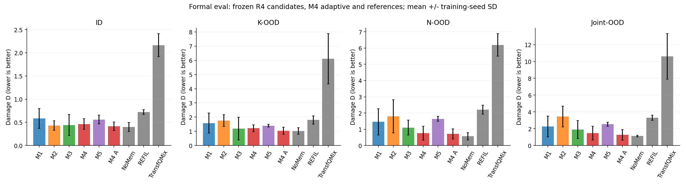
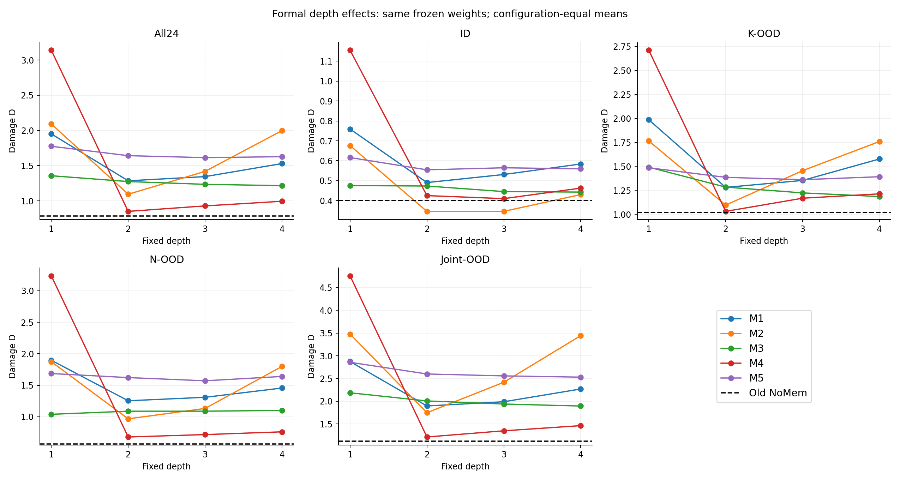
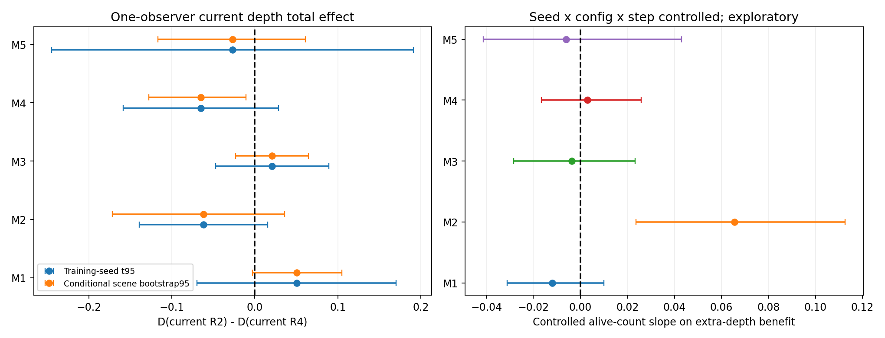
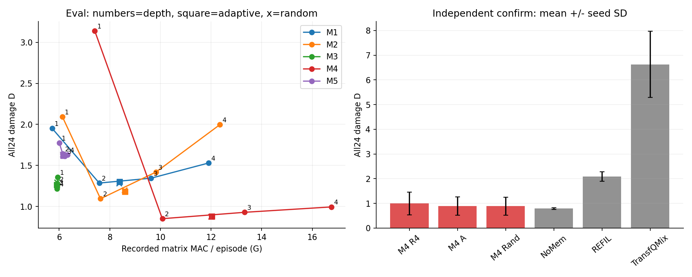
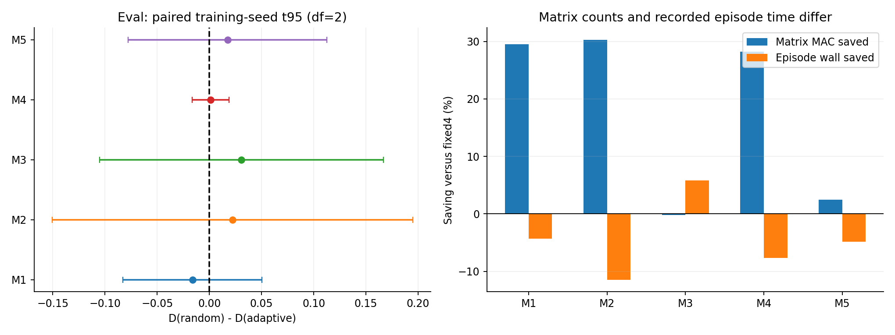
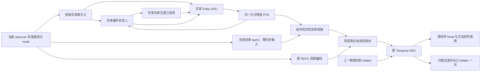

# main1009 完整分析报告：五种循环方法、正式外推与机制证据

更新：2026-10-10。正式数据统一位于 [main1009](../Open-SCORE/outputs/main1009)，本文是本实验唯一完整分析报告。名称沿用已有 `main1009`，不另建 `main_1009` 副本。

## 1. 总结：循环有局部价值，原来的按需深循环故事尚未成立

**本轮并非“循环完全无用”，但也没有实现“简单决策浅循环、复杂决策深循环，并由此稳定改善回报”的原始目标。最有证据的机制是 M4 的实体状态承接与前两轮整合；性能最强、最稳定的仍是旧 NoMem LEAF。**

完整评估给出了三个必须分开的答案：

1. **哪种方法保护效果最好？** 在正式 eval 的 24 配置等权平均中，旧 NoMem 的 D 为 **0.7845±0.0434**；五个新候选中最好的固定出口是 M4 二轮，D 为 **0.8506±0.3446**。独立 confirm 只确认了预先选中的 M4 四轮、自适应、随机三臂；其 D 分别为 **0.9951、0.8900、0.8868**，旧 NoMem 为 **0.7901±0.0395**。这些是样本均值排序，不能把旧 NoMem 的较好均值进一步写成已证明对 M4 的统计显著优势。
2. **循环反馈有没有回报价值？** M4 有直接证据：原生六配置中，切断实体 GRU 的直接 hidden 承接使 D 增加 **3.9286**，训练种子 t95 和物理场景条件 bootstrap95 都为正；一轮到二轮收益 **2.4767** 也通过这两个区间判断。这比门值非零、Q 改变或动作改变更接近方法动机。
3. **当前自适应是否把计算分配给了值得加深的决策？** 没有获得可靠支持。M4 confirm 相对预算匹配随机的奖励收益为 **−0.0033**，种子 t95 为 **[−0.0327, 0.0262]**；Joint-OOD 甚至出现随机优于自适应的三种子一致方向。省掉固定四轮的部分 MAC 不能替代这个检验。

| 本轮要检验的命题 | 结论 | 最关键依据 |
|---|---|---|
| 五种新结构可以训练并完成跨规模评估 | 支持 | 15 个 1M final；完整阶段配额和三个训练种子 |
| M4 的实体状态承接具有冻结策略内的奖励价值 | 支持 | hidden reset 损失 3.9286，两个区间均正 |
| M4 的前两轮有实际价值 | 支持于原生机制池；正式 eval 方向一致 | 原生 R1→R2 双区间正；eval 的 72/72 配置×种子单元二轮优于一轮 |
| M4 继续加深到四轮有价值 | 未支持 | eval 三种子整体均变差；24 配置均值仅 1 个微小改善；CF 五配置的 R2→R4 均值均负 |
| M3 的额外读取轮次有价值 | 局部支持，泛化证据不足 | 原生 R2→R4 收益 0.3127 双区间正；正式 All24 收益仅 0.0580，种子区间跨零 |
| M2 的动态反向反馈有益 | 有积极迹象，证据不足 | 反向切断平均损失 1.3879，但训练种子区间跨零；正常四轮严重劣于二轮 |
| 自适应优于实际预算匹配随机 | 未支持 | 五方法均无稳定种子区间优势；M4 独立确认也未支持 |
| 复杂物理状态更需要深轮 | 尚未确立 | M2 的存活实体斜率有探索性迹象；M4 无相应关系，当前停止器未找到可靠深轮价值 |
| 新方法整体超过旧 NoMem | 未支持 | 旧 NoMem 的 eval/confirm 全局均值与种子稳定性均更好 |
| 原论文跨轮自适应 Fusion 已获验证 | 本轮不能回答 | 五候选改用选中轮次的末端读取，未检验旧跨轮 JK 融合的独立贡献 |

**建议的判断是：科研机制主线优先 M4，表述为“有限步、共享参数的实体状态整合”；当前可以直接用于定稿的性能基础仍保留旧 NoMem。** M3 是“低边际成本的迭代读取”备选研究线。不能为了保留原标题，把 M4 的有限两轮收益重述成四轮按需精炼，也不能把最后一轮的局部—全局残差融合当成原有跨轮 Fusion 的验证。

本轮的重要变化在于：过去主要证明“路径改变计算”；现在 M4 的路径还获得了原生奖励证据。同时，全量 OOD 和独立确认明确暴露了额外加深、自适应规则与旧基线比较的不足。这使故事更具体，也使原来宽泛的动机必须收紧。

## 2. 五个方法：共同基础、结构改动与各自的故事

### 2.1 共同基础：旧 NoMem LEAF、REFIL 局部编码与原时序网络

五候选共同继承 main0928 的 `regir_nomem` 学习配置，保留 **REFIL 局部编码、imagined 分组训练、Temporal GRU、FlexQMIX 和 TD 学习目标**。工作空间维度为 64，实体/reader 注意力为 4 heads，FFN 宽度 128，最多四轮，轮间共享参数。

**NoMem 只表示本步循环 query 不输入跨环境时刻的 GRU hidden。整条策略仍有时序记忆：下游 Temporal GRU 和上一动作特征都保留。** 实体、query 或 slots 的循环状态在每个物理时刻重新初始化。

设 observer 的当前自身特征生成初始 query `b0`，当前实体集合生成初始 tokens `E`，REFIL 的局部读出为 `local`。选中轮次 `r` 的读出经现有 head 产生候选状态和 Q：

```text
b0 = Query(current_self_features, zero_history)
x_r = local + W_fuse(read_r)
candidate_hidden_r = TemporalGRU(x_r, entering_hidden)
Q_r = action_head(candidate_hidden_r)
```

所有候选 hidden 都从同一个进入 hidden 计算；最后只提交被选中的 hidden 一次。候选使用选中轮次的末端读取，**没有旧 LEAF 的跨轮 JK 加权融合**。保留的 `W_fuse` 融合的是局部分支与本轮全局读出，二者含义不能混用。

训练时每个 observer、每个决策独立均匀抽样 1/2/3/4 轮，把深度写入 replay，包括 bootstrap 观测；online、target、Double Q 和 imagined 分支使用同一深度记录。它也区别于旧 rollout 的 episode 级深度与旧 learner 的 minibatch 共享深度。因此新旧整体比较同时包含结构、读取方式、稳定化和深度训练粒度变化，不是单一反馈模块的纯因果消融。

自适应从第二轮开始：合法贪心动作不变，合法中心化 Q 的单位方向变化和候选 hidden 的相对变化均不超过 ID 校准阈值时退出；第四轮强制退出。近零 Q、近并列合法动作等数值条件受到保护。它是**决策稳定性启发式**，并未直接学习“继续一轮的奖励收益”。

实现依据：[候选注册](../Open-SCORE/open_score/algos/__init__.py)、[实体编码器与循环核心](../Open-SCORE/open_score/models/entity_encoder.py)、[学习深度记录](../Open-SCORE/open_score/algos/pymarl/learners/q_learner.py)、[冻结协议与干预](../Open-SCORE/scripts/leaf1009.py)。保留 REFIL 基础意味着贡献应围绕新增的循环状态与读取机制，而非把实体分组训练重新作为本轮创新。[REFIL 原论文](https://proceedings.mlr.press/v139/iqbal21a.html)

### 2.2 M1：读后 query 反馈——下一轮读取由当前读取修正

注册名为 `regir_loop_nomem`，核心 `query_feedback`。实体状态每轮先注入原始观测，再经过共享 attention/FFN：

```text
anchored_entities_r = 0.75 * entities_previous + 0.25 * E
entities_r = shared_context_block(anchored_entities_r)
read_r = Reader(LN(query_previous), entities_r)
candidate_query = b0 + W_feedback(LN(read_r))
gate = sigmoid(W_gate[ LN(query_previous), LN(candidate_query) ])
query_next = (1 - gate) * query_previous + gate * candidate_query
```

只有继续下一轮的 observer 更新 query。实体更新自身不依赖私有 query，通路是单向的“实体→读取→query→再读取”。门的初始 0.5 来自零初始化，不是固定增益或理论最优超参数；0.25 原输入锚定也是冻结设计值，没有收敛保证。

**故事：读取结果可以修正之后读取的关注条件。** 它区别于旧 LEAF/refine 的固定 reader query，也区别于仅把原输入注入实体状态。对应机制切断正常计算 query 更新后，覆盖回 previous query；实体轨迹保留，专门检查读后 query 反馈的作用。

这个故事需要正常反馈相对切断改善奖励；query 位移或动作变化只证明路径被用。若收益仅发生在前两轮，应讲一次有限修正，而非持续深度精炼。

### 2.3 M2：双向反馈——query 继续参与实体关系更新

注册名为 `regir_bidirectional_nomem`，核心 `bidirectional`。继承 M1 的更新，但在实体 attention 的 K/V 后追加当前 observer 的私有 query：

```text
entity_Q = LN(anchored_entities_r)
entity_KV = concatenate(LN(anchored_entities_r), LN(query_previous))
entities_r = shared_attention_and_FFN(entity_Q, entity_KV)
read_r = Reader(LN(query_previous), entities_r)
query_next = gated_query_update(query_previous, read_r, b0)
```

真实实体提供 Q，附加 query 只提供 K/V，不计入物理实体数，不构成跨 observer 通信。它既不预测队友动作，也不回注离散动作偏好，因此不同于旧 feedback/IAR 变体。

**故事：读取修正 query，query 再修正实体，形成 observer 条件的关系精炼闭环。** 这是五者中与最初闭环动机最接近的结构。不过第一轮已追加 `b0`，所以 M2 与 M1 的性能差还包含静态自身条件差异，不能仅归因于动态循环。

`query_update_frozen` 同时去掉动态 reader query 和动态反向影响；`reverse_kv_clamp` 仅把实体侧附加 token 固定为 `b0`，reader query 正常更新。后者第一轮不变，能更直接检验之后的动态反向通路。两个切断损失不能相减拆分独立贡献。

完整故事需要反向切断产生奖励损失，并且额外轮次确有价值。仅有闭环结构而四轮明显劣于二轮，不足以证明持续双向精炼有效。

### 2.4 M3：缓存上下文、迭代 query——降低后续轮次的边际计算

注册名为 `regir_requery_nomem`，核心 `requery`。实体 context 只编码一次，reader K/V 也只投影一次，之后只更新 query 与读取：

```text
context = ContextEncoder(E)                 # once per physical decision
K, V = Reader.project_kv(context)           # cached
read_r = Reader.read_cached(LN(query_previous), K, V)
query_next = gated_query_update(query_previous, read_r, b0)
```

它不反复执行实体自注意力；不同于旧 KV0/ARR——后者固定 K/V 的来源，但实体 Q、残差、FFN 和实体状态仍逐轮更新。

**故事：在固定关系上下文上，以较小边际计算反复修正读取。** 这是计算结构最清楚的轻量路线，但前置实体 context 仍是稠密 attention，不能宣称整个模型随实体数线性扩展。

冻结 query 后，各轮 K/V、query 和 read 都相同，四轮输出与一轮等价。这是结构恒等，不能当成学得收敛；其切断奖励证据也不独立于一轮—四轮比较。若主张有效迭代，应有奖励收益；若主张效率，应给出整个执行链上的回报—成本折衷。

### 2.5 M4：实体 GRU——原观测与注意力消息在循环状态中整合

注册名为 `regir_entitygru_nomem`，核心 `entity_gru`。每个实体拥有本物理时刻内的循环状态，初值是 `E`：

```text
message_r = EntityAttention(LN(entities_previous))
input_r = concatenate(LN(E), LN(message_r))       # 128 dimensions
entities_r = EntityGRU(input_r, entities_previous) # 64-dimensional hidden
entities_r = normalized_residual_FFN(entities_r)
read_r = Reader(LN(b0), entities_r)                # fixed private query
```

同一个 GRUCell 共享于实体和轮次，每轮重新屏蔽无效实体。**Entity GRU 负责当前物理时刻内的关系状态；Temporal GRU 负责跨物理时刻记忆。** 后者原本已存在，不能作为新增贡献。

**故事：利用显式实体状态承接，把原观测与关系消息进行有限步、门控式整合。** 相比旧 attention/FFN 残差循环，它新增了可直接切断的 GRU hidden 路径。

`entity_gru_hidden_reset` 把 GRU 的 hidden 改回 `E`，但 attention 消息仍从上一轮实体状态计算。因此它只去掉直接 GRU 状态承接，不是去掉全部循环；第一轮不会被该切断改变。

本轮最强机制证据对应这条路径。若主要价值在一轮到二轮，正确故事就是有限步整合，而不是复杂状态必须四轮。

### 2.6 M5：竞争式 slots——固定大小工作空间内的迭代聚合

注册名为 `regir_slotgru_nomem`，核心 `slot_gru`。实体 context 只编码一次，四个 slots 用不同可学习 seed 加自身条件初始化。每轮先让每个实体在 slots 间竞争，再对每个 slot 的实体权重归一化：

```text
slots_0[k] = learned_seed[k] + W_own(b0)
logits = slot_query(LN(slots_previous)) @ entity_keys.T / sqrt(64)
competition = softmax(logits, axis=slots)
weights = competition / sum_over_valid_entities(competition)
message = weights @ entity_values
slots_r = SlotGRU(message, slots_previous) + slot_FFN(LN(updated_slots))
read_r = Reader(LN(b0), slots_r)
```

slot 路由是单头 `bmm` 竞争注意力；四 heads 用于前置 context 与末端 reader。没有额外 slot self-attention。它区别于旧 slot/K10 的普通 cross-MHA、slot self-attention 与残差 FFN。

**故事：用有限 slots 竞争聚合实体，并用 slot 状态逐轮整合。** 这一结构与 Slot Attention 的迭代竞争思想有关，但不同 seed 和非重合 slots 不能自动证明角色分工、对象分组或任务专门化。[Slot Attention 原论文](https://papers.nips.cc/paper/2020/hash/8511df98c02ab60aea1b2356c013bc0f-Abstract.html)

`slot_gru_hidden_reset` 只重置 GRU 的直接 hidden，routing query 仍保留上一轮状态；`slot_competition_removed` 改成每个 slot 独立对实体 softmax，从第一轮就改变竞争规则。后者是冻结策略的规则干预，不是重新训练的普通 attention 基线。

若讲 slots 的贡献，正常策略应相对两种干预分别有奖励价值；若讲物理分组，还需独立的实体—slot—行为对应证据。本轮没有提供这种功能分工验证。

## 3. 五个方法的结果与机制分析

### 3.1 数据合并、完整度与统计口径

评估包原路径为 `outputs/main1009_eval/main1009`，已合并到既有 `outputs/main1009`。保留原 15 个 final、15 个 best、训练数据、8,220 条离线 observer 诊断；导入远端冻结文件、正式评估、机制、反事实及图表。

合并后的本目录是正式数据入口。重复来源包和三个点前缀临时统计脚本的删除被自动审批拒绝，暂保留在原路径；它们不构成另一个实验版本，也不参与重复统计。

远端原始文件共有 **3,207,522** 行，其中重复键很多；合并后有 **934,110** 条唯一正式记录。此外保留 **747** 条具有不同回报/终止长度的历史记录，总文件 934,857 行。本机原有 1,226 个键均已被远端正式键覆盖；其中回报不同的 142 个本机历史结果保留。这不是新增训练种子，也不是把重复回放当成更多证据。对合并后原始流重新计算的 **3,294** 个汇总单元，D 与导出结果最大误差 **1.24e-14**，未发现非有限奖励。

去重使用脚本的记录标识：`method / seed / split / arm / config / episode_seed / checkpoint / snapshot_step / agent_id`。正式记录采用远端最后一次写入，与现有 runner 的汇总语义一致。不同历史回报保留在同一 JSONL 中，标记 `run` 与 `official_aggregate=false`，不当作额外独立样本。

| 阶段 | 唯一正式记录 | 完成情况 |
|---|---|---|
| ID 校准 | 21,600 | 完整预定配额 |
| ID 选择 | 36,000 | 完整预定配额 |
| 预算匹配计算池 | 15,000 | 完整预定配额 |
| 固定深度与旧基线正式评估 | 496,800 | 完整预定配额 |
| 自适应与随机正式评估 | 216,000 | 完整预定配额 |
| 专属原生机制 | 4,860 | 完整预定配额 |
| 反事实记录 | 14,250 | 750 factual、9,000干预尾段；另有4,500条R4复用记录 |
| 独立确认 | 129,600 | 完整预定配额 |

所有 15 个候选均来自 1M final，环境元数据为 `had-workbench-2.1.0`、`rebuild-calibrated-v3-r7-target-initialization`。旧 NoMem seed0 实际 checkpoint 为 `final@1000006`，其余参考和候选为 `final@1000000`；6 个物理步的最终批次超出如实保留，没有替换权重。

**D 为目标伤害，越低越好；奖励为 −D。本轮没有统一胜率字段，因此不将伤害结果改写成胜率。** 每配置每种子每正式臂 300 场；先求每个训练种子的配置等权平均，再报告三个种子的均值和样本 SD。All24 对 24 配置等权：ID/K/N/Joint 分别 4/4/6/8 配置，另有 `(5,5,2)`、`(10,10,2)` 两个 Extra；不能把四组等权平均当作 All24。

配对收益定义为 `D对照−D目标`，区间使用三个训练种子差的 t95（df=2）。场景 bootstrap 条件于这三份已训练权重；它与训练种子不确定性不是同一问题。原生机制每配置十场、CF 每配置十个场景，不能用这批小池替代完整 300 场外推。

ID calibration 只用 42000–42039，selection 只用 40000–40099；正式 eval 使用 9000–9299，独立 confirm 使用 110000–110299。M4 是预先按 ID 锁定的家族。`qualified` 可仅凭相对四轮节省 MAC 通过，并不证明有价值的状态定向分配。二轮是后来正式 eval 中观察到的优良出口，不能追认成已被 confirm 确认的部署方法。

完整聚合见 [summary.json](../Open-SCORE/outputs/main1009/summary.json)、[loop_summary.csv](../Open-SCORE/outputs/main1009/loop_summary.csv)；冻结协议见 [selection.json](../Open-SCORE/outputs/main1009/selection.json)、[calibration.json](../Open-SCORE/outputs/main1009/calibration.json)、[budgets.json](../Open-SCORE/outputs/main1009/budgets.json)。

### 3.2 横向比较：原训练验证与正式外推不是同一结论

| 方法 | 训练终点 ID D±seed SD | 末五个验证点平均 D |
|---|---|---|
| M1 | 0.5180±0.2450 | 0.5509 |
| M2 | 0.3522±0.0856 | 0.4159 |
| M3 | 0.3938±0.2517 | 0.3763 |
| M4 | 0.4020±0.1304 | 0.3687 |
| M5 | 0.5192±0.1236 | 0.4284 |
| 旧 NoMem | 0.3728±0.0662 | 0.6290 |
| REFIL | 0.7381±0.1225 | 0.7913 |
| TransfQMix | 2.2962±0.5236 | 2.2340 |

原训练验证池中 M2 的终点均值最好，M4 的末五点均值较好；正式外推却由 M4 的二轮出口取得新候选最佳均值，旧 NoMem 全局仍领先。这不矛盾：训练验证只有训练 ID 混合池，终点受小场景池和 seed 波动影响，不能替代独立 ID/OOD。


以下先使用候选四轮与原参考执行比较，另列 M4 自适应；不在 OOD 中为每个方法挑最优深度。

| 方法/出口 | ID | K-OOD | N-OOD | Joint-OOD | All24 |
|---|---|---|---|---|---|
| M1 四轮 | 0.5837±0.2144 | 1.5775±0.7150 | 1.4554±0.8098 | 2.2697±1.2416 | 1.5298±0.7878 |
| M2 四轮 | 0.4300±0.1006 | 1.7598±0.4188 | 1.7984±1.0225 | 3.4432±1.2364 | 1.9976±0.6301 |
| M3 四轮 | 0.4426±0.2294 | 1.1855±0.8084 | 1.1000±0.4586 | 1.8941±1.0662 | 1.2162±0.6558 |
| M4 四轮 | 0.4625±0.1135 | 1.2138±0.2435 | 0.7599±0.4304 | 1.4630±0.8101 | 0.9940±0.4455 |
| M5 四轮 | 0.5593±0.0959 | 1.3923±0.0917 | 1.6395±0.1555 | 2.5304±0.2365 | 1.6275±0.0837 |
| M4 自适应 | 0.4164±0.0918 | 1.0321±0.2471 | 0.7094±0.3191 | 1.2658±0.6340 | 0.8750±0.3573 |
| 旧 NoMem | 0.4009±0.0969 | 1.0197±0.2412 | 0.5666±0.2258 | 1.1196±0.1043 | 0.7845±0.0434 |
| REFIL | 0.7213±0.0526 | 1.7994±0.2961 | 2.2092±0.2793 | 3.3059±0.3097 | 2.1394±0.1719 |
| TransfQMix | 2.1653±0.2477 | 6.1112±1.7690 | 6.1924±0.6944 | 10.6059±2.7065 | 6.6379±1.3225 |



| 方法 | R1 | R2 | R3 | R4 | R2→R4奖励收益 | 种子 t95 |
|---|---|---|---|---|---|---|
| M1 | 1.9508±1.0340 | 1.2849±0.7802 | 1.3444±0.7726 | 1.5298±0.7878 | -0.2448 | [-0.4905, +0.0008] |
| M2 | 2.0926±1.3055 | 1.0939±0.7085 | 1.4185±0.5390 | 1.9976±0.6301 | -0.9037 | [-1.1001, -0.7073] |
| M3 | 1.3569±0.9253 | 1.2742±0.7758 | 1.2346±0.7088 | 1.2162±0.6558 | +0.0580 | [-0.2407, +0.3568] |
| M4 | 3.1390±0.9961 | 0.8506±0.3446 | 0.9284±0.3927 | 0.9940±0.4455 | -0.1435 | [-0.4581, +0.1711] |
| M5 | 1.7753±0.3199 | 1.6419±0.1785 | 1.6139±0.0889 | 1.6275±0.0837 | +0.0144 | [-0.3136, +0.3423] |



**不能仅用四轮胜过一轮来说明持续精炼。** M1/M2/M4 的主要优势发生在前两轮；M3 的较深读取均值有缓慢收益；M5 缺少清晰深度规律。以下逐个分析这些差异与各自故事。

既有共享物理前缀上的离线切断，与各方法自己闭环执行的原生切断，提供不同层次的证据。下表把两者放在一起；原生正差表示切断使伤害增加。

| 方法 | 专属切断 | 离线动作变化% | 原生D切断−D正常 | 种子 t95 | 场景条件95 | 预设判断 |
|---|---|---|---|---|---|---|
| M1 | query_update_frozen | 13.64 | +0.0007 | [-0.1354, +0.1369] | [-0.3298, +0.3160] | 证据不足 |
| M2 | query_update_frozen | 21.79 | +1.5921 | [-0.1966, +3.3807] | [+1.2266, +1.9749] | 证据不足 |
| M2 | reverse_kv_clamp | 15.19 | +1.3879 | [-0.1753, +2.9511] | [+0.9976, +1.8046] | 证据不足 |
| M3 | query_update_frozen | 14.69 | +0.4244 | [-0.8962, +1.7449] | [+0.2064, +0.6492] | 证据不足 |
| M4 | entity_gru_hidden_reset | 57.16 | +3.9286 | [+2.3697, +5.4874] | [+3.4289, +4.4499] | 支持 |
| M5 | slot_gru_hidden_reset | 25.62 | +0.0806 | [-1.5520, +1.7132] | [-0.2691, +0.4114] | 证据不足 |
| M5 | slot_competition_removed | 30.25 | +0.1234 | [-1.1014, +1.3481] | [-0.2885, +0.5060] | 证据不足 |

原生六配置全部使用同一批冻结 final；上述区间为名义95%区间。动作、Q 和 hidden 敏感性只证明路径参与计算，不能替代完整策略的奖励损失。

### 3.3 M1：读后反馈被使用，但没有证明它带来奖励收益

| 出口 | ID | K-OOD | N-OOD | Joint-OOD | All24 |
|---|---|---|---|---|---|
| fixed1 | 0.7590±0.4247 | 1.9864±1.0907 | 1.8970±0.9288 | 2.8734±1.5645 | 1.9508±1.0340 |
| fixed2 | 0.4904±0.2208 | 1.2812±0.5902 | 1.2534±0.9202 | 1.8958±1.1966 | 1.2849±0.7802 |
| fixed3 | 0.5309±0.2114 | 1.3536±0.6477 | 1.3085±0.8529 | 1.9887±1.2048 | 1.3444±0.7726 |
| fixed4 | 0.5837±0.2144 | 1.5775±0.7150 | 1.4554±0.8098 | 2.2697±1.2416 | 1.5298±0.7878 |
| adaptive | 0.4765±0.1834 | 1.3229±0.6342 | 1.2916±0.9191 | 1.9073±1.2044 | 1.2997±0.7816 |
| random | 0.5042±0.1818 | 1.3322±0.6055 | 1.2570±0.9218 | 1.8661±1.1860 | 1.2835±0.7744 |

正式 All24 中，二轮比一轮 D 降低 0.6659；从二轮继续到四轮，D 反增 **0.2448**，三个训练种子方向都恶化，24 个配置均值中四轮没有一次优于二轮。矩阵 MAC/episode 同时增加 **57.0%**。这种模式适合有限步修正，不能支持持续加深。

然而其专属 query 冻结干预的原生 D 损失只有 **0.0007**，两个区间均跨零，三个种子方向也不一致。离线切断造成 **13.64%** 合法动作变化，只能说明反馈进入了决策计算。因此 M1 的一轮—二轮收益可能包含实体 context 再更新的作用，当前不能归因成 query 反馈本身的奖励贡献。

自适应 All24 D 为 1.2997，随机为 1.2835；匹配预算子集中的自适应奖励收益 **−0.0179**，种子区间跨零。它也未超过旧 NoMem，且 seed2 的自适应 D 达 2.0968。**结论：当前不宜作为核心 query-feedback 论文主线。**

### 3.4 M2：闭环最接近原动机，但额外深轮明显退化

| 出口 | ID | K-OOD | N-OOD | Joint-OOD | All24 |
|---|---|---|---|---|---|
| fixed1 | 0.6761±0.2887 | 1.7651±0.9375 | 1.8741±0.9188 | 3.4778±2.5779 | 2.0926±1.3055 |
| fixed2 | 0.3456±0.0762 | 1.0966±0.6438 | 0.9663±0.6323 | 1.7472±1.3246 | 1.0939±0.7085 |
| fixed3 | 0.3458±0.0532 | 1.4553±0.3793 | 1.1313±0.5184 | 2.4178±1.0889 | 1.4185±0.5390 |
| fixed4 | 0.4300±0.1006 | 1.7598±0.4188 | 1.7984±1.0225 | 3.4432±1.2364 | 1.9976±0.6301 |
| adaptive | 0.3511±0.0727 | 1.2020±0.4767 | 0.9744±0.5625 | 1.9353±1.1434 | 1.1763±0.6025 |
| random | 0.3431±0.0556 | 1.1876±0.5194 | 1.0025±0.5308 | 1.9888±1.2040 | 1.1983±0.6220 |

二轮的 ID 为 **0.3456±0.0762**，是有竞争力的局部结果；但 All24 从二轮的 1.0939 加深到四轮的 1.9976，D 增加 **0.9037**。三个种子均退化，四轮相对二轮的奖励收益 t95 为 **[−1.1001, −0.7073]**；24 个配置均值仅 1 个四轮较好。Joint-OOD 四轮 D 为 3.4432，远差于二轮的 1.7472。

专属原生 query 冻结损失 **1.5921**，reverse KV clamp 损失 **1.3879**，三个种子均为正，场景条件区间也为正；但两个训练种子区间均跨零，依照预设标准仍为证据不足。离线反向切断改变 **15.19%** 动作，表明路径实际被用。

CF 控制配置、seed 和快照步数后，物理存活数量与一次 R2→R4 收益的斜率有三种子一致的正向探索迹象（第 3.8 节）；但总体该单次收益仍为负，完整四轮策略也明显更差。它提示可能存在局部适用状态，不等于当前停止器能识别这些状态。

自适应比四轮好，主要是避免四轮退化；相对实际匹配随机的收益没有稳定区间。**结论：结构故事很好，当前效果不支持将“持续双向精炼”作为主张。** 自反馈放大偏差、更多轮次改变实体与 query 的分布，是与结果相容的机制假设，尚未被直接实验拆分验证。

### 3.5 M3：唯一有小机制池深轮支持的轻量路线，完整外推仍不稳

| 出口 | ID | K-OOD | N-OOD | Joint-OOD | All24 |
|---|---|---|---|---|---|
| fixed1 | 0.4753±0.2519 | 1.4918±1.2875 | 1.0384±0.4006 | 2.1859±1.6530 | 1.3569±0.9253 |
| fixed2 | 0.4731±0.2646 | 1.2841±0.9077 | 1.0875±0.4763 | 2.0066±1.3216 | 1.2742±0.7758 |
| fixed3 | 0.4451±0.2249 | 1.2238±0.8481 | 1.0880±0.4931 | 1.9387±1.1697 | 1.2346±0.7088 |
| fixed4 | 0.4426±0.2294 | 1.1855±0.8084 | 1.1000±0.4586 | 1.8941±1.0662 | 1.2162±0.6558 |
| adaptive | 0.4567±0.2440 | 1.2456±0.8844 | 1.1069±0.5068 | 1.9881±1.2496 | 1.2625±0.7465 |
| random | 0.4502±0.2272 | 1.3485±1.0658 | 1.0791±0.4513 | 2.0540±1.3718 | 1.2932±0.8010 |

正式 All24 D 随固定深度为 **1.3569→1.2742→1.2346→1.2162**。二轮到四轮的平均收益 **0.0580**，24 个配置均值中 17 个改善；但主要收益来自 seed1，三个种子收益为 **−0.0266、0.1957、0.0049**，t95 **[−0.2407, 0.3568]**。N-OOD 四轮均值反而略差于二轮，不能将均值下降描述为普遍加深收益。

原生六配置十场池中，R2→R4 收益 **0.3127**，三个种子均为正，种子 t95 **[0.0152, 0.6102]**，场景条件区间 **[0.0554, 0.5543]**，支持这个小池上的额外读取价值。但小池到完整 24 配置没有复现稳健训练种子证据，必须两者一起呈现。

冻结 query 的原生奖励与 fixed1 一致，属于结构预期；不要把二者当成两条独立奖励证据。离线动作变化 **14.69%** 表明 query 循环确实影响读取。

M3 四轮的记录 MAC/episode 约 **5.909G**，低于 M4 四轮的 16.757G，但 D 也更高。这是候选之间的成本—保护折衷，不是已经证明优于旧 NoMem；旧 NoMem 没有这套 MAC 计数。额外读取的单步边际成本小，加上轨迹长度变化，使整局 MAC 随深度几乎不变；不应把它说成后续读取免费。自适应相对 fixed4 的 MAC 节省为 **−0.17%**，也没有匹配随机的稳定优势。

**结论：可保留“固定上下文上的低成本迭代读取”研究线，优先于宣称自适应加深。** 它是最贴近保留较深循环价值的备选，但当前不能凭小池正结果替代正式外推和旧 NoMem 对照。

### 3.6 M4：最清楚的反馈机制与有限步收益，也是冻结协议赢家

| 出口 | ID | K-OOD | N-OOD | Joint-OOD | All24 |
|---|---|---|---|---|---|
| fixed1 | 1.1550±0.2904 | 2.7113±0.6569 | 3.2376±1.3198 | 4.7592±1.5434 | 3.1390±0.9961 |
| fixed2 | 0.4248±0.1250 | 1.0310±0.2513 | 0.6781±0.3181 | 1.2136±0.5866 | 0.8506±0.3446 |
| fixed3 | 0.4097±0.1045 | 1.1684±0.2000 | 0.7161±0.3714 | 1.3494±0.7267 | 0.9284±0.3927 |
| fixed4 | 0.4625±0.1135 | 1.2138±0.2435 | 0.7599±0.4304 | 1.4630±0.8101 | 0.9940±0.4455 |
| adaptive | 0.4164±0.0918 | 1.0321±0.2471 | 0.7094±0.3191 | 1.2658±0.6340 | 0.8750±0.3573 |
| random | 0.4020±0.1286 | 1.1314±0.1862 | 0.6672±0.3800 | 1.2635±0.6362 | 0.8761±0.3637 |

**正式 eval 二轮相对一轮在 72/72 个配置×训练种子单元都改善**，All24 D 从 3.1390 降到 0.8506，按整体均值计算下降 **72.90%**。原生机制池中 R1→R2 的三个种子收益 **1.9941、1.9946、3.4415**，两个区间均为正。这证明有限轮次的当前实体状态更新具有价值，而非单纯重复同样计算。

**直接状态承接还有独立奖励证据：** 正常四轮原生 D 为 0.9445，hidden reset 后为 4.8730，损失 **3.9286**；种子 t95 **[2.3697, 5.4874]**，场景条件区间 **[3.4289, 4.4499]**。对应离线动作变化 **57.16%**。这里验证的是已训练 M4 内部对直接 GRU 状态承接的依赖，不等于证明 GRU 优于所有重新训练的残差或 attention 架构。


但额外加深出现相反现象。eval 二轮、三轮、四轮 All24 D 为 **0.8506、0.9284、0.9940**；三个种子四轮均劣于二轮，24 配置均值中只有 `(8,8,2)` 改善 0.0093，且四轮 MAC/episode 比二轮增加 **66.3%**。绝对配对收益 t95 仍跨零，所以不能把同方向样本结果写成已经证明二轮在所有未来训练种子中严格胜过四轮。

最难配置 `(30,30,12)` 的二轮 D 均值 **1.7122**，低于旧 NoMem 的 **2.1674**，是值得保留的样本迹象；但三个种子的配对收益为 **2.1114、−1.3767、0.6310**，区间很宽，不能通过挑最难配置声称稳健 OOD 优势。

**独立 confirm：**

| 方法/出口 | ID | K-OOD | N-OOD | Joint-OOD | All24 |
|---|---|---|---|---|---|
| M4 fixed4 | 0.4304±0.1144 | 1.1962±0.2692 | 0.7899±0.4624 | 1.4736±0.8273 | 0.9951±0.4655 |
| M4 adaptive | 0.3864±0.1010 | 1.0665±0.2373 | 0.7313±0.3862 | 1.3093±0.6432 | 0.8900±0.3752 |
| M4 random | 0.3708±0.1076 | 1.1256±0.1927 | 0.7078±0.3673 | 1.2865±0.6407 | 0.8868±0.3642 |
| 旧 NoMem original | 0.3587±0.1029 | 1.0714±0.2473 | 0.6084±0.2492 | 1.1138±0.0945 | 0.7901±0.0395 |
| REFIL original | 0.6741±0.0894 | 1.7009±0.2803 | 2.1678±0.2446 | 3.2771±0.3704 | 2.0857±0.1905 |
| TransfQMix original | 2.1351±0.2998 | 6.0346±1.7182 | 6.3147±0.6910 | 10.5447±2.7089 | 6.6259±1.3394 |

confirm 中 M4 自适应相对 REFIL 的平均奖励收益 **1.1956**，t95 **[0.6246, 1.7666]**；相对 TransfQMix 为 **5.7359**，区间 **[3.3376, 8.1341]**。这支持其在本 HAD 实现与预算下相对这两个参考的效果，但不能代表在它们原论文任务上的普遍排名。

相对旧 NoMem，M4 自适应的均值更差 0.1000，配对区间跨零；M4 四轮在 24 配置的均值全部更差。旧 NoMem 的 All24 seed SD 仅 **0.0395**，M4 自适应为 **0.3752**。seed1 的 N/Joint-OOD 持续较弱，confirm 自适应 D 为 **1.1749/2.0498**，旧 NoMem 同 seed 为 **0.5019/1.0085**。

confirm 自适应/随机 D 为 **0.8900/0.8868**，不存在稳定自适应优势；Joint-OOD 的自适应相对随机奖励收益 **−0.0228**，种子区间 **[−0.0324, −0.0133]**。二轮没有进入 confirm，因此正式新候选最佳的 fixed2 仍是探索结果。

**结论：M4 最适合讲“实体状态承接与有限步整合”，不适合讲“四轮持续精炼”或“已学会按需分配深度”。** 它是五个候选中最值得继续验证的主方法，但并未完成替代旧 NoMem 的证据链。

### 3.7 M5：slots 不相同，但竞争与状态承接的奖励价值尚未证明

| 出口 | ID | K-OOD | N-OOD | Joint-OOD | All24 |
|---|---|---|---|---|---|
| fixed1 | 0.6160±0.0536 | 1.4859±0.1348 | 1.6859±0.5239 | 2.8571±0.6088 | 1.7753±0.3199 |
| fixed2 | 0.5544±0.0961 | 1.3860±0.0627 | 1.6216±0.2644 | 2.6001±0.4179 | 1.6419±0.1785 |
| fixed3 | 0.5647±0.1183 | 1.3616±0.1229 | 1.5709±0.2100 | 2.5578±0.2301 | 1.6139±0.0889 |
| fixed4 | 0.5593±0.0959 | 1.3923±0.0917 | 1.6395±0.1555 | 2.5304±0.2365 | 1.6275±0.0837 |
| adaptive | 0.5604±0.1033 | 1.3394±0.0845 | 1.5941±0.2188 | 2.5530±0.3200 | 1.6154±0.1271 |
| random | 0.5818±0.1043 | 1.3694±0.1334 | 1.5727±0.3225 | 2.5926±0.3582 | 1.6328±0.1611 |

All24 二轮、三轮、四轮 D 为 **1.6419、1.6139、1.6275**，没有清晰单调深度规律。四轮 seed SD 为 0.0837 较小，但均值较高，属于稳定的较弱表现，不能改写成稳健领先。

原生 slot hidden reset 的 D 损失 **0.0806**，competition removed 的损失 **0.1234**，训练种子和场景条件区间均跨零，且 seed2 两条路径的干预方向都改善奖励。离线对应动作变化 **25.62%/30.25%**，足以证明这些路径参与计算，不足以证明它们改善保护效果。

既有 slot 诊断显示表示没有完全坍缩，但竞争熵随轮次约 **0.726→0.822**，slot spread 约 **0.335→0.306**，并不是越来越清晰的物理分工证据。图中的表示几何与路由指标不能替代目标/角色对应验证。


自适应仅节省 fixed4 的 **2.49%** MAC，也无预算匹配随机的稳定优势。**结论：暂不作为 slots 分工、可扩展竞争或有效动态计算的论文主线。** 固定 slot 数减小了后续工作空间，但前置实体 context 仍稠密，且最终回报没有体现清楚的结构收益。

### 3.8 状态级反事实：困难状态是否更需要四轮？

CF 从各方法自身 fixed4 前缀取 step 0/5/10，每快照最多两个存活 observer，仅改变一个 observer 当前深度为 1/2/4；其后决策执行四轮。**当前深度同时影响当前动作和提交 hidden，尾局差是总效应，不是纯动作因果。**

配置为 `(4,4,2)`、`(10,10,3)`、`(30,30,2)`、`(50,50,2)`、`(30,30,12)`，每配置十个物理场景，三份训练权重。每方法 450 个 snapshot、50 个配置×物理场景簇；不能把同快照 observer、同场景步数或三个模型共享的物理场景当成独立环境样本。

以下 `Δ2 = D(当前强制二轮)−D(当前四轮)`，正值才代表加深有益。区间先合并 observer/step 到 seed×配置×场景，再配置等权；条件 bootstrap 按配置重采样物理场景并联合保留三份权重。

| 方法 | Δ2 | seed 0/1/2 | 种子 t95 | 场景条件95 | 深轮更好/更差/不变% |
|---|---|---|---|---|---|
| M1 | +0.0505 | +0.0929/+0.0605/-0.0021 | [-0.0695, +0.1704] | [-0.0029, +0.1047] | 10.56/8.44/81.00 |
| M2 | -0.0619 | -0.0259/-0.0803/-0.0795 | [-0.1393, +0.0156] | [-0.1717, +0.0359] | 11.67/14.44/73.89 |
| M3 | +0.0209 | -0.0046/+0.0172/+0.0500 | [-0.0474, +0.0892] | [-0.0229, +0.0645] | 4.56/3.22/92.22 |
| M4 | -0.0650 | -0.0379/-0.1080/-0.0490 | [-0.1586, +0.0287] | [-0.1275, -0.0105] | 4.89/7.11/88.00 |
| M5 | -0.0268 | +0.0675/-0.1060/-0.0418 | [-0.2447, +0.1911] | [-0.1167, +0.0607] | 5.67/6.89/87.44 |



| 方法 | (4,4,2) | (10,10,3) | (30,30,2) | (50,50,2) | (30,30,12) |
|---|---|---|---|---|---|
| M1 | -0.0226 | -0.0285 | +0.0886 | -0.0004 | +0.2152 |
| M2 | +0.0167 | -0.1029 | -0.1108 | -0.0535 | -0.0588 |
| M3 | +0.0066 | -0.0479 | +0.0043 | +0.0372 | +0.1041 |
| M4 | -0.0384 | -0.1020 | -0.0615 | -0.0548 | -0.0682 |
| M5 | +0.0389 | -0.0228 | -0.0778 | +0.0049 | -0.0770 |

M4 五个 CF 配置的 Δ2 均值都为负；900 个干预中，**44 个四轮更好、64 个四轮更差、792 个伤害不变**。当前 R1→R4 的总效应也为负（−0.1041），且两个区间均负。但它发生在四轮策略生成的前缀上，不能外推成整条策略一直执行一轮更好；完整 fixed1 明显较差。

M4 当前二轮与四轮动作相同的 624 条中，仍有 33 条终局 D 改变（13 正、20 负），说明 hidden 通路确实会影响后续。被当前自适应规则选为四轮的 145 条，Δ2 描述均值反而为 **−0.1955**，也没有提供“停止器识别了深轮受益状态”的积极证据；这个条件均值不是 observer 独立显著性检验。

控制 `seed×配置×step` 固定效应，同时用物理存活数量与共同最近敌机竞争程度解释 Δ2，得到：

| 方法 | 存活数量斜率 | 条件95 | 竞争斜率 | 条件95 | partial R² |
|---|---|---|---|---|---|
| M1 | -0.01192 | [-0.0311, +0.0099] | +0.00776 | [-0.0103, +0.0287] | 0.003677 |
| M2 | +0.06555 | [+0.0236, +0.1126] | +0.00986 | [-0.0315, +0.0582] | 0.026105 |
| M3 | -0.00370 | [-0.0283, +0.0233] | +0.01346 | [+0.0000, +0.0299] | 0.007054 |
| M4 | +0.00303 | [-0.0166, +0.0260] | +0.00121 | [-0.0140, +0.0157] | 0.000299 |
| M5 | -0.00603 | [-0.0413, +0.0430] | -0.01575 | [-0.0476, +0.0156] | 0.004147 |

M2 存活数量斜率的三个种子均为正，种子区间也为正，是可以保留的**探索性局部线索**。但它只说明在固定四轮前缀中，存活数量较多时一次加深的相对价值更高，不保证条件收益为正，也不证明整个四轮策略有益；M2 的总体 Δ2 仍为负，完整四轮更差，实际自适应也未稳定胜过随机。

M4 两个物理指标几乎没有解释力，partial R² **0.000299**。M3 competition 的条件区间下界仅 0.000026，训练种子方向不一致；五方法×两指标共有十个探索性比较，未进行家族多重校正，不能选取这个边缘结果作为已确认规律。step/config 分层结果同样属于探索分析。

本次早期 snapshot 中 observed/visible/physical 数量恰相等，但环境会保留被毁 target 的观测槽位，因此它们一般不等价；`nearest_blue_target_distance` 包含被毁目标，本报告没有把它当作最近存活目标威胁距离。**现有物理竞争与存活数量分析不能支撑原来统一的简单/复杂深度分配故事。**

### 3.9 实际成本、自适应与随机：节省矩阵计算不等于有效分配或时延加速

| 方法/出口 | MAC/episode (G) | 记录episode时长(s) | 平均深度 | All24 seed 0/1/2 D |
|---|---|---|---|---|
| M1 fixed2 | 7.584 | 3.740 | 2.000 | 1.2661/0.5143/2.0744 |
| M1 fixed4 | 11.909 | 4.350 | 4.000 | 1.6250/0.6986/2.2656 |
| M1 adaptive | 8.392 | 4.537 | 2.391 | 1.2677/0.5346/2.0968 |
| M1 random | 8.372 | 4.344 | 2.394 | 1.2222/0.5416/2.0868 |
| M2 fixed2 | 7.633 | 1.407 | 2.000 | 1.8416/1.0076/0.4325 |
| M2 fixed4 | 12.352 | 1.672 | 4.000 | 2.6580/1.9319/1.4029 |
| M2 adaptive | 8.611 | 1.864 | 2.440 | 1.7663/1.2006/0.5620 |
| M2 random | 8.583 | 1.728 | 2.432 | 1.8452/1.1451/0.6046 |
| M3 fixed2 | 5.916 | 1.325 | 2.000 | 0.7753/2.1680/0.8793 |
| M3 fixed4 | 5.909 | 1.443 | 4.000 | 0.8019/1.9723/0.8744 |
| M3 adaptive | 5.918 | 1.359 | 2.174 | 0.7706/2.1215/0.8955 |
| M3 random | 5.914 | 1.286 | 2.443 | 0.7700/2.2154/0.8943 |
| M4 fixed2 | 10.075 | 1.374 | 2.000 | 0.6529/1.2485/0.6504 |
| M4 fixed4 | 16.757 | 1.551 | 4.000 | 0.8302/1.4982/0.6537 |
| M4 adaptive | 12.032 | 1.670 | 2.588 | 0.6980/1.2862/0.6408 |
| M4 random | 11.997 | 1.540 | 2.608 | 0.6992/1.2944/0.6348 |
| M5 fixed2 | 6.139 | 1.318 | 2.000 | 1.4615/1.8185/1.6456 |
| M5 fixed4 | 6.325 | 1.449 | 4.000 | 1.5341/1.6522/1.6960 |
| M5 adaptive | 6.168 | 1.519 | 2.237 | 1.4720/1.7142/1.6600 |
| M5 random | 6.137 | 1.419 | 2.173 | 1.4574/1.7741/1.6669 |

MAC 是记录范围内执行的矩阵乘加，不包含所有元素操作，不等于全部 FLOPs；完整 episode 的 MAC 还受到轨迹长度和存活数量影响。实际时长包含环境、调度与诊断成本，且不同阶段运行条件明显不同，不能据此宣称硬件无关的推理加速。参考方法的 `macs=0` 是**未记录占位**，不是零计算，因此不能与其进行 MAC 倍数比较。



| 方法/阶段 | 实际匹配单元 | 三个seed均匹配配置 | 匹配子集 A对随机奖励收益 | 种子 t95 | A相对R4节省MAC% |
|---|---|---|---|---|---|
| M1 | 71/72 | 23/24 | -0.01786 | [-0.0895, +0.0537] | 29.54 |
| M2 | 64/72 | 20/24 | +0.03049 | [-0.1685, +0.2294] | 30.29 |
| M3 | 72/72 | 24/24 | +0.03067 | [-0.1052, +0.1665] | -0.17 |
| M4 | 72/72 | 24/24 | +0.00114 | [-0.0164, +0.0187] | 28.20 |
| M5 | 72/72 | 24/24 | +0.01741 | [-0.0778, +0.1126] | 2.49 |
| M4 confirm | 71/72 | 23/24 | -0.00510 | [-0.0353, +0.0251] | 28.13 |

预算冻结文件的 120 个方法×配置预测都标为可匹配；实际 eval/confirm 的 432 个配置×seed 比较中有 **10 个**超出 5% 容差：M1 1 个、M2 8 个、M4 confirm 1 个。不能因为全局 MAC 均值接近，就声称每个单元都匹配。剔除任一 seed 不匹配的整个配置后，五方法及 M4 confirm 仍没有稳定自适应奖励优势。

M4 eval 自适应相对 fixed4 节省 **28.20%** MAC，confirm 为 **28.13%**；对应已记录 episode 时长反而增加 **7.65%/1.10%**。这说明停止判据与额外候选状态检查存在实际开销，当前可以报告矩阵计数节省，不能写成已经实现时间加速。



## 4. 最后的分析与论文故事选择

### 4.1 本轮实际回答了什么

**性能、机制与原动机的赢家并不相同。** 旧 NoMem 赢得全量样本的保护效果与训练种子稳定性；M4 赢得最清楚的直接反馈奖励证据和有限步整合证据；M3 是唯一在预设六配置机制池中通过二轮到四轮奖励检验的候选；M2 有与物理复杂度相关的局部探索线索。不能把这四个结果拼成同一个已被验证的方法故事。

循环并不是必然无用。M4 的前两轮与 EntityGRU hidden 承接确有作用，回答了最初“额外轮次是否只是重复计算”的一部分质疑。但**“存在有用递归”不推出“更多递归更好”，也不推出“目前停止器知道什么时候该继续”**。

M1/M2/M4 的后续轮次持续改变实体/query 状态，原训练又没有保证出口回报单调改善；稳定性阈值只看 Q/hidden 变化，没有监督继续计算的回报价值。由此导致状态过度修正、反馈放大或停止目标与回报不一致，是与数据相容的解释。它们仍是机制假设：当前干预无法单独分解错误动作、hidden 后效与表征漂移。

稠密 attention 第一轮已经可访问所有合法实体，所以不能用“更多轮才能看到更远实体”解释深度。更合理的解释单位是**本步内部状态吸收已有关系消息后进行修正**；对 M4，证据支持有限修正，对 M3，证据支持部分池上的反复查询。

### 4.2 如果要选择一个有循环的主方法：优先 M4，但收紧故事

建议主题为：**“共享循环中的实体状态承接，使当前决策获得有限步关系整合。”** 它有一个清楚的机制对象（EntityGRU hidden）、一个保持其他消息计算的直接干预、一个强奖励损失，以及前两轮一致方向的收益；比“门不为零”“slots 不一样”更能经受审稿追问。

可使用如下研究结论表述：

> 在保留局部编码与跨时刻记忆的策略中，当前时刻内的实体状态承接具有可观测的奖励价值。有限迭代能够整合关系消息；继续加深并不保证改善，现有稳定性停止器也未稳定优于计算预算匹配的随机出口。

但今天还不能把 M4 写成已经优于旧 LEAF 的最终新方法。它的 best-looking fixed2 来自 eval，而 confirm 未包含二轮；相对旧 NoMem 的平均性能与 seed 稳定性也没有优势。因此：

- **如果现在必须定稿：** 保留旧 NoMem 为性能主方法，把 main1009 作为循环设计的机制探索；弱化原论文对持续深循环、按需计算及跨轮 Fusion 的独立提升宣称。
- **如果循环是下一版论文的核心：** 以 M4 为优先候选，固定“有限步状态整合”的动机，先补闭合的贡献证据，再决定是否替换旧主方法。不要在本轮 OOD 上继续重排方法、阈值或挑种子。

### 4.3 五种故事的最终取舍

| 方法 | 可保留的故事 | 当前断点 | 本轮建议 |
|---|---|---|---|
| M1 | 当前读取修正后续 query | query 切断没有奖励损失；四轮不如二轮 | 不作为主要贡献 |
| M2 | observer 条件的双向反馈闭环 | 深轮有明确整体退化；反馈奖励种子区间不稳；停止器无随机优势 | 保留复杂度局部线索，作为后续稳定化方向 |
| M3 | 固定 context 上的低边际成本迭代读取 | 小池深轮收益未稳健推广；尚无旧 NoMem 成本优势或独立确认 | 第二研究优先级；不要主打自适应预算 |
| M4 | 有限步实体状态承接与消息整合 | fixed2 未独立确认，未超过旧 NoMem；四轮与状态定向分配未成立 | 循环机制主线第一优先级 |
| M5 | 有限 slots 的竞争式循环聚合 | 竞争/状态承接无可靠奖励贡献，没有物理角色证据 | 暂不选择 |

### 4.4 与已有工作的区别应落在哪里

Set Transformer 已有集合交互编码和 attention pooling；因此“给实体做 attention 再读取”不能独自承担强创新，slots 或私有 query 也不自动形成新的推理机制。[Set Transformer 原论文](https://proceedings.mlr.press/v97/lee19d.html)

TransfQMix 已使用 transformer 处理实体图结构与可迁移的 agent/mixer；UPDeT 已研究基于 transformer 的可迁移策略与动作解耦。本轮对 HAD 中 REFIL/TransfQMix 的效果优势成立于具体实现、训练池和 1M 预算，不代表已经证明全面超过这类研究；UPDeT、Set Transformer 本轮没有正式从头训练对照。[TransfQMix 原论文](https://arxiv.org/abs/2301.05334)、[UPDeT 原论文](https://arxiv.org/abs/2101.08001)

共享深度递归与自适应计算已有 Universal Transformer 和 ACT 的先例。本轮的稳定性阈值退出并非 ACT 式学习的 halting 机制，不能借用它们的任务结果或训练目标作为本 HAD 有效性的保证。**可争取的具体区别是：去除当前 query 的历史输入，保留跨时刻 Temporal GRU，显式建立当前决策内的实体状态承接，并用原生奖励干预检验有限步计算价值。** NoMem 的独立贡献仍需训练对照进一步定位。[Universal Transformer 原论文](https://openreview.net/pdf?id=HyzdRiR9Y7)、[ACT 原论文](https://arxiv.org/abs/1603.08983)

M3/M5 的缓存或小工作空间可以降低后续轮次边际开销，但前置 context 稠密；跨规模接口可运行，不等于已经证明更强尺度泛化或整个网络线性复杂度。相对于旧 NoMem 的全量数据，当前首先缺的是性能和贡献闭合，而不是一个更好听的标题。

### 4.5 还缺什么，以及本轮不应越过的结论边界

要让 M4 成为新的论文主方法，最小证据缺口是：**独立确认固定二轮；从头训练的单轮及合适的参数/结构对照；与旧 NoMem、Set Transformer 风格读出公平比较。** 冻结策略内的截断和 hidden reset 不能替代这些学习能力对照。若坚持“复杂决策多轮”，还需要直接面向继续计算收益的训练/停止机制，以及困难物理状态和实际预算随机的双重奖励证据。

这些是下一步方法选择的缺口，本轮没有新增训练、对局或超参数搜索，也没有用 OOD 重新指定冻结赢家。当前完整结果已经足够得出有价值的研究结论：**M4 的有限轮次状态承接有机制基础；较深循环与当前自适应规则尚未获得完整支持；旧 NoMem 仍是性能基准，原 Loop+Fusion+按需深度的整体故事需要修改。**

数据入口：[完整汇总与分析字段](../Open-SCORE/outputs/main1009/summary.json)、[配置×种子×实验臂结果](../Open-SCORE/outputs/main1009/loop_summary.csv)、[逐场景正式及历史记录](../Open-SCORE/outputs/main1009/loop_records.jsonl)、[既有离线机制统计](../Open-SCORE/outputs/main1009/had/mechanism_analysis.json)、[训练验证统计](../Open-SCORE/outputs/main1009/had/validation_analysis.json)。

## 5. 以 M4 为基础的完整故事与方法：共享实体状态循环整合

### 5.1 推荐的论文主线与核心问题

**推荐将方法核心落在“当前决策内的实体状态承接”，将训练核心落在“让循环深度与训练、部署历史一致”。** 当前可以成立的基础故事是有限步整合；“复杂决策按需获得更多计算”作为有条件的扩展目标，须在深轮经过充分训练后重新验证。

多智能体决策同时面对两种状态问题：一是环境随物理时间变化，需要记住过去；二是在同一个物理时刻，需要把自身、队友、敌机与目标的关系组织成可用于决策的表示。原 Temporal GRU 已处理第一种问题。本方法针对第二种问题：为每个实体建立当前决策内的状态，使用共享更新算子反复吸收关系消息，再由 observer 读取。

第一轮已经通过稠密 attention 访问合法实体。循环的目的因此是**修正对已有关系的表示**，而非扩大物理感受野。例如，多架己方飞机争夺同一拦截对象、敌机威胁不同目标时，一次关系聚合可能不足以形成合适的动作表示；后续更新可以在已有实体状态上再次整合消息。这是任务动机，当前实验尚未证明它对应显式分工、全局分配求解或冲突消除。

与普通 attention/FFN 残差更新相比，M4 将上一轮实体状态明确作为 GRU hidden；每轮又把原始实体表示和当前关系消息作为输入。这样建立了一个可单独干预的状态承接通路，而不是只把同一个静态输入重复送入网络。每个物理时刻重新初始化实体状态，跨时刻历史则由原 Temporal GRU 承担。

可采用的主线表述为：

> 我们研究多智能体策略中当前决策内的循环关系整合。方法为每个可观测实体维护内部状态，以原观测和注意力消息驱动共享门控更新，并将决策内计算与跨时刻记忆分开。实验检验状态承接与额外迭代的实际奖励价值，并区分训练深度、执行深度和按需计算的贡献。

这里的“区分”是论文必须完成的证据链。main1009 已为冻结 M4 的状态承接和前两轮提供奖励证据；固定深度从头训练的比较尚未完成。**第4章中“深轮未获支持”针对当前随机深度训练所得权重，不能进一步解释为 M4 结构经过适当训练后也不可能利用深轮。**

### 5.2 方法整体：决策内循环与跨时刻记忆两个层次

可用工作名称 **M4-K：共享实体状态循环整合**，其中 K 表示实际执行深度，不预先把四轮定义为最佳。当前代码中的 M4 是其中的实体更新架构；推荐的固定深度训练是下一步候选训练方案，尚无新增结果。



Entity GRU、attention 和 FFN 在轮次间共享；各实体使用同一 Entity GRUCell。不同 observer 有各自的相对视角与工作空间，不通过这一循环直接通信。Temporal GRU 与 Entity GRU 的参数、状态和时间轴不同。

NoMem 只约束当前 query 不输入历史 hidden；实体特征中的上一动作以及原时序网络仍保留。当前 M4 的 query 在本物理时刻内也保持固定，没有 M1/M2 的 query 更新或反向 query 注入。

### 5.3 与现有实现一致的完整前向定义

设物理时刻为 t，observer 为 i，其合法实体集合经编码得到 `E_it ∈ R^(n_it×64)`，相应 mask 屏蔽不可用实体。下式的 E 和 Z 均属于这个 observer 的工作空间；它们不等同于全体智能体共享的一份物理状态。记局部表示为 ℓ_it，上一物理时刻的 temporal hidden 为 h_i,t−1。

**输入与初始化。** 保留原实体编码及 observer 相对化处理，生成初始实体 E_it、REFIL 局部表示和当前自身 query：

\[
b_{it}=\operatorname{Query}(\operatorname{OwnEncode}(o^{\rm self}_{it}),\,0),
\qquad Z_{it}^{(0)}=E_{it}.
\]

零只替代 query 的历史输入；h_i,t−1 仍进入后面的 Temporal GRU。每个新的物理时刻都重新令 Z^(0)=E，不把上一物理时刻的实体循环状态直接带入。

**第 r 轮关系消息。** 令 N_a、N_m、N_ar、N_f、N_fr 表示代码对应的 LayerNorm，Π_mask 表示无效实体行置零：

\[
V^{(r)}=\Pi_{\rm mask}\!\left(N_a(Z^{(r-1)})\right),
\qquad M^{(r)}=\operatorname{MHA}_{\theta}(V^{(r)},V^{(r)},V^{(r)};\mathrm{mask}).
\]

消息来自上一轮实体状态，四头 attention 的参数共享于各轮。初始观测 E 每轮保留为输入锚点。

**门控状态整合。** 对每个实体 j，使用128维输入和64维 hidden：

\[
I_j^{(r)}=[N_a(E_j),\,N_m(M_j^{(r)})],
\qquad G_j^{(r)}=\operatorname{GRU}_{\rm entity,\theta}(I_j^{(r)},Z_j^{(r-1)}).
\]

随后执行与当前代码一致的归一化和残差 FFN：

\[
Y^{(r)}=N_{ar}(G^{(r)}),
\qquad Z^{(r)}=\Pi_{\rm mask}\!\left(N_{fr}\left(Y^{(r)}+\operatorname{FFN}_{\theta}(N_f(Y^{(r)}))\right)\right).
\]

这里没有固定0.5的更新增益；GRU 的门由训练学习。门控提供保留或更新状态的表达能力，但不保证收敛、回报单调改善或自动识别任务难度。原观测进入 GRU 输入也不同于 M1 的0.25线性锚定。

**实体读取与动作值。** 使用固定私有 query 读取第 r 轮状态：

\[
u_{it}^{(r)}=\operatorname{ReadMHA}_{\theta}(N_q(b_{it}),Z_{it}^{(r)},Z_{it}^{(r)};\mathrm{mask}),
\qquad x_{it}^{(r)}=\ell_{it}+W_{\rm fuse}u_{it}^{(r)}.
\]

选中出口 k 的状态和动作值为：

\[
\widehat h_{it}^{(k)}=\operatorname{TemporalGRU}_{\theta}(x_{it}^{(k)},h_{i,t-1}),
\qquad Q_{it}^{(k)}=\operatorname{ExistingActionHead}_{\theta}(\widehat h_{it}^{(k)},\mathrm{action\ features}).
\]

动作 head、可变动作结构和合法动作 mask 沿用现有策略。训练保留原探索方式，正式评估取合法贪心动作。最终仅提交 `h_it = ĥ_it^(k)` 一次；死亡 observer 的输出与状态按原 mask 处理。

online与target各自从episode起点重算自身历史，使用相同深度日程，但因参数不同，其hidden数值可以不同。真实终止取消bootstrap；时限截断保留最终观测的历史用于bootstrap，不能当作真实终止清零。

固定出口执行时，可以只对选中读出计算 Temporal GRU；自适应退出才需要逐轮预览候选 Q/hidden。所有预览必须从同一个 h_i,t−1 出发，不能把循环轮次误当作新的物理时刻。**当前 W_fuse 融合的是局部表示和本轮全局读取，不是旧 LEAF 的跨轮 JK Fusion。**

固定 K 的执行逻辑可概括为：

```text
for each physical decision t:
    E, local, b0 = encode current observer view
    Z = E
    for r = 1 ... K:
        message = shared_attention(normalize(Z), valid_entity_mask)
        Z = shared_entity_GRU(concat(normalize(E), normalize(message)), Z)
        Z = normalized_residual_FFN(Z)
        Z = mask_invalid_entities(Z)
        read = reader(fixed_query=b0, entities=Z)
    Q, h_next = existing_temporal_head(local + fuse(read), h_previous)
    act using legal Q; commit h_next once
```

对应实现：[实体更新](../Open-SCORE/open_score/models/entity_encoder.py)、[控制器与记录深度](../Open-SCORE/open_score/algos/pymarl/controllers/basic_controller.py)、[学习器](../Open-SCORE/open_score/algos/pymarl/learners/q_learner.py)。HAD 观测、动作和物理接口均沿用原接口；本章未提出环境改动。

### 5.4 当前训练的限制，以及推荐的完整训练路线

**现有随机深度训练是什么。** 每个 observer、每个决策独立均匀抽取1/2/3/4轮，并记录到 replay。online、target、Double Q 和 imagined 分支复用记录。四个出口被选为最终出口的期望概率均为25%；执行到第1/2/3/4轮的概率则为100%/75%/50%/25%，平均2.5轮。

因此高轮次较少覆盖的是**深层状态上的共享更新**，而非独立的第四轮参数。选中四轮时，梯度沿四轮展开反传；activation checkpoint 是重算，不是截断梯度。当前仅监督选中出口经 mixer 后的联合 TD，没有同时对四个出口提供损失。M4 未选中的中间 reader 输出不参与当前出口损失，但此前实体更新仍接收深出口反传梯度。

令联合深度记录为 d_t，实际行为动作为 a_t。在原奖励尺度上，保留原 FlexQMIX/Double Q 的目标形式：

\[
a^*_{i,t+1}=\arg\max_{a\in\mathcal A_{i,t+1}}
Q_{i,\theta}^{(d_{i,t+1})}(a),
\]

\[
y_t=r_t+\gamma(1-\mathrm{terminal}_t)
Q_{\rm tot,\theta^-}(t+1,\mathbf a^*_{t+1};\mathbf d_{t+1}),
\qquad
\mathcal L_{\rm TD}=\operatorname{MaskedMean}\bigl[(Q_{\rm tot,\theta}(t,\mathbf a_t;\mathbf d_t)-y_t)^2\bigr].
\]

其中 argmax 表示各智能体在各自合法动作上进行 Double Q 选择；mixer、PopArt及 REFIL imagined 目标沿用原实现。真实与 imagined TD 按既有 λ 混合，λ不是本章新增超参数。

训练的 temporal hidden 由不断变化的 d_t 推进；fixed4 部署则每步提交四轮状态。可能存在深层覆盖不足、浅深出口优化竞争、混合历史与固定历史的分布差异。这些是合理解释，**现有数据没有区分哪个原因主导退化，也没有证明随机深度训练必然失败**。随机深度在其他残差监督任务中曾支持深推理，不能将其结果直接移用到本循环强化学习任务。[Stochastic Depth 原论文](https://arxiv.org/abs/1603.09382)

**推荐先完成深度与训练历史一致的 M4-K。** 第一优先级保持上述架构不变，从头分别训练固定二轮和固定四轮，行为、replay 重算、online/target、imagined 与 bootstrap 均使用各自固定深度。当前均匀随机训练模型作为已有参照；若要正式证明循环优于单次处理，还需要同架构固定一轮从头训练，而不能只截断四轮模型。

| 训练臂 | 作用 | 本章状态 |
|---|---|---|
| 原均匀随机1–4轮 | 已有混合深度基准 | main1009 已完成 |
| 固定二轮 M4-2 | 充分适配有限步整合，形成二轮基准 | 建议的优先训练对照，未执行 |
| 固定四轮 M4-4 | 持续训练深层更新与四轮时序历史 | 建议的优先训练对照，未执行 |
| 同架构固定一轮 M4-1 | 检验额外迭代相对充分训练单次处理的价值 | 正式循环贡献验证仍缺，未执行 |

沿用1M环境步、既有三个训练种子、同训练场景与对手、final权重及预定评估配额。固定四轮相对原平均2.5轮，空间循环调用约增加60%；相对固定二轮增加100%。这不是总训练时长或总MAC的等比例预测，必须记录实际成本，不能称为同计算预算。

每个模型均报告固定1/2/3/4出口，但主比较是**充分训练的 M4-4 四轮与充分训练的 M4-2 二轮**。只发现四轮训练模型的四轮优于自身二轮，仍可能是反方向的出口适配差异。若只发现 M4-4 比旧随机模型的四轮更好，则支持训练深度策略影响结果，尚未证明四轮优于合适训练的二轮。

最终方法深度和阈值只能按预定 ID 协议锁定，再进行独立确认。当前已看过的 OOD 结果不能用来调这些设置。固定二轮是当前研究优先级，不应被追认成已经通过独立确认的新主方法。

### 5.5 如果继续做可变深度：训练目标必须与提交的历史一致

固定深度对照解决“深循环能否学好”的首要问题。如果充分训练四轮确有额外价值，再考虑一个同时支持浅深出口的模型。多出口辅助监督有文献先例，但在本任务中必须处理递归 hidden，而非直接照搬分类网络的中间损失。[Deeply-Supervised Nets 原论文](https://arxiv.org/abs/1409.5185)

推荐的候选是**各深度保留独立时序历史、共享模型参数的多出口 TD**。对每个 K，从同一 episode 起点重算该深度分支自己的 online 与 target hidden：

\[
h_{it}^{[K]}=\operatorname{TemporalGRU}_{\theta}
\bigl(\ell_{it}+W_{\rm fuse}u_{it}^{(K)},h_{i,t-1}^{[K]}\bigr).
\]

每个分支以自身历史完成合法 Double Q、mixer 与 bootstrap；可复用本物理时刻内的空间计算，因为 NoMem 空间分支不读取 temporal hidden。损失可写为：

\[
\mathcal L_{\rm multi}=\sum_{K\in\mathcal K}w_K\mathcal L_{\rm TD}^{[K]},
\qquad w_K\ge0,\quad\sum_Kw_K=1.
\]

这是未实现、未验证的候选训练目标。若需要一个起点，各深度等权可作为基准，而非理论最优选择；它让各出口直接获得监督，但并不保证共享参数梯度协同或回报随轮次单调增加。使用深出口蒸馏浅出口也不能保证可靠，因为当前深出口并非始终更好。

**不能把二轮当前 Q 配上事实四轮 hidden 的下一步 Q，再称为二轮策略的 Bellman 目标。** 二轮若提交不同 hidden，未来状态必须沿二轮分支重算。另一种合法目标是“一次浅出口后回到四轮”的混合策略，但下一步仍须先承接本次浅出口 hidden；它与一直执行二轮是不同对象。

同一物理行为轨迹可以用于 off-policy 重算多个 hidden 分支；各分支的TD仍评价replay中实际执行的联合动作，不能把记录奖励当成各出口不同贪心动作的反事实奖励。这不会自动补齐各分支行为造成的物理状态覆盖。多出口训练还需真实闭环评估，并且不能仅凭固定深度分支训练声称任意逐步切换深度都已适配。

因此不建议同时修改 GRU、加辅助损失、加蒸馏和换停止器，再用一个结果解释所有贡献。**先固定深度检验训练假设；有深轮收益后，再验证多出口训练；最后验证动态停止。**

### 5.6 原始按需计算故事如何成为一个有意义的扩展

按需计算的合理目标是“把额外循环给续算能改善回报的状态”。实体更多、Q变化更大或 hidden未稳定都只是可能的代理，不能直接作为已验证的续算价值。

在同一个物理快照与进入 hidden 上，定义：

\[
g(s_t,\mathbf h_{t-1})=
\mathbb E\left[D_{\rm tail}^{(\mathrm{shallow}\to\pi_{\rm tail})}
-D_{\rm tail}^{(\mathrm{deep}\to\pi_{\rm tail})}\right].
\]

两个分支分别提交本次选择产生的动作和 hidden，再使用同一指定的后续策略 π_tail。正 g 才表示本次加深具有总奖励价值。现有单 observer CF 检查的是这种局部效应；它不等同于所有 observer 同时改深度或整条自适应策略的效果。

若未来训练一个收益预测停止器，应利用二轮时已可获得的表示预测 g；不能为决定是否省掉三、四轮，先执行三、四轮再读取它们的特征。训练标签可以来自原生快照分支，但需要预先限定配额、按物理场景划分训练和确认集，并保留分支 hidden。停止训练和部署的 π_tail 不同还会引入新的失配。

选择停止规则应在 ID 上满足预定回报容差与计算预算，锁定后再评估，不在此给出任意0.5阈值或未经验证的收益—成本权重。可写的最终扩展故事必须同时具备：

- 充分训练模型的额外深轮有真实回报价值。
- 控制 N/K 和时刻后，独立物理难度与加深收益存在可重复关系。
- 自适应策略在实际预算匹配下优于随机深度，并在独立确认中保持。

当前 M4 不满足后两项，四轮相对二轮也未获支持。因此目前论文主方法应先描述为固定或有限步实体状态整合，按需深度作为后续研究目标；现有稳定性退出只保留其实际观察到的矩阵计数节省。

### 5.7 理论与文献依据：哪些可以借鉴，哪些必须自己证明

M4 与**门控消息传递**有直接结构联系：实体是节点，attention生成关系消息，GRU承接节点状态。Gated Graph Sequence Neural Networks 已提出使用 GRU 进行迭代图状态更新；Set Transformer 已建立集合 attention 编码。共享循环和动态计算也已有 Universal Transformer 与 ACT。因此不能把“attention加GRU加循环”本身称为首次提出。[门控图网络原论文](https://arxiv.org/abs/1511.05493)、[Set Transformer](https://proceedings.mlr.press/v97/lee19d.html)、[Universal Transformer](https://openreview.net/pdf?id=HyzdRiR9Y7)、[ACT](https://arxiv.org/abs/1603.08983)

可以明确描述的方法特点是：observer相对实体工作空间、每轮原观测输入、当前决策内共享门控状态承接、零历史 query 与跨时刻 Temporal GRU 的分工，以及与实际出口历史一致的学习协议。创新性最终取决于这些选择能否在公平对照中提供优势，不能由命名或组合本身保证。

轮间共享避免因 K 增大而新增一套循环参数；它不减少所有执行成本。对 n 个合法实体，实体 attention 每轮仍有二次关系计算，循环主体可近似记作 `O(K·(n²d+n·d²+n·d·d_ff))`，固定d=64、d_ff=128。故不能主打整个网络随实体数线性扩展，也不能把参数节省改写成已测得的时延加速。

GRU 门控允许保留旧状态，但当前包含 attention、LayerNorm、FFN 的完整更新没有收缩约束，未证明存在吸引不动点。即使表示逐轮接近某个状态，也不能推出动作值更准确或回报更好。本方法的依据是结构可解释性与任务奖励验证，不提供未成立的收敛或单调改进定理。

与 REFIL、TransfQMix、Set Transformer 风格编码比较时，需保留共同的时序网络、query设置、训练池和预算，明确哪些比较只改变实体循环模块。现有对REFIL/TransfQMix的奖励优势不能独立定位M4贡献；同架构从头训练单轮、合适的非循环集合编码和旧NoMem仍是必要参照。

### 5.8 故事、方法与实验如何闭合

| 希望写入论文的命题 | 当前证据 | 仍需要的关键结果 |
|---|---|---|
| 当前决策内实体状态承接有用 | 冻结M4的reset使D增加3.9286，双区间正 | 从头训练的结构对照，区分冻结模型依赖与学习能力优势 |
| 额外迭代相对单次处理有用 | 原生一轮到二轮收益2.4767，双区间正；正式eval 72/72单元方向一致 | 充分训练的M4-1与M4-2，以及独立确认 |
| 四轮可以有效利用更深计算 | 当前随机训练模型未支持 | M4-4对旧随机四轮的改善，以及对充分训练M4-2的比较 |
| 深轮退化主要来自随机深度训练 | 覆盖与历史失配有实现依据 | 固定深度训练对照；仍需区分覆盖、目标竞争与历史变化 |
| 比普通集合编码更有贡献 | 尚无Set Transformer正式训练对照 | 相同时序/query基础上的公平编码对照与成本报告 |
| 复杂决策获得更多有效计算 | 当前M4物理代理与CF未支持 | 独立物理难度关系、收益驱动分配、匹配随机及独立确认 |

推荐把结论分成以下分支，避免为保留原动机而忽略结果：

| 后续结果 | 可以成立的主线 |
|---|---|
| 二轮优于充分训练单轮，四轮无额外优势 | 有限步共享实体状态整合；不主打复杂决策深循环 |
| 固定四轮训练改善旧随机四轮，但不胜充分训练二轮 | 训练策略影响深出口适配；仍不能宣称深循环增加回报 |
| 充分训练四轮优于二轮，但自适应不胜随机 | 共享循环精炼与训练深度适配；按需计算不作为主要贡献 |
| 深轮收益、物理难度关系和自适应随机优势均复现 | 可以升级为按续算价值分配的共享实体循环 |
| 充分训练M4仍无公平性能/成本优势 | 保留机制探索结论，旧NoMem继续作为性能主方法 |

**本阶段最合适的完整故事是：为当前决策维护实体关系状态，通过共享门控循环进行有限步整合，并让训练深度与部署历史保持一致；更深或自适应计算的价值由独立奖励证据决定。** 当前成果支撑它的机制起点，尚未完成它作为新主方法的全部性能验证。本章是方法描述与后续研究方案，不将未执行训练、多出口目标或收益停止器计入main1009的已完成结果。
