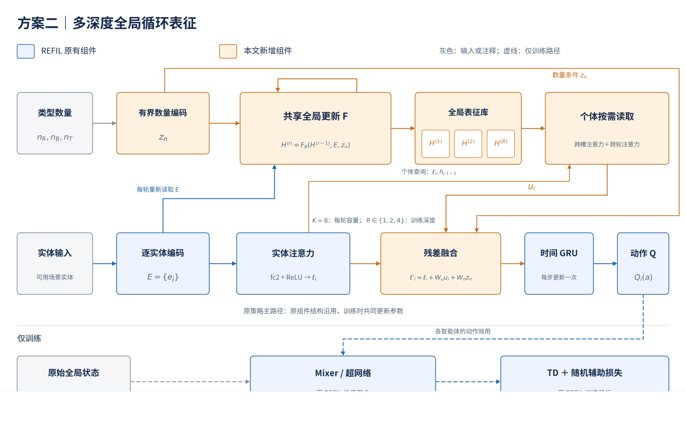
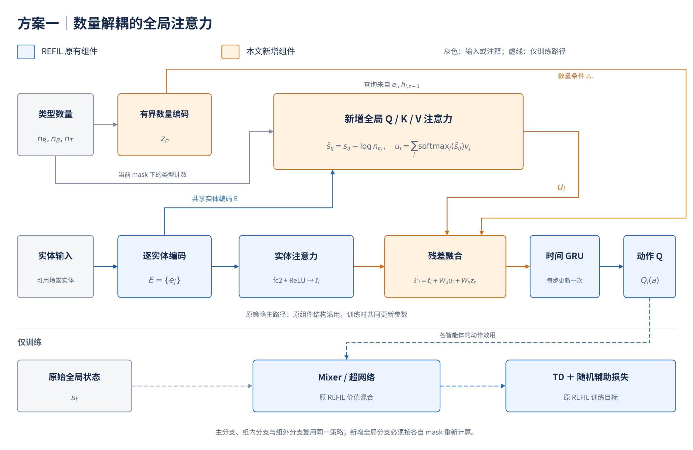
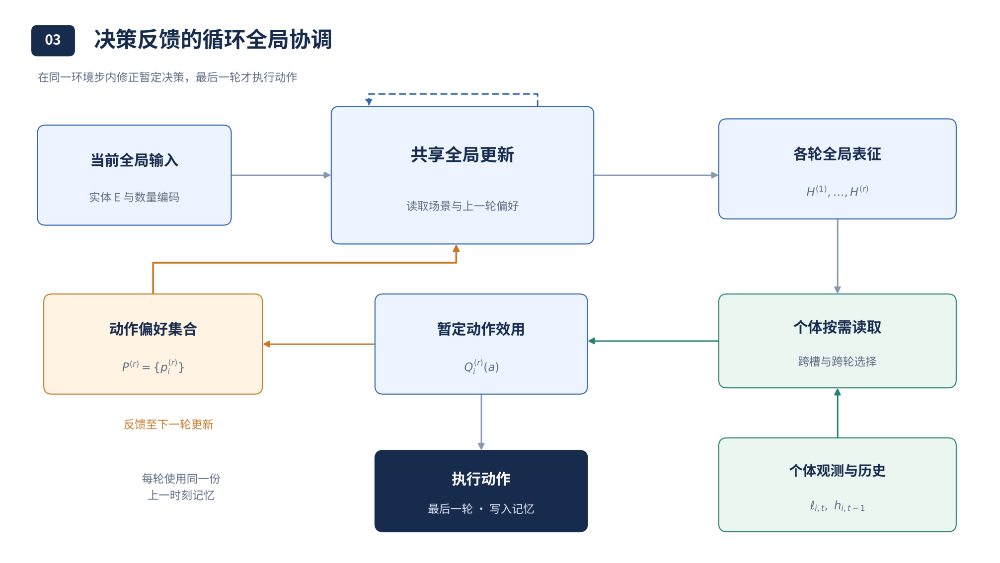
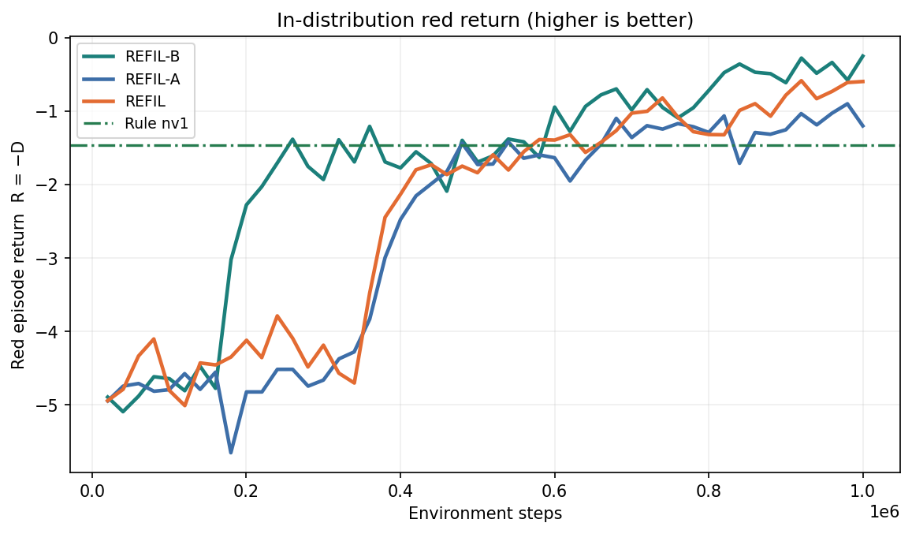
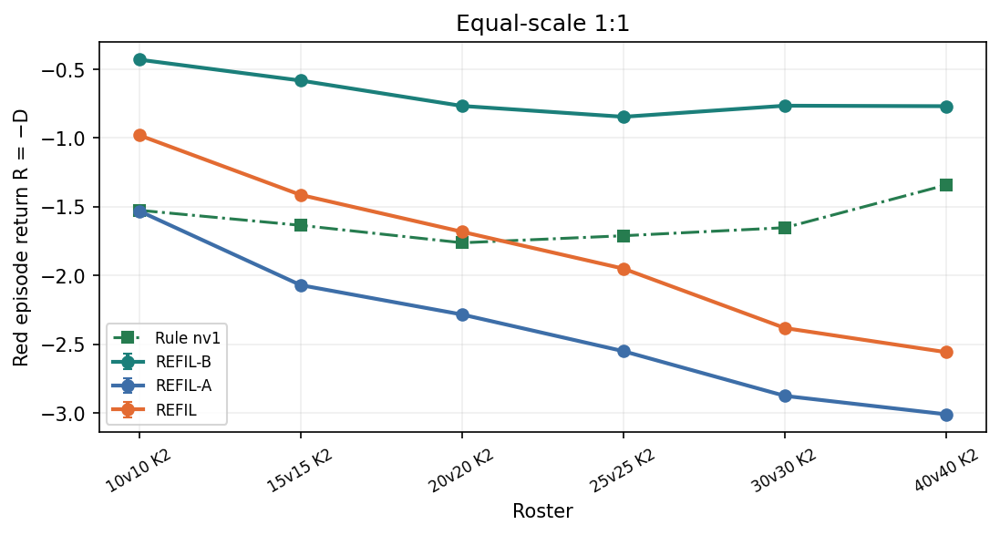
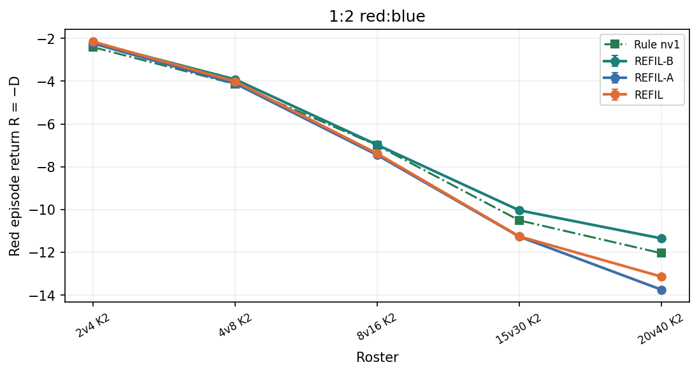
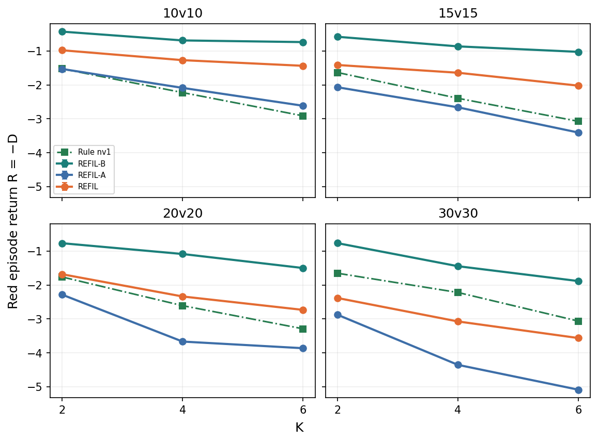
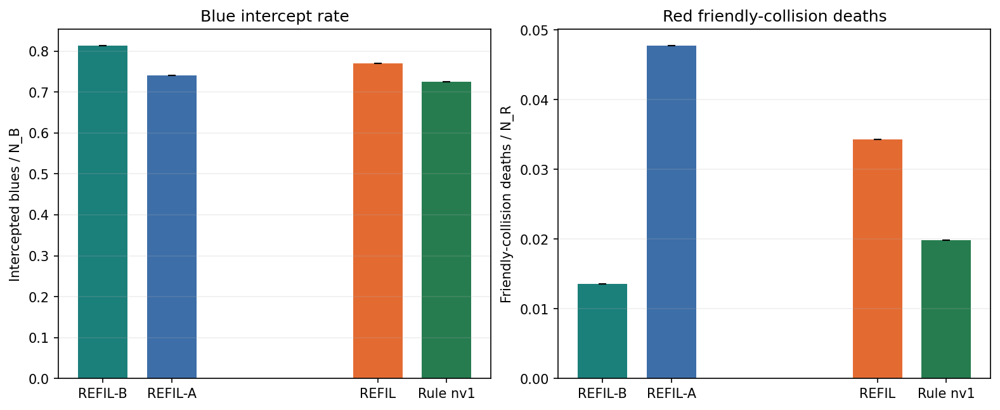
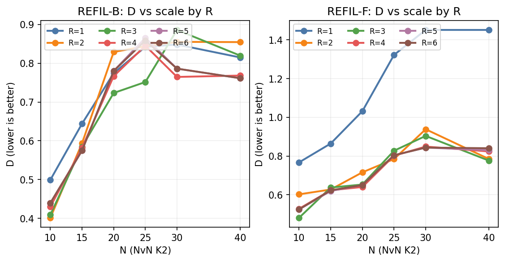
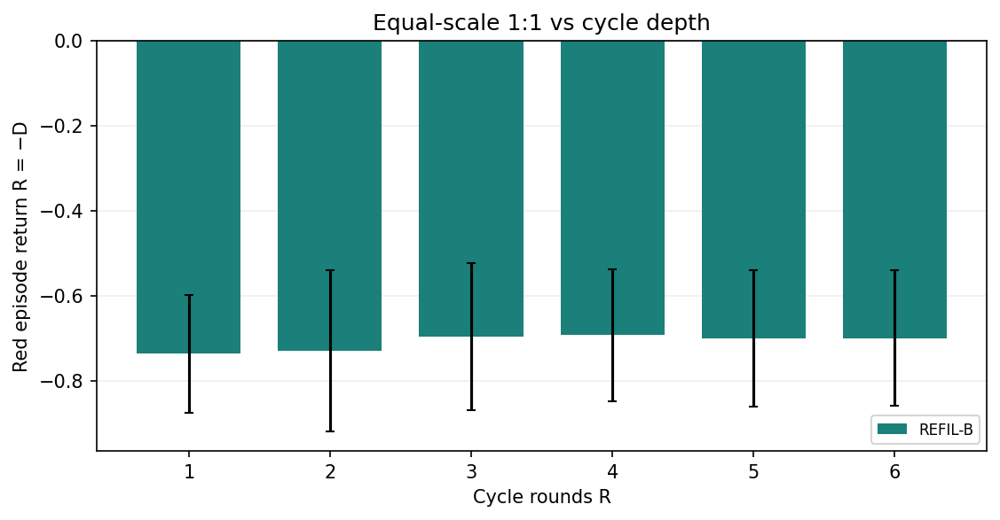

# REFIL-Cycle：面向多智能体规模外推的全实体共享循环表征

本文围绕当前项目 `Open-SCORE/outputs/main_v5` 中的 `refil_cycle` 整理研究问题、方法、实验设置与已有结论，作为论文写作的详细素材。下文统一将该方法称为 **REFIL-Cycle**；现有实验图中的 **REFIL-B** 与它指代同一方法。这里的 v5 指当前 `main_v5`，不是历史归档中的“v5：混合难度六路线”。结果依据截至 **2026 年 9 月 16 日** 已完成的实验。

方法的设计来源是 [《REFIL：全局信息处理与规模外推——三个研究方案》](../REFIL_全局信息处理与规模外推_三个研究方案.pdf) 中的**方案二：多深度全局循环表征**。本文保留原方案图，并以实际实现为准描述网络。对比结果来自同一实验协议下的 main v3、main v4 与 main v5；相关实验图直接引用原实验目录。

## 1. 研究问题：可变长输入为什么仍不足以支撑规模外推

### 1.1 任务背景与研究目标

研究对象是多无人机协同防御任务。红方无人机需要拦截蓝方攻击机，保护场景中的若干目标。随着红蓝双方数量、兵力比例以及保护目标数量改变，策略必须重新处理威胁分布、拦截资源和个体间的相互影响。我们关注的不是在每个规模上分别训练一个策略，而是：**仅在小规模场景中学习一套共享参数，冻结后直接部署到训练中未见过的大规模和不同任务构成的场景。**

设初始红方数量为 $N_R$、蓝方数量为 $N_B$、保护目标数量为 $K$。训练分布为 $N_R=N_B\in\{4,6,8,10\}$、$K\in\{1,2,3\}$；部署时测试到 $40\mathrm{v}40$、红蓝 $1:2$ 以及 $K=4,6$。这分别检验人数扩展、资源负载变化与目标构成变化。

每局的任务代价是目标累计损伤 $D$，越小越好。为避免与循环轮数 $R$ 混淆，本文用 $G=-D$ 表示图中所称的红方回报；原图纵轴中的 `R = −D` 表示回报，正文公式中的 $R$ 表示网络内部循环轮数。

### 1.2 已有基线暴露出的核心矛盾

REFIL 使用实体注意力和共享个体网络，能够接收不同数量的实体；训练时通过随机想象分解学习组内、组外关系。这使其成为当前项目中表现较强的学习基线。然而，**接口可以接收更多实体，不等于网络在更复杂的交互结构中仍能提取足够好的决策表征**。

已有实验表明，原 REFIL 在小规模中优于规则策略，但随着等规模人数增加，其目标损伤持续上升，并在较大规模下失去对规则策略的优势。规模增加还会提高固定场地内的交互密度，因此这里的外推包含更多实体与更拥挤的协作环境，不是简单地延长输入列表。

据此，本研究提出以下核心问题：

> 在不增加执行时观测权限、不改变动作空间与任务奖励的前提下，能否学习一个可重复使用的全局信息更新模块，使智能体通过多轮实体交互和个体化的跨轮读取，在未见规模下维持更好的协作决策质量？

这一问题可以分为三个层次：第一，增加全局循环分支是否确实改善任务结果；第二，这种改善能否跨越人数、兵力比例和目标数三种分布变化；第三，冻结模型后增加内部计算轮数是否继续有效，以及收益何时饱和。

### 1.3 研究内容与叙事主线

本文的研究内容由三个相互衔接的部分构成。

1. **方法设计。** 保留 REFIL 原有实体注意力、时间记忆和价值学习，在旁路增加全实体共享循环模块，保留每轮表征，再由个体依据自身状态和历史进行跨实体、跨轮读取。
2. **跨规模有效性。** 在相同小规模训练协议下，将 REFIL-Cycle 与已有学习基线、原 REFIL 和规则锚点比较，分别分析三类外推。
3. **设计选择与计算深度分析。** 结合已有距离分组、数量条件及 LayerNorm 对照，判断收益是否可以由更简单的改动解释；再分析同一循环模型在 $R=1,\ldots,6$ 下的表现。

最终故事是：**原 REFIL 已有较好的关系学习基础，但大规模协作仍存在表征处理瓶颈；已有局部分组和简单数量条件改动未能稳定解决这一问题；全实体共享循环方案在当前实验中明显改善跨规模防御，而内部深度的收益表现为有限改善和较早饱和。**

## 2. 研究方案及其与原 PDF 的对应关系

### 2.1 方案二原图

**图 1. 原 PDF 第 5 页图 2，方案二“多深度全局循环表征”。** 蓝色为沿用的 REFIL 组件，橙色为新增组件；颜色不表示冻结参数。图中的循环发生在一个环境步内。此处按原 PDF 保留原图；图内的固定槽数量、训练深度集合和部分连线属于原设计，实际 v5 实现的对应关系见表 1。

图 1 所表达的核心思想有三点：全局表征可以通过共享模块反复加工；不同计算深度的结果可以同时保留；不同个体可以根据自身状态与历史读取这些结果，再送入原有动作网络。REFIL-Cycle 继承这一核心思路，但把固定潜在槽改成全实体工作空间。

**表 1. 原方案二与当前 REFIL-Cycle 的关键对应。**

| 项目 | PDF 中的方案二 | v5 实际 `refil_cycle` |
|---|---|---|
| 原 REFIL 路径 | 保留实体编码、注意力、fc2、GRU 和 Q 头 | 保留 |
| 全局工作空间 | 固定数量的可学习潜在槽，建议 8 槽 | 每个允许实体对应一个 token，容量随实体数量改变 |
| 每步初始全局状态 | 可学习初始槽 $H_0$ | 当前实体编码投影形成的 $H^{(0)}$ |
| 每轮更新 | 槽重新交叉读取原实体，再作槽间自注意力与 FFN | 对上一轮全部实体 token 作自注意力与 FFN |
| 是否逐轮重新读取固定原实体 | 是 | 无单独的原输入交叉读取支路；更新的是上一轮实体表征 |
| 全局宽度 | 建议 128 维、4 头 | 64 维、4 头，FFN 中间维度 128 |
| 循环参数 | 各轮共享 | 各轮共享 |
| 个体读取查询 | 原路径表征与上一时刻记忆 | 投影后的自身实体 token 与上一时刻 GRU 记忆 |
| 跨轮融合 | 按个体对不同深度加权 | 共享读取器、共享轮次评分器和 softmax 加权 |
| 数量条件 | 槽查询注入，并直接参与残差融合 | 按允许实体计数，注入每轮自注意力查询；没有独立 $W_nz_n$ 直达融合项 |
| 训练深度 | $R\in\{1,2,4\}$ | $R\in\{1,2,3,4\}$ 均匀采样 |
| 常规验证与终评 | 由小规模协议确定部署深度 | 固定 $R=4$ |
| 已完成深度扫描 | 原方案建议测试并探索更深轮数 | 等规模线上 $R=1,2,3,4,5,6$ |

配置文件中的 `global_slots=4` 是多种全局分支共用的配置字段，**不会把 `refil_cycle` 变成 4 槽网络**。真正使用 4 个潜在槽的是独立对照 `refil_slot`（REFIL-K4）。因此，论文中的准确方法名称应突出“全实体共享循环”，而非“固定槽循环”。

### 2.2 与另外两条方案的关系

**图 2. 原 PDF 第 3 页图 1，方案一“数量解耦的全局注意力”。** 该图用于说明数量处理这一备选思路。REFIL-Cycle 使用有界数量条件，但不叠加图中的 $-\log n_c$ 注意力校正。

**图 3. 原 PDF 第 8 页图 3，方案三“决策反馈的循环全局协调”。** 暂定动作偏好参与后续更新属于另一种机制。REFIL-Cycle 的循环只处理实体表征，不向下一轮反馈当前步的候选动作或队友 Q 值。

因此，本文提出的是以方案二为基础的独立方法，并未将三个方案组合成一个大模型。已有方案一、三相关分支的训练状态也不能替代方案二的实验依据。

## 3. REFIL-Cycle 的详细方法

### 3.1 输入、观察范围与共享策略

对红方智能体 $i$，记其在环境时刻 $t$、训练分支 $b$ 下允许读取的实体集合为 $\mathcal A_{i,t}^{b}$，其中 $b\in\{\mathrm{main},\mathrm{in},\mathrm{out}\}$。主分支用于实际决策；组内和组外分支仅用于训练。

基础实体特征为 10 维：二维位置、二维速度、存活标记、生命比例、目标累计损伤占初始蓝方数量的比例，以及红方／蓝方／目标类型的三维 one-hot。位置除以 2500，速度除以 120。红蓝个体与保护目标共用实体表，通过类型区分。

网络使用以接收方为中心的相对视图：其他实体的位置、速度减去接收方的位置、速度；自身 token 保留自身绝对位置与速度。实体表还附加上一环境步的红方动作 one-hot，形成实际实体编码输入；首步、蓝方和目标的动作附加字段为零。模型不使用固定智能体编号编码。

主分支可以读取全场有效实体的公开物理态势；蓝方私有目标指派不进入输入。新增分支沿用相同的信息权限，不额外获得对手意图或其他智能体当前步的内部动作偏好。由于各智能体采用不同的相对视图，**共享的是参数与更新规则，不是必须为所有智能体计算同一份全局张量**。

### 3.2 保留原 REFIL 表征路径

以下公式省略 $i,t,b$ 下标。对经过观察者视图处理的实体输入 $x_e$，首先得到 128 维编码：

$$
e_e=\operatorname{ReLU}(W_e x_e+b_e),\qquad E=\{e_e\}.
$$

原 REFIL 路径对实体进行注意力聚合，经 ReLU、fc2 和 ReLU 得到 64 维个体表征 $\ell_i$：

$$
\ell_i=\operatorname{ReLU}\!\left(W_2\operatorname{ReLU}
\left(\operatorname{Attn}_{\rm REFIL}(E;i,\mathcal A_i^b)\right)+b_2\right).
$$

原注意力对键和值应用允许集合掩码；即使组外分支把自身排除在键集合外，局部查询仍保留自身物理特征。这是原 REFIL 的自身查询例外，不意味着自身重新进入键值集合。

它保留基线已经具备的一次实体读取能力。新增分支并行处理同一批实体编码，最后以残差形式回到 $\ell_i$，而不替换整个 REFIL 主干。

### 3.3 有界数量条件

根据该接收方、该分支的实际允许集合，分别统计红方、蓝方和目标数量 $n_R,n_B,n_T$。对任一非负数量 $n$，定义

$$
\rho(n)=\left[\left(\frac{\max(n-1,0)}{\max(n-1,0)+2}\right)^2,\ \mathbb 1[n=0]\right].
$$

三类数量拼成 6 维向量，并经两层 MLP 编码：

$$
z_n=\operatorname{MLP}_{6\rightarrow32\rightarrow32}
\big([\rho(n_R),\rho(n_B),\rho(n_T)]\big).
$$

第二个分量用于区分零个和一个实体；第一个分量将正数量映射到有界区间。数量编码提供场景负载信息，但有界并不意味着训练范围外的输入已经被覆盖，也不保证策略自动外推。

尤其在 REFIL 辅助分支中，计数必须来自对应掩码下可读取的实体，不能直接借用主分支的完整数量。REFIL-Cycle 的全局分支按接收方的 `key_mask` 和实体类型重新计数。

### 3.4 全实体共享循环模块

送入全局分支前，先按当前键掩码清零实体编码，再逐实体仿射投影到 64 维。记 $M_e=\mathbb 1[e\in\mathcal A_i^b]$，则本环境步的初始 token 为：

$$
H_e^{(0)}=W_g(M_e e_e)+b_g.
$$

每个允许实体保留一个 token，不先压缩为固定数量的潜在槽。第 $r$ 轮执行：

$$
J^{(r)}=\operatorname{LN}_a(H^{(r-1)})+\mathbf1(W_cz_n+b_c)^\top,
$$

$$
\widetilde H^{(r)}=H^{(r-1)}+
\operatorname{MHA}_{\theta}\big(J^{(r)},H^{(r-1)},H^{(r-1)};\mathcal A_i^b\big),
$$

$$
H^{(r)}=\operatorname{Mask}_{\mathcal A_i^b}\left[
\widetilde H^{(r)}+
\operatorname{FFN}_{\theta}\big(\operatorname{LN}_f(\widetilde H^{(r)})\big)
\right].
$$

这里 $\operatorname{MHA}(Q,K,V)$ 为四头注意力；数量条件只注入查询。键和值来自上一轮 token，不能写成三者均使用归一化结果。FFN 为 $64\rightarrow128\rightarrow64$，中间使用 ReLU。所有轮次复用同一套注意力、FFN、LayerNorm 和数量投影参数。

在每轮结束时，被屏蔽实体的输出归零；全部键均被屏蔽时，注意力聚合定义为零，避免从被遮挡实体恢复信息。网络保留每一轮结果，构成表征库：

$$
\mathcal H_{i,t}^{b}=\{H^{(1)},H^{(2)},\ldots,H^{(R)}\}.
$$

这种循环沿“计算深度”展开。同一个物理时刻的实体关系可以被逐步更新，但环境不前进，也不在轮间采集新观测。下一环境步重新从该步实体输入构造 $H^{(0)}$；循环表征不作为跨时间状态直接传递。

### 3.5 个体化的跨实体、跨轮读取

每个智能体使用投影后的自身槽 $v_i=H_{\rm self}^{(0)}$ 与上一环境步的 GRU 记忆 $h_{i,t-1}$ 构造查询。这里的自身槽遵循全局分支的键掩码：如果组外分支屏蔽自身，该槽仅为投影偏置 $b_g$，不携带自身物理内容；这一点与原路径保留自身局部查询的规则不同。
$$
q_i=W_q[v_i;h_{i,t-1}]+b_q.
$$

对每一轮表征分别作一次实体读取：

$$
u_i^{(r)}=\operatorname{MHA}_{\rm read}(q_i,H^{(r)},H^{(r)};\mathcal A_i^b).
$$

再使用共享的线性评分器对各轮读取结果打分：

$$
s_i^{(r)}=w_s^\top u_i^{(r)}+b_s,\qquad
\alpha_i^{(r)}=\frac{\exp s_i^{(r)}}{\sum_{k=1}^{R}\exp s_i^{(k)}},
$$

$$
u_i=\sum_{r=1}^{R}\alpha_i^{(r)}u_i^{(r)}.
$$

跨轮权重随个体状态和历史改变，因为每轮读取 $u_i^{(r)}$ 已由个体查询条件化。读取器和轮次评分器在各轮之间共享，不使用限定最大深度的轮次编号查表，因此同一套参数可以执行训练范围之外的第 5、6 轮。

这一结构允许不同个体利用不同深度的信息，但**结构具有这种能力，与实验已经证明这种能力是性能来源，是两回事**。现有实验尚未用“仅读最后一轮”对照隔离跨轮读取的独立贡献。

### 3.6 残差融合与每步一次的时间记忆更新

读取到的全局上下文经线性映射回到原路径：

$$
\ell_i'=\ell_i+W_f u_i+b_f,
$$

$$
h_{i,t}=\operatorname{GRU}(\ell_i',h_{i,t-1}),\qquad
Q_i(\tau_{i,t},\cdot)=W_o h_{i,t}+b_o.
$$

融合层 $W_f,b_f$ 使用零初始化，使新分支在初始化时对原路径的残差输出为零。原网络与新增组件随后共同训练，并非先训练 REFIL、再冻结主干训练旁路。

每个环境步只更新一次 GRU，输出九个离散动作的效用；死亡观察者的记忆和 Q 输出归零。部署时按合法动作集合贪心选择；采集训练数据时采用 $\epsilon$-greedy。内部循环的多轮表征更新不等于多次环境动作，也不等于重复写入时间记忆。

### 3.7 保留 REFIL 的想象分解与价值训练

每次回放训练时，对每条完整 episode 采样一个随机二分组：先采样 $p\sim U(0,1)$，再按 $\operatorname{Bernoulli}(p)$ 为实体采样组标签。该次序列展开中的分组固定，实体死亡掩码随时间更新。

同一条真实轨迹形成主分支、组内分支和组外分支。三者共享网络参数，但使用各自的观测掩码并独立展开时间记忆。REFIL-Cycle 在每条分支内重新计数、构造实体循环和读取上下文。辅助分支不是另运行两个环境，也不具有各自的子任务奖励。

主分支的已执行动作效用经单调价值混合网络得到 $Q_{\rm tot}$。组内、组外效用拼为 $2N_R$ 个因子，走共享的 imagined mixer 接口，得到 $Q_{\rm aux}$；两者拟合同一团队 TD 目标。

对一次训练批次采样统一深度 $R$。在线主分支选择下一动作，目标网络在同一深度评价它：

$$
a_{i,t+1}^{*}=\arg\max_{a\in\mathcal U_{i,t+1}}
Q_{i,R}^{\rm main}(\tau_{i,t+1},a),
$$

$$
y_t=\widetilde r_t+\gamma m_t^{\rm boot}
Q_{{\rm tot},R}^{-}(s_{t+1},\mathbf a_{t+1}^{*}).
$$

其中 $\widetilde r_t$ 为实际学习奖励，$m_t^{\rm boot}$ 区分自然终止、时间截断及红方全灭尾段处理。对有效训练位置掩码 $m_t$，损失为

$$
\mathcal L_R=\frac{1}{\sum_t m_t}\sum_t m_t
\left[(1-\lambda)(Q_{{\rm tot},R,t}-y_t)^2
+\lambda(Q_{{\rm aux},R,t}-y_t)^2\right],\qquad\lambda=0.5.
$$

训练优化 $\mathbb E_R[\mathcal L_R]$。目标值停止梯度，梯度通过时间 GRU、跨轮读取和展开的共享循环传播。实现中的激活重计算用于节约显存，不切断轮间梯度。没有额外的层级标签、正确轮数标签、动作协调监督或循环收敛损失。

本项目的 mixer 沿用已修正的可变实体实现：有效个体的混合权重使用非负归一化，偏置／状态值项结合存活人数缩放，并保留能表示负团队回报的输出结构。这是与复用 REFIL 对照共同的基础条件，不是 REFIL-Cycle 单独新增的贡献。

### 3.8 训练与执行流程

**数据采集。** 每局采样训练规模，并独立从 $\{1,2,3,4\}$ 均匀采样循环深度，整局固定。每个物理步构造实体输入，执行指定轮数的全局循环与一次 GRU 更新，选择实际动作，并存储真实转移。

**回放学习。** 从回放中取完整 episodes，为各 episode 采样想象分组；为当前 minibatch 重新采样一个统一循环深度，在线主／辅助分支和目标网络使用相同深度。从序列起点重建记忆，计算主与辅助价值损失，再进行一次优化器更新。

**冻结部署。** 动作选择仅使用主策略网络，想象分组和辅助分支不参与执行，动作生成不依赖 mixer。当前评估实现仍载入 mixer 记录团队价值统计。常规终评固定 $R=4$；深度分析只改变同一检查点的执行轮数，不重新训练模型。

参数量不随循环轮数增长，但计算量会增长。对单个接收方的 $M$ 个实体，全实体自注意力主要开销随 $RM^2$ 增长；当前实现还包含接收方视图这一维度。因此，现有结果支持共享参数下的性能收益，不能据相同环境交互预算宣称计算成本相同或推理速度更快。

## 4. 实验设置

### 4.1 环境、控制与对手

实验使用 HAD Workbench 的二维 `damage` 任务，当前项目协议为 `had-workbench-2.1.0 / rebuild-calibrated-v3-r7-target-initialization`。保护目标位置逐局随机初始化；物理和对手协议在复用的对照中保持一致。

红方每个物理步决策一次，动作是九种二维加速度选择。零动作代表零加速度，不代表立即停车。底层按一秒物理步更新，位置推进使用当前速度，动作对速度的影响作用于后续位移。双方速度范围为 35–120，最大加速度 40；无人机生命值与满伤强度均为 1。二维满伤／自动开火半径为 200，伤害到 400 距离衰减为零，碰撞距离为 20。

蓝方采用固定的 `reactive` 上层与 `rush` 下层：每 5 个物理步或出现伤亡事件后重新选择目标，下层逐步控制飞行。红方只观察公开物理态势，不读取蓝方的私有指派。实验没有训练新的对手，也不以自博弈定义泛化。

每局最多 100 个物理步。蓝方攻击机全灭可自然终止；红方全灭不意味着目标损伤停止。`damage` 模式中目标持续存在，损伤不受初始目标血量封顶，因此目标总损伤可以超过目标数或目标初始生命值之和。

### 4.2 学习奖励与报告指标必须分开

环境的物理奖励为

$$
r_t^{\rm damage}=-\Delta D_t,\qquad G=\sum_t r_t^{\rm damage}=-D.
$$

实际训练还使用与基线一致的距离势函数塑形：

$$
\Phi(s)=-c\sum_{b\in\mathcal B_{\rm alive}}
\operatorname{clip}\!\left(1-\frac{\min_k\|p_b-p_k\|}{L},0,1\right),
\quad c=1,\ L=4000,
$$

$$
\widetilde r_t=-\Delta D_t+\gamma\Phi(s_{t+1})-\Phi(s_t),\qquad\gamma=0.99.
$$

自然终止状态的后继势函数置零；时间截断保留真实后继状态并按协议 bootstrap。红方全灭后，环境继续结算剩余物理过程，把后续折扣学习回报折叠回最后一个红方决策转移；报告中的 $D$ 仍为完整物理损伤，物理步仍计入交互预算。

当前使用 `reward_mode=damage`，没有启用另设的友方碰撞／重复自毁惩罚。因而本文不能将降低碰撞的现象解释为显式碰撞奖励的直接结果。学习目标是带塑形的折扣回报，图表报告的是未折扣物理 $G=-D$；两者不混作同一数值。

### 4.3 训练、验证与测试分布

**表 2. 规模协议。**

| 阶段 | 配置 | 用途 |
|---|---|---|
| 训练 | $N_R=N_B\in\{4,6,8,10\}$，$K\in\{1,2,3\}$，均匀抽样 | 小规模共享策略学习，共 12 类组合 |
| 池内验证与终评 | 4v4 K2、6v6 K2、8v8 K2、10v10 K3 | 检查池内表现；验证用于选模 |
| 等规模线 | 10/15/20/25/30/40v 同数，K2 | 人数扩大；10v10 K2 为池内规模参照 |
| 兵力比例线 | 2v4、4v8、8v16、15v30、20v40，K2 | 红方只有蓝方一半；同时含小规模分布变化与规模扩大 |
| 目标数线 | 10/15/20/30v 同数，K2/4/6 | K4、K6 超出训练目标数；K2 复用等规模参照 |

终评共有 **23 个不重复配置**：4 个池内配置、6 个等规模配置、5 个比例配置和 8 个额外目标数配置。每配置评估 300 局，合计每方法 6900 局。目标数图中的 K2 点与等规模图共享，不重复计为新增配置。

每个训练任务使用 **100 万物理步**，8 个并行采集环境。每 2 万步在上述四个池内配置各评估 25 局，共 100 局；总计 50 次验证。检查点依据这四个配置的平均 $D$ 选优，终评使用 `best.pt`。训练途中不使用大规模终评结果选模型。

训练实体表上限为 10 红、10 蓝、3 目标，即 23 个实体槽；评估接口上限为 40 红、40 蓝、6 目标，即 86 槽。死亡和 padding 槽被掩蔽。扩大接口不增加新策略参数，冻结网络通过共享实体运算处理增加的有效实体。

### 4.4 网络与优化超参数

**表 3. REFIL-Cycle 实际运行配置。**

| 类别 | 参数 | 取值 |
|---|---|---|
| 原路径 | 实体／注意力宽度，注意力头数 | 128，4 |
| 时间记忆 | GRU 隐状态 | 64 |
| 全局分支 | token 宽度，头数，FFN 中间宽度 | 64，4，128 |
| 数量条件 | MLP | 6→32→32，两层后均有 ReLU |
| 融合 | 全局上下文至 GRU 输入 | 64→64 线性残差，零初始化 |
| 深度 | 采集按局、学习按批次抽样 | $R\sim U\{1,2,3,4\}$ |
| 深度 | 常规验证／终评 | $R=4$ |
| 想象分解 | 分组方式、辅助权重 | 原 REFIL 随机分组，$\lambda=0.5$ |
| 价值学习 | mixer、Double Q | `flex_qmix`，启用 |
| 优化器 | RMSprop | 学习率 $5\times10^{-4}$，$\alpha=0.99$，$\epsilon=10^{-5}$ |
| 折扣与梯度 | $\gamma$，梯度范数上限 | 0.99，10 |
| 回放 | batch size，容量 | 32 条完整 episodes，5000 条 episodes |
| 更新 | 每轮采集后的学习迭代配置 | `training_iters=8` |
| 目标网络 | 硬更新间隔 | 按采集 episode 计数，每 200 个更新 |
| 探索 | $\epsilon$ 起止及线性退火 | 1.0→0.05，100000 环境步 |

表 3 是当前落盘配置，不能直接用 PDF 中建议的 128 维全局模块、$\{1,2,4\}$ 深度或 500000 步探索退火替代。

### 4.5 比较对象与消融对应

**表 4. 已有方法及其作用。**

| 方法 | 实验来源 | 在研究中的作用 |
|---|---|---|
| 随机策略 | 复用锚点 | 给出无学习的低端参照，并用于 NDS 归一化 |
| Rule nv1 | 复用锚点 | 基于预测拦截与覆盖分配的规则参照 |
| QMIX-Atten | main v3 | 实体注意力价值分解基线，报告图中简称 QMIX |
| DCG | main v3 | 协调图基线 |
| SPECTra | main v3 | 已有注意力／价值分解基线 |
| ALMA | main v3 | 当前全场低层适配的分层基线 |
| REFIL | main v3 | 与所提方法最直接的母体对照 |
| REFIL-L0.15、L0.30 | main v4 | 调整想象分组的距离偏置强度 |
| REFIL-C | main v4 | 仅加入有界数量 FiLM，含 LayerNorm |
| REFIL-C−LN | main v5，图表归 main v4 | 去除上述数量 FiLM 前的 LayerNorm |
| REFIL-Cycle／REFIL-B | main v5 | 本文提出的全实体共享循环方法 |

这里的“原 REFIL”指项目在相同环境和已修正实现上的 REFIL 对照，并非直接引用原论文的任务分数。QMIX、DCG、SPECTra 和 ALMA 的性能也只表述本项目适配结果。

`refil_card`（REFIL-A）、`refil_feedback`（REFIL-F）与 `refil_slot`（REFIL-K4）截至本文整理时没有完整终评结果：A 尚在训练，F 已有运行失败记录，K4 尚未开始。它们不进入完成实验的排序，也不用于宣称数量校正、决策反馈或固定槽一定无效。

### 4.6 评价指标

主要指标为每配置 300 局的平均目标损伤 $\bar D$。现有曲线通常画 $G=-\bar D$，越高越好；本文表格主要使用 $\bar D$，越低越好。

归一化防御得分为

$$
\operatorname{NDS}=\frac{\bar D_{\rm random}-\bar D_{\rm method}}
{\bar D_{\rm random}-\bar D_{\rm rule}}.
$$

NDS=0 对应随机，NDS=1 对应规则，NDS>1 表示优于规则。它不是胜率，不能把 1.04 写成 104% 胜率。

行为指标包括蓝方拦截比例和红方同队碰撞死亡占初始红方数量的比例。严格完成率沿用已有分析定义：自然结束、蓝方剩余数量为零且 $D<10^{-9}$ 的回合比例。它同时要求无漏防损伤与完成拦截，比仅比较平均损伤更严格。

下文各实验轴的“平均 D”先对每个配置求均值，再对该轴配置等权平均；三类外推分别报告，避免用一个混合总分掩盖任务差异。方法配对表沿用 v5 直接对照口径；引用的 v3 原图保留其既有汇总方式，不将不同图中的 REFIL 数字默认为同一个统计汇总。

## 5. 当前实验结果与结论

### 5.1 整体比较：从较强的 REFIL 基础进一步改善外推

**图 4. main v3 已有学习基线的池内验证曲线。** 纵轴为原始红方回报 $-D$。该图保留原报告对已完成训练运行的汇总与色带，用来展示基线格局；它不包含本文提出的 REFIL-Cycle，也不与下表的配对数字混为同一汇总口径。

已有学习基线中，REFIL 在池内学习、人数扩展和目标数扩展上表现较好，因此研究选择在它的关系学习框架上增加全局信息加工能力。为将所提方法与全部完成基线放在同一表中，表 5 统一采用与 v5 主对照对应的已完成运行，按同一 23 配置协议重新汇总已有逐局记录；不混入 v3 的额外历史配置。

**表 5. 各方法在四类配置上的平均目标损伤 D，越低越好。** 各列分别等权平均其所属配置；学习方法的配对结果采用现有主对照运行，运行标识为 seed 0。此处关注方法表现，不据此作显著性判断。

| 方法 | 池内 4 配置 | 等规模 6 配置 | 1:2 比例 5 配置 | 目标外推 8 配置 |
|---|---:|---:|---:|---:|
| 随机 | 5.2804 | 11.0483 | 12.1640 | 13.6534 |
| Rule nv1 | 1.4624 | 1.6039 | 7.2213 | 2.7240 |
| QMIX-Atten | 3.7597 | 6.6002 | 9.5291 | 8.9386 |
| DCG | 1.6531 | 3.2888 | 8.5275 | 4.3672 |
| SPECTra | 2.5378 | 4.3445 | 8.1693 | 6.7050 |
| ALMA | 1.4341 | 3.6535 | 7.9094 | 4.2684 |
| REFIL | 0.6657 | 1.8273 | 7.5899 | 2.2601 |
| **REFIL-Cycle** | **0.3305** | **0.6928** | **6.8971** | **1.1539** |
| **相对 REFIL 的损伤降幅** | **50.36%** | **62.09%** | **9.13%** | **48.94%** |

REFIL-Cycle 在四个分组平均上均优于表中其他方法。更直接的配对比较显示：其在 **23 个配置中的 22 个**低于原 REFIL，并在全部 23 个配置中低于规则锚点。唯一未优于原 REFIL 的配置是 2v4 K2，损伤从 2.1526 上升到 2.1964，约增加 2.03%。因此，当前证据是覆盖广泛配置的总体改进，而非每一配置都严格优于母体。

四类配置的 REFIL-Cycle 平均 NDS 分别为 **1.3215、1.1152、1.0766、1.1687**。这些值支持其整体超过规则锚点，但应结合原始 D 阅读：例如兵力不足时 NDS 超过 1，并不意味着已经接近零损伤。

### 5.2 学习过程：更早形成有效防御，最终选优表现更好

**图 5. REFIL-Cycle／REFIL-B、原 REFIL 与现有数量注意力分支的池内验证曲线。** REFIL-B 的验证深度固定为 4。REFIL-A 曲线尚未完成，只用于如实展示已有图，不作为完成方法比较。

在当前曲线上，REFIL-Cycle 首次超过规则池内平均回报的位置约为 **26 万物理步**，原 REFIL 约为 **58 万步**。这说明当前运行中循环方法较早学到有效防御行为；曲线仍有波动，这两个点不是稳定收敛时间。

REFIL-Cycle 的最优验证平均 D 为 **0.2536**，出现在 100 万步；原 REFIL 的最优验证平均 D 为 **0.5878**，出现在约 92 万步。终评的池内平均 D 则分别为 **0.3305** 与 **0.6657**。验证与终评使用不同评估批次、不同局数，因此不把前一组数字当作最终测试结果。

学习过程与最终测试形成一致方向：改进既表现为较早获得高回报，也表现为冻结检查点后的损伤降低。不过，相同物理步数仅说明交互预算一致，并没有控制新增循环带来的计算开销。

### 5.3 人数外推：从持续退化转为较低损伤平台

**图 6. 等规模 1:1 人数扩展，K=2。** 原图纵轴为 $-D$，越高越好；REFIL-B 即 REFIL-Cycle。

在人数扩展上，差距最为清楚。原 REFIL 的平均 D 从 10v10 的 **0.980** 上升到 40v40 的 **2.557**，而 REFIL-Cycle 从 **0.430** 上升到 **0.768**。在 20v20–40v40 区间，循环方法的 D 约处于 **0.765–0.845**，并未跟随人数持续恶化。

40v40 K2 时，REFIL-Cycle 相比原 REFIL降低损伤约 **69.96%**，相比规则的 1.3405 降低约 **42.69%**。原 REFIL 在 25v25 及以上已落后于规则，而循环方法在整条等规模线上均保持较低损伤。其等规模平均 D 为 0.6928，原 REFIL 为 1.8273，平均降幅约 62.09%。

这支持本文的主要经验结论：**在训练最大编队为 10v10 的条件下，全实体循环表征可以将较好的防御能力迁移到最大 40v40 的未见规模。** 这里的收益来自冻结策略的零样本部署，不是测试时继续训练。

### 5.4 兵力比例外推：能够减轻资源不足带来的损伤，但无法消除它

**图 7. 红方数量为蓝方一半的 1:2 比例变化。** 该轴不同于单纯等比例扩充，对防御资源提出额外压力。

在 1:2 线上，REFIL-Cycle 的平均 D 为 **6.8971**，原 REFIL 为 **7.5899**，降低 **9.13%**。20v40 K2 时，损伤由 **13.139** 降至 **11.352**，降幅约 **13.60%**，并低于规则的 **12.0435**。

收益小于等规模线，且并非处处超过原 REFIL。2v4 K2 上原 REFIL 略好；8v16 K2 上循环方法虽低于规则，但 **6.9780 与 7.0049** 的差距很小。不能将这些接近的数值写成压倒性优势。

严格完成率也揭示了任务边界：整条 1:2 线中，REFIL-Cycle 的自然零损伤完成率约 **0.87%**，原 REFIL 约 **1.07%**。因此，当前方法在兵力不足时主要实现的是**减少平均漏防损伤**，没有同时提高这一轴上的严格完成率，也没有解决防御资源不足问题。

### 5.5 目标数外推：收益不局限于无人机数量增加

**图 8. 10、15、20、30 四个等规模编队下的目标数变化。** 每格包含 K2、K4、K6；K4、K6 超出训练目标数上限 3。

只统计新增的 K4、K6 八个配置，REFIL-Cycle 的平均 D 为 **1.1539**，原 REFIL 为 **2.2601**，降低 **48.94%**。例如 30v30 K6，损伤从 **3.563** 降至 **1.883**，约降低 **47.15%**；30v30 K4 则从 **3.074** 降至 **1.445**。

这说明改进不仅适用于红蓝数量同时扩大，也适用于更多保护对象带来的关系与资源配置复杂度增加。但循环方法的 D 仍随目标数增大而上升：30v30 下从 K2 的约 0.765 上升到 K6 的约 1.883。正确结论是缓解目标数外推退化，而不是对目标数量变化完全不敏感。

### 5.6 全部正式配置结果

**表 6. REFIL-Cycle 与母体及规则的逐配置终评。** 每格为 300 局平均 D；NDS 对应 REFIL-Cycle。数值按原报告取三位小数，规则保留四位。该表包含全部 23 个正式配置。

| 类别 | 配置 | Rule nv1 D | REFIL D | REFIL-Cycle D | Cycle NDS |
|---|---|---:|---:|---:|---:|
| 池内 | 4v4 K2 | 1.1531 | 0.360 | 0.235 | 1.444 |
| 池内 | 6v6 K2 | 1.3331 | 0.580 | 0.258 | 1.334 |
| 池内 | 8v8 K2 | 1.4293 | 0.605 | 0.327 | 1.255 |
| 池内 | 10v10 K3 | 1.9341 | 1.118 | 0.502 | 1.253 |
| 等规模 | 10v10 K2 | 1.5252 | 0.980 | 0.430 | 1.223 |
| 等规模 | 15v15 K2 | 1.6346 | 1.414 | 0.582 | 1.153 |
| 等规模 | 20v20 K2 | 1.7615 | 1.682 | 0.767 | 1.115 |
| 等规模 | 25v25 K2 | 1.7102 | 1.950 | 0.845 | 1.085 |
| 等规模 | 30v30 K2 | 1.6516 | 2.382 | 0.765 | 1.076 |
| 等规模 | 40v40 K2 | 1.3405 | 2.557 | 0.768 | 1.040 |
| 比例变化 | 2v4 K2 | 2.4111 | 2.153 | 2.196 | 1.151 |
| 比例变化 | 4v8 K2 | 4.1372 | 4.013 | 3.918 | 1.082 |
| 比例变化 | 8v16 K2 | 7.0049 | 7.387 | 6.978 | 1.006 |
| 比例变化 | 15v30 K2 | 10.5098 | 11.257 | 10.041 | 1.069 |
| 比例变化 | 20v40 K2 | 12.0435 | 13.139 | 11.352 | 1.075 |
| 目标外推 | 10v10 K4 | 2.2271 | 1.271 | 0.690 | 1.259 |
| 目标外推 | 10v10 K6 | 2.9133 | 1.438 | 0.739 | 1.303 |
| 目标外推 | 15v15 K4 | 2.3953 | 1.642 | 0.865 | 1.180 |
| 目标外推 | 15v15 K6 | 3.0755 | 2.023 | 1.026 | 1.204 |
| 目标外推 | 20v20 K4 | 2.6079 | 2.337 | 1.085 | 1.143 |
| 目标外推 | 20v20 K6 | 3.2901 | 2.733 | 1.499 | 1.142 |
| 目标外推 | 30v30 K4 | 2.2192 | 3.074 | 1.445 | 1.053 |
| 目标外推 | 30v30 K6 | 3.0635 | 3.563 | 1.883 | 1.066 |

### 5.7 行为与可靠性：收益伴随更多拦截和更少内部损耗

**图 9. 四个池内配置上的行为诊断。** 左侧为蓝方拦截比例，右侧为红方同队碰撞死亡占初始红方数量的比例；这两个量均不是整局胜率。

池内平均拦截比例从原 REFIL 的 **77.04%** 提高到 REFIL-Cycle 的 **81.28%**，约增加 **4.24 个百分点**。红方同队碰撞死亡比例从 **3.43%** 降至 **1.36%**，相对减少约 **60.44%**，也低于规则约 **1.99%** 的池内结果。

在不使用显式碰撞惩罚的条件下，任务损伤、拦截比例和内部损耗出现一致方向的变化，说明方法收益并非仅反映价值函数数值变化。不过，这些行为统计是伴随证据，不能将全部回报改善因果归结于减少碰撞。

进一步按现有终评记录计算等规模可靠性，得到表 7。

**表 7. 等规模 K2 的严格完成率与红方同队碰撞死亡比例。** 三种策略每配置各 300 局；百分数的分母分别为回合数与初始红方数量。

| 规模 | REFIL 严格完成 | Cycle 严格完成 | 规则严格完成 | REFIL 碰撞死亡比例 | Cycle 碰撞死亡比例 | 规则碰撞死亡比例 |
|---|---:|---:|---:|---:|---:|---:|
| 10v10 | 46.67% | **73.67%** | 14.33% | 4.67% | **1.93%** | 2.73% |
| 15v15 | 38.33% | **63.67%** | 18.33% | 7.33% | **2.84%** | 3.51% |
| 20v20 | 33.00% | **59.00%** | 16.33% | 8.97% | 4.40% | **4.17%** |
| 25v25 | 32.33% | **60.33%** | 20.33% | 10.67% | 6.45% | **4.64%** |
| 30v30 | 28.67% | **62.67%** | 25.67% | 12.92% | 7.16% | **5.71%** |
| 40v40 | 26.67% | **64.00%** | 32.33% | 15.78% | 9.70% | **7.44%** |

六个等规模配置合计，严格完成率由原 REFIL 的 **34.28%** 提高到 **63.89%**。40v40 下，原 REFIL 为 80/300 局，REFIL-Cycle 为 192/300 局。这说明等规模性能改进同时体现在平均损伤和严格零损伤完成上。

但循环方法尚未消除大规模内部冲突。40v40 下仍有 **90.67%** 的回合发生至少一次红红碰撞，其碰撞死亡比例 **9.70%** 仍高于规则的 **7.44%**。由此可见，**较低目标损伤与最低碰撞率不是同一目标**：循环方法能在较少漏防的同时容忍一定内部损耗，规则虽然更少碰撞，却未必获得更高的零损伤完成率。

### 5.8 消融与设计对照：已有简单改动不足以解释循环方法的收益

这里将已有实验分为两类：一类是围绕原 REFIL 的结构与设计对照，包括距离分组、数量条件和 LayerNorm；另一类是同一 REFIL-Cycle 检查点的执行深度干预，见第 6 节。前一类可以判断替代设计的表现，后一类可以观察增加循环计算的作用。它们不等同于已经穷尽 REFIL-Cycle 所有内部组件的逐项消融。

**图 10. 距离分组、数量 FiLM 及去 LayerNorm 的池内验证曲线。** REFIL-C 为带 LN 数量条件，REFIL-C−LN 为去 LN 数量条件。

**图 11. 已有结构对照的等规模外推。** 原 REFIL 在这些对照中的整体表现较好；这些图中的 REFIL-C 不代表本文的 REFIL-Cycle。

**图 12. 已有结构对照的目标数量外推。** 在人数与目标数同时增加时，简单改动未表现出与循环方法相同的改进趋势。

**表 8. 已完成设计对照的分组平均 D。** 最后一行列出所提方法，用于统一比较。

| 方法 | 池内 | 等规模 | 1:2 | 目标外推 |
|---|---:|---:|---:|---:|
| REFIL | 0.6657 | 1.8273 | 7.5899 | 2.2601 |
| 距离分组 L0.15 | 1.0887 | 2.3676 | 7.6468 | 3.0970 |
| 距离分组 L0.30 | 1.2682 | 3.4638 | 7.9400 | 4.3744 |
| 数量 FiLM，含 LN | 0.8399 | 2.2913 | 7.6799 | 3.0419 |
| 数量 FiLM，去 LN | 1.1335 | 2.7750 | 7.7574 | 3.6965 |
| **REFIL-Cycle** | **0.3305** | **0.6928** | **6.8971** | **1.1539** |

**结论一：本轮距离偏置分组没有优于原随机分组。** 两个距离分组臂保留其余 REFIL 结构，使用

$$
\pi_e=p\left[(1-\eta)+\eta\exp\left(-\frac{d_{ie}^2}{2r^2}\right)\right],
\quad r=0.4,\quad\eta\in\{0.15,0.30\},
$$

按独立 Bernoulli 采样实体组标签，其中 $i$ 是随机分组中心。该实现不会直接把相近实体硬分到同一组；在给定 $p=0.5$ 时，实体与中心同组的概率仍为 0.5。它主要缩小其中一组的期望规模。L0.30 在四类配置的平均 D 均高于 L0.15；等规模平均 D 分别为 3.4638 与 2.3676，均高于原 REFIL 的 1.8273。这说明当前这种距离偏置并未改善外推，不能由此扩大为“一切空间分组均无效”。

**结论二：仅向原表征加入数量条件，不足以复现循环方法的提升。** REFIL-C 用有界数量编码生成 FiLM 参数，对原注意力表征作缩放和平移。带 LN 的数量臂仅在 23 个配置中的 3 个低于原 REFIL，去 LN 的数量臂在 23 个配置中均未低于原 REFIL。两者四类平均 D 都高于原 REFIL。

这对方法叙事很关键：REFIL-Cycle 同样使用数量信息，但它的收益不能简单概括为“让网络知道有多少实体”。更符合现有证据的解释是，数量条件与反复实体交互、跨轮读取及残差接入组成了一个整体有效结构；单纯的数量 FiLM 并未获得同样效果。

**结论三：去掉数量 FiLM 前的 LN 没有改善该分支。** 带 LN 的 FiLM 在缩放／平移为零时仍会改变原表征；去 LN 后才能在零调制时回到原路径。但实际完成结果中，去 LN 的四类平均 D 均高于带 LN 版本。因此，“恢复初始化时与原表征一致”本身并不保证训练后性能更好。这个对照只回答数量 FiLM 分支的 LN 作用，不能推导 REFIL-Cycle 内部的 LN 应该去除。

**结论四：目前支持整体架构改进，尚未隔离所有机制贡献。** REFIL-Cycle 对原 REFIL 同时增加了循环更新、数量条件、跨轮读取与残差旁路，所以该比较不能单独归因为其中一个部件。现有材料中没有完成“仅训练单轮”“仅读最后一轮”“无数量条件”或“非共享参数深层网络”的匹配对照，也没有完成全实体与固定槽的终评比较。论文可以报告上述已完成消融和深度干预，但不能把未运行项目写成已有消融结论。

## 6. 循环轮数实验：额外计算有用，但收益并非单调

### 6.1 实验设置与它能够回答的问题

使用同一 REFIL-Cycle 最优检查点，在等规模 $10/15/20/25/30/40\mathrm{v}$、K2 上分别执行 $R=1,2,3,4,5,6$，每格贪心评估 300 局。$R=4$ 复用已有终评的 1800 局，其余深度合计新增 9000 局，完整矩阵共 **10800 局**。

模型训练时见过 $R=1,2,3,4$；$R=5,6$ 是训练深度之外的执行。所有深度共用同一套冻结权重，改变的是推理时计算轮数。该实验回答“同一模型增加循环计算有何效果”，并不直接回答“随机多深度训练是否优于从头只训练一轮”。

**图 13. 不同规模下的循环轮数比较。** 每条线对应一个 R，纵轴为 D，越低越好。

**图 14. 每个循环深度在六个等规模配置上的平均回报。** 误差棒是六个配置均值之间的样本标准差，反映规模间差异；不是均值置信区间，也不能据误差棒重叠与否判断方法差异显著性。

### 6.2 完整结果

**表 9. 循环深度×编队规模的平均 D。** 每格 300 局；最后一列对六个配置等权平均。

| R | 10v10 | 15v15 | 20v20 | 25v25 | 30v30 | 40v40 | 六配置平均 |
|---:|---:|---:|---:|---:|---:|---:|---:|
| 1 | 0.4991 | 0.6440 | 0.7744 | 0.8424 | 0.8483 | 0.8150 | 0.7372 |
| 2 | **0.4012** | 0.5933 | 0.8291 | 0.8440 | 0.8553 | 0.8546 | 0.7296 |
| 3 | 0.4090 | 0.5846 | **0.7233** | **0.7516** | 0.8860 | 0.8196 | 0.6957 |
| 4 | 0.4300 | 0.5818 | 0.7666 | 0.8454 | **0.7647** | 0.7683 | **0.6928** |
| 5 | 0.4395 | **0.5746** | 0.7802 | 0.8654 | 0.7862 | **0.7613** | 0.7012 |
| 6 | 0.4395 | **0.5746** | 0.7801 | 0.8587 | 0.7862 | **0.7613** | 0.7001 |

### 6.3 结论一：多轮计算带来增益，但主方法收益并非全部来自“多算几轮”

从 $R=1$ 到 $R=4$，六配置平均 D 从 **0.7372** 降至 **0.6928**，相对减少约 **6.02%**。这说明对当前冻结模型，多轮执行能够在总体上进一步改善任务结果。

另一方面，即便只执行 $R=1$，其等规模平均 D 仍比原 REFIL 的 1.8273 低约 **59.66%**。因此，原 REFIL 到 REFIL-Cycle 的整体提升，不能全部解释为部署时由一轮加到四轮。$R=1$ 使用的仍是经历随机多深度训练的循环网络，它还具有新增实体交互、数量条件和残差融合；不能把它称为“独立单轮训练基线”。

### 6.4 结论二：最佳循环深度具有场景依赖，没有规模单调律

各规模观察到的最低 D 所对应轮数依次为：10v10 的 2 轮，15v15 的 5/6 轮，20v20 和 25v25 的 3 轮，30v30 的 4 轮，40v40 的 5/6 轮。

这组结果不呈“规模越大，最优轮数越大”的单调规律。例如 15v15 的较优深度比 20v20、25v25 更大；25v25 下 3 轮还优于 4–6 轮。内部循环深度不能直接解释为一个随人数线性增长的必要推理层级。

按六配置平均，4 轮最低，但 3 轮与 4 轮只相差约 **0.0029 D**，相对约 **0.42%**。这更支持“3–4 轮已进入较好性能区间”的描述，而不是声称第 4 轮产生了明显独立跃迁。逐规模最优深度是事后分析结果，不用于替换主实验预先固定的 $R=4$ 部署规则。

### 6.5 结论三：超出训练深度仍可运行并保持表现，但总体收益已经饱和

$R=5,6$ 的平均 D 分别为 **0.7012、0.7001**，与 4 轮的 0.6928 接近，但没有进一步整体降低损伤。40v40 上两者略低于 4 轮，其他规模则可能持平或变差。

由于各轮共享参数，不需要添加新的独立层就可以执行第 5、6 轮。现有结果说明该执行延伸在已测场景上没有明显失稳，体现出一定的深度外延适用性；但它并未证明无限加深能够持续改善，也没有通过表征差或固定点诊断证明循环已经收敛。

综合而言，**循环轮数是一个影响效果与计算成本的变量，当前收益在少量轮次后趋于饱和；跨轮表征库提供了融合不同深度的结构，但尚无证据把各轮命名为个体层、小组层、战略层。**

## 7. 证据整合与最终总结

### 7.1 一个由问题、方法到证据的完整故事

**第一步，确定真正需要改善的对象。** 已有 REFIL 在本任务中是较强的学习基线，且已经使用实体关系、相对几何、时间记忆和全场观测。问题不是缺少输入接口或完全看不到全局，而是小规模学到的关系处理在更复杂的规模下仍会退化。

**第二步，排除过于简单的解释。** 当前距离偏置想象分组和数量 FiLM 均未稳定超过原 REFIL；去除 FiLM 前的 LN 也没有带来改进。这表明，仅改变分组偏置或向已有表征注入人数，并未在当前实验中解决外推问题。

**第三步，提出可复用的全局处理过程。** REFIL-Cycle 保留原 REFIL 路径和训练目标，以所有允许实体构成工作空间，使用共享参数在同一时刻反复更新实体关系，再根据个体状态和历史融合多个深度的表征。这将方法重点放在全局信息如何被加工，而非为每种人数重新设计输入层。

**第四步，以三条外推轴证明整体有效性。** 相比原 REFIL，人数扩展、比例变化和目标外推的平均损伤分别降低约 62.09%、9.13% 和 48.94%；23 个配置中有 22 个更好。尤其在 40v40 下，平均损伤由 2.5572 降到 0.7683，严格完成率由 26.67% 提高到 64.00%，说明改进具有实际任务意义。

**第五步，用行为与深度结果限定机制解释。** 拦截率提高、内部碰撞损耗减少，与目标保护改善一致；但大规模碰撞和兵力不足下的漏防仍然存在。多轮执行比单轮平均更好，却在约 3–4 轮后趋于饱和，未呈现规模与最优深度的单调关系。由此形成的是有证据边界的有效方法叙事，而不是对“更多推理必然更好”的预设确认。

### 7.2 当前已经支持的贡献与尚未分离的因素

**表 10. 论文主张与现有证据的对应。**

| 可以陈述的主张 | 直接依据 | 表述范围 |
|---|---|---|
| 所提整体方法改善了当前任务的规模外推 | 同协议的 D／NDS、三条外推曲线、22/23 配置比较 | 本项目环境、固定对手与已测规模 |
| 改进伴随更好的等规模可靠性 | 六规模严格完成率 34.28%→63.89% | 不扩大为 1:2 也提高严格完成率 |
| 单纯数量 FiLM 和当前距离分组不足以获得相同收益 | 已完成结构对照 | 不扩大为所有数量方法或空间分组都无效 |
| 同一冻结模型的多轮执行有平均增益 | R1→R4 平均 D 下降 6.02% | 不是独立单轮训练与多轮训练比较 |
| 共享参数支持训练深度以外的执行 | R5、R6 已完成结果 | 不等于无限深度泛化或数学收敛 |
| 跨轮读取、参数共享和数量条件共同组成有效结构 | 实现与整体架构比较 | 各组件独立贡献尚未由匹配消融分离 |

因此，当前最稳妥的贡献表述是：**提出一种与 REFIL 想象价值分解兼容的全实体共享循环表征方法，并在小规模训练、冻结跨规模部署的防御任务中获得一致的总体改善；进一步通过结构对照与执行深度实验揭示收益范围及饱和特征。**

现有证据尚不能单独证明共享参数优于等计算量的非共享深层网络、跨轮读取优于仅读最后一轮，或全实体容量优于固定潜在槽。这些因素属于当前机制解释的未分离部分，不影响如实报告整体方法与完成对照的结果。

### 7.3 可直接改写为论文结论的文字

本文针对小规模多智能体策略在人数、兵力比例与目标数量变化下的性能退化，提出了 REFIL-Cycle 全实体共享循环表征方法。该方法在保留 REFIL 实体注意力、时间记忆和想象价值分解训练的基础上，构建以全部允许实体为单元的循环工作空间，通过数量条件化的共享更新反复整合实体关系，并由个体依据自身状态和历史对不同计算深度的结果进行选择性读取。全局上下文以残差形式接入原策略，使同一套参数能够适用于不同实体数量和内部循环深度。

在最大训练规模为 10v10、目标数不超过 3 的条件下，冻结策略在最大 40v40、红蓝 1:2 和目标数 4/6 的测试中取得了优于原 REFIL 的总体结果。人数扩展、兵力比例变化和目标数外推上的平均目标损伤分别降低 62.09%、9.13% 和 48.94%。在 40v40 K2 下，平均损伤由 2.5572 降至 0.7683，严格零损伤完成率由 26.67% 提高到 64.00%。行为结果同时显示拦截能力提升与内部碰撞损耗减少。

已有结构对照表明，当前距离偏置分组与单独数量 FiLM 未能获得类似提升。循环深度实验进一步表明，同一冻结模型从一轮增加到四轮可使等规模平均损伤降低约 6.02%，但三至四轮后收益趋于饱和，五、六轮未带来进一步整体改进，且最佳轮数不随规模单调增加。这说明全局循环处理是改善当前规模外推的一条有效路径，其价值在于学习可复用的实体交互与读取机制；额外计算的收益则具有任务条件和有限深度范围。

## 8. 主要材料与实现定位

| 内容 | 对应材料 |
|---|---|
| 原研究问题、三种方案与原图 | [研究方案 PDF](../REFIL_全局信息处理与规模外推_三个研究方案.pdf)，重点第 4–6、9–11 页 |
| 本方法完成结果与深度扫描 | [main v5 实验报告](../Open-SCORE/outputs/main_v5/实验报告.md)、[逐局数据](../Open-SCORE/outputs/main_v5/episodes.csv) |
| 主流方法基线与既有可靠性分析 | [main v3 实验报告](../Open-SCORE/outputs/main_v3/实验报告.md)、[逐局数据](../Open-SCORE/outputs/main_v3/episodes.csv) |
| 距离分组、数量条件及去 LN 对照 | [main v4 实验报告](../Open-SCORE/outputs/main_v4/实验报告.md)、[逐局数据](../Open-SCORE/outputs/main_v4/episodes.csv) |
| 本方法实际超参数 | [refil_cycle/config.json](../Open-SCORE/outputs/main_v5/refil_cycle/train/seed_0/config.json) |
| 相对实体视图、数量编码、共享循环、跨轮读取 | [entity_encoder.py](../Open-SCORE/open_score/models/entity_encoder.py)，`relative_entity_views`、`GlobalBranch`、`EntityAgent` |
| 方法注册及全局分支配置 | [algos/__init__.py](../Open-SCORE/open_score/algos/__init__.py) |
| 按局采样深度 | [basic_controller.py](../Open-SCORE/open_score/algos/pymarl/controllers/basic_controller.py)，`_prepare_global_depth` |
| 按批次深度、主／辅助损失、目标网络 | [q_learner.py](../Open-SCORE/open_score/algos/pymarl/learners/q_learner.py) |
| 实体接口与奖励、终止语义 | [features.py](../Open-SCORE/open_score/envs/features.py)、[had_wrapper.py](../Open-SCORE/open_score/envs/had_wrapper.py) |
| 训练与评价规模、选模协议 | [scales.py](../Open-SCORE/open_score/envs/scales.py)、[protocol.py](../Open-SCORE/open_score/eval/protocol.py) |
| 既有图表与统计口径 | [report.py](../Open-SCORE/open_score/eval/report.py) |

本文件承担论文素材的统一叙述；实验目录内的原始数据、模型与正式实验报告仍为各项结果的来源。原方案图保存在本目录的 `figures/`；实验图片链接到各版本现有 `figures/`，不复制实验数据或模型。
