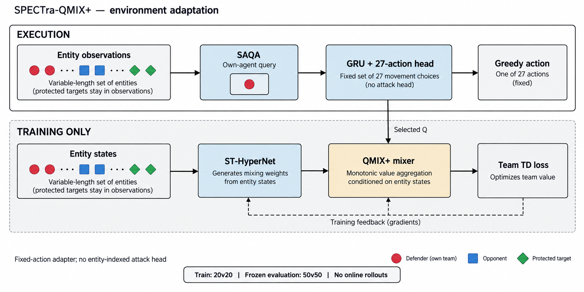
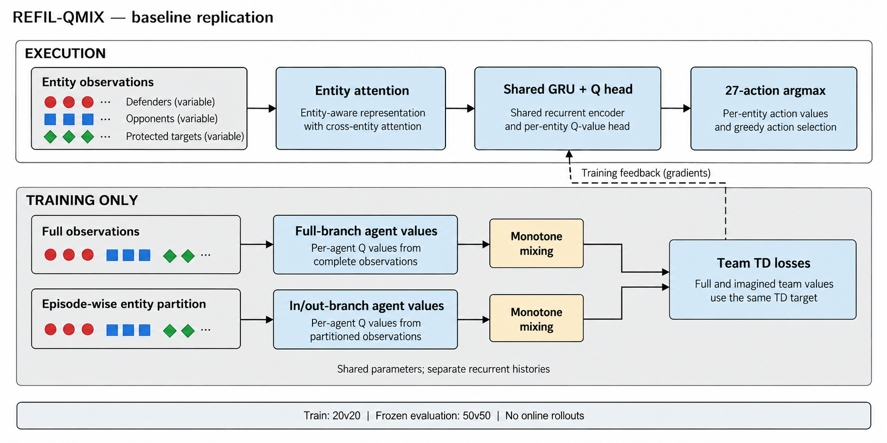
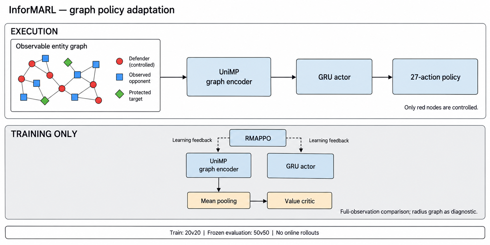
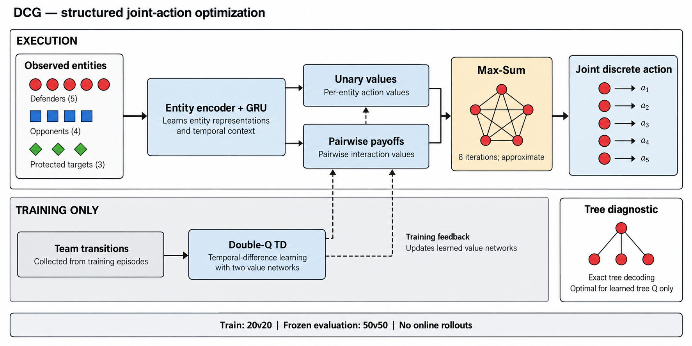

# 动态规模攻防策略：面向 20v20→50v50 的文献迁移与复现方案

调研核验日期：2026 年 9 月 9 日。阶段定位：**迁移已有方法、复现结果、识别能力边界**。本文是一份待实施的研究方案；除明确标注的历史记录与原论文结果外，不包含新完成的训练、胜率或延迟实测。

**最终选择四个复现对象：SPECTra-QMIX⁺、REFIL-QMIX、InforMARL、DCG。** 其中 REFIL 是已有基线在新协议下的重新验证，其余三个是新增迁移对象；第三章并列介绍两个端到端方法，全文仍保持五章。 主实验只在 20v20 训练，冻结全部策略参数后直接评估 50v50；执行时每个物理步决策，不进行在线分支仿真。这里的 DCG 使用“学习到的结构化价值模型＋动作优化器”，并非动力学模型预测控制。四张图是方案总览，精确公式、实施差异和保证条件以正文为准。

## 一、问题与背景

### 1.1 本阶段究竟要回答什么

当前问题不是立即设计一个全新的大规模攻防算法，而是回答：**在既定观测、动作、对手和实时预算下，哪些现成机制能够从 20v20 迁移到 50v50？如果失败，原因是输入接口、训练不足、任务变难、表示能力还是决策计算量？**

研究结果允许是“已有方法已经足够”。只有在复现可信、对照充分、运行预算一致之后，才能把稳定出现的失败归纳成下一阶段需要解决的问题。

把规模记为三元组

$$
c=(K,N_R,N_B),
$$

其中 $K$ 是保护目标数，$N_R,N_B$ 分别是红方与蓝方单位数。“20→50”在主实验中特指 $(N_R,N_B)=(20,20)\to(50,50)$，不是总实体数从 20 变成 50。目标数变化、兵力配比变化、地图密度变化是另外的实验轴。

### 1.2 统一任务定义

红方控制所有防御单位，蓝方使用冻结且版本确定的策略。任意一个保护目标被摧毁，红方立即失败；按已有环境规则，蓝方全部消灭或到达时限且所有目标存活，红方成功。形式上，令 $Y$ 表示整局成功：

$$
Y=\mathbf 1\{\text{终止前没有任何保护目标被摧毁，且满足环境成功条件}\},
\qquad W(c)=\mathbb E[Y\mid c].
$$

主评价指标是整局成功率 $W$。不能用“平均保存目标数”替代它，否则牺牲一个目标换取其他目标存活可能在指标上受益，却违反任务定义。

根据你前述设置，本次采用以下接口基准：

| 项目 | 本阶段约定 |
|---|---|
| 物理空间 | 沿用现有三维仿真器，不另建彼此隔离的小战场 |
| 动作 | 每个存活红方选择 27 个离散加速度动作之一；非零方向来自归一化后的 $\{-1,0,1\}^3$，另含零动作 |
| 武器与碰撞 | 沿用环境现有规则；不能把“移动动作”悄悄改成直接选择攻击对象 |
| 可观测信息 | 沿用已有全场可观测实体信息；不读取蓝方私有指令、策略记忆或未来随机数 |
| 时间 | 先保留历史 50 步时限；若部署时限不同，四方法同时修改并重新建立基准 |
| 单位变化 | 不同 episode 可以有不同人数；局内死亡需要正确 mask；增援出生暂不加入主实验 |
| 对手 | 同一蓝方策略、同一参数版本；本阶段不做双方同时自博弈训练 |
| 执行 | 每个物理步输出一次联合动作；不增加在线环境推演或搜索轨迹 |

“固定对手”使红方可以针对固定的环境转移规律学习，但不会自动消除多智能体协同难度，也不意味着蓝方在每一步执行预先固定的动作序列。

### 1.3 现有 QMIX＋REFIL 结果能说明什么

本文统一使用文献名称 **REFIL**；你此前写的 REFIX/REFIX 在这里按其对应的实体随机分解方法理解。历史记录中的成功率是已有实验数据，不是本次重新运行的结果。

已有 S1 主要是单目标保护，训练组合为 2v1、3v1、3v2、4v1、4v2、4v3。一份单种子记录在 1200 个评估 episode 中成功 985 次，即 82.08%；其中训练内 4v3 的成功率约 54.5%，若干外推组合中 5v2 为 81.5%、6v3 为 71%。这些结果提示：现有方法并非人数一超出训练范围就必然失效，兵力配比和任务难度也明显影响结果。

但它还不能证明多目标泛化、20v20 学习充分或 50v50 零样本能力。你已有的实体注意力、人数特征、动态 mixer、GRU、随机分组辅助训练都是复现资产，不应重新包装成新增创新点。

### 1.4 主实验：严格的 20v20→50v50

以下是建议锁定的实验协议，数字是待实施配置，不是原论文设置或已完成实验。

| 实验组 | 训练数据 | 冻结后测试 | 回答的问题 |
|---|---|---|---|
| 主实验 | 只含 20v20；目标数先取 $K\in\{1,2,4\}$ | 20v20 与 50v50，保持对应 $K$ 相同 | 相同目标数下扩大双方人数，成功率和延迟怎样变化 |
| 中间尺度 | 同一个 20v20 checkpoint | 30v30、40v40 | 外推是平滑下降还是某一规模骤降 |
| 目标数外推 | 仍只用上述训练数据 | 20v20、50v50 下的未见 $K$，例如 6、8 | 区分人数外推与目标数外推 |
| 比例外推 | 仍只在 20v20 训练 | 例如 50v40、50v60 | 单独检验配比变化，不能混入主指标后只报总均值 |
| 难度诊断 | 原 20v20 checkpoint | 控制密度或目标负载的额外场景 | 识别几何、资源负载变化造成的性能损失 |

50v50 测试集不用于调超参数或挑 checkpoint。主要配置在 20v20 验证集上决定；如果查看 50v50 结果后修改了方法，后续必须换独立测试种子，并将其标为新的开发轮次。多规模混训可以作为后续补充，但不能替代“仅 20v20 训练”的主结论。

“效果不错”至少需要同时看两个量：

$$
W_{50},\qquad \Delta W=W_{50}-W_{20}.
$$

只看下降幅度不够：两个规模都只有很低胜率，也可能得到很小的下降。只看 $W_{50}$ 也不够：它可能掩盖明显的泛化损失。可进一步报告相对保持率 $W_{50}/W_{20}$，但 $W_{20}$ 很低时不应依赖这个比例。绝对胜率下限和允许下降幅度应作为验收参数登记；本报告不替你虚设一个已获认可的 80% 门槛。

### 1.5 规模变化与任务变化必须分开解释

固定目标数、扩大双方人数，会改变每个目标附近的威胁数量和拥挤程度。即使兵力比例保持 1:1，最优可达胜率也可能变化。地图扩大会改变到达时间；增加目标数则增加全局失败机会。因此，“50v50 胜率降低”不能单独证明网络的规模泛化机制失效。

主实验保留实际部署要求的地图和生成规则；额外设置密度、目标负载对照用于解释原因，不用较容易的场景替代主测试。你历史脚本中若蓝方横向展开宽度随人数增长，例如含 $180(N_B-1)$ 的规则，也应记录它造成的几何变化，不能只修改人数参数而不检查初始局面。

### 1.6 实时性是验收条件

设允许的单步决策时间为 $L_{\max}$。用户尚未给出具体毫秒数，不能声称任一方法已经满足这个 deadline。计时范围应包含：实体整理、图构建、数据传输、网络前向、动作优化以及输出动作；排除环境物理更新本身，但单独记录端到端控制周期。

必须在实际部署硬件上以 **batch size = 1 个场景** 测量，报告 P50、P95、P99、观测到的最大值、超时率及峰值显存。训练时把许多场景合批的吞吐量，不能代替单场景延迟。GPU 计时需要同步，首次加载与预热另列。

四方法的部署候选都不允许在决策函数内调用环境副本的 `step()`。DCG 的消息计算只处理当下输出的价值表；它与运行许多场仿真是不同的计算过程。即使如此，DCG 也必须实测延迟，不能从“多项式复杂度”直接推出实时性。若需要严格最坏时延保证，仅靠 P99 实测仍不充分，还需部署系统层面的时限分析。

## 二、文献概述、五类方法比较与最终选择

### 2.1 调研范围与证据等级

本次以原论文、会议页面、作者仓库和官方补充材料为主要证据，重点核对可变规模、在线计算、任务建模前提和保证条件。这是围绕迁移决策的定向调研，不是声称穷尽所有论文的系统综述。文献存在公开代码也不等于已在当前环境复现成功。

五类方法不是互斥集合：图既可用于聚合观测，也可用于表示联合价值并求动作；分层架构也可以包含图模块。因此，最终选择的是 **四个具体可复现对象**，不要求每个对象各占一个互不相交的类别。

| 候选类型 | 代表文献 | 对 20v20→50v50 的价值 | 当前取舍 |
|---|---|---|---|
| 实体端到端策略 | QMIX；REFIL；SPECTra | 参数共享、集合输入、置换处理；直接复用现有基础 | **选择 SPECTra-QMIX⁺ 与 REFIL-QMIX**，分别检验新迁移架构和已有基线 |
| 分层分配／多层关系 | ALMA；HAMA | 借助子任务结构或类型层次简化学习 | 暂缓完整迁移，先不自建“目标—责任—动作”三层 |
| 显式优化＋RL | Carion 结构化分配；DCG；Rollout | 学习评分或价值，再利用确定的求解机制选动作 | **选择 DCG**；移除不符合在线预算的 Rollout |
| 图信息聚合 | InforMARL | 保留实体身份与几何关系，共享策略处理不同人数 | **选择 InforMARL**，检验观测表示的贡献 |
| 平均场 | MF-Q/MF-AC；多类型平均场；Major-Minor；SUBSAMPLE-MFQ | 压缩群体交互，具有大规模实验及条件性理论依据 | 重要后续对象；本轮先核查近似结构是否适配 |

### 2.2 关键论文与复现入口

| 文献 | 已有机制与证据 | 本场景不能直接继承的结论 |
|---|---|---|
| [QMIX，ICML 2018](https://proceedings.mlr.press/v80/rashid18a.html) | 单调价值混合，个体贪心对应混合价值的联合最大化 | 不等于真实联合价值可被单调模型完整表示 |
| [REFIL，ICML 2021](https://proceedings.mlr.press/v139/iqbal21a.html)；[作者代码](https://github.com/shariqiqbal2810/REFIL) | 实体注意力、随机实体分解辅助学习；提供 `refil` 与 `qmix_atten` | 变长接口及组合泛化实验不构成当前 20→50 成功率保证 |
| [SPECTra，2025 v1](https://arxiv.org/html/2503.11726v1)；[作者代码](https://github.com/funny-rl/SPECTra) | SAQA、集合超网络、QMIX⁺；覆盖置换、变长结构和训练效率 | 课程包含目标规模继续训练；没有冻结 20→50 成功率保证 |
| [InforMARL，ICML 2023](https://proceedings.mlr.press/v202/nayak23a.html)；[作者代码](https://github.com/nsidn98/InforMARL) | UniMP 图信息聚合＋RMAPPO；原 Target 实验测试到 15 个智能体 | 导航等任务的跨人数结果不能替代 50v50 全目标保护测试 |
| [DCG，ICML 2020](https://proceedings.mlr.press/v119/boehmer20a.html)；[作者代码](https://github.com/wendelinboehmer/dcg) | 共享单体／成对价值、Max-Sum、TD 学习；原生支持完整图和树拓扑 | 原论文不是本任务 20→50 的现成成功报告；有环有限轮求解不是全局精确 |
| [ALMA，NeurIPS 2022](https://arxiv.org/html/2205.14205v2)；[作者代码](https://github.com/shariqiqbal2810/ALMA) | 子任务分配与执行两层；多建筑消防等复合任务 | 需要定义子任务及其关联；不是原生三层决策方案 |
| [HAMA，AAAI 2020](https://ojs.aaai.org/index.php/AAAI/article/view/6214) | 类型内与类型间的层级注意力 | 不等于目标—责任—动作三级；本轮未核实作者公开实现 |
| [Carion 等，NeurIPS 2019](https://proceedings.neurips.cc/paper/2019/hash/3c3c139bd8467c1587a41081ad78045e-Abstract.html)；[官方补充代码](https://proceedings.neurips.cc/paper_files/paper/2019/file/3c3c139bd8467c1587a41081ad78045e-Supplemental.zip) | RL 输出优化器评分，AMAX／LP／QUAD 得到分配，固定底层执行 | 松弛舍入不等于整数全局最优；原“实时”时标不一定满足本任务 |
| [MF-Q/MF-AC，ICML 2018](https://proceedings.mlr.press/v80/yang18d.html)；[作者代码](https://github.com/mlii/mfrl) | 用邻域平均作用近似联合交互；包含大群体对抗实验 | 收敛分析依赖条件，不能直接推广到任意神经策略和动力学 |
| [多类型平均场，AAMAS 2020](https://arxiv.org/abs/2002.02513)；[作者代码](https://github.com/BorealisAI/mtmfrl) | 区分不同类型群体；作者实现含四队、每队 72 单位的任务 | 能处理类型不代表已保留所有关键个体与位置关联 |
| [Major-Minor MF MARL，ICML 2024](https://proceedings.mlr.press/v235/cui24a.html)；[作者代码](https://github.com/tudkcui/M3FC-MARL) | 大量相似个体与少量复杂主体并存，含有限人口近似结果 | 被动保护目标不能不加分析就当作论文中的 major agent |
| [SUBSAMPLE-MFQ，NeurIPS 2025](https://proceedings.neurips.cc/paper_files/paper/2025/hash/0c8d49f2744d8ee4d5948621d6bb5bc0-Abstract-Conference.html)；[作者代码](https://github.com/emiletimothy/Mean-Field-Subsample-Q-Learning) | 按子样本规模学习，给出条件性的近优误差分析 | 其动力学和奖励结构假设需核查，不能直接给当前 20→50 背书 |

### 2.3 为什么第二个对象先选择 InforMARL，而不是自建三层网络

你原先的三层想法仍有研究价值，但“网络有三层模块”本身不提供可复现的算法定义。ALMA 的原生结构是分配—执行两层，HAMA 的层级体现为不同关系类型的聚合。将它们改写成一个全新的目标层、责任层、动作层，会同时引入任务定义、时间尺度、奖励归因和训练稳定性等变量，难以在本阶段判断已有方法究竟哪里不够。

需要纠正一个容易产生的误解：**ALMA 原文已有 No mask 消融，作者仓库也提供全观测条件选项。** 因此，暂缓 ALMA 的理由不是“底层一定不能看组外信息”，而是仍需明确环境的子任务、实体关联和分配接口。在本轮优先检验直接动作策略时，InforMARL 能更直接接入现有动作和全场实体，减少额外任务分解假设。[ALMA 原文](https://arxiv.org/html/2205.14205v2)、[作者配置](https://github.com/shariqiqbal2810/ALMA)。

如果后续四个方法都出现长期遗漏某个保护目标，而短程动作控制表现正常，ALMA 就是有依据的下一批迁移对象；这时再研究显式分配层，证据会更充分。

### 2.4 为什么平均场重要，但本轮暂不占用一个主要名额

典型平均场方法用邻域动作的经验分布代替完整联合动作关系。例如：

$$
\bar a_i=\frac{1}{|\mathcal N_i|}\sum_{j\in\mathcal N_i}\operatorname{onehot}(a_j),
\qquad Q_i(s,a_i,\bar a_i).
$$

它压缩的是群体交互，不是简单地把神经网络中的某个池化操作改成 mean。InforMARL critic 的均值池化也不能视为已经复现了平均场 MARL。[MF-Q/MF-AC 原文](https://proceedings.mlr.press/v80/yang18d.html)。

不能因为存在对抗、红蓝异构或关键实体就排除平均场：多类型和 Major-Minor 文献正是在扩展这些情况。真正需要验证的是，本任务里决定成败的信息能否被群体分布充分表达。举例来说，两个位于不同目标附近的红方交换动作，平均动作直方图可能不变，但被及时支援的目标不同。这是一个需要通过实验判断的近似损失，不是对所有平均场形式的否定。

较新的 SUBSAMPLE-MFQ 与小样本控制大群体的目标很接近。不过其主要分析采用全局状态和条件化局部转移、全局奖励加平均局部奖励等结构；本任务存在直接碰撞、伤害耦合及“任一目标失败即全局失败”。因此不能把论文中的、随抽样数约按 $\widetilde O(k^{-1/2})$ 缩小的误差项，直接改写为当前 $k=20,n=50$ 的胜率保证。[论文全文](https://arxiv.org/html/2412.00661v4)。

当前优先图表示，是因为保留身份—几何关联需要更少的附加建模。若 50v50 实测显示全场图成为延迟瓶颈，而局部个体身份作用较弱，平均场应提升为下一轮优先基线。这一取舍是复现预算分配，不是认定平均场不适用。

### 2.5 为什么优化器路线选择 DCG，而不是在线 Rollout 或复杂分配求解器

在线 Rollout 需要评估多个候选动作的未来轨迹，直接违反本次逐步实时、不能多场推演的要求，故不列入执行方案。

Carion 等的方法则是你所设想的“RL 控制优化器输入”的直接文献依据。其官方补充包已核验包含源码和预训练模型；不是只有概念而无实现。不过，原文最大 80v82 场景中 QUAD 的一次计算约为 505 ms，不能据“用于实时游戏”就认为适合本任务。它还依赖任务分配与固定动作执行器，接入现有 27 加速度动作需要额外验证。LP 的松弛与舍入、源码中的容量取整和未分配成员处理，也要求谨慎区分数学问题与最终执行动作的保证。[原论文](https://arxiv.org/html/1910.08809v1)、[官方补充代码](https://proceedings.neurips.cc/paper_files/paper/2019/file/3c3c139bd8467c1587a41081ad78045e-Supplemental.zip)。

DCG 可以直接在现有离散动作上学习一元和成对价值，并用 Max-Sum 求联合动作。它不需要先规定“每个保护目标应该配几个人”，也不需要制作新的拦截指令执行器，因而更适合当前迁移阶段。

这里也保留一个明确边界：**DCG 是结构化价值模型＋优化器，不是准确物理模型＋RL。** 选它是为了在现有动作接口上检验显式协同优化能否兼顾性能和延迟，不能把它描述成获得了物理预测或安全约束保证。

### 2.6 四个复现对象与三类主要机制

| 对象 | 核心待检验机制 | 机制差别 | 主要风险 |
|---|---|---|---|
| SPECTra-QMIX⁺ | 置换与规模接口完整处理后能否改善外推 | SAQA＋集合超网络；actor 直接输出动作 | 数量兼容不等于未见规模胜率保持 |
| REFIL-QMIX | 已有实体关系与辅助分解能否迁移到 50v50 | 对既有方法按新协议重新验证 | 实体竞争、关系分布变化；单调价值限制 |
| InforMARL | 图信息聚合能否形成更可迁移的个体决策表示 | 图用于观测表示；动作由 RMAPPO actor 直接输出 | 图变密、邻域分布漂移、PPO 训练预算与稀疏奖励 |
| DCG | 学到的成对协同＋联合动作优化能否改善外推 | 图用于动作之间的价值关系和求解 | 完整图成本增长，树图容量损失，学习价值误差 |

四个对象都没有文献定理直接保证本任务的 $W_{50}$ 接近 $W_{20}$。本阶段的价值在于让上述假设能够分别被检验，而不是在实验前承诺某个对象一定成功。

新增 SPECTra 后，保留 REFIL 的理由是已有资产可以提供直接比较，所需工程增量较小；并非要额外设计一个端到端变体。四个算法对应三类核心机制：端到端集合策略、图观测聚合、结构化动作优化。平均场仍是下一批有文献基础的候选。

## 三、两个端到端复现方法：SPECTra-QMIX⁺ 与 REFIL-QMIX

### 3.1 为什么把 SPECTra 提升为主要复现对象

本章仍属于端到端 QMIX 路线，重点复现用户补充的 **SPECTra-QMIX⁺**。其主张不只涉及实体输入，还覆盖单智能体查询注意力 SAQA、动作输出的置换处理和基于集合的非线性 mixer。它有作者代码，与“共享参数、人数变化、每步快速前向”的要求相近。这里依据用户指定的 2025 年 v1 原稿，不把未经核验的后续发表状态写进引用。[SPECTra 原文](https://arxiv.org/html/2503.11726v1)、[作者代码](https://github.com/funny-rl/SPECTra)。

已有 REFIL-QMIX 保留为对照，先分别迁移两个完整方法。**本阶段不构造 SPECTra＋REFIL 辅助损失的混合新算法。** REFIL 基线能够回答“已有方法是否足够”，SPECTra 则回答“完整处理置换与规模接口，是否带来额外收益”。

论文排版技术图：[可编辑 SVG](figures/vector/spectra.svg) · [矢量 PDF](figures/vector/spectra.pdf) · [600 dpi PNG](figures/vector/spectra.png)。

*图 1：部署只使用共享 actor；集合超网络与 mixer 服务于集中训练。固定 27 动作头是当前环境适配，原 SMAC 的实体索引攻击分支不适用于本任务。REFIL 是独立对照，不是图中的新增训练分支。*

### 3.2 三种“可扩展”不能混为一谈

| 性质 | 在本场景中的含义 | 验证方式 |
|---|---|---|
| 实体顺序不变性 | 固定红方自身，打乱其他实体存储顺序，其 27 个动作价值应不变 | 相同物理状态与对应 mask 的重排检查 |
| 智能体重标号等变性 | 重排红方索引和对应记忆，输出动作只应按同一排列重排 | 比较对应单位输出，而不是比较数组原位置 |
| 数量接口兼容 | 从 20v20 改为 50v50，不增加或重新训练网络权重 | 同一 checkpoint 加载并运行 |
| 未见规模性能 | 50v50 的成功率仍达到要求 | 独立冻结评估；不能从前三项自动推出 |

例如，两个蓝方仅交换列表位置，世界没有改变；从 20 个蓝方增加到 50 个，世界本身已经改变。置换处理解决前一种冗余，不会直接解决后一种分布变化。这是本阶段必须补测 20→50 的原因。

### 3.3 网络与训练接口

令 $\mathcal E_{i,t}$ 为红方 $i$ 可观察的实体集合。保持 SPECTra 原生的类型编码、SAQA、循环记忆和 mixer 机制，以当前符号表示 actor 接口：

$$
z_{i,t}=\operatorname{SAQA}(e_{i,t},\{e_{ij,t}:j\in\mathcal E_{i,t}\}),\quad
h_{i,t}=\operatorname{GRU}(z_{i,t},h_{i,t-1}),\quad
q_{i,t}=\operatorname{Linear}_{27}(h_{i,t}).
$$

SAQA 以自身为查询，对实体键和值聚合。训练时，保留原 ST-HyperNet 根据实体化状态生成相应维度的混合权重，并使用非负权重保持 QMIX 式单调性。部署时每个红方直接执行合法动作中的 $\arg\max q_{i,t}$，不用调用 mixer。[原文第 4 节](https://arxiv.org/html/2503.11726v1)。

迁移实施上，需要把 $N_R$ 条个体价值与超网络输出的红方顺序严格对齐；蓝方和保护目标作为状态上下文，不能被误当成需要混合的受控个体。原实现若假定只有 ally/enemy 类型，增加 protected-target 类型与对应输入 mask 属于环境适配，应单列提交，不能靠把保护目标混入敌方类型解决。

训练保持作者 learner、TD 目标、target network 和 replay 机制。不要因名称同属 QMIX，就把现有 REFIL learner 的所有超参数和辅助损失未经核对直接复制过来。原基准采用原配置，公平迁移实验再统一场景、奖励与训练预算。

### 3.4 固定 27 动作与多目标的具体适配

SPECTra 的 SMAC 版本包含针对特定实体的动作输出，而本环境的 27 个动作是固定加速度方向，不随蓝方编号改变。原文 GRF 附录已有固定动作空间的适配实例，为修改输出接口提供了依据；本任务不需要照搬其中的传球池化细节。[原文附录 D](https://arxiv.org/html/2503.11726v1)。

| 适配项 | 具体做法 | 保留的原机制 |
|---|---|---|
| 动作语义 | 使用由循环表示输出的固定 27 类动作头；移除无对应语义的实体攻击分支 | SAQA、循环记忆、共享 actor |
| 保护目标 | 每个目标独立编码；位置、生命、存活、类型进入实体表 | 集合输入及 mask |
| 原单目标 task 向量 | 将目标专属字段迁入目标实体；本体状态、时间等保留为固定维公共上下文 | 不新增目标分配层 |
| Mixer 状态 | 整理成实体状态，区分受控红方与其他上下文；禁止固定人数拼接或固定长度 ID 泄漏 | ST-HyperNet 与原非线性混合 |
| 数量变化 | 重建容器尺寸和 mask，参数保持不变 | 共享参数与集合处理 |
| 死亡 | 只有 no-op 合法，存在 mask 与死亡标记分离，记忆跟随持久 ID | 原动作合法性及循环策略语义 |

不能把多个目标坐标取均值，也不能替策略预先指定最近目标。否则，结果检验的是被改写的信息条件，而不再是方法能否从全场信息自主保护所有目标。

### 3.5 独立复现对象 REFIL-QMIX：设置、机制与对照

你已有的 REFIL 编码器已经用本体／任务信息查询实体；因此 SAQA 的“只用自身查询”与既有实现有相近之处。不能把新旧差别描述为“旧方法是全连接自注意力，新方法首次线性注意力”，也不能预先宣称大幅加速。

需要比较的完整对象是：SPECTra 的类型编码、动作输出适配、状态集合超网络、非线性混合和训练配置，与当前 REFIL 的实体注意力、动态 mixer 和随机分解辅助目标。先分别复现，再根据结果决定是否值得做更细模块消融。

REFIL 基线保留以下历史资产，并与作者实现核对：128 维实体注意力、4 个头、64 维 GRU、隐藏维 32 的 mixer；完整与辅助分支按 $0.5/0.5$ 加权；随机实体分组在 episode 内保持一致，各分支有独立循环历史；正常部署只用完整观测分支。保留原动态 mixer 的聚合约定，不在 50 规模临时改为人数平均。目标网络更新计数单位等细节也需要核对。[REFIL 原文与补充材料](https://proceedings.mlr.press/v139/iqbal21a/iqbal21a-supp.pdf)、[作者代码](https://github.com/shariqiqbal2810/REFIL)。

基线至少包括 REFIL-QMIX；若需要确认随机分解本身的作用，再加入同一作者的 `qmix_atten`。这两个是本章内部对照，不额外扩展研究路线。

论文排版技术图：[可编辑 SVG](figures/vector/refil.svg) · [矢量 PDF](figures/vector/refil.pdf) · [600 dpi PNG](figures/vector/refil.png)。

*图 2：REFIL 作为独立算法复现；随机实体分组只出现在训练，部署使用完整观测策略。它不与 SPECTra 的超网络混接。*

REFIL 的具体执行链是“实体注意力→共享 GRU→27 维个体 Q→合法动作贪心”。训练链使用动态单调 mixer：

$$
Q_{\mathrm{tot}}=f_{\mathrm{mix}}(q_1,\ldots,q_{N_R};s),\qquad
\frac{\partial Q_{\mathrm{tot}}}{\partial q_i}\geq0.
$$

同时按原分组机制构造 imagined value，拟合同一真实 TD 目标：

$$
\mathcal L=(1-\lambda)\mathcal L_{\mathrm{TD}}+\lambda\mathcal L_{\mathrm{aux}},\qquad\lambda=0.5.
$$

不能把辅助分支改成自行设计的局部奖励。不同分支共享网络参数，但循环历史单独维护；按 episode 采样分组并维持时序一致。全部推理分支只有正常完整观测分支参与部署。[REFIL 原文](https://proceedings.mlr.press/v139/iqbal21a.html)。

具体工程步骤为：固定作者 REFIL 版本，先用 `group_matching` 核验；在现有单目标环境回归动作和终止逻辑；把单目标字段迁入多目标实体表；按同一 20v20 协议从头训练，再冻结评估 50v50。旧小规模 checkpoint 的热启动若要测试，必须作为额外经验的独立对照，不并入主结果。

对应你已有实现，保持原 replay、Double Q、mask 与 mixer 约定；本阶段不增加新的动态分组决策网络。以相同 $K$、相同蓝方策略和相同训练预算对比 SPECTra，才能判断新架构是否比已有基线提供了实际收益。

### 3.6 20v20→50v50 的复现步骤

1. **原生核验。** 按作者仓库的 `SPECTra_SMACv2/scripts/sc2_v2/protoss_5v5/spectra_qmix_plus.sh` 入口建立原生 sanity check。它用于核验移植前实现，不把原生基准预训练权重混入本任务的“仅 20v20 训练”主结果。[作者运行说明](https://github.com/funny-rl/SPECTra)。
2. **旧任务回归与接口适配。** 在现有环境验证终止、动作解码、实体重排、目标数变化和死亡处理；这一步区分代码错误与学习困难。
3. **20v20 从头训练。** SPECTra-QMIX⁺ 与 REFIL-QMIX 使用相同场景分布和训练预算。主实验不启用逐步增大人数的课程，不使用 50v50 数据，也不另行拼接两种算法。
4. **冻结测试。** 固定权重与归一化统计，在 20v20、30v30、40v40、50v50 评估；根据 20v20 验证集选 checkpoint。目标数和配比外推另列。
5. **诊断。** 比较绝对成功率、保持幅度、实体重排误差和单步延迟。需要进一步定位时，使用作者已有 SPECTra-VDN 等消融；不先增加原创模块。

原稿的课程学习在小场景完成约 30% 训练后，会在目标场景继续训练剩余部分；其中的迁移学习也不能当作已验证的冻结 20→50 结果。这些实验支持“可以复用参数与继续学习”，本任务则要专门检验“完全不继续学习”。[原文第 5.2 节](https://arxiv.org/html/2503.11726v1)。

### 3.7 实时性与复杂度应如何解释

令单个红方观察 $M=N_R+N_B+K$ 个实体。单查询注意力的实体关联部分随 $M$ 增长，而所有 $N_R$ 个红方都要决策时，相关总工作量仍约随 $N_RM$ 增长；线性投影、GRU、特征整理和设备调度另计。固定 $K$ 时，20v20 到 50v50 的这部分工作量约增大六倍量级，而不是“总计算量保持不变”。

SPECTra 原论文的注意力复杂度和推理比较支持其作为快速前向候选，但不能替代当前硬件、batch=1、50v50 的实测。其 mixer 具有规模相关的运行时张量，虽然部署不调用它，训练显存与耗时仍应记录。你的 REFIL 实现已有单查询结构，因此速度差异尤其应由实测给出。

若重排检查通过、相同权重也能运行 50v50，但成功率明显下降，说明“置换与形状问题解决后，性能外推仍有困难”；若 SPECTra 与 REFIL 都表现良好，则本阶段已有方法已经给出可行方案。只有 20v20 尚未充分学习时，不能把 50v50 的失败归因于规模泛化。

## 四、方法三：InforMARL 的图策略迁移

### 4.1 复现对象与技术方案图

对象是 InforMARL 的 **UniMP 图聚合＋RMAPPO**，采用作者原 PyTorch 实现作为基准。图用于处理观测与关系，策略仍直接输出动作；不另接 QMIX mixer，也不改称上中下三层决策。[ICML 2023 论文](https://proceedings.mlr.press/v202/nayak23a.html)、[作者仓库](https://github.com/nsidn98/InforMARL)。

论文排版技术图：[可编辑 SVG](figures/vector/informarl.svg) · [矢量 PDF](figures/vector/informarl.pdf) · [600 dpi PNG](figures/vector/informarl.png)。

*图 3：actor 使用本体信息和图聚合结果；集中 critic 用池化表示辅助训练。critic 不参与部署时的动作求解。*

### 4.2 原生机制与当前场景的映射

图节点包括受控红方、可观测蓝方、保护目标，以及环境已有的障碍物。红方之间可以聚合通信信息；蓝方和目标作为被观测实体输入，不能把蓝方策略内部状态当作我方消息。

用示意符号表示图聚合和策略：

$$
z_i^{\ell+1}=W_1z_i^\ell+\sum_{j\in\mathcal N_i}\alpha_{ij}^\ell W_2z_j^\ell,
\qquad \pi_\theta(a_i\mid o_i,z_i,h_i).
$$

实际实现保留作者 UniMP 的边特征、多头机制和网络细节，而不是用上述简式重新造一个 GNN。critic 对红方图表示池化，估计状态价值 $V$，不是成对动作价值或 QMIX 的 $Q_{\rm tot}$。这些网络由原 RMAPPO 的策略、价值与熵目标训练。[原文与补充信息](https://proceedings.mlr.press/v202/nayak23a/nayak23a.pdf)。

### 4.3 必要适配：先保证信息与动作语义一致

| 原设置／接口问题 | 本次迁移方式 | 需要特别检查的风险 |
|---|---|---|
| 原导航通常有每个 agent 的指定 goal | 删除或置空预分配目标条件；所有保护目标进入实体图 | 不能给 InforMARL 额外提供一个“正确分配”答案 |
| 二维离散加速度 | 输出头替换为当前三维 27 类动作，沿用动作映射 | 不把任务改成连续控制 |
| 距离决定感知边 | 主对照覆盖全场可观测合法边，标记 FullObs 迁移配置 | 不能靠减小信息范围获得速度后直接与全观测基线比较 |
| 多种实体状态 | 使用相对位置、速度、生命、类型和存在标志等公共实体字段 | 不读取蓝方隐藏意图，不压缩成唯一目标 |
| episode 内死亡 | 合法动作、active loss、图池化和循环记忆一致处理 | 池化分母不包含 padding；全亡时处理终止边界 |
| rollout buffer 常按固定人数分配 | 每个同步 rollout 使用同一规模，跨 rollout 重建缓冲；或 padding＋active mask | 网络可变长不意味着训练容器无需修改 |

正式 20v20 训练本身人数固定，跨规模评估只重建图和运行时容器，参数保持不变。按第一章扩展目标数或额外混合人数实验时，再启用相应 buffer 适配。

原论文的感知稀疏图可作为第二配置单独评估。它可能降低成本，但截掉远处目标会改变本任务的信息条件；因此要同时报告保留了哪些信息。FullObs 主配置在 50v50 下可能形成较密图，**不能声称仍有固定邻居数带来的线性复杂度优势**。

### 4.4 训练与迁移步骤

先按作者入口 `onpolicy/scripts/train_mpe.py` 核验 `GraphMPE / navigation_graph / rmappo`。README 提供 3 个 agent、200 万环境步、25 步 episode、128 个 rollout 线程等基准配置；这用于原生环境核验，不能直接当作本任务已经调好的超参数。[作者复现入口](https://github.com/nsidn98/InforMARL)。

之后替换环境接口与动作头，保留 UniMP、GRU、RMAPPO、GAE 和价值训练机制。20v20 训练使用与其他方法一致的场景、奖励和预算；PPO 的批次组织保留算法本身要求，不强行改成 QMIX 的 replay 学习。

迁移后应逐一确认：实体顺序置换不应改变同一物理状态下对应单位的决策；不同 $K$ 不触发输入维度变化；死亡单位不污染 actor loss；actor 在部署时不依赖训练 critic；50v50 加载同一个 checkpoint 可完成整局而无需扩展权重。

这些检查针对真实迁移风险。通过它们只能说明实现接口可信，不能替代成功率测试。

### 4.5 为什么值得用于 20→50，以及证据的限度

InforMARL 的优势假设是：共享的局部关系算子比固定长度拼接更容易迁移到不同人数。它还允许策略同时结合本体状态与实体关系，对碰撞、拦截和多目标信息的表示较自然。

但原论文的跨人数实证主要来自导航、覆盖、编队等任务，Target 实验训练规模包含 3、7、10，评估到 15；这不是当前 20v20→50v50 的直接证据。目标保护的“任一点失败”奖励以及红蓝相互影响，仍可能形成新困难。[原论文实验](https://proceedings.mlr.press/v202/nayak23a/nayak23a.pdf)。

本章主对照为 InforMARL-FullObs，附加原距离图配置用于诊断性能与时延的折衷。若全图胜率好但超时、稀疏图够快却遗漏远处威胁，这才形成一个明确的待研究问题；本阶段先记录，不立即加入原创关键目标广播或学习删边模块。

## 五、方法四：DCG——不调用仿真器的联合动作优化

本方法迁移 **Deep Coordination Graphs（DCG，ICML 2020）**。它把每一步的团队动作价值表示为单体效用与成对协同收益，再用 Max-Sum 求解联合动作。网络由真实团队回报训练，优化器在训练和执行时参与动作选择；执行阶段不创建候选环境、不预测多场对局，也不调用环境分支仿真。这是已有的“学习价值模型＋在线组合优化”方法，能够直接检验优化器嵌入 RL 是否适合当前场景。[DCG 论文](https://proceedings.mlr.press/v119/boehmer20a.html)

### 5.1 复现对象与本阶段的修改边界

原方法使用共享循环编码器、共享单体效用头、共享成对收益头和消息传递求解器。官方仓库基于 PyMARL，提供完整图、`cg_edges=star`、`cg_edges=line`、`cg_edges=cycle` 等配置，以及低秩收益矩阵选项 `cg_payoff_rank`。原生小任务可以先运行 `rel_overgen`，检查完整图配置的学习链路。[官方代码与配置说明](https://github.com/wendelinboehmer/dcg)

本场景版本命名为 **DCG-Entity，意为实体输入适配的 DCG**。第一版只做以下迁移：

| 部分 | 迁移规格 | 性质 |
|---|---|---|
| 观测输入 | 用既有 REFIL 的实体注意力，将变长红蓝单位及目标表编码为固定维向量 | 必要输入适配 |
| 历史编码 | 编码结果接共享 GRU，保留上一动作与循环状态 | 沿用 DCG 的历史建模 |
| 智能体身份 | 去掉随人数变化的 one-hot ID，保留固定维物理属性、角色和存活标记 | 数量接口适配 |
| 动作空间 | 每个存活红方仍输出原有 27 种离散动作 | 环境动作适配 |
| 价值与训练 | 保留单体项、成对项、Double Q 与团队 TD 损失 | 保留算法核心 |
| 在线求解 | 原生完整图配合固定 8 轮消息传递；STAR 精确求解只作对照 | 原拓扑迁移及求解实现适配 |

**不加入 REFIL 辅助分组损失，不保留 QMIX mixer，不学习新的构图器。** 实体注意力在这里仅解决输入长度问题。原生环境检查仍使用官方原输入；不能把 DCG-Entity 称为零改动复现。

论文排版技术图：[可编辑 SVG](figures/vector/dcg.svg) · [矢量 PDF](figures/vector/dcg.pdf) · [600 dpi PNG](figures/vector/dcg.png)。

*图示只概括执行和训练关系；精确公式、mask 和最优性条件以本章文字为准。*

### 5.2 网络具体学习什么

设本局初始红方数量为 $n$，协调图为 $\mathcal G=(V,E)$。**图节点表示红方动作变量；蓝方与关键目标进入观测，不作为需要求解动作的节点。** 在固定对手条件下，本方法只优化红方联合动作。

每个红方的可观测实体集合为 $\mathcal E_{i,t}$，通过统一实体编码得到 $z_{i,t}$，再计算：

$$
h_{i,t}=\operatorname{GRU}_{\psi}
\bigl(z_{i,t},a_{i,t-1},h_{i,t-1}\bigr).
$$

这里是接口表达，拼接位置以迁移实现为准。执行时可使用任务定义允许的全场物理信息，但不能输入蓝方私有指令。实体表长度可以变化，而 GRU 输入与隐藏维度保持不变。

单体头输出 27 个数：

$$
u_i(a_i)=f^V_\theta(a_i\mid h_{i,t}).
$$

对于边 $\{i,j\}\in E$，成对头输出两个单位动作组合的收益表。沿用原 DCG 的端点交换处理，定义：

$$
p_{ij}(a_i,a_j)=\frac12
\left[
f^E_\phi(a_i,a_j\mid h_i,h_j)
+f^E_\phi(a_j,a_i\mid h_j,h_i)
\right].
$$

交换端点时动作维度也交换，因此实现上第二张矩阵需要转置。这不要求同一张收益表自身对称。联合价值为：

$$
Q_\Theta(\tau_t,\mathbf a)=
\frac1n\sum_{i\in V}u_i(a_i)
+\frac1{|E|}\sum_{\{i,j\}\in E}p_{ij}(a_i,a_j).
$$

无边时省略第二项。原方法支持低秩构造成对收益矩阵，场景迁移先采用官方已有的 rank-1 选项；完整矩阵配置只在需要检查表达容量时补充。参数共享意味着增加节点与边不需要新增一套网络权重，但新增交互能否被学好仍是待检验问题。[原方法定义与低秩构造](https://proceedings.mlr.press/v119/boehmer20a/boehmer20a.pdf)

### 5.3 主配置：完整图与固定预算的联合动作求解

本阶段主候选采用原生完整图，训练时为 20v20，最终冻结网络权重直接测试 50v50。所有红方动作变量两两连接：

$$
E=\{\{i,j\}:1\le i<j\le n\}.
$$

选择完整图是为了优先保留成对协调表达，并避免任意 STAR 根带来的结构偏置；不预先承诺它能够达到用户要求的胜率。每步先生成单体表与成对表，再执行 8 轮 Max-Sum。本轮已核对作者代码：`dcg.yaml` 的默认值包括 `cg_edges=full`、`msg_iterations=8`、`msg_anytime=True` 和 `msg_normalized=True`；低秩默认未启用，本迁移选择原生 rank-1 选项并明确记录。

每条有向消息是长度为 27 的向量，更新规则为：

$$
m_{i\to j}(a_j)=\max_{a_i\in\mathcal A_i}
\left[
\frac{u_i(a_i)}n+\frac{p_{ij}(a_i,a_j)}{|E|}
+\sum_{k\in\mathcal N(i)\setminus j}m_{k\to i}(a_i)
\right].
$$

沿用原方法的消息归一化与逐轮联合动作评价，返回已检查轮次中学习价值最高的动作。这里的 anytime 指可以保存已检查解；**完整图存在环，固定 8 轮不提供全局最优保证，也不保证每个节点的消息已经收敛。** 原附录 Algorithm 3 已有保留最好轮次动作的步骤，无需添加新的搜索策略。[原算法伪代码](https://proceedings.mlr.press/v119/boehmer20a/boehmer20a-supp.pdf)

20 个红方的完整图有 190 条边，50 个红方有 1,225 条边，边数增加约 6.45 倍。50 规模下，8 轮双向消息的动作对检查量约为：

$$
2\times8\times1\,225\times27^2=14\,288\,400.
$$

这是表运算候选量，不是耗时测量；还没有包含实体编码、低秩矩阵重建、归一化和张量调度。该规模可能适合 GPU 批量计算，也可能超出目标设备的逐步时限，必须经过部署硬件的延迟测试。20v20 训练良好也不能替代 50v50 的实测。

### 5.4 理论与成本对照：STAR 上的条件最优求解

STAR 作为原生拓扑对照，用于区分求解成本与表示容量。它不替代完整图主方案，也不因为能精确求解就被预设为控制性能更好的方法。

本阶段不设计状态驱动的图选择策略。按本局初始红方索引选择固定根节点 $r$，其余红方作为叶节点：

$$
E=\{\{r,j\}:j\ne r\}.
$$

根节点是计算结构中的中心，不代表指挥官角色，也不额外获取信息。该拓扑已有文献和官方配置支持。令 $\mathcal A_i$ 表示当前合法动作集合，对每个根动作 $a_r$ 和叶节点 $j$，计算：

$$
M_j(a_r)=\max_{a_j\in\mathcal A_j}
\left[\frac{u_j(a_j)}n
+\frac{p_{rj}(a_r,a_j)}{n-1}\right],
$$

并保存达到最大值的叶动作 $B_j(a_r)$。随后选择：

$$
a_r^*=\arg\max_{a_r\in\mathcal A_r}
\left[\frac{u_r(a_r)}n+\sum_{j\ne r}M_j(a_r)\right],
\qquad
a_j^*=B_j(a_r^*).
$$

这就是树 Max-Sum 的汇集与条件回溯。在根动作固定后，各叶的动作优化彼此分离，故完整求解满足：

$$
\mathbf a^*\in\arg\max_{\mathbf a\in\prod_i\mathcal A_i}
Q_\Theta(\tau_t,\mathbf a).
$$

**保证对象是当前树形模型的学习价值，不是真实攻防任务的最优胜率。** 若多个动作并列最优，必须根据已选根动作回溯叶动作，不能让各节点独立打破平局。原论文讨论无环图的消息收敛条件；本章显式规定完整树回溯，是保证一致解码的求解实现适配，不宣称官方默认有限轮代码已经提供这一严格保证。[原文协调图与 Max-Sum 部分](https://proceedings.mlr.press/v119/boehmer20a/boehmer20a.pdf)

当 $n=50$、每个节点有 27 个合法动作时，需要检查的根—叶动作对数量为：

$$
49\times27^2=35\,721.
$$

保存回溯索引后，叶动作恢复只需 49 次查表；若不保存，重新查找最多再检查 $49\times27=1\,323$ 个叶动作。以上是候选数量，不能写成实测耗时。网络编码、收益表生成及数据传输仍需计算；尤其全场实体注意力的开销也会随数量增长。

### 5.5 一个不依赖仿真的数值例子

取仅含一条边的两个红方，把每人的 27 动作暂时缩成 A、B 两个以便演示。假设两人的单体效用均为 $u_i(A)=0.2,u_i(B)=0$，成对项为 $p(A,A)=0$、$p(A,B)=p(B,A)=-0.2$、$p(B,B)=0.8$。按单体项除以 2 的定义，联合价值为：

| 单位 1 / 单位 2 | A | B |
|---|---:|---:|
| A | 0.20 | −0.10 |
| B | −0.10 | **0.80** |

只看单体效用，两人都会选 A。但以单位 1 为根：根选 A 时，最好的完整组合价值是 0.20；根选 B 时，叶也选 B，价值为 0.80，因此优化器输出 B、B。

这些数值是机制示例中的学习价值，不是实际胜率。RL 的工作是用经验修正单体与成对项；优化器的工作是在当前表内正确组合动作。整个比较只读取网络输出，无需对 A、B 组合分别运行一场对局。

### 5.6 训练、mask 与数量变化的实现约定

每个环境时刻进行一次网络前向、一次联合动作求解，然后推进一次真实环境。执行的 $\mathbf a_t$、团队奖励和后续观测写入完整回合回放。Double Q 的下一动作也由同类求解器给出：

$$
\mathbf a'=\operatorname{Solve}
\bigl(Q_\Theta(\tau_{t+1},\cdot)\bigr),
$$
$$
y_t=r_t+\gamma(1-d_t)
Q_{\bar\Theta}(\tau_{t+1},\mathbf a'),
\qquad
\mathcal L=\mathbb E\left[(Q_\Theta(\tau_t,\mathbf a_t)-y_t)^2\right].
$$

梯度更新学习网络，不穿过离散消息求解过程。探索沿用原 $\epsilon$-greedy 机制；所有路线采用前文规定的共同胜负、奖励与终止协议。原生复核使用官方超参，迁移版本的任何改变单独记录。

变规模训练还需要修改运行器的数据接口。每局重置时，根据初始 $n$ 建图，按规模组织 batch 或使用明确的节点与边 padding mask。参数不变不意味着官方固定形状 buffer 无需修改。运行时索引只用于图连接与记忆路由，循环状态必须跟随持久实体 ID，不能随排序串给其他单位。

本迁移配置采用固定本局初始图：死亡节点保留，只有 no-op 合法，不因死亡新增重构规则；STAR 对照也不重新挑选根。归一化分母保持初始 $n,|E|$，padding 不参与；这是需要与作者死亡处理逐项核对的场景接口约定。成对网络输出保留有限数值，在消息发送者的最大化和最终动作 argmax 时限制合法动作，沿用作者的归一化逻辑；如果接收动作域存储了负无穷，均值归一化必须排除这些位置及 padding，避免产生 NaN。填充边不能进入求和，每个存在节点至少保留一个合法动作。

死亡节点的有效 no-op 因子仍按状态计算，不额外创造“删边重组”机制。STAR 对照的根死亡后只有一个根动作，叶之间通过根动作产生的联动自由度会退化；这也是完整图优先于 STAR 的一个理由，应单独统计。

**20v20→50v50 的迁移契约。** 这里的 20、50 分别是每一方的初始单位数，因此完整图的 1,225 条边只连接 50 个红方动作变量，而实体编码器同时读取红方、蓝方和关键目标。测试时允许根据实际数量重建图索引和张量尺寸，但不更新网络权重、不收集新数据训练、不根据 50v50 测试胜率挑选检查点。动作数、决策周期、可观测范围和对手策略协议保持一致。

数量归一化消除了价值求和随节点、边数线性放大的直接影响，却不能证明均值组成不变。新增蓝方可能改变交互密度，新增目标可能改变全保目标的难度；成对分解也未必能表达必须由三个以上动作共同决定的收益。因此，完整图提供“所有两两动作关系都有表达位置”，并不等于提供任意高阶联合价值。

最优性与复现指标分开记录：STAR 对照可以在很小动作规模的人工收益表上，与穷举核对树解码是否正确；完整图只记录返回动作的学习价值及消息预算。该检查属于数值求解器验证，不需要物理环境分支。策略效果仍以独立完整对局的最终成功率衡量，不能用更高的预测 Q 值代替胜率提升。

### 5.7 阶段实验与什么结果才构成问题证据

本阶段按以下顺序执行，不添加新的奖励分解或学习构图模块：

1. **原生完整图检查。** 使用官方小任务与完整图，确认训练和消息求解链路可用；此处不依赖 SC2 才能开始。少量运行只构成实现检查，不等于复现论文全部统计结论。
2. **主方案迁移。** 接入同一实体观测、27 动作和团队奖励，在 20v20 训练原生完整图、固定 8 轮消息传递版本；先完成训练内测试，再冻结权重直接测试 50v50。目标数量变化按共同协议另列，不能在规模外推测试时同时偷偷改变多个条件。
3. **STAR 对照。** 在同一训练与测试协议下使用 STAR 及完整树求解，比较降低边数带来的速度收益与性能代价。不因测试结果不佳而即时换根、加边或追加迭代。
4. **部署延迟门槛。** 在指定硬件、单场景执行条件下测量完整决策链的 p50、p95、p99 时延及超时率，与直接 RL 前向基线比较。只用验证集确定满足既定实时预算的配置，再锁定测试；未经测量不得宣称 STAR 或完整图满足毫秒要求。

原论文已观察到稀疏 LINE、STAR、CYCLE 在部分种子成功、部分种子失败，而完整图在对应实验更稳定。因此，本阶段优先完整图，STAR 只检查稀疏求解的速度、精确性与表达能力之间的取舍。[原论文拓扑比较](https://proceedings.mlr.press/v119/boehmer20a/boehmer20a.pdf)

结果需要分清：原生检查失败是实现或依赖问题；原生通过、训练内不佳是迁移与任务适配问题；训练内学好、50 规模下降才提供外推受限的证据。STAR 精确解码仍差、完整图明显改善，提示图结构或成对覆盖可能重要；若完整图超时而 STAR 胜率不足，这就是值得记录的阶段缺口，不立即补入新的构图算法。两者都差则还需检查价值学习、训练预算和高阶协作需求。本阶段完成实施后，应产出性能与时延证据，以及已有方法在本场景的适用边界。本文当前交付的是这套复现计划，尚未执行其中训练实验。

### 5.8 四个方法统一的执行清单与验收产物

建议先完成四个原生实现的运行核验，再做环境迁移；正式主实验至少使用 3 个独立训练种子，每个训练种子在每个锁定测试配置上评估至少 200 个独立 episode。这些是建议的最低实施起点，不是足以保证所有统计判断的固定样本量。若结论接近验收边界，按区间宽度补充评估；不能只展示最好的训练种子。

训练预算以 20v20 的物理环境步数为主要单位，同时报告总 agent-step 和 wall time。先通过 20v20 验证学习曲线确定可承担的预算，再锁定四方法的公平对照；SPECTra、REFIL、DCG 的 replay 和 InforMARL 的 on-policy 更新机制保持各自算法要求。50v50 不进入训练、调参或模型选择。多规模混训、50v50 专训只留作未来放宽约束后的工作，不属于本阶段主实验。

| 检查点 | 必须保存的证据 | 可支持的结论 |
|---|---|---|
| 原生复现 | 原论文配置、作者代码版本、依赖版本、随机种子、运行日志 | 实现链路可信；少量运行仅为 sanity check |
| 场景适配 | 实体 schema、27 动作映射、mask 和终止边界、逐项改动清单 | 没有通过修改任务语义取得优势 |
| 参数冻结 | checkpoint 标识、归一化状态、配置校验值 | 20→50 使用同一策略参数 |
| 效果 | 每个 $K$ 的 $W_{20}$、$W_{50}$、下降幅度、各种子结果与区间 | 成功率及保持程度，而非只看平均奖励 |
| 实时性 | 指定硬件上的 P50/P95/P99、观测最大时延、超时率、显存 | 在实际测量条件下是否满足 deadline |
| 失败诊断 | 首次失守、拥挤／碰撞、动作集中、目标遗漏、DCG 图与消息统计 | 形成具体待研究问题，不直接证明算法不可行 |

成功率可报告二项区间，并分别展示不同训练种子的差异；比较方法时优先使用同一批环境配置／种子，保留逐局结果，不能把同一训练种子下的全部 episode 当成多个独立训练复现。延迟测试用单场景，不能以大 batch 吞吐替代。目标数、人数、配比三个轴不混成一个总分后隐去困难配置。

主结果表应保留如下空白模板，待实验填写：

| 方法／配置 | 训练 | 测试 | $K$ | 成功率及区间 | 相对 20v20 下降 | P99 单步延迟 | 超时率 |
|---|---|---|---|---|---|---|---|
| SPECTra-QMIX⁺ | 20v20 | 50v50 | 按测试配置 | 待测 | 待测 | 待测 | 待测 |
| REFIL-QMIX | 20v20 | 50v50 | 同上 | 待测 | 待测 | 待测 | 待测 |
| InforMARL-FullObs | 20v20 | 50v50 | 同上 | 待测 | 待测 | 待测 | 待测 |
| DCG-Entity 完整图 | 20v20 | 50v50 | 同上 | 待测 | 待测 | 待测 | 待测 |
| DCG-Entity STAR 对照 | 20v20 | 50v50 | 同上 | 待测 | 待测 | 待测 | 待测 |

### 5.9 配图与引用的使用说明

四张 imagegen 图片提供各方法的概念总览；同时附独立制作的可编辑 SVG、矢量 PDF 和高分辨率 PNG 技术图，便于在论文中准确排版。图中不会填入尚未测得的性能数值。方法名称属于原作者，环境、固定 27 动作、多目标实体接口及 20→50 评测协议属于本次迁移设定；论文图注应同时说明来源和迁移范围，不将整个已有算法声明为新贡献。

图中文字采用英文以便双栏排版，中文解释和严格公式保留在本报告。生成提示词随下载包提供。图片中的 20v20→50v50 表示待实施评测协议，不是已验证的成功率结论。
