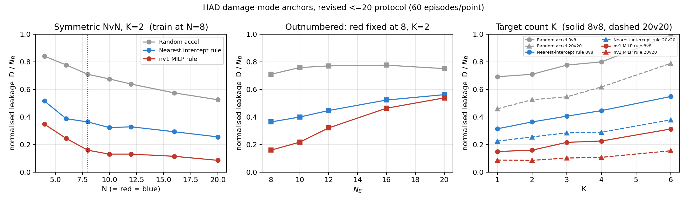

# 跨规模攻防泛化：多方法迁移复现实施方案（v2）

> 本轮六方法的最终执行决定、前馈/循环结构和迁移修正见 [差异清单](diff_log.md)，实际验证、短跑与图表见 [唯一实验报告](../../Open-SCORE/outputs/main_v2/实验报告.md)。后续用户确认优先于本文早期安排，正式基础训练预算仍待实测后确认。

版本 v2.3，2026-09-09。定位：**可据以直接进入编码与训练的实施方案**，取代同目录 `crossscale_report.md` / `crossscale_report.html`（下称 v1）。

本版已并入你对 §11.5 十个问题的答复，全部决定见 §11.5；相对上一稿的方案性改动见 §11.4；执行方式按你的要求改为"代码一次写完 → 统一验证 → 三个基础实验 → 交回规划"，见 §12。

v1 的文献选择与"先迁移复现、再谈改进"的总路线保留。本版做四件事：改正 v1 中与当前代码库不符的事实；把任务从 survival 改写为 **damage 反馈**并重建指标；用**实测数据**替换 v1 中靠推断给出的难度与算力假设；把执行路径细化到可以直接照做的粒度（§8、§12）。

标注"实测"的数字来自 2026-09-09 在本机（i7-14700KF / RTX 5070 Ti 16 GB / Python 3.10 + torch 2.13）对现有 `had-env` 的直接测量；其余为原论文结果或明确标注的估算。**本文尚未执行任何训练。**

> **关于本文中的数字。** 规模集合、种子数、评估局数、训练分布、基础实验内容已由 §11.5 与 §11.6 全部拍板，属于**执行依据，没有待确认项**。唯一未定的是训练预算的绝对步数，待 §12 阶段三吞吐实测后确定。其余未出现在这两节的数字（如 kNN 的 $k$、注意力维度）一律以各方法官方配置为准，偏离处记入差异清单。

---

## 摘要：v2 相对 v1 的关键修正

| # | v1 的表述 | 实际情况 | 影响 |
|---|---|---|---|
| 1 | 三维、每个红方 27 个离散加速度动作 | 2D（`spatial_dim=2`，工厂默认）只有 **9 个平面动作** | DCG 成对收益表从 27×27 降到 9×9，可直接用官方满秩默认；全文"27"需改写 |
| 2 | 任一目标被摧毁即失败，主指标为整局胜率 | `task_mode="damage"` 下目标**不掉血、不摧毁**，逐步反馈 $-\Delta D_t$，整局回报 $=-D$ | 胜率指标作废，须重建为伤害类指标（§1.5） |
| 3 | 20v20→50v50 为主实验，隐含"更难" | **实测：固定地图下放大规模使任务单调变易**。nv1 规则泄漏率 4v4=0.348 → 20v20=0.086 | 不能用测试规模的绝对表现说明泛化；必须用同规模锚点归一化（§1.5、§2.2） |
| 4 | 现有 REFIL 是可直接复用的复现资产 | MARL 源码已在 `9e09048` 从工作树删除，需从 `f8009fe` 恢复；且是**自研实现**而非官方移植 | 影响"复现"表述与工作量估计（§3.4） |
| 5 | 主要成本风险是 50v50 的决策延迟 | **实测：单步开销的大头是 HAD 的 `get_observation`（20v20 时占 47%），不是物理、也不是 GPU** | 实时性降为报告项；提速方案改为绕开原生观测（§2.4） |
| 6 | DCG 采用 rank-1 低秩收益 | 官方 `dcg.yaml` 的 `cg_payoff_rank` **默认为空即满秩** | 9 动作下满秩很便宜，直接用官方默认 |
| 7 | SPECTra 以 `SPECTra_SMACv2` 为迁移入口 | SPECTra 官方仓库是**两棵独立的 PyMARL 分支**：`SPECTra_GRF`（固定动作空间，含 `spectra_qmix_plus.yaml`）与 `SPECTra_SMACv2`（实体定向动作，SPECTra 实现命名为 `ss_*`，但**附带完整基线动物园**） | 迁移参照与主干选择都要改（§3.4、§4.1） |
| 8 | 四方法各自独立 vendored | 改为**单一 PyMARL 主干**，主干取 [ALMA](https://github.com/shariqiqbal2810/ALMA)——它是 REFIL 的衍生分支、**实体方案原生**（变长实体靠掩码），自带 REFIL、`qmix_atten`、ALMA 分配模块、COPA，以及**不依赖 SC2** 的 `ff` sanity 环境 | 只需写一个环境适配层；REFIL 与 B2 基线零成本；分层类替补白送（§3.4、§3.6） |

另有三条 v1 未提及、但对建模有决定性影响的环境事实：**同队碰撞同样致死**（20 m 内双方同归于尽，不分敌我）；**蓝方攻击机开火即自毁**（每架一生只投放一次伤害）；**红方不能悬停**（$v_{\min}=35$ m/s）。

---

## 一、问题建模

### 1.1 任务的真实反馈

红方控制全部防御单位，蓝方为规则策略。采用 `task_mode="damage"`：

- 目标点**持续存在**，血量每步重置回初始值，只累加受到的伤害，不设上限；
- 每个物理步红方团队奖励 $r_t=-\Delta D_t$，蓝方 $+\Delta D_t$；
- **终局不另加奖励**，整局未折扣回报恰为 $-D$，$D=\sum_t\Delta D_t$ 为累计伤害；
- 自然终止只有一个条件：**蓝方攻击机全灭**。红方全灭不终止；
- `max_steps` 是采样截断，`bootstrap_mask=1`；自然终止为 0。

已核对的接口语义（`core/env/world.py:90-134`，避免最容易搞错的一处）：

| 属性 | 含义 | 用途 |
|---|---|---|
| `step_target_damage` | 本步增量 $\Delta D_t$（`sum(target.step_damage)`） | **奖励取它的负值** |
| `target_damage` | 整局累计 $D$（`sum(target.cumulative_damage)`） | 主指标 |
| `target_damage_by_target` | 逐目标累计伤害字典 | 特征与诊断（§1.5、§8.3）|
| `episode_returns` | damage 模式下 `{'Red': -D, 'Blue': D}` | 与回报定义的一致性断言 |

这个设计有个很好的性质：**目标函数就是 return，不需要代理指标**；同时它逐步稠密（伤害事件散布全局），不是终局稀疏奖励。这直接影响"是否需要奖励塑形"的判断（§11.1）。

### 1.2 形式化

Dec-POMDP，红方受控，蓝方并入转移：

$$
\mathcal M(c)=\langle \mathcal S,\{\mathcal A_i\}_{i=1}^{N_R},P_{\pi_B},r,\{\Omega_i\},\gamma\rangle,\qquad \mathcal A_i=\{0,\dots,8\}.
$$

$c=(K,N_R,N_B)$ 为规模三元组。团队奖励对全体红方相同——**不能按队员求和**，环境返回的 `team_reward` 已是团队量。

**不存在开火动作**：红方对 200 m 内蓝方攻击机自动开火，蓝方对 200 m 内目标自动开火。策略学的纯粹是**机动**。

### 1.3 目标点怎么建模（回应意见 1）

目标点在 damage 模式下**永不消失、血量恒定**，因此"血量"与"存活"两个字段对目标点**恒为常数、零信息量**，放进特征只会浪费维度并诱导网络学到无用的类型相关偏置。本方案的处理：

- **不给目标点血量与存活字段**。它们在共享实体特征表里对应的槽位置 0，由类型 one-hot 区分（§8.3 的 schema）。
- 目标点真正有信息的量是**它已经被打成什么样**。用逐目标累计伤害份额 $d_i/N_B$ 填一个**目标点专属槽位**（红蓝该槽置 0）。这个量天然落在 $[0,1]$ 附近、**与规模无关**，而且直接告诉策略"蓝方正在集火哪个目标"——这是多目标防御里最关键的上下文，环境已有 `target_damage_by_target` 可直接取，零额外成本。
- 终止判定与目标点无关（只看蓝方攻击机是否全灭），所以不需要"目标存活"参与任何 mask 或 done 逻辑。

这样目标点在建模上就退化为**静止的、带一个受损标量的地标**，比"给它一点血量"更干净：不需要在 mask、终止、bootstrap 里为它开特例。

### 1.4 规模外推的定义

本研究的目标（按你的设定）：**在有限训练资源下训练，泛化到训练中未出现过的对抗规模**，规模同时包含红蓝人数与目标点数。

因此约束只有一条：

> **测试配置必须没有在训练中出现过。**

**训练用什么规模、是否多规模混训、是否用课程，都是可自由设计的变量。** 本方案定为在 $N\le10$ 的训练池上均匀采样（§2.5）。训练完成后冻结参数直接评估，不在测试配置上继续学习、不按测试结果选检查点。

网络还须满足两条工程性质，用断言检查而非实验验证：实体顺序不变性（打乱其他实体存储顺序，同一红方的 9 个动作值不变）与数量接口兼容（换规模不新增、不重训权重）。这两条通过**不等于**规模外推成功。

### 1.5 指标体系

**基础量**：整局累计伤害 $D(c)$，越小越好。

**一级归一化——泄漏率**。每架蓝方攻击机开火后自毁，单机伤害贡献有界（同时命中多个目标时可略超 1）：

$$
\rho(c)=\frac{\mathbb E[D(c)]}{N_B}.
$$

$\rho$ 近似为"平均每架来袭蓝机成功投放的伤害份额"，$1-\rho$ 近似拦截率。它消除了 $N_B$ 变化的平凡缩放。

**二级归一化——锚点相对得分**。$\rho$ 仍非尺度不变：实测显示任务难度本身随规模强烈变化（§2.2）。故对每个测试配置 $c$ 都测两条**同规模锚点**：$\rho_{\text{rand}}(c)$（随机加速度）与 $\rho_{\text{rule}}(c)$（nv1 整数规划规则）。定义

$$
\mathrm{NDS}(c)=\frac{\rho_{\text{rand}}(c)-\rho(c)}{\rho_{\text{rand}}(c)-\rho_{\text{rule}}(c)} .
$$

$0$ = 与随机同水平，$1$ = 追平 nv1 规则，$>1$ = 超过规则。**建议主表以 $\mathrm{NDS}$ 为准，同时给出 $D$、$\rho$ 与两条锚点原值**，让读者能自行还原。

**不建议**用"相对训练规模的保持率" $\rho(c)/\rho(c_0)$ 作主指标：当 $c$ 比 $c_0$ 容易时它会给出虚假的正向结论。

**辅助诊断量**：见 §10.4，那里给出**一次性冻结的完整日志 schema**（回应意见 11）。

---

## 二、环境与目标

### 2.1 环境事实基线（实测核对）

底层是独立仓库 `E:/Code/Open_Score_HAD_Workbench` 的 `had-env`；`Open-SCORE` 只做再导出与规则策略封装，没有第二份物理代码。

| 项目 | 事实 | 出处 |
|---|---|---|
| 空间 | 2D 为工厂默认；内部保留 3 个坐标槽，$z$ 固定 100 m，垂直分量恒为 0 | `factory.py` |
| 动作 | **9 个平面离散加速度**（零动作 + $\{-1,0,1\}^2\setminus\{0\}$ 归一化）；索引 0 为 no-op | `actions.py:25` |
| 动作合法性 | 存活时 9 个全合法；死亡时只有 0 合法且被强制置 0 | `environment.py:95` |
| 加速度缩放 | `Env.step` 内部统一乘 `aMax`，**Parallel API 与 `step_physics` 两条路径完全一致** | `core/env/env.py:202` |
| 观测（原生） | 实体行矩阵 $(N_R+N_B+K-1)\times 11$：相对位置 3 + 相对速度 3 + 血量 + 存活 + 红/蓝/目标标志；**不含自身行** | `config.py:132`、`env/env.py:397` |
| 掩码 | `entity_mask` / `agent_mask` / `action_mask` / `bootstrap_mask` 均在 `info` | `environment.py:215` |
| 地图 | $x,y\in[-2500,2500]$ m，**固定**，不随人数变化 | `config.py:103` |
| 时间 | 1 步 = 1 s；`max_steps` 默认 100；实测自然回合长度 35–61 步 | `config.py:127` |
| 速度 | $v\in[35,120]$ m/s，**有最小速度、不能悬停**；$a_{\max}=40$；蓝方系数当前为 1.0 | `config.py:54` |
| 开火 | 全自动，200 m 内触发，200–400 m 线性衰减 | `world.py:279`、`config.py:61` |
| 伤害 | 满伤 1.0/次；**攻击机开火后自毁** | `agents/attack.py:21` |
| 碰撞 | 扫掠最近距离 ≤ 20 m，**双方同时死亡，不分敌我** | `world.py:236` |
| 出生 | 目标在 $x\in[-2300,-1900]$、$y\in[-1200,1200]$ 随机；红方在随机选中目标周围 800–2200 m 环带；蓝方 $x\in[0,2500]$、$y$ 全场 | `env/env.py:321` |
| 蓝方 | 规则分层：上层 `reactive`/`concentrated`/`balanced`（每 5 步或伤亡时重分配），下层 `rush`/`split_rush` | `grouping/opponents.py` |

三条对建模影响最大的事实：

**同队碰撞致死。** `world.py` 的碰撞检测遍历所有存活配对，不检查阵营。红方越密集自相撞损失越大，"聚集防守"存在内生成本。

**蓝方一次性投放。** 每架蓝机最多贡献一次伤害，这给了 $\rho=D/N_B$ 明确物理含义，也解释了回合总在 35–61 步自然结束。

**不能悬停。** "守在目标点上方"不是可行策略，只能绕飞，这对策略形态有实质影响。

### 2.2 实测难度锚点

条件：`task_mode="damage"`、`spatial_dim=2`、`max_steps=100`、蓝方 `reactive + rush`、每点 60 局独立种子（seed 9000–9059）。



*图 1：三条参考策略在三条轴上的归一化泄漏率 $\rho=D/N_B$。左为对称放大（虚线为建议的训练规模上界），中为红方固定 8 时蓝方增援，右为目标数。原始数值见 `figures/scale_anchors_small.json`。*

对称 NvN，$K=2$：

| $N$ | 4 | 6 | 8 | 10 | 12 | 16 | 20 |
|---|---:|---:|---:|---:|---:|---:|---:|
| 随机加速度 | 0.840 | 0.777 | 0.709 | 0.676 | 0.639 | 0.574 | 0.525 |
| 最近威胁直追 | 0.516 | 0.388 | 0.364 | 0.323 | 0.329 | 0.293 | 0.256 |
| nv1 整数规划 | 0.348 | 0.245 | 0.160 | 0.131 | 0.131 | 0.115 | **0.086** |

红方固定 8、蓝方增援，$K=2$：

| $N_B$ | 8 | 10 | 12 | 16 | 20 |
|---|---:|---:|---:|---:|---:|
| 随机加速度 | 0.709 | 0.758 | 0.770 | 0.776 | 0.750 |
| 最近威胁直追 | 0.364 | 0.400 | 0.447 | 0.523 | 0.562 |
| nv1 整数规划 | 0.160 | 0.218 | 0.321 | 0.463 | **0.538** |

目标数 $K$：

| $K$ | 1 | 2 | 3 | 4 | 6 |
|---|---:|---:|---:|---:|---:|
| nv1 @ 8v8 | 0.150 | 0.160 | 0.216 | 0.226 | **0.313** |
| nv1 @ 20v20 | 0.087 | 0.086 | 0.103 | 0.108 | **0.155** |
| 随机 @ 8v8 | 0.692 | 0.709 | 0.776 | 0.799 | 0.990 |

三条结论：

**一、固定地图下同比放大规模使任务单调变易。** 三条策略全部单调下降；nv1 规则 4v4=0.348 → 20v20=0.086。地图面积固定、蓝方在整个 $y$ 范围出生，$N_R$ 增大直接提高对固定区域的覆盖密度，而单机拦截半径不变。（更大范围的趋势见 `figures/scale_anchors.png`，50v50 时 nv1 降到 0.025。）

这**不是**说"训小测大"没有意义——那正是实际需求的方向。它的含义是：**在放大方向上，测试配置的绝对表现好不能作为泛化成功的证据**，必须与同规模锚点比较。这就是 §1.5 引入 $\mathrm{NDS}$ 的原因。反过来它也提供了一个很强的证伪工具：既然任务已知变易，若某方法在放大方向上 $\mathrm{NDS}$ 反而下降，那就是表示/接口失效的无歧义证据。

**二、兵力劣势会变难，但不是本任务的主外推轴。** nv1 在 8v20 的泄漏率 0.538 是 8v8 的 3.4 倍，且红方全部阵亡（`red_left`→0.0）。双方都以自爆完成拦截，红少蓝多测的是换命配额而不是可变人数表示。v3 起外推改为更大的 1:1 编队。

**三、目标数是一条稳定有效的独立轴。** $K$ 从 1 到 6，nv1 在 8v8 上从 0.150 升到 0.313、在 20v20 上从 0.087 升到 0.155，两个规模下都约 1.8–2.1 倍。它与人数轴解耦，且是你明确要求纳入的维度。

### 2.3 规模协议（训练 ≤10，测试槽位上界 40）

| 集合 | 配置 | 说明 |
|---|---|---|
| **训练池** $\mathcal C_{\text{train}}$ | $N\in\{4,6,8,10\}$（对称），$K\in\{1,2,3\}$ | **每个 episode 在池上独立均匀采样**（$N$、$K$ 各自均匀、相互独立），见 §2.5 |
| **测试 · 等规模 1:1** | $N\in\{10,15,20,25,30,40\}$，对称 $K=2$ | 稀疏人数梯；10v10 K2 在训练池人数内但 $K$ 与验证的 10v10 K3 不同 |
| **测试 · 1:2 配比** | $2\text{v}4$、$4\text{v}8$、$8\text{v}16$、$15\text{v}30$、$20\text{v}40$，均 $K=2$ | 红:蓝 $=1:2$ |
| **测试 · 目标外推** | $K\in\{2,4,6\}$，在 $10/15/20/30\text{v}$ 同数各取 | 目标图按规模着色、按方法分线型；K=2 与等规模线共用数据 |
| **训练内参照** | 训练池中的 4 个验证配置 | 判断"是否训得动"，不计入外推结论 |

训练池保持对称（$N_R=N_B$）。等规模线只放大对称编队。1:2 线单独作图，不与 1:1 混在同一横轴。

**槽位上界提到 40。** PyMARL 的 episode buffer 是**定形张量**，实体数只能按全局上界分配（§3.3）。上界取 40 红 + 40 蓝 + 6 目标 = 86 实体时：实体特征 $5000\times100\times86\times11\times4\,\text{B}\approx1.9$ GB，可见性掩码 $5000\times100\times86^2\times1\,\text{B}\approx3.7$ GB，合计约 5.6 GB。50v50（106 实体）的掩码一项仍更高，故不上 50。

**关于等密度协议。** 更干净的做法是让地图面积随 $N$ 缩放以保持密度恒定，把"规模"与"难度"彻底解耦。但 `AeroPoint` 是 `config.py` 的模块级全局量，被观测归一化（`world_diagonal()`）、出生采样、边界裁剪等十余处直接引用，改成按实例配置需要在外部仓库做贯穿式重构——与"不改 HAD"的约定（§8.2）冲突。建议本轮不做，用锚点归一化达到同等解释力。

### 2.4 吞吐实测与提速方案（回应意见 3）

**先定位瓶颈，再谈优化。** cProfile 结果（20v20 K2，1000 步）：

| 函数 | 自身耗时 | 占比 |
|---|---:|---:|
| `core/env/env.py:397 get_observation` | 3.042 s | **47%** |
| `np.linalg.norm`（589,437 次调用） | 0.720 s | 11% |
| `numpy.asarray`（3,044,322 次调用） | 0.679 s | 11% |
| `core/env/world.py:232 step`（物理本体） | 0.514 s | 8% |
| 其余（`ndarray.tolist` 1.9 M 次、`_info`、`update_velocity` 等） | — | 23% |

**结论与 v1 的假设正好相反：单步开销的大头是原生观测构造（逐智能体 Python 循环 + 每对实体一次 `np.linalg.norm` + 大量 `tolist()`），物理本体只占 8%。** 而我们本来就要按自己的 schema 重建实体特征（§8.3），**根本不需要调用 `get_observation`**。这意味着最大的一块开销可以在**纯 wrapper 层**去掉，不动 HAD 一行代码——正好同时满足意见 3 和意见 6。

三条驱动环境的路径实测对比（单进程，随机动作，`max_steps=100`，每格取 3 次中位数）：

| 规模 | A. Parallel API（含原生观测） | B. `step_physics` + `get_global_state` | C. `step_physics` + 向量化自建特征 | C/A |
|---|---:|---:|---:|---:|
| 5v5 K2 | 1014 | 1723 | **1750** | 1.7× |
| 8v8 K2 | 571 | 1096 | **1099** | 1.9× |
| 10v10 K3 | 410 | 859 | **864** | 2.1× |
| 20v20 K4 | 153 | 282 | **265** | 1.7× |
| 50v50 K6 | 37.7 | 141 | **139** | 3.7× |

单位：环境步/秒。C 是本方案 wrapper 要走的路径。

**采纳的提速措施（按收益排序，全部不改 HAD）：**

1. **绕开 `get_observation` 与 `adapter.global_state()`。** wrapper 直接从 `env.red_agents / blue_agents / targets` 读属性，用一次向量化 numpy 运算构造整张实体表。**已实测 1.7–2.1×（训练规模），50v50 上 3.7×。**
2. **用官方 `parallel_runner`，`batch_size_run=8`。** 这是 REFIL / DCG / SPECTra 三个官方配置的默认值，本机 20 物理核，8–12 个 worker 很宽裕。*估算*（未实测）：8v8 环境侧可到 $\sim1100\times8\approx8000$ 步/秒，届时瓶颈转到 learner，符合预期。
3. **训练时关闭事件记录与快照。** `record_events` 默认 False，不要在训练循环里调 `snapshot()` / `global_state()` / `task_info()` 之外的重型接口；`task_info()` 本身是幂等轻量的（其 docstring 明确说明重复读取不会累加奖励），可以放心每步调。
4. **预分配缓冲区复用。** 实体表、掩码按上界一次分配，每步原地写入，避免每步新建数组。
5. **保持实体上界紧凑。** 实体注意力是 $O(n_{\text{ent}}^2 d)$、buffer 掩码是 $O(n_{\text{ent}}^2)$，46 个实体很便宜，把 50v50 塞进上界会同时拖慢计算和吃掉内存（§2.3）。
6. **learner 侧沿用 PyMARL 的批量 MAC。** 一次前向处理所有智能体与所有时间步，不要逐智能体调用——这正是历史管线慢的原因（下段）。避免训练循环里出现 `.item()` / `.cpu()` 造成的同步点。

**不做的事：** 不改 HAD 里 $O(N^2)$ 的碰撞检测循环。训练池全在 $N\le10$，路径 C 已有 860–1750 步/秒，物理不是瓶颈；且按 §8.2 的解耦约定，外部仓库不动。若将来确有必要，记入"HAD 变更请求清单"（§8.2）由你决定，不擅自修改。

**一个值得知道的历史参照。** S1 的 REFIL 在 **4v3** 跑 1,000,123 步用了 **15.06 小时**，即有效 **18.4 步/秒**；而同规模物理吞吐超过 1000 步/秒。历史管线只跑到物理上限的约 2%，瓶颈在单环境串行推进、逐智能体前向调用和小批量更新，**不在 GPU 算力**。含义很直接：如果照搬历史管线的写法，训练会慢两个数量级；措施 1+2+6 是把这两个数量级拿回来的地方。

**建议做的事只有一件：第一个方法跑通后，先测一次端到端步/秒再决定训练预算**，避免按错误的吞吐假设排后面所有实验。本文不设吞吐门槛。

### 2.5 训练分布：训练池上均匀采样（已定）

**采用你的方案：单一训练分布 = 在 $N\le10$ 的训练池上均匀采样。** 具体规定：

- 每个 episode **reset 时独立重采样**规模：$N\sim\mathrm{Uniform}\{4,6,8,10\}$、$K\sim\mathrm{Uniform}\{1,2,3\}$，两者独立，$N_R=N_B=N$；
- 采样用**与环境种子分离的独立 RNG**，这样"规模序列"在同一训练种子下可复现，且不受环境内部随机性影响；
- `parallel_runner` 的 8 个 worker **各自独立采样**，所以同一个 batch 里通常并存多种规模。这是合法的：buffer 张量按上界（66 实体 / 30 智能体）分配，实际人数靠 `entity_mask` / `agent_mask` 表达（§3.3、§8.3）。**这条要在实现时专门验证**——同一 batch 内混合规模是最容易出掩码 bug 的地方（§12 的验证项）。

**这样做放弃了什么，以及为什么可以接受。** v2.1 把"训练分布"设计成一个正式实验因子 F2（单一规模 vs 多规模混合 vs 课程），作为一个方法无关的贡献点。改成单一均匀采样后这个因子没了，主实验回到干净的"架构对比"一条线。取舍是合理的：F2 会把实验组数乘以 2–3 倍，而一个月的窗口里主表完整度优先。

**保留一个低成本的回补口子。** 若后期主表跑完还有机器时间，只需给**表现最好的一到两个方法**补一档"只在 8v8、$K=2$ 上训练"的对照，就能拿到"混合采样是否真的帮助外推"这个结论——两个 run 而不是全矩阵。这一档列在 §10.2 的 E4，标为可选。

---

## 三、总体方案讨论

### 3.1 复现对象与各自要检验的假设

| 对象 | 机制类别 | 在本任务中的假设 | 主要风险 |
|---|---|---|---|
| REFIL-QMIX | 随机实体分解 | 随机实体分解迫使网络在实体子集上也能预测价值，形成组合泛化 | 单调 mixer 表达限制；分组语义在密集场景下的有效性 |
| DCG | 结构化动作优化 | 成对协同项能表达"谁去拦谁"的分工 | 完整图边数 $O(N^2)$；成对分解无法表达三体以上收益；**官方图结构是静态的**（§7.4） |
| InforMARL / GNN-QMIX | 图观测聚合 | 局部关系算子比全场拼接更易迁移到不同人数 | 官方版是 on-policy，样本效率低、预算公平性难处理（§3.5 给出解法） |
| SPECTra-QMIX⁺ | 端到端集合策略 | SAQA + 集合超网络 mixer 在实体数变化时保持价值分解质量 | 原始优势部分来自 SMAC 的**实体定向攻击动作**，本任务动作固定 9 方向，这部分没有对应物 |

**对 SPECTra 的科学风险提示。** 它在 SMAC 上的增益之一来自对实体定向动作的置换等变输出头，本任务无对应物，只剩 SAQA 编码器与集合超网络 mixer。这不构成放弃的理由（这两部分本身值得检验），但论文中不能把它的 SMAC 增益当作本任务预期。

**对 DCG 的先验应当上调。** 2D 只有 9 个动作，成对收益表仅 9×9，可直接用官方满秩默认；同时任务高度依赖"分工不撞车"（同队碰撞致死），成对协同项的语义与任务结构非常契合。

### 3.2 共用协议

- 环境：`task_mode="damage"`、`spatial_dim=2`、`target_initialization="random"`、`max_steps=100`；
- 蓝方：训练与主测试用 `reactive + rush`；对手泛化单列（§10.2 的 E3）；
- 奖励：环境原生团队奖励 $-\Delta D_t$，建议不加塑形项（理由见 §11.1）；
- 训练预算：以**环境物理步数**为统一单位；具体数值等第一次吞吐实测后定；
- 种子：建议 3 个独立训练种子；
- 模型选择：在**训练池内**的验证配置上按平均 $D$ 选检查点，**测试配置结果不参与选型**；
- 评估：每个测试配置建议 ≥ 300 局，所有方法与锚点共用同一批开局种子（配对比较）。

### 3.3 PyMARL 是什么（回应意见 2）

**PyMARL** 是 QMIX 论文（Rashid et al., ICML 2018）随论文发布的参考实现，来自牛津 WhiRL 组（[oxwhirl/pymarl](https://github.com/oxwhirl/pymarl)）。它此后成了**合作式、价值分解类 MARL 的事实标准骨架**——本方案要复现的四个方法里有三个（REFIL、DCG、SPECTra）都是它的分支，代码骨架几乎逐文件对应。搞清它的结构，等于同时搞清了三个仓库。

**目录骨架与数据流：**

```
main.py                 # sacred 入口，合并三层 YAML 配置
└── run/run.py          # 按配置装配下面所有组件，跑训练主循环
    ├── runners/        # 与环境交互，产出整条 episode
    │   ├── episode_runner.py    # 单环境串行
    │   └── parallel_runner.py   # batch_size_run 个子进程环境并行  ← 提速关键
    ├── controllers/    # MAC（multi-agent controller）
    │   └── basic_controller.py  # 把所有智能体拼成一次批量前向
    ├── modules/
    │   ├── agents/     # 单体网络（参数在智能体间共享）
    │   └── mixers/     # QMIX / VDN，把个体 Q 合成 Q_tot
    ├── learners/       # TD 损失、目标网络、梯度裁剪
    ├── components/
    │   └── episode_buffer.py    # 以 episode 为单位的定形张量回放池
    └── envs/multiagentenv.py    # 环境基类，规定环境要实现的方法
```

**配置系统是三层 YAML 合并**：`config/default.yaml`（通用）+ `config/envs/<env>.yaml`（环境）+ `config/algs/<alg>.yaml`（算法），命令行用 sacred 语法 `with key=value` 覆盖。所以"迁移一个方法"在 PyMARL 世界里主要就是：写一个环境类 + 注册 + 加一个 env yaml。

**环境需要实现的接口**（`multiagentenv.py`）：`reset()`、`step(actions) -> (reward, terminated, info)`、`get_obs()`、`get_state()`、`get_avail_actions()`、`get_env_info()`。注意 `step` 返回的 **reward 是标量团队奖励**——与本任务的 damage 反馈天然吻合。

**四条对本方案有直接影响的性质：**

1. **buffer 是定形张量。** 张量形状在运行开始时就固定，**变长实体数只能靠"按上界分配 + 掩码"实现**，不能真的变形。这是 §2.3 上界讨论与 §9 掩码细节的根源。
2. **`t_env` 是环境步计数**，官方的训练预算、$\epsilon$ 退火、评估间隔都以它为单位。本方案的"训练预算以环境物理步数计"与之直接对齐。
3. **`batch_size_run` 是并行环境数**，`parallel_runner` 用子进程实现。三个官方配置默认都是 8。
4. **`episode_limit` 截断与真终止是两件事**，官方在 `episode_runner` 里靠 `env_info` 区分，接错就是 bootstrap 错（§9 第 2 条）。

### 3.4 复现策略：一个 PyMARL 主干 + 一个环境适配层（回应意见 7、8、9）

**现状。** MARL 源码已在 `9e09048` 从工作树删除，可从 `f8009fe` 恢复完整 S1 栈。历史 REFIL 实现是自研 PyTorch 版，其注释明确写明"inspired by REFIL / SPECTra, not a reproduction of either codebase"——不过对照官方 `refil.yaml` 可以确认它**忠实沿用了官方超参**（attn 128 / 4 头 / GRU 64 / mixing 32 / hypernet 128 / $\lambda$=0.5 / buffer 5000 / target 200）。可作交叉验证参考，但不作为主实现。

**主干选择：本版做了一次修正。** v2.1 稿建议以 `SPECTra_SMACv2` 为主干，理由是它自带一整个方法动物园（QMIX / VDN / QPLEX / DeepSet / GNN / HPN / UPDeT / ASN，还 vendored 了 REFIL 的 `flex_qmix.py`），基线与备选"换个 yaml 就有"。**逐个读实现之后这个理由不成立**——那棵树的 agent 全是 SMAC 形状的：

- `gnn_rnn_agent.py` 把邻接矩阵按固定 `n_nodes` 注册成 buffer（`register_buffer('adj', ones(n,n)-eye(n))`），聚合后除的也是固定 `n_nodes`；
- 输入契约是 `(own_feats, enemy_feats, ally_feats)` 三段切分，依赖 `args.n_allies` / `args.n_enemies`；
- 输出头普遍带"攻击第 $j$ 个敌人"的实体定向分支。

也就是说，**这些实现都假设实体数在整个运行里固定**，而变长实体数恰是本课题的核心需求。把它们改成变长要逐个动手术，"换一个 yaml"是错的。

**改为以 ALMA 仓库为主干。** [ALMA](https://github.com/shariqiqbal2810/ALMA)（Iqbal et al., NeurIPS 2022）是 **REFIL 的衍生分支**，同作者、同骨架，而且**实体方案原生**——变长实体数本来就靠掩码实现，正是我们要的契约。核对其完整文件树的结果：

| ALMA 主干自带 | 文件 |
|---|---|
| **REFIL** | `config/algs/refil.yaml`、`controllers/entity_controller.py`、`modules/mixers/flex_qmix.py`、`modules/layers/attention.py` |
| **QMIX-Atten**（= REFIL 去掉辅助损失，即 B2 基线） | `config/algs/qmix_atten.yaml` |
| **ALMA**（分层子任务分配） | `modules/agents/allocation_policies.py`、`allocation_critics.py`、`allocation_common.py`、`utils/allocation.py`、`modules/agents/heads.py` |
| **COPA**（动态队伍构成） | `modules/agents/copa.py` |
| **不依赖 SC2 的 sanity 环境** | `envs/firefighters/`（`firefighters.py` + `scenarios.py`），env 名 `ff` |

最后一条是个实际便利：E0 的原生 sanity check 可以直接用 `ff`，**不用装 StarCraft II**。

主干之外只补三处：

- **DCG**：从 [官方仓库](https://github.com/wendelinboehmer/dcg) 取 `controllers/dcg_controller.py`、`learners/dcg_learner.py`、`modules/agents/rnn_feature_agent.py`、`config/algs/dcg.yaml`；
- **SPECTra**：从 `SPECTra_GRF` 取 `spectra_rnn_agent.py`、`spectra_attention.py`、`spectra_mixer.py`、`spectra_controller.py` 与 `spectra_qmix_plus.yaml`（理由见 §4.1）；
- **图聚合编码器与两个基线编码器**：自己写在 `models/entity_encoder.py` 里（§3.5、§3.6）。主干与 SPECTra 树都没有变长版本，这部分是本方案唯一需要新写的网络代码，量不大（每个几十行）。

`SPECTra_SMACv2` 降为**参照与捐赠源**：读它的 `deepset_rnn_agent.py`、`gnn_rnn_agent.py` 了解结构，但在实体契约上重写变长版本，不直接搬。

**这条路线的收益（相对"四个仓库各自 vendored"）：**

- **只需要写一个环境适配文件**（§8.3 的 `entity_env.py`），一次接通就同时喂给 REFIL、QMIX-Atten、ALMA、COPA、DCG、SPECTra 与全部基线；
- REFIL 是我们的首要方法，在这个主干里是**一等公民**而不是移植进来的客人；
- 所有方法共享 `episode_buffer`、`parallel_runner`、`q_learner` 骨架、$\epsilon$ 调度与日志，**方法间差异被限制在"编码器 + mixer + controller"**，比较更干净；
- 分层方法（你在意见 10 里更想要的那一类）**已经在主干里**，见 §3.6；
- 对执行者友好：只需要理解一套仓库的构建方式。

**代价与必须写进论文的话：** 这些是**在官方实现基础上的场景迁移**，不是官方结果的原样复现。缓解措施：每个方法先在其原始基准的小任务上做原生 sanity check（§10.2 的 E0），再迁移；逐项记录与原实现的差异清单；超参以各自原配置为起点，**不互相拉平**（DCG 的 buffer 500 与 REFIL 的 5000 差一个量级，这是原作者的选择，保留）。**核对 ALMA 的 `refil.yaml` 与 REFIL 官方 `refil.yaml` 是否逐项一致**，不一致处记入差异清单。

**唯一保持独立的是官方 InforMARL**：它不是 PyMARL 分支（自有 on-policy 框架 + `graph_buffer`），见 §3.5。

**实体方案的硬约定**（读自 REFIL 官方 `src/envs/group_matching/group_matching.py` 与 `src/controllers/entity_controller.py`），适配层必须遵守：

- **受控智能体必须排在实体列表最前** $n_{\text{agents}}$ 位（`entity_controller` 用 `[:n_agents]` 切片写入 `actions_onehot`）；
- `obs_mask[i,j]=1` 表示 $i$ **看不到** $j$；`entity_mask[i]=1` 表示实体 $i$ **不存在**；
- `n_entities`、`n_agents` 是整个运行的**固定上界**，变长靠掩码实现；
- `step()` 返回**标量团队奖励**；
- 我们没有真值分组，故 `gt_mask_avail=False`，用官方 `refil` 而非 `refil_group_matching`。

### 3.5 InforMARL 一定要 on-policy 吗（回应意见 4）

**你的猜测是对的，而且比原计划更好。** 分三层回答。

**第一层：InforMARL 的贡献在哪。** InforMARL = **UniMP 图观测聚合** + RMAPPO。论文的新意在**图表示**（用局部邻域的关系算子替代全场拼接，使表示与人数解耦），RMAPPO 只是它选的现成 RL 算法，不是贡献点。所以"把图编码器接到 QMIX 上"在方法论上完全正当。

**第二层：为什么统一到 QMIX 对本课题更好。** 本课题要回答的是"**哪种表示更能外推到未见规模**"。若三个方法用 off-policy QMIX、一个用 on-policy RMAPPO，那么任何差异都被三重因素混淆：表示、算法类别、样本效率（进而是预算公平性）。原计划为此专门写了一节讨论怎么公平给预算（旧 §6.2）——那节的存在本身就说明这是个麻烦。**统一 learner 后，四个臂只差编码器与 mixer，差异可直接归因于表示**，实验的解释力明显更强，而且旧 §6.2 的预算公平性问题自动消失。

**第三层：两条路的实际成本（这里修正 v2.1 的一处过度乐观）。** v2.1 说"GNN-QMIX 已有实现、成本为零"，读代码后发现不成立（§3.4）：主干与 SPECTra 树里的 GNN agent 都是固定 `n_nodes` 的。所以两条路都要花工夫，但量级差很多：

| 路线 | 要做的事 | 量级 |
|---|---|---|
| **GNN-QMIX** | 在实体契约上写一个**带掩码的多层消息传递编码器**（邻接按距离或 kNN 现算、聚合分母排除 padding），接进已有 controller / mixer / learner | **一个模块，几十到一百行**；其余全部复用 |
| **官方 InforMARL** | vendored 第二套 on-policy 框架；写第二个环境适配文件 `graph_env.py`；处理 `graph_buffer` 的上界与 active mask；再单独解决 on-policy 与 off-policy 的预算公平性 | **一套框架 + 一个适配层 + 一个协议问题** |

**第四层：直接回答"哪个算法更好"。** 就本课题的前提（**有限训练资源**）而言，off-policy 的 QMIX 族样本效率明显高于 on-policy 的 RMAPPO——在相同环境步预算下 QMIX 族通常收敛更快、更稳，MAPPO 要靠更大的样本量才追上。所以 **GNN-QMIX 既是科学上更干净的对照，也是在固定预算下更可能训得动的那一个**。这两点同向，不存在取舍。

**因此本方案的安排：**

| 臂 | 定位 | 优先级 |
|---|---|---|
| **GNN-QMIX**（主干内，自写编码器） | 图聚合类别的**主对照臂**，与其他方法同 learner、同 buffer、同探索、同预算 | **主实验，必做** |
| 官方 InforMARL（RMAPPO，独立目录） | 忠实性参照 + 唯一的 on-policy 数据点 | 可选，时间紧时**第一顺位裁掉** |

**必须诚实写清的表述**：主表里那一行叫 **GNN-QMIX**，说明是"把 InforMARL 的图聚合思想移植到共享 QMIX 主干"，**不能写成"我们复现了 InforMARL"**。若官方臂也跑了，单列一张对照表，标明预算不等价。

**若你更看重"复现 InforMARL"这个卖点**，可以反过来：官方臂作主、GNN-QMIX 作对照。代价是多一套框架、多一个适配层，以及主表里多一处需要解释的预算不等价。本方案不推荐这个方向，但它是可逆的。

一个附带好处：InforMARL 原场景 `navigation_graph` 给每个 agent 预分配 goal，迁移时本来就必须删掉（否则等于偷偷给它"正确分工"的答案、对其他方法不公平，见 §6.1）。走 GNN-QMIX 路线时这个不公平隐患从根上不存在。

### 3.6 基线阶梯与备选方法（回应意见 7、8）

**基线阶梯（意见 7：要不要一个纯粹的 QMIX）。要，而且给三档。** 三档构成一条干净的递进，让"复杂机制到底买到了什么"有参照：

| 档 | 实现 | 规模处理方式 | 这一档回答的问题 | 成本 |
|---|---|---|---|---|
| **B0. 朴素 QMIX** | 自写：把实体表按上界零填充成扁平向量 + 掩码，**去掉智能体 ID one-hot** | 最朴素：填充 + 掩码 | 什么都不做能到什么水平？跨规模是否直接崩 | 一个 flatten 编码器，十几行 |
| **B1. DeepSet-QMIX** | 自写：逐实体 MLP + 掩码均值池化（参照 `SPECTra_SMACv2/modules/agents/deepset_rnn_agent.py` 的结构，但按实体契约重写变长版本） | 掩码均值池化 | 最简单的置换不变/规模不变编码器够不够 | 几十行 |
| **B2. QMIX-Atten** | **主干自带** `config/algs/qmix_atten.yaml`（= REFIL 去掉随机分组辅助损失） | 实体注意力 | 注意力本身的贡献 vs REFIL 辅助损失的额外贡献 | **零** |

B0 有一个必须注意的坑：PyMARL 的朴素 QMIX 默认 `obs_agent_id=True`，会把随人数变长的 one-hot 拼进观测，**跨规模直接报形状错**。必须设 `obs_agent_id=False`、`obs_last_action=False`（SPECTra 的官方配置正好也是这两个 False，可对照）。B0 的价值恰在于展示朴素做法的失效模式，不要为了让它好看而偷偷加机制。

**备选方法：按你的意见 10 换成分层/分配类。** 你的判断是对的——HPN、UPDeT 与 REFIL、SPECTra 同属"实体注意力/超网络编码器"这一族，作为替补**机制上太近**，多跑一个也回答不了新问题（QPLEX 是另一类，但它是 mixer 表达力问题，性质上更接近消融而不是替补，已挪到 §10.2 的 E5）。分层/分配类才是机制上真正不同的一族，而且**在本任务里动机更强**：红方要解决的核心就是"谁去拦谁、谁去守哪个目标"，而我们的 nv1 规则锚点本身就是一个整数规划分配器。

更巧的是，改用 ALMA 作主干后（§3.4），这一族**已经在主干里**：

| 备选 | 思想 | 论文 | 源码与成本 |
|---|---|---|---|
| **ALMA** | 分层：上层**分配策略**把智能体指派到若干子任务，下层为每个子任务学一个基于实体注意力的策略。子任务在本任务里天然就是 $K$ 个目标点，而 $K$ 本身是规模轴之一，所以分配层必须处理变长子任务集——这正是它该被检验的地方 | Iqbal et al., *ALMA: Hierarchical Learning for Composite Multi-Agent Tasks*, NeurIPS 2022 | **主干自带**：`allocation_policies.py`、`allocation_critics.py`、`allocation_common.py`、`utils/allocation.py`。只需在 `entity_env.py` 里额外暴露"子任务集合 = 当前 $K$ 个目标"，**不需要移植** |
| **COPA** | 教练-选手：一个全局"教练"周期性地把策略嵌入广播给各选手，选手据此调整行为；**原文明确以动态队伍构成（智能体数量与类型会变）为目标** | Liu et al., *Coach-Player Multi-Agent RL for Dynamic Team Composition*, ICML 2021 | **主干自带** `modules/agents/copa.py`；官方 [Cranial-XIX/marl-copa](https://github.com/Cranial-XIX/marl-copa) |

**关于公平性的一点说明。** ALMA 会额外拿到一个结构先验——"任务可分解为 $K$ 个子任务"。这不构成不公平：它拿到的是**子任务集合**（哪些目标存在），不是**分配答案**（谁去守哪个），分配是它要学的；而其他方法在实体表里同样看到全部目标点。这与 §6.2 里 InforMARL 原场景"预分配 goal"必须删掉是两件不同的事——那个给的是答案。这条区别要在论文里写明。

若还需要机制上更远的一档，**平均场类方法**（把多体交互近似为个体与邻域均值场的交互，对大 $N$ 有理论动机）作一句话备案，需要重写价值结构，不进本轮计划。

### 3.7 优先级与降级

建议优先级 **REFIL > DCG > GNN-QMIX > SPECTra > ALMA / COPA > 官方 InforMARL**：

- REFIL 在新主干里是一等公民、官方超参已核对，风险最低，作为必成基线；
- DCG 在本任务先验期望最高（§3.1），也是唯一需要真正改算法代码的一处（§7.4）；
- GNN-QMIX 代表图聚合类别，需自写一个带掩码的消息传递编码器（§3.5）；
- SPECTra 因动作空间不匹配，边际信息量最低，但迁移是纯文件搬运；
- ALMA / COPA 主干自带，只需在适配层暴露子任务集合，作分层类别的替补（§3.6）；
- 官方 InforMARL 是唯一需要第二套框架的臂，见 §3.5。

按新增代码量排序，工作量集中在三处：`entity_env.py` 适配层（一次性，全体共用）、`models/entity_encoder.py` 里的三个自写编码器（B0 flatten / B1 deepset / GNN 消息传递）、DCG 的动态建图。**其余都是文件搬运或换 yaml。**

若进度紧张，建议**砍方法而不是砍种子或砍评估**——三方法 × 3 种子的完整结果好于六方法 × 1 种子。

---

## 四、方法一迁移：SPECTra-QMIX⁺

**官方定位**：[SPECTra, 2025](https://arxiv.org/html/2503.11726v1)，[代码](https://github.com/funny-rl/SPECTra)。

### 4.1 迁移参照选 GRF 树，不是 SMACv2 树

仓库有两棵独立的 PyMARL 分支。核对完整文件清单后：

- `SPECTra_SMACv2/` 中 SPECTra 实现命名为 `ss_*`（`modules/agents/ss_rnn_agent.py`、`modules/layer/ss_attention.py`、`modules/mixers/ss_mixer.py`、`controllers/ss_controller.py`、`config/algs/ss_qmix.yaml`），**没有** `spectra_qmix_plus.yaml`；
- `SPECTra_GRF/` 才有 `modules/agents/spectra_rnn_agent.py`、`modules/layer/spectra_attention.py`、`modules/mixers/spectra_mixer.py`、`controllers/spectra_controller.py`、`config/algs/spectra_qmix_plus.yaml`。

**而且 GRF 是固定动作空间的环境**，与本任务的 9 个固定加速度方向结构相同；SMACv2 则带实体定向攻击动作。**因此 SPECTra 的迁移参照取 `SPECTra_GRF`**（v1 指向的 `SPECTra_SMACv2/scripts/.../spectra_qmix_plus.sh` 入口不存在，需更正）。

注意 GRF 树很小：只有 `spectra_*` 与 `hpn_*` 两组配置，且 `modules/agents/` 下只有 `spectra_rnn_agent.py`——它的 `hpn_qmix.yaml` 没有配套 agent 文件，不要指望能直接跑。**两棵树都不作主干**（主干取 ALMA，§3.4）；从 GRF 搬进来的就是 `spectra_rnn_agent.py`、`spectra_attention.py`、`spectra_mixer.py`、`spectra_controller.py` 四个文件加一个 yaml。搬运时要把 SPECTra 的 `nq_learner` 依赖对齐到主干的 `q_learner`，或一并把 `nq_learner.py` 带过来——**这是 SPECTra 迁移里唯一可能出意外的地方**，记进差异清单。

官方 `spectra_qmix_plus.yaml` 的关键项：`mac=spectra_mac`、`agent=spectra_rnn`、`mixer=spectra_mixer`、`learner=nq_learner`、`hidden_size=64`、`n_head=4`、`mixing_n_head=4`、`hypernet_embed=32`、`lr=0.001`、`td_lambda=0.6`、`optimizer=adam`、`use_SAQA=True`、`batch_size_run=8`、`buffer_size=5000`、`batch_size=32`、`epsilon_anneal_time=500000`。注意 **`obs_agent_id: False`、`obs_last_action: False`**——不含固定长度的智能体 ID，这对规模外推是有利的默认，也是 B0 朴素 QMIX 必须照做的一点（§3.6）。

### 4.2 场景差异与迁移动作

| 维度 | GRF 原场景 | HAD 本场景 | 迁移动作 |
|---|---|---|---|
| 实体类型 | 我方球员、对方球员、球 | 红方、蓝方、目标点 | 三类类型嵌入；**目标点必须独立成类**，不能并入敌方 |
| 动作 | 固定 19 类足球动作 | 固定 9 类加速度 | 换输出维度，结构不变 |
| 实体数 | 固定 | 跨 episode 变化 | 按上界分配 + `entity_mask` |
| 奖励 | 进球 + 塑形 | $-\Delta D_t$ 标量团队奖励 | 直接替换 |
| 回合 | 固定长度 | 蓝方全灭自然终止或截断 | 正确区分终止与截断 |
| 课程 | `SPECTra_SMACv2/run/curriculum.py` | 由我们的训练池定义 | 不用官方课程模块，用 §2.5 的均匀采样 |

保留：SAQA、循环记忆、ST-HyperNet 集合超网络 mixer、非负权重单调性。移除：无对应语义的实体定向动作分支。

### 4.3 迁移后的关键验证

1. **SAQA 置换不变性**：固定某红方，随机打乱其余实体行顺序（同时打乱掩码），其 9 个 Q 值应逐元素一致（容差 1e-5）。
2. **Mixer 顺序对齐**：构造两个红方个体 Q 明显不同的输入，交换它们在个体 Q 向量与超网络实体输入中的位置，$Q_{\text{tot}}$ 应不变；若只交换其一则应改变——这条能抓住"个体 Q 与超网络红方顺序错位"这个最容易犯的 bug。
3. **单调性**：对随机输入数值检查 $\partial Q_{\text{tot}}/\partial q_i\ge0$。
4. **变数量前向**：同一份权重在 $N=4$ 与 $N=20$、$K=1$ 与 $K=6$ 下都能前向且不新增参数。
5. **原生 sanity check**：在 GRF 的 `academy_3_vs_1_with_keeper` 上短跑（需装 `gfootball`；装不上则跳过，改用主干内 SMACv2 的 `ss_qmix` 短跑替代，并记入差异清单）。

---

## 五、方法二迁移：REFIL-QMIX

**官方定位**：[REFIL, ICML 2021](https://proceedings.mlr.press/v139/iqbal21a.html)，[代码](https://github.com/shariqiqbal2810/REFIL)。同时是**基线**与**已有资产的重新验证**。

### 5.1 官方配置（已核对 `src/config/algs/refil.yaml`）

`agent=imagine_entity_attend_rnn`、`mac=entity_mac`、`mixer=flex_qmix`、`learner=q_learner`、`runner=parallel`、`batch_size_run=8`、`training_iters=8`、`buffer_size=5000`、`target_update_interval=200`、`rnn_hidden_dim=64`、`attn_embed_dim=128`、`attn_n_heads=4`、`mixing_embed_dim=32`、`hypernet_embed=128`、`softmax_mixing_weights=True`、`double_q=True`、`lmbda=0.5`、`entity_last_action=True`、`epsilon_anneal_time=500000`。

历史 S1 的超参与此**逐项一致**，说明历史实现忠实沿用了官方配置，可作交叉验证的参考实现。

关键源文件：`src/modules/agents/entity_rnn_agent.py`、`src/modules/layers/attention.py`、`src/modules/mixers/flex_qmix.py`、`src/controllers/entity_controller.py`、`src/learners/q_learner.py`。其中 `flex_qmix.py` 在主干（`SPECTra_SMACv2/modules/mixers/`）里已有一份 vendored 拷贝，接入时**以 REFIL 官方版为准并核对两份是否一致**，不一致则记入差异清单。

### 5.2 训练目标

$$
Q_{\mathrm{tot}}=f_{\mathrm{mix}}(q_1,\dots,q_{N_R};s),\quad \frac{\partial Q_{\mathrm{tot}}}{\partial q_i}\ge 0;
\qquad
\mathcal L=(1-\lambda)\mathcal L_{\mathrm{TD}}+\lambda\mathcal L_{\mathrm{aux}},\ \lambda=0.5 .
$$

辅助分支按随机实体分组构造 imagined value，拟合**同一个真实 TD 目标**。分组在 episode 内保持一致，各分支独立维护循环历史，共享网络参数。部署只用完整观测分支。不能把辅助分支改成自行设计的局部奖励。

### 5.3 场景差异与迁移动作

| 维度 | SMAC / group_matching | HAD | 迁移动作 |
|---|---|---|---|
| 实体特征 | 单位类型、血量、护盾、相对位置 | §8.3 的 schema | 在 `features.py` 定义，全主干共用 |
| 动作 | 移动 + 攻击第 $j$ 个敌人 | 固定 9 类 | 输出维度 9；无实体定向分支 |
| `gt_mask` | group_matching 有真值分组 | 无 | `gt_mask_avail=False`，用 `refil` 不用 `refil_group_matching` |
| 观测范围 | 视野受限 | 全场可观测 | `obs_mask` 对存在实体全 0 |
| 奖励 | SMAC 密集塑形 | $-\Delta D_t$ | 直接替换 |

### 5.4 迁移步骤与验证

1. 写 `HADEntityEnv` 实现 §3.4 的实体契约，注册进主干的 `envs/__init__.py`；
2. 用官方 `group_matching` 环境短跑，确认恢复/vendored 的 REFIL 链路可用（**这一步不需要 SC2**）；
3. **验证 A**：随机分组的形状与时序一致性——同一 episode 内 `group_a` 不变；within/interaction 两条可见性掩码互补且都不含已死实体；
4. **验证 B**：置换不变性与 mixer 顺序对齐（同 §4.3 的 1、2）；
5. **验证 C**：`entity_last_action=True` 时，非智能体实体的动作 one-hot 恒为 0；智能体的是**上一步**动作而非当前步（官方 `entity_controller._build_inputs` 的切片语义，易错）；
6. 按共用协议在训练池上训练，冻结后评估。

**旧小规模 checkpoint 不得热启动并入主结果**；若要测试，作为独立对照单列。

---

## 六、方法三迁移：图聚合（GNN-QMIX 主臂 / 官方 InforMARL 可选臂）

**官方定位**：[InforMARL, ICML 2023](https://proceedings.mlr.press/v202/nayak23a.html)，[代码](https://github.com/nsidn98/InforMARL)。UniMP 图聚合 + RMAPPO；图用于**观测表示**，动作由 actor 直接输出，不接 mixer。

按 §3.5 的决定，本方法分两个臂。

### 6.1 主臂：GNN-QMIX（主干内，必做）

实现取主干的 `config/algs/gnn_qmix.yaml` + `modules/agents/gnn_rnn_agent.py`，环境走**同一个** `HADEntityEnv`，与 REFIL / DCG / SPECTra 共享 learner、buffer、runner、$\epsilon$ 调度与预算。迁移动作只有两条：

- 输出维度改 9；
- 建边规则按下表配置（实体表已含全部信息，建边在编码器内部按距离算，不需要环境额外提供邻接矩阵）。

**建边策略跑两个配置：**

| 配置 | 规则 | 用途 |
|---|---|---|
| FullObs（主对照） | 全部存在实体两两可见 | 信息条件与其他方法一致，可公平比较 |
| kNN-$k$（第二配置，建议 $k=10$） | 每节点连最近 $k$ 个实体 | 度数固定 ⇒ 表示与计算量对规模天然不变 |

这个对照几乎不增加成本，却是本方法在本课题下最有价值的信息，而且直接连着 §11.2 的改进方向。**不能用 kNN 的速度优势去和别人的全观测结果比性能。**

### 6.2 可选臂：官方 InforMARL（RMAPPO，独立目录）

只在主线跑完、时间有余时做。关键源文件：`onpolicy/algorithms/graph_actor_critic.py`、`onpolicy/algorithms/utils/gnn.py`、`onpolicy/algorithms/graph_mappo.py`、`onpolicy/runner/shared/graph_mpe_runner.py`、`onpolicy/utils/graph_buffer.py`、场景模板 `multiagent/custom_scenarios/navigation_graph.py`、入口 `onpolicy/scripts/train_mpe.py`。

| 维度 | navigation_graph | HAD | 迁移动作 |
|---|---|---|---|
| 任务 | 每个 agent 有**指定 goal**，导航避碰 | 集体防御多个共享目标 | **删除预分配 goal 条件**，所有目标进入实体图。不能给它额外提供"正确分配"答案，否则对其他方法不公平 |
| 动作 | 二维离散/连续加速度 | 9 类平面加速度 | 换输出头 |
| 节点类型 | agent / landmark / obstacle | 红方 / 蓝方 / 目标点 | 三类 `entity_type` |
| agent 数 | 固定 | 跨 episode 变化 | `graph_buffer` 按上界分配 + active mask |
| 奖励 | 每 agent 个体奖励 | 标量团队奖励 | 全体共享同一团队奖励；critic 用团队价值 |

需要第二个环境适配文件 `graph_env.py`（§8.3）。**预算不等价问题**：on-policy 样本效率显著低于 off-policy，主表不并入；单列一张对照表并标注预算，或按相同墙钟时间比较。

### 6.3 关键验证

1. **图批处理正确性**（官方臂）：官方自带 `onpolicy/algorithms/utils/test_gnn_batching.py`，先用它确认 vendored 代码没被改坏。
2. **置换不变性**（两臂）：打乱节点顺序（同步打乱邻接关系），同一 agent 的输出不变。
3. **死亡处理**：死亡单位不进入损失；图池化分母不含 padding；全亡时终止边界正确。
4. **kNN 退化情形**：存在实体数少于 $k$ 时，邻居集合按实际数量截断，池化分母随之改变，不能除以固定 $k$。
5. **变数量**：同一权重在 $N=4$ 与 $N=20$ 下都能前向。

---

## 七、方法四迁移：DCG

**官方定位**：[DCG, ICML 2020](https://proceedings.mlr.press/v119/boehmer20a.html)，[代码](https://github.com/wendelinboehmer/dcg)。**结构化价值模型 + 在线组合优化**，执行时不调用任何环境副本。

关键源文件：`src/controllers/dcg_controller.py`、`src/learners/dcg_learner.py`、`src/modules/agents/rnn_feature_agent.py`、`src/config/algs/dcg.yaml`；原生 sanity check 环境 `src/envs/stag_hunt.py` 配 `src/config/envs/rel_overgen.yaml`。

### 7.1 官方配置（已核对 `dcg.yaml`）

`cg_edges='full'`、`msg_iterations=8`、`msg_anytime=True`、`msg_normalized=True`、`cg_payoff_rank:` **空（满秩）**、`cg_utilities_hidden_dim:` 空、`cg_payoffs_hidden_dim:` 空、`duelling=False`、`mixer:` 空、`agent='rnn_feat'`、`mac='dcg_mac'`、`learner='dcg_learner'`、`buffer_size=500`、`target_update_interval=200`、`epsilon_anneal_time=50000`。

注意 buffer 与 $\epsilon$ 退火与 REFIL 差一个量级，**各方法保留各自官方配置，不要互相拉平**。

### 7.2 价值分解

图节点是红方**动作变量**；蓝方与目标点只进观测，不作为求解节点。

$$
u_i(a_i)=f^V_\theta(a_i\mid h_{i,t}),\qquad
p_{ij}(a_i,a_j)=\tfrac12\bigl[f^E_\phi(a_i,a_j\mid h_i,h_j)+f^E_\phi(a_j,a_i\mid h_j,h_i)\bigr],
$$
$$
Q_\Theta(\tau_t,\mathbf a)=\frac1n\sum_{i\in V}u_i(a_i)+\frac1{|E|}\sum_{\{i,j\}\in E}p_{ij}(a_i,a_j).
$$

端点交换时动作维度同时交换，实现上第二张表需转置。

消息更新：

$$
m_{i\to j}(a_j)=\max_{a_i\in\mathcal A_i}\Bigl[\tfrac{u_i(a_i)}n+\tfrac{p_{ij}(a_i,a_j)}{|E|}+\!\!\sum_{k\in\mathcal N(i)\setminus j}\!\! m_{k\to i}(a_i)\Bigr].
$$

完整图有环，固定 8 轮**不提供全局最优保证**；沿用官方逐轮联合动作评价，返回已检查轮次中学习价值最高的动作（原附录 Algorithm 3）。

**成本（9 动作下）**：20 个红方 190 条边，每步表项运算量约 $2\times8\times190\times81\approx2.5\times10^5$；即使 50 个红方（1225 条边）也只有 $1.6\times10^6$。批量张量实现下 GPU 上可忽略，**DCG 的延迟风险在本任务中基本消失**。

### 7.3 场景差异与迁移动作

| 维度 | SMAC / stag_hunt | HAD | 迁移动作 |
|---|---|---|---|
| 观测输入 | 固定长度扁平向量 | 变长实体表 | 把 `rnn_feature_agent` 的输入层换成实体注意力编码器（记为 **DCG-Entity**），输出仍是隐状态；编码器直接复用主干里 REFIL 的 `attention.py`，不另写一份 |
| 智能体身份 | 随人数变化的 one-hot ID | 不能用 | 去掉 ID one-hot，保留固定维物理属性与存活标记 |
| 动作 | SMAC 动作集 | 9 类 | 换维度 |
| 奖励 | 团队奖励 | $-\Delta D_t$ | 直接替换 |

**不加 REFIL 的辅助分组损失，不保留 QMIX mixer，不学习新的构图器。** 实体注意力在这里只解决输入长度问题。

### 7.4 一个具体的迁移阻塞点：官方图结构是静态的

官方 `dcg_controller` 在 `__init__` 里按 `args.n_agents` **一次性构建边集**。我们的训练池跨 episode 变化人数，因此必须改成**按上界建图 + 节点/边 padding mask**（推荐，与 PyMARL 定形 buffer 一致），或按 episode 重建图索引。这是 DCG 迁移中最实质的一处改动，**是整个方案里唯一需要真正动算法代码的地方**，必须单列并预留时间。

配套约定：图在每局重置时按初始 $n$ 建立并**固定到底**；死亡节点保留、只有动作 0 合法，不因死亡重构图；归一化分母保持初始 $n,|E|$，padding 不参与求和；消息归一化必须排除 $-\infty$ 位置与 padding，否则产生 NaN；每个存在节点至少保留一个合法动作。

### 7.5 STAR 对照

按本局初始红方索引固定根节点 $r$，$E=\{\{r,j\}:j\ne r\}$。树上 Max-Sum 的汇集与条件回溯给出对**当前学习价值模型**的精确最大化：

$$
M_j(a_r)=\max_{a_j\in\mathcal A_j}\Bigl[\tfrac{u_j(a_j)}n+\tfrac{p_{rj}(a_r,a_j)}{n-1}\Bigr],\quad
a_r^*=\arg\max_{a_r}\Bigl[\tfrac{u_r(a_r)}n+\sum_{j\ne r}M_j(a_r)\Bigr],\quad a_j^*=B_j(a_r^*).
$$

保证的对象是**学习到的价值**，不是真实任务的最优防御。平局时必须按已选根动作回溯叶动作，不能各节点独立打破平局。STAR 用于分离"求解成本"与"表示容量"，不作主配置。

### 7.6 迁移后的关键验证

1. **求解器正确性**：在很小的人工收益表（例如 3 个节点、3 个动作）上，用穷举核对 STAR 树解码是否给出真正的最大值；完整图则记录返回动作的学习价值与消息预算。这是纯数值检查，不需要环境。
2. **对称化正确性**：随机构造 $f^E_\phi$，检查 $p_{ij}(a,b)=p_{ji}(b,a)$。
3. **归一化不变性**：同一物理局面下，$n$ 与 $|E|$ 的归一化使 $Q_\Theta$ 的量纲不随人数线性放大——用两个不同 $n$ 的构造输入检查数量级。
4. **变数量建图**：连续跑 $N=4,6,8,10$ 的 episode，确认图索引每局正确重建、循环状态不串号、padding 边不进入求和。
5. **原生 sanity check**：官方 `rel_overgen` 小任务上短跑，确认完整图学习链路可用（不需要 SC2）。

---

## 八、整体代码架构安排

### 8.1 目录重排（回应意见 10）

**你的判断是对的，而且现在改几乎没有成本。** 核对结果：`Open-SCORE/` 目前只有 **1 个实质源文件**（`src/open_score/grouping/coverage_rule.py`，39 KB）加两个 `__init__.py`；全仓库只有 **3 处**引用 `open_score`（`viewer.py`、`README.md`、`grouping/__init__.py`）。也就是说 `src/open_score/grouping/` 这三层嵌套现在装着一个文件，而重排的改动面是"移动一个文件 + 改一行 import + 改 README"。

`src/` 布局的用处是防止"未安装就误 import 本地目录"，对发布到 PyPI 的库有意义；对单人研究仓库只是多两层路径。按你说的 RL 常见写法改成**扁平包 + 每个子包一个 `__init__.py` 作主接口**：

```
Open-SCORE/
├── open_score/                 # 扁平包；pip install -e . 后 import open_score
│   ├── __init__.py             # 只暴露版本与子包，不放逻辑
│   ├── envs/                   # ← 环境层
│   │   ├── __init__.py         # 主接口: make_entity_env / make_graph_env / SCALE_POOLS
│   │   ├── had_wrapper.py      # 唯一 import had_env 的文件（§8.2）
│   │   ├── features.py         # 实体 schema、9↔27 动作映射、掩码、归一化
│   │   ├── entity_env.py       # HADEntityEnv：PyMARL 实体契约（主干全体共用）
│   │   ├── graph_env.py        # HADGraphEnv：官方 InforMARL 契约（可选臂才需要）
│   │   └── scales.py           # 训练池与测试集的规模分布
│   ├── models/                 # ← 模型层
│   │   ├── __init__.py         # 主接口: build_encoder / build_mixer
│   │   ├── entity_encoder.py   # B0 flatten / B1 deepset / GNN 消息传递三个自写编码器
│   │   │                       #   + 再导出主干的 REFIL 注意力供 DCG-Entity 复用
│   │   └── mixers.py
│   ├── algos/                  # ← 算法层（你说的 "agent"）
│   │   ├── __init__.py         # 主接口: train(name, cfg) / load_policy(name, ckpt)
│   │   ├── pymarl/             # vendored ALMA 主干（§3.4）
│   │   │                       #   自带 REFIL / qmix_atten / ALMA / COPA / ff 环境
│   │   ├── dcg_patch/          # 从 DCG 官方仓库补入的文件 + 动态建图改动
│   │   ├── spectra_patch/      # 从 SPECTra_GRF 补入的 spectra_* 四文件（+ nq_learner）
│   │   └── informarl/          # 可选臂，独立框架（§6.2；不做就不建这个目录）
│   ├── rules/                  # ← 规则策略与锚点
│   │   ├── __init__.py         # 主接口: run_episode / STRATEGY_CATALOG
│   │   └── coverage_rule.py    # 从 grouping/ 平移进来，内容不改
│   ├── eval/                   # ← 评估协议
│   │   ├── __init__.py         # 主接口: evaluate / compute_nds / anchors
│   │   ├── anchors.py          # 规则锚点，复用 rules.run_episode
│   │   ├── protocol.py         # 冻结评估、四条测试轴、配对种子、逐局落盘
│   │   └── report.py           # 主表与图
│   └── utils/
│       ├── __init__.py
│       ├── logging.py          # §10.4 的日志 schema 落盘
│       └── seeding.py
├── configs/                    # 每方法一个 yaml，尽量贴近官方原值
├── scripts/                    # 命令行入口: train.py / eval.py / anchors.py / plot.py
├── assets/frozen/              # 不动
├── outputs/                    # 不动（s1_s2, v2..v7 历史数据）
├── viewer.py                   # 改一行 import
└── pyproject.toml              # packages.find: where=["."], include=["open_score*"]
```

**迁移动作清单（一次做完，之后不再动）：**

1. `git mv Open-SCORE/src/open_score/grouping/coverage_rule.py Open-SCORE/open_score/rules/coverage_rule.py`；
2. `rules/__init__.py` 照抄原 `grouping/__init__.py` 的再导出内容（`run_episode`、`STRATEGY_CATALOG` 等）；
3. `pyproject.toml` 把 `where = ["src"]` 改成 `where = ["."]` + `include = ["open_score*"]`；
4. `viewer.py` 与 `README.md` 里的 `open_score.grouping` 改为 `open_score.rules`；
5. 删空的 `src/`；`outputs/` 与 `assets/` **完全不动**。

**保留 `grouping` 这个名字的兼容层没有必要**（只有 3 处引用，一次改干净比长期留别名好）。

### 8.2 环境解耦约定（回应意见 6）

**硬约定，写进代码审查标准：**

> **一、`Open_Score_HAD_Workbench`（HAD 原始仓库）不做任何修改。**
> **二、`open_score/envs/had_wrapper.py` 是整个项目里唯一允许 `import had_env` 的文件。** 其他任何模块（算法、评估、脚本）都只能 import `open_score.envs`。

这样做的直接好处：HAD 升级时只有一个文件可能需要跟进；算法侧完全不知道 HAD 的存在；§2.4 的提速改动全部落在这个文件里，不污染别处。

`had_wrapper.py` 负责的全部事情：

| 职责 | 说明 |
|---|---|
| 构建与重置 | 按规模三元组 $(N_R,N_B,K)$ 造 env，统一 seeding |
| 驱动物理 | 走 §2.4 的路径 C：`step_physics` + 向量化特征，**不调用 `get_observation`** |
| 蓝方规则 | 调用适配器的 `commanded_rule_actions("Blue")`，红方动作由算法给 |
| 动作映射 | 训练侧 0–8 ↔ HAD 原生 27 编号，集中在此并加断言 |
| 特征构造 | 按 §8.3 schema 向量化生成实体表 |
| 掩码 | `entity_mask` / `obs_mask` / `avail_actions` |
| 奖励与终止 | $r_t=-\,$`step_target_damage`；区分自然终止与截断，产出 `bootstrap_mask` |
| 诊断量采集 | §10.4 的逐局记录，从 `task_info()` / `target_damage_by_target` 取 |

**"HAD 变更请求清单"。** 若确实遇到 wrapper 层无法解决的需求（例如等密度地图需要 `AeroPoint` 实例化，§2.3），**不要动 HAD**：在 `docs/方案_v2/had_change_requests.md` 里记一条（需求、为什么 wrapper 做不到、影响面），交由你决定。目前已知候选只有两条：地图尺寸实例化、$O(N^2)$ 碰撞检测向量化。两条本轮都不需要。

### 8.3 实体特征 schema（四方法共用，`features.py`）

**存储形态的关键决定。** REFIL 的实体契约是**一张全局实体表** `(n_entities, d)`，不是逐智能体的相对观测表。这不只是为了贴合官方：若改成逐智能体相对表 `(n_agents, n_entities, d)`，buffer 内存要乘 $n_{\text{agents}}$——按 §2.3 的上界估算会从 1.0 GB 涨到约 20 GB，不可行。

**但相对几何对本任务至关重要**（HAD 原生观测就是相对的）。解法：**表里存全局绝对量，让编码器在前向时做一次广播相减得到相对量。** 这在 GPU 上是一次 broadcast 减法，零内存代价，且四方法共用同一个编码器入口（`models/entity_encoder.py`）。这条要在实现说明里写清，否则很容易被做成逐智能体存表。

| 槽位 | 字段 | 红 | 蓝 | 目标 | 归一化 |
|---:|---|:-:|:-:|:-:|---|
| 0–1 | 绝对位置 $(x,y)$ | ✓ | ✓ | ✓ | $/2500$（地图半宽） |
| 2–3 | 绝对速度 $(v_x,v_y)$ | ✓ | ✓ | 0 | $/120$（$v_{\max}$） |
| 4 | 存活标记 | ✓ | ✓ | 0 | 目标不死，见 §1.3 |
| 5 | 归一化血量 | ✓ | ✓ | 0 | $/H_0$；目标恒定故置 0 |
| 6 | 已受伤害份额 | 0 | 0 | ✓ | $d_i/N_B$，见 §1.3 |
| 7–9 | 类型 one-hot（红/蓝/目标） | ✓ | ✓ | ✓ | — |
| 10 | 上一步动作 one-hot（9 维，仅前 $n_{\text{agents}}$ 位实体非零） | ✓ | 0 | 0 | REFIL `entity_last_action=True` 时启用 |

实体维度 $d=10+9=19$（启用 `entity_last_action`）或 $10$（不启用）。**实体顺序：红方在最前**（$n_{\text{agents}}$ 位），然后蓝方，然后目标点——这是 §3.4 的硬约定。

**规模相关量一律用比例，不用绝对计数。** 存活红方数、存活蓝方数进"全局状态"时用 $n_{\text{alive}}/n_{\text{init}}$；剩余时间用 $1-t/T$。**不要把 $N_R,N_B,K$ 的原始整数喂进网络**——那会让表示随规模平移，是跨规模失效的常见来源。是否需要显式的密度条件化留作 §11.2 的改进方向做消融。

### 8.4 统一接口只有两个

**训练侧**：`open_score.algos.train(name, cfg) -> checkpoint_path`。内部完全按各自官方框架运行（PyMARL 主干的 `main.py`/`run.py`，或 InforMARL 的 `train_mpe.py`），我们只包一层入口。

**评估侧**：`open_score.algos.load_policy(name, checkpoint) -> Policy`，`Policy` 提供 `reset()` 与 `act(state, side, action_ids)`，即现有 `register_end_to_end_policy` 的契约。注册后即可复用 `rules.run_episode` / `eval.evaluate` 与网页回放器，**与规则锚点走完全相同的评估路径**——这是保证锚点可比的关键，不要另写评估循环。注意该接口要求把模型的 0–8 动作索引通过 `action_ids` 映射到原生 27 编号。

### 8.5 与现有代码的衔接

- **环境入口**：用 `HADStage3Adapter` 取蓝方规则动作，但**不走它的 `step()`**（每步会构建整套嵌套字典，§2.4）；物理推进走 `env.step_physics`。
- **实体上界**：`n_entities` / `n_agents` 按训练池与测试集的并集取上界（20 红 + 20 蓝 + 6 目标 = 46 实体、20 智能体），buffer 按上界分配，变长靠掩码。
- **历史资产**：`outputs/` 下 `s1_s2`…`v7` 与 `assets/frozen/*.pt` 保持原样；新实验单独输出目录，按方法组织。

---

## 九、实现细节注意

按踩坑概率排序。前六条是历史项目已出现过或环境文档明确警告的。

1. **动作编号双轨制。** 分组适配器保留原生 27 编号，2D 只用其中 9 个平面方向；训练接口用 0–8。两套编号不能混用，在 `features.py` 集中映射并加断言。

2. **截断 vs 自然终止的 bootstrap。** damage 任务只有"蓝方攻击机全灭"是自然终止（`bootstrap_mask=0`）；`max_steps` 到时是截断（`bootstrap_mask=1`，**必须 bootstrap**）。实测自然回合 35–61 步，截断很少触发，但一旦触发就是长尾困难局面，恰恰不能算错。

3. **奖励取增量，不是累计。** 用 `step_target_damage`（本步 $\Delta D_t$）的负值，**不要用 `target_damage`**（整局累计 $D$）。两者名字很像、都在 `task_info()` 里，接错会让回报变成 $-\sum_t D_t$，量级和梯度全错。整局结束时断言 $\sum_t r_t = -\,$`target_damage`。

4. **团队奖励不可求和。** 环境返回的同队 `team_reward` 已是团队量。按队员相加会放大 $N_R$ 倍，且放大倍数随规模变化，直接污染跨规模比较。PyMARL 的标量团队奖励约定与此天然吻合。

5. **死亡单位保留槽位并仍接收团队奖励。** damage 任务下固定槽保留到整局结束，死亡槽零观测、强制动作 0。`agent_mask` 用于损失，`bootstrap_mask` 用于团队价值。**死亡当步的更新使用动作产生前的存活掩码。**

6. **循环状态必须跟随持久实体 ID。** 不能随数组下标路由，否则单位死亡后隐状态会串给其他单位。

7. **`entity_last_action` 的时序。** REFIL 的 `entity_controller._build_inputs` 写入的是**上一步**动作，且只写前 $n_{\text{agents}}$ 个实体；照搬时不要错位成当前步。

8. **朴素 QMIX 必须关掉 `obs_agent_id`。** PyMARL 默认把随人数变长的 one-hot 拼进观测，跨规模直接形状报错（§3.6）。

9. **同队碰撞是内生成本。** 20 m 内双方同归于尽且不分敌我。"全体扑向同一威胁"会自伤，训练早期可能出现红方大量自相撞。**这是任务的真实约束，不要当 bug 修掉**，但要在诊断里单独统计——它很可能是高密度下的主要失效模式。

10. **没有悬停。** $v_{\min}=35$ m/s，红方必须持续移动，只能绕飞。

11. **不要把规模的原始整数喂进网络。** 见 §8.3 末段。

12. **观测归一化统计要冻结。** 环境内建的位置/速度归一化与人数无关，这点很好。若在 `features.py` 里再加任何基于数据统计的归一化，**必须在训练结束时冻结并随 checkpoint 保存**，评估时不得重新估计。

13. **蓝方随机性是方差来源。** `reactive` 每 5 步或伤亡时重采样目标分配，`opponent_rng` 由 `seed ^ 0x375AC18F` 派生。评估时所有方法必须共用同一批开局种子做配对比较。

14. **DCG 的动态建图与 $-\infty$。** 见 §7.4。填充边不得进入求和；均值归一化必须排除 $-\infty$ 与 padding。

15. **重排与规模的运行时断言。** 写成可开关的检查而非独立测试项目：打乱实体顺序 Q 值不变；重排智能体索引输出按同一排列重排；同一 checkpoint 在训练池最小配置与测试集最大配置下都能跑完整局且不新增权重。

---

## 十、实验设计

### 10.1 实验设置

| 项 | 取值（已拍板，§11.5） |
|---|---|
| 环境 | `task_mode="damage"`、`spatial_dim=2`、`target_initialization="random"`、`max_steps=100` |
| 训练分布 | 训练池 $N\in\{4,6,8,10\}$ 对称、$K\in\{1,2,3\}$，**每 episode 独立均匀采样**（§2.5）；蓝方 `reactive + rush` |
| 测试集 | §2.3 的三条轴，全部未在训练中出现 |
| 训练预算 | 以环境物理步数计；具体值待第一次吞吐实测后定 |
| 种子 | 3 个独立训练种子 |
| 模型选择 | 训练池内验证配置按平均 $D$ 选优；测试结果不参与选型 |
| 训练期评估 | 每 2% 预算一次，**每次 100 局**（§10.3） |
| 最终评估 | 每配置 **300 局**，全方法共用同一批开局种子 |
| 主指标 | $\mathrm{NDS}(c)$，附 $D$、$\rho$ 及两条锚点 |
| 并行度 | **同时最多 4 个训练任务**，每任务 `batch_size_run` 见 §10.5 |

### 10.2 实验类型

**E0 — 原生 sanity check（每方法必做，不进主表）。** 在各自原始基准的最小任务上短跑，只判断实现链路对不对，**全部不需要 SC2**：

| 方法 | sanity 环境 |
|---|---|
| REFIL / QMIX-Atten / ALMA / COPA / B0 / B1 | 主干自带的 `ff`（firefighters），ALMA 论文自己的轻量复合任务环境 |
| DCG | 官方 `rel_overgen`（stag_hunt 的相对过泛化配置） |
| SPECTra | GRF `academy_3_vs_1_with_keeper`；装不上 `gfootball` 则跳过，改为在 `ff` 上跑并记入差异清单 |
| GNN-QMIX | 无原生基准（编码器是自写的），改为在 `ff` 上与 B1 DeepSet 对比，确认能学 |
| 官方 InforMARL（若做） | `navigation_graph` + 自带的 `test_gnn_batching.py` |

**E1 — 训练池内性能。** 学习曲线与最终 $D$。**这是后续结论的前提**：若某方法在训练池内就打不过同规模 nv1 规则，它在外推轴上的表现不能被解释为"规模泛化失败"。

**E2 — 三条外推线（主实验）。** 等规模 1:1（10/15/20/25/30/40v 同数 K2）、红蓝 1:2（2v4/4v8/8v16/15v30/20v40 K2）、以及 10/15/20/30v 同数上的目标数 $K\in\{2,4,6\}$；冻结参数直接评估。目标点图按规模着色、按方法分线型。等规模方向已知变易，故在该方向上 $\mathrm{NDS}$ 下降即为表示失效的无歧义证据。三张图分开放，不把 1:2 与 1:1 画在同一横轴。

**E3 — 对手泛化（低成本、高价值）。** 训练只用 `reactive + rush`，测试扩展到 `concentrated`、`balanced` 上层与 `split_rush` 下层的组合。**不需要任何新代码**（`run_episode` 已支持），却能显著增强完整性——规模泛化与对手泛化是审稿人会一起问的两个问题。

**E4 — 训练分布对照（可选，低成本回补）。** 主实验统一用训练池均匀采样（§2.5）。若主表跑完仍有机器时间，只给**表现最好的一到两个方法**补一档"只在 8v8、$K=2$ 上训练"，回答"混合采样是否真的帮助外推"。**两个 run，不是全矩阵。**

**E5 — 消融。** 只对表现最好的一到两个方法做：

- REFIL 去掉随机分组辅助损失 → 退化为 B2 `qmix_atten`，**已是基线，零额外成本**；
- DCG 完整图 vs STAR vs 无成对项；
- GNN-QMIX FullObs vs kNN-10（§6.1）；
- **QPLEX 替换单调 mixer**：B1/B2/REFIL/SPECTra 全都用单调 mixer，必须能排除"跨规模失效其实来自 mixer 表达力限制"这个替代解释。这是一条消融而不是一个替补方法（Wang et al., *QPLEX*, ICLR 2021，[代码](https://github.com/wjh720/QPLEX)；`SPECTra_SMACv2` 里有可参照的 `dmaq_general.py` + `dmaq_qatten_learner.py`）。

**E6 — 诊断。** §10.4 的记录量按测试配置分解。重点：同队碰撞是否随密度上升、是否存在长期遗漏的目标、动作分布是否退化。

**E7 — 分层类替补（机器时间允许才跑）。** ALMA / COPA，主干自带（§3.6），作为机制上真正不同的一族的数据点。ALMA 需要 `entity_env.py` 额外暴露"子任务集合 = 当前 $K$ 个目标"。

### 10.3 训练曲线的评估协议（回应意见 5）

**每训练总步数的 2% 跑一次评估，每次 100 局**，即整条曲线 50 个采样点、每点 100 局（已拍板）。

| 项 | 规定 |
|---|---|
| 触发 | `t_env` 每达到总预算的 2% 触发一次，共 50 次 |
| 局数 | 每次 **100 局** |
| 配置分配 | 100 局**只在训练池内的验证配置上**分配。验证配置固定为 $\{4\text{v}4\,K2,\;6\text{v}6\,K2,\;8\text{v}8\,K2,\;10\text{v}10\,K3\}$ 四个，**各 25 局** |
| 探索 | $\epsilon=0$ 贪心 |
| 种子 | **每次都用同一批固定种子**（9500–9599），使曲线是配对比较、方差小、可见真实趋势 |
| 执行 | 走 `parallel_runner` 的同一组 worker，不新建进程 |
| 记录 | $D$、$\rho$、回合长度、§10.4 的全部逐局字段 |

**成本核算**：实测自然回合长 35–61 步，取 50 步计，$50\times100\times50=2.5\times10^5$ 环境步。若训练预算为 $2\times10^6$ 步，评估开销约 **12%**。这个开销是有意花的——每点 100 局配上固定种子的配对比较，曲线足够平滑到能直接进论文，不需要事后补跑。

**若阶段三发现 12% 太贵**（例如端到端吞吐远低于预期），优先降的是采样点数而不是每点局数：改成每 4% 一个点（25 个点 × 100 局）比每 2% 一个点 × 50 局更好——后者曲线更抖，而我们要的是可读的趋势。

**注意验证配置与训练采样的关系。** 验证用的四个配置都在训练池内（这是有意的——选型不能看未见规模），但它们是**固定的四个点**，而训练是在池上均匀采样。所以验证曲线衡量的是"在训练分布内的典型配置上表现如何"，不是"在训练见过的那些具体局上表现如何"——评估种子与训练种子分离，验证局对训练是全新开局。

**测试配置不进这条曲线的选型路径。** 允许额外记录一条"外推监控曲线"（在 1–2 个外推配置上各跑少量局）用于论文插图与调试直觉，但**必须在代码里硬性禁止它参与 checkpoint 选择**，否则等于测试集泄漏。选型只看训练池内验证曲线。

### 10.4 一次性冻结的日志 schema（回应意见 11）

你的要求是：**诊断成本要低、实验前就把要收的数据定全、事后再分析改进方向**。做法是把日志分成两级，**低成本的那一级全程全开**，高成本的那一级只在少量抽样上开。schema 在第 1 周末冻结，之后不允许"为了补字段重跑实验"。

**一级：逐局标量记录（永远开启，成本可忽略）。** 每局一行，写 parquet/csv。字段：

| 组 | 字段 |
|---|---|
| 标识 | `method`、`train_dist`（默认 `mixed_le10`；E4 对照用 `single_8v8`）、`seed`、`t_env`、`eval_point`、`phase`（`train_eval` / `final_eval` / `anchor`）、`config`($N_R,N_B,K$)、`episode_seed`、`blue_upper`、`blue_lower` |
| 主结果 | `D`(=`target_damage`)、`rho`(=$D/N_B$)、`ep_len`、`terminated_naturally` |
| 逐目标 | `damage_by_target`（列表，来自 `target_damage_by_target`）、`first_damage_step_by_target` |
| 存活分解 | `red_left`、`blue_left`、`red_deaths_by_cause`（被击落 / 同队相撞 / 敌方相撞 / 边界）、`blue_deaths_by_cause`（被拦截 / 开火自毁 / 相撞） |
| 策略形态 | `action_hist`（9 维计数）、`action_entropy`、`noop_frac`、`mean_speed`、`mean_pairwise_dist`、`mean_dist_to_nearest_target` |
| 拥挤 | `friendly_collisions`、`min_pairwise_dist_p05` |

这一级的边际成本只是每局几十个标量的累加与一次写盘，**远低于环境步本身的开销**，所以可以对训练期评估、最终评估、锚点全部开启，不需要挑。

**二级：逐步轨迹（默认关闭，只在抽样上开）。** 每方法每种子在**最终评估**时抽 **20 局**存完整轨迹（位置、速度、动作、存活、逐步伤害）。20 局 × 50 步 × 46 实体 × 少量字段，量级在 MB，用于画轨迹图和做定性失效分析。训练期不开。

**为什么这样分级就够。** §11.2 的两个候选改进方向需要的诊断量分别是：邻域截断需要"每个红方周围的实体密度分布"与"注意力是否被远处实体稀释"——前者由 `mean_pairwise_dist`、`min_pairwise_dist_p05`、`mean_dist_to_nearest_target` 覆盖，后者由二级抽样轨迹足够支撑；规模感知归一化需要"$Q_{\text{tot}}$ 量级随 $N$ 的漂移"——这只需在评估时额外记 `q_tot_mean`、`q_tot_std`、`q_i_mean`，加进一级 schema 即可，成本仍可忽略。**所以在第 1 周把这三个 Q 值统计量一并写进 schema，就不必等改进方向完全定下来。**

### 10.5 预计时间

训练池全在 $N\le10$，路径 C 吞吐 860–1750 步/秒，**训练的环境侧成本很低**。评估在 $N\le20$，最慢的 20v20 约 265 步/秒（路径 C）。

不给具体小时数，因为它完全取决于管线实现质量（历史管线与物理上限差 50 倍）。给出的是**排序**：锚点与评估的成本是确定的（锚点已测大半，评估约 4 主臂 × 3 种子 × 约 11 个配置 × 300 局）；训练成本是不确定项，第一个方法跑通后测一次即可锁定后续排期。

**并行 4 个训练任务的资源分配（按你的要求）。** 本机 i7-14700KF：8 个 P 核 + 12 个 E 核 = 20 物理核 / 28 线程；RTX 5070 Ti 16 GB。

| 配置 | 进程数 | 说明 |
|---|---:|---|
| 4 任务 × `batch_size_run=8` | $4\times(8+1)=36$ | 超订 1.8×，env worker 之间抢核，单任务墙钟会明显变慢 |
| **4 任务 × `batch_size_run=4`（建议）** | $4\times(4+1)=20$ | 与物理核数持平，四个任务的墙钟接近独占时的表现 |

**建议 4 并发时把每任务的 `batch_size_run` 从官方默认 8 降到 4**，并在日志里记下这个偏离（属于差异清单的一项）。注意 `batch_size_run` 会影响 on-policy 程度与 $\epsilon$ 退火的实际样本分布，所以**同一批对比实验必须用同一个值**，不能有的任务 8 有的任务 4。

GPU 侧不是约束：四个模型都很小（注意力 $d=128$），显存合计 $<2$ GB，反而是把单任务用不满的 GPU 用起来。真正的争抢在 CPU 与 kernel launch，所以上面按核数配。

第一次跑之前**先用 4 个短任务实测一次并发下的单任务步/秒**，与独占时对比，确认降并行度的收益，再定正式配置。

### 10.6 主结果表模板

| 方法 | 训练分布 | 测试配置 | $D$ | $\rho$ | $\rho_{\text{rand}}$ | $\rho_{\text{rule}}$ | $\mathrm{NDS}$ | 种子间区间 |
|---|---|---|---|---|---|---|---|---|
| REFIL-QMIX | 混合 $N\le10$ | 12v12 K2 | 待测 | 待测 | 0.639 | 0.131 | 待测 | 待测 |
| REFIL-QMIX | 混合 $N\le10$ | 20v20 K2 | 待测 | 待测 | 0.525 | 0.086 | 待测 | 待测 |
| REFIL-QMIX | 混合 $N\le10$ | 8v20 K2 | 待测 | 待测 | 0.750 | 0.538 | 待测 | 待测 |
| REFIL-QMIX | 混合 $N\le10$ | 8v8 K6 | 待测 | 待测 | 0.990 | 0.313 | 待测 | 待测 |
| REFIL-QMIX | 混合 $N\le10$ | 20v20 K6 | 待测 | 待测 | 0.788 | 0.155 | 待测 | 待测 |
| …（DCG / GNN-QMIX / SPECTra / B0–B2 同结构） | | | | | | | | |

锚点列已实测填入（60 局），正式评估时补到 300 局并更新。

---

## 十一、其他讨论与总结

### 11.1 是否引入奖励塑形、课程学习、模仿学习

**奖励塑形：建议主协议不加。** 三条理由。第一，damage 奖励**本身逐步稠密**，伤害事件散布全局，不是"只有终局才有信号"的稀疏问题。第二，$-\Delta D_t$ **就是要优化的目标**，塑形会引入"优化的东西和评价的东西不一致"的解释负担；而跨规模比较对这种不一致特别敏感——塑形项的量纲通常随人数变化（如"到最近威胁的距离和"），会在不同规模上引入不同偏置。第三，塑形是审稿人质疑公平性的高频靶点。

若 E1 显示所有方法都远不及 nv1 规则，再考虑**势函数塑形**（$F=\gamma\Phi(s')-\Phi(s)$），它保证最优策略不变，是唯一理论上"免费"的形式；届时全方法统一启用并做消融。

**课程学习：本轮不用，但不是因为它不合理。** 训练分布已定为训练池上均匀采样（§2.5），课程是这条轴上的另一个档位，跑它就要多一整套 run。既然主实验的优先级是把架构对比做完整，课程与"单一规模"一起归到 E4 的可选回补里。需要守住的只有一条：**课程覆盖的规模都算训练过，测试集必须在课程之外**。这也解释了为什么 SPECTra 原文的课程结果不能直接搬用——它的课程包含了目标规模，而我们的测试规模不在训练分布里。

**模仿学习：可用，但要放对位置。** 环境里有现成的强专家：nv1 整数规划规则（8v8 泄漏率 0.160，20v20 为 0.086），可无限量低成本生成演示（实测约 0.28 s/局）。BC 预热能显著缩短从零学习的时间。

代价是：BC 会把所有方法拉到同一个规则策略的邻域，**可能系统性压缩方法之间的差异**，而方法差异正是要测量的东西；而且规则策略本身有自己的规模特性（放大时变好、劣势时变差），BC 会把这个特性传染给所有学习方法，让"架构的规模泛化能力"难以分离。

建议：**主协议不用 BC**；作为**预先声明的降级方案**——若中期发现多数方法在训练池内都打不过规则，则全方法**统一**启用相同的 BC 预热（同一演示集、同一预热步数），在论文中作为协议变更明确记录并附消融。绝不能只给某一个方法加。

**统一的写作原则：** 任何附加技巧，只要满足"全方法统一启用 + 预先声明 + 有消融"，就不会损伤论文；损伤论文的是只给自己的方法加、或事后为了救某个结果才加。本轮的对象都是他人的方法，我们没有要偏袒的对象，协议容易保持干净，应当利用这个优势。

### 11.2 这条路线能支撑一篇二区论文吗

**纯复现不够。** 已有方法在新环境上的迁移比较本质是实证研究，二区期刊接受高质量的基准与实证研究，但通常要求超出"跑了几个别人的算法"。

**已经具备、可以主张的贡献有三项：**

1. **问题与基准。** 带真实物理（连续动力学、自动开火、同队碰撞、不可悬停）的多目标攻防跨规模基准，配 damage 反馈、三条正交外推轴与**同规模难度锚点**。锚点这条有方法论价值：图 1 展示的"固定地图下放大规模反而变易"是一个**反直觉且可复现的观察**，说明此前文献中大量"训小测大"实验可能系统性高估了泛化能力。这本身值得单独立一节。
2. **系统性实证。** 多类机制（随机实体分解 / 结构化动作优化 / 图聚合 / 集合策略 / 分层分配）在**同一 learner、同一 buffer、同一探索、同一预算**下的公平比较，配一条 B0→B1→B2 的基线阶梯作参照。这种"控制到只剩表示差异"的比较正是 §3.4 单一主干 + §3.5 统一到 QMIX 换来的，在跨规模文献里并不常见——多数论文的对比里算法类别与表示是混在一起的。
3. **失效分析。** 即使结果是负面的，只要归因清楚、证据充分仍然成立；前提是排除"训练不足"这个平凡解释，这就是 E1 与基线阶梯 B0–B2 的作用。

**还缺一项方法层面的改进**，二区审稿人大概率会要。从上面的分析里已自然浮现两个低成本、强动机的候选：

- **固定邻域截断（top-$k$ 近邻实体）+ 密度条件化。** 让表示与计算量**同时**对规模不变，直接针对人数外推方向暴露的表示失效。GNN-QMIX 的 kNN 配置（§6.1）已是这个想法的特例，可自然推广到实体注意力与 DCG 的建图。§8.3 末段刻意把"规模绝对计数"排除在特征之外，密度条件化正是把它以尺度不变的形式加回来。
- **规模感知的价值归一化。** DCG 用 $1/n$、$1/|E|$ 归一化，REFIL 的 FlexMixer 不除以人数——不同方法对规模的归一化处理**互不一致且都缺乏依据**，这正是跨规模失效的一个可疑来源。统一且有依据的归一化方案是廉价且有说服力的贡献。§10.4 已把 `q_tot_mean/std`、`q_i_mean` 放进一级 schema，就是为了让这条有数据支撑。

两个方向需要的诊断量都已经在 §10.4 的一级 schema 里，**不需要为了它们额外重跑主实验**——这正是你在意见 11 里要的效果。

**建议定位：** 基准 + 系统实证 + 由实证直接导出的一个改进。不要定位成"提出一个新的通用 MARL 算法"。

### 11.3 一个月的进度安排

**按你指定的执行方式重排：代码一次写完 → 统一验证 → 三个基础实验 → 再规划。** 前三个阶段的详细内容见 §12。

| 阶段 | 时间 | 目标 | 产出 |
|---|---|---|---|
| **A. 一次性写完全部代码** | 第 1–5 天 | §12 阶段一：目录重排、`had_wrapper.py`、`features.py`、`entity_env.py`、三个自写编码器、主干 vendored、DCG 动态建图、SPECTra 搬运、日志与评估协议、全部 yaml | 所有方法都能启动训练，但**尚未验证正确性** |
| **B. 统一验证** | 第 6–8 天 | §12 阶段二：适配层正确性 → 各算法特征组件正确性 → E0 原生 sanity check | 一份验证结果清单，逐项通过/不通过 |
| **C. 三个基础实验** | 第 9–12 天 | §12 阶段三：4 并发，先测端到端吞吐并定预算，再跑三个基础实验 | 训练预算锁定；三条基础曲线；**据此重新规划后续** |
| **D. 主实验** | 第 13–19 天 | 全臂 × 3 种子；E2 外推轴 + E3 对手泛化；锚点补到 300 局 | **主表与主图完整** |
| **E. 分析与改进** | 第 20–25 天 | E5 消融、E6 诊断 → 定改进方向 → 最小版本验证；有余力跑 E4/E7 | 失效归因 + 改进对照结果 |
| **F. 成稿** | 第 26–30 天 | 出图、写作 | 论文初稿 |

阶段 C 结束时会有真实的吞吐与学习曲线，**阶段 D 之后的排期到那时才有意义**，所以 D/E/F 只是占位，等 C 的结果再定。

**判断：可行但没有余量。** 相比上一版，改用 ALMA 主干把 REFIL 与 B2 基线的接入成本降到近零，分层类替补也白送；新增代码集中在 `entity_env.py`、三个编码器和 DCG 动态建图（§3.7）。风险集中在三处：适配层的掩码正确性（混合规模同批最易错）；DCG 动态建图是唯一需要真正改算法的改动；四周内既完成全部实验又完成写作偏紧。

三条建议：一是阶段 C 结束设明确检查点，若基础实验都学不动就先查适配层而不是加机制；二是改进方向的**诊断量**在阶段 A 就随 schema 定下来（§10.4 已按此设计），方向本身等 E6 的数据说话，不必现在拍死；三是若目标是投稿而非只是跑完，把写作放到第 5–6 周更现实。

### 11.4 本版相对上一版的方案性改动小结

| 改动 | 原因 |
|---|---|
| 四方法各自 vendored → **单一 PyMARL 主干，主干取 ALMA** | 先发现 `SPECTra_SMACv2` 有基线动物园，再发现那些实现都假设实体数固定；ALMA 是 REFIL 衍生分支、实体方案原生（§3.4） |
| InforMARL 官方 on-policy 臂 → **GNN-QMIX 主臂 + 官方臂可选** | 统一 learner 后差异可归因于表示，且固定预算下 off-policy 更可能训得动（§3.5） |
| 无基线 → **B0/B1/B2 三档基线阶梯** | 排除"训练不足"平凡解释的必要条件；B2 主干自带（§3.6） |
| 备选取 HPN / UPDeT / QPLEX → **改为 ALMA / COPA 分层类** | 前三者与 REFIL/SPECTra 同属实体编码器族，机制太近；分层分配在本任务动机更强，且主干自带（§3.6） |
| QPLEX 作替补 → **降为 E5 消融项** | 它回答的是"瓶颈是否在单调 mixer"，性质是消融不是替补（§10.2） |
| 训练分布作正式因子 F2 → **单一分布：训练池均匀采样** | 主表完整度优先；单一规模对照降为 E4 可选回补（§2.5） |
| 目标点带血量与存活 → **目标点只留"已受伤害份额"** | 血量与存活在 damage 模式下零信息量（§1.3） |
| 提速靠"优化物理" → **绕开原生观测 + 并行 runner** | profile 显示瓶颈在 `get_observation`（47%）而非物理（8%）（§2.4） |
| `src/open_score/grouping/` → **扁平 `open_score/{envs,models,algos,rules,eval,utils}`** | 现仓库只有 1 个实质源文件、3 处引用，改动面极小（§8.1） |
| 逐智能体相对观测表 → **全局绝对表 + 编码器内做相对** | 逐智能体存表内存约 20 GB，不可行（§8.3） |
| 分阶段边写边验 → **代码一次写完 → 统一验证 → 三个基础实验 → 再规划** | 按你指定的执行方式（§11.3、§12） |

### 11.5 已拍板的决定

下表是你已确认的答复，作为执行依据。**编号沿用上一稿的 Q 编号以便对照。**

| # | 问题 | 决定 |
|---|---|---|
| Q1 | 是否采纳单一主干 | **采纳**。主干改取 ALMA（理由见 §3.4，与"采纳单一主干"不冲突） |
| Q2 | GNN-QMIX 主臂还是官方 InforMARL 主臂 | **GNN-QMIX 主臂**。你要求"哪个算法更好用哪个"——固定预算下 off-policy QMIX 族样本效率更高，且对照更干净（§3.5 第三、四层） |
| Q3 | 是否执行目录重排 | **执行**，阶段 A 第一件事；`outputs/` 与 `assets/` 不动（§8.1） |
| Q4 | 训练池是否对称 | **保持对称** $N_R=N_B$（§2.3） |
| Q5 | 训练分布 | **训练池上均匀采样**，$N\le10$；不作为实验因子（§2.5） |
| Q6 | 种子数 | **3 个**；训练预算等阶段 C 吞吐实测后定（§12 阶段三） |
| Q7 / Q8 | 评估局数 | **训练期每点 100 局，最终评估每配置 300 局**（§10.3）。约 12% 训练开销，换来可直接进论文的平滑曲线 |
| Q9 | 等密度协议 | **不做**，用锚点归一化替代（§2.3） |
| Q10 | 备选方法 | **换成 ALMA / COPA 分层类**，你的判断（HPN/UPDeT/QPLEX 机制太近）是对的；QPLEX 降为 E5 消融（§3.6） |

### 11.6 补充确认（已定）

| # | 问题 | 决定 |
|---|---|---|
| Q11 | "三个基础实验"具体指哪三个 | **B0 朴素 QMIX / B2 QMIX-Atten / REFIL**，各 1 种子、4 并发中占 3 槽（第 4 槽跑吞吐基准与锚点补测）。理由：构成"最朴素 → 加注意力 → 加辅助损失"的最小递进，一次能区分"适配层有问题"、"表示不够"、"机制有效"三种情况（§12 阶段三） |
| Q12 | 训练期评估每点局数 | **100 局**（§10.3） |

**至此 §11.5 与 §11.6 的全部问题已拍板，没有待确认项。** 阶段三结束后按 §12 阶段四交回，届时再据实测结果规划主实验。

---

## 附：证据与数据来源

- 难度锚点（本方案协议范围）：`figures/scale_anchors_small.json` / `.png`，60 局/点，seed 9000–9059，2026-09-09 实测。
- 难度锚点（更大范围趋势，含 30v30、50v50、20v50）：`figures/scale_anchors.json` / `.png`，24 局/点，seed 7000–7023。
- 单步开销 profile：cProfile，20v20 K2 / 8v8 K2，1000 步，2026-09-09 实测。
- 三条驱动路径吞吐对比：单进程，随机动作，`max_steps=100`，每格 3 次取中位数，2026-09-09 实测。
- 历史训练成本：S1 REFIL 1,000,123 步 / 15.06 小时，见 [S1/S2 报告](../../实验报告/实验报告_s1_s2.md)。
- 环境事实：`E:/Code/Open_Score_HAD_Workbench/had_env/`，协议 `had-workbench-2.1.0`；接口见 [README](../../README.md) 与 Workbench `docs/API.md`。
- 官方仓库核对（2026-09-09 取自各仓库默认分支）：REFIL `src/config/algs/refil.yaml`、实体契约 `src/envs/group_matching/group_matching.py` 与 `src/controllers/entity_controller.py`；DCG `src/config/algs/dcg.yaml`；SPECTra 完整文件清单（GitHub Trees API，确认两棵树的差异与 SMACv2 的基线动物园）。
- 历史 MARL 源码：Git `f8009fe`（完整 S1 栈）、`9e09048^`（v6）。
- v1 方案原文：同目录 `crossscale_report.md`。

---

## 十二、执行任务清单（给后续执行者）

本章按指定的执行方式组织：**阶段一把全部代码一次写完，阶段二统一验证正确性，阶段三跑三个基础实验（4 并发），然后交回重新规划。** 阶段一内部不设"跑通才能往下"的门禁，写完再统一验证。

**贯穿全程的四条硬规则：**

1. **不修改 `E:/Code/Open_Score_HAD_Workbench` 的任何文件。** 有需求写进 `docs/方案_v2/had_change_requests.md`（§8.2）。
2. **只有 `open_score/envs/had_wrapper.py` 可以 `import had_env`。**
3. **超参以各自官方配置为起点，不互相拉平**（§3.4）。任何偏离官方值的地方记进 `docs/方案_v2/diff_log.md` 差异清单。
4. **卡住超过半天就上报**，把现象、报错、已排除的可能写下来，不要绕过去。文末列了必须上报的情况。

### 阶段一 · 一次性写完全部代码

先做 §8.1 的目录重排（5 步迁移清单），再按下表逐个文件写。表里就是全部要写的东西，**没有列出的文件不要新建**。

| 文件 | 内容 | 规格出处 |
|---|---|---|
| `envs/had_wrapper.py` | 唯一接触 HAD 的文件。构建/重置、`step_physics` 驱动、蓝方规则动作、9↔27 动作映射、向量化特征、掩码、奖励与终止、诊断量采集 | §8.2 职责表、§2.4 路径 C |
| `envs/features.py` | 实体 schema（19 维或 10 维）、类型 one-hot、归一化常数、动作映射断言 | §8.3 |
| `envs/entity_env.py` | `HADEntityEnv`，实现 PyMARL 实体契约；**额外暴露"子任务集合 = 当前 $K$ 个目标"供 ALMA 用** | §3.4 硬约定、§3.6 |
| `envs/scales.py` | 训练池均匀采样器（独立 RNG）、测试集三条轴、验证配置四点 | §2.3、§2.5、§10.3 |
| `envs/__init__.py` | 主接口 `make_entity_env` / `SCALE_POOLS` | §8.1 |
| `models/entity_encoder.py` | **三个自写编码器**：B0 flatten（填充+掩码）、B1 masked-deepset、GNN 掩码消息传递（FullObs 与 kNN-$k$ 两种建边）。另导出 REFIL 注意力编码器供 DCG-Entity 复用 | §3.6、§6.1、§7.3 |
| `algos/pymarl/` | vendored ALMA 主干（含 REFIL、`qmix_atten`、ALMA 分配模块、COPA、`ff` 环境）；注册 `HADEntityEnv` | §3.4 |
| `algos/dcg_patch/` | DCG 官方四文件 + 输入层换实体编码器 + **按上界建图 + padding mask** | §7.3、§7.4 |
| `algos/spectra_patch/` | `SPECTra_GRF` 的四个 `spectra_*` 文件 + 输出维度改 9 | §4.1、§4.2 |
| `rules/coverage_rule.py` | 从 `grouping/` 平移，内容不改 | §8.1 |
| `utils/logging.py` | §10.4 一级 schema 全部字段落盘（含 `q_tot_mean/std`、`q_i_mean`）；二级轨迹抽样开关 | §10.4 |
| `utils/seeding.py` | 训练种子、环境种子、规模采样种子、评估种子**四者分离** | §2.5、§9 第 13 条 |
| `eval/protocol.py` | 每 2% 触发、**每点 100 局**、固定种子 9500–9599、贪心；**代码层面隔离"外推监控"与"选型用验证"两条数据源** | §10.3 |
| `eval/anchors.py` | 随机与 nv1 锚点，复用 `rules.run_episode` | §1.5 |
| `eval/report.py` | NDS 计算、主表、训练曲线图 | §1.5、§10.6 |
| `algos/__init__.py` | 主接口 `train(name, cfg)` / `load_policy(name, ckpt)` | §8.4 |
| `configs/*.yaml` | 每个臂一个：`b0_qmix` / `b1_deepset` / `b2_qmix_atten` / `refil` / `dcg` / `gnn_qmix` / `spectra` / `alma` / `copa` | §4.1、§5.1、§7.1 官方值 |
| `scripts/train.py` `eval.py` `anchors.py` `plot.py` | 命令行入口 | §8.1 |

**阶段一必须同时照做的实现要点**（写的时候就要对，不要留到验证阶段再改）：§9 全部 15 条；§8.3 的"全局绝对表 + 编码器内做相对"（**不要做成逐智能体存表**）；实体顺序红方在最前；实体上界 46 / 智能体上界 20。

### 阶段二 · 统一验证

分四级，从"环境对不对"到"算法特点组件对不对"。**每一项记一行结果（通过/不通过/不适用）汇总成一份清单**，不通过的先修再进阶段三。

**V1 — 适配层与环境语义**

1. **物理一致性**：同一组种子与动作序列，wrapper 与 `HADStage3Adapter.step` 的逐步伤害、存活、终止步完全一致（容差 1e-9）。这条保证绕开原生观测没有改变环境语义。
2. **奖励一致性**：整局 $\sum_t r_t=$ `task_info()['episode_returns']['Red']` $=-$`target_damage`（§9 第 3 条）。
3. **截断与终止**：构造一个打到 `max_steps` 的局，确认 `bootstrap_mask=1`；蓝方全灭的局确认为 0（§9 第 2 条）。
4. **掩码正确性（最易错，重点查）**：在 `parallel_runner` 里让 8 个 worker 采到不同规模，检查同一 batch 内每条 episode 的 `entity_mask` / `agent_mask` 与实际人数逐元素相符；padding 位的特征全 0（§2.5）。
5. **吞吐复现**：8v8 K2 单进程 ≥ 800 步/秒、20v20 K4 ≥ 200 步/秒（§2.4 实测 1099 / 265，留了余量）。达不到先 profile，不要带着慢管线进阶段三。
6. **日志完整性**：短训练产出的 parquet 含 §10.4 每个字段且无空列。

**V2 — 通用网络性质（所有臂都要过）**

7. **置换不变**：打乱非自身实体顺序（同步打乱掩码），同一红方的 9 个 Q 值逐元素不变（容差 1e-5）。
8. **置换等变**：重排智能体索引，输出按同一排列重排。
9. **变数量**：同一份权重在 4v4 K1 与 20v20 K6 两端都能前向，**参数量相同**。
10. **Mixer 顺序对齐**：交换两个红方在个体 Q 向量与超网络实体输入中的位置，$Q_{\text{tot}}$ 不变；只交换其一则应改变（§4.3 第 2 条，抓最常见的错位 bug）。
11. **单调性**：单调 mixer 的臂检查 $\partial Q_{\text{tot}}/\partial q_i\ge0$。

**V3 — 各算法的特点组件（这一级是"各算法特色对不对"的核心）**

| 臂 | 要验证的特点组件 | 检查方法 | 出处 |
|---|---|---|---|
| B0 朴素 QMIX | `obs_agent_id=False`、`obs_last_action=False` 已设 | 读生效配置；换规模不报形状错 | §9 第 8 条 |
| B1 DeepSet | 池化分母排除 padding | 给同一局面补若干 padding 实体，输出不变 | §3.6 |
| B2 QMIX-Atten | 注意力掩码生效 | 屏蔽某实体后其对输出无影响 | §3.6 |
| REFIL | 随机分组的形状与时序 | 同一 episode 内 `group_a` 不变；within/interaction 两条可见性掩码互补且都不含已死实体 | §5.4 验证 A |
| REFIL | `entity_last_action` 时序 | 非智能体实体动作 one-hot 恒 0；智能体写的是**上一步**动作 | §5.4 验证 C、§9 第 7 条 |
| REFIL | 辅助损失权重 | $\lambda=0.5$，辅助分支拟合的是**同一个真实 TD 目标** | §5.2 |
| DCG | Max-Sum 求解器正确性 | 3 节点 × 3 动作的人工收益表上穷举核对 STAR 树解码给出真正最大值 | §7.6 第 1 条 |
| DCG | 成对项对称化 | 随机 $f^E_\phi$ 下 $p_{ij}(a,b)=p_{ji}(b,a)$ | §7.6 第 2 条 |
| DCG | 归一化不变性 | 两个不同 $n$ 的构造输入下 $Q_\Theta$ 量纲不随人数线性放大 | §7.6 第 3 条 |
| DCG | 动态建图 | 连跑 $N=4,6,8,10$：图索引每局正确重建、循环状态不串号、**padding 边不进求和、消息归一化排除 $-\infty$** | §7.4、§7.6 第 4 条 |
| SPECTra | SAQA 置换不变 | 同 V2 第 7 条，但要单独对 SAQA 模块做 | §4.3 第 1 条 |
| SPECTra | 集合超网络 mixer | 同 V2 第 10 条 | §4.3 第 2 条 |
| GNN-QMIX | 掩码聚合 | 聚合分母排除 padding；**kNN 在存在实体少于 $k$ 时按实际数量截断、分母随之变**（不能除固定 $k$） | §6.3 第 4 条 |
| ALMA（若做） | 分配层处理变长子任务 | $K=1,2,3$ 下分配头输出维度随 $K$ 变化且不新增参数 | §3.6 |
| 全体 | 死亡单位处理 | 死亡槽零观测、强制动作 0；循环状态跟持久 ID 而非数组下标；死亡当步用动作产生前的存活掩码 | §9 第 5、6 条 |

**V4 — E0 原生 sanity check**

按 §10.2 的 E0 表，在各自原始基准的最小任务上短跑，确认迁移前的实现链路本身可用。**全部不需要 SC2**，主干自带的 `ff` 覆盖大多数臂。

### 阶段三 · 三个基础实验（4 并发）

**先测吞吐、定预算，再跑实验。**

1. **端到端吞吐实测**：用 REFIL 配置在训练池上跑 2 万步，分别测 `batch_size_run=4` 与 `=8` 在**单任务独占**与**4 任务并发**下的步/秒（§10.5 的表）。据此确定：正式用哪个 `batch_size_run`，以及训练预算的绝对步数。**这一步的结果要写进记录**——后面所有排期都依赖它。
2. **三个基础实验**（各 1 个种子，同一预算，4 并发中占 3 个槽）：

| 槽 | 内容 | 这一槽回答的问题 |
|---|---|---|
| 1 | **B0 朴素 QMIX** | 适配层通了之后，最朴素的做法能学到什么程度？若连它都完全不学习，问题在适配层或奖励，不在表示 |
| 2 | **B2 QMIX-Atten** | 加上实体注意力有多少提升？这是"表示是否有用"的第一个信号 |
| 3 | **REFIL** | 再加随机分组辅助损失有多少提升？这是"机制是否有用"的第一个信号 |
| 4 | 吞吐基准 + 锚点从 60 局补到 300 局 | 不占 GPU，填满并发槽 |

三个臂构成"最朴素 → 加注意力 → 加辅助损失"的最小递进，一次就能区分"适配层有问题"、"表示不够"、"机制有效"三种情况。**这三个已拍板**（§11.6 的 Q11），不要换。

三者共用同一训练预算、同一训练种子、同一 `batch_size_run`（由第 1 步实测选定）。**注意 REFIL 与另两个的官方 buffer 大小相同（5000），这一组不存在超参不可比的问题**；后面加入 DCG 时才要注意它的官方 buffer 是 500（§7.1），那是原作者的选择，保留不动。

3. **产出**：三条训练曲线（§10.3 协议）、训练池内最终 $D$ 与同规模 nv1 / 随机锚点的对比、一份吞吐记录。

### 阶段四 · 交回重新规划

阶段三结束后**停下来**，把下面这些交出来，由我据此规划主实验排期与是否调整方案：

- 阶段二的验证清单（逐项通过/不通过）；
- 吞吐实测数字与选定的 `batch_size_run`、训练预算；
- 三条训练曲线与训练池内 $D$ / $\rho$ / NDS；
- 差异清单 `diff_log.md`；
- 遇到的问题与当前未解决项。

**不要在这一步之前提前跑主实验或提前实现 §11.2 的改进方案**——改进方向要由诊断数据决定（意见 11 的要求）。

### 需要立即上报、不要自行决定的情况

- V1 第 1 条物理一致性对不上（说明对环境语义的理解有误，后面全部结论都会错）；
- 任何地方需要修改 HAD 才能继续；
- 实测端到端吞吐比 §2.4 的环境侧数字低一个数量级（说明管线有结构性问题，参考历史管线只到物理上限 2% 的教训）；
- 三个基础实验都打不过随机锚点（涉及 §11.1 的 BC 降级方案，需统一决定，不能只给某一个臂加）；
- 需要改动 §10.4 已冻结的 schema；
- 官方配置里的某个超参在本场景下明显不可用（记差异清单并上报，不要自行调）。
