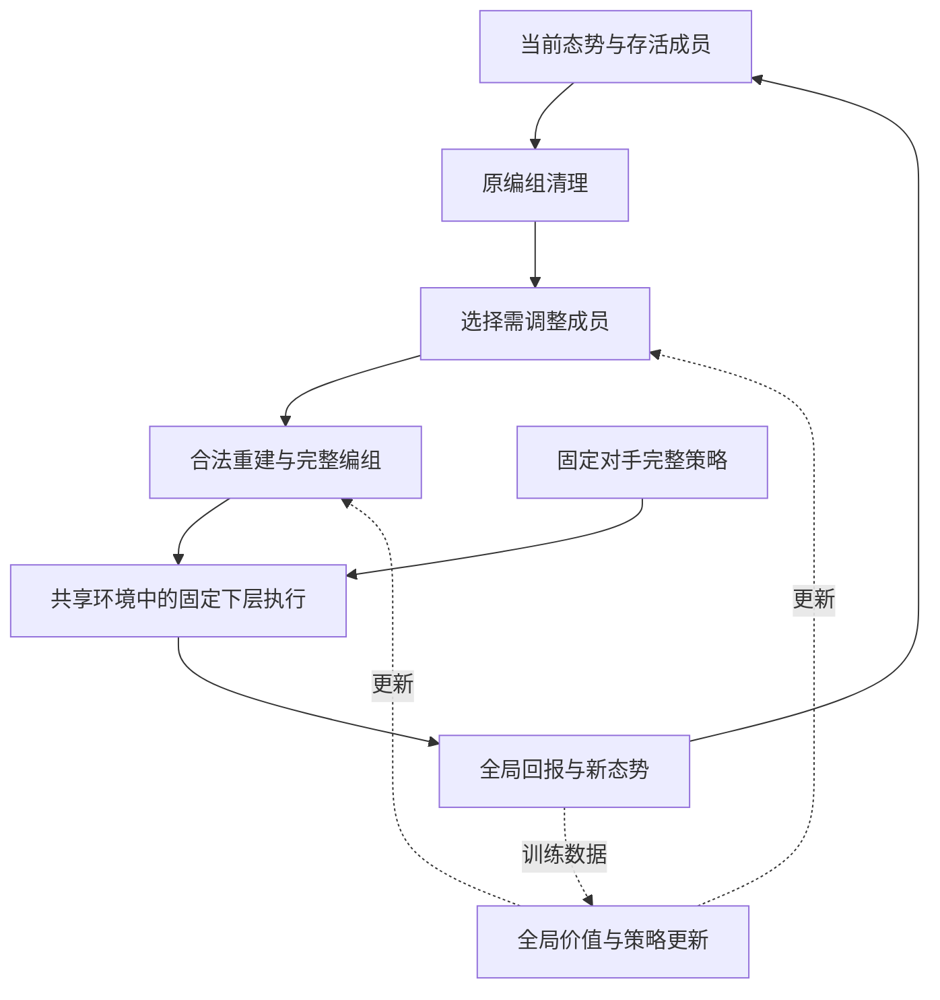

# 固定对手下动态规模多智能体系统的长期分组与重组研究方案

版本：研究设计稿 v1.0  
文献检索日期：2026 年 9 月 5 日  
建议论文题目：面向动态规模对抗任务的长期协同分组与选择性重构  
英文工作题目：Long-Horizon Coalition Reconfiguration in Dynamic-Size Adversarial Tasks

> 本文是一份用于研究讨论和算法实现的方案。相关研究来自所列原始论文、作者公开材料及正式论文页面；“我们的贡献”均为拟议贡献，“预期结果”均为待检验假设，目前没有本项目的新实验结果，也不宣称所提方法已优于基线。检索属于围绕近邻工作的定向调研，不是穷尽性系统综述。

## 1. 研究背景

### 1.1 研究对象与问题来源

考虑由红方、蓝方和多个固定任务点构成的仿真对抗任务。红方需要组织成员执行防守或其他指定协同任务，蓝方按照预先确定的策略与红方交互。任务过程中会出现成员失效或阵亡，导致双方可用成员集合变化。上层决策决定本方成员如何组成小组、各组关联哪个任务点以及哪些成员保留为后备队，下层执行器完成具体运动和局部协同行为。

本研究延续已有 LCL、DLOM 和身份级分组方案的接口思想，但收缩研究范围：固定红方下层执行器，固定蓝方完整策略，主要学习红方上层的长期分组与重组。根据已提供的 ID-CS-BBG-v5 片段，第一版保持局内任务点集合固定，以成员阵亡作为局内规模变化来源，每个活跃局部组最多四人，红方允许后备队。同一任务点可以关联多个小组。增援、任务点动态出现与消失、下层控制创新和未知对手识别均不作为第一篇的必要内容。

这里的固定对手是指蓝方上层分组规则与下层执行策略都固定，而不是只固定其底层动作规则。固定策略仍可根据态势改变行动，因而环境仍具有对抗性。红方改变编组，会改变后续态势，并通过蓝方固定的反馈规则改变蓝方未来行为。

### 1.2 为什么固定对手后仍然值得研究

困难主要来自三个相互联系的方面。

第一，可用成员变化使合法分组空间持续改变。阵亡不仅减少人数，也会改变原有组的能力、位置分布和协作关系。能够接收变长输入，只解决了网络输入形式；真正的决策问题是如何在任务进行中处理这些变化。

第二，分组有跨阶段后果。一次分组会影响成员抵达任务点的时间、后续存活状态、后备力量和下一次重组的选择空间。仅优化当前局部结局，可能损害最终全局结果。

第三，分组之间存在资源和任务耦合。一个组的价值依赖其他组占用了哪些成员、是否能够支援，以及全局终止条件。与此同时，实时决策又不能无限枚举所有合法分组。

因此，本研究聚焦的问题是：

> 在对手完整策略和本方下层执行能力固定的条件下，如何根据局内成员变化，保留仍有价值的原编组、调整必要成员，并在有限计算预算内优化连续多阶段任务的全局结果？

上下层结构在这里是一种有用的结构假设，并非大规模决策的数学必要条件。它适合“编组持续多个底层控制步、局部执行能力能够复用”的任务。是否有收益应通过统一执行器下的实验验证。

### 1.3 现有显式方案的作用与局限

现有显式方案可以继续提供可行性约束、小规模参考解、训练初始化和基线。需要区分两个问题：求解器是否把代理目标优化好，以及代理目标是否正确表达真实任务。

例如，假设红方只有两个任务点，并且必须同时守住两个点才算胜利。仅为说明聚合风险，假定两个事件独立：

| 方案 | 任务点一成功率 | 任务点二成功率 | 局部成功率之和 | 两点同时成功率 |
| --- | ---: | ---: | ---: | ---: |
| A | 0.95 | 0.60 | 1.55 | 0.5700 |
| B | 0.77 | 0.77 | 1.54 | 0.5929 |

求和选择 A，全局成功概率却是 B 更高。这是本文自行构造的说明性反例，不是实验结果。真实任务存在交互和多次重组，不能简单把求和替换成乘积就认为完成建模。

DLOM 预测局部结局的准确性，不能直接证明它适合指导长期分组。本研究保留 DLOM 的参考价值，同时将主要训练信号交给实际环境中的全局回报。当前提供的 v5 文本未包含完整求解器实现，因此本文不预设其重规划间隔、公开通道配对和惩罚项已经如何实现。

## 2. 相关研究与研究空间

### 2.1 最接近的研究方向

| 方向与代表文献 | 已有工作提供的基础 | 与本研究的关系及边界 |
| --- | --- | --- |
| 多机器人任务分配，[Gerkey 与 Matarić，2004](https://journals.sagepub.com/doi/10.1177/0278364904045564) | 区分任务需求、成员能力与分配的时间属性 | 本研究属于单成员同时执行单任务、任务允许多成员协同、需要跨时间调整的分配问题 |
| 层级任务分配，[ALMA，2022](https://proceedings.neurips.cc/paper_files/paper/2022/file/2f27964513a28d034530bfdd117ea31d-Paper-Conference.pdf) | 学习上层分配与下层执行，采用自回归候选生成和价值选择 | 已覆盖长期上层学习和候选排序。本文必须比较原编组连续性带来的增量，不能仅以层级结构作为创新 |
| 联盟结构学习，[BRIDGE，2026](https://proceedings.iclr.cc/paper_files/paper/2026/file/6960aa296f19962a8efcb21445acdee3-Paper-Conference.pdf) | 从单体联盟出发逐步合并，并研究联盟与下层策略的双层关系 | 其联盟搜索过程与本文真实任务中的成员减员、原编组保留不同；“RL 生成可变组数”本身已有近邻 |
| 动态任务与联盟修订，[Bezerra 等，2025 版](https://arxiv.org/html/2412.20397v3) | 学习联盟形成和任务选择修订，处理任务持续产生与完成 | 支持动态重分配的可行性；其主要动态来源和协作任务设定不同于本文的固定任务点与对抗减员 |
| 动态协调结构，[HYGMA，2025](https://proceedings.mlr.press/v267/liu25af.html) | 用历史状态聚类和超图处理动态成员关系 | 主要关注协调关系和信息处理。本文输出具有身份互斥、容量和任务语义的可执行编组，不能把通信分组直接等同于任务分配 |

对这些文献的区别判断以其公开问题设定和方法为依据，并不表示它们原则上无法扩展到本文任务。特别是，不能将 ALMA 概括为完全不支持全局完成目标；其框架允许全局目标，上层也有长期价值。本研究需要通过方法适配和公平基线体现增量。

### 2.2 编组重构与学习型局部搜索

“先选需要修改的部分，再学习如何重构”具有明确的已有基础。NeuRewriter 学习选择修改区域和修改规则；NLNS 将学习型修复算子用于大邻域搜索；Learning to Delegate 学习选择交给子求解器处理的局部问题。[NeuRewriter，2019](https://proceedings.neurips.cc/paper/2019/hash/131f383b434fdf48079bff1e44e2d9a5-Abstract.html)、[NLNS，2020](https://arxiv.org/abs/1911.09539)、[Learning to Delegate，2021](https://proceedings.neurips.cc/paper/2021/hash/dc9fa5f217a1e57b8a6adeb065560b38-Abstract.html)

因此，本文不把“释放与重建”“使用原解热启动”或“神经网络局部搜索”当作全新思想。拟研究的区别是：重构对象是已经在环境中执行过的编组，成员集合会真实改变，动作质量取决于后续环境演化，而非仅取决于同一个静态实例上的目标值改善。

这一区别需要用实验支持。若将通用神经重构方法适配到相同状态、动作和全局回报后就能达到同样效果，则本文的专门机制尚未形成充分增量。

### 2.3 哪些部分采用标准方法

实体集合编码参考 Deep Sets 的置换不变思想；合法离散动作使用掩码；优化采用 PPO；规模混合或课程只承担训练辅助作用。它们均不单独列为主要贡献。[Deep Sets，2017](https://proceedings.neurips.cc/paper/2017/hash/f22e4747da1aa27e363d86d40ff442fe-Abstract.html)、[动作掩码研究](https://arxiv.org/abs/2006.14171)、[PPO，2017](https://arxiv.org/abs/1707.06347)、[多智能体课程，2025](https://proceedings.mlr.press/v267/zhao25o.html)

研究空间应集中为：在相同执行能力、合法信息和计算预算下，利用上一轮编组的结构连续性，是否能更有效地处理成员变化，并改善长期任务结果。本文不使用“首次动态联盟”“首次变规模”或“首次统一全部问题”等表述。

## 3. 我们的拟议贡献

### 3.1 动态编组问题的统一建模

将固定对手下的上层决策建模为有限时域的半马尔可夫控制过程，明确区分可控的本方编组、对手按固定规则生成的行为，以及环境共同诱导的局部交互。模型同时记录当前存活成员、原编组和剩余时间，使减员、后备队和跨阶段调整具有明确含义。

这是问题形式化贡献，不主张提出新的半马尔可夫理论。

### 3.2 长期回报驱动的选择性编组重构

提出一个待验证的结构化策略：先选择需要释放的本方成员，保留其余成员的任务与组关系，再将释放成员重新分配到合法小组或后备队。选择与重建共同组成一个上层动作，利用真实多阶段回报联合训练。

关键假设是：在大量非初始决策时刻，较好的调整只涉及部分成员；学习哪些成员需要调整，能够减少无效的重新组织，并保留有利的协作关系。该假设不保证在大幅态势变化时成立，因此算法应允许全量重构，或明确报告计算预算导致的表达限制。

### 3.3 可归因的验证与性质分析

分别验证主动重组、长期回报和选择性调整三者的作用，并分析输出合法性、表示支持、置换性质和解码计算量。实验同时报告胜率、成员变化后的响应、实际编组变化和决策耗时，避免只用一条胜率曲线支撑全部主张。

正式写作中，贡献必须随结果调整。若选择性重构不优于同预算的完整重构，就不能将其作为已经成立的算法贡献。

## 4. 前提知识与任务边界

### 4.1 固定对手的严格定义

设蓝方完整策略为：

$$
\bar\pi_B=(\bar\pi_B^H,\bar\pi_B^L).
$$

其中，上层策略决定蓝方分组和任务选择，下层策略决定具体执行。两者的参数与规则在一组训练、验证和测试中保持不变。

主实验优先使用能够根据当前公开态势作出响应的固定 Markov 规则。策略可以是随机的，但红方不能读取本轮尚未公开的动作样本、未来随机数或蓝方未来轨迹。固定规则并不使对抗结果变为确定结果。

第一轮开发只使用一个固定对手。正式验证再使用另外两种公开且冻结的策略，分别训练并测试，不要求跨对手零样本泛化。若以后希望共享一个红方模型，可以显式提供对手编号；不要一边随机切换对手、一边隐藏身份，却仍称其为已知对手实验。

如果采用包含私有循环记忆的蓝方网络，已知参数也不等于已知其内部状态。此时需要改成历史条件控制，不能直接沿用充分可观测的 Markov 假设。

### 4.2 分组与局部交互的区别

红方决定的是红方成员之间的组关系和任务归属，不决定蓝方哪些成员必须与其配对。实际接触由双方行动和环境共同形成。

每个红方组不超过四人，也不自动保证其实际观察到或接触到的蓝方不超过四人。若现有 LCL 只支持受限的局部输入，必须先验证共享环境的输入范围和执行规则。不能通过忽略多余成员的物理影响来制造方法优势。

现有公开通道若是环境中的真实动作维度，应保留为所有方法共有的标签；若仅用于人为配对，则需说明其与实际环境的一致性。提供的 v5 片段不足以直接决定这一接口能否删除。

### 4.3 时间抽象与长期价值

一次上层编组通常持续多个底层时刻，因此可借用 Options 与半马尔可夫决策框架表达时间抽象。以下模型是针对本任务的具体推导，而非直接套用某篇论文的完整算法。[Sutton、Precup 与 Singh，1999](https://doi.org/10.1016/S0004-3702(99)00052-1)

需要严格区分两种时间：

- 网络内部的选择、释放和重建步骤，是同一次决策中的计算过程。
- 环境中的运动、交互和减员，发生在完整编组提交之后。

内部构造未完成时，不能把临时释放的成员当作环境中消失的成员，也不能因为解码多了一步就额外推进物理时间。

### 4.4 第一版边界

| 项目 | 第一版约定 |
| --- | --- |
| 本方上层 | 集中式决策，读取允许的全局物理态势 |
| 本方下层 | 固定 LCL；组内观测与通信接口保持统一 |
| 对手 | 完整策略固定，优先无私有记忆的状态反馈规则 |
| 局内规模变化 | 自然减员；额外受控失效仅用于独立诊断 |
| 任务点 | 每局内固定，第一轮实验固定数量 |
| 组容量 | 每个活跃红方组最多四人 |
| 后备队 | 允许；统一执行规则，不作为独立算法创新 |
| 重决策机会 | 固定周期与非终止减员事件的并集 |
| 主要目标 | 环境原生规则下的最终成功概率 |
| 暂不纳入 | 未知对手识别、增援、动态任务点、下层联合训练、双方均衡保证 |

## 5. 我们的方法：模型与算法

### 5.1 动态集合与合法编组

第 $k$ 个上层时刻为 $\tau_k$。红蓝存活集合为 $\mathcal R_k$ 与 $\mathcal B_k$，其大小为 $R_k$ 与 $B_k$；任务点集合为 $\mathcal P=\{1,\ldots,P\}$。

本方编组为：

$$
G_k=\left(\{(C_{k,g},p_{k,g})\}_{g=1}^{T_k},Z_k\right),
$$

其中 $C_{k,g}$ 是非空红方成员集合，$p_{k,g}\in\mathcal P$ 为该组任务，$Z_k$ 为后备队，$T_k$ 为非空活跃组数。任务标签允许重复，因而一个任务点可以对应多个组。若环境必须使用通道或模式标签，可将其加入组的任务标签中。

合法集合 $\mathcal A(S_k)$ 满足：

$$
1\le |C_{k,g}|\le C_{\max}=4,
$$

$$
C_{k,g}\cap C_{k,h}=\varnothing\quad(g\ne h),
\qquad C_{k,g}\cap Z_k=\varnothing,
$$

$$
\left(\bigcup_g C_{k,g}\right)\cup Z_k=\mathcal R_k.
$$

后备队不是一个受四人容量约束的协同作战组。第一版不额外要求每个任务点都必须有人，因为严重减员后该约束可能无解；任务覆盖的后果由真实环境回报体现。若新增最低覆盖或能力配额，需重新设计保证剩余分配可完成的可行性检查。

将上一轮编组中的阵亡成员删除，并移除空组，得到：

$$
\widetilde G_{k-1}=\operatorname{Prune}(G_{k-1},\mathcal R_k).
$$

仅由于死亡发生的成员删除不计作主动换组。

### 5.2 固定对手诱导的半马尔可夫模型

令 $S_k$ 包含当前允许观测的物理态势、剩余时间、$\widetilde G_{k-1}$，以及为满足状态充分性所需的本方执行器内部变量。主实验在蓝方状态反馈规则和统一决策时钟下，采用充分可观测设定。

上层转移核写为：

$$
\mathcal K_{\bar\pi_B}
(dS',d\Delta,d\bar r\mid S,G)
=
\sum_{G^B}
\bar\pi_B^H(G^B\mid S)\,
\mathcal K_{\bar\pi_R^L,\bar\pi_B^L}
(dS',d\Delta,d\bar r\mid S,G,G^B).
$$

该式表示对本轮蓝方分组及底层随机执行进行积分，而非把其实际采样结果提前交给红方。双方上层都从同一个决策前状态快照生成动作，再共同提交；代码调用的先后顺序不赋予任何一方读取对方本轮未公开选择的权利。使用仿真采样即可训练，不要求显式写出转移概率。

令下一决策时刻为固定周期到期、下一次非终止减员事件和任务终止中最先发生的时刻。事件在底层执行一步后检查，确保 $\Delta_k=\tau_{k+1}-\tau_k\ge1$；同一步多名成员失效合并为一次事件，避免零时长重决策循环。

一次上层执行的回报为：

$$
\bar r_k=\sum_{n=0}^{\Delta_k-1}\gamma^n r_{\tau_k+n}.
$$

长期目标和 Bellman 关系为：

$$
J(\theta)=\mathbb E_{\pi_\theta^H,\bar\pi_R^L,\bar\pi_B}
\left[\sum_{k=0}^{K-1}\gamma^{\tau_k}\bar r_k\right],
$$

$$
Q^\pi(S_k,G_k)=
\mathbb E\!\left[
\bar r_k+(1-d_k)\gamma^{\Delta_k}V^\pi(S_{k+1})
\mid S_k,G_k
\right].
$$

为严格对应最终胜率，主实验采用有限任务时限，终局成功回报为 1，其余为 0，非终局回报为 0，并取 $\gamma=1$。环境原生时限若构成任务结束，应终止回报；仅因训练批次截断则仍需 bootstrap。

若需要稠密奖励或换组成本，应作为单独变体，说明它改变了训练目标，并让比较方法使用相同设置。主方案不默认叠加一组人工奖励。

### 5.3 状态与编组编码

采用共享实体编码器表示红方、蓝方和任务点，使用类型标记、物理特征以及成员所属关系。组表示由成员特征的置换不变聚合、任务特征和当前容量共同构成。全局编码读取所有实体和当前编组，不将各组当作独立问题。

建议第一版使用两层注意力编码器、隐藏维度 128 和四个注意力头。这些是实现起点，不是经过本项目验证的最优配置。实体和组的绝对编号不使用专属 embedding；ID 仅用于跟踪和将输出映射回环境。

死亡成员的缓存必须删除。若下层为循环策略，其记忆应按真实身份维护；更换组标签不能自动清空全部记忆，除非公共执行接口明确要求，并且所有方法采用同样规则。

### 5.4 选择性释放与合法重建

方法暂称为“长期回报驱动的选择性编组重构”，不急于另起复杂缩写。

第一步是选择需要调整的成员。选择器从尚未选中的存活成员以及 STOP 中采样，逐个形成释放序列：

$$
D_k=(i_1,\ldots,i_m),\qquad 0\le m\le R_k.
$$

STOP 立即结束选择。若 $m=0$，直接保留 $\widetilde G_{k-1}$。已被选中的身份不能再次选择。主版本允许释放全部存活成员，因此不会强制把大幅重构排除在动作空间之外。

第二步是在网络内部暂时移除 $D_k$ 的原有归属，保留其余成员，再按选中顺序处理释放成员。对每个成员，只允许：

1. 加入一个尚未满员的现有组；
2. 创建新组并选择任务点；
3. 进入后备队。

创建的组立即包含当前成员，因此不产生空组。每位释放成员只处理一次，未释放成员的任务和组关系保持不变。组被清空后删除；新组使用临时标签，最终通过实际成员关系表达语义。

直接操作成员集合及容量，可以避免软分配取最大值后破坏硬约束的问题。对手成员不参与红方释放或重建。

首个决策时刻没有已有编组：将所有红方设为待分配成员，强制执行一次完整构造。第一时刻的强制释放不计入策略的随机动作概率。之后才启用学习型选择器。这样即使以后采用释放人数预算，也不会出现开局只能部署一小部分成员的问题。

释放不是最终改变的同义词。某成员可以被释放后回到原组，因此实验需要同时记录“处理了多少成员”和“最终改变了多少成员”。

### 5.5 联合动作概率与 PPO 训练

设整次内部构造轨迹为 $\xi_k$，包含释放选择、停止选择、重新分配，以及需要时的新任务选择。最终编组由确定性函数得到：

$$
G_k=F(S_k,\xi_k).
$$

策略对构造轨迹的概率为：

$$
p_\theta(\xi_k\mid S_k)
=
\prod_{\ell}p_\theta^{\mathrm{select}}
(u_\ell\mid S_k,u_{<\ell})
\prod_{j=1}^{m}p_\theta^{\mathrm{repair}}
(v_j\mid S_k,D_k,v_{<j}).
$$

若任务选择另设概率头，其概率也必须包含在第二个乘积中。所有随机步骤的 log-probability 相加；不能除以释放人数后再把结果当作联合动作概率。

不同构造轨迹可能映射成同一个最终编组。这不妨碍将 $\xi_k$ 视为扩展动作：环境通过 $F$ 执行它，策略梯度作用于实际采样的构造轨迹即可。采集时保存轨迹、掩码所需的前缀和旧 log-probability；训练时对同一轨迹重算概率。

全局 critic 为 $V_\omega(S_k)$，读取完整态势和原编组，不把局部成功率直接相加。采用：

$$
\delta_k=
\bar r_k+(1-d_k)\gamma^{\Delta_k}V_\omega(S_{k+1})
-V_\omega(S_k),
$$

$$
\widehat A_k=
\delta_k+(1-d_k)\gamma^{\Delta_k}
\lambda_{\mathrm{GAE}}\widehat A_{k+1}.
$$

这里 $\lambda_{\mathrm{GAE}}$ 按上层事件计。内部释放和重建步骤不重复折扣，也不各自产生一次真实环境优势。

PPO 的比率和策略损失为：

$$
\rho_k(\theta)=
\exp\!\left[
\log p_\theta(\xi_k\mid S_k)
-\log p_{\theta_{\mathrm{old}}}(\xi_k\mid S_k)
\right],
$$

$$
\mathcal L_{\mathrm{policy}}
=
-\mathbb E_k\!\left[
\min\left(
\rho_k\widehat A_k,\,
\operatorname{clip}(\rho_k,1-\epsilon,1+\epsilon)
\widehat A_k
\right)
\right].
$$

价值损失使用由优势与旧价值构成的固定目标，另加标准熵正则。上述 PPO 形式来自标准方法；本文的设计重点是如何把整次编组构造正确表示为一个可训练的宏观动作。[PPO 原文](https://arxiv.org/abs/1707.06347)

主版本直接执行采样得到的完整编组，不在其后增加 critic 挑选“最好候选”的步骤。如果增加候选重排序，实际行为分布会发生变化，需要重新处理训练概率，不能直接沿用生成器概率。

### 5.6 训练顺序与现有成果复用

训练按以下顺序推进，但不把所有阶段都列为创新。

第一阶段，固定执行接口并验证可控性。检查不同合法分组确实能够改变真实任务结果，并确认后备队、组容量和局部观测接口可执行。

第二阶段，建立完整重构基线和选择性重构策略。两者共享实体编码器、全局 critic、奖励和分配头。完整重构在每个事件强制释放全部成员；选择性重构学习释放集合。这个比较最能隔离选择器的作用。

第三阶段，使用真实任务回报训练。最初采用小规模混合场景，随后扩大训练规模。先使用简单混合采样；只有训练出现明确困难时才引入课程，并为基线提供相同课程。

显式求解器可作为可选预训练来源，但所有学习型基线应获得同量数据。将教师最终分组转成释放标签时，需要先按任务及成员重合程度匹配新旧组；不能因为临时组编号不同，就把所有成员都标记为需要更换。原始教师仅针对代理模型，不称为真实最优 oracle。

DLOM 和局部先验暂不作为主网络必需组件。若要研究教师质量，可以在小规模额外用同态势多阶段仿真校正候选排序，作为独立实验，而非第一版强制加入的大规模数据生成流程。

### 5.7 算法流程

```text
算法 1  固定对手下的选择性编组重构训练

输入
    固定本方下层执行器、固定对手完整策略
    任务环境、组容量、统一事件规则
    选择器、重建器、全局价值网络

对每轮数据采集
    冻结当前行为策略参数
    重置环境及所有策略内部状态
    初始化原编组

    在每个上层决策事件
        获取当前合法状态与存活成员
        从原编组删除失效成员并移除空组

        如果是首个决策
            强制把全部存活成员设为待分配
        否则
            从未选择成员和 STOP 中逐次采样
            得到需要释放的成员序列

        在内部工作副本中解除这些成员的原归属
        逐个将释放成员分配到合法现有组、新组或后备队
        记录完整随机构造轨迹和联合 log-probability
        对手从同一决策前快照按固定策略生成编组
        一次性共同提交双方完整编组
        双方固定下层在共享环境中执行
        直到下一事件或终止
        记录宏观回报、经过时长、终止标记和下一状态
        保存本次实际执行的编组

    用真实宏观转移计算优势和价值目标
    对已记录构造轨迹重算联合动作概率
    更新选择器、重建器和价值网络
    保持所有下层参数和对手策略不变
```

在线推理只需要状态编码、选择和重建，不需要在线克隆环境。随机执行作为主评估口径；贪心执行可另外报告，且所有相应基线采用一致口径。

### 5.8 可以证明和不能保证的性质

**合法性。** 在原编组合法、死亡清理正确、释放不重复、修复每人一次且后备队可用的条件下，最终分组满足身份互斥、完整覆盖和容量上界。证明可按修复成员数归纳：每步只为一个未分配成员添加唯一合法归属，不影响已分配成员。内部工作副本暂时不完整，但从不提交环境。

**表示支持。** 在允许释放全部成员、允许创建足够多的新组、各合法动作具有正概率时，任意满足上述约束的最终分组都能通过“全部释放再构造”表示。若把释放人数限制为小于 $R_k$ 的硬预算，该性质不再对全部合法分组成立。

**置换性质。** 若实体与组编码、指针打分、掩码及后续状态更新均按集合关系构造，不使用绝对编号和任意编号排序打破平局，则在重命名成员和组后，策略分布可以相应置换。这里是对完整实现的条件性论证，不是仅凭“用了图网络”就成立。相同随机种子下逐样本输出相等也不是分布等变的必要检验。

**计算量。** 设实体和组的总编码规模为 $N_k$，释放人数为 $m_k$。在一次编码后复用实体表示、用轻量聚合更新组表示的实现中，注意力编码约为 $O(N_k^2d)$；选择和重建评分约为 $O(m_kR_kd+m_k(T_k+P)d)$。不计固定网络宽度时，内部随机选择次数最多约为 $3R_k+1$。如果每次修复都重做全局注意力，成本会更高，必须按实际实现报告。

选择性策略只有在多数事件中 $m_k$ 较小且编码开销未占绝大部分时，才可能更快；它不保证总耗时低于完整构造。PPO 也不保证全局最优或单次更新必然提高胜率。论文能支持的结论，应限定于给定执行器、合法信息、测试规模和计算预算。

### 5.9 作图用的框架结构



后续绘制正式方法图时，应把“选择”和“重建”放在同一个上层策略框内；下层与对手旁标注固定。显式求解器若使用，只放在离线初始化区域。反馈箭头返回当前态势与原编组，不应画成每次从空白编组重新开始。

### 5.10 为什么选择这一条路线

| 路线 | 本方案的判断 | 使用位置 |
| --- | --- | --- |
| 直接从全局观测输出所有成员的底层动作 | 同时改变分组、协作和控制，难以判断提升来自哪里，训练范围也明显扩大 | 暂不作为主线 |
| 固定下层，上层完整重构 | 实现最直接，是必要的可行性起点与强基线 | 首先实现 |
| 固定下层，上层选择性重构 | 直接检验“已有编组能否帮助后续决策”，与局内减员问题对应 | 拟议主方法 |
| 课程训练 | 能调节训练难度，但不能自动提供更好的目标或最优性保证 | 仅在混合规模训练存在明确困难时增加 |
| DLOM 加显式搜索 | 便于解释和获得小规模参考，但受代理目标与候选空间影响 | 基线或可选初始化 |

本方案可以称为“上层内部端到端训练”：选择与重建共享真实回报并联合更新；不宜称为全系统端到端，因为下层执行器是冻结的。课程若采用，应仅沿初始成员规模或经过固定定义的场景难度逐步扩展，并给完整重构与选择性重构相同的课程。不要再同时引入未知对手课程、价值模型预训练和下层联合优化。

还有一个需要提前检验的问题：如果换组只改变标签，既不改变执行器行为，也不影响任务进程，那么“保留原编组”就没有足够的任务意义。反过来，如果换组确实改变成员移动、协作或执行器状态，这些后果应由真实环境体现，并对所有方法使用同一规则。

只用成功回报训练，也不保证网络会少释放成员；先释放再放回原组可能与不释放具有相同结果。第一版把效率作为实测指标，不能承诺必然节省计算。若后续需要研究明确的实时限制，应另行加入统一决策时限或释放预算，并报告由此产生的性能与计算折中，而不是偷偷添加换组惩罚来改变原目标。

## 6. 实验方案与推进顺序

### 6.1 先通过四项实现检查

以下检查用于判断研究设定是否成立，不作为创新点。

1. **共享环境检查。** 所有成员处于同一个物理环境，任务点全局终止规则真实生效；局部结果模型不能替代最终评测环境。
2. **执行器检查。** 冻结下层能处理实验中的合法组、后备队和实际接触情况。成员死亡、组成员改变及循环状态重置规则明确且一致。
3. **动作有效性检查。** 在同一保存状态下提交不同合法编组，检查执行轨迹是否按预期改变。若上层动作几乎不能影响结果，应先修复接口或重选任务难度。
4. **信息与时钟检查。** 各方法拥有相同传感信息、相同已知对手规则、相同重决策机会；策略不得偷看当前未公开的蓝方动作或未来随机状态。

此外，完整重构时的成员处理顺序应采用可交换的随机顺序或实体指针，而不是让绝对编号成为任务能力的替代特征。若随机顺序独立于策略参数，其概率因子在 PPO 比值中抵消；学习型顺序则必须纳入联合动作概率。初始决策的强制全量构造也遵循同一原则。

### 6.2 控制实验规模

第一轮开发只选择一个固定且有反应能力的蓝方策略，以及一种主要地图设置。优先找到静态编组与周期重组之间存在差距、且固定下层尚能有效执行的难度区间。

建议的初始规模如下，数字均为待结合环境成本确认的设计值：

| 用途 | 红方初始人数 | 蓝方初始人数 | 任务点数 | 说明 |
| --- | ---: | ---: | ---: | --- |
| 小规模调试与参考解 | 4 | 4 | 2 | 检查合法性、动作有效性和小规模候选搜索 |
| 主要训练规模 | 8 | 8 | 2 | 训练与测试分离初始状态和随机种子 |
| 主要训练规模 | 12 | 12 | 2 | 与前一规模混合训练，观察局内减员 |
| 未见初始规模测试 | 16 | 16 | 2 | 共 32 个成员，测试规模外推 |
| 算力允许的补充 | 24 | 24 | 2 | 共 48 个成员；不作为首轮必须完成项 |

混合训练可以包含 4 对 4 场景，但不必为每种人数分别训练一个网络。局内减员导致的状态，与一开始就使用较小人数的状态并不等价：前者还包含成员位置、任务进度和原编组历史。因此，规模实验应分别报告初始规模与运行中剩余规模。

固定地图上增加人数同时改变了密度和接触频率，不能把性能变化完全归因于网络处理规模的能力。主表可保持地图固定，但须同时报告这一条件；若要主张对纯规模变化的泛化，增加控制成员密度的独立测试，并说明地图面积、移动距离和任务时限如何处理。第一版不必把地图、人数比例、任务数和对手类型全部做成完整笛卡尔积。

### 6.3 固定对手如何设置

第一套完整实验先冻结一个蓝方上层规则和下层策略。规则可以根据公开态势选择较弱任务点或按固定逻辑调整成员，但参数不在对局之间自适应更新。

随后选择两种行为差异清楚的固定对手做复核，例如集中配置与分散配置的上层规则；是否沿用已有 rush、split_rush 下层，取决于现有执行器接口。每种对手分别训练红方模型，正文明确写为“对多个分别已知且冻结的对手验证”，而非“未知对手泛化”。

同一对手下，各方法共享训练与评估场景分布。显式方法同样允许访问这套已知规则，但不能直接获取评测过程中的未来随机样本。这里的主要公平性要求是信息一致，而不是强迫不同方法以相同方式利用已知规则。

为控制工作量，主对手完成全部核心对照；另外两种对手优先只复核 B1、B2 和 B4，不重复整套消融。先把一个已知对手上的结论做扎实，再增加复核范围。

### 6.4 必须保留的基线

| 编号 | 方法 | 控制目的 |
| --- | --- | --- |
| B0 | 初始分组后保持不变，仅删除死亡成员 | 衡量主动重组本身是否必要 |
| B1 | DLOM 加现有显式分配或搜索 | 检验已有局部代理目标的效果与边界 |
| B2 | 完整重构：相同集合编码、全局价值、PPO 与下层，每次分配全部存活成员 | 排除“只是用了长期 RL 或更强网络”的解释 |
| B3 | 随机选择释放成员，使用相同学习型重建器和全局回报 | 检验学习释放对象是否有价值 |
| B4 | 本文的选择与重建联合策略 | 拟议主方法 |
| B5 | 适配后的 ALMA 风格上层分配：候选生成与长期价值选择，共用固定下层 | 与最接近的已发表上层学习思路比较 |

B2 必须接收当前态势和上一轮编组，与本文保持相同可用信息；差异在于它每次完整构造。B2 并不是 ALMA 的复现。B5 应明确哪些部分来自原方法、哪些为适配当前动作空间而修改；如果修改已改变核心训练方式，应标为 ALMA 风格适配，不能声称严格复现原论文。

开发阶段先完成 B0、B1、B2、B4；若 B4 相对 B2 没有可复现收益，应先分析原因。准备正式投稿时，再完成 B3 和尽可能忠实的近邻方法对照，而不是仅与明显较弱的贪心规则比较。

B1 在固定对手条件下，应计算已知蓝方策略下的期望代理收益；不能保留原来面向自由对手的最坏情况目标，却把两者差异都解释成优化能力差异。B0 可采用统一初始化规则；另报告一次“相同初始编组、之后是否允许调整”的配对实验，以隔离后续重组的作用。

B3 的释放规模应与本文接近，例如使用训练集上估计并冻结的分布，再均匀选择成员。必须报告实际释放比例，避免把“释放人数不同”误认为“选择对象更好”。同一固定状态上的配对诊断可以直接固定相同释放人数；独立完整对局中不应读取另一方法的未来轨迹来匹配。

### 6.5 围绕核心主张做少量消融

| 待验证问题 | 实验 | 解释边界 |
| --- | --- | --- |
| 是否需要主动调整 | 相同初始编组下，保持编组与允许重组比较 | 保证初始化质量一致 |
| 是否需要选择性重构 | B2 与 B4 使用相同编码、回报、下层和训练预算 | 不保证 B4 一定更好 |
| 是否学会了选人 | B3 与 B4；补充同状态、同释放人数诊断 | 区分人数与对象两种影响 |
| 局部代理是否存在长期排序偏差 | 对保存状态中的同一组候选编组，比较 DLOM 排序与真实续行回报排序 | 是代理诊断，不是新增主算法 |
| 能否应对剧烈变化 | 不同受控失效强度下，观察性能、释放人数和实际编组变化 | 单独报告受控失效与自然减员 |

长期排序诊断应固定候选集与后续策略，再对每个候选执行多次环境续行，比较排序相关性、首选候选的实际全局结果及不确定性。候选池必须由共同规则生成，不能只包含本文偏好的动作。续行结果只用于离线诊断，不可作为评测时的免费额外信息。

对于四名红方的少量保存状态，可进一步枚举所有合法编组，并在固定续行策略下估计各自的终局收益，以检查当前动作与高预算参考的差距。这个参考只覆盖“当前动作加指定续行策略”，还存在采样误差，不能标成整个连续决策问题的全局最优。它能回答算法是否漏掉明显更好的分组，比仅报告训练损失下降更有解释力。

如果原生奖励只有终局成功，简单把折扣设为零或去掉 bootstrap，往往只会使多数中间动作没有有效学习信号。这不能单独证明“长期方法优于短期方法”。应明确比较的是实际定义的局部代理目标与全局目标，而不是让某个基线失去奖励。

受控失效实验可在预定时刻按预定规则禁用成员，并对各方法共享规则和外生随机种子。自然减员数量由策略影响，直接按自然减员数量分层比较可能产生选择偏差；因此不能将这种条件统计解释为减员的因果影响。

### 6.6 评价指标

**主要指标：最终任务成功率。** 严格按原生终止条件计算，包括任一关键任务点失守是否立即失败、时限到达如何判定等。正文写清规则，不用局部成功率替代。

**计算指标：单次上层决策耗时。** 同一硬件、批量大小为 1，统计编码、掩码、选择和重建的总墙钟时间，报告中位数及第 95 百分位数。学习方法与搜索方法均报告决策预算；训练成本另列，不混入在线决策耗时。

**结构指标：释放规模与实际调整量。** 释放比例为 $m_k/R_k$，但它不能代替实际变化。设 $f_i(G)$ 为成员 $i$ 的任务标签，后备队记作 $\bot$；设 $A_{ij}(G)=1$ 表示二者属于同一个活跃组。对同一当前存活集合，定义：

$$
C_{\mathrm{task}}
=\frac{1}{R_k}\sum_i
\mathbf 1\!\left[f_i(G_k)\ne f_i(\widetilde G_{k-1})\right],
$$

$$
C_{\mathrm{team}}
=\frac{2}{R_k(R_k-1)}
\sum_{i<j}
\left|A_{ij}(G_k)-A_{ij}(\widetilde G_{k-1})\right|.
$$

第二式在 $R_k<2$ 时记为零；无存活成员的终止状态不再作出上层动作。后备成员彼此不按同一作战组计算。两项指标分别反映任务变化与队友关系变化，避免仅因组编号变化就计作重组。如果通道本身改变物理执行，还应单独计量通道变化。

**可靠性指标：约束违规率。** 记录重复分配、漏分配、超容量、非法身份及无效目标。理论掩码论证仍需实现检查；违规率应该为零，但目前不能把这一目标写成已获得的实验结果。

**动态响应指标。** 在受控失效前后，报告后续成功率变化、释放比例、任务覆盖与真实编组变化。不要仅以“能立即输出一个合法动作”代替有效恢复。

### 6.7 训练、统计和计算预算

建议先用一个训练种子完成调试与配置选择，冻结设置后，用五个独立训练种子运行核心比较。若算力只能支持三个，应明确报告，并降低对小幅差异的结论强度。每个最终策略在每个核心测试配置上可先运行 200 个评估回合；这是启动配置，不是保证统计充分的固定标准。

训练随机性与回合随机性分开处理。方法间共享测试初始状态与外生随机种子，但环境响应可能因动作不同而分叉。报告每个训练种子的结果及跨种子区间；若使用 bootstrap，应保留训练种子这一层级，不要把所有回合视为独立训练重复。

主训练预算使用底层环境交互步数，并同时报告上层事件数、内部解码步数与墙钟时间。不同策略造成的减员次数可能不同，不能只控制上层更新次数就认为交互成本一致。使用教师数据或额外模拟续行的方案，应单独计入数据生成成本。

可用的起始参数为：PPO 裁剪系数 0.2、GAE 系数 0.95、学习率 $3\times10^{-4}$；若目标严格为有限时域成功概率，取 $\gamma=1$。这些是需要验证的启动值，不是经过本项目实验选出的最优参数。重决策周期优先沿用已验证的执行器时间尺度，并对全部方法保持一致。

联合动作长度越长，PPO 概率比越容易变化过大。应按释放人数记录 KL、裁剪比例和有效更新情况，通过合理学习率与更新轮数处理；不能把联合 log-prob 除以解码长度后仍称其为原 PPO 概率比。熵正则若使用，也要报告其聚合方式，检查它是否无意鼓励多释放成员。

### 6.8 推荐的推进顺序与停止条件

| 阶段 | 最小产出 | 决策 |
| --- | --- | --- |
| A：环境与动作检查 | 冻结对手、下层、统一时钟；不同编组确实改变全局结果 | 不成立则先处理环境与接口 |
| B：长期完整重构 | B0、B1、B2 的核心对照 | B2 都无法学习时，先检查稀疏回报、执行器和任务难度 |
| C：选择性重构 | B4、B3 及与 B2 的配对消融 | 无增量则分析是否本来需要全量重分组，或选人训练不稳定 |
| D：扩展验证 | 更多训练种子、未见规模、另外两种分别固定的对手、近邻基线 | 通过后形成正式论文结论 |

如果稀疏回报使 B2 与 B4 同时难以起步，可给两者相同的显式教师初始化，或共同使用简单到困难的场景安排。只有在必要时才加入辅助机制，并单独报告其贡献。不要在尚未验证主假设前同时增加图网络层级、收益模型、课程、博弈求解与自博弈。

## 7. 预期结果与论文成立的条件

### 7.1 待检验假设

| 假设 | 预期观察 | 不成立时的解释方向 |
| --- | --- | --- |
| H1：动态任务需要主动重组 | 允许重组优于相同初始分组后保持不变 | 场景可能过易、减员缺少结构影响，或执行器不利用编组 |
| H2：原编组具有可利用的连续性 | 选择性重构在相近成功率下减少无效调整，或在同预算下提高成功率 | 原编组可能很快失效，或选择策略未学好 |
| H3：局部收益不能充分代表全局后果 | 同状态候选存在稳定的局部排序与终局排序差异 | 代理模型已足够好，或当前场景的长期耦合不强 |
| H4：结构化表示有助于跨规模应用 | 在未见初始规模上仍能产生合法且有竞争力的编组 | 合法性不能推出策略泛化，需检查规模分布变化 |
| H5：调整规模应随态势变化而改变 | 温和变化时少量调整，剧烈变化时释放更多成员 | 无变化不必然失败；需结合回报和实际编组变化判断 |

这些假设不包含预设的胜率提升百分比。尤其不能提前写“提升 15%”“达到实时最优”等没有数据支持的结论。

### 7.2 建议的论文图表

建议最终保留六类图表：任务与层级框架图；训练交互步数对应的成功率曲线；初始规模与性能表；真实决策耗时和释放比例；受控失效后的行为变化；同一保存状态下不同编组的后续轨迹案例。

轨迹案例应配合多次续行结果，不能只挑选本文胜出的一条轨迹。框架图中的固定模块、可训练模块、环境时间与内部解码步骤需要明确区分。

### 7.3 对投稿目标的判断

这是一条工作量相对可控的研究路线，但“固定对手”本身只是合理收缩问题，不是创新。集合编码、自回归分配、PPO 和神经重构都有已有研究，最终能否支撑论文，取决于是否建立了清楚的任务问题、是否超越贴近的强基线，以及证据是否能解释增量来自何处。

以二区论文为目标，也不建议用模块数量替代贡献质量。较有说服力的结果是：在明确的动态对抗分组任务中，针对原编组连续性的设计，相对于相同信息与长期训练的完整重构，获得可复现的性能或计算折中，并展示适用范围。期刊分区口径与接收结果另行评估，本方案不构成发表保证。

如果 B2 已经很好而 B4 没有优势，可以先围绕“局部代理目标何时失效、长期分配何时有效”继续开展问题分析；但仅增加一层注意力或更换优化器，通常不足以补足算法贡献。此时应根据真实结果调整论文主张，而不是继续扩大到未知对手。

## 8. 进一步讨论：双方上层自由选择分组

### 8.1 这与主方案有什么本质区别

扩展设定是：双方下层策略固定且已知，环境规则与收益定义已知，但双方都可以自由选择上层分组。

此时已知的是“某对分组如何经由环境产生结果”的规则，不是对手本轮实际选择，也不是全部长期收益数值。原本的固定策略 $\bar\pi_B^H$ 被一个战略决策者取代，红方不能再把它当作固定转移规律来求单方最优响应。

| 设定 | 上层问题 | 适合的主工具 |
| --- | --- | --- |
| 对手完整策略固定 | 固定环境下的长期最佳响应 | 本文的上层 SMDP 与策略学习 |
| 下层与规则已知，双方上层自由 | 上层策略之间的动态博弈 | 零和随机博弈、受限博弈求解、策略空间扩展 |
| 对手身份或策略类型未知 | 还需处理信息与适应问题 | 留作后续研究，不纳入本篇 |

“上层和下层”描述同一方内部的控制层级，不自动产生红蓝双方的先后承诺关系。因此不能因为存在上下层，就直接称为 Stackelberg 博弈。若仍是同时选择分组，应使用同时行动模型。

### 8.2 能不能使用上校博弈

可以借鉴，但应首先明确借鉴到哪一层。

经典 Colonel Blotto 将有限资源分配到多个战场，各战场胜负或收益由双方在该处的资源投入决定，整体收益通常由战场收益聚合得到。已有工作利用特定收益与策略结构研究均衡计算；这些可解性结论不能直接移植到带身份、位置、协作与动态演化的任意编组模型。[Ahmadinejad 等，2019](https://pubsonline.informs.org/doi/10.1287/moor.2018.0971)

本任务至少有四个超出简单兵力分配的因素：

1. 同样的人数可能对应不同位置、能力与存活状态的成员。
2. 同一任务点可以有多个组，组划分可能改变执行器行为。
3. 编组影响后续移动、减员和再分配机会。
4. 任一关键任务点失守即全局终止时，总目标一般不是局部收益之和。

若仅作单阶段近似，可以构造：

$$
U_{\mathrm{local}}(G_R,G_B)
=
\sum_{\ell=1}^{P}
w_\ell\,u_\ell
\left(G_R|_\ell,G_B|_\ell;S\right),
$$

其中 $G_R|_\ell$ 表示分配到任务点 $\ell$ 的完整组列表，包括成员身份与分组关系，而不只是该处总人数。该式只有在局部模型与聚合方式足以代表目标时才合理；即便每个 $u_\ell$ 预测准确，求和目标仍可能与全局成功概率不同。

所以，更稳妥的定位是“受上校博弈启发的身份级联盟分配模型”。如果保留原生任务的长期耦合，核心数学对象应是动态随机博弈；Blotto 用来解释资源竞争结构，而不是替代真实长期收益。

### 8.3 长期上层博弈模型

沿用统一上层事件时钟，双方在状态 $S$ 同时选择 $G_R$ 与 $G_B$，共同执行到下一事件。若收益严格对立，例如红方收益取最终成功指示、蓝方取其相反数，可写成零和半马尔可夫随机博弈。随机博弈的基础来自 Shapley；下式是对本任务时间抽象的具体表达。[Shapley，1953](https://doi.org/10.1073/pnas.39.10.1095)

设双方合法编组空间分别为 $\mathcal A_R(S)$、$\mathcal A_B(S)$，则概念上的长期收益为：

$$
Q(S,G_R,G_B)
=
\mathbb E\!\left[
\bar r+(1-d)\gamma^\Delta V(S')
\mid S,G_R,G_B
\right],
$$

$$
V(S)
=
\max_{\mu\in\mathscr P(\mathcal A_R(S))}
\min_{\nu\in\mathscr P(\mathcal A_B(S))}
\sum_{G_R,G_B}
\mu(G_R)\nu(G_B)\,Q(S,G_R,G_B).
$$

这里 $\mathscr P(\mathcal A)$ 表示合法动作集合上的概率分布，$\Delta$ 表示本次执行持续的底层步数，$\bar r$ 为该区间的累计回报。

状态需要包含剩余时间及影响后续执行的充分变量。如果双方上轮编组或执行器记忆并非公开信息，就不能直接把这些内容交给另一方，再声称解决原来的不完全可观测问题。完全状态版本应明确作为扩展假设；否则要转为历史条件或信息状态的博弈模型。

上述方程描述有限时域、相应信息结构下的目标，并不意味着采用神经价值网络就能准确求出 $Q$ 或均衡。若双方存在不同的非对立辅助收益，应重新定义一般和博弈，不能继续默认零和 min-max。

### 8.4 可分三个层次推进

**第一层：小规模状态上的受限分组博弈。**

在保存的状态中，为双方分别生成少量合法候选编组，使用共享模拟器及明确固定的续行策略估计收益矩阵，再求该受限矩阵的混合策略解。红蓝必须在同一信息条件下同时选择，不能把蓝方当前真实编组先交给红方优化。

如果续行策略固定，矩阵元素是“本轮分组加该续行策略”的收益；它不等于已经求得动态博弈的最优长期 $Q$。这一层适合检查局部 Blotto 代理和真实全局续行收益之间的差异。

**第二层：使用 Double Oracle 扩展候选集。**

在受限矩阵上求解，针对对方混合策略寻找新响应，再扩展双方候选集。Double Oracle 提供了这一基本框架；其完整收敛或停止证书依赖相应条件，尤其是对完整策略空间的最佳响应求解能力。[McMahan、Gordon 与 Blum，2003](https://www.cs.cmu.edu/~ggordon/mcmahan-ggordon-blum.icml2003.pdf)

本方案的结构化上层策略可以作为候选或近似响应生成器，但不自动成为精确 oracle。任意非线性神经收益模型也不天然具有可供 MILP 精确求解的分解结构。如果 oracle 只是启发式搜索，“未发现更优响应”不能证明完整空间中不存在更优响应。

若只考虑同一个有限候选矩阵，且估计误差满足 $\|\widehat U-U\|_\infty\le\varepsilon$，对估计矩阵求得的策略对具有鞍点间隙 $\eta$，则其真实候选矩阵间隙至多为 $\eta+2\varepsilon$。这是由最大项和最小项各受到至多 $\varepsilon$ 扰动得到的直接界；它既不覆盖候选集外的分组，也不自动提供完整动态博弈保证。

**第三层：在完整上层策略空间使用 PSRO。**

建立红蓝上层策略池，通过整局仿真得到策略对的期望收益矩阵，求解元策略，再训练针对对方策略混合的近似最佳响应并加入策略池。PSRO 是这一思路的代表。[Lanctot 等，2017](https://proceedings.neurips.cc/paper/2017/hash/3323fe11e9595c09af38fe67567a9394-Abstract.html)

这一层可以复用本文“固定下层、训练上层响应”的能力，但计算成本明显增加。若对方每局从策略池私下抽样，训练响应时不能读取未公开的实际策略编号；只知道混合分布与知道本局抽中的身份不同。必要时使用历史信息，但无需在第一篇中一并解决。

有限策略池均衡不是完整策略空间均衡；RL 训练出的近似响应也不保证 PSRO 单调收敛。评估时应区分受限矩阵残差、额外响应搜索得到的经验可利用性，以及能够精确枚举的小规模证书。近似响应给出的收益改进，通常只能作为完整可利用性的一部分证据，不能当作严格上界。

### 8.5 与当前论文如何衔接

当前论文仍以完整固定对手为主。博弈扩展可写成讨论节，说明将来如何把单方上层响应器嵌入受限博弈或 PSRO。若已有可靠模拟器，可增加一个很小的候选矩阵示例，但不应把双边自由分组、大规模均衡与未知对手作为本篇必须达成的实验目标。

最有价值的延续关系是：先验证单方在真实动态环境中的响应能力，再研究两个这样的决策者互相选择时的策略竞争。上校博弈可以提供分配结构与对照模型；涉及多阶段存活、运动与全局终止时，需要由动态收益模型承担主要解释责任。

## 9. 参考文献与建议阅读顺序

优先阅读 ALMA、BRIDGE 和动态联盟形成论文，确定与上层任务分配、联盟构造的边界；随后阅读 NeuRewriter、NLNS 与 Learning to Delegate，理解选择性重构的已有基础；最后再阅读 Blotto、Double Oracle 与 PSRO，为讨论节和后续工作准备。以下年份按正式发表年份或明确标注的预印本版本记录。

1. Gerkey, B. P., & Matarić, M. J. (2004). **A Formal Analysis and Taxonomy of Task Allocation in Multi-Robot Systems.** *The International Journal of Robotics Research*, 23(9), 939–954. [正式论文页面](https://journals.sagepub.com/doi/10.1177/0278364904045564)。用于明确任务分配问题的属性。

2. Sutton, R. S., Precup, D., & Singh, S. (1999). **Between MDPs and semi-MDPs: A framework for temporal abstraction in reinforcement learning.** *Artificial Intelligence*, 112(1–2), 181–211. [DOI](https://doi.org/10.1016/S0004-3702(99)00052-1)。时间抽象与半马尔可夫建模基础。

3. Iqbal, S., Costales, R., & Sha, F. (2022). **ALMA: Hierarchical Learning for Composite Multi-Agent Tasks.** *NeurIPS*. [正式论文 PDF](https://proceedings.neurips.cc/paper_files/paper/2022/file/2f27964513a28d034530bfdd117ea31d-Paper-Conference.pdf)。本方案最重要的上层学习近邻之一。

4. Shi, S., Tran, N. P., Liang, H., Mandal, D., Tran-Thanh, L., & Du, Y. (2026). **BRIDGE: Bi-level Reinforcement Learning for Dynamic Group Structure in Coalition Formation Games.** *ICLR*. [正式论文 PDF](https://proceedings.iclr.cc/paper_files/paper/2026/file/6960aa296f19962a8efcb21445acdee3-Paper-Conference.pdf)。用于比较联盟结构学习及上下层关系。

5. Bezerra, L. C. D., dos Santos, A. M. G., & Park, S. (2025 version). **Learning Policies for Dynamic Coalition Formation in Multi-Robot Task Allocation.** arXiv:2412.20397v3，初稿发布于 2024 年，本文参考 2025 年修订版。 [作者预印本](https://arxiv.org/html/2412.20397v3)。用于比较动态任务选择与联盟修订。

6. Liu, C., & Li, D. (2025). **HYGMA: Hypergraph Coordination Networks with Dynamic Grouping for Multi-Agent Reinforcement Learning.** *ICML*, PMLR 267, 38767–38788. [正式论文页面](https://proceedings.mlr.press/v267/liu25af.html)。用于区分协调关系建模与显式任务编组。

7. Chen, X., & Tian, Y. (2019). **Learning to Perform Local Rewriting for Combinatorial Optimization.** *NeurIPS*. [正式论文页面](https://proceedings.neurips.cc/paper/2019/hash/131f383b434fdf48079bff1e44e2d9a5-Abstract.html)。NeuRewriter，学习修改区域与修改规则。

8. Hottung, A., & Tierney, K. (2020). **Neural Large Neighborhood Search for the Capacitated Vehicle Routing Problem.** *ECAI*. [作者预印本](https://arxiv.org/abs/1911.09539)。学习型修复算子的代表工作。

9. Li, S., Yan, Z., & Wu, C. (2021). **Learning to delegate for large-scale vehicle routing.** *NeurIPS*. [正式论文页面](https://proceedings.neurips.cc/paper/2021/hash/dc9fa5f217a1e57b8a6adeb065560b38-Abstract.html)。学习选择局部子问题的代表工作。

10. Zaheer, M., et al. (2017). **Deep Sets.** *NeurIPS*. [正式论文页面](https://proceedings.neurips.cc/paper/2017/hash/f22e4747da1aa27e363d86d40ff442fe-Abstract.html)。实体集合与置换不变表示的基础。

11. Schulman, J., Wolski, F., Dhariwal, P., Radford, A., & Klimov, O. (2017). **Proximal Policy Optimization Algorithms.** arXiv:1707.06347. [原始预印本](https://arxiv.org/abs/1707.06347)。标准策略优化方法。

12. Huang, S., & Ontañón, S. (2020; revised 2022). **A Closer Look at Invalid Action Masking in Policy Gradient Algorithms.** arXiv:2006.14171. [作者预印本](https://arxiv.org/abs/2006.14171)。合法动作掩码的依据与实现参考。

13. Zhao, W., Li, Z., & Pajarinen, J. (2025). **Learning Progress Driven Multi-Agent Curriculum.** *ICML*, PMLR 267, 77572–77588. [正式论文页面](https://proceedings.mlr.press/v267/zhao25o.html)。仅作为需要课程时的参考，不作为主方法必需模块。

14. Ahmadinejad, A., Dehghani, S., Hajiaghayi, M., Lucier, B., Mahini, H., & Seddighin, S. (2019). **From Duels to Battlefields: Computing Equilibria of Blotto and Other Games.** *Mathematics of Operations Research*. [正式论文页面](https://pubsonline.informs.org/doi/10.1287/moor.2018.0971)。用于理解结构化分配博弈的均衡计算与适用条件。

15. McMahan, H. B., Gordon, G. J., & Blum, A. (2003). **Planning in the Presence of Cost Functions Controlled by an Adversary.** *ICML*. [作者提供的论文 PDF](https://www.cs.cmu.edu/~ggordon/mcmahan-ggordon-blum.icml2003.pdf)。Double Oracle 的基础参考。

16. Lanctot, M., et al. (2017). **A Unified Game-Theoretic Approach to Multiagent Reinforcement Learning.** *NeurIPS*. [正式论文页面](https://proceedings.neurips.cc/paper/2017/hash/3323fe11e9595c09af38fe67567a9394-Abstract.html)。策略空间响应与 PSRO 扩展依据。

17. Shapley, L. S. (1953). **Stochastic Games.** *Proceedings of the National Academy of Sciences*, 39(10), 1095–1100. [DOI](https://doi.org/10.1073/pnas.39.10.1095)。随机博弈的基础参考。

## 10. 第一篇论文的工作边界

建议实际立项时保留一个主要问题：**成员集合在真实任务中变化后，如何利用长期回报和已有编组，学习有效的上层重构。**

固定对手完整策略、固定本方下层、固定局内任务点；先验证完整重构，再验证选择性重构。最终应交付可复现环境配置、合法的可执行策略、与强基线的比较、能够解释成败的诊断，以及有条件的性质分析。双方上层自由选择与上校博弈放入讨论和后续工作，不让它们重新扩大当前论文的实现与实验负担。
