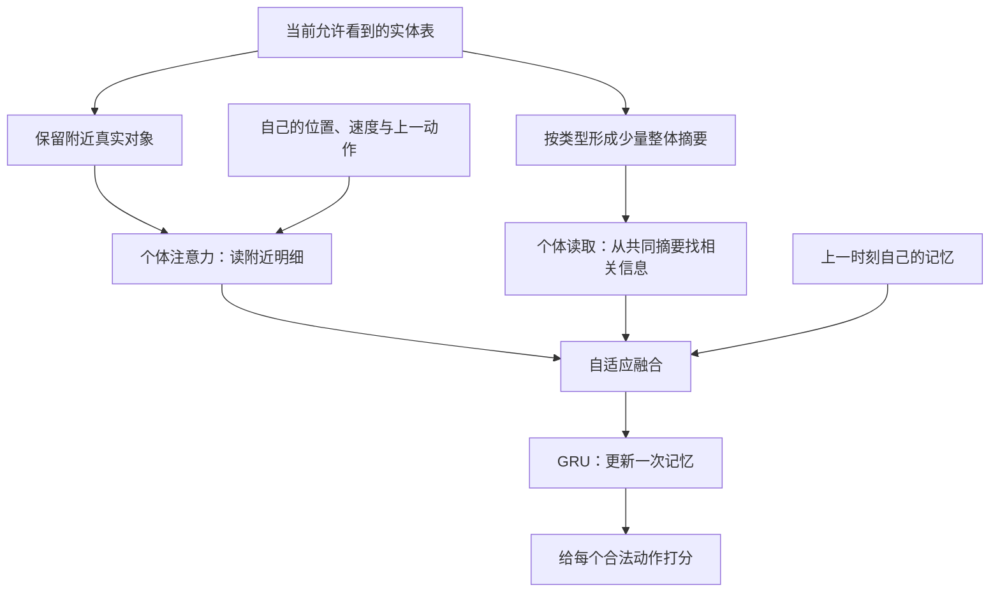

# 基于 REFIL 的动态规模强化学习方案

## 第一章　研究场景与目标

### 1.1 我们要解决什么问题

研究对象是多智能体强化学习仿真。可以把一个智能体理解成一个会根据观察作出选择的小程序。训练时，场景里只有少量智能体；测试时，数量增加。希望不用重新训练，它们仍能协作。

举一个非对抗的例子：训练时有 4 个移动小球，需要共同到达若干地标；测试时变成 12 个小球。每个小球都见到了更多对象，但“我附近有哪些对象”“团队整体分布如何”这类问题仍会重复出现。我们希望复用这些经验，而不是让网络为每种人数重新学习。

这里要区分两件事：

- **能运行**：网络接受更多对象，程序没有报错。
- **能泛化**：数量增加后，协作表现仍然较好。

REFIL 已经具备第一种能力，我们研究的是第二种。

### 1.2 本方案沿着哪三条想法展开

| 你的想法 | 用简单的话解释 | 想解决的主要问题 |
|---|---|---|
| 全局与局部信息自适应融合 | 每个人既看整体情况，也看与自己有关的细节，并学习什么时候更依赖哪一种 | 有信息，但不会有重点地使用 |
| 队友行为预测 | 决策前先估计队友可能怎么做 | 各自决策时缺少对彼此行为的预期 |
| 大规模信息聚合为熟悉结构 | 把大量对象整理成少量摘要，同时保留部分个体明细 | 输入越来越复杂，小规模经验难以复用 |

**建议把第三条作为研究主线，与第一条结合；第二条作为后续增强。** 原因是本研究首先要回答规模扩大后的信息问题。先把三种机制同时加上，即使效果变好，也难以解释是哪一项起了作用。

这不是放弃任何一条想法，而是区分“最终设想”和“先做什么”。

### 1.3 本文的数据与技术实例分别来自哪里

第二章引用当前仓库已经完成的仿真结果，用来说明现象。原实验是 HAD 自定义场景，不应把它称作官方 MPE 标准任务。[项目说明](README.md)

第六章的具体网络实例采用**非对抗的 MPE 协作地标任务**：只有移动智能体与地标，不包含开火、自毁或毁伤机制。官方 Simple Spread 就属于这一类任务。[MPE2 Simple Spread 文档](https://mpe2.farama.org/environments/simple_spread/)

这一区分影响实验结论：旧场景的数据是研究动机，不能当作新网络在这个非对抗任务上的验证结果。本文是设计稿，没有新增训练或评估结果。

## 第二章　现有结果

### 2.1 REFIL 当前处于什么位置

已有正式对照包含 QMIX-Atten、REFIL、DCG、SPECTra 和 ALMA，每种方法有三个训练种子。训练使用小规模组合，再测试更大的规模。[main v3 正式报告](Open-SCORE/outputs/main_v3/实验报告.md)

**REFIL 是当前正式对照中整体表现最好的学习方法，但大规模下仍明显退化，也并非一直优于规则方法。**

下表摘录原场景的已有终评。D 表示该场景累计损失，越低越好。每个 REFIL 配置汇总三个训练种子、900 局；规则每配置为 300 局。

| 配置 | REFIL 平均 D | 规则平均 D | REFIL 严格完成率 | 规则严格完成率 | REFIL 同队碰撞死亡占比 | 规则同口径 |
|---|---:|---:|---:|---:|---:|---:|
| 10v10，K=2 | 1.078 | 1.525 | 40.22% | 14.33% | 4.73% | 2.73% |
| 15v15，K=2 | 1.477 | 1.635 | 35.67% | 18.33% | 7.13% | 3.51% |
| 20v20，K=2 | 1.801 | 1.762 | 31.00% | 16.33% | 8.96% | 4.17% |
| 25v25，K=2 | 2.043 | 1.710 | 29.33% | 20.33% | 10.72% | 4.64% |
| 30v30，K=2 | 2.449 | 1.652 | 28.11% | 25.67% | 12.98% | 5.71% |
| 40v40，K=2 | 2.815 | 1.340 | 23.78% | 32.33% | 16.47% | 7.44% |

这里的“严格完成”沿用原报告定义：自然结束、D 小于 1e-9，且蓝方剩余数为零；不要求红方全部存活。“碰撞死亡占比”的分母是初始红方人数。它们是原场景指标，不能直接当作 Simple Spread 的完成率或碰撞率。


图复用已有正式结果。REFIL 的误差线表示三个训练种子之间的标准差；规则没有对应的训练种子重复。

### 2.2 这些结果说明了什么

第一，规模扩大后，REFIL 的平均损失上升、严格完成率下降，同队碰撞损耗增加。这支持“规模泛化仍不足”的判断。

第二，平均分和稳定完成不是同一回事。例如 20v20 时，REFIL 的严格完成率比规则高，但平均 D 略差。一个指标不足以说明全部行为质量。

第三，当前“最好的学习方法”仍有改进空间。原报告全部 18 个等人数配置中，REFIL 共严格完成 5,756/16,200 局，即 35.53%。这一合计不能替代各规模的分别比较。[原始统计与口径](Open-SCORE/outputs/main_v3/实验报告.md)

### 2.3 读现有数据时容易误解的地方

**表格预留行数，不等于真实训练人数。** 某个配置写着允许放入 20 个智能体，可能只是预留了 20 行；实际每局仍从小规模池采样。原报告与现有采样器定义的训练人数为 4、6、8、10，目标数为 1、2、3。[规模采样定义](Open-SCORE/open_score/envs/scales.py)

**多局测试，不等于多次独立训练。** 三个训练种子各测试 300 局，不是训练了 900 个独立模型。

**已有结果没有验证新方案。** 本文后面的全局融合、行为预测和聚合模块，均不能标记为已经有效。

## 第三章　存在问题

### 3.1 网络面对的对象越来越多

当前 REFIL 大致做的是：

> 读取每个对象 → 用注意力整理信息 → 用记忆网络结合过去 → 给各动作打分。

注意力可以理解为“给不同信息不同权重”；记忆网络可以理解为“保留前面几步的线索”。当前实现已经有这两种机制，不是从零开始补上它们。[现有模型](Open-SCORE/open_score/models/entity_encoder.py)

问题在于：训练时需要同时考虑的对象少，测试时对象多得多。网络虽然还能运行，但过去学到的信息使用方式未必仍合适。

这是一种合理解释，**还不是已经证明的原因**。规模增加时，局部拥挤程度和关系组合也在变化，现有结果没有将这些因素完全分开。

### 3.2 知道整体情况，不等于会使用整体情况

同一条信息对不同智能体的价值可能不同。以协作地标任务为例，所有小球都能知道地标的位置，但不同位置的小球需要关注不同细节。

把信息全部提供给网络，并不意味着它已经学会区分：

- 团队共有的事实；
- 自己需要关注的细节；
- 暂时可以用摘要表示的信息。

第一条想法就是研究这种区别。

### 3.3 每个人都有自己的记忆，不等于理解队友的行为

一个智能体的记忆主要服务于自己的动作选择。它可能从中隐式学到队友规律，但我们不能仅凭“有 GRU”就认定这一点已经做好。

GRU 是一种记忆网络：每一步读取当前信息，再更新一段固定长度的记忆。队友预测则提出了更明确的问题：“根据现在和过去，我认为另一个智能体接下来会如何选择？”

两者可能互补，也可能有重复，因此预测模块需要证明自己的额外价值。

### 3.4 聚合可能解决信息过多，也可能丢掉重要区别

例如，两个对象分别位于左边和右边，它们的平均位置在中间。但“中间有一个对象”和“左右各有一个对象”不是同一种情况。

所以不能只做一个平均位置，也不能只追求把输入压得更短。第三条想法需要同时考虑：

> 怎样使输入更容易复用，以及怎样保留仍然重要的差别。

### 3.5 “反应慢”和“协作差”需要分开解释

有限轨迹中看起来反应迟缓，不足以证明网络计算慢或固定延迟。信息何时出现、动作何时产生效果、参与者是否已经形成选择，属于不同问题。

同样，多个个体做出相似动作，不一定表示没有协作。本文将这些现象作为待分析的问题，不提前认定某个模块能够消除它们。

## 第四章　基于问题提出的三个改进方案

### 4.1 方案一：全局摘要与个体细节分开处理

**一句话说明：大家共用一份“整体情况说明”，每个人再结合自己的“附近明细”做判断。**

在协作地标例子里：

- 整体情况说明：智能体和地标大致如何分布，各有多少。
- 个体明细：自己周围的对象，以及自己当前的位置和运动状态。
- 自适应融合：网络学习如何结合这两种信息，不用人为规定固定比例。

“自适应”并不神秘。可以把它理解成一个由网络产生的调节量：某类整体信息此时多用一点，另一类少用一点。

**和原 REFIL 的关系。** 保留动作评分与记忆学习的基本方式，改变前面的信息组织。这里增加的是表征层次，不必增加一个每隔若干步发布任务的“领导者”。

**能期待什么。** 更清楚地区分公共情况与个体关注。

**不能提前保证什么。** 共享信息不会自动产生分工，融合权重也不能直接解释为真正的职责或可信度。

单独研究这个方案时，可以保留原有全部对象作为个体路径输入。这样容易比较“新增整体摘要是否有帮助”。但它还没有减少原路径面对的对象数量，不能称为已经完成第三个方案。

### 4.2 方案二：增加队友行为预测

**一句话说明：先猜一猜队友可能怎么选，再把这个猜测作为自己的参考。**

预测输出应当是一组概率，而不只是一个确定答案。例如：

> 向左 60%，向右 10%，向上 10%，向下 10%，不动 10%。

这表示模型有一个倾向，但没有把猜测当作事实。具体动作含义由环境定义。

可以区分两个版本：

| 版本 | 预测结果是否参与当前决策 | 用途 |
|---|---|---|
| 仅辅助训练 | 不参与 | 看“学习预测”是否让原表示更有用 |
| 预测辅助决策 | 参与 | 看队友行为预期是否给当前选择带来额外价值 |

这两个版本要分开，否则很难解释收益来自哪里。

**和 REFIL 的关系。** 继续使用原来的动作价值学习，同时增加一个小预测网络。预测网络读取当前可用信息与上一时刻记忆，不读取队友尚未执行的真实动作。

**能期待什么。** 帮助个体更明确地组织对队友行为的认识。

**主要难点。** 队友也在学习，其行为规律会变化。预测可能过时。因此，“训练时预测得准”还不够，要看它是否真的改善协作，并检查预测与实际行为是否一致。

### 4.3 方案三：把大规模信息整理成少量熟悉单元

**一句话说明：附近对象保留明细，其余复杂情况通过少量摘要来理解。**

本方案采用“局部明细＋整体摘要”的两种视图。整体摘要仍概括全部允许看到的对象，局部只是对其中一部分保留更多细节。

举例：

| 原始场景 | 个体读取的明细 | 整体摘要 |
|---|---|---|
| 少量智能体与地标 | 附近少量真实对象 | 若干组概括信息 |
| 更多智能体与地标 | 仍读取相同上限的真实对象 | 仍使用相同数量的摘要 |

这样，决策网络后半部分面对的信息条目数可以保持稳定。这个“稳定接口”接近“先整理成自己熟悉的工作”的想法。

**摘要不能只有平均值。** 每份摘要还应表达它代表多少对象，以及这些对象是集中还是分散。例如，“两个靠近的对象”和“二十个分散的对象”不能因为平均位置相同就完全混淆。

**和平均场的关系。** 本方案强调一部分个体保留明细，同时用多个摘要组织整体。它与群体近似思想有关，但不能只用“平均场很模糊”来解释区别；第五章给出对应文献。

**主要难点。** 条目数相同，不等于内容已经回到训练分布。摘要代表的对象数仍可能变多，关系也可能更复杂。

### 4.4 为什么建议先结合方案一和方案三

二者可以回答一个连续的问题：

> 先把大量对象整理成局部明细和整体摘要，再让个体学习如何结合它们。

方案三解决“信息怎样整理”，方案一解决“整理后怎样使用”。方案二则在此基础上增加“怎样理解队友行为”。

初版先做方案一＋三；在它有稳定收益之后，再判断是否值得加入方案二。三个方案仍分别保留开关，以便比较。

## 第五章　这些方案有什么文献支持

### 5.1 最直接的参考

| 工作 | 用本科生能理解的话说明 | 对应方案 | 需要注意 |
|---|---|---|---|
| [REFIL，ICML 2021](https://proceedings.mlr.press/v139/iqbal21a.html) | 随机只看一部分对象，让模型学习在不同任务中复用局部关系 | 方案三的基础动机 | 并未保证任意大规模任务都能无损化为小规模 |
| [CAMA，ICML 2023](https://proceedings.mlr.press/v202/shao23b.html) | 强化重要信息的关注，再用补充消息帮助理解其他信息 | 方案一 | 已直接研究 REFIL，不能忽略这一近邻 |
| [MASIA，NeurIPS 2022](https://papers.neurips.cc/paper_files/paper/2022/hash/075b2875e2b671ddd74aeec0ac9f0357-Abstract-Conference.html) | 把共同信息整理起来，再让各个体取自己需要的部分 | 方案一、三 | 作者默认实现的表示宽度随人数增加，不等于固定宽模型直接跨人数 |
| [LIAM，NeurIPS 2021](https://proceedings.neurips.cc/paper/2021/hash/a03caec56cd82478bf197475b48c05f9-Abstract.html) | 从自己的历史中学习对其他参与者的表示 | 方案二 | 其固定其他策略的研究条件，与所有人同时学习不同 |
| [MAIC，AAAI 2022](https://ojs.aaai.org/index.php/AAAI/article/view/21179) | 对队友建模，并为不同队友产生不同消息 | 方案二 | 建模与形成有效分工仍需分别说明 |
| [InforMARL，ICML 2023](https://proceedings.mlr.press/v202/nayak23a.html) | 用图网络整理邻域信息，研究不同人数下的协作导航 | 方案三 | 有跨规模实验，但不保证所有质量指标都随之改善 |
| [Set Transformer，ICML 2019](https://proceedings.mlr.press/v97/lee19d.html) | 将长度不固定的对象集合整理为固定数量的表示 | 方案三的工具基础 | 这是集合学习方法，不是策略泛化保证 |
| [Slot Attention，NeurIPS 2020](https://proceedings.nips.cc/paper_files/paper/2020/hash/8511df98c02ab60aea1b2356c013bc0f-Abstract.html) | 用若干可学习的“槽”组织输入对象 | 方案三的软分组参考 | 原始证据来自视觉，槽不天然对应协作职责 |

“槽”只是一个装摘要的容器，不是新增真实智能体，也不是一个自动产生的队长。

### 5.2 比 COPA 更新的工作应怎样看

[COPA，ICML 2021](https://proceedings.mlr.press/v139/liu21m.html)让全局 coach 给个体发送策略表示，研究动态团队组成。它有层次协调含义，但与本方案“共同摘要＋个体读取”并不完全相同。

较新的 [M2I2，AAAI 2026](https://ojs.aaai.org/index.php/AAAI/article/view/39764)研究信息整合与动作辅助学习。但其动作逆模型是“看到前后两个时刻，再解释中间发生了什么动作”，不是“行动前猜队友接下来怎么做”。[正式全文](https://ojs.aaai.org/index.php/AAAI/article/download/39764/43725)

[SATF，2024 在线发表](https://opus.lib.uts.edu.au/handle/10453/180313)的机构摘要介绍了不同规模观测的表示对齐与迁移。本次只核实了摘要和机构记录，不能据此声称已经核实其冻结模型零样本迁移协议。

因此，不能只按年份选文献。方案一最需要认真比较 CAMA、MASIA；方案三要比较集合聚合和跨规模方法；方案二要区分未来预测、他者表示和动作逆模型。

### 5.3 可以怎样定位科研贡献

不宜声称“首次提出全局与局部融合”“首次使用固定摘要”或“首次预测队友”。这些都有研究先例。

更合适的待验证主张是：

> 在固定的信息条目预算下，同时保留局部个体与群体数量信息，是否更有利于小规模经验向大规模迁移？

行为预测是进一步的问题：

> 在这种信息组织方式上，队友预测是否还能带来可重复的额外收益？

与平均场比较时也要准确。经典平均场近似群体的平均作用，后续方法还使用分布表示；不能将全部平均场研究等同于一个简单平均数。[Mean Field MARL](https://proceedings.mlr.press/v80/yang18d.html)、[Mean Embedding Q-Iteration](https://proceedings.mlr.press/v119/wang20z.html)

## 第六章　仿真实验中的网络、架构、参数与实施安排

### 6.1 本章的具体环境与信息约定

以下是**独立非对抗 MPE 协作地标实验**的设计规格。它不是当前 HAD 攻防控制器的部署改造，旧场景权重也不能直接当作这个新环境的可用模型。

采用离散动作的协作地标任务。官方 Simple Spread 有 N 个智能体和 N 个地标；默认完整观测包括自身位置、速度，以及其他智能体和地标的相对位置。动作数由环境读取，官方离散 Simple Spread 为 5；不能因为旧实验有 9 个动作，就给所有 MPE 模型写死 9 个输出。[官方接口](https://mpe2.farama.org/environments/simple_spread/)

初版约定如下：

| 项目 | 约定 | 为什么 |
|---|---|---|
| 对象类型 | 智能体、地标 | 对应一个清楚的非对抗协作问题 |
| 公共实体表 | 位置和对象类型 | 使用所有个体本来都能获得的公共事实 |
| 个体私有输入 | 自身速度、上一动作、自己的历史记忆 | 不读取队友的私有记忆 |
| 全局摘要 | 只从公共实体表形成 | 避免无意增加观测权限 |
| 部分可见任务 | 另行研究 | 不能把训练用完整状态直接作为个体执行输入 |
| 奖励 | 将环境各智能体奖励取平均，作为同一团队奖励 | 给 REFIL 明确的合作训练目标，所有对照采用同一规则 |

使用平均团队奖励是本实验的明确约定，不是宣称所有 MPE 方法原本都这样处理奖励。原环境内部奖励、碰撞和终止规则对各对照保持一致。

### 6.2 先看整张网络图

初版实现方案一＋三：



注意力输出、摘要和记忆都是一串数字。比如“64 维”表示用 64 个数字表达一段信息，不是 64 个智能体。

完整动作打分网络仍属于 REFIL 的个体网络；训练时继续用 REFIL 的团队价值学习方法。摘要模块不是另一个发布任务的高层策略。

### 6.3 输入怎样整理

令 N 为智能体数，L 为地标数，E=N+L 为总对象数。

公共实体表有 E 行，每行先使用 4 个数：

| 字段 | 含义 |
|---|---|
| x、y | 统一坐标系中的位置 |
| is_agent | 是智能体则为 1，否则为 0 |
| is_landmark | 是地标则为 1，否则为 0 |

是否存在、是否可见使用单独的布尔标记，不把补齐的空行当真实对象。坐标缩放采用固定单位，不随当前人数变化。

个体读取明细时，将其他对象位置减去自己的位置，得到相对位置。形成共同摘要时使用统一坐标系，不能把某个人的相对坐标直接作为所有人的共同地图。

每个个体还有一份自己的查询输入：

> 自身位置 2 个数＋自身速度 2 个数＋上一动作的独热编码。

独热编码就是用一串 0 和一个 1 表示动作编号。若动作数为 A，查询输入为 4+A 维。第一步没有上一动作，全部填 0。

**本设计不读取队友未公开的速度、当前动作或内部记忆。**

### 6.4 局部明细：初版保留多少个对象

建议先保留：

- 自己作为一个可用的明细对象；
- 最近的 2 个其他智能体；
- 最近的 2 个地标。

因此，明细最多 5 条。这里的“最近”只是一个简单、固定的信息筛选方式，后续注意力仍要学习怎样使用保留的对象。

不足 2 个时，缺少的位置填空并标记为无效。先排除不可见对象，再选最近对象，不能选完以后才发现读入了本来不可见的信息。

每条明细的 4 维输入经过线性层变为 128 维；个体自己的 4+A 维查询输入也通过一个独立线性层变为 128 维。查询对明细做注意力读取，再经过 128→64 的线性层。

此外，自己的 4+A 维输入通过另一个线性层直接变为 64 维，与上述读取结果相加并经过 ReLU，得到局部表示 l。ReLU 是把负数变为零的常用激活函数。保留这条自身信息路径，是为了不让自己的速度和上一动作只存在于查询中：当可读取对象只剩一个时，注意力权重始终是 1，查询未必能影响最终读出。

这个自身信息路径在全部 MPE 对照中一致保留，包括不带摘要的 REFIL 基础适配版，不将它的收益算作新增聚合模块的贡献。

**为什么初版不直接学习硬选择？** 固定筛选规则容易解释，能先判断整体思路是否有用。最近不一定最相关，因此它只是初版选择；不能把它写成最优规则。

也不宣称严格的排列无关保证：完全相同距离时，如果程序按数组顺序打破平局，这一细节就需要单独说明。

### 6.5 整体摘要：大量对象怎样变成固定条目

建议智能体用 2 个摘要槽，地标用 2 个摘要槽，总计 4 个。两种类型分别整理，避免把智能体和地标平均成难以解释的“混合对象”。

**第一步：给每个对象产生分组比例。**

例如，一个对象分给同类型第一个摘要的比例为 0.8，第二个为 0.2。两个比例相加为 1。这叫软分组：对象不必被硬性塞进唯一一组。

分组比例由一个小网络学习：

> 公共对象特征 → 128 维表示 → 32 个隐藏单元 → 2 个分组得分 → 归一化为两个比例。

这里的归一化就是让比例非负，并且和为 1。初版只进行一次分组，不加入反复多轮聚合。

**第二步：每个摘要保存内容和数量。**

某个摘要的数量，是所有对象分给它的比例相加。若三个对象对同一摘要的比例分别为 0.8、0.5、0.2，它代表的数量就是 1.5。这是加权数量，不表示出现了半个真实对象。

摘要中的内容用加权平均计算：

> 摘要内容＝所有“对象表示×分配比例”的和÷该摘要代表的数量。

这两个计算都有直接含义，不需要复杂的分组标签。

**第三步：不要只保存平均内容。**

每份摘要保存下列数据：

| 内容 | 维度 |
|---|---:|
| 加权平均后的对象表示 | 128 |
| log(1＋加权数量) | 1 |
| 平均位置 x、y | 2 |
| x、y 方向的位置方差 | 2 |
| 是否非空 | 1 |
| 对象类型标记 | 2 |
| 合计 | 136 |

方差用来描述对象有多分散；数量的对数用于压缩数值范围，但仍保留数量差异。不要把大数量直接截断为训练最大值。

共享摘要保留这 136 个数。每个个体读取时，先将其中的平均位置减去自己的位置，再通过一个 136→128 的线性层，形成统一宽度的信息条目。个体用 128 维查询读取四份摘要，再用 128→64 的线性层得到整体读出。数量为零时整份摘要无效，使用标记跳过，不能除以零。

**数量要怎样核对？** 同类型两个摘要的数量之和，应等于该类型允许看到的真实对象数。空行不能贡献数量。

**局部明细和整体摘要有重叠正常吗？** 正常。它们是同一场景的两种视图。数量守恒只在四个整体摘要内部计算，不能再把局部对象数加上去。

### 6.6 全局与局部怎样融合

所有智能体共享的是四份摘要，记作 S。但每个人读取摘要时，可以得到不同的 64 维结果，记作 g_i。它们的关系是：

> 同一份地图，不同的人从地图上找自己关心的内容。

读取前，将摘要平均位置转换为相对于当前个体的位置；摘要统计的来源仍是统一公共坐标。这样不会把“共同摘要”与“每个人完全相同的最终向量”混为一谈。

用 l、g_i 和上一时刻记忆 h 产生一个 64 维调节量 α，每个数在 0 到 1 之间：

> 融合结果＝局部表示＋整体信息补充。

对应的紧凑公式为：

```text
g_norm = LayerNorm(g_i)
alpha  = sigmoid(MLP([l, g_norm, h_previous]))
x      = l + W_global(alpha * g_norm)
```

方括号表示把几串数字接在一起，乘号表示对应位置相乘。LayerNorm 负责把整体表示的数值尺度整理得更稳定，避免某一路仅因为数值大而占优势。

融合后的 x 仍为 64 维，送入原来的 64 维 GRU。GRU 每步只更新一次，再输出 A 个动作分数。

初版把 W_global 初始化为零，使额外整体路径从小影响开始学习。要注意：此时得到的是“只读局部明细”的网络，**不是原来读取全部对象的 REFIL**。缩短了输入集合，就不能再声称旧模型函数完全不变。

### 6.7 预测模块怎样加入，而且不形成循环

预测先作为可选第二阶段，不放入首版主方法。

只预测局部保留下来的最多 2 个真实队友。摘要槽不是一个人，不能给摘要槽标上某个队友的动作作为标签。

一个正确的执行顺序是：

1. 读当前信息，得到局部表示与整体读出。
2. 结合自己的上一时刻记忆，预测队友动作概率。
3. 将预测结果作为额外参考。
4. 更新自己的 GRU 一次。
5. 给自己的动作打分并选择动作。

不能先用本次更新后的最终动作分数产生预测，再将预测喂回同一次更新，否则就变成“要知道结果才能算结果”。

建议的预测网络：

| 部分 | 建议结构 |
|---|---|
| 输入 | 局部表示 64＋整体读出 64＋自己的旧记忆 64＋被预测队友表示 128 |
| 预测网络 | 320 → 64 → A |
| 输出 | A 个动作的概率 |
| 概率摘要输入 | 动作概率 A＋队友相对位置 2＋预测熵 1 |
| 概率摘要网络 | A+3 → 64 → 64；多个队友结果取平均 |
| 加入方式 | 作为另一份 64 维补充，送入同一次 GRU 更新 |

预测熵可以理解为“猜测有多犹豫”。它不是已经校准的可信度，不能直接当作可靠性保证。

**训练标签从哪里来？** 在这个新的 MPE 实验中，建议采集时额外保存队友在随机探索前最想选的动作。这样标签表示当时策略的动作偏好，不把随机探索动作直接当作意图。该字段必须在新实验采集器中明确保存，旧回放没有它，不能假装已有。

这一标签仍来自历史策略，不保证等于当前策略的偏好。应称为“历史行为策略偏好的预测”，不要称为恢复真实意图。

辅助损失采用动作分类常用的交叉熵：模型给正确动作的概率越低，惩罚越大。建议先用：

```text
总损失 = REFIL 原有损失 + 0.05 × 预测损失
```

0.05 是起始建议，不是已经验证的最优值。没有有效队友或有效动作标签的样本不计算预测损失；按有效预测条目取平均，不随人数增加直接放大这一项。

具体在“动作概率及由概率计算的熵”处使用 stop-gradient，即将这些数暂时视为固定数字，再送入概率摘要网络。动作概率头由预测损失训练，后面的 A+3→64→64 摘要网络由决策损失训练。不能把最终 64 维摘要整体切断更新，否则摘要网络可能没有学习信号。

设摘要网络得到 b，额外融合写为 x_final = x + W_pred(b)，其中 W_pred 是 64→64 的线性层，初始为零；随后只执行一次 GRU。没有有效队友时，b 返回零向量，整条预测补充也强制为零，不能对空集合求平均。这样的梯度处理有助于维持预测含义，但共享的前面编码层仍会更新，不能说两个网络完全互不影响。

### 6.8 保留 REFIL 时，最容易写错的地方

REFIL 会构造三种信息视图：完整视图、组内视图、跨组视图。可以把它们理解为同一场景下戴着不同“眼罩”看信息。

**关键规则：先戴眼罩，再整理摘要。**

错误做法是先看完整场景算出摘要，再把它交给本来只能看一部分对象的分支。这等于通过摘要把被遮住的信息带回来了。

需要同时遵守：

| 项目 | 正确做法 |
|---|---|
| 真实对象筛选 | 在当前分支允许看到的集合内选择 |
| 分组比例、平均值、数量 | 都只来自该分支允许看到的对象 |
| 共同摘要 | 完整视图可共享；允许集合不同的分支应分别计算 |
| 历史记忆 | 三个分支分别按各自输入更新，不能共享完整视图的记忆 |
| 自己的信息 | 保留自己的查询，不代表可以解除原分支对自己作为被读取对象的限制 |
| 预测输入 | 使用当前分支的信息；不能把完整分支的预测复制过去 |
| 辅助预测损失 | 初版只在完整视图上监督；其他分支仍各自计算预测，不能偷读完整视图 |
| 目标网络 | 使用自己的编码、预测和历史，不借用当前训练网络的结果 |

若某个分支没有任何可读取的有效条目，注意力读取结果明确返回零。不能对一整行无效得分直接计算概率，也不能为了避免数值问题而临时放开不可见对象。重新开始一个回合时清空记忆；无效个体的记忆也应清空。到时间上限后用于估计后续价值的最后观察，不能提前丢掉已有历史。

目标网络是强化学习中一份更新较慢的网络，用来提供相对稳定的学习目标。

原 REFIL 的完整视图与想象视图损失比例先保持 0.5∶0.5。团队价值混合器负责把各个智能体的动作分数合成为团队分数；初版沿用能处理实体集合的 FlexQMIX 混合器，保留原有学习方式。不能换成只接受固定长度状态拼接的混合器，否则人数变化时仍可能出现尺寸不匹配。也不增加新的任务分配器，以免难以解释收益来源。

### 6.9 建议的初始参数

下表是新非对抗 MPE 实验的起始配置，不是最优参数，也不是已经跑出的设置。

| 参数 | 初始建议 | 白话解释 |
|---|---:|---|
| 局部队友明细 | 2 | 每人最多精细读取两个队友 |
| 局部地标明细 | 2 | 每人最多精细读取两个地标 |
| 智能体摘要槽 | 2 | 用两份摘要概括整体智能体分布 |
| 地标摘要槽 | 2 | 用两份摘要概括整体地标分布 |
| 对象表示宽度 | 128 | 每个对象或摘要用 128 个数表达 |
| 注意力头数 | 4 | 用四组不同的信息比较方式 |
| 局部与整体读出 | 各 64 | 两路输出宽度相同，便于融合 |
| 自身信息直接映射 | 4+A → 64 | 保留自己的位置、速度和上一动作 |
| GRU 记忆宽度 | 64 | 每个智能体保存 64 个数的历史记忆 |
| 分组网络隐藏宽度 | 32 | 控制摘要分配器大小 |
| 融合网络 | 192 → 64 → 64 | 输入两路表示与旧记忆 |
| 动作输出 | A，来自环境 | 不写死旧环境动作数 |
| 折扣因子 | 0.99 | 决策仍考虑后续回报 |
| 学习率 | 0.0005 | 从 REFIL 常见设置开始 |
| 优化器 | RMSprop | 各对照保持一致 |
| 每批回放 | 32 个完整回合 | 按时间顺序重建记忆 |
| 回放容量 | 5,000 个回合 | 不按对象总数重复扩充 |
| 梯度裁剪 | 10 | 限制一次更新的梯度大小 |
| 目标网络同步 | 每 200 次参数更新 | 新实验明确按学习更新计数 |
| REFIL 想象损失比例 | 0.5 | 保留原辅助学习比例 |
| 预测损失权重 | 0；第二阶段改为 0.05 | 首版关闭预测 |
| 随机探索概率 | 从 1 降到 0.05 | 前 100,000 个联合环境步线性下降 |
| 测试探索概率 | 0 | 使用冻结模型的动作偏好 |

“一步联合环境交互”指所有智能体共同作出一次动作，不是人数越多就把同一步重复计数。并行环境的步数需要合计。

参数表中的记忆宽度、注意力宽度等参考现有 REFIL 的基础设置，但动作输入与 MPE 实体接口重新定义。旧实验使用 19 维对象输入和 9 个动作，这不是新 MPE 环境的通用形状。[现有 REFIL 配置](Open-SCORE/configs/refil.yaml)

### 6.10 实现应分成哪些职责

无需增加独立高层策略或另一个训练系统。建议在独立 MPE 验证中按下表实现模型职责：

| 职责 | 输入 | 输出 |
|---|---|---|
| 实体整理 | 环境观察 | 公共实体表、个体输入、有效标记 |
| 局部选择 | 当前允许实体集合 | 最多 5 条真实对象明细 |
| 整体聚合 | 当前允许的公共实体集合 | 4 份摘要及有效标记 |
| 个体读取 | 自身查询、明细和摘要 | 两份 64 维表示 |
| 自适应融合 | 两份表示、旧记忆 | 64 维当前输入 |
| 记忆与动作评分 | 当前输入、旧记忆 | 新记忆、A 个动作分数 |
| 可选行为预测 | 当前表示、旧记忆、真实队友信息 | 队友动作概率和辅助损失 |

回放保留原始实体与标记，不只保存已经压缩的摘要。否则训练时无法按 REFIL 的不同分组重新整理信息。

**模型复用要分清两件事。** 可以复用 REFIL 的学习方法和实现思路；但旧场景的输入、动作含义不同，不能直接加载旧 best 模型并称为新 MPE 策略。即使在同一任务里修改结构，改变注意力输入后也不保证原动作保持不变。

第一份新 MPE 对照应从头训练，保证比较清楚。同任务、同输入下的权重微调可以单独研究；新模块需要明确初始化，优化器状态也不能盲目接着旧模型恢复。

### 6.11 最小验证安排：先回答一个问题

**第一轮只回答：局部明细与整体摘要结合后，跨规模表现是否改善？**

建议四个对照：

| 名称 | 内容 | 能帮助回答什么 |
|---|---|---|
| A：REFIL 基础适配版 | 使用相同 MPE 输入与自身信息路径，读取全部允许对象，不加摘要或预测 | 基线表现 |
| B：只保留局部明细 | 没有整体摘要 | 简单截断会丢失多少信息 |
| C：固定分组摘要＋局部融合 | 每类仍为两个摘要，按公共 x 坐标的正负固定分组 | 普通几何摘要能做到什么程度 |
| D：学习分组摘要＋局部融合 | 第 6.5 节的可学习分组 | 学习分组是否优于固定分组 |

C 与 D 的摘要数、统计字段、读取网络及融合网络相同，只改变分组方式。固定分组可能出现空组，按相同空摘要规则处理。坐标分界是对照用的简单规则，不是推荐的最优分组。A 是保留 REFIL 学习机制的统一输入适配版，不是原论文或旧 HAD 检查点逐层不变的复制品。

四个对照能判断主线是否值得继续，但不能完全排除新网络参数更多带来的影响。如果要进一步声称“不是容量增加的收益”，再加入参数量接近的对照，不提前把所有实验摊开。

**一个可讨论的预算起点：**

- 训练人数：3、4、5，地标数随任务定义保持一致。
- 测试人数：3、4、5、6、8、10；测试不更新模型。
- 每种方法：3 个训练种子，每种子 1,000,000 个联合环境步。
- 每个测试规模：每个训练种子 300 局，使用一致的环境种子。
- 新模型选择只看小规模验证，不用大规模测试反复挑选检查点。

这是新实验的预算建议，不代表本轮已经运行或自动批准开展。需要注意：在小规模训练中，聚合模块也必须真实使用，不能等到大规模才第一次启用。

至少同时记录：

| 指标 | 为什么要看 |
|---|---|
| 平均每个地标的覆盖距离 | 减少地标总数增加对总和指标的影响 |
| 每个智能体、每步的碰撞统计 | 避免仅因人数增加就机械增加总碰撞数 |
| 任务完成率 | 与平均距离互补；定义和阈值应在实验前固定 |
| 各训练种子的结果 | 判断收益是否稳定 |
| 摘要代表的数量与位置离散程度 | 了解模型有没有丢掉群体规模信息 |
| 两个摘要是否长期几乎相同 | 判断学习分组是否退化成重复平均 |

图表继续放在该新实验唯一输出目录，维护一份正式报告。不与原场景的 D 或严格完成率放在同一数值轴上比较。

**第二轮再决定是否加入预测。** 仅当第一轮主线有效，再比较“不加预测”“只作预测辅助训练”“预测参与决策”。如果参与决策没有额外收益，就不强行将其纳入最终方法。

### 6.12 什么结果算支持方案，什么结果要求收缩结论

| 观察到的结果 | 应得出的结论 |
|---|---|
| D 在多个未见规模稳定优于 A、B、C | 支持这种信息组织和学习分组值得继续研究 |
| D 只比 B 好，但没有超过 A | 摘要缓解了截断损失，还不能说优于原 REFIL |
| C 与 D 接近 | 不能把收益归因于可学习分组 |
| 预测更准，但任务表现没变好 | 预测有拟合能力，尚未证明对决策有帮助 |
| 平均分改善，碰撞指标变差 | 应报告代价，不能只展示平均分 |
| 小规模也明显变差 | 需要重新检查信息损失或训练稳定性 |
| 更大规模仍退化 | 固定接口没有消除新的群体条件，不能宣称恢复训练分布 |

即使输入只剩少量条目，前面的读取和聚合仍要处理全部对象，因此不承诺总计算量与人数无关。多个摘要也不保证包含所有必要信息；如果任务本身需要更多独立关系，固定容量可能不够。

三位审阅角色的意见已合并到本方案：调研家强调直接文献近邻，项目专家核对已有模型与数据口径，评论家检查共享信息、摘要数量、预测时间顺序和对照结论。综合判断是：**它可以作为独立非对抗 MPE 协作研究的待验证方案，先验证信息组织，再判断预测是否值得加入。当前没有实施完成或实验成功的结论。**

