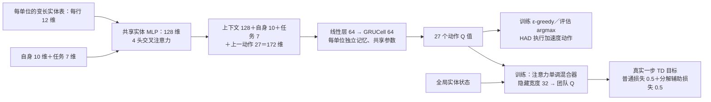
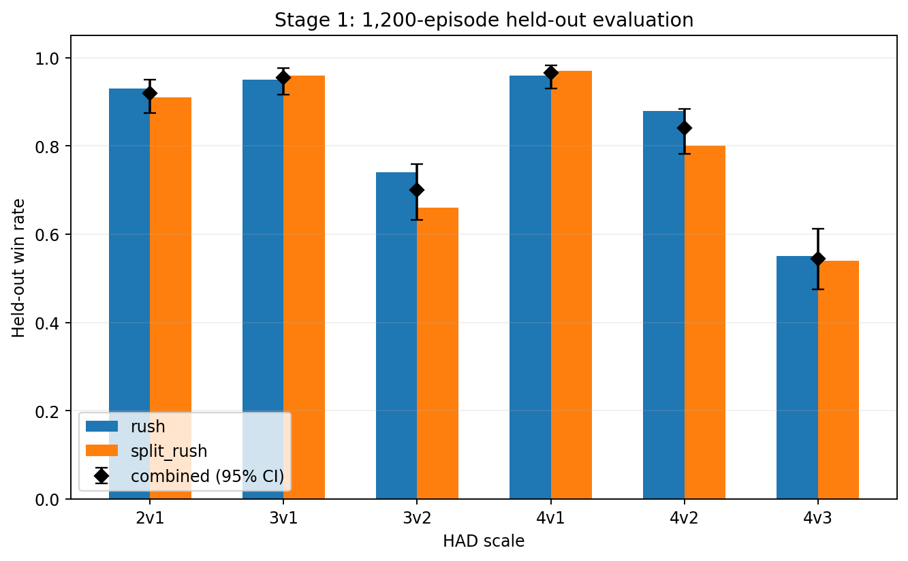
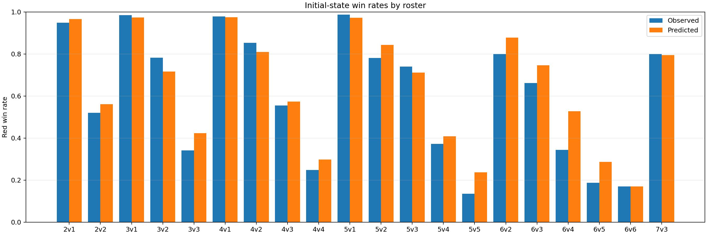
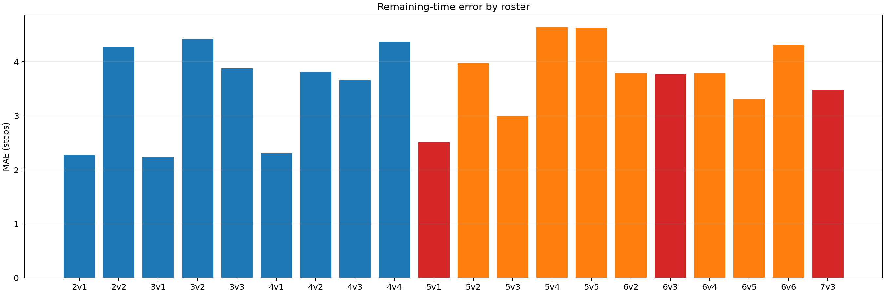
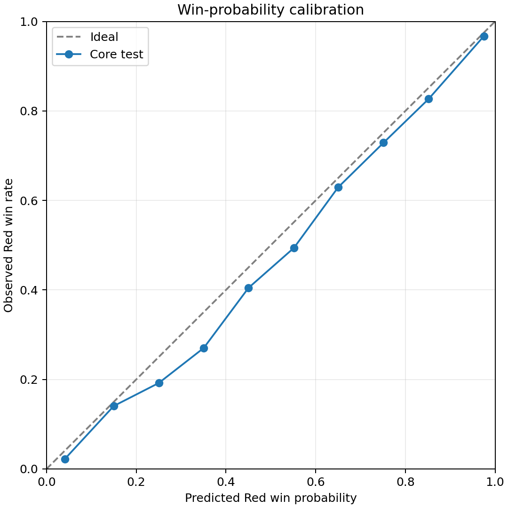
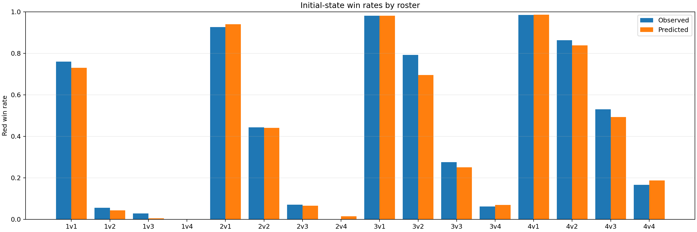
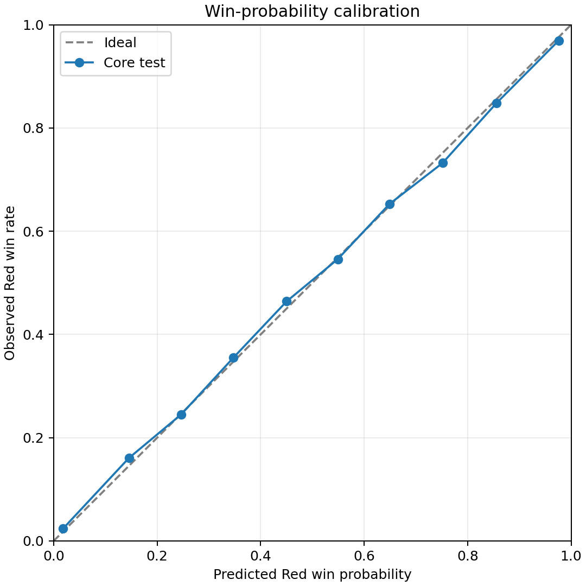

# S1/S2 与早期 Stage3 探索实验报告

归档日期：2026-09-08。本文是 v2 重构前探索的唯一正式报告。S1/S2 的局部实验与各个早期 Stage3 协议分别解释，历史高胜率不并入后续固定对手主线的性能比较。早期 Stage3 的逐局原始文件当前未找到，下述结果明确以 Git 历史文档为证据。

## 研究问题与具体方法

S1 研究能否先学会单目标、小规模局部防守，再供上层调用。采用 REFIL-QMIX-HAD 适配：实体编码与循环个体动作价值、单调团队价值混合，普通 TD 与随机实体分解辅助 TD 各占 0.5。Red 学习，Blue 使用 rush/split_rush 规则；单训练种子为 20260831。它是已有算法的场景适配，没有同协议其他局部算法的正式对照。

S2 在冻结 S1 下预测原生胜负及剩余结束时间。Red/Blue 实体集合编码与目标、时间上下文融合，输出 2×10 个联合类别，每个时间箱对应 5 个物理步；对时间维求和得到胜率。第一轮目标包含联合交叉熵、结局 BCE 和归一化时间 Huber；后续身份接口对齐版进一步明确指定身份组合，加入人数表面的单调性／边际收益结构正则，并在验证选模后使用独立校准集做温度与底层风格修正。具体数据与结果按两次运行分别列在 S2 节，这些结构约束不保证任意新身份组合都满足相同规律。

## S1 原始方案与实现细节

本节以成功的第一轮 1M 运行为对象。原 `stage1/summary.json`（已归并为 `training_summary.json`）记录训练源码提交为 **`77e7ada9696cca98ee994a9b92de299108ff3b0e`**，当时工作树 clean；训练结果在 `f8009fe` 中完整保存。配置以该 summary 的 **`arguments` 与实际执行函数**共同确定：旧 `configs/stage1_had_reproduction.yaml` 属于更早的多算法／行为克隆方案，不能作为这次成功训练的配置。共用命令行中虽保留 `encoder_kind=deepset` 默认字段，`run_refil_round()` 实际明确构造的是 `encoder_kind="refil"`。

### 局部任务、物理动作与胜负定义

S1 的任务是让 Red 防守 **一个目标**。初始人数跨回合变化，回合内有效人数随伤亡减少；训练只包含 **2v1、3v1、3v2、4v1、4v2、4v3** 六种人数占优组合。目标每局在 `x∈[-2300,-1900]、y∈[-1200,1200]、z∈[50,300]` 随机生成，Red 和 Blue 从分离区域出生。每回合最多 **50 个物理步**：目标被毁为失败，Blue 全部被消灭为成功；到时限仍未终止且目标保存，也记作防守成功。因此这里的胜率是有限时域的目标防守成功率。

网络每步为每个 Red 输出 **27 个离散加速度动作**的 Q 值：一个零向量，以及 `{-1,0,1}³` 中其余 26 个方向归一化后的单位向量。HAD 再乘以单位自身的最大加速度推进状态；死亡单位只允许零动作。这不是人工定义的“追击／拦截／攻击某目标”动作库。开火由历史 HAD 原生机制触发，攻击单位开火后自毁；网络学习如何通过运动配合这一机制。

Blue 每局等概率选择 `rush` 或 `split_rush`。前者朝目标加速，后者朝目标的不同横向偏置位置加速，第 `i` 个单位的偏置为 `(i−(n−1)/2)×180`，再量化到同一套加速度方向。该 S1 没有训练 Blue，没有自博弈／PSRO 对手池，也没有上层的身份分配或多目标动态重分组。

### 实体输入与网络结构

所有 Red 单位、所有受训规模共享一套网络参数，每个单位保留自己的循环隐藏状态。回合开始时清空记忆；实体和单位 mask 处理死亡及批内补位。

| 输入 | 维度 | 实际内容 |
|---|---:|---|
| 每行相对实体特征 | 12 | 相对位置 3、相对速度 3、归一化生命值、存活、同方／敌方／目标／自身 4 个关系标记 |
| 自身特征 | 10 | 归一化绝对位置 3、速度 3、生命值、双方存活数的 `log1p`、目标存活 |
| 任务特征 | 7 | 目标相对位置 3、目标生命比例、目标存活、角色符号、归一化剩余时域 |
| 上一步动作 | 27 | one-hot；回合初始全零 |
| 训练混合器的全局实体行 | 12 | 绝对位置 3、速度 3、生命值、存活、Red／Blue／目标 3 个类型标记、剩余时域 |

个体实体表包含世界中的 Red、Blue 和目标，屏蔽死亡实体与补位；全局状态保留死亡实体的实际行，通过生命值／存活标记表示死亡，只屏蔽补位。**策略输入没有按传感器距离裁剪**，所有存活实体均可进入实体表。因此，个体执行不需要团队混合器，并不意味着该实验只使用有限视距信息。



上图是依据历史源码补写的结构示意，实验实测图见下一节。实体编码器以共享两层 MLP 将每行 12 维编码为 128 维，由自身＋任务的 17 维特征产生 query，做 4 头交叉注意力。query 与注意力输出相加，经 LayerNorm、线性层和 ReLU 形成 128 维上下文。拼接后的 172 维输入经线性层及 ReLU 变为 64 维，再由 64 维 GRUCell 和线性动作头输出 27 个 Q 值。HAD 没有提供“实体目标动作”索引，实际走的是固定 27 动作头。

训练使用 `EntityAttentionFlexMixer`：各单位的自身／任务 query 从全局实体状态取得首层混合权重，另一个学习到的全局 query 产生偏置、末层权重与状态价值。混合隐藏宽度 **32**，注意力及超网络宽度 **128**；首末层权重以 **softmax** 保持非负，中间使用 ELU，满足 `∂Q_tot/∂Q_i ≥ 0`。有效单位贡献相加，**这套混合器不再除以存活人数**。参数量记录为 **302,749**。同文件内另一套 `EntityMonotonicMixer` 的均值缩放与 softplus 不属于本次 REFIL 分支。

### 团队奖励与 REFIL 训练目标

学习使用共享团队奖励，而非直接相加 HAD 原生的其他个体奖励：

$$
r_t^{Red}=r_t^{terminal}+0.5\,[0.99\Phi(s_{t+1})-\Phi(s_t)],
\qquad r_t^{Blue}=-r_t^{Red}.
$$

终局成功／失败分别为 `+1/−1`，非终局为 0；终局或超时后令下一状态势函数为 0。历史势函数为：

$$
\Phi(s)=h_T+0.25(\bar h_R-\bar h_B)
+0.5\frac{d_{B,T}}D-0.25\frac{d_{R,B}}D.
$$

`h_T` 为目标生命比例；双方平均生命值以初始阵容人数为分母；`D` 为世界对角线长。`d_{B,T}` 是存活 Blue 到目标的最近距离，`d_{R,B}` 是存活 Red 与 Blue 间的最近距离，相关存活集合为空时归一化距离取 1。势函数为目标保存、接近拦截等过程提供密集信号。报告中的成功率始终依据原生 `outcome_red`，不是根据塑形回报正负判胜。

基本损失采用 **一步 Double Q TD**：在线网络选下一动作，目标网络估计该动作价值，折扣 `γ=0.99`，`TD(λ)` 的 `λ=0`。从回合初始隐藏状态展开整条序列，以 `filled` 掩码排除填充时间步：

$$
a_i^*=\arg\max_a Q_i(\tau_{i,t+1},a;\theta),
$$

$$
y_t=r_t+\gamma(1-d_t)\operatorname{Mix}_{\theta^-}
\left(s_{t+1},\{Q_i(\tau_{i,t+1},a_i^*;\theta^-)\}_i\right),
\qquad
L=0.5L_{TD}+0.5L_{imagine}.
$$

其中 `τ_i` 表示该单位的观测与动作历史；下一动作由各单位独立取 argmax，再用目标网络和目标混合器估值，`d_t` 为终止标记。

辅助分支对每个训练回合先采 `p∼Uniform(0,1)`，再按 Bernoulli(p) 将实体随机划为两组，划分在该回合整条序列中保持不变。对每个单位分别构造“与自身同组”和“与自身异组”的可见实体集合，用共享个体网络重新展开两条循环序列，并以相应注意力混合得到想象团队价值。完整分支与辅助分支拟合**同一个真实一步 TD 目标**。随机分解只用于辅助训练，不生成新的物理轨迹，也不是实际的 S3 分组动作。验证和部署使用完整实体输入的普通 Q 分支。

### 课程学习与实际优化设置

| 累计物理步阶段 | 规模采样方式 |
|---|---|
| 0～100,000 | 仅 2v1 |
| 100,000～250,000 | 2v1、3v1、3v2 均匀 |
| 250,000～400,000 | 全部六种规模均匀 |
| 400,000～850,000 | 全部六种规模按学习进展自适应采样 |
| 850,000～1,000,000 | 全部六种规模重新均匀 |

自适应阶段每 **10,000 物理步**更新采样概率。对每种规模保留最近 100 个回合平均绝对 TD 误差样本，前后各 50 个窗口计算 `g_k=|log(mean_old+1e−6)−log(mean_new+1e−6)|`；以 **70% 归一化进展分数＋30% 均匀分布**形成概率，单规模上限 **0.4**，超额重新分配。样本不足时退回均匀。这里的 50 是回合 TD 样本数，不是物理步；自适应的是新回合的规模选择，回放仍为均匀抽样。

| 项目 | 实际执行值 |
|---|---|
| 训练种子 | `20260831`，1 个 |
| 同批采集 | 8 个独立 HAD 世界，物理逐个推进，活跃单位网络前向合批到 GPU |
| 回放与学习批量 | 容量 5,000 个完整回合；每批均匀、无放回抽取 32 回合 |
| 更新比例 | 回放达到 32 回合后，每收集 1 回合对应 1 次学习；每批 8 回合结束后集中更新 8 次 |
| 优化器 | RMSprop，学习率 `5e−4`，alpha `0.99`，eps `1e−5` |
| 梯度与目标网络 | 梯度范数上限 10；每 200 learner step 硬更新目标网络 |
| 探索 | ε 从 1.0 在前 500,000 物理步线性降到 0.05，之后保持 |
| 验证 | 每约 50,000 物理步，6 规模×2 对手×10 局＝120 局，ε=0 |
| 选模与测试 | 固定验证种子基数 `28260831`；独立测试基数 `38260831`，每单元 100 局 |
| 行为克隆 | 演示回合数 0，REFIL 路径没有 BC 预训练 |

8 个世界并非 8 个物理进程；物理步按各回合实际长度累计，采集批次完整收尾使实跑略超过 1M 预算。前 24 回合尚未开始更新，因此 41,072 个回合对应 41,048 次学习更新。15.06 小时来自原始运行计时，包含循环内验证及最终 heldout，不是纯梯度更新时间。

### 原实现定位与后续继承

以下路径均相对于 `77e7ada:Open-SCORE/src/`，用于查阅历史实现；当前精简接口不提供该训练入口。

| 历史文件与入口 | 对应实现 |
|---|---|
| `open_score/envs/had_stage1.py`：`observe`、`_entity_features`、`_self_features`、`_task_features`、`_state_features`、`_potential`、`step` | 输入、掩码、动作适配、奖励和 50 步边界 |
| `open_score/stage1/entity_qmix.py`：`SingleAgentQueryAttentionEncoder`、`VariableEntityAgent`、`EntityAttentionFlexMixer`、`VariableScaleQMIX` | 实体注意力、循环动作 Q、单调混合器与分解可见性 |
| `open_score/stage1/learner.py`：`train_batch`、`_unroll_agent` | 一步 Double Q、序列展开及 REFIL 辅助损失 |
| `open_score/stage1/curriculum.py`：`StepLearningProgressCurriculum` | 五阶段规模课程与学习进展概率 |
| `open_score/stage1/refil_protocol.py`：`run_refil_round` | 真实模型构造、采集／学习循环、选模与独立测试 |
| `open_score/stage1/runner.py`、`replay.py` | 两类 Blue 规则、合批采集、完整回合回放 |
| `HAD_Env/env/env.py`、`HAD_Env/agents/attack.py` | 原生终止与开火／自毁机制 |

例如 `git show 77e7ada:Open-SCORE/src/open_score/stage1/refil_protocol.py` 可直接查看训练入口。`77e7ada` 到 `f8009fe` 的 S1 改动只是在环境和 runner 中新增并传递 `allow_unregistered_roster` 门控；核心网络、learner、课程及 REFIL 训练流程相同。后来的压力测试显式解禁训练外人数，使用原冻结权重，没有微调。

后续继承的局部执行器为 [lcl.pt](../Open-SCORE/assets/frozen/lcl.pt)，其架构与训练种子记录在 [冻结资产清单](../Open-SCORE/assets/frozen/manifest.json)。它对应下节的验证选优权重；历史 summary 还记录了最终权重路径，但该旧路径不代表当前仍保留一份可用的最终模型。

## S1 实际执行与结果

训练共 **1,000,123 物理步、41,072 回合、41,048 次学习更新**，历史用时 54,217.89 秒（约 15.06 小时）。初始验证为 **35/120（29.17%）**，选优模型验证为 **98/120（81.67%）**；该模型在独立测试中成功 **985/1,200 局（82.08%）**，平均回合长度 19.98 步。被后续研究冻结使用的模型来自 **950,120 步、38,688 回合、38,664 次学习更新**。

这里的“选优”按最差规模×对手单元的平均原生收益优先、总体平均原生收益次之进行字典序比较，不能简单理解为挑选总体胜率最高的一次。最后一个检查点的验证为 **95/120（79.17%）**；它与用于独立测试的选优模型分别记录。

| 训练支持内规模 | rush（100 局） | split_rush（100 局） | 合并成功数／局数 | 合并胜率 | 历史 95% 区间 |
|---|---:|---:|---:|---:|---:|
| 2v1 | 93.0% | 91.0% | 184/200 | 92.0% | 87.4%～95.0% |
| 3v1 | 95.0% | 96.0% | 191/200 | 95.5% | 91.7%～97.6% |
| 3v2 | 74.0% | 66.0% | 140/200 | 70.0% | 63.3%～75.9% |
| 4v1 | 96.0% | 97.0% | 193/200 | 96.5% | 93.0%～98.3% |
| 4v2 | 88.0% | 80.0% | 168/200 | 84.0% | 78.3%～88.4% |
| 4v3 | 55.0% | 54.0% | 109/200 | 54.5% | 47.6%～61.3% |


图 S1-1：历史原图，来自 `f8009fe:Open-SCORE/outputs/round_01_mvp/figures/01_stage1_training_curve.png`。蓝线为固定 120 局验证胜率，橙线为最近 200 个训练回合的胜率，粉线使用右轴表示 REFIL 损失；训练中有探索且课程配比变化，因此橙线与蓝线的评估分布不同。对应原始 CSV 已保存在 [S1 数据库](../Open-SCORE/outputs/s1_s2/s1/data.sqlite) 的 `blobs` 表，键为 `sources/historical_s1_s2/s1/training_curves.csv`，共 21 个记录点。曲线显示约 40 万步后总体改善，也保留了前期下降与后期波动。

| 原始曲线节点（物理步） | 已完成回合 | 验证胜率 | 说明 |
|---:|---:|---:|---|
| 0 | 0 | 29.17% | 随机初始化参照 |
| 950,120 | 38,688 | 81.67% | 验证选优，独立测试使用此模型 |
| 1,000,123 | 41,072 | 79.17% | 最终训练节点 |



图 S1-2：历史原图，来自同提交的 `figures/02_stage1_scale_win_rates.png`；对应 `blobs` 键为 `sources/historical_s1_s2/s1/test_win_rate_by_scale.csv`。上表成功数由原始测试记录汇总，区间沿用原 CSV 的 Wilson 95% 区间；它反映本次固定模型的测试抽样不确定性，不代表多个训练种子的波动。逐局 `scale/opponent/seed/red_win/episode_length` 保存在 `metadata` 键 `historical_s1_s2/s1/test_summary.json` 的 `episode_records` 中。

历史训练外压力测试没有微调，共 **1,000 局**，每规模×对手 100 局，测试种子基数为 `48260831`，与正式测试基数 `38260831` 分开：

| 规模 | rush | split_rush | 合并胜率 |
|---|---:|---:|---:|
| 2v2 | 56.0% | 44.0% | 50.0% |
| 3v3 | 41.0% | 36.0% | 38.5% |
| 5v2 | 83.0% | 80.0% | 81.5% |
| 5v3 | 62.0% | 67.0% | 64.5% |
| 6v3 | 73.0% | 69.0% | 71.0% |

本次从 `f8009fe:Open-SCORE/outputs/round_01_mvp/evaluation_unseen_scales/episodes.csv` 找回了全部 1,000 条逐局结果，存入同一 S1 库的 `blobs` 键 `sources/round_01_mvp/s1/unseen_episodes.csv`；对应分规模原始 CSV 为 `sources/round_01_mvp/s1/unseen_win_rate_by_scale.csv`。这些结果不构成双目标、大规模、等人数动态分组任务的能力证明。

S1 值得作为阶段性成果保留的证据，是同一组权重完成课程训练、经过独立种子测试，并在六种受训人数规模上提供了可复核的结果。其薄弱点也很具体：训练内 4v3 仅 54.5%，训练外等人数 3v3 仅 38.5%。目前没有同预算 QMIX、VDN 等算法正式对照或多个 S1 训练种子结果，因此无法把提升单独归因于 REFIL 辅助分解、课程学习或某一奖励项。

## S2 实际执行与结果

### 第一轮联合胜负／时间模型：本次找回的原始证据

Git `f8009fe` 中完整保留了 **2026-09-01 第一轮 S2** 的指标、训练记录、评估预测与四张原图。这次运行有 **10,020 局、50,826 状态**，与下节为身份接口重新对齐的 **19,200 局、101,366 状态** 属于不同运行。两次都使用冻结 S1，但不能互换数据集、模型或图注。

第一轮输入为目标状态 8 维、Red/Blue 各自的变长 9 维实体表和 5 维上下文，批内填充并用 mask 排除补位；通过 Deep Sets 集合编码输出胜负×时间的 20 类联合分布。模型参数量 58,708，实际运行 51 epoch，验证选择 epoch 33，温度参数 1.273。核心规模每局权重 1.0，低权重扩展规模每局 0.25；5v1、6v3、7v3 为完全留出规模，不进入训练与选模。每局权重均分到该局保存的状态，避免较长回合仅因状态数更多而占更大权重。

| 第一轮 S2 测试集合 | 回合数 | 预测状态数 | Brier↓ | AUC↑ | 剩余时间 MAE（步）↓ |
|---|---:|---:|---:|---:|---:|
| 核心规模 test | 1,080 | 5,361 | 0.1127 | 0.9107 | 3.47 |
| 低权重扩展 test | 288 | 1,662 | 0.1634 | 0.8475 | 3.93 |
| 完全留出规模 generalization | 900 | 4,326 | 0.1134 | 0.8576 | 3.25 |

本表直接摘录原 `metrics.json` 的 `group_metrics`；核心常数胜率基线 Brier 为 0.2210，中位剩余时间基线 MAE 为 7.11 步。全部 **11,349 条评估状态预测**已从原 `evaluation_predictions.csv` 恢复；它们是原有评估输出，包含回合 ID、规模、对手、状态步数、真实胜负和剩余时间、预测概率与时间，未包含完整环境实体状态。


图 S2-1：第一轮原始训练曲线，原路径为 `f8009fe:Open-SCORE/outputs/round_01_mvp/stage2/final/figures/01_training_curves.png`。训练历史共 51 个 epoch，最佳模型来自第 33 个 epoch；不能将图中的训练末点当作测试选模点。



图 S2-2：第一轮原始分规模观测与预测胜率，包含核心、低权重扩展和完全留出规模。保留原图口径：`f8009fe:Open-SCORE/scripts/run_round01_stage2.py` 的 `_metrics()` 筛选 `step=0` 后，仍用各状态的 `evaluation_weight` 加权。因此不能将任一柱高直接乘以表中回合数当成整数成功局数；本图也不是 S1 独立 1,200 局的分规模胜率。



图 S2-3：本次找回的分规模剩余时间 MAE 原图，原文件 `03_all_scale_time_mae.png`。它补充了胜率图没有表达的时间预测误差，纵轴单位为物理步。



图 S2-4：第一轮核心测试集原始校准图。以上四图均按 Git 原文件恢复，文件名加 `round01_` 以区分运行；没有重新生成曲线。数据在 [S2 数据库](../Open-SCORE/outputs/s1_s2/s2/data.sqlite) 中：`metadata` 键 `round_01_mvp/s2/metrics.json`、`round_01_mvp/s2/dataset_manifest.json`；`blobs` 键 `sources/round_01_mvp/s2/training_history.csv` 与 `sources/round_01_mvp/s2/evaluation_predictions.csv`。

### 后续身份接口对齐的局部模型

这次历史数据共 **19,200 局、101,366 状态**，覆盖双方各 1～4 人，按回合划分为训练 12,480 局、验证 1,920 局、校准 1,920 局、测试 2,880 局。预测标签来自冻结控制器实际走过的局部轨迹；保存的命令事件和人数变化会重置控制器记忆，没有完整的新分组反事实支持。

| 测试切片 | Brier↓ | ECE↓ | 时间 MAE（物理步）↓ |
|---|---:|---:|---:|
| 全部状态 | 0.0757 | 0.0073 | 2.69 |
| 初始状态 | 0.0839 | 0.0183 | 3.24 |
| 轨迹状态 | 0.0733 | 0.0083 | 2.53 |
| 训练集常数胜率／中位时间 | 0.2425 | — | 6.90 |

| 困难配比 | Brier↓ | ECE↓ | 时间 MAE↓ |
|---|---:|---:|---:|
| 2v2 | 0.2479 | 0.1002 | 4.47 |
| 4v3 | 0.2387 | 0.0866 | 3.95 |
| 3v3 | 0.2019 | 0.0427 | 3.80 |
| 3v2 | 0.1720 | 0.1154 | 4.86 |


图 S2-5：后续身份对齐运行的历史原图，来源 `f1cdc06:Open-SCORE/outputs/stage123_unknown_upper_v1/figures/stage2_01_training_curves.png`。横轴为 60 个训练 epoch；训练损失持续下降，但验证 Brier 后段反弹，时间误差趋于平台，不能据训练损失下降推断测试持续改善。



图 S2-6：同一次身份对齐运行的 1v1～4v4 初始状态胜率对照；展示初始观测与预测是否相符，不表示所有轨迹状态或新分组动作的价值排序。



图 S2-7：同一次身份对齐运行的历史概率校准图，配合上表 Brier/ECE 阅读。现有 `dataset_manifest.json` 可以核实数据规模、切分与控制器重置语义；本次在可读取 Git 历史中未找到这次运行的完整逐状态预测 CSV 或 `metrics.json`，因此上表数值仍以 `f1cdc06` 历史正式报告为来源，不能用第一轮恢复出的 11,349 条预测替代。

原目录的另一份同名义训练曲线文件仍原位保留，报告只引用一次。总体校准较好不等于困难单元、共享物理世界或重新编组后的排序可靠。

## 早期 Stage3：已废弃协议下的探索

这些尝试研究身份分配、联盟搜索、未知上层策略推断和短程／多步响应。它们共用冻结局部组件，但动作限制、Blue 类型库、信息权限与评价预算多次改变。内部“Bayesian v3”是旧协议修订号，**不是后续根版本 v3**。

### 身份分配与 SALDAE

Identity 将具体成员分给目标／小组，使用局部 S2 代理评价身份方案；SALDAE 尝试以联盟结构搜索替代当时的 MILP 求解。结果只支持对应旧协议：

| 尝试 | 实际样本 | 方法 | 对照 | 配对差及区间 |
|---|---|---:|---:|---|
| Identity | 180 局 | 36.7% | 均分 50.0% | −13.3 pp；[−28.3, 1.7] |
| SALDAE 求解器 | 60 局、30 对 | 43.3% | MILP 36.7% | +6.7 pp；[−10.0, 23.3] |

Identity 中读取当前完整 Blue 分组的参照为 65.0%，具有额外信息权限，不能与纯观测方法视为相同输入条件。两项主比较均没有明确正优势证据。

### 匿名人数 Bayesian 协议

将上层动作缩为人数分配，对隐藏 Blue 类型／分配维护 Bayesian 信念，再以局部收益与人数博弈生成响应。旧设置使用不同 S2、局部人数上限、无后备队及旧 Blue 类型库；不与身份协议合并。

| 角色 | 合并成功率 |
|---|---:|
| 读取目标人数的知情参照 | 56.9% |
| 人数博弈 | 38.5% |
| ETA 贪心 | 28.9% |
| 固定小组规则 | 63.1% |
| 局部预测贪心 | 30.7% |
| 均分 | 33.7% |

固定小组规则优于该次人数博弈和局部预测决策。此处百分比来自历史报告，不补造当前不可读取的逐局分子分母。

### BA-DIB／QOM 学习推断与多步规划

框架从公开运动推断整局固定的隐藏上层规则。显式类型方法维护规则类型与当前隐藏动作的粒子权重；QOM 路线用实体轨迹编码、GRU 和 8 个量化潜码（潜变量维度 32）预测目标分配与同组关系。在线只使用可见前缀。QOM-MCP 再做两层宏事件 PUCT，每次决策 32 次模拟、每节点最多 8 个 Red 候选；五步物理分支与 S2 风险参与排序。

长跑已停止，历史报告保留 **160 条结果**，其中只有一个完整的八方法×十种子条件：主方法成功 **6/10**，知情多步参照 **10/10**；平均决策耗时分别 **25.17 秒、15.32 秒**。不能据此宣称接近知情参照或完成完整比较。

独立 QOM 训练 40 epoch，验证选优 epoch 36；360 条独立探测轨迹、9,270 个公开转移上，当前分配 F1 为 **0.5109**，下一动作预测 F1 为 **0.4533**，同组关系 F1 为 **0.2649**。推断误差与高规划成本是实际负结果，未被后续高胜率表覆盖掉。

### 六方法同场景快速比较

随后用公开运动进行显式轨迹推断，比较短期响应与再模拟一次新运动后重分组；不重新训练 QOM。共 **720 局，每方法 120 局**：

| 方法 | 成功率 |
|---|---:|
| 均分 | 27.5% |
| 保持旧分组 | 42.5% |
| 轨迹推断＋短期响应 | 50.0% |
| 轨迹推断＋二次调整 | 66.7% |
| 知情短期参照 | 67.5% |
| 知情二次调整参照 | 60.0% |

旧稿认为方案二通过当时门槛。该判断仅属于废弃协议、有限候选与可等待仿真的条件，不证明后续固定对手研究主线成立，也不改变前述学习推断失败的记录。

## 文献、来源与适配边界

| 文献／来源 | 实际借用内容 |
|---|---|
| [QMIX（ICML 2018）](https://proceedings.mlr.press/v80/rashid18a.html)；[扩展论文（JMLR 2020）](https://jmlr.org/papers/v21/20-081.html) | 个体 Q 与单调团队价值混合；HAD 场景适配 |
| [Iqbal 等：Randomized Entity-Wise Factorization for Multi-Agent Reinforcement Learning（ICML 2021）](https://proceedings.mlr.press/v139/iqbal21a.html) | REFIL 实体表示与随机分解辅助训练；未声称完整复现原论文实验 |
| [Deep Sets](https://proceedings.neurips.cc/paper/2017/hash/f22e4747da1aa27e363d86d40ff442fe-Abstract.html)；[On Calibration of Modern Neural Networks](https://proceedings.mlr.press/v70/guo17a.html) | S2 集合编码与温度校准；联合胜负／时间建模为项目适配 |
| [SALDAE](https://arxiv.org/abs/2502.10226) | 旧联盟结构搜索消融；不继承未经本任务验证的性能结论 |
| [QOM](https://proceedings.neurips.cc/paper_files/paper/2025/hash/24f10950306c98815e70ff2e41a9c5d1-Abstract-Conference.html)；[POTMMCP](https://arxiv.org/abs/2306.06067) | 量化轨迹、类型信念与 Monte Carlo 响应规划；未复现原 QOM 的完整训练和元策略系统 |
| [Deep BPR+](https://proceedings.neurips.cc/paper/2018/hash/85422afb467e9456013a2a51d4dff702-Abstract.html)；[OMIS](https://proceedings.neurips.cc/paper_files/paper/2024/hash/710445227fa8c1b6a9ceada902dd4741-Abstract-Conference.html) | 对手推断路线的相关工作，不是本实验已逐一实现的比较臂 |

引文恢复自 Git `f8009fe:Open-SCORE/paper/references.bib` 与 `f1cdc06` 的方法／协议文档。作者实现来源曾记录为 `oxwhirl/pymarl`、`shariqiqbal2810/REFIL`。

## 结论与证据位置

局部 S1/S2 在原训练支持内产生了可用控制与预测，但没有证明可直接迁移到后续大规模动态分组；早期 Stage3 同时包含负结果、有限正结果与中止任务。整条研究路线的结束决定不要求把这些不同结果改写成同一结论。

配置和归并证据见 [配置快照](../Open-SCORE/outputs/s1_s2/config.json)、[S1 数据](../Open-SCORE/outputs/s1_s2/s1/data.sqlite)、[S2 数据](../Open-SCORE/outputs/s1_s2/s2/data.sqlite)、[共享归档](../Open-SCORE/outputs/s1_s2/shared/data.sqlite)。历史冻结权重见 [资产清单](../Open-SCORE/assets/frozen/manifest.json)。数据仍按方法归并在同一个版本输出目录，以下键区分原始运行，不新增独立方法报告。

| 可复核证据 | 原始 Git 来源 | 当前保存位置与范围 |
|---|---|---|
| S1 实际训练参数、验证与独立测试 | `f8009fe:Open-SCORE/outputs/round_01_mvp/stage1/summary.json`、`evaluation/summary.json` | S1 库 `metadata` 的 `historical_s1_s2/s1/training_summary.json` 和 `historical_s1_s2/s1/test_summary.json`；后者含完整 1,200 条逐局结果 |
| S1 学习曲线与分规模统计 | 同提交 `stage1/training_curves.csv`、`evaluation/win_rate_by_scale.csv` | S1 库既有 `blobs`；21 个训练记录点、6 个正式测试规模单元 |
| S1 训练外测试 | 同提交 `evaluation_unseen_scales/episodes.csv`、`win_rate_by_scale.csv` | 本次补回 S1 库 `sources/round_01_mvp/s1/` 前缀下的两个 CSV，1,000 条逐局结果、5 个规模单元 |
| 第一轮 S2 配置、指标与数据清单 | 同提交 `configs/stage2_round01_final.yaml`（相对 `Open-SCORE/`），以及 `stage2/final/model/metrics.json`、`stage2/final/data/dataset_manifest.json` | 本次补回 S2 库；`round_01_mvp/s2/` 标识第一轮，含训练 51 epoch 的记录及三类测试切片 |
| 第一轮 S2 训练与预测原 CSV | 同提交 `stage2/final/model/training_history.csv`、`evaluation_predictions.csv` | 本次补回 S2 库 `sources/round_01_mvp/s2/` 前缀下的两个 CSV；51 条训练记录、11,349 条评估状态预测 |
| 身份对齐 S2 的数据清单与图表 | `f1cdc06:Open-SCORE/outputs/stage123_unknown_upper_v1/` | S2 库既有 `historical_s1_s2/s2/dataset_manifest.json` 和三张被引用原图；这次运行的完整预测文件仍缺失 |

新增恢复项的原提交、原路径、目标库／表／键记录在共享库 `metadata` 的 **`report_evidence/recovered_sources.json`**。`metadata.value` 是 JSON 文本；`blobs` 保存原始文件字节，以 `codec=zlib` 压缩。例如在仓库根目录可只读查看第一轮 S2 的原始预测表，不调用模型：

```python
import csv, io, sqlite3, zlib

db = sqlite3.connect(
    "file:Open-SCORE/outputs/s1_s2/s2/data.sqlite?mode=ro", uri=True
)
key = "sources/round_01_mvp/s2/evaluation_predictions.csv"
codec, data = db.execute(
    "SELECT codec, data FROM blobs WHERE key = ?", (key,)
).fetchone()
db.close()
raw = zlib.decompress(data) if codec == "zlib" else data
rows = list(csv.DictReader(io.StringIO(raw.decode("utf-8"))))
print(len(rows), rows[0])  # 历史 11,349 条预测及第一条记录
```

这次恢复的是已完成实验的文件和统计，并未补造原始环境轨迹。第一轮 S2 的完整训练实体状态、后续身份对齐 S2 的完整预测记录，以及早期 Stage3 逐局文件，不能因为报告中已有汇总表就视为已全部找回。

早期 Stage3 结果来源为 `f1cdc06:Open-SCORE/outputs/stage123_unknown_upper_v1/experiment_report.md`；方法来自同提交 `Open-SCORE/docs/` 下的 `07_MVP完整方法_S1-S3.md`、`08_S3实验执行与分析协议.md` 和 `11_Stage3两方案快速验证.md`。本次未重跑训练或评估；恢复范围仅为历史图表、数据及必要配置，旧研究源码通过 Git 定位查阅。
