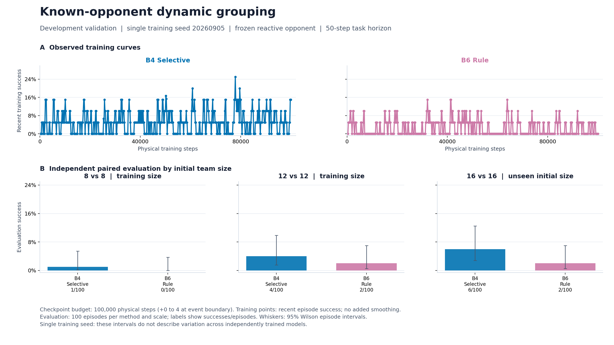
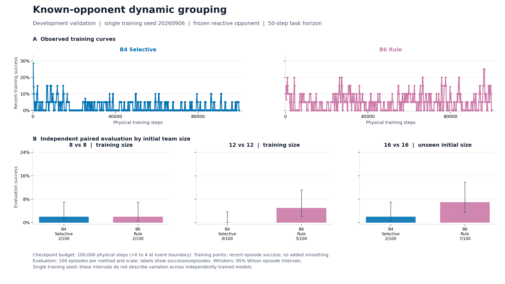
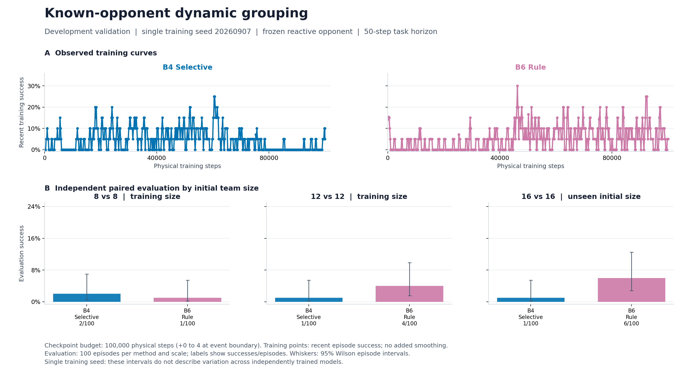

# v2：冻结学习底层上的选择释放与重建

实验日期：2026-09-05—09-06；归档日期：2026-09-08。正式结果已结束，本次只整理历史。v2 之前的身份分配、匿名 Bayesian 与未知上层推断统一见 [S1/S2 与早期 Stage3 报告](实验报告_s1_s2.md)。

## 研究问题与具体方法

问题是：保留已训练的局部执行器后，学习“哪些成员需要重新分组”是否优于手工规则释放？Red 底层 REFIL-QMIX 和 Blue reactive 规则冻结；双目标、最多 50 物理步，每 5 步或非终止减员事件产生一次上层决策。每个活成员恰好属于一个 1～4 人组或后备；共享物理世界中的跨组作用仍存在。

主方法 B4 selective 用两层、128 维、4 头注意力编码实体和旧组，依次选择待释放身份或 STOP；之后自回归选择加入未满组、新建带目标组或进入后备，最后一次性提交完整合法编组。未释放成员保留关系。PPO 使用释放和重建整条轨迹的联合 log-prob，不按释放人数平均；固定强制释放和外生随机顺序不计入学习概率。成功终局奖励 1，其他为 0，gamma=1，GAE 按宏事件计算。

B6 rule 按受损组／邻近关系释放成员，共用同样的学习重建器。因此本实验是**学习释放与规则释放的对照**，B6 并非整个系统不学习的纯规则方法。

### 一次上层决策的实现

历史 `GroupingPolicy.act` 将动作拆为“选人—重建—提交”，但环境只接收最后的完整 `Grouping`。初始部署强制释放所有活成员；后续 B4 从尚未选择的活成员与 STOP 构成的分类分布中依次采样，STOP 可以立即结束，也允许释放全部成员。随后从旧组中移除已释放成员，依照记录的释放顺序，将每人放入未满的现有组、新建的目标组或后备。释放成员可以回到原组，所以“释放比例”与实际目标／队友关系变化必须分别统计。

`evaluate_action` 在 PPO 更新时重放同一条记录，逐步恢复每个前缀下的合法动作掩码，并累加选择和重建概率；它不会重新采样一条动作。最终校验成员不重复、不遗漏、目标有效及组容量不超过 4，再交给冻结下层执行。网络输入包含公开实体、旧组关系、每名 Red 的下层循环记忆和上一动作；身份编号只用于追踪成员，不作为连续数值特征输入。对应历史代码为 Git `cc2ab86:Open-SCORE/src/open_score/grouping/policy.py` 的 `act`、`_repair` 和 `evaluate_action`。

实际运行的 `manifest.json` 记录 PPO 学习率 **3e-4**、每批 **64 个上层事件**、minibatch **16**、最多 **2 epoch**、clip **0.2**、GAE lambda **0.95**、value 系数 **0.5**、熵系数 **0**、目标 KL **0.05**。这些来自本次三种子运行的配置快照，不用后续 v3 的大批次参数替代。任务奖励为原生终局成功；原生 50 步期限算真实终局，终局不 bootstrap，采样批次恰在非终局截断时才使用下一状态价值。

历史实现还包含 B0 静态、B1 冻结 DLOM 代理候选、B2 全释放、B3 随机释放以及 B5 ALMA 风格 proposal＋动作 Q。B1 使用局部成功分数聚合，B5 使用 replay TD、在线选择／目标网络评价和当前候选赢家 NLL。它们属于实现／设计范围，不能冒充下表已完成的三种子正式对照；本版最终正式主表仅为 B4/B6。

## 实际执行与结果

训练种子为 **20260905、20260906、20260907**；每模型在约 **100,000 物理步**的统一节点评价，8/12/16 人场景各 100 局。两臂、三种子、三规模共 **1,800 次正式执行**；不同模型共用开局配对，不视为全部独立开局。没有实施早期文稿中五种子正式设计，不能以计划量替代实际量。

| 双方人数 | selective（3 种子均值） | rule（3 种子均值） |
|---:|---:|---:|
| 8 | 1.7% | 1.0% |
| 12 | 1.7% | 3.7% |
| 16 | 3.0% | 5.0% |

| 种子 | 规模 | B4 成功率 | B6 成功率 | B4−B6（百分点） | 配对回合数 |
|---:|---:|---:|---:|---:|---:|
| 20260905 | 8 | 1.0% | 0.0% | +1.0 | 100 |
| 20260905 | 12 | 4.0% | 2.0% | +2.0 | 100 |
| 20260905 | 16 | 6.0% | 2.0% | +4.0 | 100 |
| 20260906 | 8 | 2.0% | 2.0% | +0.0 | 100 |
| 20260906 | 12 | 0.0% | 5.0% | -5.0 | 100 |
| 20260906 | 16 | 2.0% | 7.0% | -5.0 | 100 |
| 20260907 | 8 | 2.0% | 1.0% | +1.0 | 100 |
| 20260907 | 12 | 1.0% | 4.0% | -3.0 | 100 |
| 20260907 | 16 | 1.0% | 6.0% | -5.0 | 100 |

模型 latest 可能超过统一评估节点，未混入上表。总体成功率低，学习释放只在部分种子／规模胜出，未形成一致优势。

## 训练与评估图

以下三张图从本版 shared 数据库的原 PNG 归档恢复，没有重跑训练或重新评价。图内 B4/B6 对应上面的 selective/rule；8/12 人标为训练规模，16 人为训练外规模。图内 Development validation 沿用原标识，本文报告的是已完成的固定 100k 对照，不将其升级为早期五种子 formal 设计。

上排是按物理步记录的近期训练成功率，未新增平滑；下排为每种方法、每规模 100 局的配对开局评价，须线为 **95% Wilson 局级区间**，不是三个训练种子间的不确定性。各图的训练成功尖峰不能替代下排独立开局结果。

图 1：20260905 的 B4 在三个规模分别成功 1、4、6 局，B6 为 0、2、2 局；这是 B4 表现较好的一个种子。

图 2：20260906 的 B4 为 2、0、2 局，B6 为 2、5、7 局；12/16 人场景没有延续前一种子的优势。

图 3：20260907 的 B4 为 2、1、1 局，B6 为 1、4、6 局。三张原图共同支撑“尚无一致优势”的结论。

### 原图与原始数据对应

三张图的原始 PNG 及 `results.csv` 都保存在[共享数据库](../Open-SCORE/outputs/v2/shared/data.sqlite)的 `blobs` 表中，codec 为 `zlib`。以下路径是库内原始相对路径，前加 `sources/`、后接 `training_and_evaluation.png` 或 `results.csv` 即为完整 key。逐局数据已归并入 `records` 表的 `evaluation` 流，`source` 为同一路径下的 `evaluation.jsonl`，每种子 600 条、合计 1,800 条。

| 训练种子 | 原始比较目录（库内路径） | 图与表的范围 |
|---:|---|---|
| 20260905 | `v2_parallel_100k_w3_new/reactive/seed_20260905/comparison/e5951cd26b28/` | 两臂 × 三规模 × 100 局 |
| 20260906 | `v2_parallel_100k_w3_new/reactive/seed_20260906/comparison/6640dfbd2478/` | 两臂 × 三规模 × 100 局 |
| 20260907 | `v2_parallel_100k_w3_new/reactive/seed_20260907/comparison/c008b3d37306/` | 两臂 × 三规模 × 100 局 |

训练数据与实际配置分别见 [B4 数据库](../Open-SCORE/outputs/v2/selective/data.sqlite)、[B6 数据库](../Open-SCORE/outputs/v2/rule/data.sqlite)：`records.stream='training'` 保存更新日志，`metadata` 的 `v2_parallel_100k_w3_new/reactive/seed_<seed>/<method>/manifest.json` 保存上述超参数。取数时须保留 `source_run` 或 `source` 过滤，库中早期 `v2_parallel_100k` 运行不属于主表。

## 文献及适配关系

- [Proximal Policy Optimization Algorithms](https://arxiv.org/abs/1707.06347)：上层策略优化；不保证该稀疏终局任务在十万步内收敛。
- [REFIL](https://proceedings.mlr.press/v139/iqbal21a.html) 与 [QMIX](https://proceedings.mlr.press/v80/rashid18a.html)：冻结局部执行器来源，其原分布能力不等于本版大规模能力。
- [ALMA: Hierarchical Learning for Composite Multi-Agent Tasks](https://arxiv.org/abs/2205.14205)：历史 B5 proposal／动作 Q 接口的适配来源；不是主表 B4/B6 的算法，也未在本报告声称完整复现。

## 局限、后续诊断与证据

大量更新区间缺少成功终局，十万步结果不证明所有学习预算下都失败。更具体的问题来自底层迁移：原局部模型只训练单目标、有限且通常 Red 占优的配比，本版会输入更多 Blue。后续保持权重不变、只饱和一个敌方计数字段便改变成功率；该证据在 [v3 报告](实验报告_v3.md) 单列，不能倒填成 v2 的算法收益。

历史 Windows 检查点替换曾发生执行异常，后续加入句柄关闭与替换重试；执行异常与任务失败分开。当前保留冻结模型与正式数据，旧代码由探索 final `cc2ab86` 保存。

[配置快照](../Open-SCORE/outputs/v2/config.json) 与 [共享数据](../Open-SCORE/outputs/v2/shared/data.sqlite) 保留方法归档和汇总，方法数据按原目录保留。shared 库 `blobs` 的 `sources/docs/method_v2.md`、`results_v2.md`、`runtime_audit_v2_0_1.md` 是本报告方法／执行来源；三张图原 key 含 `sources/v2_parallel_100k_w3_new/reactive/seed_<seed>/comparison/…/training_and_evaluation.png`。本次没有运行新诊断、测试或实验。
