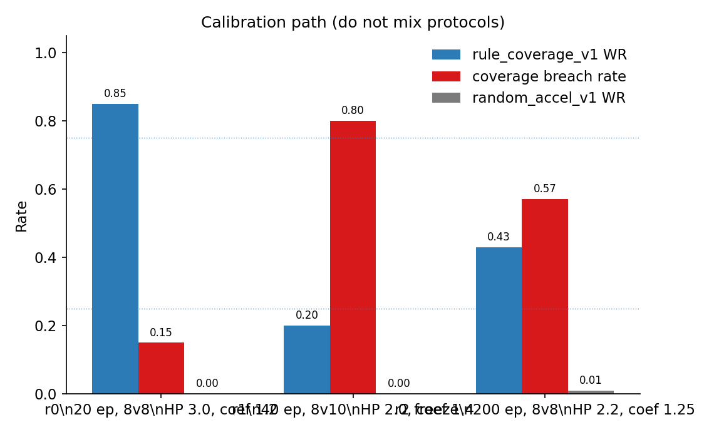
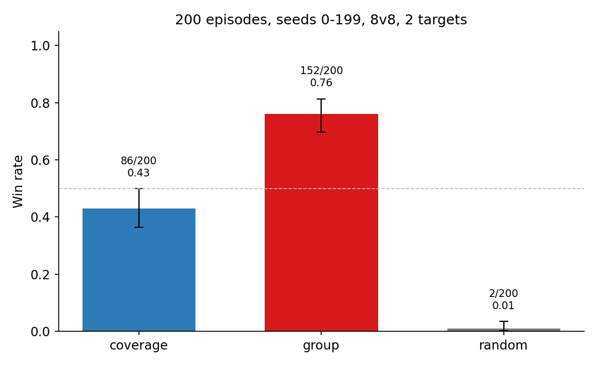
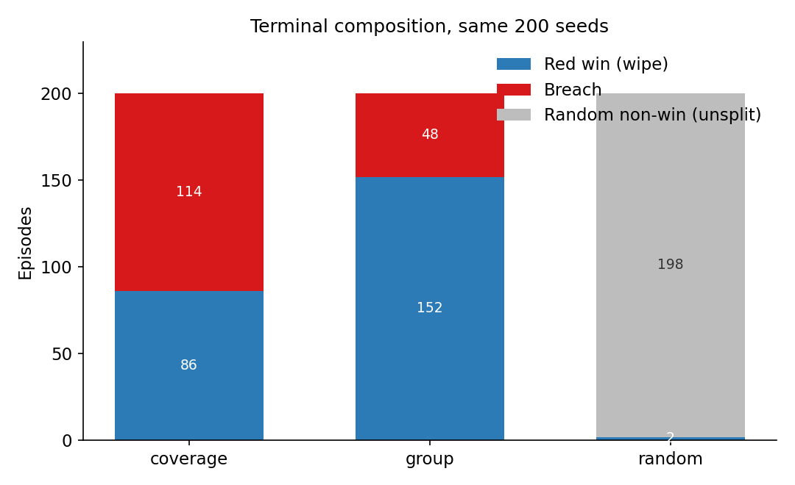

# v7：HAD 环境成熟化与覆盖式规则基线

日期：2026-09-08。物理协议 `rebuild-calibrated-v3-r2`。本报告是本轮唯一正式报告。数据与图在 `Open-SCORE/outputs/v7/`。

研究主线在 v6 停止后，本轮不训练网络。目标是把 HAD 改成可标定的 RL 仿真环境，并给出与真实物理对齐的纯规则基线 `rule_coverage_v1`。蓝方固定为 `rule_breach_v1`（`reactive` + `rush`）。

## 环境改写

引擎正确性：开火与命中同用移动前位置；自动开火改为“射程内有对应对象”；零速保持航向；边界清向外速度；碰撞扫掠且不链杀；初速度方向球面均匀；观测不再把绝对偏移套在相对量上；每步不再 `deepcopy`。

参数按转弯半径、杀伤半径、场地和时限四个比值重标定，冻结为：红 \(v\in[35,120]\)、\(a=40\)，蓝系数 1.25，满伤/归零 400/900，强度 1.2，目标 HP 2.2，碰撞 20，\(H=100\)，红方在目标环带 \([800,2200]\) 出生，高度 \(U(200,1500)\)。观测每实体 11 维。`terminated` 与 `truncated` 分离，时限默认记红胜但不写进逐步奖励。

这些改动改变仿真结果。v2–v6 胜率不可比。

## 规则

`rule_coverage_v1` 三层：重放蓝方规则并做 CPA 归类和突防过滤；D'Hondt 按覆盖需求分配人数再匈牙利解码身份；中层做杀伤半径空间-时间站位；下层用转向感知速率在 27 基元上选动作。实现见 `Open-SCORE/src/open_score/grouping/coverage_rule.py`。数学说明见 [three_layer_rule_mathematical_spec.md](../docs/three_layer_rule_mathematical_spec.md)。

交互器：仓库根目录 `viewer.py` / `viewer.html`。一次提交跑 `seed0 … seed0+S-1`，前 D 局可回放。

## 标定

用 `rule_coverage_v1` 与随机加速度对照。禁止放宽门禁。三轮参数：

| 轮 | 设置 | 规则胜率 | 失守率 | 随机胜率 | 吞吐 | 失败项 |
|---|---|---:|---:|---:|---:|---|
| r0 | 8v8，HP 3.0，蓝系数 1.2；20 局 | 0.85 | 0.15 | 0 | 84（含策略） | G1 G2 G5 G8 |
| r1 | 8v10，HP 2.0，蓝系数 1.4；40 局 | 0.20 | 0.80 | 0 | 398 | G1 G2 G5 G8 |
| r2 | 8v8，HP 2.2，蓝系数 1.25；200 局 | 0.43 | 0.57 | 0.01 | 735 | G2 |

r2 冻结。G1、G3–G9 通过。G2 要求随机加速度胜率 \(\ge 0.02\)，实测 2/200。差距来自终局稀疏：乱飞几乎清不掉突击蓝方。继续加蓝方或减目标 HP 会把 G1/G5 推出带。未放宽门禁，不声称环境已对动作空间随机探索标定合格。

几何单特征 AUC 0.68（G3 要求 \(\le 0.75\)），出生几何不再单独决定胜负。

## 200 局对照

同一批 seed 0–199，2 目标，8 红 8 蓝。

| 方法 | 胜 | 胜率 [Wilson] | 失守 | 歼灭蓝方 | 交战率 | 每火击杀 | 均步 |
|---|---:|---|---:|---:|---:|---:|---:|
| `rule_coverage_v1` | 86 | 0.43 [0.36, 0.50] | 114 | 86 | 1.00 | 1.50 | 29.7 |
| `rule_group_v1` | 152 | 0.76 [0.70, 0.81] | 48 | 152 | 1.00 | 1.41 | 28.4 |
| `random_accel_v1` | 2 | 0.01 [0.00, 0.04] | — | — | 0.69 | — | — |

覆盖规则能打、能分出结构策略与乱飞，但在本分布上低于历史 `rule_group_v1`。旧规则更积极追最近威胁；新规则过滤非突防蓝方、拉开站位并回避游荡蓝方，在红方已出生于目标环带时偏保守。这是基线事实，不是环境调参去迁就新规则。

同种子重复终局一致（G9）。

## 限制

- 未宣称覆盖规则优于旧规则。
- 随机动作几乎没有正样本；RL 冷启动需要塑形、课程或结构化探索，不能依赖稀疏终局。
- `wMax=\pi` 仍不生效；软杀伤数值近零；无友伤；侦察不进观测。
- 局部价值网络未做：`restore` 不能改编制。
- 网页交互器需本机 `python viewer.py`，依赖真实 `had-env`。

## 结论

环境完成正确性修复、参数重标定和接口成熟化，并冻结为 `rebuild-calibrated-v3-r2`。`rule_coverage_v1` 是可运行、可回放的纯规则基线，200 局胜率 0.43；同一环境上 `rule_group_v1` 为 0.76。除随机加速度胜率外，健康度门禁通过。下一步若做学习，应在本协议上对照这两条规则，而不是旧版本数字。
