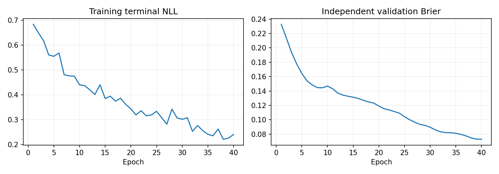
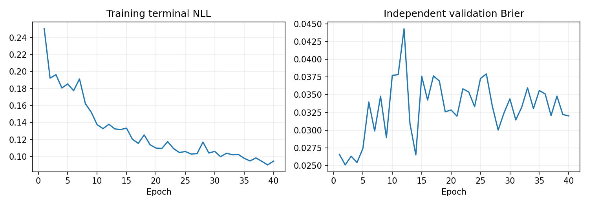
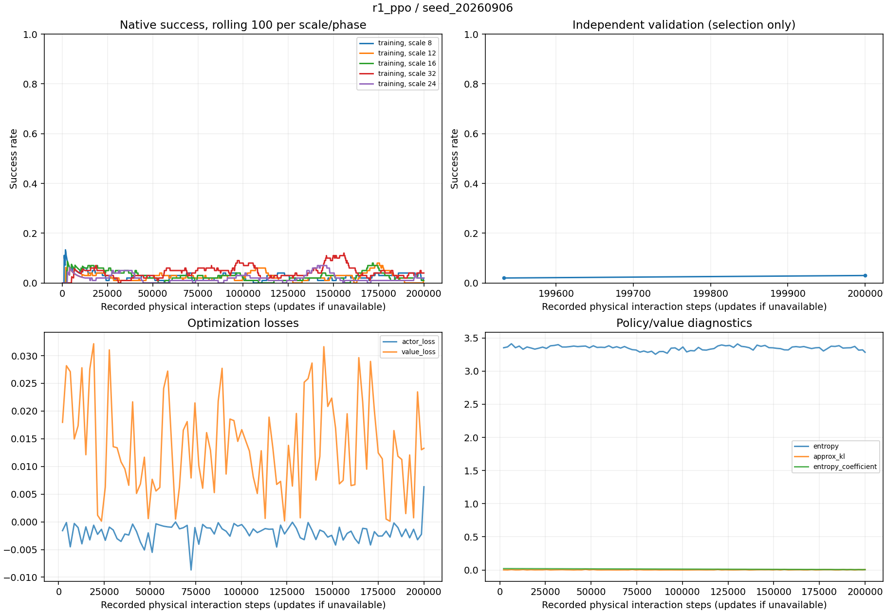
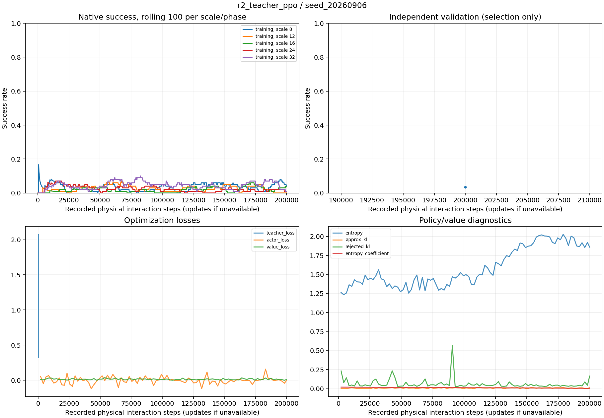
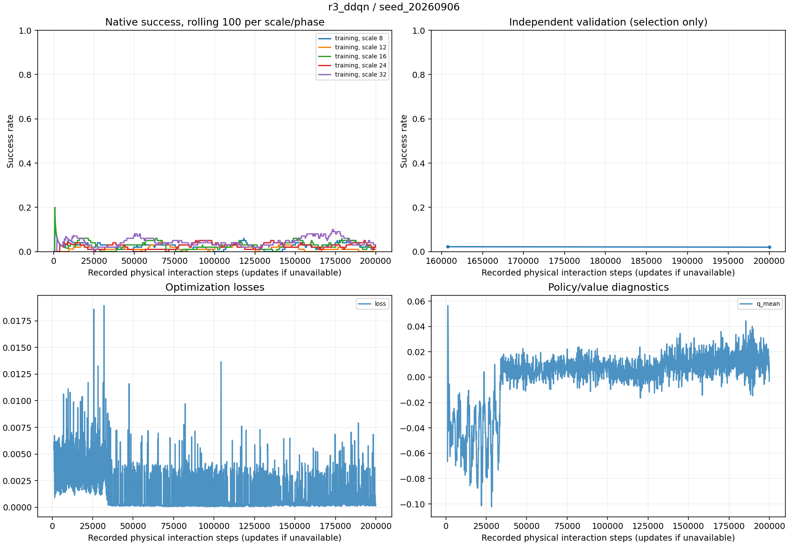

# v4：共享规则底层、直接学习与局部／全局价值搜索

实验日期：2026-09-06；归档日期：2026-09-08。固定预算训练与正式主比较已结束，保留负结果及有限诊断。

## 研究问题与具体方法

为隔离冻结学习底层迁移因素，所有上层改用同一个 `rule_group_v1`。研究人数配置是否足够，以及完整编组的全局续行价值是否能优于局部代理和直接策略学习。物理世界仍共享，不假设各组交战独立。

规则底层先为同目标小组分配互斥敌方接触责任，再按距离匹配成员与拦截对象。取消四人组上限；合法动作包含目标归属、同目标分区与后备。RL 从状态相关通用生成器的至多 32 个候选中选择，B2/B3 采用同一通用分区搜索、默认最多评分 64 个候选。

| 路线 | 训练／决策方法 |
|---|---|
| R1 PPO | 独立 actor/critic 对完整分组候选评分；128 维、4 头、2 层，8 环境采样，1,024 事件一批、minibatch 128、最多 4 epoch |
| R2 教师 PPO | 真实终局教师仅用于初始化，然后执行相同 PPO；平局不伪造唯一教师标签 |
| R3 Double DQN | online 选下一候选、target 估值，回放 TD 学习；真实终局不 bootstrap |
| B1 人数收益表＋枚举 | 用局部数据构建人数收益表，枚举人数配置，再固定规则解码成员身份 |
| B2 局部 S2＋搜索 | 新规则下单目标局部终局模型，按责任分解局部查询并用概率乘积作整体代理，引导通用搜索 |
| B3 全局 S2＋搜索 | 编码公开物理态势、旧组及完整候选，直接估计整场成功概率；同样搜索而非再训练 PPO |

共享准备阶段的全局数据计划为 120 母回合族、每族最多 3 状态／8 候选／4 配对分支；局部为 160 母回合族。每候选先执行一个事件，随后由固定规则上层续行至原生终局，标签为分支成功均值。按母回合族拆分训练、验证、测试；两个新 S2 均训练 40 epoch，依据验证 Brier 选模。

B3 以回合族加权 BCE 学习规则续行价值，没有排序损失或时间辅助目标；编码器含实体与组间关系，默认 128 维、4 头、每阶段 2 层，664,706 参数。B2 的局部概率聚合没有共享物理世界下的独立性保证；B3 在线重复自身搜索，也不同于标签里的后续规则策略。两者均属需验证的代理。

## 实际执行与主要结果

**研究问题。**在同一冻结规则红方底层、已知 reactive 蓝方、双目标和最多 50 步下，比较直接上层学习、人数分配及局部/全局续行评价。

**实现。**取消红方四人上限和固定手工候选表，加入通用身份分区搜索。源码版本 `20f233e`，文档版本 `21bec73`。三条 RL 各 200,000 物理步，训练种子 `20260906`；每个方法在 8、12、16、24、32 双方等人数场景各测试 100 局。16:51:42 全部完成，无任务报错。

| 方法 | 验证选优模型或固定策略 | 最后模型补充 |
|---|---:|---:|
| R1 PPO | 24/500（4.8%） | 同左 |
| R2 教师初始化 PPO | 22/500（4.4%） | 同左 |
| R3 Double DQN | 18/500（3.6%） | 25/500（5.0%） |
| B1 人数收益表＋枚举 | 19/500（3.8%） | 不适用 |
| B2 局部 S2＋搜索 | 20/500（4.0%） | 不适用 |
| B3 全局 S2＋搜索 | 0/500（0%） | 不适用 |
| 动态规则 | 13/500（2.6%） | 不适用 |
| 每目标大组 | 16/500（3.2%） | 不适用 |
| 固定规则组 | 15/500（3.0%） | 不适用 |
| 随机上层 | 15/500（3.0%） | 不适用 |

三条 RL 的初始化模型均为 13/500。PPO 相对规则增加 2.2 个百分点，配对 bootstrap 95% 区间为 0～4.6 个百分点；仅一个训练种子，不能据此宣称稳定优势。不能因 DDQN 的最后检查点测试更好，事后替换预先规定的验证选优口径。

证据：最终评估报告、逐规模原始汇总。

训练曲线：PPO、教师 PPO、DDQN、局部 S2、全局 S2。

### v4 的五项关键核查与原因证据

1. **分组确实能改变实际动作。**执行器先在同目标各组间分配互斥敌方接触责任，再在组内作距离匹配。实际 8 人例子中，八人一组改为四人两组，4 人的责任对象改变、2 人的离散动作改变。收益来源是责任边界改变，也可能限制可用匹配并使结果变差。
2. **全局 S2 使用终局软标签 BCE。**每候选四条配对分支成功均值，以回合族加权 BCE 训练；没有排序损失、MSE 或时间辅助损失。训练共 72 族、216 状态、1,673 条候选；159/216 状态全零，52/216 状态非平局；1,484/1,673 候选标签为零。验证 72 状态含 57 全零、15 非平局；测试 72 状态含 52 全零、18 非平局、2 全一。
3. **状态包含时间、目标生命值和完整物理实体。**输入双方位置、速度、生命值、当前/候选编组和时间。每 5 步事件由固定协议与 step 推出；对手、执行器和续行版本通过元数据锁定，不是可任意变化的模型输入。12 个历史变量扰动探针未改变后续物理状态及终局，但这不是对全部配置的马尔可夫性证明。
4. **B3 搜索包含当前规则方案。**预算 64 时 roots 为当前、规则、大组；完全同分保留先进入的当前方案，没有 epsilon 回退。实际五种规模首例中，全后备预测约 0.035，而规则约 0.032～0.033，属于评分偏好，不只是精确同分。正式 B3 的 436/500 局从未下达非空执行组；后备仍会按规则移动和原生开火，并非冻结物理运动。
5. **43/240 是分支向量改变，不是 43 次改善。**80 个回合族的 240 状态，四种方案各两条共同种子分支。按均值计为 42/240 状态改变；相对大组，单体组 19 好/14 差/207 平，二人组 7 好/9 差/224 平，规则组 14 好/12 差/214 平。合并方向为 27 仅改善、15 仅变差、1 均值相同但分支向量交换、197 完全相同。两个分支与同回合相关状态不足以证明小组普遍更优。

在相同留出状态中，局部 S2 的 Brier/ECE 为 0.0537/0.0541，非平局排序准确率 48.2%；全局 S2 为 0.0444/0.0182，排序准确率 44.7%。概率误差改善没有转化为候选选择能力。此轮更支持优先核查评价、候选覆盖和任务难度，而非直接延长训练。

证据：核查原始数据、实际八人与两组例子、B3 行为、跨评价器比较、分组诊断。完整旧核查稿已保存于 Git `dc6445e:v4五项关键问题核查.md`。

## 各检查点与逐规模结果

所有路线使用同一个规则执行器、已知对手及原生终局奖励。B1/B2/B3 使用共享准备阶段产出的支付模型；B1 没有伪造的策略训练曲线。

best 仅由独立验证选出；latest 与 initialized 单列。单个训练种子只能用于方向筛选。尚未完成的评估不能当作零胜率。

| 路线 | 种子 | 模型 | 规模 | 成功/局数 | 成功率 |
|---|---:|---|---:|---:|---:|
| b1_counts | 20260906 | policy | 8 | 3/100 | 3.0% |
| b1_counts | 20260906 | policy | 12 | 1/100 | 1.0% |
| b1_counts | 20260906 | policy | 16 | 0/100 | 0.0% |
| b1_counts | 20260906 | policy | 24 | 5/100 | 5.0% |
| b1_counts | 20260906 | policy | 32 | 10/100 | 10.0% |
| b2_local | 20260906 | policy | 8 | 6/100 | 6.0% |
| b2_local | 20260906 | policy | 12 | 1/100 | 1.0% |
| b2_local | 20260906 | policy | 16 | 4/100 | 4.0% |
| b2_local | 20260906 | policy | 24 | 6/100 | 6.0% |
| b2_local | 20260906 | policy | 32 | 3/100 | 3.0% |
| b3_global | 20260906 | policy | 8 | 0/100 | 0.0% |
| b3_global | 20260906 | policy | 12 | 0/100 | 0.0% |
| b3_global | 20260906 | policy | 16 | 0/100 | 0.0% |
| b3_global | 20260906 | policy | 24 | 0/100 | 0.0% |
| b3_global | 20260906 | policy | 32 | 0/100 | 0.0% |
| grand | 20260906 | policy | 8 | 1/100 | 1.0% |
| grand | 20260906 | policy | 12 | 4/100 | 4.0% |
| grand | 20260906 | policy | 16 | 4/100 | 4.0% |
| grand | 20260906 | policy | 24 | 1/100 | 1.0% |
| grand | 20260906 | policy | 32 | 6/100 | 6.0% |
| r1_ppo | 20260906 | best | 8 | 6/100 | 6.0% |
| r1_ppo | 20260906 | best | 12 | 3/100 | 3.0% |
| r1_ppo | 20260906 | best | 16 | 6/100 | 6.0% |
| r1_ppo | 20260906 | best | 24 | 7/100 | 7.0% |
| r1_ppo | 20260906 | best | 32 | 2/100 | 2.0% |
| r1_ppo | 20260906 | latest | 8 | 6/100 | 6.0% |
| r1_ppo | 20260906 | latest | 12 | 3/100 | 3.0% |
| r1_ppo | 20260906 | latest | 16 | 6/100 | 6.0% |
| r1_ppo | 20260906 | latest | 24 | 7/100 | 7.0% |
| r1_ppo | 20260906 | latest | 32 | 2/100 | 2.0% |
| r1_ppo | 20260906 | initialized | 8 | 4/100 | 4.0% |
| r1_ppo | 20260906 | initialized | 12 | 2/100 | 2.0% |
| r1_ppo | 20260906 | initialized | 16 | 1/100 | 1.0% |
| r1_ppo | 20260906 | initialized | 24 | 4/100 | 4.0% |
| r1_ppo | 20260906 | initialized | 32 | 2/100 | 2.0% |
| r2_teacher_ppo | 20260906 | best | 8 | 5/100 | 5.0% |
| r2_teacher_ppo | 20260906 | best | 12 | 3/100 | 3.0% |
| r2_teacher_ppo | 20260906 | best | 16 | 4/100 | 4.0% |
| r2_teacher_ppo | 20260906 | best | 24 | 5/100 | 5.0% |
| r2_teacher_ppo | 20260906 | best | 32 | 5/100 | 5.0% |
| r2_teacher_ppo | 20260906 | latest | 8 | 5/100 | 5.0% |
| r2_teacher_ppo | 20260906 | latest | 12 | 3/100 | 3.0% |
| r2_teacher_ppo | 20260906 | latest | 16 | 4/100 | 4.0% |
| r2_teacher_ppo | 20260906 | latest | 24 | 5/100 | 5.0% |
| r2_teacher_ppo | 20260906 | latest | 32 | 5/100 | 5.0% |
| r2_teacher_ppo | 20260906 | initialized | 8 | 4/100 | 4.0% |
| r2_teacher_ppo | 20260906 | initialized | 12 | 2/100 | 2.0% |
| r2_teacher_ppo | 20260906 | initialized | 16 | 1/100 | 1.0% |
| r2_teacher_ppo | 20260906 | initialized | 24 | 4/100 | 4.0% |
| r2_teacher_ppo | 20260906 | initialized | 32 | 2/100 | 2.0% |
| r3_ddqn | 20260906 | best | 8 | 5/100 | 5.0% |
| r3_ddqn | 20260906 | best | 12 | 2/100 | 2.0% |
| r3_ddqn | 20260906 | best | 16 | 2/100 | 2.0% |
| r3_ddqn | 20260906 | best | 24 | 5/100 | 5.0% |
| r3_ddqn | 20260906 | best | 32 | 4/100 | 4.0% |
| r3_ddqn | 20260906 | latest | 8 | 4/100 | 4.0% |
| r3_ddqn | 20260906 | latest | 12 | 2/100 | 2.0% |
| r3_ddqn | 20260906 | latest | 16 | 5/100 | 5.0% |
| r3_ddqn | 20260906 | latest | 24 | 8/100 | 8.0% |
| r3_ddqn | 20260906 | latest | 32 | 6/100 | 6.0% |
| r3_ddqn | 20260906 | initialized | 8 | 4/100 | 4.0% |
| r3_ddqn | 20260906 | initialized | 12 | 2/100 | 2.0% |
| r3_ddqn | 20260906 | initialized | 16 | 1/100 | 1.0% |
| r3_ddqn | 20260906 | initialized | 24 | 4/100 | 4.0% |
| r3_ddqn | 20260906 | initialized | 32 | 2/100 | 2.0% |
| random | 20260906 | policy | 8 | 7/100 | 7.0% |
| random | 20260906 | policy | 12 | 2/100 | 2.0% |
| random | 20260906 | policy | 16 | 1/100 | 1.0% |
| random | 20260906 | policy | 24 | 0/100 | 0.0% |
| random | 20260906 | policy | 32 | 5/100 | 5.0% |
| rule | 20260906 | policy | 8 | 6/100 | 6.0% |
| rule | 20260906 | policy | 12 | 1/100 | 1.0% |
| rule | 20260906 | policy | 16 | 3/100 | 3.0% |
| rule | 20260906 | policy | 24 | 2/100 | 2.0% |
| rule | 20260906 | policy | 32 | 1/100 | 1.0% |
| static_rule | 20260906 | policy | 8 | 3/100 | 3.0% |
| static_rule | 20260906 | policy | 12 | 1/100 | 1.0% |
| static_rule | 20260906 | policy | 16 | 2/100 | 2.0% |
| static_rule | 20260906 | policy | 24 | 2/100 | 2.0% |
| static_rule | 20260906 | policy | 32 | 7/100 | 7.0% |

## 与规则上层的配对比较

以相同训练种子对应的相同测试开局配对；下表区间为局级配对 bootstrap，不能替代跨训练种子不确定性。

| 路线 | 种子 | 模型 | 配对局数 | 胜率差（百分点） | 95% 区间 |
|---|---:|---|---:|---:|---|
| b1_counts | 20260906 | policy | 500 | +1.2 | -1.0, +3.4 |
| b2_local | 20260906 | policy | 500 | +1.4 | -0.6, +3.6 |
| b3_global | 20260906 | policy | 500 | -2.6 | -4.0, -1.2 |
| grand | 20260906 | policy | 500 | +0.6 | -1.4, +2.8 |
| r1_ppo | 20260906 | best | 500 | +2.2 | +0.0, +4.6 |
| r1_ppo | 20260906 | initialized | 500 | +0.0 | -1.8, +1.8 |
| r1_ppo | 20260906 | latest | 500 | +2.2 | +0.0, +4.6 |
| r2_teacher_ppo | 20260906 | best | 500 | +1.8 | -0.2, +3.8 |
| r2_teacher_ppo | 20260906 | initialized | 500 | +0.0 | -1.8, +1.8 |
| r2_teacher_ppo | 20260906 | latest | 500 | +1.8 | -0.2, +3.8 |
| r3_ddqn | 20260906 | best | 500 | +1.0 | -1.0, +3.0 |
| r3_ddqn | 20260906 | initialized | 500 | +0.0 | -1.8, +1.8 |
| r3_ddqn | 20260906 | latest | 500 | +2.4 | +0.4, +4.6 |
| random | 20260906 | policy | 500 | +0.4 | -1.4, +2.4 |
| static_rule | 20260906 | policy | 500 | +0.4 | -1.4, +2.4 |

逐局数据位于各路线 seed 目录的 evaluation.jsonl；训练曲线位于 training_curves.png。

S2 的训练与留出审计位于 shared；模型训练成本与实际执行交互成本须分别报告。

## 训练与验证图

## 文献及适配关系

| 来源 | 与本版的关系 |
|---|---|
| [PPO](https://arxiv.org/abs/1707.06347)、[Double DQN](https://arxiv.org/abs/1509.06461) | R1/R2/R3 的学习机制；候选分组接口为项目适配 |
| [Online Learning in Budget-Constrained Dynamic Colonel Blotto Games](https://arxiv.org/abs/2103.12833)、[Colonel Blotto with Battlefield Games](https://ojs.aaai.org/index.php/AAAI/article/view/38702) | 资源配置与局部收益的建模参考；本版不是双边均衡求解，不继承其理论保证 |
| [Hypergraph Neural Networks for Coalition Formation](https://www.mdpi.com/1999-4893/18/11/724)、[Overlapping Coalition Formation 相关研究](https://www.mdpi.com/2504-446X/9/12/837) | 联盟价值预测结合搜索的相关工作；不表示代码或实验原样复现 |
| [ALMA](https://proceedings.neurips.cc/paper_files/paper/2022/file/2f27964513a28d034530bfdd117ea31d-Paper-Conference.pdf)、[NeuRewriter](https://proceedings.neurips.cc/paper/2019/hash/131f383b434fdf48079bff1e44e2d9a5-Abstract.html) | 层次分配／选择修改区域的研究背景，不是本版六路线均逐一复现的算法 |

## 结论与证据位置

全局价值模型概率指标较好，但非平局候选排序与实际决策未改善，B3 0/500 是明确负结果；B3 没有后续 PPO 阶段，不能用等待 PPO 训练解释。其余方法在单种子下的小幅胜率差不足以建立稳健结论。全后备偏好、正例稀缺与规则续行分布差异均有相关证据或合理疑点，但未完成的机制消融不能写成已证实原因。

[配置快照](Open-SCORE/outputs/v4/config.json)、[共享数据](Open-SCORE/outputs/v4/shared/data.sqlite) 与各路线数据和权重原位保留。方法来源为 Git `dc6445e` 的 `固定对手下动态分组研究方案_v4.md`、`当前总体方案_v4_方法与实验说明.md`、`v4五项关键问题核查.md`；当时方案内尚在运行的数字由本报告最终表取代。额外消融的短链路执行不算当前预算下的正式消融完成。本次没有新增实验。
